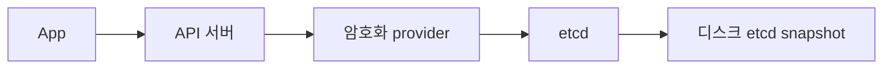

# Secret 암호화

Kubernetes의 `Secret`은 기본적으로 **base64 인코딩**일 뿐이며 etcd에는
**평문**으로 저장된다. EncryptionConfiguration으로 etcd 저장 시점의 암호화
(encryption at rest)를 활성화해야 etcd 백업·디스크 탈취 시 노출을 막을
수 있다.

EKS·GKE 같은 관리형은 기본 envelope 암호화를 제공하지만, **자체 KMS 통합
또는 자체 키 회전** 책임은 운영자에게 남는다. 자체 호스팅·온프레는 활성화
자체가 운영자 책임이다.

운영 관점 핵심 질문은 다섯 가지다.

1. **어떤 provider를 쓰나** — `identity`/`aescbc`/`aesgcm`/`secretbox`/`kms`
2. **로컬 키 vs KMS 트레이드오프**
3. **활성화 후 기존 Secret은 어떻게 재암호화하나** — `kubectl replace`
4. **키 회전 절차는 무엇인가** — providers 순서·재암호화·구키 제거
5. **KMS 장애 시 클러스터는 어떻게 되나** — 캐시·circuit breaker

> 관련: [ServiceAccount](./serviceaccount.md) (외부 IAM 토큰 발급)
> · [Audit Logging](./audit-logging.md)
> · `security/` 카테고리의 외부 시크릿 도구(Vault, ESO, SOPS)는 별도

---

## 1. 위협 모델과 보호 범위



| 보호 대상 | EncryptionConfiguration이 막나 |
|---|:-:|
| etcd 디스크 탈취 / 백업 노출 | ✓ |
| etcd 노드 OS 권한 탈취 (etcdctl 사용 가능) | △ (KMS면 ✓) |
| API 서버 메모리 덤프 | ✗ |
| `kubectl get secret -o yaml` 권한자 | ✗ |
| 컨테이너 내부의 환경 변수·파일 | ✗ |

**전제**: API 서버는 항상 평문을 다룬다. RBAC·Audit Logging이 함께 있어야
의미가 있다. 또한 etcd 자체에 TLS·디스크 암호화(LUKS 등)도 별도 적용 권장.

---

## 2. EncryptionConfiguration

`kube-apiserver`에 `--encryption-provider-config=<path>` 플래그로 전달.

```yaml
apiVersion: apiserver.config.k8s.io/v1
kind: EncryptionConfiguration
resources:
  - resources:
      - secrets
      - configmaps
      - "*.example.com"   # CRD도 가능
    providers:
      - aescbc:
          keys:
            - name: key2026a
              secret: <base64 32바이트>
      - identity: {}
```

| 필드 | 의미 |
|---|---|
| `resources[*].resources` | 암호화 대상 리소스 타입. `secrets`, `configmaps`, `"*.<group>"` |
| `providers[*]` | 순서가 중요. **첫 번째**가 새 데이터의 암호화에 사용, 나머지는 복호화 fallback |

> **첫 번째에 `identity`를 두면 평문 저장**된다. 신규 클러스터의 단계적
> 활성화 시 `identity → aescbc` 순으로 두면 활성 전, `aescbc → identity`로
> 전환 후 재암호화하면 활성된다.

### 5종 provider

| Provider | 알고리즘 | 키 관리 | 비고 |
|---|---|---|---|
| `identity` | 없음 (평문) | — | 기본값. 마이그레이션·롤백용 |
| `secretbox` | XSalsa20 + Poly1305 | 클러스터 로컬 32B 키 | 빠름. 단일 키. AEAD |
| `aescbc` | AES-CBC + HMAC-SHA-256 | 동일 | **권장 안 함**. padding oracle 공격 위험 (kubernetes/kubernetes#73514, 공식 문서 경고) |
| `aesgcm` | AES-GCM 256 | 동일 | 빠름. **키를 매우 자주 회전해야 안전** (nonce 재사용 위험) |
| `kms` | DEK(envelope) + KEK(원격) | KMS plugin (v1 deprecated, **v2 GA**) | 외부 KMS에 KEK 저장. 회전·감사 분리 |

### 권장

- **자체 키 관리 가능**: `secretbox` (가장 단순)
- **클라우드·HSM 환경**: `kms` (v2)
- `aescbc`/`aesgcm`은 운영 부담만 추가되므로 권장하지 않는다

---

## 3. KMS v2 (KEP-3299)

KMS provider는 **envelope encryption**을 사용한다. 데이터(Secret 본문)는
DEK로 암호화되고, DEK 자체는 외부 KMS의 KEK로 암호화돼 etcd에 함께 저장
된다. API 서버는 KEK를 본 적이 없다.

### v1과 v2

| 항목 | v1 | v2 |
|---|---|---|
| 도입 | v1.10 | v1.25 Alpha → v1.27 Beta → **v1.29 GA** |
| API 호출 | Secret마다 KMS 호출 | DEK 캐싱 + plugin 폴링으로 호출 수 급감 |
| key ID 관리 | 키 변경 시 모든 데이터 재암호화 필요 | DEK 캐싱 + 자동 키 ID 추적 |
| 시작 시간 | 큰 클러스터에서 직렬 복호화로 분 단위 지연 | 병렬화로 큰 폭 개선 |
| 상태 | **v1.28 deprecated, v1.29부터 기본 비활성** | 표준 |

신규 클러스터는 **v2만 사용**한다.

### v2 설정

```yaml
providers:
  - kms:
      apiVersion: v2          # v2 명시
      name: aws-kms
      endpoint: unix:///var/run/kmsplugin/socket.sock
      timeout: 3s
      cachesize: 1000         # v2는 무제한, 명시는 호환성
```

KMS plugin은 별도 프로세스(또는 sidecar/static pod)로 실행되며 unix socket
으로 API 서버와 통신한다. 클라우드별:

| 환경 | plugin |
|---|---|
| AWS | `aws-encryption-provider` (KMS·CloudHSM) |
| GCP | `k8s-cloudkms-plugin` |
| Azure | `kubernetes-kms` |
| HashiCorp Vault | `vault-kubernetes-kms` (커뮤니티) |
| 온프레 HSM | `k8s-kms-plugin` (Thales 등) |

### KMS 장애 영향

API 서버가 KMS plugin과 통신 불가 시:

- **읽기**(`kubectl get secret`): 캐시된 DEK가 있으면 성공, 없으면 실패
- **쓰기**(신규 Secret): 실패. 신규 DEK 생성에 KMS 호출 필요
- **API 서버 재시작 후**: 캐시 비어있어 KMS 복구 전까지 대규모 영향

대응:
- KMS plugin을 노드 로컬 sidecar로 배치 (네트워크 의존성 최소화)
- KMS 자체에 HA(다중 가용 영역)
- 헬스체크 + circuit breaker로 plugin 자동 재시작

---

## 4. 활성화 절차

### 1단계: 키 생성 + 설정 작성

```bash
# 32B 키 생성
head -c 32 /dev/urandom | base64
```

```yaml
# /etc/kubernetes/encryption-config.yaml
apiVersion: apiserver.config.k8s.io/v1
kind: EncryptionConfiguration
resources:
  - resources: [secrets]
    providers:
      - secretbox:
          keys:
            - name: key1
              secret: <base64-32B>
      - identity: {}
```

### 2단계: kube-apiserver 플래그 추가

```yaml
- --encryption-provider-config=/etc/kubernetes/encryption-config.yaml
- --encryption-provider-config-automatic-reload=true   # v1.32 GA
```

API 서버가 여러 대(HA)면 모두 동일 설정 + 동일 키를 가져야 한다. 한 대만
업데이트되면 그 노드가 만든 데이터를 다른 노드는 못 읽는다.

kubeadm의 경우 `/etc/kubernetes/manifests/kube-apiserver.yaml` static pod
매니페스트의 `volumes`/`volumeMounts`에 설정 파일 경로를 추가해야 한다.
kubelet이 매니페스트 변경을 감지해 자동 재시작.

### 3단계: 기존 Secret 재암호화

활성화는 **신규 쓰기에만** 적용된다. 기존 Secret은 다음 명령으로 강제
재기록한다.

```bash
kubectl get secrets --all-namespaces -o json \
  | kubectl replace -f -
```

대규모 클러스터에서는 네임스페이스별로 나눠 점진 실행한다. 한 번에 모든
Secret을 replace하면 watch 이벤트 폭주·controller reconcile 폭주가
발생하므로 야간·점진 실행 권장. 도중 중단되어도 옛 키가 providers에 남아
있는 한 안전하며 재시도 시 `resourceVersion` 충돌이 자동 처리된다.

### 4단계: 검증

```bash
# 노드에 직접 접근해 etcd에서 raw 값 확인 (예: kubeadm)
ETCDCTL_API=3 etcdctl \
  --cert /etc/kubernetes/pki/etcd/server.crt \
  --key /etc/kubernetes/pki/etcd/server.key \
  --cacert /etc/kubernetes/pki/etcd/ca.crt \
  get /registry/secrets/default/<name> | hexdump -C | head
```

암호화되어 있으면 시작 부분이 prefix로 시작한다.

| Provider | Prefix |
|---|---|
| `secretbox`, `aescbc`, `aesgcm` | `k8s:enc:<provider>:v1:<keyName>:` + 바이너리 |
| `kms` v2 | `k8s:enc:kms:v2:<keyName>:` + protobuf 페이로드 |

---

## 5. 키 회전

### 수동 회전 (provider 순서 변경)

```yaml
# Step 1: 새 키 추가, 옛날 키는 두 번째로 (복호화용)
providers:
  - secretbox:
      keys:
        - name: key2     # 새 키, 첫 번째 = 암호화에 사용
          secret: <new>
        - name: key1     # 옛날 키, 복호화 fallback
          secret: <old>
```

```bash
# Step 2: 모든 Secret 재암호화 (새 키로 다시 쓰기)
kubectl get secrets -A -o json | kubectl replace -f -

# Step 3: 옛날 키 제거
```

```yaml
providers:
  - secretbox:
      keys:
        - name: key2
          secret: <new>
```

### KMS v2의 자동 회전

KMS v2는 plugin이 보고하는 **key ID 변경을 신호로 새 DEK를 생성**한다
(매 요청마다가 아니라 캐시 + key ID 추적). KEK 자체의 회전은 KMS 측
정책에 따른다(예: AWS KMS의 자동 연간 회전).

KEK 회전 시 API 서버는 새 key ID를 인지하고 후속 쓰기에 새 DEK를 사용
한다. 기존 데이터의 강제 재암호화는 위와 동일한 `kubectl replace` 패턴이
안전하다.

### 회전 주기

| 키 종류 | 권장 주기 |
|---|---|
| 로컬 keys (secretbox) | 분기 1회 (또는 사고 시) |
| KMS KEK | 90일 (NIST·CIS 권고) |
| KMS DEK (v2) | 자동 |

---

## 6. 동적 reload

`--encryption-provider-config-automatic-reload=true` 플래그는 설정 파일
변경 시 **API 서버 재시작 없이** 새 키 세트를 반영한다.

- v1.26: 플래그 도입 (KMSv2 hot reload와 동시)
- v1.29: 폴링 방식 개선 (1분 주기 폴링으로 watch 부담 감소)

활성 시 자동 reload되며, 잘못된 설정으로 reload 실패하면 기존 설정을 유지
한다. 메트릭으로 검증.

| 메트릭 | 의미 |
|---|---|
| `apiserver_encryption_config_controller_automatic_reload_success_total` | 성공 누적 |
| `apiserver_encryption_config_controller_automatic_reload_failure_total` | 실패 누적 |
| `apiserver_storage_envelope_transformation_cache_misses_total` | KMS 캐시 미스 |

---

## 7. 어떤 리소스를 암호화하나

`secrets`만이 아니다. 민감 데이터를 담는 Custom Resource도 암호화 대상으로
지정 가능하다.

```yaml
resources:
  - resources:
      - secrets
      - configmaps
      - oauthclients.config.openshift.io
      - "*.cert-manager.io"     # 그룹 와일드카드
  - resources:
      - "*."                    # 모든 코어 그룹
  - resources:
      - "*.*"                   # 모든 리소스 (성능 영향 큼)
```

리소스 그룹별로 다른 provider를 쓸 수도 있다. 예: 일반 Secret은 secretbox,
민감 CR은 KMS.

성능 트레이드오프:
- `secrets`만 암호화: 영향 무시 가능
- `configmaps` 추가: 큰 영향 없음(빈도 낮음)
- 모든 리소스(`*.*`): API 서버 CPU·etcd 트래픽 모두 증가

---

## 8. 외부 시크릿 관리와의 관계

EncryptionConfiguration은 **etcd 저장 시점**의 보호다. 운영자는 다음 두
질문을 별도로 답해야 한다.

1. **시크릿이 처음 어떻게 생성되나** — Git 커밋, 사람 입력, 외부 시스템?
2. **회전·라이프사이클은 누가 관리하나** — 수동, 외부 시스템, GitOps?

| 도구 | 책임 영역 | 카테고리 |
|---|---|---|
| EncryptionConfiguration | **etcd 저장 보호** | `kubernetes/`(이 글) |
| HashiCorp Vault | 외부 시크릿 발급·동적 회전 | `security/` |
| External Secrets Operator (ESO) | Vault·AWS SM·GCP SM의 시크릿을 K8s Secret으로 동기화 | `security/` |
| Sealed Secrets | Git에 암호화된 시크릿 커밋 | `security/` |
| SOPS | YAML/JSON 파일 단위 암호화 | `security/` |

**조합 예**: ESO로 Vault에서 동기화된 Secret이 K8s에 들어오고, 그 Secret이
KMS provider로 etcd에 다시 암호화 저장. 두 레이어가 모두 필요하다.

도구 자체의 운영은 `security/secrets-management/`에서 다룬다(예정).

---

## 9. 최근 변경 (v1.29 ~ v1.35)

| 버전 | 변경 | 영향 |
|---|---|---|
| v1.26 | auto-reload 플래그 도입 | KMSv2 hot reload와 동시 |
| v1.27 Beta | KMS v2 Beta | DEK 캐싱·성능 개선 |
| v1.28 | KMS v1 **deprecated** | 마이그레이션 시작 |
| v1.29 GA | KMS v2 GA, **KMS v1 기본 비활성** | feature gate `KMSv1` 명시 활성 필요 |
| v1.29 | auto-reload 폴링 개선 | watch → 1분 폴링으로 부담 감소 |

> 2026-04-23 시점 KMS v1을 쓰는 클러스터는 **즉시 마이그레이션**해야 한다.
> v1.29+에서는 feature gate로 명시 활성하지 않으면 동작하지 않는다. 제거
> 시점은 공식 KEP에 미정 — 신규 사용은 금지.

---

## 10. 운영 체크리스트

**활성화**
- [ ] EncryptionConfiguration이 모든 API 서버 노드에서 동일한가
- [ ] `--encryption-provider-config-automatic-reload`가 활성인가
- [ ] 첫 번째 provider가 `identity`가 아닌가
- [ ] 활성화 후 모든 기존 Secret이 재암호화됐는가

**provider 선택**
- [ ] 자체 키 관리면 `secretbox`, 외부 키 관리면 `kms` v2를 사용하는가
- [ ] KMS plugin이 노드 로컬에서 동작하는가 (네트워크 의존성 최소화)
- [ ] KMS가 다중 AZ에서 HA 구성됐는가

**키 회전**
- [ ] 로컬 키 회전 절차가 문서화돼 있고 분기 1회 실행되는가
- [ ] KMS KEK가 90일 이내 회전 정책에 묶여 있는가
- [ ] 키 회전 후 모든 Secret 재암호화가 검증됐는가

**감사·모니터링**
- [ ] etcd에서 `k8s:enc:` prefix가 모든 Secret 값에 존재하는가
- [ ] auto-reload 메트릭(success/failure)이 수집되는가
- [ ] KMS plugin healthcheck가 모니터되는가

**상위 통제**
- [ ] etcd 디스크 자체에 LUKS 등 디스크 암호화가 적용됐는가
- [ ] etcd 백업 보관소도 암호화·접근 제어가 적용됐는가
- [ ] etcd snapshot 복원 시점에 쓰였던 모든 키가 현재 providers에 존재하는가
- [ ] RBAC으로 `secrets` `get`/`list`/`watch` 주체가 최소화됐는가
  (참고: [RBAC](./rbac.md) §9)

---

## 11. 트러블슈팅

### 활성화는 했는데 etcd에 평문이 있다

기존 Secret은 자동 재암호화되지 않는다. `kubectl replace` 패턴 적용 필요.
`/registry/secrets/...` 경로의 raw 값을 etcdctl로 점검.

### HA API 서버 중 일부에서 Secret이 안 읽힌다

설정 파일 또는 키 자체가 노드 간 다르다. 모든 API 서버 노드에 동일 파일·
키가 있어야 한다. GitOps로 파일 일관성을 강제하고 SSH 직접 수정 금지.

### KMS plugin 시작 실패로 API 서버가 안 뜬다

API 서버는 KMS plugin과 통신 가능해야 시작이 정상 완료된다. plugin이
sidecar라면 시작 순서·헬스체크 확인. 임시로 `identity`로 fallback해 운영
복구 후 재진입.

### 키 회전 후 옛 Secret이 안 읽힌다

`providers` 배열에 옛날 키를 **두 번째 이후**에 남겨야 한다. 옛 키를
제거하기 전에 반드시 모든 Secret 재암호화 + etcd 백업 검증.

### v1.29 업그레이드 후 Secret 접근 실패

KMS v1 사용 중이었다면 기본 비활성으로 막힌다. `KMSv1` feature gate를
임시 활성하고 즉시 v2로 마이그레이션.

### auto-reload 실패

`apiserver_encryption_config_controller_automatic_reload_failure_total`
가 증가. API 서버 로그에서 파싱 오류·키 형식 오류 확인. 잘못된 설정은
무시되고 기존 설정이 유지되므로 안전하지만 변경이 반영되지 않는다.

---

## 참고 자료

- [Encrypting Confidential Data at Rest — Kubernetes](https://kubernetes.io/docs/tasks/administer-cluster/encrypt-data/) — 2026-04-23 확인
- [Using a KMS provider for data encryption](https://kubernetes.io/docs/tasks/administer-cluster/kms-provider/) — 2026-04-23 확인
- [KEP-3299 KMS v2 Improvements](https://github.com/kubernetes/enhancements/tree/master/keps/sig-auth/3299-kms-v2-improvements) — 2026-04-23 확인
- [KMS v2 Moves to Beta — Kubernetes Blog](https://kubernetes.io/blog/2023/05/16/kms-v2-moves-to-beta/) — 2026-04-23 확인
- [kube-apiserver Configuration v1](https://kubernetes.io/docs/reference/config-api/apiserver-config.v1/) — 2026-04-23 확인
- [aws-encryption-provider — AWS](https://github.com/kubernetes-sigs/aws-encryption-provider) — 2026-04-23 확인
- [k8s-cloudkms-plugin — GCP](https://github.com/GoogleCloudPlatform/k8s-cloudkms-plugin) — 2026-04-23 확인
- [kubernetes-kms — Azure](https://github.com/Azure/kubernetes-kms) — 2026-04-23 확인
- [vault-kubernetes-kms](https://github.com/FalcoSuessgott/vault-kubernetes-kms) — 2026-04-23 확인
- [k8s-kms-plugin — Thales](https://github.com/ThalesGroup/k8s-kms-plugin) — 2026-04-23 확인
- [NSA/CISA Kubernetes Hardening Guide](https://www.cisa.gov/news-events/cybersecurity-advisories/aa22-238a) — 2026-04-23 확인
- [CIS Kubernetes Benchmark](https://www.cisecurity.org/benchmark/kubernetes) — 2026-04-23 확인
