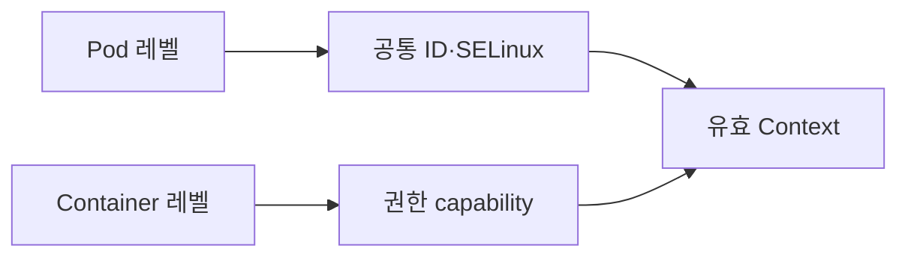

# Security Context

Security Context는 **파드와 컨테이너의 Linux 보안 속성**을 선언하는 필드다.
[Pod Security Admission](./pod-security-admission.md)이 "정책으로 강제하는
경계"라면, Security Context는 "워크로드가 실제로 채우는 값"이다.

핵심 6가지 결정:

1. 어떤 **사용자/그룹**으로 실행하나 (`runAsUser`, `runAsNonRoot`)
2. 어떤 **Linux capability**를 갖나 (`drop`/`add`)
3. **syscall 필터**는 무엇인가 (`seccompProfile`)
4. **MAC**(AppArmor·SELinux) 프로파일은
5. **권한 상승**과 root 파일시스템 잠금은 (`allowPrivilegeEscalation`,
   `readOnlyRootFilesystem`)
6. **User Namespace**로 격리하나 (`hostUsers: false`, v1.33 기본)

> 관련: [Pod Security Admission](./pod-security-admission.md)
> · [RBAC](./rbac.md) · [ServiceAccount](./serviceaccount.md)

---

## 1. 두 레벨



| 레벨 | 위치 | 적용 범위 |
|---|---|---|
| Pod | `spec.securityContext` | 모든 컨테이너 + Volume 일부 |
| Container | `spec.containers[*].securityContext` | 해당 컨테이너만 |

**상속 규칙은 필드마다 다르다**. 일부는 Pod 값이 컨테이너에 자동 적용되고
일부는 그렇지 않다. 모호함을 피하려면 보안 핵심 필드는 **컨테이너에 명시**
한다.

| 필드 | Pod에서 가능 | Container에서 가능 | 컨테이너 미지정 시 Pod 상속 |
|---|:-:|:-:|:-:|
| `runAsUser` / `runAsGroup` | ✓ | ✓ | ✓ |
| `runAsNonRoot` | ✓ | ✓ | ✓ |
| `fsGroup` / `supplementalGroups` | ✓ | ✗ | (볼륨 적용) |
| `seccompProfile` | ✓ | ✓ | ✓ |
| `seLinuxOptions` | ✓ | ✓ | ✓ |
| `appArmorProfile` (v1.30 GA) | ✓ | ✓ | ✓ |
| `sysctls` | ✓ | ✗ | — |
| `hostUsers` | ✓ | ✗ | — |
| `privileged` | ✗ | ✓ | — |
| `allowPrivilegeEscalation` | ✗ | ✓ | — |
| `capabilities` | ✗ | ✓ | — |
| `readOnlyRootFilesystem` | ✗ | ✓ | — |
| `procMount` | ✗ | ✓ | — |

---

## 2. 사용자·그룹

### `runAsUser` / `runAsGroup`

컨테이너 프로세스의 UID/GID를 강제한다. 미지정이면 이미지 `Dockerfile`의
`USER`(기본 0)를 따른다.

```yaml
spec:
  securityContext:
    runAsUser: 10001
    runAsGroup: 10001
    fsGroup: 10001
```

### `runAsNonRoot`

`true`이면 kubelet이 **컨테이너 시작 직전에 UID 0 여부를 검증**해 거절한다.
`runAsUser`를 명시하지 않아도 이미지의 `USER 0`을 막을 수 있다.

`runAsNonRoot: true`와 `runAsUser: 0`을 **동시에 지정**하면 둘은 양립
불가능해 kubelet이 `CreateContainerConfigError`로 시작을 거절한다(어느
한쪽이 이기는 것이 아니다).

> 함정: `runAsUser: 1000`이라도 이미지 EntryPoint가 `setuid(0)`을 시도하면
> 거절되지 않는다(시작 시점만 검증). 신뢰 못 할 이미지에는 capabilities
> 와 `allowPrivilegeEscalation: false`를 함께 적용해야 안전하다.

### `fsGroup` vs `supplementalGroups`

| 필드 | 의미 | 적용 |
|---|---|---|
| `fsGroup` | 볼륨 마운트 권한을 가질 GID. kubelet이 볼륨 소유권을 변경 | `emptyDir`, `csi`, `persistentVolumeClaim` 등 |
| `supplementalGroups` | 컨테이너 프로세스의 추가 GID 목록 | 모든 파일 접근 |
| `fsGroupChangePolicy` | `OnRootMismatch`(권장) 또는 `Always` | 큰 볼륨 chown 비용 절감 |

대용량 PV에서 `fsGroup`이 매번 chown으로 분 단위 지연을 만들 수 있다.
`fsGroupChangePolicy: OnRootMismatch`는 루트 디렉터리만 검사해 첫 마운트
이후 비용을 0에 가깝게 한다.

### Image vs Pod의 UID 충돌

CIS Benchmark 권고: 이미지에 `USER`를 명시하고, Pod에는 `runAsNonRoot: true`
만 두는 것이 가장 변경에 강하다. 이미지 빌드 시점에 UID가 명확하면 보안
스캐너·런타임 검증 모두 일치한다.

---

## 3. Linux Capabilities

리눅스 root 권한은 **41개의 capability로 분해**된다(Linux 6.x 기준,
`CAP_LAST_CAP=40` → 0~40번). 컨테이너는 기본적으로 일부 capability를
가지므로, 보안 출발점은 **전부 드롭**한 뒤 필요한 것만 더하는 것이다.

```yaml
containers:
  - name: app
    securityContext:
      capabilities:
        drop: ["ALL"]
        add: ["NET_BIND_SERVICE"]
```

### 자주 쓰는 capability

| capability | 용도 | 대안 |
|---|---|---|
| `NET_BIND_SERVICE` | 1024 미만 포트 바인딩 | 8080 등 비특권 포트 사용 |
| `SYS_TIME` | 시스템 시계 변경 | NTP 사이드카 분리 |
| `SYS_PTRACE` | 다른 프로세스 디버깅 | ephemeral debug 컨테이너 |
| `NET_ADMIN` | 네트워크 인터페이스 조작 | CNI 플러그인이 처리 |
| `SYS_ADMIN` | **광범위 root 등가** | 거의 항상 거절 |

### 비루트 사용자 + capability의 함정

UID를 0이 아닌 값으로 바꾸는 순간 Linux는 **effective·permitted 캐퍼빌리티
셋을 비운다**. 즉 `add: ["NET_BIND_SERVICE"]`만으로는 실제 effective set에
들어가지 않는다. 표준 해결책은 **바이너리에 file capability**를 부여하는
것이다.

```Dockerfile
RUN setcap cap_net_bind_service+eip /usr/local/bin/myapp
```

K8s가 ambient capability set을 직접 설정하는 필드는 아직 없다(KEP 진행 중).
ambient를 통한 해결은 현 시점 사용 불가. 이 함정은 자체 빌드 nginx·envoy를
비루트로 1024 미만 포트에 바인딩할 때 자주 만난다. 운영 표준은 컨테이너에서
8080을 listen하고 Service에서 80으로 매핑하는 패턴이다.

---

## 4. seccomp

seccomp는 컨테이너가 호출할 수 있는 **syscall 화이트리스트/블랙리스트**다.
컨테이너 탈출 취약점의 상당수가 잘 안 쓰는 syscall에서 발견되므로 가장
비용 대비 효과가 큰 보안 통제 중 하나다.

```yaml
spec:
  securityContext:
    seccompProfile:
      type: RuntimeDefault
```

| 타입 | 동작 |
|---|---|
| `RuntimeDefault` | 컨테이너 런타임이 제공하는 기본 프로파일(허용 명단 기반, 약 300개 syscall 허용. 위험 syscall 수십 종 거절) |
| `Localhost` | 노드의 `localhostProfile` 경로에 있는 JSON 파일 |
| `Unconfined` | 필터 없음. **운영 환경 금지** |

### 노드의 기본값

kubelet은 기본적으로 컨테이너에 seccomp를 **걸지 않는다**(즉 Unconfined).
`--seccomp-default` 플래그를 켜면 명시 안 된 파드에도 `RuntimeDefault`가
자동 적용된다(v1.27 GA, kubelet 옵션).

운영 권고: **클러스터 차원 `--seccomp-default` 활성화**. 그러면 PSA Baseline
이라도 모든 파드가 자동으로 보호된다.

### 커스텀 Localhost 프로파일

특정 워크로드가 RuntimeDefault에서 막히는 syscall이 필요하면 커스텀 JSON
프로파일을 만들어 `/var/lib/kubelet/seccomp/profiles/`에 배치한다.

```json
{
  "defaultAction": "SCMP_ACT_ERRNO",
  "syscalls": [
    {
      "names": ["accept", "bind", "connect", "...standard set..."],
      "action": "SCMP_ACT_ALLOW"
    }
  ]
}
```

```yaml
seccompProfile:
  type: Localhost
  localhostProfile: profiles/myapp.json
```

배포 도구로 [Security Profiles Operator](https://github.com/kubernetes-sigs/security-profiles-operator)
가 표준이다. 노드별 파일 배포·녹화·관리까지 자동화한다.

---

## 5. AppArmor

Ubuntu·Debian 등의 기본 LSM. 파일·소켓·capability에 대한 path 기반 정책.

```yaml
spec:
  securityContext:
    appArmorProfile:
      type: RuntimeDefault
```

| 타입 | 의미 |
|---|---|
| `RuntimeDefault` | 컨테이너 런타임 기본(`docker-default` 등) |
| `Localhost` + `localhostProfile` | 노드에 미리 로드된 프로파일 이름 |
| `Unconfined` | 적용 없음 |

v1.30 GA로 `securityContext.appArmorProfile` 필드가 표준이 되었다.
이전 `container.apparmor.security.beta.kubernetes.io/<container>` 어노테이션
방식은 **deprecated**(v1.31+ 경고). PSA는 두 표기 모두 인식한다.

대상 노드가 AppArmor를 지원하지 않으면 `Localhost` 프로파일은 파드 시작
실패. 혼합 노드 클러스터는 nodeSelector로 `feature.node.kubernetes.io/
security.apparmor.enabled=true` 같은 라벨을 활용.

---

## 6. SELinux

RHEL/Fedora/CentOS 계열의 기본 LSM. 라벨(컨텍스트) 기반.

```yaml
spec:
  securityContext:
    seLinuxOptions:
      level: "s0:c123,c456"
```

대부분의 SELinux 통합 컨테이너 런타임은 **컨테이너마다 자동으로 고유
MCS 라벨**을 부여한다. 사용자가 `seLinuxOptions`를 직접 건드리는 경우는
드물다.

### v1.33 SELinux 두 feature gate

PVC 마운트 시 `chcon` 비용으로 분 단위 지연이 발생하는 문제는 두 단계로
해소된다.

| Gate | v1.33 상태 | 의미 |
|---|---|---|
| `SELinuxChangePolicy` | **Beta, 기본 활성** | `seLinuxChangePolicy: Recursive` 또는 `MountOption` 정책 선택 |
| `SELinuxMount` | **Beta, 기본 비활성** | 실제 mount 옵션 기반 라벨링 최적화 활성. 워크로드 영향이 있을 수 있어 별도 활성 |

운영 권고: `SELinuxWarningController`로 미리 영향 워크로드를 식별 후
`SELinuxMount` 게이트를 켠다. 대용량 RWO PVC에서 본격적 효과가 난다.

---

## 7. 권한 상승 차단

| 필드 | 위치 | 효과 |
|---|---|---|
| `privileged: true` | container | **모든 capability + host 디바이스 접근**. 컨테이너 격리 사실상 해제 |
| `allowPrivilegeEscalation: false` | container | `setuid` 비트 등으로 추가 권한 획득 차단(`no_new_privs`) |
| `readOnlyRootFilesystem: true` | container | `/`을 읽기 전용 마운트. 임시 쓰기는 `emptyDir`로 분리 |

`allowPrivilegeEscalation`의 기본값은 보통 `true`지만, **`privileged: true`
이거나 `CAP_SYS_ADMIN`을 가지면 자동으로 `true` 강제**된다. Restricted
프로파일은 `false` 명시를 요구.

### `readOnlyRootFilesystem`의 실제 운영

대부분의 앱은 `/tmp`, `/var/run`, 캐시 디렉터리에 쓰기가 필요하다. 패턴:

```yaml
containers:
  - name: app
    securityContext:
      readOnlyRootFilesystem: true
    volumeMounts:
      - { name: tmp, mountPath: /tmp }
      - { name: cache, mountPath: /var/cache/app }
volumes:
  - { name: tmp, emptyDir: { medium: Memory, sizeLimit: 64Mi } }
  - { name: cache, emptyDir: {} }
```

`emptyDir.medium: Memory`(tmpfs)는 디스크 IO 비용 0이지만 **노드 메모리를
소모**하므로 `sizeLimit`가 필수.

---

## 8. procMount, sysctls, User Namespace

### `procMount`

| 값 | 의미 |
|---|---|
| `Default` | `/proc` 일부 경로 마스킹·읽기 전용 (보안 기본) |
| `Unmasked` | 마스킹 해제. **`hostUsers: false` 필수** |

`Unmasked`는 컨테이너 내 호스트 정보 노출을 늘리므로 User Namespace로
격리된 파드에서만 허용된다. nested container, sysbox 같은 사용 사례.

### `sysctls`

| 분류 | 동작 |
|---|---|
| 안전 sysctl (whitelist) | 모든 노드에서 허용. 예: `net.ipv4.ping_group_range` |
| 안전하지 않은 sysctl | kubelet `--allowed-unsafe-sysctls`로 노드 단위 허용 |

PSA Baseline은 안전 sysctl만 허용. 안전하지 않은 sysctl은 지정된 노드에
워크로드를 격리해 운영한다.

### User Namespace (`hostUsers: false`)

v1.33부터 **기본 활성**(KEP-127). Pod 내 root(UID 0)를 호스트의 무권한
UID로 매핑한다.

```yaml
spec:
  hostUsers: false
  containers:
    - name: app
      image: app
```

효과:
- 컨테이너 탈출 시 호스트에서 실질 권한 없음
- CVE-2022-0492(cgroup 탈출) 등 다수 CVE 자동 완화
- `procMount: Unmasked`, 일부 capability를 안전하게 사용 가능

요구사항:
- Linux 커널 ≥ 6.3 (idmap mounts)
- containerd ≥ 2.0 또는 CRI-O 동등 버전
- 파일시스템: `btrfs`, `ext4`, `xfs`, `tmpfs`, `overlayfs` 등 idmap 지원

레거시 커널 노드와 혼재 시 `RuntimeClass` 또는 nodeSelector로 분리.

---

## 9. Windows 컨테이너

Linux Security Context와는 **완전히 다른 모델**이다.

```yaml
securityContext:
  windowsOptions:
    gmsaCredentialSpecName: "domain-app"
    runAsUserName: "ContainerUser"
    hostProcess: false
```

| 필드 | 의미 |
|---|---|
| `runAsUserName` | Windows 사용자 이름 |
| `gmsaCredentialSpecName` | Group Managed Service Account 자격 |
| `hostProcess` | 호스트 권한 컨테이너. **PSA Baseline에서 거절** |

Linux 필드(`runAsUser`, `seccompProfile` 등)는 Windows 컨테이너에 무시된다.
혼합 클러스터에서는 nodeSelector + `windowsOptions`로 워크로드를 분리한다.

---

## 10. Restricted 통과 표준 템플릿

PSA Restricted를 만족하는 최소 보일러플레이트:

```yaml
apiVersion: apps/v1
kind: Deployment
metadata:
  name: app
spec:
  template:
    spec:
      securityContext:
        runAsNonRoot: true
        runAsUser: 10001
        runAsGroup: 10001
        fsGroup: 10001
        fsGroupChangePolicy: OnRootMismatch
        seccompProfile:
          type: RuntimeDefault
        appArmorProfile:
          type: RuntimeDefault
      containers:
        - name: app
          image: app:1.0
          securityContext:
            allowPrivilegeEscalation: false
            readOnlyRootFilesystem: true
            capabilities:
              drop: ["ALL"]
            runAsNonRoot: true
            runAsUser: 10001
          volumeMounts:
            - { name: tmp, mountPath: /tmp }
            - { name: run, mountPath: /var/run }
      volumes:
        - { name: tmp, emptyDir: { medium: Memory, sizeLimit: 64Mi } }
        - { name: run, emptyDir: { medium: Memory, sizeLimit: 8Mi } }
```

핵심 원칙:
- **Pod·Container에 보안 핵심 필드를 둘 다 명시** (상속 모호성 제거)
- 비루트 + drop ALL + privesc=false + readOnlyFS + RuntimeDefault seccomp의
  5종 세트가 Restricted의 실질 본질

---

## 11. 최근 변경 (v1.30 ~ v1.35)

| 버전 | 변경 | 영향 |
|---|---|---|
| v1.30 | AppArmor `appArmorProfile` 필드 GA(KEP-24) | 어노테이션 deprecated |
| v1.30 | User Namespaces (`hostUsers: false`) Beta | feature gate `UserNamespacesSupport` opt-in 필요 |
| v1.33 | User Namespaces 기본 활성 (KEP-127) | feature gate 토글 불요 |
| v1.33 | `SELinuxChangePolicy` Beta(기본 활성) | mount 옵션 기반 라벨링 정책 선택 |
| v1.33 | `SELinuxMount` Beta(**기본 비활성**) | 실제 마운트 최적화는 별도 gate. `SELinuxWarningController`로 영향 사전 점검 후 활성 권장 |
| v1.33 | sidecar containers GA | `restartPolicy: Always` initContainer. 일반 컨테이너와 동일하게 `securityContext` 적용 |
| v1.33 Beta | `SupplementalGroupsPolicy` Beta | 이미지 `/etc/group` 무시 옵션 |
| v1.35 GA | `SupplementalGroupsPolicy` GA | `Strict` 모드로 그룹 권한 상승 경로 차단 |

> `SupplementalGroupsPolicy: Strict`(v1.35 GA)는 이미지 내 `/etc/group`이
> 추가하던 GID들을 **무시**하고 Pod 스펙에 선언된 GID만 부여한다.
> 컨테이너 탈취 후 그룹 권한 상승 경로 차단에 유용.

---

## 12. 운영 체크리스트

**Pod·Container 양쪽**
- [ ] `runAsNonRoot: true` 명시
- [ ] `runAsUser`·`runAsGroup`을 Pod·Container 양쪽에 일관되게 설정
- [ ] `seccompProfile.type: RuntimeDefault` 또는 더 엄격한 값
- [ ] 클러스터 kubelet에 `--seccomp-default`가 켜져 있는가

**Container 전용**
- [ ] `allowPrivilegeEscalation: false`
- [ ] `capabilities.drop: ["ALL"]`, 필요 시 최소 add
- [ ] `readOnlyRootFilesystem: true` + 쓰기 경로는 `emptyDir`로 분리
- [ ] `privileged: true`는 운영자 사전 승인 절차에 종속

**고급**
- [ ] User Namespace(`hostUsers: false`)를 신규 워크로드 기본값으로
- [ ] AppArmor·SELinux 중 노드 환경에 맞는 LSM 설정
- [ ] `fsGroupChangePolicy: OnRootMismatch`로 PV 마운트 지연 제거
- [ ] Windows 워크로드는 별도 노드 풀로 격리

**도구·검증**
- [ ] `kubescape` 또는 `polaris`로 PSS Restricted 정적 검사 CI에 연동
- [ ] Security Profiles Operator로 커스텀 seccomp 배포·녹화

---

## 13. 트러블슈팅

### `runAsNonRoot`인데 컨테이너가 시작 안 된다

원인은 두 가지다.

1. 이미지가 root로 시작하도록 빌드됐고 `USER`를 명시하지 않은 경우 →
   이미지 빌드 시 `USER 10001`을 추가하거나, Pod 스펙에 `runAsUser: 10001`
   을 함께 지정한다.
2. `runAsNonRoot: true`와 `runAsUser: 0`을 동시에 지정한 경우 →
   `CreateContainerConfigError`. 어느 한쪽을 제거.

### `drop ALL` + 비루트인데 80 포트 바인딩 실패

§3 함정 참조. `add: NET_BIND_SERVICE`만으로는 비루트 effective set에 들어
가지 않는다. 바이너리에 file capability를 부여하거나 비특권 포트로 변경.

### seccomp `RuntimeDefault`로 앱이 죽는다

런타임이 차단한 syscall을 직접 호출하는 라이브러리가 있다(GLIBC, JIT,
io_uring 등). `audit2allow` 패턴으로 누락 syscall을 식별 후 Localhost
프로파일을 만들어 보강한다. Security Profiles Operator의 **녹화 기능**이
표준 절차.

### `readOnlyRootFilesystem` 후 앱이 임시 파일 쓰기 실패

앱이 사용하는 모든 쓰기 경로(`/tmp`, `/run`, `/var/log`, 언어별 캐시)에
`emptyDir` 볼륨을 마운트. 적용 전에 `strace -e trace=open,openat`으로
실제 쓰기 경로 식별.

### AppArmor profile not loaded

대상 노드에 해당 프로파일이 미리 로드돼야 한다. DaemonSet으로 프로파일을
배포하거나 Security Profiles Operator를 쓴다. nodeSelector로 미지원 노드
회피.

### User Namespace를 켰더니 PV 마운트가 안 됨

파일시스템이 idmap을 지원하지 않거나 커널 < 6.3. 노드 풀을 분리하거나
Local PV에서 hostPath 패턴을 피한다. `kubectl describe pod`에서 mount
오류 확인.

---

## 참고 자료

- [Configure a Security Context for a Pod or Container](https://kubernetes.io/docs/tasks/configure-pod-container/security-context/) — 2026-04-23 확인
- [Pod Security Standards](https://kubernetes.io/docs/concepts/security/pod-security-standards/) — 2026-04-23 확인
- [Seccomp and Kubernetes](https://kubernetes.io/docs/reference/node/seccomp/) — 2026-04-23 확인
- [Restrict a Container's Syscalls with seccomp](https://kubernetes.io/docs/tutorials/security/seccomp/) — 2026-04-23 확인
- [Restrict a Container's Access to Resources with AppArmor](https://kubernetes.io/docs/tutorials/security/apparmor/) — 2026-04-23 확인
- [User Namespaces](https://kubernetes.io/docs/concepts/workloads/pods/user-namespaces/) — 2026-04-23 확인
- [Use a User Namespace With a Pod](https://kubernetes.io/docs/tasks/configure-pod-container/user-namespaces/) — 2026-04-23 확인
- [Kubernetes v1.33: User Namespaces enabled by default!](https://kubernetes.io/blog/2025/04/25/userns-enabled-by-default/) — 2026-04-23 확인
- [Security Profiles Operator](https://github.com/kubernetes-sigs/security-profiles-operator) — 2026-04-23 확인
- [Linux capabilities — capabilities(7)](https://man7.org/linux/man-pages/man7/capabilities.7.html) — 2026-04-23 확인
- [NSA/CISA Kubernetes Hardening Guide](https://www.cisa.gov/news-events/cybersecurity-advisories/aa22-238a) — 2026-04-23 확인
