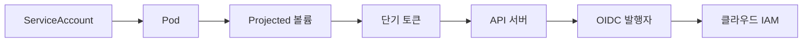
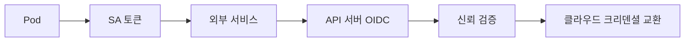

# ServiceAccount

ServiceAccount(SA)는 **워크로드 신원(workload identity)** 이다. 사람 사용자
(User)가 외부 IdP에서 발급되는 토큰을 쓴다면, 파드·CronJob·컨트롤러는
SA 토큰으로 API 서버에 자신을 증명한다.

Kubernetes는 v1.22부터 **projected volume + TokenRequest API**를 기본으로
쓴다. v1.24부터 SA를 만들어도 Secret 기반 레거시 토큰은 **자동 생성되지
않는다**. 최신 모델은 **bound token**: audience·시간·대상 객체(Pod/Node)에
묶이는 단기 토큰이다.

운영 관점 핵심 질문은 다섯 가지다.

1. **파드는 어떻게 자기 토큰을 받나** — projected volume 자동 주입
2. **토큰 수명·회전은 어떻게 되나** — kubelet이 갱신, 기본 1시간
3. **Bound가 정확히 무엇에 바인딩되나** — audience + Pod + (optional) Node
4. **외부 클라우드 IAM에는 어떻게 연결하나** — OIDC discovery + Workload
   Identity
5. **언제 `automountServiceAccountToken: false`인가** — API 호출 없는 파드

> 관련: [RBAC](./rbac.md) · [Secret 암호화](./secret-encryption.md)
> · `security/secrets-management/` (Vault, ESO, SOPS — 주인공은 `security/`)

---

## 1. 전체 구조



| 주체 | 역할 |
|---|---|
| ServiceAccount | 네임스페이스 스코프 신원 오브젝트 |
| TokenRequest API | bound 토큰 발급 (audience·시간·Pod/Node) |
| kubelet | projected 볼륨에 토큰 주입, 만료 전 자동 회전 |
| API 서버 | 토큰 검증, OIDC discovery 엔드포인트 노출 |
| 외부 신뢰 | 클라우드 IAM이 OIDC 발행자를 신뢰해 워크로드에 권한 부여 |

---

## 2. ServiceAccount 리소스

```yaml
apiVersion: v1
kind: ServiceAccount
metadata:
  name: reporter
  namespace: app
  annotations:
    # 예: EKS IRSA 연결
    eks.amazonaws.com/role-arn: arn:aws:iam::111122223333:role/reporter
automountServiceAccountToken: false
imagePullSecrets:
  - name: private-registry
```

| 필드 | 의미 |
|---|---|
| `automountServiceAccountToken` | 파드에 토큰 볼륨을 자동 주입할지. **기본 `true`**. 아래 원칙 참조 |
| `imagePullSecrets` | 이 SA를 쓰는 파드에 자동 주입되는 레지스트리 크리덴셜 |
| `secrets` | (레거시) Secret 참조. v1.24+ 자동 생성 중단 |

네임스페이스마다 `default` SA가 자동 생성된다. 파드가 `spec.serviceAccountName`
을 지정하지 않으면 이 SA를 사용하므로, **`default`에는 어떤 바인딩도
걸지 않는다**. 과거 `default`에 `cluster-admin`이나 네임스페이스 `admin`을
붙여 운영하다 전 파드가 상승된 권한으로 실행되는 사고가 반복된 경로다.
Pod Security Admission `restricted`는 권한 주입은 막지 못한다. 가능하면
`default` SA에도 `automountServiceAccountToken: false`를 기본값으로 둔다.

### `imagePullSecrets` 자동 주입

Admission plugin `ServiceAccount`가 파드 생성 시점에 SA 스펙의
`imagePullSecrets`를 파드 `spec.imagePullSecrets`에 **머지**한다. 파드에
직접 선언한 값과 **합집합**이며 Secret 타입은
`kubernetes.io/dockerconfigjson`이다. 뒤의 §8 KEP-4412는 이 자동 머지 경로
자체를 토큰 기반으로 **대체**한다.

### 필드 혼동 주의

파드 스펙에는 `serviceAccountName`만 쓴다. `serviceAccount` 필드는
**deprecated 별명**으로, 검증이 느슨해 실수를 유발한다.

---

## 3. 토큰 모델의 진화

| 세대 | 저장 | 수명 | 바인딩 | 상태 |
|---|---|---|---|---|
| v1 레거시 | `Secret`(kubernetes.io/service-account-token) | 무기한 | 없음 | v1.24+ 자동 생성 중단, v1.28에 cleanup 컨트롤러 도입 |
| v2 bound | projected 볼륨, JWT in-memory | 기본 1h, 최대 24h(기본) | audience + Pod | v1.22 GA |
| v3 bound+ | 동일 | 동일 | audience + Pod + **Node** + JTI | v1.32 GA (JTI, PodNodeInfo), v1.33 GA (NodeBinding) |

### 레거시 토큰은 왜 사라졌나

- **탈취 시 무기한 유효** — Git 커밋 실수, 덤프된 etcd 백업, 노드 탈취로 유출 시 취소 불가
- `kubectl get secret -A`로 전량 조회 가능
- `ServiceAccountName`에만 묶이고 **컨테이너 종료 후에도 유효**

v1.24부터 `LegacyServiceAccountTokenNoAutoGeneration`이 기본 활성화돼
SA 생성 시 Secret도 만들어지지 않는다. **명시적으로 필요한 경우에만**
`kubernetes.io/service-account-token` 타입 Secret을 직접 만든다(CI 서버
등 파드 외부에서 쓰는 경우).

---

## 4. Projected Service Account Token

파드에 `automountServiceAccountToken`이 `true`이면 kubelet이 아래 볼륨을
자동 주입한다.

```yaml
volumes:
  - name: kube-api-access
    projected:
      defaultMode: 420
      sources:
        - serviceAccountToken:
            expirationSeconds: 3607
            path: token
        - configMap:
            name: kube-root-ca.crt
            items:
              - key: ca.crt
                path: ca.crt
        - downwardAPI:
            items:
              - path: namespace
                fieldRef:
                  fieldPath: metadata.namespace
```

마운트 위치는 `/var/run/secrets/kubernetes.io/serviceaccount/`.

**kubelet 회전 로직**:
- 기본 만료 1시간(`expirationSeconds: 3607`, 7초 추가로 노드 내 토큰 동시
  만료 회피·재발급 지터 분산)
- 수명의 약 80% 경과 시 **백그라운드로 재발급**
- 파드 내부는 **파일을 다시 읽기만** 하면 된다(경로 고정)

### 커스텀 audience

기본 audience는 `https://kubernetes.default.svc`. 외부 서비스에 인증하려면
**전용 audience** 토큰을 projected 볼륨에 추가로 선언한다.

```yaml
- serviceAccountToken:
    audience: vault.example.com
    expirationSeconds: 600
    path: vault-token
```

이렇게 하면 kubelet이 audience별로 **별도 토큰**을 발급하고 회전시킨다.

---

## 5. TokenRequest API

projected 볼륨이 아닌 경로로도 토큰을 얻을 수 있다. CI 서버, 오퍼레이터,
외부 시스템에서 쓰는 표준 방법이다.

```bash
# ad-hoc 발급 (kubectl >= 1.24)
kubectl create token reporter -n app \
  --audience=https://vault.example.com \
  --duration=10m

# 특정 Pod에 바인딩
kubectl create token reporter -n app \
  --bound-object-kind=Pod \
  --bound-object-name=reporter-abc \
  --bound-object-uid=<uid>

# Node에 바인딩 (v1.33 GA)
kubectl create token node-agent -n system \
  --bound-object-kind=Node \
  --bound-object-name=worker-1
```

### 바인딩 속성 3종

| 바인딩 | 의미 | 만료 트리거 |
|---|---|---|
| Audience | 토큰을 받을 서버 측 | 잘못된 audience는 즉시 거부 |
| 시간 | `expirationSeconds` | 경과 시 거부 |
| 대상 객체 | Pod 또는 Node | 해당 객체 **삭제 시 즉시 무효** |

대상 객체 바인딩은 **시간 내라도 삭제되면 무효**가 된다. Pod 삭제 후
탈취된 토큰은 사용 불가라는 점이 레거시와의 결정적 차이다.

### SA 재생성 시 묵시적 무효화

토큰의 `sub`는 `system:serviceaccount:<ns>:<name>` 형식이지만 API 서버는
내부적으로 **SA의 UID 일치**도 검증한다. 동일 이름으로 SA를 삭제·재생성
하면 UID가 변경되어 **기존 발급 토큰은 전부 무효**가 된다. 이는 실무에서
정리 절차 없이 "SA 삭제로 토큰을 회수"할 수 있는 유일한 안전 경로다.

### 토큰 구조 (JWT)

```json
{
  "aud": ["https://vault.example.com"],
  "exp": 1735689600,
  "iat": 1735686000,
  "iss": "https://kubernetes.default.svc",
  "jti": "8e0b6e76-7d2c-4b92-91c4-2b11c0ad5f7a",
  "kubernetes.io": {
    "namespace": "app",
    "node": {"name": "worker-1", "uid": "..."},
    "pod": {"name": "reporter-abc", "uid": "..."},
    "serviceaccount": {"name": "reporter", "uid": "..."}
  },
  "nbf": 1735686000,
  "sub": "system:serviceaccount:app:reporter"
}
```

- `jti`: v1.32 GA — 토큰 고유 ID. 감사 로그에 기록돼 특정 토큰 하나만 추적·
  차단 가능
- `kubernetes.io/node`: v1.32 GA (PodNodeInfo) — Pod이 스케줄된 노드 기록
- `kubernetes.io/pod`: Pod 바인딩 토큰일 때만 존재

---

## 6. Bound Token 개선 (KEP-4193)

v1.32~v1.33에 걸쳐 KEP-4193가 단계적으로 GA됐다. 보안·감사에 핵심 기능
들이다.

| 기능 | 버전 | 무엇을 하나 |
|---|---|---|
| ServiceAccountTokenJTI | v1.32 GA | 토큰에 고유 `jti` 클레임 포함. 감사 추적 기반 |
| ServiceAccountTokenPodNodeInfo | v1.32 GA | 토큰에 Node·Pod 정보 삽입. 탈취 경로 특정 |
| ServiceAccountTokenNodeBindingValidation | v1.32 GA | Node 바인딩 토큰의 엄격 검증 |
| ServiceAccountTokenNodeBinding | v1.33 GA | `--bound-object-kind=Node` 허용 |

**Node 바인딩 시나리오**: DaemonSet이나 노드 에이전트가 자신을 "해당 노드"
에만 유효한 토큰으로 증명할 때. 탈취 후 다른 노드에서 재사용 불가.

---

## 7. 외부 Workload Identity

클러스터 외부의 클라우드 IAM·Vault·외부 API와의 연결은 **OIDC federation**
으로 해결한다. 핵심은 두 가지:

1. API 서버는 **OIDC discovery**(`/.well-known/openid-configuration`)를
   노출한다
2. 외부 측은 API 서버를 **IdP로 신뢰**한다(발행자 URL + JWKS 공개키)



### 주요 구현

| 환경 | 이름 | 메커니즘 | 연결 고리 |
|---|---|---|---|
| AWS | IRSA | OIDC federation (STS `AssumeRoleWithWebIdentity`) | SA에 `eks.amazonaws.com/role-arn` |
| AWS | EKS Pod Identity | **OIDC 아님**. 노드 Pod Identity Agent 경유 | `PodIdentityAssociation` 리소스, Fargate 미지원 |
| GCP | Workload Identity Federation | OIDC federation | `PROJECT.svc.id.goog` 풀, SA에 `iam.gke.io/gcp-service-account` |
| Azure | Workload Identity | OIDC federation | `azure.workload.identity/client-id` 라벨·어노테이션 |
| HashiCorp Vault | JWT Auth | K8s OIDC issuer를 Vault에 등록 | audience 매핑 |
| SPIFFE/SPIRE | Workload API | workload attestor(PSAT)가 SA·Pod 속성 확인 후 SVID 발급 | CSI 드라이버 또는 Unix 소켓 |

> SPIFFE는 JWT-SVID(K8s SA 토큰과 호환)와 X.509-SVID 양쪽을 제공한다. 서비스
> 메쉬·Zero Trust 맥락의 심화는 `network/` 카테고리에서 다룬다.

### OIDC discovery 엔드포인트 공개

외부 IdP(클라우드 IAM, Vault 등)가 K8s 토큰을 검증하려면 아래 경로에
**비인증**으로 접근할 수 있어야 한다.

| 경로 | 내용 |
|---|---|
| `/.well-known/openid-configuration` | 발행자 메타데이터 |
| `/openid/v1/jwks` | 서명 공개키(JWKS) |

기본 설치에서는 `system:service-account-issuer-discovery` ClusterRole이
`system:serviceaccounts` 그룹에만 바인딩돼 있어 **외부에서는 읽히지 않는다**.
온프레·self-hosted 클러스터는 다음을 명시적으로 설정한다.

```bash
kubectl create clusterrolebinding oidc-public \
  --clusterrole=system:service-account-issuer-discovery \
  --group=system:unauthenticated
```

추가로 Ingress·로드밸런서를 통해 **외부에서 접근 가능**해야 하고, 발행자
URL(`--service-account-issuer`)이 그 공개 URL과 일치해야 한다. EKS/GKE/AKS
등 관리형은 자동으로 노출한다.

### 공통 패턴

- SA **annotation**으로 외부 IAM 주체(역할)를 지정
- audience에 클라우드 특정 값을 사용 (`sts.amazonaws.com` 등)
- 사이드카·SDK가 projected 토큰을 읽고 외부에 교환

장기 크리덴셜(AWS Access Key, GCP Service Account JSON)을 Secret에 넣는
방식은 **deprecated**. 2026년 기준 3대 퍼블릭 클라우드 모두 Workload Identity
가 공식 권고다.

> 외부 Secret 동기화 도구(Vault, ESO, SOPS) 자체는 카테고리 경계상
> `security/secrets-management/` 하위에서 다룬다(예정).

---

## 8. 이미지 풀 Workload Identity (KEP-4412)

사설 레지스트리 인증에도 projected SA 토큰을 쓸 수 있게 된 기능이다.

| 버전 | 상태 |
|---|---|
| v1.33 | Alpha |
| v1.34 | Beta |
| v1.35 | Beta 유지 |

kubelet credential provider 플러그인이 SA 토큰을 audience(레지스트리)로
발급받아 레지스트리 크리덴셜로 **교환**한다. `imagePullSecrets` 관리가
사라진다는 의미.

```yaml
# /etc/kubernetes/credentialprovider/config.yaml
apiVersion: kubelet.config.k8s.io/v1
kind: CredentialProviderConfig
providers:
  - name: ecr-credential-provider
    matchImages: ["*.dkr.ecr.*.amazonaws.com"]
    defaultCacheDuration: "6h"
    apiVersion: credentialprovider.kubelet.k8s.io/v1
    tokenAttributes:
      serviceAccountTokenAudience: sts.amazonaws.com
      requireServiceAccount: true
      cacheType: ServiceAccount     # Beta에서 필수
      requiredServiceAccountAnnotationKeys:
        - eks.amazonaws.com/role-arn
      optionalServiceAccountAnnotationKeys:
        - eks.amazonaws.com/audience
```

`cacheType` 선택:

| 값 | 캐시 키 | 용도 |
|---|---|---|
| `Token` | 토큰 해시 | provider가 토큰을 그대로 레지스트리 크리덴셜로 교환(수명 일치) |
| `ServiceAccount` | namespace + name + UID + 선언된 어노테이션 | 동일 SA의 여러 파드 간 크리덴셜 재사용 |

`requiredServiceAccountAnnotationKeys`로 IAM role-arn 같은 SA 어노테이션을
provider에 전달한다. Beta에서 **반드시 선언된 어노테이션만** 캐시 키에
포함되므로 누락되면 WIF 연결이 파드별로 깨진다.

파드가 캐시된 이미지를 쓸 때 kubelet은 **원래 풀에 사용한 SA와 현재 파드의
SA가 정확히 일치하는지**(네임스페이스·이름·UID) 검증한다. 동일 노드의 다른
파드가 권한 없이 이미지를 "재사용"하는 경로를 차단.

---

## 9. 최소 권한 운영 패턴

### SA·Role·Binding 1:1:1

| 원칙 | 이유 |
|---|---|
| 워크로드마다 전용 SA | RBAC 권한 분리, 감사 추적 |
| `default` SA 미사용 | 바인딩 없음 상태 유지 |
| `automountServiceAccountToken: false`를 SA 또는 Pod 단위로 기본화 | API 호출 없는 파드의 불필요한 마운트 제거 |
| 필요 시 파드에서 명시 projected 마운트 | audience·수명 제어 가능 |

```yaml
apiVersion: v1
kind: Pod
metadata:
  name: reporter
  namespace: app
spec:
  serviceAccountName: reporter
  automountServiceAccountToken: false  # SA 기본값이 true라도 재정의
  containers:
    - name: app
      image: reporter:1.2
      volumeMounts:
        - name: api
          mountPath: /var/run/secrets/kubernetes.io/serviceaccount
          readOnly: true
  volumes:
    - name: api
      projected:
        sources:
          - serviceAccountToken:
              audience: https://api.internal
              expirationSeconds: 600
              path: token
```

### 외부 시스템용 레거시 토큰이 정말 필요하면

CI 러너처럼 파드 외부에서 쓰는 경우 **명시 Secret**을 만든다. 수명 관리
책임은 사용자에게 있다.

```yaml
apiVersion: v1
kind: Secret
metadata:
  name: ci-runner-token
  namespace: ci
  annotations:
    kubernetes.io/service-account.name: ci-runner
type: kubernetes.io/service-account-token
```

이 패턴은 **예외**다. 가능하면 CI에서도 OIDC 교환(GitHub Actions OIDC →
K8s `TokenRequest`)으로 대체한다.

### 멀티테넌트 네임스페이스 격리

SA는 런타임에 자동으로 아래 그룹에 속한다.

| 그룹 | 포함 범위 | 위험 |
|---|---|---|
| `system:serviceaccounts` | 클러스터 내 **전 SA** | ClusterRoleBinding 시 전체 권한 상승 |
| `system:serviceaccounts:<ns>` | 해당 네임스페이스 **전 SA** | 네임스페이스 내 파드 **어느 하나라도** 탈취되면 전부 통함 |

멀티테넌트에서 한 네임스페이스에 여러 테넌트의 파드를 섞지 말고, 테넌트
별 네임스페이스 + 별도 SA + 네임스페이스 단위 RoleBinding으로 격리한다.

### SA 흉내내기(impersonation)

디버그·감사용으로 사람·파이프라인이 `kubectl --as=system:serviceaccount:
<ns>:<name>`으로 SA를 흉내낼 수 있다. 필요한 `impersonate` 권한은
[RBAC](./rbac.md) §4 참조. 운영 원칙:

- impersonate 권한은 **디버그 전용 ClusterRole**로 분리, 상시 부여 금지
- impersonate 시 SA의 런타임 그룹(`system:serviceaccounts`,
  `system:serviceaccounts:<ns>`, `system:authenticated`)도 함께 사칭해야
  실제 권한으로 테스트됨

---

## 10. 최근 변경 (v1.32 ~ v1.35)

| 버전 | 변경 | feature gate | 영향 |
|---|---|---|---|
| v1.30 GA | 레거시 토큰 cleanup 컨트롤러 | `LegacyServiceAccountTokenCleanUp` (GA 이후 락) | 미사용 레거시 Secret에 라벨 부착 후 1년 뒤 삭제 |
| v1.32 GA | 토큰 JTI, PodNodeInfo, NodeBindingValidation | `ServiceAccountTokenJTI`, `ServiceAccountTokenPodNodeInfo`, `ServiceAccountTokenNodeBindingValidation` (GA 이후 락) | 토큰 감사·탈취 추적 강화 |
| v1.33 GA | Node 바인딩 토큰 | `ServiceAccountTokenNodeBinding` | `--bound-object-kind=Node` 사용 |
| v1.33 Alpha | Image pull credential provider (KEP-4412) | `KubeletServiceAccountTokenForCredentialProviders` | imagePullSecrets 대체 경로 |
| v1.34 Beta | KEP-4412 Beta 승격 | 동일 | `cacheType`·`requiredServiceAccountAnnotationKeys` 필수 |
| v1.34 Beta | External SA Token Signer (KEP-740) | `ExternalJWTSigner` | HSM·KMS 기반 토큰 서명(v1.36 GA 예정) |

> External Token Signer는 [RBAC](./rbac.md) §11에서도 언급. 외부 서명자는
> gRPC 응답의 `max_token_expiration_seconds`로 토큰 수명 **상한**을 둔다.
> 이는 `--service-account-extend-token-expiration`(최대 1년 확장) 플래그와
> **별개 메커니즘**이며, 대부분의 구현은 24시간 이하로 상한을 잡는다.

---

## 11. 운영 체크리스트

**기본 위생**
- [ ] 모든 워크로드가 **전용 SA**를 갖는가
- [ ] `default` SA가 빈 바인딩 상태이며 `automountServiceAccountToken: false`인가
- [ ] `automountServiceAccountToken: false`를 기본값으로 두었는가
- [ ] 레거시 `kubernetes.io/service-account-token` Secret 리스트를 인벤토리화했는가 — `kubectl get secret -A --field-selector type=kubernetes.io/service-account-token`
- [ ] cleanup 컨트롤러 라벨을 모니터링하는가 — `kubernetes.io/legacy-token-invalid-since`, `kubernetes.io/legacy-token-last-used`

**Bound 활용**
- [ ] 노드 에이전트(DaemonSet)가 Node 바인딩 토큰을 쓰는가
- [ ] 외부 시스템 인증에 **커스텀 audience**를 쓰는가
- [ ] 토큰 수명이 10분 이하로 설정 가능한 시스템인가

**외부 IAM**
- [ ] 장기 클라우드 크리덴셜(AWS Access Key 등)이 Secret에 없는가
- [ ] 각 SA의 외부 IAM 주체(role-arn 등) 매핑이 문서화되어 있는가
- [ ] OIDC 발행자 URL·JWKS 회전 주기가 정해져 있는가

**감사**
- [ ] `jti` 기반으로 특정 토큰 탈취 시 차단 절차가 있는가
- [ ] API 서버 감사 로그에 다음 extra 필드가 기록되는가: `user.username`
  (= `system:serviceaccount:...`), `authentication.kubernetes.io/pod-name`,
  `authentication.kubernetes.io/pod-uid`,
  `authentication.kubernetes.io/node-name`,
  `authentication.kubernetes.io/credential-id` (jti 기반)

---

## 12. 트러블슈팅

### 파드 안에서 자기 신원 확인

```bash
# v1.28 GA
kubectl auth whoami
# → system:serviceaccount:<ns>:<name>, UID, extra 필드 반환

# API 호출 형태
curl --cacert /var/run/secrets/kubernetes.io/serviceaccount/ca.crt \
  -H "Authorization: Bearer $(cat /var/run/secrets/kubernetes.io/serviceaccount/token)" \
  https://kubernetes.default.svc/apis/authentication.k8s.io/v1/selfsubjectreviews \
  -d '{"apiVersion":"authentication.k8s.io/v1","kind":"SelfSubjectReview"}'
```

### 파드에서 토큰이 안 보인다

- SA의 `automountServiceAccountToken`이 `false`이면 볼륨 자체가 주입되지
  않는다. 파드 스펙에서 `automountServiceAccountToken: true`로 재정의하거나
  projected 볼륨을 명시 선언
- `/var/run/secrets/kubernetes.io/serviceaccount/token` 없는지 확인

### 토큰이 "갑자기" 만료됐다

- `expirationSeconds`를 짧게 준 경우: kubelet 회전 전에 만료 가능
- Pod 바인딩 토큰인데 Pod이 재시작됐다면 **UID 변경으로 무효**
- v1.32+에서는 감사 로그 `jti`로 어느 토큰이 거부됐는지 역추적

### IRSA/WIF 연결 실패

- audience가 클라우드별 필수값과 일치하는가 (AWS: `sts.amazonaws.com`,
  GCP WIF: `//iam.googleapis.com/projects/<num>/locations/global/workloadIdentityPools/<pool>/providers/<provider>`)
- SA의 annotation이 정확한가
- 클라우드 IAM의 Trust Policy가 **클러스터 OIDC issuer URL**을 신뢰하는가
- OIDC JWKS 엔드포인트가 공개 네트워크에서 접근 가능한가(GKE·EKS는 자동,
  온프레는 수동 공개 필요)

### `imagePullSecrets`가 사라졌다

v1.34+ KEP-4412 Beta 적용 시 credential provider로 전환된 경우. `kubelet`
설정(`CredentialProviderConfig`)의 `tokenAttributes` 섹션 확인. `cacheType`
이 누락되면 Alpha→Beta 전환 시 실패.

### ExternalJWTSigner 사용 시 긴 수명 토큰 필요

외부 서명자는 gRPC 응답의 `max_token_expiration_seconds`로 **토큰 수명
상한**을 둔다. `--service-account-extend-token-expiration`(최대 1년) 플래그
로는 이 상한을 넘길 수 없다. 긴 수명이 필요한 CI 파이프라인은 외부 IdP
OIDC 교환 후 **파이프라인 자체 토큰**을 쓰도록 설계한다.

### 토큰 회전 후 401이 발생

client-go 기반 컨트롤러는 projected 파일을 자동 재로드한다. 그러나 Python
`kubernetes`, Java client, Go 비-client-go HTTP 클라이언트, Fluent Bit 등은
**한 번 읽은 토큰을 메모리에 캐시**한다. 토큰이 갱신된 후 재로드 로직이
없으면 수명 이전에 401이 발생한다. SDK별 파일 watch 또는 주기적 재로드
설정 필요.

---

## 참고 자료

- [Service Accounts — Kubernetes](https://kubernetes.io/docs/concepts/security/service-accounts/) — 2026-04-23 확인
- [Managing Service Accounts — Kubernetes](https://kubernetes.io/docs/reference/access-authn-authz/service-accounts-admin/) — 2026-04-23 확인
- [Configure Service Accounts for Pods](https://kubernetes.io/docs/tasks/configure-pod-container/configure-service-account/) — 2026-04-23 확인
- [Projected Volumes — Kubernetes](https://kubernetes.io/docs/concepts/storage/projected-volumes/) — 2026-04-23 확인
- [KEP-1205 Bound Service Account Tokens](https://github.com/kubernetes/enhancements/tree/master/keps/sig-auth/1205-bound-service-account-tokens) — 2026-04-23 확인
- [KEP-4193 Bound Service Account Token Improvements](https://github.com/kubernetes/enhancements/issues/4193) — 2026-04-23 확인
- [KEP-4412 Projected SA tokens for kubelet image credential providers](https://github.com/kubernetes/enhancements/tree/master/keps/sig-auth/4412-projected-service-account-tokens-for-kubelet-image-credential-providers) — 2026-04-23 확인
- [Kubernetes v1.34 Release Announcement](https://kubernetes.io/blog/2025/08/27/kubernetes-v1-34-release/) — 2026-04-23 확인
- [Kubernetes v1.33: Image Pull Auth with SA Tokens](https://kubernetes.io/blog/2025/05/07/kubernetes-v1-33-wi-for-image-pulls/) — 2026-04-23 확인
- [Kubernetes v1.34: SA Token Integration for Image Pulls Beta](https://kubernetes.io/blog/2025/09/03/kubernetes-v1-34-sa-tokens-image-pulls-beta/) — 2026-04-23 확인
- [NSA/CISA Kubernetes Hardening Guide](https://www.cisa.gov/news-events/cybersecurity-advisories/aa22-238a) — 2026-04-23 확인
