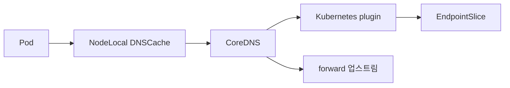

# CoreDNS

CoreDNS는 **Kubernetes의 기본 클러스터 DNS 서버**다. 1.11 이후 kube-dns를
완전 대체했고, **CNCF Graduated** 프로젝트(2019-01)다. Go로 작성된 플러그인
체인 아키텍처이며, Corefile 기반 설정으로 동작한다.

DNS는 클러스터의 **모든** Service·Pod discovery를 책임진다. CoreDNS가 죽으면
대부분의 애플리케이션이 연동 실패를 겪는다. 안정 운영의 핵심은 세 가지다.

1. **플러그인 체인 구조**와 기본 Corefile 이해
2. **NodeLocal DNSCache**와 conntrack 5초 지연 이슈 해결
3. **`ndots:5` 함정** — 외부 DNS 트래픽 증폭 방지

> 관련: [Service](./service.md) · [EndpointSlice](./endpointslice.md)
> · [Headless Service](./headless-service.md)

---

## 1. 전체 구조



| 컴포넌트 | 역할 |
|---|---|
| **CoreDNS** (`kube-system/coredns`) | 클러스터 DNS 서버, 기본 2 replica |
| **NodeLocal DNSCache** | 노드 로컬 DNS 캐시 (DaemonSet) — 옵션이지만 대규모 필수 |
| **kubelet** | Pod `/etc/resolv.conf` 주입 |
| **CoreDNS kubernetes plugin** | EndpointSlice watch → A/AAAA/SRV 응답 |
| **CoreDNS forward plugin** | 클러스터 외부 이름 해석 |

### 프로젝트·버전

| 항목 | 값 |
|---|---|
| 라이선스 | Apache-2.0 |
| CNCF | **Graduated** (2019-01) |
| K8s 1.33 기본 (kubeadm) | **CoreDNS 1.12.0** |
| 최신 릴리즈 (2026-04) | **v1.14.3** (2026-04-22) |

K8s 1.34+에서의 kubeadm 기본 매핑은 공식 `CoreDNS-k8s_version.md`에서 확인.

---

## 2. 플러그인 체인 아키텍처

### 순서가 중요하다

- `plugin.cfg`에 정적으로 선언된 순서대로 실행
- 각 server block이 독립 체인 보유
- 플러그인의 4가지 행동:
  1. 쿼리 처리 후 응답 (체인 종료)
  2. 처리하지 않고 다음으로
  3. 처리 후에도 다음 호출 (`fallthrough`)
  4. 힌트만 추가 후 다음 (`cache` 응답 저장 등)

### K8s 표준 체인 주요 플러그인

| 플러그인 | 역할 |
|---|---|
| `errors` | 에러 로깅 |
| `health` | `:8080/health`, `lameduck`으로 graceful shutdown |
| `ready` | `:8181/ready` 준비 완료 신호 |
| `kubernetes` | **K8s Service/Pod discovery 핵심** (EndpointSlice watch) |
| `prometheus` | `:9153/metrics` 노출 |
| `forward` | 업스트림 DNS 포워딩 |
| `cache` | 프런트엔드 캐시 |
| `loop` | DNS 루프 감지 (시작 시) |
| `reload` | Corefile 변경 자동 재로드 |
| `loadbalance` | 응답 내 RR 순서 셔플 |

---

## 3. 기본 Corefile (K8s 표준)

`kube-system/coredns` ConfigMap의 표준 형태.

```
.:53 {
    errors
    health {
       lameduck 5s
    }
    ready
    kubernetes cluster.local in-addr.arpa ip6.arpa {
       pods insecure
       fallthrough in-addr.arpa ip6.arpa
       ttl 30
    }
    prometheus :9153
    forward . /etc/resolv.conf {
       max_concurrent 1000
    }
    cache 30
    loop
    reload
    loadbalance
}
```

### 핵심 필드

| 필드 | 기본 | 의미 |
|---|---|---|
| `cluster.local` | — | 클러스터 domain |
| `pods insecure` | default in-tree | K8s 확인 없이 IP 그대로 응답 (kube-dns 호환) |
| `ttl 30` | K8s 기본 5s에서 상향 | 응답 TTL |
| `forward . /etc/resolv.conf` | — | 업스트림은 노드의 resolver 체인 |
| `max_concurrent 1000` | — | 동시 업스트림 쿼리 상한 |
| `cache 30` | — | 30s TTL 이내 캐시 |

---

## 4. `kubernetes` 플러그인 상세

```
kubernetes CLUSTER_DOMAIN [ZONES...] {
    pods POD-MODE
    ttl TTL
    fallthrough [ZONES...]
    startup_timeout DURATION
    multicluster [ZONES...]
    apiserver_qps QPS
    apiserver_burst BURST
}
```

### 주요 옵션

| 옵션 | 기본 | 설명 |
|---|---|---|
| `pods disabled` | 기본 | pod IP 질의(`1-2-3-4.ns.pod.cluster.local`)에 NXDOMAIN |
| `pods insecure` | kube-dns 호환 모드 | K8s 확인 없이 요청 IP 응답 — **보안 취약** |
| `pods verified` | — | 동일 namespace에 해당 IP Pod가 실제 존재해야 응답. **전체 Pod watch → 메모리 ↑** |
| `ttl` | 5s | 0–3600 |
| `fallthrough ZONES` | — | NXDOMAIN 시 다음 플러그인으로 |
| `startup_timeout` | 5s | informer sync 대기 (v1.12.3+) |
| `multicluster ZONES` | — | MCS-API (v1.12.2+) |
| `apiserver_qps`/`burst`/`max_inflight` | — | API 서버 부하 제어 (v1.14.0+) |

### Endpoint 소스

- **`discovery.k8s.io/v1.EndpointSlices`**를 watch (K8s 1.22부터 전환)
- 필요 RBAC: `services`·`pods`·`namespaces`·`endpointslices` → `list`·`watch`
- 시작 시 informer sync 완료까지 최대 `startup_timeout` 대기, 미완료 시
  SERVFAIL 응답

---

## 5. forward · cache · loop · reload

### forward

업스트림 DNS로 포워딩. 연결 재사용, 인밴드 헬스체크(0.5s).

| 옵션 | 의미 |
|---|---|
| `max_concurrent MAX` | 초과 시 REFUSED (K8s 기본 1000) |
| `force_tcp` / `prefer_udp` | 전송 강제 |
| `policy random\|round_robin\|sequential` | 업스트림 선택 |
| `health_check DURATION` | 헬스체크 주기 |
| `failfast_all_unhealthy_upstreams` | 전부 다운이면 즉시 SERVFAIL (v1.12.1+) |
| `max_age` | 업스트림 연결 절대 수명 (v1.14.3+) |

**주의**: v1.13.0부터 `failover`에 `NOERROR` 사용 불가.

### cache

기본 샤드 256개, capacity 9984. 기본 최대 TTL: success 3600s, denial
1800s.

| 옵션 | 용도 |
|---|---|
| `prefetch AMOUNT [DURATION] [PERCENTAGE%]` | 인기 항목 TTL 만료 전 갱신 |
| `serve_stale [DURATION] [verify\|immediate]` | 만료된 항목도 제공 (기본 immediate) |
| `servfail DURATION` | SERVFAIL 캐싱 (기본 5s, max 5m) |
| `keepttl` | 원본 TTL 유지 |

### loop

시작 시 `<random>.<random>.<zone> HINFO` 쿼리로 **DNS 루프 감지**.
자기 응답을 2회 초과로 받으면 프로세스 halt. **CrashLoopBackOff의 전형**
원인: `resolv.conf`에 systemd-resolved loopback(`127.0.0.53`)이 있는 경우.
kubelet `--resolv-conf=/run/systemd/resolve/resolv.conf`로 회피.

### reload

Corefile SHA512 변경 감지 (30s ± 15s 주기). 실패 시 기존 설정 유지.
**주의**: 새 설정이 다른 포트 바인딩 실패 시 기존 listener가 이미 닫힌
상태로 복구 불가 — health·prometheus 엔드포인트 중단 가능.

---

## 6. DNS 쿼리 플로우

### `/etc/resolv.conf` (Pod)

kubelet이 다음 형태로 주입한다.

```
nameserver <cluster-dns-ip>
search <ns>.svc.cluster.local svc.cluster.local cluster.local
options ndots:5
```

`<cluster-dns-ip>`는 보통 `kube-dns` Service ClusterIP, 또는 NodeLocal
DNSCache 사용 시 IPVS 모드에서는 **`169.254.20.10`**.

### Pod `dnsPolicy`

| 값 | 동작 |
|---|---|
| `ClusterFirst` (**기본**) | 클러스터 domain 이외는 업스트림으로 |
| `ClusterFirstWithHostNet` | hostNetwork Pod는 명시 필요 |
| `Default` | 노드의 `resolv.conf` 상속 |
| `None` | 완전 무시, `dnsConfig`로만 설정 |

### `dnsConfig` (Pod 단위 커스텀)

```yaml
dnsPolicy: None
dnsConfig:
  nameservers: ["169.254.20.10"]
  searches: ["ns1.svc.cluster.local"]
  options:
  - name: ndots
    value: "2"
  - name: single-request-reopen
```

### K8s DNS 레코드 표준

| 리소스 | 레코드 |
|---|---|
| ClusterIP Service | `A/AAAA` → ClusterIP |
| Headless Service | `A/AAAA` → Ready endpoint Pod IP 집합 |
| SRV | `_<port>._<proto>.<svc>.<ns>.svc.<zone>` |
| ExternalName | `CNAME` → `externalName` |
| Pod (CoreDNS 확장) | `<pod-ip-dashed>.<ns>.pod.<zone>` |

---

## 7. `ndots:5` 함정과 완화

### 문제

`ndots:5`는 "dot이 5개 미만인 이름은 먼저 search 도메인과 조합해 질의"를
의미한다. 외부 도메인 `www.example.com`(dot 2개)도 먼저 네 번째 search
시도 후에 절대 질의된다. **외부 쿼리 1건이 DNS 질의 3–4건**, A+AAAA까지
고려하면 **6–8건**으로 증폭된다.

### 완화책

| 방법 | 효과 | 트레이드오프 |
|---|---|---|
| **NodeLocal DNSCache** | 반복을 노드 로컬 캐시가 흡수 | DaemonSet 관리 |
| **FQDN (말미 `.`)** | search 건너뜀 | 앱 코드 수정 |
| Pod `dnsConfig.options ndots: "2"` | 외부는 바로 절대 질의 | 짧은 서비스명 해석 영향 |
| CoreDNS `autopath` 플러그인 | 서버 측에서 search 경로 미리 완성 | **IP 재할당 레이스 버그**, Windows 비호환 |

`autopath`는 공식 페이지에도 "Known issues" 섹션이 있다. 프로덕션 도입은
신중.

---

## 8. NodeLocal DNSCache

### 개요

- **K8s v1.18 stable**
- DaemonSet(`kube-system/node-local-dns`)으로 노드마다 DNS 캐시 배치
- CoreDNS 기반 바이너리, link-local IP **`169.254.20.10`** 리스닝
- `priorityClassName: system-node-critical`, `hostNetwork: true`

### 목적

1. CoreDNS Pod 부하 분산 (N개 노드 → N개 로컬 캐시)
2. DNS 지연 감소 (노드 로컬 = 1 hop 미만)
3. **conntrack 레이스 회피** — iptables `NOTRACK` 규칙으로 conntrack entry
   생성 방지 → 5초 지연 이슈 근본 해결
4. 로컬 캐시 미스는 CoreDNS로 **TCP** 포워드

### kube-proxy 모드별

| 모드 | 바인딩 | kubelet 설정 |
|---|---|---|
| iptables | kube-dns IP + `169.254.20.10` 양쪽 | `--cluster-dns` 변경 불필요 |
| IPVS | `169.254.20.10`만 | `--cluster-dns=169.254.20.10` |

### 운영 주의

- **OOMKilled 시 DNS downtime** — iptables 규칙 정리 안 된 채 재시작,
  브리프 DNS 장애 발생 가능. replica·memory limit 설계 주의.
- 캐시 10K entry ≈ 30MB. `max_concurrent`로 동시 쿼리 제한.
- 클러스터 객체 watch 안 하므로 클러스터 크기와 메모리 상관관계 낮음
  (CoreDNS와 다름).

---

## 9. 5초 DNS 지연 이슈 (conntrack race)

### 증상

간헐적으로 DNS 쿼리가 **정확히 5초** 지연. resolver의 기본 타임아웃이
5초이므로 그 후 재시도 시 성공.

### 원인

- UDP는 connectionless
- glibc resolver가 **A와 AAAA를 같은 source port로 거의 동시에** 질의
- Linux netfilter conntrack이 두 패킷의 DNAT 경쟁 → 한 패킷 drop
- 재시도(5초 후)는 정상 통과

### 완화

| 방법 | 근본/우회 | 설명 |
|---|---|---|
| **NodeLocal DNSCache** | **근본** | NOTRACK으로 conntrack 우회 — **가장 권장** |
| `dnsConfig.options single-request-reopen` | 우회 | A/AAAA를 다른 소켓 |
| `dnsConfig.options use-vc` | 우회 | TCP 강제 |
| musl libc (Alpine) 최신 | 부분 | Alpine 3.18+, musl 1.24+에서 개선 |

---

## 10. 성능 튜닝

### 배치·리소스

- **replica ≥ 2**, Anti-affinity 필수
- `cluster-proportional-autoscaler` 또는 HPA 적용
- `priorityClassName: system-cluster-critical`
- CPU·Memory **requests 명시**, OOM 주의해 limit 신중

### cache·forward 튜닝

- `ttl 30` (기본 5에서 상향) — 캐시 효율
- `prefetch` — 인기 항목 TTL 만료 전 갱신
- `serve_stale 1h immediate` — 업스트림 장애 시 stale 응답
- `max_concurrent` 메모리 산정: 2KB × concurrent
- 업스트림 **2개 이상** 지정

### K8s 플러그인 튜닝 (v1.14+)

- `apiserver_qps` / `apiserver_burst` / `apiserver_max_inflight` —
  대규모 클러스터에서 API server 부하 제어

---

## 11. 관측·메트릭

### 핵심 메트릭 (`coredns_*`)

| 메트릭 | 의미 |
|---|---|
| `coredns_build_info` | 버전 |
| `coredns_dns_requests_total` | 쿼리 수 (zone, type, proto) |
| `coredns_dns_responses_total` | 응답 수 (rcode, plugin) |
| `coredns_dns_request_duration_seconds` | 레이턴시 히스토그램 |
| `coredns_panics_total` | 패닉 — 즉시 알람 |
| `coredns_plugin_enabled` | 플러그인 활성 상태 |

### 플러그인별

**cache**: `coredns_cache_hits_total`, `coredns_cache_requests_total`
(v1.14에서 misses는 derive 권장), `coredns_cache_entries`,
`coredns_cache_prefetch_total`, `coredns_cache_served_stale_total`.

**forward → proxy 전환** (v1.14에서 다수 메트릭이 `coredns_proxy_*`로 이관):
- 신규: `coredns_proxy_request_duration_seconds{proxy_name="forward",to,rcode}`
- 신규: `coredns_proxy_healthcheck_failures_total{proxy_name="forward"}`
- deprecated: `coredns_forward_requests_total` 등 → 지표명 전환 필요

**kubernetes**: `coredns_kubernetes_dns_programming_duration_seconds`
— **Service 변경이 DNS에 반영되는 지연**. SLI로 유용.

### PromQL 예시

```promql
# 패닉 감지
rate(coredns_panics_total[5m]) > 0

# SERVFAIL 비율
sum(rate(coredns_dns_responses_total{rcode="SERVFAIL"}[5m]))
  / sum(rate(coredns_dns_requests_total[5m])) > 0.01

# p99 레이턴시
histogram_quantile(0.99,
  sum by (le) (rate(coredns_dns_request_duration_seconds_bucket[5m])))

# cache hit ratio
sum(rate(coredns_cache_hits_total[5m]))
  / sum(rate(coredns_cache_requests_total[5m]))

# 업스트림 전면 불건강
rate(coredns_forward_healthcheck_broken_total[5m]) > 0
```

---

## 12. 트러블슈팅

| 증상 | 원인 | 해결 |
|---|---|---|
| **5초 지연** 간헐 | conntrack race (A+AAAA 동시 UDP) | **NodeLocal DNSCache** 또는 `single-request-reopen` |
| CrashLoopBackOff + `Loop detected` | 업스트림이 자기 자신 (systemd-resolved `127.0.0.53`) | kubelet `--resolv-conf=/run/systemd/resolve/resolv.conf` |
| OOMKilled | 대량 트래픽 + replica 부족 | replica 증가, HPA, `max_concurrent`, NodeLocal DNSCache |
| 간헐 `no such host` | 업스트림 타임아웃 | `forward max_concurrent`, `health_check` 튜닝, 업스트림 추가 |
| Corefile reload 실패 | 문법 오류·포트 충돌 | 로그 확인, ConfigMap 검증 후 재적용 |
| 시작 직후 SERVFAIL | informer cache sync 지연 | `startup_timeout` 증가 |
| autopath로 잘못된 namespace search | Pod IP 재할당 레이스 | autopath 사용 중단 |
| Alpine DNS 일부 실패 | 구 musl (1.24 미만) TCP fallback 없음 | Alpine 3.18+ |
| nameserver 3개 제한 | glibc default limit | dnsmasq / `--resolv-conf` 지정 |

### 디버깅 명령

```bash
# CoreDNS 상태
kubectl -n kube-system get deploy coredns
kubectl -n kube-system logs -l k8s-app=kube-dns --tail=200

# Corefile
kubectl -n kube-system get cm coredns -o yaml

# NodeLocal DNSCache
kubectl -n kube-system get ds node-local-dns
kubectl -n kube-system logs -l k8s-app=node-local-dns --tail=200

# DNS 질의 테스트
kubectl run tmp --rm -it --image=busybox:1.28 -- \
  nslookup kubernetes.default

# 메트릭 직접 확인
kubectl -n kube-system port-forward svc/kube-dns 9153:9153
curl -s localhost:9153/metrics | grep -E "coredns_(dns|cache|forward|panics)"
```

---

## 13. 안티패턴

| 안티패턴 | 문제 | 대안 |
|---|---|---|
| **replica=1** 운영 | DNS 장애 = 전 클러스터 장애 | ≥ 2 + anti-affinity + PDB |
| `pods insecure` 프로덕션 | 보안 취약 (요청 IP 그대로 응답) | `pods disabled` 또는 `verified` |
| `ttl 0` | 캐시 무효 → 백엔드 부하 폭증 | 적절한 TTL (30s 이상) |
| `resolv.conf`에 loopback 포함한 채 기본 설정 | loop 감지로 CrashLoopBackOff | `--resolv-conf` 명시 |
| NodeLocal DNSCache 없이 수만 Pod | CoreDNS 부하 폭증, conntrack race | 배포 필수 |
| 업스트림 단일 공용 DNS (8.8.8.8만) | 네트워크 분리·쿼터 문제 | 사내 resolver + 공용 조합 |
| Corefile 직접 수정 후 검증 없이 apply | reload 실패 시 복구 어려움 | 스테이징 검증, dry-run |
| autopath를 **기본 활성** | 알려진 버그 (IP 레이스) | 신중히 |
| anti-affinity 없이 CoreDNS 배치 | 단일 노드 장애 = DNS 장애 | 필수 설정 |
| CPU limit 없는데 replica 1 | 노이즈 이웃 영향 | 적절한 limit 또는 HPA |

---

## 14. 프로덕션 체크리스트

### 배치·HA
- [ ] CoreDNS **replica ≥ 2** (클러스터 크기에 따라 HPA 또는 cluster-proportional-autoscaler)
- [ ] **Anti-affinity** 필수, 노드 간 분산
- [ ] PDB 설정
- [ ] `priorityClassName: system-cluster-critical`
- [ ] `lameduck` 설정 (graceful shutdown)
- [ ] `readinessProbe: :8181/ready`, `livenessProbe: :8080/health`
- [ ] CPU·Memory **requests 명시** (limits는 워크로드 실측 기반)

### Corefile
- [ ] 업스트림 `forward`는 **2개 이상** resolver
- [ ] `max_concurrent` 명시 (기본 1000 적절성 검토)
- [ ] `kubernetes ttl 30` (기본 5에서 상향)
- [ ] `pods insecure` 운영 시 보안 영향 인지, 가능하면 `disabled`
- [ ] `cache` prefetch·serve_stale 정책 검토
- [ ] RBAC: EndpointSlices 권한 포함 (K8s 1.22+)

### NodeLocal DNSCache
- [ ] 대규모·5초 지연 이슈 환경은 **필수 도입**
- [ ] kube-proxy 모드별 kubelet `--cluster-dns` 적절성
- [ ] memory limit·max_concurrent 튜닝

### Pod DNS
- [ ] 외부 도메인 접근 패턴이 많으면 `dnsConfig.options ndots: "2"` 고려
- [ ] 5초 지연이 의심되면 `single-request-reopen` 추가
- [ ] 앱 DNS 캐시 TTL 정책 일관성

### 관측
- [ ] `coredns_panics_total`, SERVFAIL 비율, p99 레이턴시 알람
- [ ] `coredns_kubernetes_dns_programming_duration_seconds` SLI
- [ ] `coredns_forward_healthcheck_broken_total` 알람
- [ ] v1.14+ 메트릭 이름 전환 (`forward_*` → `proxy_*`)

### 운영
- [ ] CoreDNS 버전 = K8s 지원 매트릭스 범위
- [ ] ConfigMap 변경은 스테이징 검증 후 반영
- [ ] NetworkPolicy가 `:53 UDP/TCP` egress를 차단하지 않도록
- [ ] 외부 DNS(ExternalDNS)와 CoreDNS는 **별개**임을 인지(13장)

---

## 15. 오해·경계 정리

### CoreDNS ≠ ExternalDNS

- **CoreDNS**: 클러스터 **내부 DNS 서버** (이름 해석)
- **ExternalDNS**: K8s Ingress·Service 이름을 **외부 DNS provider**(Route53,
  Cloud DNS, Cloudflare, RFC2136)에 레코드로 **생성**하는 컨트롤러

역할 무관. 혼동하지 않도록.

### ExternalName 처리

CoreDNS는 ExternalName Service를 **CNAME으로 응답**한다. CNAME 체인 한도는
v1.12.1부터 7→10으로 증가.

---

## 16. 이 카테고리의 경계

- **DNS 서버·NodeLocal DNSCache·ndots 완화** → 이 글
- **Service 자체·타입·정책** → [Service](./service.md)
- **endpoint 관리** → [EndpointSlice](./endpointslice.md)
- **Pod별 DNS·StatefulSet peer discovery** → [Headless Service](./headless-service.md)
- **외부 DNS provider 레코드 생성** → `cicd/` (ExternalDNS) 또는 전용
- **DNS 기반 서비스 메시 discovery(xDS)** → `network/`

---

## 참고 자료

- [CoreDNS 공식](https://coredns.io/)
- [CoreDNS — Manual](https://coredns.io/manual/toc/)
- [CoreDNS — `kubernetes` 플러그인](https://coredns.io/plugins/kubernetes/)
- [CoreDNS — `forward` 플러그인](https://coredns.io/plugins/forward/)
- [CoreDNS — `cache` 플러그인](https://coredns.io/plugins/cache/)
- [CoreDNS — `autopath` 플러그인](https://coredns.io/plugins/autopath/)
- [CoreDNS — `loop` 플러그인](https://coredns.io/plugins/loop/)
- [CoreDNS Releases](https://github.com/coredns/coredns/releases)
- [CoreDNS ↔ K8s 버전 호환](https://github.com/coredns/deployment/blob/master/kubernetes/CoreDNS-k8s_version.md)
- [Kubernetes — DNS for Services and Pods](https://kubernetes.io/docs/concepts/services-networking/dns-pod-service/)
- [Kubernetes — NodeLocal DNSCache](https://kubernetes.io/docs/tasks/administer-cluster/nodelocaldns/)
- [Kubernetes — Debug DNS Resolution](https://kubernetes.io/docs/tasks/administer-cluster/dns-debugging-resolution/)
- [Kubernetes — Customizing DNS Service](https://kubernetes.io/docs/tasks/administer-cluster/dns-custom-nameservers/)
- [Kubernetes DNS-Based Service Discovery spec v1.1.0](https://github.com/kubernetes/dns/blob/master/docs/specification.md)

(최종 확인: 2026-04-23)
