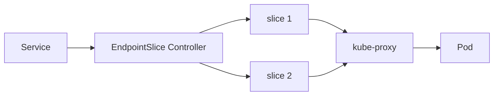

# EndpointSlice

EndpointSlice는 **Service의 backend Pod 집합을 여러 slice로 분할해 관리**하는
리소스다. 기존 `v1.Endpoints`가 단일 거대 객체로 갖던 확장성·표현력 한계를
해소하기 위해 도입됐고, 1.21 GA를 거쳐 **1.33부터 `v1.Endpoints`는 공식
deprecated**로 전환됐다(KEP-4974).

`kube-proxy`는 오래전부터 Endpoints를 전혀 쓰지 않고 **EndpointSlice만**
사용한다. Gateway API conformance도 EndpointSlice를 요구한다.

운영자 관점의 핵심 질문은 세 가지다.

1. **`serving` vs `ready` vs `terminating`** — graceful shutdown 지원
2. **대규모 Service에서 왜 watch 부하가 줄어드는가** — slice sharding
3. **1.33 전환 시 무엇을 점검하나** — deprecation warning과 마이그레이션

> 관련: [Service](./service.md) · [Headless Service](./headless-service.md)
> · [CoreDNS](./coredns.md) · [Network Policy](./network-policy.md)

---

## 1. 전체 구조



| 항목 | 값 |
|---|---|
| API Group | `discovery.k8s.io` |
| Version | `v1` (**1.21 GA**) |
| `v1beta1` 제거 | **1.25** |
| Endpoints deprecated | **1.33** (KEP-4974) |
| `maxEndpointsPerSlice` 기본 | **100** (kube-controller-manager 플래그) |
| slice 하드 한계 | **1000 endpoints**, **100 ports** |

---

## 2. 왜 분할인가 — sharding의 의미

대규모 Service(수천 endpoint)에서 단일 Endpoints 객체는 **작은 변경에도
객체 전체가 watch 이벤트로 재전송**된다. 모든 kube-proxy·컨트롤러에 전파
되므로 **apiserver·etcd·네트워크가 급격히 부하**를 받는다.

| 측면 | Endpoints | EndpointSlice |
|---|---|---|
| 객체 수 | Service당 **1개** | **다수** slice |
| 변경 전파 | 전체 객체 재전송 | **변경 slice만** 전송 |
| IP family | 단일 | IPv4/IPv6/FQDN 분리 |
| dual-stack | 미지원 | 지원 |
| endpoint 한계 | 실무적 ~5000 | slice 분할, 총 무제한 |
| port 구조 | `subsets[].ports` (subset마다 다른 port) | slice 내 모든 endpoint 동일 port |
| readiness | `addresses`/`notReadyAddresses` 이분법 | `serving`·`ready`·`terminating` 3축 |
| graceful shutdown | 표현 불가 | **표현 가능** |
| hints | 없음 | `forZones`·`forNodes` |
| `trafficDistribution` | 연동 불가 | 연동 |

3,000 endpoint 서비스 기준, 기본값으로 **30개 slice**로 쪼개진다.

---

## 3. 리소스 구조

```yaml
apiVersion: discovery.k8s.io/v1
kind: EndpointSlice
metadata:
  name: my-svc-abc123
  namespace: default
  labels:
    kubernetes.io/service-name: my-svc                             # 필수
    endpointslice.kubernetes.io/managed-by: endpointslice-controller.k8s.io
addressType: IPv4                                                   # immutable
ports:
- name: http
  protocol: TCP
  port: 80
  appProtocol: http
endpoints:
- addresses: ["10.1.2.3"]
  conditions:
    ready: true
    serving: true
    terminating: false
  hostname: pod-1
  nodeName: node-1
  zone: us-west-2a
  targetRef:
    kind: Pod
    name: my-pod-1
    namespace: default
    uid: 1a2b3c
  hints:
    forZones:
    - name: us-west-2a
    forNodes:                       # 1.33 alpha
    - name: node-1
```

### 필드 요약

| 필드 | 필수 | 비고 |
|---|---|---|
| `addressType` | ✅ | `IPv4`·`IPv6`·`FQDN`. 생성 후 변경 불가 |
| `endpoints[].addresses` | ✅ | 컨트롤러 생성 시엔 항상 1개 |
| `endpoints[].conditions.ready` | — | nil 기본 `true` |
| `endpoints[].conditions.serving` | — | nil 기본 `true` (1.26 GA) |
| `endpoints[].conditions.terminating` | — | nil 기본 `false` (1.26 GA) |
| `endpoints[].zone` | — | 1.21+ |
| `endpoints[].nodeName` | — | 1.21+ |
| `endpoints[].targetRef` | — | 보통 Pod 참조 |
| `endpoints[].hints.forZones` | — | 최대 8개 |
| `endpoints[].hints.forNodes` | — | 1.33 alpha, 최대 8개 |

`kubernetes.io/service-name` 라벨이 **없으면 어떤 Service와도 연결되지
않는다**. 수동 생성 시 특히 주의.

---

## 4. serving · ready · terminating

| 조건 | 의미 |
|---|---|
| `serving` | readinessProbe 통과 (terminating 여부 무관) |
| `terminating` | Pod에 `deletionTimestamp` 부여됨 — 컨테이너 종료 전부터 true |
| `ready` | `serving && !terminating`의 파생. `publishNotReadyAddresses: true`면 항상 true |

### 상태 조합

| readinessProbe | deletionTimestamp | ready | serving | terminating |
|:-:|:-:|:-:|:-:|:-:|
| OK | 없음 | true | true | false |
| OK | 있음 (graceful shutdown 중) | **false** | **true** | **true** |
| FAIL | 없음 | false | false | false |
| FAIL | 있음 | false | false | true |

### graceful shutdown 시나리오

- 배포 중 Pod가 `deletionTimestamp`를 받음 → `terminating=true`, `ready=false`
- 그러나 `serving=true` 유지 → 기존 연결 drain 가능
- kube-proxy는 기본적으로 **terminating endpoint 제외**하지만,
  **모든 endpoint가 terminating**인 비상 상황에는 **fallback 라우팅**
  (traffic loss 방지)

### 관련 feature gate

- `EndpointSliceTerminatingCondition` → **1.26 GA** (gate 제거됨)
- `ProxyTerminatingEndpoints` → **1.26 Beta → GA**

---

## 5. Controller 아키텍처

kube-controller-manager 내 **두 개의 컨트롤러**가 독립 동작.

### EndpointSlice Controller

- `managed-by: endpointslice-controller.k8s.io`
- 대상: **selector가 있는 Service**
- Pod readiness·추가·삭제를 감지해 slice 생성·갱신
- packing 전략: 기존 slice 빈자리 채움 우선, **새 slice 생성이 다중 slice
  업데이트보다 선호**됨 (watch 전파량 최소화)

### EndpointSliceMirroring Controller (1.21+)

- `managed-by: endpointslicemirroring-controller.k8s.io`
- 대상: **selector 없는 Service** + 수동 `v1.Endpoints`
- 사용자가 만든 Endpoints를 `discovery.k8s.io/v1`로 mirror
- **1.33+는 mirroring 대신 EndpointSlice 직접 생성**이 공식 권장

### 3rd-party 공존

- 여러 컨트롤러가 **같은 Service의 slice를 분담 관리** 가능
- 각자 고유 `managed-by` 라벨
- Service Mesh·Gateway API 구현체가 자체 slice 추가 시 활용

---

## 6. Topology Aware Routing 연동

### 연혁

| 버전 | 변화 |
|---|---|
| 1.23 | Topology Aware Hints Beta (`topology-mode: Auto` 어노테이션) |
| 1.27 | Topology Aware Routing으로 개명 |
| 1.30 | `trafficDistribution: PreferClose` 필드 Beta |
| **1.33** | **`PreferClose` GA** (KEP-4444), `PreferSameZone`·`PreferSameNode` alpha |
| 1.34 | PreferSameZone/PreferSameNode Beta |
| 1.35 | 상기 GA, `PreferClose` deprecated |

### 동작 원리

1. EndpointSlice Controller가 zone별 **allocatable CPU 비례**로 endpoint를
   `hints.forZones`에 할당
2. 1.33 alpha부터 `hints.forNodes`도 PreferSameNode용으로 주입
3. kube-proxy가 힌트 기반으로 endpoint filtering
4. 안전장치 위반 시 **클러스터 전체 fallback**
   - zone 수보다 endpoint 적음
   - zone 간 CPU 불균형 과다
   - 노드에 `topology.kubernetes.io/zone` 라벨 없음
   - 로컬 zone에 힌트된 endpoint 없음
5. **`internalTrafficPolicy: Local`과 동시 사용 불가**

### 권장 조건

- zone당 **endpoint ≥ 3** (3-zone이면 9+)
- 트래픽이 zone 간 비교적 균등
- HPA가 CPU만 바라보면 zone 편향이 스케일 결정을 왜곡 — 비즈니스 메트릭
  병행

상세는 [Service](./service.md)의 `trafficDistribution` 섹션.

---

## 7. 수동 EndpointSlice — selectorless Service

외부 DB·외부 API·다른 클러스터 서비스 연결에 쓴다. **1.33+는 legacy
Endpoints 수동 생성 대신 EndpointSlice를 직접 생성**하는 것이 공식 권장.

### 필수 조건

- Service에 `selector` 없음
- EndpointSlice labels에 **반드시** `kubernetes.io/service-name: <svc-name>`
- `addressType`은 Service IP family와 일치 (dual-stack이면 IPv4·IPv6 각각
  slice 생성)

### FQDN slice 예시

```yaml
apiVersion: discovery.k8s.io/v1
kind: EndpointSlice
metadata:
  name: external-db-1
  labels:
    kubernetes.io/service-name: external-db
addressType: FQDN
ports:
- name: pg
  protocol: TCP
  port: 5432
endpoints:
- addresses: ["db.prod.example.com"]
  conditions:
    ready: true
```

---

## 8. Endpoints → EndpointSlice 전환 (1.33)

### 공식 deprecation (KEP-4974)

1.33부터 apiserver가 다음 경고를 출력한다.

```
Warning: v1 Endpoints is deprecated in v1.33+;
         use discovery.k8s.io/v1 EndpointSlice
```

### 전환 단계

| Stage | 내용 |
|---|---|
| Stage 1 (1.33) | deprecated 마킹, warning 출력, 공식 문서 EndpointSlice 중심 재작성 |
| Stage 2 (이후) | 내부 코드 EndpointSlice 기반 일원화, Conformance에서 Endpoints 요구 제거 |

**완전 제거는 예정 없음** — K8s deprecation policy상 v1 API는 영구 유지
가능성이 높음. 다만 컨트롤러가 선택적으로 비활성화될 수 있도록 설계 중.

### kubectl·클라이언트 전환

```bash
# 과거
kubectl get endpoints myservice

# 1.33+ 권장
kubectl get endpointslice -l kubernetes.io/service-name=myservice
```

```go
// 과거
client.CoreV1().Endpoints(ns).Get(ctx, name, metav1.GetOptions{})

// 현재
client.DiscoveryV1().EndpointSlices(ns).List(ctx, metav1.ListOptions{
    LabelSelector: discoveryv1.LabelServiceName + "=" + name,
})
```

### 아직 Endpoints가 남는 맥락

- 구형 ingress 컨트롤러·Service Mesh(대부분 이관 완료)
- 외부 모니터링·자체 operator가 `v1.Endpoints` watch 중
- kube-proxy는 **Endpoints 미사용** (영향 없음)

---

## 9. 관측·메트릭

kube-controller-manager(`:10257/metrics`) 기준. 공식 정식 참조 문서는
없으므로(**공식 확인 필요**), 이름은 소스·PR 기반.

| 메트릭 | 타입 | 의미 |
|---|---|---|
| `endpoint_slice_controller_syncs_total` | counter | 서비스별 동기화 (`result=success/error`) |
| `endpoint_slice_controller_changes_total` | counter | slice 변경 (`operation=create/update/delete`) |
| `endpoint_slice_controller_endpoints_desired` | gauge | 전체 의도 endpoint 수 |
| `endpoint_slice_controller_num_endpoint_slices` | gauge | 관리 중 slice 총 수 |
| `endpoint_slice_controller_desired_endpoint_slices` | gauge | 이상적 slice 개수 (packing 효율) |
| `endpoint_slice_controller_endpoints_added_per_sync` | histogram | sync당 추가 분포 |
| `endpoint_slice_controller_endpoints_removed_per_sync` | histogram | sync당 제거 분포 |

Mirroring 컨트롤러는 `endpoint_slice_mirroring_controller_*` prefix.

### 운영 시그널

- `changes_total` 급증 = endpoint 처닝 (Pod 재시작·readiness flapping)
- `num_endpoint_slices` ≫ `desired_endpoint_slices` = **packing 비효율**
- `syncs_total{result="error"}` 증가 = apiserver 과부하·RBAC 문제

### PromQL

```promql
# 처닝 감지
sum by (namespace) (
  rate(endpoint_slice_controller_changes_total[5m]))

# packing 효율 — 1에 가까워야 함
endpoint_slice_controller_num_endpoint_slices
  / endpoint_slice_controller_desired_endpoint_slices

# 동기화 실패율
sum by (result) (
  rate(endpoint_slice_controller_syncs_total[5m]))
```

---

## 10. 트러블슈팅

| 증상 | 원인 | 확인 |
|---|---|---|
| slice 자동 생성 안 됨 | Service selector 없음·Pod 라벨 불일치 | `kubectl describe svc`, Pod 라벨 비교 |
| endpoint `ready=false` 지속 | readinessProbe 실패 | `kubectl describe pod`, probe 설정 |
| terminating Pod에 계속 트래픽 | **모든 endpoint가 terminating** → fallback 동작 | `conditions.serving/terminating` 확인, 배포 속도 재검토 |
| slice 과도하게 많음 | port 조합 다양 / rolling 중 packing 저하 | `kubectl get endpointslice -l ...` |
| Topology Routing 동작 안 함 | safeguard 위반 | node zone 라벨, endpoint 수, CPU 분포 |
| 수동 slice 무시됨 | `kubernetes.io/service-name` 라벨 누락 | 라벨·`addressType` 확인 |
| 동일 endpoint가 여러 slice에 (일시적) | watch/cache 타이밍 (정상) | 클라이언트 dedup |
| controller 로그에 create 에러 | 이름 충돌·RBAC·quota | controller-manager 로그, audit |

### 디버깅 명령

```bash
# 서비스의 모든 slice
kubectl get endpointslice -l kubernetes.io/service-name=<svc> -o wide

# 상세
kubectl get endpointslice <name> -o yaml

# 1.33+ Endpoints deprecated 경고 확인
kubectl get endpoints <svc>        # stderr warning 출력

# controller 메트릭
kubectl port-forward -n kube-system \
  pod/kube-controller-manager-<node> 10257:10257
curl -sk https://localhost:10257/metrics | grep endpoint_slice
```

---

## 11. 안티패턴

| 안티패턴 | 결과 | 대안 |
|---|---|---|
| Endpoints 직접 생성으로 selectorless Service 구성 | 1.33+ deprecated warning | **EndpointSlice 직접 생성** |
| `publishNotReadyAddresses: true`를 일반 Service에 | ready 판단 무력화 | Headless StatefulSet 한정 |
| `maxEndpointsPerSlice`를 기본 100 이상으로 상향 | 개별 slice 변경 시 전파량 증가 — 역효과 | 기본값 유지 |
| 3rd-party controller가 같은 slice 덮어씀 | 경합 | `managed-by` 라벨로 영역 분리 |
| dual-stack인데 slice 단일 관리 시도 | API 규약 위반 | IP family별 분리 |
| Topology Aware Routing을 단일 zone 유입 서비스에 적용 | 한쪽 zone Pod 과부하 | 트래픽 분포 확인 후 적용 |
| 힌트 기반 라우팅 + CPU-only HPA | zone 편향이 HPA 왜곡 | RPS·custom 메트릭 병행 |
| 수동 slice + GitOps 없이 kubectl apply | 컨트롤러 경합 | GitOps로 일관된 상태 관리 |

---

## 12. 프로덕션 체크리스트

### 1.33 전환
- [ ] 사내 스크립트·runbook에서 `kubectl get endpoints` → `kubectl get endpointslice -l …`
- [ ] `v1.Endpoints` watch하는 자체 operator·dashboard 업데이트
- [ ] 구형 Ingress·Service Mesh 컨트롤러 버전 점검 (EndpointSlice 지원)

### 수동 관리
- [ ] selectorless Service는 **EndpointSlice 직접 생성**
- [ ] `kubernetes.io/service-name` 라벨 필수
- [ ] IP family당 slice 분리 (dual-stack)
- [ ] 외부 엔드포인트가 DNS 기반이면 `addressType: FQDN` 고려

### 관측
- [ ] `endpoint_slice_controller_changes_total` 급증 알람 (처닝)
- [ ] `num_endpoint_slices / desired_endpoint_slices` 비율 (packing)
- [ ] `syncs_total{result="error"}` 알람

### 정책
- [ ] `maxEndpointsPerSlice` 기본값(100) 유지
- [ ] `internalTrafficPolicy: Local` + Topology Routing 동시 사용 금지
- [ ] Service Mesh가 slice 생성 시 `managed-by` 라벨 충돌 점검
- [ ] readinessProbe·preStop·`terminationGracePeriodSeconds` 조합으로
  serving/terminating 전환 검증

---

## 13. 이 카테고리의 경계

- **endpoint 집합 리소스** → 이 글
- **Service VIP·타입·정책** → [Service](./service.md)
- **VIP 없는 DNS 해석** → [Headless Service](./headless-service.md)
- **kube-proxy 내부 규칙** → [Service](./service.md) 10장
- **Topology Aware Routing 필드(`trafficDistribution`)** → [Service](./service.md) 7장
- **Pod lifecycle·preStop·readinessProbe** → `workloads/`

---

## 참고 자료

- [Kubernetes — EndpointSlices](https://kubernetes.io/docs/concepts/services-networking/endpoint-slices/)
- [EndpointSlice v1 API Reference](https://kubernetes.io/docs/reference/kubernetes-api/service-resources/endpoint-slice-v1/)
- [Kubernetes v1.33 — Endpoints Deprecation](https://kubernetes.io/blog/2025/04/24/endpoints-deprecation/)
- [Topology Aware Routing](https://kubernetes.io/docs/concepts/services-networking/topology-aware-routing/)
- [KEP-4974 — Deprecate v1.Endpoints](https://github.com/kubernetes/enhancements/blob/master/keps/sig-network/4974-deprecate-endpoints/README.md)
- [KEP-2433 — Topology Aware Hints](https://github.com/kubernetes/enhancements/blob/master/keps/sig-network/2433-topology-aware-hints/README.md)
- [KEP-3015 — PreferSameZone/PreferSameNode](https://github.com/kubernetes/enhancements/tree/master/keps/sig-network/3015-prefer-same-node)
- [KEP-4444 — Service Traffic Distribution](https://github.com/kubernetes/enhancements/tree/master/keps/sig-network/4444-service-traffic-distribution)
- [KEP-1669 — Proxy Terminating Endpoints](https://github.com/kubernetes/enhancements/blob/master/keps/sig-network/1669-proxy-terminating-endpoints/README.md)
- [Advancements in K8s Traffic Engineering (1.26)](https://kubernetes.io/blog/2022/12/30/advancements-in-kubernetes-traffic-engineering/)

(최종 확인: 2026-04-23)
