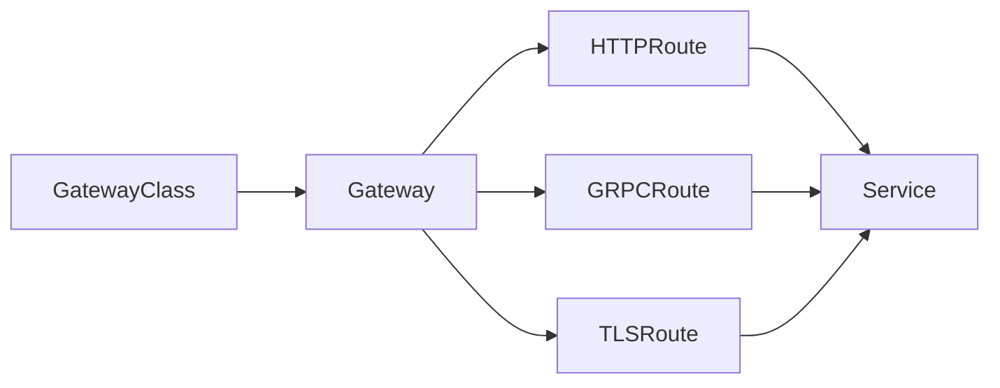

# Gateway API

Gateway API는 Kubernetes SIG Network가 관리하는 **Ingress의 후계 API**다.
역할 분리(GatewayClass·Gateway·Route), 다중 프로토콜(HTTP/gRPC/TCP/UDP/
TLS), 표준 필터·Policy Attachment, 크로스 namespace 참조(ReferenceGrant)
등으로 Ingress의 한계를 구조적으로 해소한다.

API group은 `gateway.networking.k8s.io`. 1.0 GA(2023-10) 이후 6개월 주기
릴리즈를 유지해 2026-04 현재 **v1.5**(2026-03-14)가 최신이며, 같은 API가
**north-south(외부→내부)**와 **east-west(mesh, GAMMA)** 두 영역을 포괄한다.

운영자 관점의 핵심 질문은 세 가지다.

1. **Ingress에서 어떻게 이관할까** — ingress2gateway v1.0과 수동 보정
2. **구현체는 무엇을 고를까** — Istio·Cilium·Envoy Gateway·NGF·Contour
3. **v1.5 ListenerSet·TLSRoute GA가 실무에 의미하는 것**

> 관련: [Ingress](./ingress.md) · [Service](./service.md)
> · [Network Policy](./network-policy.md)

---

## 1. 전체 구조 — 역할 분리



| 페르소나 | 역할 | 주요 리소스 |
|---|---|---|
| **Ian** (Infra Provider) | 클라우드·플랫폼 공급자 | `GatewayClass` |
| **Chihiro** (Cluster Operator) | 클러스터 관리자 | `Gateway`, `ListenerSet` |
| **Ana** (App Developer) | 애플리케이션 개발자 | `HTTPRoute`·`GRPCRoute`·`TLSRoute`·`ReferenceGrant` |

한 사람이 여러 페르소나를 겸할 수 있으나, 권한·책임을 RBAC 단위로
나누기 위한 설계다. Ingress는 이 분리가 불가능했다.

---

## 2. 버전 연대와 채널

### 주요 릴리즈

| 버전 | 시점 | 핵심 |
|:-:|---|---|
| v1.0 | 2023-10 | GA(GatewayClass·Gateway·HTTPRoute) |
| v1.1 | 2024 | **GRPCRoute GA**, **GAMMA Standard** |
| v1.2 | 2024 | BackendTLSPolicy Experimental |
| v1.4 | 2025 | **BackendTLSPolicy Standard** |
| **v1.5** | **2026-03-14** | **ListenerSet GA**, **TLSRoute Standard**, **CORS Filter GA**, Client Cert Validation GA |

### Channel

| Channel | 내용 | 안정성 |
|---|---|---|
| **Standard** | GA로 졸업한 리소스·필드 | 하위 호환 보장 |
| **Experimental** | Standard + alpha/beta | breaking change 가능, 제거 가능 |

졸업 기준: 최소 6개월 alpha 소화, 복수 구현체, 컨포먼스 테스트 커버,
마이너 1개 + 3개월간 중대 변경 없음. Gateway API는 **v1alpha2 → v1 직행**
기조(Beta 생략).

---

## 3. GatewayClass · Gateway

### GatewayClass (cluster-scoped)

```yaml
apiVersion: gateway.networking.k8s.io/v1
kind: GatewayClass
metadata:
  name: example
spec:
  controllerName: example.net/gateway-controller
  parametersRef:
    group: example.net
    kind: GatewayConfig
    name: default
```

- `controllerName` — 어느 컨트롤러가 처리할지 결정
- `parametersRef` — 구현체별 설정 주입(CR 권장, ConfigMap 허용)
- `status.conditions.Accepted` — 컨트롤러가 검증 후 True

### Gateway (namespace-scoped)

```yaml
apiVersion: gateway.networking.k8s.io/v1
kind: Gateway
metadata:
  name: prod
spec:
  gatewayClassName: example
  addresses:
  - type: IPAddress
    value: 10.0.0.100
  listeners:
  - name: http
    protocol: HTTP
    port: 80
  - name: https
    protocol: HTTPS
    port: 443
    tls:
      mode: Terminate
      certificateRefs:
      - name: example-tls
  allowedListeners:                 # ListenerSet 허용 범위 (1.5)
    namespaces:
      from: Selector
      selector:
        matchLabels: { tier: team }
  infrastructure:                   # 인프라 리소스에 전파
    labels:
      istio-injection: enabled
```

- `listeners`는 서로 **distinct**해야 함 — 트래픽은 하나의 listener에만 매칭
- listener 64개 상한 — 대규모는 **ListenerSet**으로 확장
- `spec.infrastructure`: 생성되는 LB·Pod에 라벨·어노테이션 전파
- status: `Accepted`·`Programmed`, `attachedListenerSets` count

---

## 4. Route 타입

| 리소스 | 프로토콜 | 레이어 | Standard 진입 |
|---|---|:-:|:-:|
| `HTTPRoute` | HTTP/HTTPS | L7 | v1.0 |
| `GRPCRoute` | HTTP/2 gRPC | L7 | v1.1 |
| **`TLSRoute`** | TLS (SNI) | L4 | **v1.5** |
| `TCPRoute` | TCP | L4 | Experimental |
| `UDPRoute` | UDP | L4 | Experimental |

Route-Gateway 연결: `parentRefs[{name, sectionName?, port?}]`. N:M 관계 허용.

---

## 5. HTTPRoute 상세

```yaml
apiVersion: gateway.networking.k8s.io/v1
kind: HTTPRoute
metadata:
  name: app
spec:
  parentRefs:
  - name: prod
    sectionName: https
  hostnames: ["app.example.com"]
  rules:
  - matches:
    - path: { type: PathPrefix, value: /api }
      headers:
      - { name: X-Canary, value: always }
    filters:
    - type: RequestHeaderModifier
      requestHeaderModifier:
        add: [{ name: X-Env, value: prod }]
    - type: URLRewrite
      urlRewrite:
        path: { type: ReplacePrefixMatch, replacePrefixMatch: /v2 }
    backendRefs:
    - name: api-v1
      port: 80
      weight: 90
    - name: api-v2
      port: 80
      weight: 10
    timeouts:
      request: 30s
      backendRequest: 5s
```

### Match 타입

| 종류 | 값 |
|---|---|
| path | `Exact`, `PathPrefix`, `RegularExpression` |
| headers | `Exact`, `RegularExpression` |
| queryParams | `Exact`, `RegularExpression` |
| method | `GET`·`POST`·... |

- matches 복수는 OR
- 미지정 시 `/` PathPrefix
- **가장 구체적인 매치가 우선**

### Filter 타입 (v1.5)

| Filter | Support | 비고 |
|---|:-:|---|
| `RequestHeaderModifier` | Core | set/add/remove |
| `ResponseHeaderModifier` | Core | set/add/remove |
| `RequestRedirect` | Core | 301/302/303/307/308 |
| `URLRewrite` | Extended | hostname·path 재작성 |
| `RequestMirror` | Extended | 응답은 무시 |
| **`CORS`** | **Core (v1.5 GA)** | allowOrigins·Methods·Headers·MaxAge |
| `ExtensionRef` | Impl-specific | 구현체 확장 |

**제약**: `URLRewrite`와 `RequestRedirect`는 **같은 rule에 동시 사용 불가**.

### Traffic Split — 표준 `weight`

```yaml
backendRefs:
- { name: v1, port: 80, weight: 90 }
- { name: v2, port: 80, weight: 10 }
```

Ingress의 canary는 컨트롤러별 어노테이션으로 파편화됐지만 Gateway API는
`weight`를 **표준**으로 정의한다. 합이 분모가 된다(여기서는 100).

### Timeouts

- `request`: 클라이언트↔게이트웨이 전체 트랜잭션
- `backendRequest`: 단일 백엔드 호출 (retry 시 재시작)
- `0s`는 비활성

---

## 6. GRPCRoute

```yaml
apiVersion: gateway.networking.k8s.io/v1
kind: GRPCRoute
metadata:
  name: login-service
spec:
  parentRefs: [{ name: prod }]
  hostnames: ["grpc.example.com"]
  rules:
  - matches:
    - method:
        service: com.example.User
        method: Login
    backendRefs:
    - name: user-svc
      port: 9000
```

- Filter·backendRef·weight는 HTTPRoute와 동일 문법
- **Service/Method 네이티브 매칭**이 핵심 차별점
- 같은 hostname·listener에서 HTTPRoute와 공존 가능하나 구현체가 분리 처리

---

## 7. GAMMA — Mesh 통합

Gateway API for Mesh Management and Administration. **v1.1에서 Standard**
진입. Service Mesh의 east-west 트래픽에 동일 API를 적용.

### 차이점

- **GatewayClass·Gateway 불필요**
- Route가 **Service를 parentRef**로 지정

```yaml
parentRefs:
- kind: Service
  name: my-service
```

### Service의 이중 역할

| 역할 | 의미 |
|---|---|
| Frontend | ClusterIP + DNS — 클라이언트 진입점 |
| Backend | endpoint IP 집합 — 실제 목적지 |

### Producer vs Consumer Route

| 구분 | namespace | 영향 |
|---|---|---|
| **Producer** | Service와 동일 ns | 클러스터 전체 소비자 |
| **Consumer** | Service와 다른 ns | 해당 ns에서 온 요청만 |

### Route 타입 충돌

`GRPCRoute > HTTPRoute > TLSRoute > TCPRoute`. 동일 Service/Port에
여러 타입이 있으면 낮은 쪽이 Rejected.

---

## 8. TLS 처리

TLS 세션은 두 방향이 **독립**이다.

| 방향 | 설정 위치 |
|---|---|
| Downstream (Client → Gateway) | Gateway `listener.tls` |
| Upstream (Gateway → Backend) | `BackendTLSPolicy` |

### Listener 프로토콜·모드

| Protocol | mode | 대응 Route |
|---|---|---|
| TLS | **Passthrough** | TLSRoute (Core) — Gateway는 복호화 불가 |
| TLS | **Terminate** | TLSRoute (Extended) — Gateway가 복호화 |
| HTTPS | Terminate (고정) | HTTPRoute |
| GRPC | Terminate (고정) | GRPCRoute |

### TLSRoute (v1.5 Standard)

- `hostnames` **필수** (FQDN, IP·와일드카드 불가)
- **SNI 기반 매칭**
- 마이그레이션 주의: v1.4 이하 Experimental의 `v1alpha2`/`v1alpha3`는
  Standard v1.5에서 자동 변환되지 **않는다**. Experimental 채널 유지 또는
  `v1`로 명시 재작성.

### Frontend mTLS (Client Cert Validation, v1.5 Standard)

- **Gateway 레벨** (listener별 아님) — HTTP/2 connection coalescing 우회 방지
- `caCertificateRefs`: ConfigMap (PEM CA 번들)
- `mode`: `AllowValidOnly`(기본) / `AllowInsecureFallback`

### Backend mTLS (v1.5 Standard)

- Gateway 전역 `tls.backend.clientCertificateRef` — 모든 업스트림에 적용
- GEP-3155

---

## 9. ReferenceGrant

크로스 namespace 참조는 **명시적 opt-in**. Ingress에 없는 핵심 차별점.

```yaml
apiVersion: gateway.networking.k8s.io/v1beta1
kind: ReferenceGrant
metadata:
  name: allow-route-to-svc
  namespace: backend            # 참조 당하는 쪽 ns
spec:
  from:
  - group: gateway.networking.k8s.io
    kind: HTTPRoute
    namespace: frontend         # 참조 주체 ns
  to:
  - group: ""
    kind: Service
```

### 필요한 경우 (Core)

- Gateway → Secret (TLS 인증서)
- Route → Service backendRef
- BackendTLSPolicy → CA ConfigMap
- Route → 다른 ns의 Gateway(listener `allowedRoutes`로도 통제)

### 규칙

- From/To 각 1쌍 (관계 복수면 Grant 복수)
- 누적식 — stack 가능
- 이름 단위 지정 없음 (rename 우회 방지)
- 없으면 크로스 ns 참조는 **invalid** → Route `ResolvedRefs=False`,
  reason `RefNotPermitted`

---

## 10. ListenerSet — v1.5 GA

Gateway listener 64개 한계·단일 write 경합을 푸는 리소스(GEP-1713).

### 메커니즘

1. Gateway에 `allowedListeners.namespaces`로 ListenerSet 허용 범위 지정
2. ListenerSet이 `parentRef`로 Gateway 가리킴
3. Gateway 컨트롤러가 Gateway + 부착된 ListenerSet의 listener를 **merge**
4. Route는 ListenerSet을 parentRef로 지정해 `sectionName`으로 타깃

```yaml
apiVersion: gateway.networking.k8s.io/v1
kind: ListenerSet
metadata:
  name: team-a-listeners
  namespace: team-a
spec:
  parentRef: { name: prod, namespace: infra }
  listeners:
  - name: https-a
    protocol: HTTPS
    port: 443
    hostname: a.example.com
    tls:
      certificateRefs: [{ name: a-cert }]
```

### 충돌 우선순위

동일 Port/Protocol/Hostname 충돌 시:

1. **Gateway 본체 listener 승**
2. ListenerSet `creationTimestamp` 오래된 쪽 승
3. `{namespace}/{name}` 알파벳 순

후발 주자는 기존을 밀어낼 수 없다(트래픽 안정성 보장). 충돌된 쪽은
`Accepted=False`, `Conflicted=True`.

### 언제 쓰나

- 수천 도메인 노출(수많은 per-service 인증서)
- 플랫폼 팀(Gateway)과 앱 팀(listener) **권한 분리**가 명확할 때
- 단일 팀 환경에서는 Gateway 본체만으로 충분 — 남발 금물

---

## 11. Policy Attachment 패턴

GEP-713으로 정의된 확장 모델.

| 종류 | 의미 |
|---|---|
| **Direct Policy Attachment** | targetRef의 단일 객체에만 영향 |
| **Inherited Policy Attachment** | 상위 객체에 붙이면 하위까지 상속 |

### 주요 Policy (2026-04)

| Policy | 채널 | 버전 | 목적 |
|---|---|---|---|
| `BackendTLSPolicy` | **Standard** | v1.4 | Gateway → Backend TLS (SNI·CA·검증) |
| `BackendTrafficPolicy` | Experimental | v1.3+ | retry budget, sessionPersistence |
| `BackendLBPolicy` | Experimental | v1.3+ | LB 옵션, sessionPersistence |
| Gateway backend client cert | Standard | v1.5 | Gateway 전역 업스트림 client cert |

### BackendTLSPolicy

```yaml
apiVersion: gateway.networking.k8s.io/v1
kind: BackendTLSPolicy
metadata:
  name: secure-backend
spec:
  targetRefs:
  - { group: "", kind: Service, name: my-backend }
  validation:
    hostname: my-backend.internal
    caCertificateRefs:
    - { kind: ConfigMap, name: my-ca-bundle }
```

- 와일드카드 hostname 금지
- CA ConfigMap 크로스 ns 금지(또는 ReferenceGrant 필요)

> `ClientTrafficPolicy`는 2026-04 기준 **Gateway API 공식 표준이 아님**
> (Envoy Gateway 등 벤더 확장). 표준 Policy와 혼동 주의.

---

## 12. 구현체 (v1.5 Conformance)

| 구현체 | 버전 | HTTPRoute | GRPCRoute | TLSRoute | 비고 |
|---|---|:-:|:-:|:-:|---|
| agentgateway | v1.0.0 | 35/35 | 10/10 | 12/12 | v1.5 만점 |
| envoy-gateway | v1.8.0-rc.0 | 34/35 | 9/10 | 11/12 | Envoy 공식 |
| kgateway | v2.3.0-beta.3 | 29/35 | 6/10 | 8/12 | 구 Gloo OSS |
| NGF (NGINX Gateway Fabric) | v2.5.0 | 26/35 | 7/10 | 7/12 | NGINX 공식 |
| Traefik | v3.7 | 14/35 | Core | 3/12 | |
| HAProxy Ingress | — | Core | Exp | — | |
| Istio | (Ambient) | 네이티브 | 네이티브 | 네이티브 | Mesh 주축 |
| Cilium | v1.17+ | 네이티브 | 네이티브 | 네이티브 | CNI + Gateway |
| Contour | — | Core | Core | Exp | Envoy 기반 |
| AWS Gateway API Controller | — | Partial | Partial | — | 클라우드 |
| GKE Gateway | — | Partial | Partial | — | 클라우드 |

### 선택 기준

| 환경 | 추천 |
|---|---|
| Service Mesh가 필요 | **Istio Ambient** (GAMMA + sidecarless) |
| CNI가 이미 Cilium | **Cilium Gateway** — kubeProxyReplacement 연동 |
| Envoy 기반 경량 | **Envoy Gateway** (conformance 1등급) |
| 기존 NGINX 운영 | **NGF** (NGINX Gateway Fabric) |
| 전통적 Envoy | **Contour** |

---

## 13. Ingress → Gateway 이관

### `ingress2gateway` v1.0 (2026-03)

```bash
go install github.com/kubernetes-sigs/ingress2gateway@v1.0.0
ingress2gateway print \
  --providers=ingress-nginx \
  --all-namespaces \
  --emitter=default \
  > gwapi.yaml
```

- Gateway API v1.5 타깃
- Provider: ingress-nginx·Istio·APISIX·Cilium·Kong·GCE·NGINX·OpenAPI 3
- Emitter: default·EnvoyGateway·GKE·AgentGateway·KGateway
- ingress-nginx **30+ 어노테이션**을 의미 변환 (CORS·TLS·rewrite 등)

### 철학

**어노테이션 그대로 복사하지 않음**. 공통적으로 쓰이는 어노테이션만
Gateway API 표준 필터·Policy로 **의미 변환**. 특수 어노테이션은 수동
보정이 필요.

### Ingress와 차이 요약

| 항목 | Ingress | Gateway API |
|---|---|---|
| 역할 분리 | 단일 리소스 혼재 | 3단 분리 |
| 크로스 namespace | 불가 | ReferenceGrant |
| L4 | 없음 | TCP/UDP/TLSRoute |
| 필터 체인 | 어노테이션 | 타입 기반 필터 |
| Traffic split | 어노테이션 | 표준 `weight` |
| TLS 모드 | Terminate만 | Passthrough + Terminate |
| Status | 빈약 | 상세 conditions |

---

## 14. 트러블슈팅

### Gateway가 Pending·`Programmed=False`

| condition | reason | 원인 |
|---|---|---|
| `Accepted=False` | `InvalidParameters` | parametersRef 문제 |
| `Accepted=False` | GatewayClass controllerName 오타 | 설치된 컨트롤러와 불일치 |
| `Programmed=False` | — | 주소 할당 실패 (LB·IPAM) |
| `listeners[].Conflicted=True` | — | 다른 listener와 충돌 |
| `listeners[].ResolvedRefs=False` | — | TLS Secret 참조 실패 |

### Route attachment 실패

| condition | 원인 |
|---|---|
| `Accepted=False`, `NotAllowedByListeners` | Gateway의 `allowedRoutes`에 막힘 |
| `Accepted=False`, `NoMatchingParent` | parentRefs의 Gateway/section 없음 |
| `ResolvedRefs=False`, `BackendNotFound` | Service 없음 |
| `ResolvedRefs=False`, `RefNotPermitted` | **크로스 ns인데 ReferenceGrant 누락** |

### 디버깅 명령

```bash
# 전체 상태 요약
kubectl get gateway,httproute,grpcroute -A -o wide

# Gateway 상세
kubectl describe gateway <name> -n <ns>

# Route conditions
kubectl get httproute <name> -o jsonpath='{.status.parents[*].conditions}' | jq

# ReferenceGrant 감사
kubectl get referencegrant -A -o yaml
```

### v1.5 TLSRoute 마이그레이션

기존 Experimental TLSRoute(`v1alpha2`/`v1alpha3`)는 Standard(`v1`)로 자동
변환되지 않는다. 두 경로 중 선택:

1. Experimental 채널 계속 사용
2. `v1`로 재작성

---

## 15. 안티패턴

| 안티패턴 | 이유 |
|---|---|
| 어노테이션으로 확장 시도 | Gateway API는 타입 기반 설계 — 이식성 상실 |
| `URLRewrite` + `RequestRedirect` 동시 사용 | **명시적 금지** |
| 크로스 namespace 참조에 ReferenceGrant 누락 | silent traffic drop |
| ListenerSet 남발 | 단일 팀 환경에서는 Gateway 본체로 충분 |
| TLSRoute Passthrough에 L7 기대 | Gateway 복호화 불가 |
| 동일 hostname에 HTTPRoute + GRPCRoute 충돌 | 구현체 reject |
| BackendTLSPolicy 없이 HTTPS 백엔드 가정 | listener HTTPS ≠ 업스트림 TLS |
| GatewayClass `controllerName` 오타 | Gateway 영구 Pending |
| Experimental TLSRoute 방치 후 v1.5 업그레이드 | Standard 채널 미지원 |
| Mesh에 Gateway 리소스 강제 투입 | GAMMA는 Service를 parentRef로 |

---

## 16. 프로덕션 체크리스트

### 인프라 (Ian·Chihiro)
- [ ] GatewayClass를 용도별로 복수 준비 (내부용·외부용)
- [ ] `parametersRef`는 CR로 버전 관리
- [ ] `spec.infrastructure.labels`로 Mesh 주입 라벨 전파 확인
- [ ] listener 포트 충돌 방지 표준 수립

### 보안
- [ ] Downstream mTLS 필요 서비스에 **Client Cert Validation** 적용
- [ ] 백엔드 TLS는 **BackendTLSPolicy로 명시**
- [ ] Secret·ConfigMap 크로스 ns 참조는 ReferenceGrant 확인
- [ ] Gateway 전역 클라이언트 cert가 의도 업스트림에만 적용되는지 검증

### 앱 (Ana)
- [ ] `status.parents[].conditions` 모니터링 (Accepted·ResolvedRefs)
- [ ] weight canary 합계 정책 문서화
- [ ] 크로스 ns backend 호출 시 ReferenceGrant를 매니페스트와 함께 관리
- [ ] `request`·`backendRequest` timeout 명시

### 운영
- [ ] 구현체 conformance 매트릭스와 기대 기능 매핑
- [ ] 구현체 업그레이드 시 CRD 채널(Standard/Experimental) 일치
- [ ] Ingress → Gateway 이관은 ingress2gateway로 **초안**만, 어노테이션
  특수 케이스 수동 보정
- [ ] ListenerSet 사용 시 `allowedListeners` 네임스페이스 셀렉터 감사
- [ ] GAMMA mesh 도입 시 Producer/Consumer Route 정책을 팀별 표준화

---

## 17. 이 카테고리의 경계

- **차세대 L7·L4 라우팅·역할 분리** → 이 글
- **Ingress 리소스·레거시 컨트롤러** → [Ingress](./ingress.md)
- **Service VIP·타입·정책** → [Service](./service.md)
- **DNS 해석** → [CoreDNS](./coredns.md)
- **네트워크 격리** → [Network Policy](./network-policy.md)
- **Service Mesh 구현**(Istio Ambient·Cilium Mesh·Linkerd) → `network/`
- **mTLS 정책·Zero Trust 전략** → `security/`

---

## 참고 자료

- [Gateway API 공식](https://gateway-api.sigs.k8s.io/)
- [Gateway API — API Overview](https://gateway-api.sigs.k8s.io/concepts/api-overview/)
- [Gateway API — Roles and Personas](https://gateway-api.sigs.k8s.io/concepts/roles-and-personas/)
- [Gateway API — Conformance](https://gateway-api.sigs.k8s.io/concepts/conformance/)
- [HTTPRoute](https://gateway-api.sigs.k8s.io/api-types/httproute/)
- [GRPCRoute](https://gateway-api.sigs.k8s.io/api-types/grpcroute/)
- [TLSRoute](https://gateway-api.sigs.k8s.io/api-types/tlsroute/)
- [ReferenceGrant](https://gateway-api.sigs.k8s.io/api-types/referencegrant/)
- [ListenerSet Guide](https://gateway-api.sigs.k8s.io/guides/listener-set/)
- [BackendTLSPolicy](https://gateway-api.sigs.k8s.io/api-types/backendtlspolicy/)
- [GAMMA — Mesh](https://gateway-api.sigs.k8s.io/mesh/)
- [Implementations v1.5](https://gateway-api.sigs.k8s.io/implementations/v1.5/)
- [Kubernetes Blog — Gateway API v1.5](https://kubernetes.io/blog/2026/04/21/gateway-api-v1-5/)
- [Kubernetes Blog — ingress2gateway v1.0](https://kubernetes.io/blog/2026/03/20/ingress2gateway-1-0-release/)
- [GEP-1713 — ListenerSet](https://gateway-api.sigs.k8s.io/geps/gep-1713/)
- [GEP-1426 — GAMMA](https://gateway-api.sigs.k8s.io/geps/gep-1426/)
- [GEP-3155 — Gateway Backend TLS](https://gateway-api.sigs.k8s.io/geps/gep-3155/)

(최종 확인: 2026-04-23)
