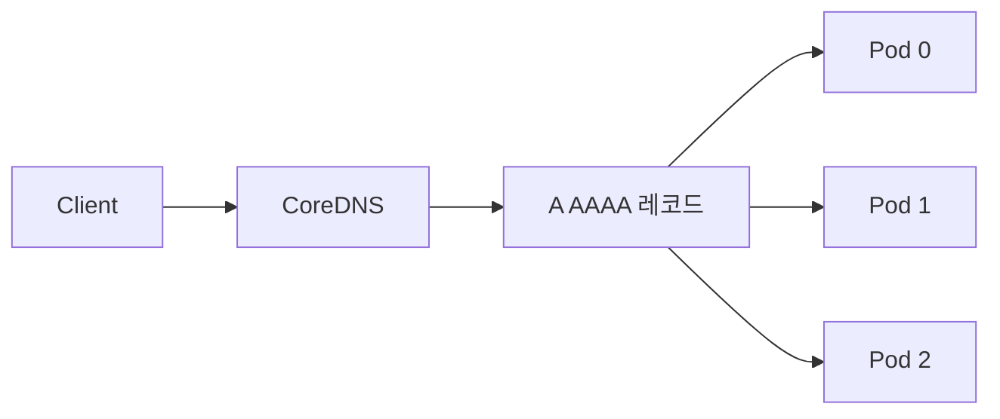

# Headless Service

Headless Service는 **VIP를 할당받지 않고** DNS가 backend Pod IP 집합을
직접 반환하는 Service다. `spec.clusterIP: None`으로 정의하며, kube-proxy는
**관여하지 않는다** (iptables·nftables·IPVS 규칙 생성 안 함).

`<pod-name>.<svc>.<ns>.svc.cluster.local` 형식의 **Pod별 DNS**를 제공해
**각 Pod의 안정 네트워크 ID**를 부여한다. 클러스터링·쿼럼 기반 분산
시스템(etcd·Zookeeper·Kafka·Cassandra·Elasticsearch·MongoDB replica set)의
peer discovery에 쓴다.

운영자 관점의 핵심 질문은 세 가지다.

1. **언제 Headless를 쓰는가** — 대부분의 HTTP 서비스에는 쓰지 말 것
2. **`publishNotReadyAddresses`의 의미** — peer discovery 부팅 시나리오
3. **gRPC·HTTP/2 장수명 연결에서 왜 첫 Pod만 과부하인가** — DNS 재조회·LB 정책

> 관련: [Service](./service.md) · [EndpointSlice](./endpointslice.md)
> · [CoreDNS](./coredns.md)

---

## 1. 전체 구조



일반 Service는 `Client → VIP → kube-proxy → Pod`이지만 Headless는 **VIP
단계가 없고** 클라이언트가 받은 A 레코드 중 하나로 직접 연결한다.

### 일반 ClusterIP와의 차이

| 항목 | ClusterIP | Headless |
|---|---|---|
| `spec.clusterIP` | 자동 할당 IP | `None` |
| VIP | 존재 | 없음 |
| kube-proxy 규칙 | 생성 | 생성 안 함 |
| 로드밸런싱 주체 | 커널 (conntrack) | **클라이언트** |
| DNS A 응답 | 1개(VIP) | **N개** (모든 Pod IP) |
| SRV 응답 | VIP 기준 1개 | Pod마다 1개 |
| `sessionAffinity` | 적용 | 무의미 |
| `internalTrafficPolicy`/`externalTrafficPolicy` | 적용 | 무의미 |
| `trafficDistribution` | 적용 | 무의미 |
| NodePort·LoadBalancer 타입 | 가능 | **불가** (모순) |
| 외부 접근 | 가능 | **불가** |
| Pod별 DNS | 없음 | 있음 |

---

## 2. 두 가지 변형

### selector 있음

endpoints controller가 자동으로 EndpointSlice 생성, DNS가 selector에
매칭되는 Pod의 IP를 복수 A/AAAA로 반환.

```yaml
apiVersion: v1
kind: Service
metadata:
  name: mysql
spec:
  clusterIP: None
  selector:
    app: mysql
  ports:
  - name: mysql
    port: 3306
    targetPort: 3306
```

### selector 없음

control plane이 EndpointSlice를 만들지 **않는다**. 관리자·외부 컨트롤러가
수동으로 EndpointSlice를 생성해야 한다. 외부 DB·다른 클러스터 서비스
연결 등에 사용.

> **제약**: selector 없는 Headless는 **`port`와 `targetPort`가 동일해야
> 한다** (공식).

자세한 selectorless 패턴은 [EndpointSlice](./endpointslice.md) 7장 참조.

---

## 3. StatefulSet과의 관계

### `serviceName` 필수

StatefulSet은 `spec.serviceName`이 **반드시 Headless Service**를 가리켜야
한다. Service가 없거나 Headless가 아니면 Pod별 DNS가 해석되지 않는다.
StatefulSet 컨트롤러는 Service를 자동 생성하지 않으므로 **사용자가 직접
만들어야 한다**.

### Pod별 DNS 포맷

```
<pod-name>.<service-name>.<namespace>.svc.<cluster-domain>
```

예: `mysql-0.mysql.default.svc.cluster.local`

### hostname · subdomain 메커니즘

StatefulSet 컨트롤러가 각 Pod에 자동 설정:
- `spec.hostname = <pod-name>`
- `spec.subdomain = <serviceName>`

일반 Pod도 `hostname`·`subdomain`을 **수동으로** 지정하면 같은 패턴의
Pod별 DNS를 얻을 수 있다.

### 대표 사용처

| 시스템 | 이유 |
|---|---|
| **etcd** | Raft quorum, peer discovery |
| **Zookeeper** | leader election, ensemble 구성 |
| **Kafka** | broker.id ↔ DNS 매핑 (KRaft 모드 포함) |
| **Cassandra** | seed list, gossip |
| **Elasticsearch / OpenSearch** | `discovery.seed_hosts` |
| **MongoDB replica set** | `rs.initiate()` 호스트명 고정 |
| **Redis Cluster / Sentinel** | 노드 고정 |
| **MinIO 분산 모드** | 노드 이름 고정 |
| **Consul / Vault Raft** | 동일 |

---

## 4. DNS 레코드 상세

### A / AAAA

| 레벨 | 이름 | 반환 |
|---|---|---|
| Service | `<svc>.<ns>.svc.<domain>` | selector 매칭(또는 수동 EndpointSlice)의 **모든 Pod IP** |
| Pod | `<hostname>.<svc>.<ns>.svc.<domain>` | 단일 Pod IP |

**Ready Pod만** 포함된다 (기본). `publishNotReadyAddresses: true`면 NotReady
Pod도 포함(5장).

### SRV

`port`에 `name`이 있어야 SRV가 생긴다.

| Service 종류 | SRV 응답 |
|---|---|
| Regular | 포트 번호 + `<svc>.<ns>.svc.<domain>` |
| **Headless** | **각 Pod마다** 포트 번호 + `<hostname>.<svc>.<ns>.svc.<domain>` |

쿼리: `_<port-name>._<proto>.<svc>.<ns>.svc.<domain>`

### hostname 없는 Pod

hostname 없는 Pod는 **Pod별 A/AAAA를 못 가진다**. StatefulSet은 자동으로
hostname을 설정하므로 괜찮지만, 일반 Deployment Pod를 Headless로 쓸 때는
`spec.hostname`·`spec.subdomain` 수동 설정이 필요하다.

### CoreDNS 추가 레코드

CoreDNS는 Pod IP 기반 A 레코드도 제공한다.

```
<pod-ipv4-dashed>.<svc>.<ns>.svc.<domain>
예: 10-1-2-3.mysql.default.svc.cluster.local
```

---

## 5. `publishNotReadyAddresses`

```yaml
spec:
  publishNotReadyAddresses: true
```

기본 `false`. `true`면 **Ready가 아닌 Pod도 DNS/EndpointSlice에 등록**.

### peer discovery 부팅 시나리오

분산 시스템 초기 부팅은 **닭-달걀 문제**다.

- etcd·Zookeeper는 **quorum 형성 전까지 readiness probe가 FAIL**
- 그런데 peer 발견은 **DNS로** 한다
- Ready가 아니면 DNS에 안 나타나서 서로를 못 찾음
- `publishNotReadyAddresses: true`로 **초기부터 서로를 DNS에서 볼 수 있게**
  해준다

**일반 ClusterIP에 이 옵션을 쓰면 장애 Pod로 트래픽이 흐른다**.
Headless + StatefulSet peer discovery에만 제한적으로 쓴다.

### EndpointSlice 3축과의 관계

[EndpointSlice](./endpointslice.md)의 `serving`·`ready`·`terminating` 중
**`ready`를 사실상 항상 true로 강제**하는 shortcut. 세밀한 제어가 필요하면
Controller 차원에서 조건을 직접 관리하는 편이 낫다.

---

## 6. DNS 관점 주의사항

### 클라이언트가 복수 A 레코드를 활용하는가

Headless의 진가는 **클라이언트가 여러 A 레코드를 인지·활용**할 때 나온다.
아니면 한 Pod로만 몰린다.

| 클라이언트 | 기본 동작 |
|---|---|
| glibc `getaddrinfo` | 반환 순서대로 시도 — **대부분 앱은 첫 번째만 사용** |
| musl libc | 동일 |
| Java `InetAddress.getByName` | **첫 주소만 반환** (`getAllByName` 써야 전체) |
| Java 캐시 `networkaddress.cache.ttl` | 기본 30s 또는 정책 의존. `-1`(영구)이면 운영 재앙 |
| Python `socket.getaddrinfo` | 전체 반환, 사용은 앱 선택 |
| Go 표준 resolver | 전체 반환, `net.Dialer`는 순차 fallback |
| gRPC-Go `dns` resolver | 전체 활용 + 주기적 재조회 |

### DNS TTL 정책

- CoreDNS `kubernetes` 플러그인 기본 TTL: 짧게(수 초) 설정되는 경우가 많음
- NodeLocal DNSCache로 TTL 재캐싱
- 애플리케이션·libc·JVM의 별도 캐시 존재

장수명 연결 + NodeLocal DNSCache 조합에서는 **Pod 재생성 후 오래된 IP가
일정 시간 반환**될 수 있다. 서버 측에서 주기적 재연결을 강제하는 설계가
안전.

### `ndots:5` 함정

`/etc/resolv.conf` 기본 `ndots:5`는 Headless에도 동일하게 영향. 외부 도메인
접근 시 FQDN 말미에 `.`을 붙이거나 `dnsConfig.options`로 낮춘다. 상세는
[CoreDNS](./coredns.md).

---

## 7. gRPC·HTTP/2 연결 재사용 이슈

### 근본 문제

- HTTP/2는 **단일 장수명 TCP에 stream을 다중화**
- DNS round-robin은 **신규 연결**에서만 동작
- 클라이언트가 재조회·재연결 없이 한 번 연결하면 **한 Pod로 영구 고정**

### 클라이언트 전략

- gRPC-Go `dns:///<svc>.<ns>.svc.cluster.local:<port>` resolver
- `round_robin` / `pick_first` / `weighted_round_robin` LB 정책
- `keepalive.ClientParameters`로 idle 연결 리사이클

### 서버 측 강제 재연결

`grpc.MaxConnectionAge` + `MaxConnectionAgeGrace`: 서버가 주기적으로
`GOAWAY`를 보내 클라이언트의 재연결을 유도 → 새 DNS 조회·Pod 재분배.

### Service Mesh가 해결하는 문제

- **Istio·Linkerd·Cilium Mesh**: sidecar/ambient proxy가 HTTP/2 인식,
  **request-level LB** 자동
- **xDS**: Envoy가 EndpointSlice를 EDS로 받아 동적 반영

소규모에서는 Headless + gRPC LB로 충분하지만, 대규모·헬스체크·지연 기반
LB가 필요하면 Service Mesh가 유리하다. Mesh 구현 상세는 `network/`.

---

## 8. 제한사항

| 제한 | 이유 |
|---|---|
| **외부 접근 불가** | VIP 없음 → `type: LoadBalancer`·`NodePort` 선택 불가 |
| `sessionAffinity` 무효 | kube-proxy 미관여 |
| `internalTrafficPolicy`·`externalTrafficPolicy` 무효 | VIP·proxy 없음 |
| `trafficDistribution` 무효 | 동일 |
| `loadBalancerClass` 등 LB 필드 무효 | 동일 |
| DNS 장애 시 discovery 전면 실패 | 전적으로 DNS에 의존 |
| 클라이언트 재조회 없으면 LB 이점 상실 | 장수명 연결 문제 |
| port `name` 없으면 SRV 없음 | DNS 스펙 |
| hostname 없는 Pod는 Pod별 A 없음 | 자동 생성 조건 |

Network Policy는 Pod IP 기반이므로 **Headless라도 적용된다** — 제한 아님.

---

## 9. 설정 예시 (StatefulSet)

```yaml
# Headless Service
apiVersion: v1
kind: Service
metadata:
  name: zookeeper
spec:
  clusterIP: None
  publishNotReadyAddresses: true     # peer discovery용
  selector:
    app: zookeeper
  ports:
  - name: client
    port: 2181
  - name: peer
    port: 2888
  - name: leader
    port: 3888
---
# StatefulSet
apiVersion: apps/v1
kind: StatefulSet
metadata:
  name: zookeeper
spec:
  serviceName: zookeeper               # Headless Service 이름과 일치
  replicas: 3
  selector:
    matchLabels:
      app: zookeeper
  template:
    metadata:
      labels:
        app: zookeeper
    spec:
      containers:
      - name: zk
        image: ...
        env:
        - name: ZOO_SERVERS
          value: >-
            server.1=zookeeper-0.zookeeper.default.svc.cluster.local:2888:3888
            server.2=zookeeper-1.zookeeper.default.svc.cluster.local:2888:3888
            server.3=zookeeper-2.zookeeper.default.svc.cluster.local:2888:3888
```

핵심: StatefulSet의 `serviceName`(`zookeeper`)이 Headless Service 이름과
정확히 같아야 Pod별 DNS가 `zookeeper-0.zookeeper.default.svc...`로 해석된다.

---

## 10. 트러블슈팅

| 증상 | 확인 |
|---|---|
| Pod별 DNS가 해석 안 됨 | StatefulSet `serviceName` = Headless Service `metadata.name`, Service `clusterIP: None`, 같은 namespace, selector 매칭 |
| SRV 레코드 누락 | `spec.ports[].name` 설정 여부 |
| NotReady Pod가 DNS에 안 뜸 | `publishNotReadyAddresses: true` 필요 여부 |
| 오래된 IP 반환 | CoreDNS TTL, NodeLocal DNSCache TTL, 앱 resolver 캐시(JVM `networkaddress.cache.ttl`) |
| 한 Pod로만 트래픽 쏠림 | HTTP/2·gRPC 장수명 연결, 클라이언트가 복수 A 활용 X |
| `<svc>`는 풀리는데 `<pod>.<svc>` 안 풀림 | Pod에 `hostname`·`subdomain` 설정 여부 |

### 디버깅 명령

```bash
# Service 레벨 A 레코드
kubectl run tmp --rm -it --image=busybox -- \
  nslookup zookeeper.default.svc.cluster.local

# Pod별 A 레코드
kubectl run tmp --rm -it --image=busybox -- \
  nslookup zookeeper-0.zookeeper.default.svc.cluster.local

# SRV 레코드
kubectl run tmp --rm -it --image=busybox -- \
  nslookup -type=SRV _client._tcp.zookeeper.default.svc.cluster.local

# EndpointSlice 상태
kubectl get endpointslice -l kubernetes.io/service-name=zookeeper -o yaml

# CoreDNS 로그
kubectl -n kube-system logs -l k8s-app=kube-dns
```

---

## 11. 안티패턴

| 안티패턴 | 문제 | 대안 |
|---|---|---|
| 일반 HTTP/1.1 stateless 앱에 Headless | client-side LB 복잡도만 추가 | 일반 ClusterIP |
| 일반 ClusterIP에 `publishNotReadyAddresses: true` | 장애 Pod로 트래픽 | Headless + StatefulSet 한정 |
| Headless + `sessionAffinity: ClientIP` | 효과 없음 | VIP가 있는 ClusterIP |
| Headless + `type: LoadBalancer`·`NodePort` | 모순 | 별도 Gateway·Ingress |
| StatefulSet만 만들고 Headless Service 안 만듦 | Pod별 DNS 해석 불가 | Service 필수 생성 |
| selectorless Headless에 `port ≠ targetPort` | 공식 제약 위반 | 동일하게 |
| JVM `networkaddress.cache.ttl=-1` | IP 영구 캐싱 | 합리적 TTL 또는 JVM 옵션 오버라이드 |
| Headless + gRPC만 믿고 재연결 전략 없음 | 첫 Pod만 과부하 | 서버 `MaxConnectionAge`, 클라이언트 round_robin |
| StatefulSet `serviceName`과 Service 이름 불일치 | Pod별 DNS 안 뜸 | 정확히 일치 |

---

## 12. 프로덕션 체크리스트

### 설계
- [ ] **정말 Pod별 고유 네트워크 ID가 필요한가** 먼저 재확인 (아니면 ClusterIP)
- [ ] 클라이언트 라이브러리가 복수 A 레코드·재조회·request-level LB 지원
- [ ] peer discovery 부팅에서 `publishNotReadyAddresses` 필요 여부 판단
- [ ] port `name` 지정 (SRV 필요 시)
- [ ] StatefulSet `serviceName` = Headless Service 이름
- [ ] Service selector ⊇ StatefulSet Pod labels
- [ ] `ipFamilyPolicy`·`ipFamilies`가 의도(A/AAAA)에 맞음

### DNS·캐시
- [ ] CoreDNS TTL, NodeLocal DNSCache TTL, 앱 resolver 캐시 정책 일관성
- [ ] JVM 기본 `networkaddress.cache.ttl` 명시적 설정
- [ ] 외부 도메인은 FQDN 또는 `ndots` 튜닝

### 장수명 연결
- [ ] gRPC 서버 `MaxConnectionAge`·`MaxConnectionAgeGrace`
- [ ] 클라이언트 `round_robin` LB 정책 + 주기적 재조회
- [ ] 대규모면 Service Mesh 검토

### 운영
- [ ] 외부 노출이 필요하면 **별도 Ingress·Gateway** 리소스
- [ ] DNS 장애 시 discovery 전면 실패를 전제로 한 런북
- [ ] StatefulSet replica 변경 시 peer 리스트(ZOO_SERVERS 등) 재구성 전략

---

## 13. 이 카테고리의 경계

- **VIP 없는 Service + Pod별 DNS** → 이 글
- **Service 일반** → [Service](./service.md)
- **endpoint 집합 관리·수동 생성** → [EndpointSlice](./endpointslice.md)
- **CoreDNS 내부·NodeLocal DNSCache** → [CoreDNS](./coredns.md)
- **StatefulSet 리소스 자체·Pod identity** → `workloads/`
- **Service Mesh 구현(xDS·Istio·Linkerd)** → `network/`

---

## 참고 자료

- [Kubernetes — Service (Headless)](https://kubernetes.io/docs/concepts/services-networking/service/#headless-services)
- [DNS for Services and Pods](https://kubernetes.io/docs/concepts/services-networking/dns-pod-service/)
- [StatefulSet](https://kubernetes.io/docs/concepts/workloads/controllers/statefulset/)
- [EndpointSlices](https://kubernetes.io/docs/concepts/services-networking/endpoint-slices/)
- [NodeLocal DNSCache](https://kubernetes.io/docs/tasks/administer-cluster/nodelocaldns/)
- [gRPC Load Balancing on Kubernetes without Tears (2018)](https://kubernetes.io/blog/2018/11/07/grpc-load-balancing-on-kubernetes-without-tears/)

(최종 확인: 2026-04-23)
