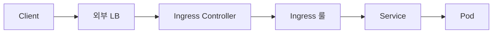

# Ingress

Ingress는 **클러스터 외부의 HTTP/HTTPS 트래픽을 내부 Service로 라우팅**
하는 L7 리소스다. API는 K8s 코어에 있지만 실제 트래픽 처리는 **Ingress
Controller**(ingress-nginx·Traefik·HAProxy·Contour·Envoy 기반 등)가
구현한다.

`networking.k8s.io/v1`이 1.19에서 GA된 이후 **API는 공식적으로 frozen**
상태다. 새 기능은 전부 [Gateway API](./gateway-api.md)로 이동했고, 공식
권장도 **신규는 Gateway API, 기존 Ingress는 유지**다. **Endpoints와 달리
deprecated는 아님** — 제거 계획 없음.

2026년 현재 실무에서 가장 큰 변화는 **ingress-nginx의 retirement(2026-03)
이후 생태계**다. 새 컨트롤러 선택과 Gateway API 이관이 운영 과제다.

운영자 관점의 핵심 질문:

1. **Gateway API로 지금 이관해야 하나** — 시점·도구·이식 방법
2. **ingress-nginx 대안은** — Contour·Traefik·HAProxy·NGF 비교
3. **어노테이션 기반 확장의 이식성 문제**를 어떻게 다루나

> 관련: [Service](./service.md) · [Gateway API](./gateway-api.md)
> · [Network Policy](./network-policy.md) · [CoreDNS](./coredns.md)

---

## 1. 전체 구조



| 컴포넌트 | 역할 |
|---|---|
| 외부 LB | 온프레는 MetalLB·kube-vip, 클라우드는 LB 서비스 |
| **Ingress Controller** | Ingress·IngressClass watch → NGINX/HAProxy/Envoy 설정 프로그래밍 |
| Ingress 리소스 | host·path·TLS·backend 규칙 |
| IngressClass | 여러 컨트롤러 공존 |

**Ingress 리소스만 만들면 아무 일도 안 일어난다**. 반드시 Controller가
설치되어 있어야 한다.

---

## 2. 현재 상태 — API freeze와 Gateway API

| 항목 | 2026-04 현황 |
|---|---|
| Ingress API `networking.k8s.io/v1` | **Stable, feature-frozen** |
| 신규 기능 추가 | 없음 (API 동결) |
| Deprecated | **아님** |
| 제거 계획 | 없음 |
| 공식 권장 | 신규는 **Gateway API**, 기존은 유지 |
| Gateway API 최신 | **v1.5** (2026-03-14) |

**공식 표현**: "Ingress is frozen. New features are being added to the
Gateway API." 기존 배포의 안정성은 보장된다.

---

## 3. 리소스 구조

```yaml
apiVersion: networking.k8s.io/v1
kind: Ingress
metadata:
  name: my-ingress
spec:
  ingressClassName: nginx
  tls:
  - hosts: ["example.com", "www.example.com"]
    secretName: example-tls
  rules:
  - host: example.com
    http:
      paths:
      - path: /
        pathType: Prefix
        backend:
          service:
            name: frontend
            port:
              number: 80
      - path: /api
        pathType: Prefix
        backend:
          service:
            name: api
            port:
              name: http
  defaultBackend:
    service:
      name: fallback
      port: { number: 80 }
```

### 필드

| 필드 | 의미 |
|---|---|
| `ingressClassName` | IngressClass 참조 (1.19+) |
| `rules[]` | host·path 규칙 배열 |
| `tls[]` | TLS 설정 (port 443만) |
| `defaultBackend` | 어떤 rule에도 매치 안 될 때 fallback. rules 없으면 필수 |

### `pathType`

| 값 | 동작 | 예 |
|---|---|---|
| `Exact` | URL 완전 일치 (대소문자 구분) | `/foo` = `/foo`만 매치 |
| `Prefix` | `/` 기준 element 단위 접두사 | `/foo` = `/foo`·`/foo/`·`/foo/bar` |
| `ImplementationSpecific` | 컨트롤러 재량 | **이식성 떨어짐 — 명시적 Prefix/Exact 권장** |

**여러 path 매치 시 가장 긴 match가 이긴다** (longest matching path).

### host

- FQDN 또는 단일 라벨 와일드카드(`*.example.com`)
- 미지정 시 모든 트래픽 매치

---

## 4. IngressClass

```yaml
apiVersion: networking.k8s.io/v1
kind: IngressClass
metadata:
  name: nginx
  annotations:
    ingressclass.kubernetes.io/is-default-class: "true"
spec:
  controller: k8s.io/ingress-nginx
  parameters:
    apiGroup: k8s.io
    kind: IngressParameters
    name: nginx-params
```

- **Cluster-scoped** 리소스
- `spec.controller`: 컨트롤러 식별자
- `is-default-class: "true"`: ingressClassName 생략 시 기본

### 어노테이션 vs 필드

**`kubernetes.io/ingress.class` 어노테이션은 deprecated**. 반드시
`ingressClassName` 필드를 사용한다.

---

## 5. 주요 컨트롤러 (2026-04)

| 컨트롤러 | 기반 | 비고 | Gateway API |
|---|---|---|---|
| ~~ingress-nginx~~ | NGINX | **2026-03 retirement** — 유지보수 종료 | 제한적 |
| **NGINX Ingress Controller (NGF)** | NGINX | F5/NGINX Inc 공식, Gateway API 후속 | 있음 |
| **Traefik** | Traefik | 자동 서비스 발견, Let's Encrypt 통합 | 있음 |
| **HAProxy Ingress** | HAProxy | 최고 성능, zero-downtime reload | 있음 |
| **Kong** | Kong/NGINX | 풀 API 게이트웨이, 플러그인 | 있음 |
| **Contour** | Envoy | Envoy 기반, Service Mesh 진입 쉬움 | 있음 |
| **Emissary-Ingress** | Envoy | Ambassador Labs | 있음 |
| **Istio Ingress Gateway** | Envoy | Service Mesh 통합 | 네이티브 |
| **Cilium Ingress** | Envoy + eBPF | `kubeProxyReplacement` 연동 | 네이티브 |
| **Envoy Gateway** | Envoy | Gateway API first | 네이티브 |

### Cilium Ingress 특기

- `gatewayAPI.enabled=true` + `kubeProxyReplacement=true`
- L4는 eBPF로 커널 처리, L7은 Envoy 위임
- 고 route churn 환경 트래픽 드롭 사례 보고됨 — 벤치마크 필수

---

## 6. ingress-nginx Retirement (2026-03)

### 타임라인

| 시점 | 이벤트 |
|---|---|
| 2025-03 | **IngressNightmare** CVE (CVE-2025-1974 포함 4건, CVSS 9.8) |
| 2025-11 | K8s SIG Network·Security Response Committee 공식 retirement 발표 |
| 2026-01-29 | Steering Committee 추가 경고 성명 |
| **2026-03** | **유지보수 종료**, `kubernetes-retired/`로 아카이브 |

### 왜 retirement인가

- **유지보수 인력 부족** (1–2명이 주말·야근 유지)
- `snippets` 어노테이션 등 구조적 공격면
- InGate 후속 프로젝트 진전 실패
- 40%+ K8s 클러스터에 배포된 생태계 전체 이슈

### 영향

- 기존 배포는 즉시 중단되지 않음 (Helm/이미지 유지)
- **새 보안 패치 없음** → 사용 지속 = **취약 방치**
- 2026년 추가 CVE (CVE-2026-24512 · CVE-2026-1580 등)가 마지막 패치

### 대응

1. **Gateway API로 이관** (1순위 권장)
2. 다른 Ingress Controller (Contour·Traefik·HAProxy·NGF)

### 빠른 사용 여부 확인

```bash
kubectl get pods -A \
  --selector app.kubernetes.io/name=ingress-nginx
```

---

## 7. TLS

### 기본

```yaml
spec:
  tls:
  - hosts: [example.com, www.example.com]
    secretName: example-tls
```

Secret은 `type: kubernetes.io/tls`, 키 `tls.crt` + `tls.key`.

### SNI

여러 `tls` 항목을 같은 443 포트에서 SNI로 다중화한다. 와일드카드는
**단일 DNS 라벨만** 가능 (`*.example.com` OK, `*.*.example.com` NO).

### cert-manager + 자동 갱신

```yaml
metadata:
  annotations:
    cert-manager.io/cluster-issuer: letsencrypt-prod
```

cert-manager가 Secret을 자동 생성·갱신(만료 30일 전). 온프레미스는
**DNS-01 challenge** 우선 — 사설망에서 HTTP-01은 외부 접근 문제로
실패하기 쉽다.

---

## 8. 어노테이션 확장의 본질적 한계

Ingress API 자체가 frozen이므로 **확장은 전부 어노테이션**이다. 컨트롤러
마다 네임스페이스·의미가 다르다 → **이식성 제로**. Gateway API가 생긴
주요 동기.

### ingress-nginx 주요 카테고리

| 카테고리 | 어노테이션 예 |
|---|---|
| Rewrite | `rewrite-target`, `app-root`, `use-regex` |
| Rate Limit | `limit-rps`, `limit-connections`, `limit-burst-multiplier` |
| Auth | `auth-type`, `auth-url`, `auth-signin` |
| CORS | `enable-cors`, `cors-allow-origin` |
| Canary | `canary`, `canary-weight`, `canary-by-header` |
| Session Affinity | `affinity`, `session-cookie-name` |
| Timeout | `proxy-connect-timeout`, `proxy-read-timeout` |
| TLS | `ssl-redirect`, `force-ssl-redirect`, `hsts` |
| Backend Protocol | `backend-protocol`: HTTP/HTTPS/GRPC/FCGI |
| Snippet | `configuration-snippet`, `server-snippet` — **CVE 원인, 비활성화 권장** |

### Snippets 위험

`--allow-snippet-annotations=false`(기본 false로 변경). 멀티테넌트에서
반드시 비활성 유지.

---

## 9. Canary · A/B 테스트

### ingress-nginx 어노테이션

```yaml
metadata:
  annotations:
    nginx.ingress.kubernetes.io/canary: "true"
    nginx.ingress.kubernetes.io/canary-weight: "10"
    # 또는
    nginx.ingress.kubernetes.io/canary-by-header: "X-Canary"
    nginx.ingress.kubernetes.io/canary-by-header-value: "always"
```

우선순위: `canary-by-header` > `canary-by-cookie` > `canary-weight`.

### 점진 롤아웃 자동화

- **Flagger**: SLO/메트릭 기반 자동 승격·롤백
- **Argo Rollouts**: Rollout CR로 canary-weight 자동 조절

### Gateway API 표준화

Ingress는 canary가 컨트롤러별 어노테이션으로 파편화. Gateway API의
`HTTPRoute`는 `backendRefs[].weight` 필드가 **내장** — 이식 가능.

---

## 10. Ingress vs Gateway API

| 기능 | Ingress | Gateway API |
|---|---|---|
| HTTP/HTTPS | O | O |
| TCP/UDP | ❌ | O (`TCPRoute`/`UDPRoute`) |
| gRPC | 어노테이션 | O (`GRPCRoute`) |
| WebSocket | 어노테이션 | O |
| TLS passthrough | 어노테이션 | O (`TLSRoute`) |
| Traffic split (canary) | 어노테이션 | **표준 `weight`** |
| Header/Method/Query 매칭 | 어노테이션 | 표준 필터 |
| URL Rewrite | 어노테이션 | `URLRewrite` 필터 |
| Redirect | 어노테이션 | `RequestRedirect` 필터 |
| Request Mirror | 어노테이션 | `RequestMirror` 필터 |
| 크로스 namespace 참조 | 불가 | `ReferenceGrant` |
| 역할 분리(Infra/Cluster/App) | 불가 | 내장 |

상세는 [Gateway API](./gateway-api.md).

### 이관 도구: `ingress2gateway` v1.0 (2026-03)

```bash
go install github.com/kubernetes-sigs/ingress2gateway@v1.0.0
ingress2gateway print --all-namespaces \
  --providers=ingress-nginx > gwapi.yaml
```

- ingress-nginx 어노테이션 **30+개** 지원 (CORS·TLS·rewrite·regex 등)
- Emitter: `agentgateway`·`envoy-gateway`·`kgateway`
- ingress-nginx·Istio·APISIX·Cilium 프로바이더 지원

---

## 11. 관측·메트릭

### ingress-nginx 예시 (포트 10254)

| 메트릭 | 의미 |
|---|---|
| `nginx_ingress_controller_requests` | 요청 카운터(status·method·host·path) |
| `nginx_ingress_controller_request_duration_seconds` | 요청 처리 지연 |
| `nginx_ingress_controller_response_duration_seconds` | 업스트림 응답 지연 |
| `nginx_ingress_controller_config_last_reload_successful` | 마지막 reload 성공 |
| `nginx_ingress_controller_ssl_expire_time_seconds` | **SSL 만료 시각** — 알람 필수 |
| `nginx_ingress_controller_orphan_ingress` | Orphan Ingress 감지 |

### PromQL 예시

```promql
# 5xx 비율
sum(rate(nginx_ingress_controller_requests{status=~"5.."}[5m]))
  / sum(rate(nginx_ingress_controller_requests[5m]))

# p99 요청 지연
histogram_quantile(0.99,
  sum by (le, host) (
    rate(nginx_ingress_controller_request_duration_seconds_bucket[5m])))

# SSL 만료 14일 전 경보
(nginx_ingress_controller_ssl_expire_time_seconds - time()) < 86400 * 14
```

### 카디널리티 주의

와일드카드 host 또는 동적 path가 많으면 라벨 폭발 위험. host·path 차원
집계 정책을 미리 정한다.

---

## 12. 트러블슈팅

### 외부 접근 불가

| 원인 | 확인 |
|---|---|
| IngressController 미배포 | `kubectl get pods -n <ns>` |
| `ingressClassName` 매치 실패 | `kubectl describe ingress` → `Class: <none>` |
| 기본 IngressClass 미지정 | `ingressclass.kubernetes.io/is-default-class` 확인 |
| Service 없음·selector 불일치 | `kubectl get endpoints <svc>` |
| LoadBalancer external IP pending | 온프레는 MetalLB·kube-vip 필요 |
| Pod가 80/443 바인딩 실패 | hostNetwork·NodePort 설정 |

### TLS 문제

- Secret name 오타 → `kubectl describe ingress` 이벤트
- Secret이 **다른 namespace** → Ingress와 동일 namespace 필수
- cert-manager 갱신 실패 → Certificate 상태, Order/Challenge 확인
- HTTP-01 challenge 경로 차단 → `/.well-known/acme-challenge/*` 허용

### 다중 Ingress host/path 충돌

- 같은 host에 여러 Ingress면 컨트롤러가 머지
- ingress-nginx는 **생성 순서**(가장 오래된 것) 우선
- path 겹치면 예측 불가 → 단일 Ingress로 통합

### pathType `ImplementationSpecific` 이식성

| 컨트롤러 | 해석 |
|---|---|
| ingress-nginx | Prefix 유사 (path 없어도 `/`로 기본화) |
| Cilium | Exact로 해석 |

**이식 코드에서는 Prefix/Exact 명시**.

### 디버깅 명령

```bash
kubectl describe ingress <name>
kubectl logs -n <ns> <controller-pod> -f
kubectl exec -n <ns> <controller-pod> -- cat /etc/nginx/nginx.conf
curl -v -H "Host: my.example.com" http://<ingress-ip>/
```

---

## 13. 보안

### IngressNightmare 교훈

- Admission Webhook 설정 주입 → unauthenticated RCE 가능
- Ingress Controller는 **고권한** 컴포넌트 — 기본 cluster-wide Secret 접근
- 네트워크 격리 필수

### 공격면 축소

1. **snippets 비활성**: `--allow-snippet-annotations=false`
2. **Admission Webhook 노출 제한**: NetworkPolicy로 kube-apiserver만 허용
3. **RBAC 최소화**: Secret 접근 범위 축소
4. **멀티테넌트 분리**: 테넌트별 IngressClass/Controller

### HTTPS 강제·HSTS

```yaml
annotations:
  nginx.ingress.kubernetes.io/ssl-redirect: "true"
  nginx.ingress.kubernetes.io/force-ssl-redirect: "true"
  nginx.ingress.kubernetes.io/hsts: "true"
  nginx.ingress.kubernetes.io/hsts-max-age: "31536000"
  nginx.ingress.kubernetes.io/hsts-include-subdomains: "true"
```

### Rate Limiting

```yaml
annotations:
  nginx.ingress.kubernetes.io/limit-rps: "10"
  nginx.ingress.kubernetes.io/limit-connections: "5"
```

### 인증 확장

- Basic Auth: `auth-type: basic` + htpasswd Secret
- External OIDC: `auth-url`·`auth-signin` + oauth2-proxy
- mTLS: `ssl-client-certificate`·`auth-tls-verify-client`

### NetworkPolicy

Ingress Controller Pod만 backend로 접근 허용. Pod 간 lateral 이동 차단.
상세는 [Network Policy](./network-policy.md).

---

## 14. 안티패턴

| 안티패턴 | 이유 |
|---|---|
| **ingress-nginx 사용 지속 (2026-03 이후)** | 보안 패치 없음 — 이관 필수 |
| `snippets` 어노테이션 사용 | 설정 주입 취약 (CVE 이력) |
| Ingress 하나에 모든 host 몰아넣기 | blast radius 큼, 변경 충돌 |
| 어노테이션 canary 장기 운영 | 이식성·검증 어려움 → Flagger/Rollouts |
| 와일드카드 인증서 하나로 전 트래픽 | 유출 시 광범위 피해 |
| `pathType` 생략·`ImplementationSpecific` 남용 | 이식 시 동작 차이 |
| `kubernetes.io/ingress.class` 어노테이션 계속 사용 | deprecated, 필드 사용 |
| HTTP → HTTPS 리다이렉트 미설정 | 평문 노출 |
| Ingress Controller 단일 replica | 단일 장애 |

---

## 15. 프로덕션 체크리스트

### 기본
- [ ] **IngressClass 명시** (`ingressClassName` 필드)
- [ ] 기본 IngressClass 1개만 지정
- [ ] `pathType` 명시 (Prefix 또는 Exact)
- [ ] Controller **replicas ≥ 2** + anti-affinity + PDB
- [ ] 리소스 request/limit 명시
- [ ] snippets 어노테이션 **비활성**

### TLS
- [ ] cert-manager로 자동 갱신
- [ ] SSL 강제 리다이렉트 + HSTS
- [ ] `nginx_ingress_controller_ssl_expire_time_seconds` 만료 14일 전 알람
- [ ] 온프레는 DNS-01 challenge

### 보안
- [ ] Controller RBAC 최소화(Secret 범위)
- [ ] Admission Webhook 네트워크 격리
- [ ] Rate limit·WAF 연동
- [ ] NetworkPolicy로 controller↔backend 격리
- [ ] Pod Security Standard 준수

### 관측
- [ ] Prometheus 메트릭·Grafana 대시보드
- [ ] SLO (request latency p95·5xx 비율)
- [ ] access log·error log 중앙 수집
- [ ] 카디널리티 관리 (host·path 집계 정책)

### 이관 계획
- [ ] **Gateway API 이관 로드맵** (ingress-nginx 사용자는 필수)
- [ ] `ingress2gateway` 도구로 사전 변환·검증
- [ ] 대체 컨트롤러 스테이징 검증
- [ ] Canary는 Flagger/Argo Rollouts로

---

## 16. 이 카테고리의 경계

- **Ingress 리소스·컨트롤러** → 이 글
- **차세대 L7 라우팅(역할 분리·다중 프로토콜)** → [Gateway API](./gateway-api.md)
- **Service·endpoint·traffic policy** → [Service](./service.md)
- **DNS·인증서 Challenge(HTTP-01)** → [CoreDNS](./coredns.md)
- **네트워크 격리 정책** → [Network Policy](./network-policy.md)
- **Canary 배포 도구(Flagger·Argo Rollouts)** → `cicd/`
- **인증서 자동화(cert-manager)** → `security/`
- **Service Mesh Ingress Gateway 상세** → `network/`

---

## 참고 자료

- [Kubernetes — Ingress](https://kubernetes.io/docs/concepts/services-networking/ingress/)
- [Kubernetes — Ingress Controllers](https://kubernetes.io/docs/concepts/services-networking/ingress-controllers/)
- [Ingress v1 API Reference](https://kubernetes.io/docs/reference/kubernetes-api/service-resources/ingress-v1/)
- [Ingress NGINX Retirement (2025-11)](https://kubernetes.io/blog/2025/11/11/ingress-nginx-retirement/)
- [Kubernetes Steering & SRC Statement (2026-01)](https://kubernetes.io/blog/2026/01/29/ingress-nginx-statement/)
- [CVE-2025-1974: IngressNightmare](https://kubernetes.io/blog/2025/03/24/ingress-nginx-cve-2025-1974/)
- [Gateway API v1.5 (2026-04)](https://kubernetes.io/blog/2026/04/21/gateway-api-v1-5/)
- [Gateway API](https://gateway-api.sigs.k8s.io/)
- [ingress2gateway 1.0 Release](https://kubernetes.io/blog/2026/03/20/ingress2gateway-1-0-release/)
- [ingress2gateway (sigs.k8s.io)](https://github.com/kubernetes-sigs/ingress2gateway)
- [cert-manager Certificate](https://cert-manager.io/docs/usage/certificate/)

(최종 확인: 2026-04-23)
