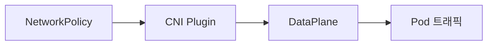
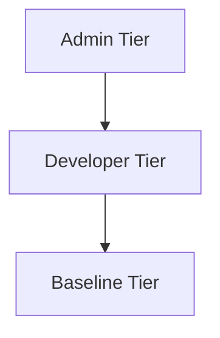

# Network Policy

NetworkPolicy는 **Pod 간 L3/L4 트래픽을 필터링**하는 리소스다. Pod IP·포트
기반이며, 실제 enforcement는 **CNI 플러그인**(Calico·Cilium·Antrea 등)이
담당한다. kube-proxy의 iptables와는 **무관**하다.

표준 API는 `networking.k8s.io/v1`으로 1.7 GA 이후 안정적이지만, **Allow
규칙만**을 표현한다. Deny·cluster-scoped 정책은 **AdminNetworkPolicy(ANP)**
·**BaselineAdminNetworkPolicy(BANP)** 또는 CNI 확장(CiliumNetworkPolicy,
Calico GlobalNetworkPolicy)으로 보완한다.

운영자 관점의 핵심 질문은 세 가지다.

1. **default deny 전환 시 어떻게 안전하게 가나** — DNS·apiserver·Ingress 번들
2. **L7 정책이 필요하면 무엇을 쓰나** — CiliumNetworkPolicy·Calico·Gateway API
3. **ANP/BANP는 지금 써도 되나** — v1alpha2 상태와 구현체 매트릭스

> 관련: [Service](./service.md) · [Ingress](./ingress.md)
> · [Gateway API](./gateway-api.md)

---

## 1. 전체 구조



| 요소 | 역할 |
|---|---|
| NetworkPolicy 리소스 | API 선언 (L3/L4 allow 규칙) |
| CNI Plugin | 선언을 실제 규칙으로 프로그래밍 (Calico·Cilium·Antrea·Kube-router 등) |
| DataPlane | iptables(Calico)·eBPF(Cilium)·OVS(Antrea)로 enforcement |

### 기본 동작 — default allow vs 격리

- Pod는 기본으로 **모든 트래픽 허용** (비격리 상태)
- **NetworkPolicy가 `podSelector`로 Pod를 한 번이라도 지정**하면, 해당
  Pod는 그 방향(Ingress·Egress)에 대해 **격리**된다
- 격리된 Pod는 **명시된 allow 규칙만 통과** — 나머지는 자동 차단
- CNI가 NetworkPolicy를 구현하지 않으면 **리소스를 만들어도 무시**됨
  (조용한 보안 공백)

---

## 2. 스키마

```yaml
apiVersion: networking.k8s.io/v1
kind: NetworkPolicy
metadata:
  name: api-policy
  namespace: app
spec:
  podSelector:
    matchLabels: { role: api }
  policyTypes:
  - Ingress
  - Egress
  ingress:
  - from:
    - namespaceSelector:
        matchLabels: { kubernetes.io/metadata.name: ingress-nginx }
      podSelector:
        matchLabels: { app.kubernetes.io/name: ingress-nginx }
    ports:
    - protocol: TCP
      port: 8080
  egress:
  - to:
    - namespaceSelector:
        matchLabels: { kubernetes.io/metadata.name: kube-system }
      podSelector:
        matchLabels: { k8s-app: kube-dns }
    ports:
    - protocol: UDP
      port: 53
    - protocol: TCP
      port: 53
```

### 필드

| 필드 | 의미 |
|---|---|
| `podSelector` | 정책이 **적용되는** 대상 Pod (동일 ns) |
| `policyTypes` | `Ingress`·`Egress` 명시 |
| `ingress.from` / `egress.to` | 허용 peer |
| `ingress.ports` / `egress.ports` | 허용 포트·프로토콜 |

### Peer 셀렉터 3종

| 종류 | 용도 |
|---|---|
| `podSelector` | 동일 ns 내 Pod 라벨 |
| `namespaceSelector` | 특정 라벨의 namespace 전체 |
| `ipBlock` | CIDR + `except` 리스트 |

---

## 3. AND vs OR 병합 규칙

운영에서 가장 자주 틀리는 부분.

### 같은 `from/to` 배열 내 **서로 다른 항목** → **OR**

```yaml
from:
- podSelector: { matchLabels: { role: frontend } }
- namespaceSelector: { matchLabels: { project: myproject } }
# frontend Pod 또는 myproject ns → 둘 중 하나라도 만족하면 허용
```

### 같은 **한 항목 안**에 `podSelector` + `namespaceSelector` → **AND**

```yaml
from:
- podSelector: { matchLabels: { role: frontend } }
  namespaceSelector: { matchLabels: { project: myproject } }
# myproject ns의 frontend Pod만 (교집합)
```

### 여러 ingress·egress 블록 → **OR** (가산)

### Source egress + Destination ingress → **AND**

양쪽 모두 허용해야 실제 통과.

---

## 4. Default Deny 패턴

### 네임스페이스 전체 ingress 차단

```yaml
apiVersion: networking.k8s.io/v1
kind: NetworkPolicy
metadata:
  name: default-deny-ingress
  namespace: app
spec:
  podSelector: {}
  policyTypes: [Ingress]
  # ingress 규칙 없음 = 전부 차단
```

### 양방향 차단

```yaml
spec:
  podSelector: {}
  policyTypes: [Ingress, Egress]
```

**핵심**: `podSelector: {}`는 "모두 매칭", `ingress`/`egress` 필드가 비어
있으면 "허용 없음".

### DNS egress 번들 (필수)

default-deny-egress를 넣을 때 반드시 **DNS egress도 같이** 넣는다.
누락하면 namespace 전체 Pod가 동시에 이름 해석 실패 → 대량 장애.

```yaml
egress:
- to:
  - namespaceSelector:
      matchLabels: { kubernetes.io/metadata.name: kube-system }
    podSelector:
      matchLabels: { k8s-app: kube-dns }
  ports:
  - protocol: UDP
    port: 53
  - protocol: TCP
    port: 53          # TCP fallback 필수 (응답 > 512B)
```

`kubernetes.io/metadata.name`는 1.22+에서 모든 namespace에 자동 부착된다.

---

## 5. 대표 패턴

### 같은 namespace만 허용

```yaml
spec:
  podSelector: {}
  policyTypes: [Ingress]
  ingress:
  - from:
    - podSelector: {}      # 같은 ns의 모든 Pod
```

### 특정 라벨 Pod만 허용

```yaml
spec:
  podSelector: { matchLabels: { app: api } }
  ingress:
  - from:
    - podSelector: { matchLabels: { role: frontend } }
    ports:
    - { protocol: TCP, port: 8080 }
```

### 메타데이터 서비스·특정 CIDR 차단

```yaml
egress:
- to:
  - ipBlock:
      cidr: 0.0.0.0/0
      except:
      - 169.254.169.254/32   # 클라우드 메타데이터
      - 10.0.0.0/8
```

### Ingress Controller 전용 허용

```yaml
ingress:
- from:
  - namespaceSelector:
      matchLabels: { kubernetes.io/metadata.name: ingress-nginx }
    podSelector:
      matchLabels: { app.kubernetes.io/name: ingress-nginx }
  ports:
  - { protocol: TCP, port: 8080 }
```

---

## 6. CNI 구현체별 차이

| CNI | 데이터플레인 | 표준 NP | 확장 정책 | 특징 |
|---|---|:-:|---|---|
| **Calico** | iptables(기본)·eBPF(선택) | ✅ | `NetworkPolicy(projectcalico.org/v3)`, `GlobalNetworkPolicy`, Tier, HostEndpoint | 다중 DP, Windows·호스트 엔드포인트, Tier·order 우선순위 |
| **Cilium** | eBPF + XDP | ✅ | `CiliumNetworkPolicy`(CNP), `CiliumClusterwideNetworkPolicy`(CCNP) | L7(HTTP·gRPC·Kafka), FQDN, DNS proxy, Hubble 관측 |
| **Antrea** | Open vSwitch | ✅ | ClusterNetworkPolicy, Tier | OVS 기반, VMware 주도 |
| **Weave Net** | kernel routing | ✅ | 표준만 | 단순 오버레이 |
| **Kube-router** | iptables + ipset | ✅ | 표준만 | 경량 |
| **OVN-Kubernetes** | OVN ACL | ✅ | **AdminNetworkPolicy 우선 구현체** | Red Hat 주도 (OpenShift) |

### 실무 메모 (2026-04)

- **Cilium v1.19.x** stable. L7·FQDN·Hubble 성숙
  - **v1.18.2·v1.17.7에서 FQDN 정책 리그레션** 보고(issue #42459). 도입
    전 버전 확인. 1.16.9는 정상
- **Calico 3.31** stable. Tier·GlobalNetworkPolicy·HostEndpoint 견고
- Policy 적용 후 **기존 long-lived TCP 연결은 유지**됨 — 새 연결부터 적용

---

## 7. AdminNetworkPolicy · BaselineAdminNetworkPolicy

**KEP-2091**, `policy.networking.k8s.io` 별도 API 그룹. 표준 NetworkPolicy의
Allow-only·namespace-scoped 한계를 푼다.

### 현재 상태 (2026-04)

- API: **v1alpha2** (Out-of-tree CRD, kube-core 미포함)
- v0.2.0(2025-04)에서 ANP + BANP를 **ClusterNetworkPolicy(CNP)** 단일
  리소스로 통합 제안, `Allow` → `Accept` 리네이밍, 구조 재정리
- **v1beta1 타겟**: 2026 KubeCon Europe 전후
- 구현 성숙도: **OVN-Kubernetes가 레퍼런스**. Cilium·Calico 진행 중

### Tier 평가 순서



| Tier | 리소스 | 재정의 |
|---|---|---|
| **Admin** | ANP·CNP | 개발자 NP로 **우회 불가** |
| **Developer** | NetworkPolicy | namespace-scoped, Allow only |
| **Baseline** | BANP | 개발자 NP 없을 때 **기본값**, 개발자 NP가 override |

### Action

| Action | ANP | BANP | 의미 |
|---|:-:|:-:|---|
| `Allow` / `Accept` | ✅ | ✅ | 허용, 평가 중단 |
| `Deny` | ✅ | ✅ | 차단, 평가 중단 |
| `Pass` | ✅ | ❌ | 건너뛰고 다음 Tier(NetworkPolicy)로 위임 |

### AdminNetworkPolicy 예시

```yaml
apiVersion: policy.networking.k8s.io/v1alpha1
kind: AdminNetworkPolicy
metadata:
  name: cluster-isolation
spec:
  priority: 10                    # 0–1000, 낮을수록 높은 우선순위
  subject:
    namespaces:
      matchLabels: { tier: production }
  ingress:
  - name: allow-monitoring
    action: Allow
    from:
    - namespaces:
        matchLabels: { kubernetes.io/metadata.name: monitoring }
  egress:
  - name: deny-metadata
    action: Deny
    to:
    - networks: ["169.254.169.254/32"]
```

### BaselineAdminNetworkPolicy 예시

```yaml
apiVersion: policy.networking.k8s.io/v1alpha1
kind: BaselineAdminNetworkPolicy
metadata:
  name: default
spec:
  subject:
    namespaces: {}
  egress:
  - name: block-external-default
    action: Deny
    to:
    - networks: ["0.0.0.0/0", "::/0"]
```

### 표준 NP vs ANP vs BANP

| 측면 | NetworkPolicy | AdminNetworkPolicy | BaselineAdminNetworkPolicy |
|---|---|---|---|
| 범위 | namespace | cluster | cluster |
| 페르소나 | 개발자 | 관리자 | 관리자 |
| Action | Allow만 | Allow·Deny·Pass | Allow·Deny |
| Priority | 없음(가산) | 0–1000 | 없음 (클러스터 1개) |
| 자동 격리 | ✅ (selector 매칭 시) | ❌ | ❌ |
| 우회 가능성 | — | 개발자 우회 불가 | 개발자 NP가 override |

---

## 8. L7 확장 정책 (CNI 독점)

표준 NetworkPolicy는 L3/L4까지. HTTP method·path·TLS SNI·gRPC 메서드는
**CNI 확장 CRD**가 필요.

### CiliumNetworkPolicy — FQDN

```yaml
apiVersion: cilium.io/v2
kind: CiliumNetworkPolicy
metadata:
  name: fqdn-egress
spec:
  endpointSelector:
    matchLabels: { app: client }
  egress:
  # DNS 질의를 Cilium DNS proxy로 (필수)
  - toEndpoints:
    - matchLabels: { "k8s:k8s-app": kube-dns }
    toPorts:
    - ports: [{ port: "53", protocol: ANY }]
      rules:
        dns:
        - matchPattern: "*"
  # FQDN allow
  - toFQDNs:
    - matchName: "api.example.com"
    - matchPattern: "*.googleapis.com"
    toPorts:
    - ports: [{ port: "443", protocol: TCP }]
```

DNS proxy가 응답을 가로채 eBPF map에 IP를 기록 → IP 기반 enforcement.

### CiliumNetworkPolicy — L7 HTTP

```yaml
spec:
  endpointSelector: { matchLabels: { app: api } }
  ingress:
  - fromEndpoints:
    - matchLabels: { role: client }
    toPorts:
    - ports: [{ port: "8080", protocol: TCP }]
      rules:
        http:
        - method: GET
          path: "/api/v1/users"
        - method: POST
          path: "/api/v1/events"
```

### Calico GlobalNetworkPolicy

```yaml
apiVersion: projectcalico.org/v3
kind: GlobalNetworkPolicy
metadata:
  name: allow-frontend
spec:
  tier: default
  order: 10                   # 작을수록 먼저 평가
  selector: app == 'frontend'
  types: [Ingress, Egress]
  ingress:
  - action: Allow
    protocol: TCP
    destination: { ports: [8080] }
```

Calico Action: `Allow`·`Deny`·`Log`·`Pass`.

---

## 9. Egress 정책 — 빠뜨리면 안 되는 것

| 대상 | 이유 |
|---|---|
| **CoreDNS** (UDP·TCP 53) | 해석 불가 시 대량 장애 |
| **kube-apiserver** | ServiceAccount 토큰·leader election |
| 외부 레지스트리·아티팩트 | 이미지 풀·의존성 다운로드 |
| 외부 API·OAuth IdP | 실제 비즈니스 연동 |
| **메타데이터 서비스 차단** | 169.254.169.254 등 — 보안 |

### ipBlock vs FQDN

| 방식 | 도구 | 한계 |
|---|---|---|
| `ipBlock` (CIDR) | 표준 NP | 동적 IP 추적 불가 |
| `toFQDNs` | CiliumNetworkPolicy | DNS proxy 필요, TTL 기반 |
| `domainNames` | ANP v1alpha2 | 구현체 의존 (OVN-K 우선) |

---

## 10. 정책 우선순위·병합

### 표준 NetworkPolicy

- 여러 정책이 같은 Pod에 매칭 → **가산적 OR**. Allow 규칙의 합집합
- 평가 순서가 결과에 영향 **없음**
- Allow만 가능 — **Deny는 ANP/BANP 또는 CNI 확장**에서만

### ANP·NetworkPolicy·BANP 순서

1. **ANP** priority 순서대로 평가
   - `Allow`/`Deny` → 즉시 결정
   - `Pass` → 다음 Tier
2. **NetworkPolicy** 평가 (매칭 정책 모두의 합)
   - 격리됐고 allow 매칭 있으면 허용
   - 매칭 없으면 다음 Tier로
3. **BANP** 평가 — 최후 기본값
4. 아무것도 매칭 없으면 **기본 허용**

---

## 11. Service VIP·Ingress·hostNetwork

### Service VIP 매칭 불가

NetworkPolicy는 **Pod IP 기반**. kube-proxy·eBPF service가 **셀렉터 평가
전**에 Service VIP를 Pod IP로 변환하므로, VIP 자체는 peer로 매칭되지
않는다. `ipBlock`에 Service CIDR 넣어도 의미 없음. **podSelector로
backend Pod를 직접 지정**해야 한다.

### Ingress Controller

외부 트래픽은 Ingress·Gateway Controller Pod를 경유. 백엔드는 **컨트롤러
namespace·Pod 라벨**을 ingress allow로 지정.

### hostNetwork Pod

- 노드 IP 사용 → Pod IP 공간 밖
- 표준 NP는 **동작이 정의되지 않음**, CNI 의존
- **Cilium**: CCNP + nodeSelector로 호스트 엔드포인트 처리
- **Calico**: HostEndpoint 리소스로 별도 관리

### 노드 자기 자신 → Pod 트래픽

대개 CNI가 **항상 허용** (kubelet 헬스체크·probe). 정책으로 막으려 하지
말 것.

---

## 12. DNS egress 장애 사례

default-deny-egress를 넣고 DNS allow를 빠뜨린 경우 전형 증상:

- **`connection refused`가 아닌 `name resolution failed`**
- namespace 전체 Pod가 **동시에** 장애
- 롤백 전까지 복구 불가

### 점검

```bash
# CoreDNS Pod 라벨 확인
kubectl get pods -n kube-system -l k8s-app=kube-dns --show-labels

# 해석 테스트
kubectl exec -n <app-ns> <pod> -- nslookup kubernetes.default

# DNS 서비스 DNSConfig 확인
kubectl exec <pod> -- cat /etc/resolv.conf
```

### 전역 default egress 베이스

조직 차원에서는 **namespace 생성 시 DNS allow + 기본 default-deny를 같이
배포**하는 것이 안전. Kyverno·namespace template으로 자동화.

---

## 13. 관측·디버깅

### 기본 명령

```bash
# 전체 정책
kubectl get networkpolicy -A
kubectl describe networkpolicy <name>

# 연결 테스트
kubectl exec <pod> -- nc -zv <target> 8080
kubectl exec <pod> -- curl -v http://<svc>:8080

# DNS 점검
kubectl exec <pod> -- nslookup <svc>
```

### Cilium Hubble

L3/L4 + L7 통합 플로우 관측, **정책 verdict 이벤트** 기록.

```bash
hubble observe --verdict DROPPED
hubble observe --from-pod app/client --to-pod app/api
hubble observe --protocol tcp --port 443
hubble observe --http-method GET --http-path "/api/*"
```

Hubble UI는 실시간 서비스 맵을 제공.

### Calico

```bash
calicoctl get networkpolicies -A
calicoctl get wep                          # WorkloadEndpoint
iptables-save | grep cali-                 # Felix가 쓴 규칙
```

### 공통 운영 팁

- 정책 적용 후 **기존 long-lived TCP 연결은 유지** → 새 연결부터 적용.
  테스트는 Pod 재시작 후
- iptables 덤프(Calico)·`bpftool map dump`(Cilium)로 내부 규칙 검사

---

## 14. 안티패턴

| 안티패턴 | 증상 | 수정 |
|---|---|---|
| default-deny 없이 allow만 씀 | 정책 누락 대상은 무방비 | namespace별 default-deny + allow 번들 |
| **DNS egress 누락** | 이름 해석 대량 실패 | 모든 default-deny와 DNS allow 동반 |
| kube-apiserver egress 누락 | ServiceAccount 토큰 갱신 실패 | `endpoints/kubernetes` 대상 또는 API LB CIDR 허용 |
| Ingress Controller 차단 | 외부 요청 503 | ingress-nginx·gateway namespace allow |
| Service VIP에 `ipBlock` 시도 | 매칭 안 됨 | podSelector로 backend Pod 직접 |
| hostNetwork Pod에 표준 NP 의존 | 정책 무시됨 | Cilium CCNP·Calico HostEndpoint |
| 표준 NP로 L7 필터링 시도 | 불가능 | CiliumNetworkPolicy·Calico·Gateway API |
| 스테이징 검증 없이 prod 적용 | 대규모 장애 | dry-run + Hubble `DROPPED` 관찰 |
| `podSelector: {}` + `ingress: []` 혼동 | 의도치 않은 default deny | 의미 숙지 |
| namespaceSelector 라벨 없이 사용 | 매칭 0건 | `kubernetes.io/metadata.name` 자동 라벨 활용 |
| CNI가 NP 미지원인데 리소스만 배포 | 조용한 보안 공백 | CNI 선택·문서화 필수 |

---

## 15. 프로덕션 체크리스트

### 정책 베이스
- [ ] 모든 워크로드 namespace에 `default-deny-ingress` + `default-deny-egress`
- [ ] **DNS egress 번들** 기본 포함 (UDP·TCP 53 → kube-dns)
- [ ] **kube-apiserver egress** 허용 (토큰·leader election)
- [ ] Ingress·Gateway Controller namespace에서 오는 ingress allow
- [ ] 메트릭·로그 수집 에이전트 경로 allow
- [ ] 메타데이터 서비스(169.254.169.254) 명시적 차단

### 검증
- [ ] 스테이징에서 적용 후 E2E 테스트
- [ ] Hubble·Calico flow log로 **dropped 플로우 리뷰**
- [ ] 양성·음성 연결 테스트 (`nc`·`curl`)
- [ ] PDB·HPA 이벤트 시 정책 영향 없음 확인

### 운영
- [ ] 정책 변경은 **GitOps** 경유, 코드 리뷰 필수
- [ ] namespace 생성 시 기본 정책 **자동 배포** (Kyverno·namespace template)
- [ ] NetworkPolicy **drop 알람** 연결
- [ ] CNI 업그레이드 시 정책 호환성·리그레션 확인 (Cilium FQDN 이슈 등)
- [ ] ANP/CNP (v1beta1 이후) 전환 로드맵 수립
- [ ] hostNetwork Pod·Service VIP는 CNI 확장으로 별도 보호

### CNI별
- [ ] **Cilium**: Hubble relay·UI 배포, 버전별 FQDN 리그레션 확인
- [ ] **Calico**: Tier·order 전략 문서화, GlobalNetworkPolicy로 호스트 보호
- [ ] AdminNetworkPolicy CRD 설치 고려(구현체별 지원 확인)

---

## 16. 이 카테고리의 경계

- **Pod L3/L4 정책** → 이 글
- **L7 필터(HTTP·gRPC)·Service ID 기반** → CNI 확장(CiliumNetworkPolicy)·Gateway API
- **Service Mesh mTLS·정책**(Istio·Linkerd) → `network/` / `security/`
- **네트워크 정책 구현·eBPF·OVS** → `network/` / `linux/`
- **공급망 보안·mTLS 정책**(Zero Trust 전략) → `security/`

---

## 참고 자료

- [Kubernetes — Network Policies](https://kubernetes.io/docs/concepts/services-networking/network-policies/)
- [Kubernetes — Declare Network Policy](https://kubernetes.io/docs/tasks/administer-cluster/declare-network-policy/)
- [Kubernetes — Network Policy Providers](https://kubernetes.io/docs/tasks/administer-cluster/network-policy-provider/)
- [KEP-2091 — AdminNetworkPolicy](https://github.com/kubernetes/enhancements/tree/master/keps/sig-network/2091-admin-network-policy)
- [Network Policy API — Overview](https://network-policy-api.sigs.k8s.io/api-overview/)
- [Network Policy API — Getting Started](https://network-policy-api.sigs.k8s.io/blog/2024/01/30/getting-started-with-the-adminnetworkpolicy-api/)
- [Cilium — Kubernetes Policy](https://docs.cilium.io/en/stable/network/kubernetes/policy/)
- [Cilium — DNS (L7 · FQDN)](https://docs.cilium.io/en/stable/security/dns/)
- [Cilium — Hubble](https://docs.cilium.io/en/stable/observability/hubble/index.html)
- [Calico — Network Policy](https://docs.tigera.io/calico/latest/network-policy/)
- [Calico — GlobalNetworkPolicy](https://docs.tigera.io/calico/latest/reference/resources/globalnetworkpolicy)
- [Calico — Default Deny](https://docs.tigera.io/calico/latest/network-policy/get-started/kubernetes-default-deny)

(최종 확인: 2026-04-23)
