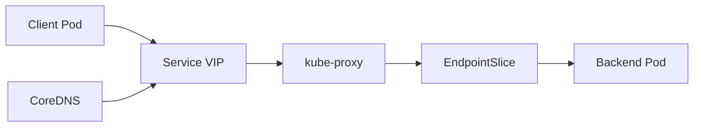
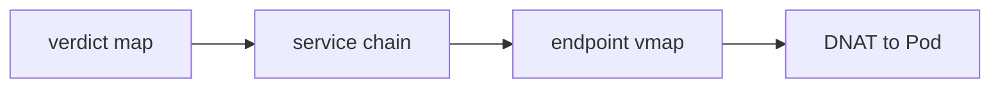

# Service

Service는 **변하는 Pod IP 집합을 안정 VIP로 노출**하는 추상화다. 각 노드의
`kube-proxy`가 이 VIP로 들어오는 트래픽을 iptables·IPVS·nftables 규칙으로
실제 Pod에 포워딩한다.

"DNS만으로 하면 안 되나?"의 답: 많은 DNS resolver가 TTL을 무시하거나 무한
캐시해 backend 변경이 즉시 반영되지 않는다. 그래서 **VIP + kube-proxy 규칙**
방식이 도입됐다.

운영자 관점의 핵심 질문은 세 가지다.

1. **`externalTrafficPolicy`·`internalTrafficPolicy` 선택 기준** — 원본 IP·홉 절감·블랙홀 위험
2. **`trafficDistribution` 언제 쓰나** — zone 내부 라우팅의 함정
3. **nftables로 언제 전환하나** — iptables scaling 한계

> 관련: [EndpointSlice](./endpointslice.md) · [Headless Service](./headless-service.md)
> · [CoreDNS](./coredns.md) · [Ingress](./ingress.md) · [Gateway API](./gateway-api.md)
> · [Network Policy](./network-policy.md)

---

## 1. 전체 구조 — 한눈에



| 컴포넌트 | 역할 |
|---|---|
| **Service** | 선언적 VIP·selector·port 정의 |
| **EndpointSlice** | selector에 매칭된 Pod IP 집합. **1.33부터 legacy Endpoints API는 deprecated** — apiserver가 경고 출력, 서드파티 컨트롤러 마이그레이션 필수 |
| **kube-proxy** | 각 노드에서 VIP→Pod 트래픽 포워딩 규칙 프로그래밍 |
| **CoreDNS** | Service FQDN을 VIP로 해석 (A/AAAA/SRV) |

Service FQDN: `<svc>.<ns>.svc.cluster.local`

---

## 2. Service 타입 4종

| 타입 | 노출 범위 | 특징 |
|---|---|---|
| `ClusterIP` | 클러스터 내부 | 기본. 안정 VIP |
| `NodePort` | 각 노드 static port | 기본 범위 **30000–32767** (`--service-node-port-range`). 1.27+는 **static band 30000–30085 / dynamic band 30086–32767**로 분리 — 명시 할당과 자동 할당 충돌 방지 |
| `LoadBalancer` | 외부 | 클라우드 LB / 온프레(MetalLB·kube-vip·Cilium LB). NodePort+ClusterIP 자동 생성 |
| `ExternalName` | — | `externalName`으로 CNAME 반환. selector·VIP 없음 |

`LoadBalancer`는 ClusterIP·NodePort를 **자동 포함**한다. 계층 관계이지 배타
관계가 아니다.

### ExternalName 주의

순수 DNS CNAME만 반환. HTTPS SNI·외부 DNS TTL 이슈가 있고 HTTP 리다이렉트
목적으로도 쓰면 안 된다.

> ⚠️ **보안**: CVE-2020-8554 — 악의적 사용자가 ExternalName에 **클러스터
> 내부 IP**(apiserver 등)를 지정하면 MITM 가능. 업스트림 완화는
> `--service-reject-internal-ips`(기본 꺼짐). 멀티테넌시 환경은 Admission
> Webhook·Kyverno로 ExternalName 값 검증 필수.

---

## 3. `spec.ports` · `selector`

```yaml
apiVersion: v1
kind: Service
metadata:
  name: my-app
spec:
  selector:
    app.kubernetes.io/name: my-app
  ports:
  - name: http                  # multiport면 name 필수
    protocol: TCP               # TCP(기본)·UDP·SCTP
    port: 80                    # Service 노출 포트
    targetPort: http-web-svc    # Pod containerPort 이름 또는 숫자
    appProtocol: http           # LB 힌트
```

### named port 권장

`targetPort`는 **숫자보다 named port**가 낫다. Pod 이미지 버전이 바뀌어도
이름만 유지하면 Service를 건드리지 않아도 된다.

### selector 없는 Service

관리자가 **EndpointSlice를 수동 생성**. 외부 DB·외부 API·다른 클러스터
연동에 쓴다. EndpointSlice를 안 만들면 endpoint는 영원히 0.

### Headless Service (짧게)

`spec.clusterIP: None`이면 VIP 없이 DNS가 **Pod IP 목록을 직접 반환**.
StatefulSet의 peer discovery에 쓴다. 상세는 [Headless Service](./headless-service.md).

---

## 4. `sessionAffinity`

```yaml
spec:
  sessionAffinity: ClientIP            # None(기본) | ClientIP
  sessionAffinityConfig:
    clientIP:
      timeoutSeconds: 10800             # 기본 10800s = 3시간
```

### 한계

- **NAT 뒤에선 의미 약함** — 여러 클라이언트가 같은 IP로 보임
- L7 쿠키 기반 affinity 없음 (Gateway API·Service Mesh 영역)
- endpoint 집합이 변하면 affinity가 깨질 수 있음
- 기본 3시간 timeout은 길다 — 배포·스케일 직후 특정 Pod 과부하 유발
- **`externalTrafficPolicy: Local`과 조합 시 노드 단위 affinity**가 된다.
  ClientIP hash는 각 노드에서 독립적이므로, LB가 라우팅 노드를 바꾸면
  affinity가 즉시 깨짐. "sticky가 왜 자주 끊기는가"의 고전적 원인

---

## 5. `internalTrafficPolicy` (1.26 GA)

**클러스터 내부 Pod → Service** 라우팅 제어.

| 값 | 동작 |
|---|---|
| `Cluster` (기본) | 모든 노드 endpoint로 분산 |
| `Local` | **트래픽 발생 노드의 endpoint로만** 전달. 없으면 connection refused |

### 쓰는 경우

- DaemonSet 형태의 **로컬 에이전트·사이드카**(노드 로컬 캐시, 노드 프록시)에 접근
- cross-node hop 제거로 레이턴시·네트워크 비용 절감

### 함정

endpoint가 없는 노드에서 호출하면 **조용히 실패**(connection refused).
DaemonSet 배포 상태 점검이 전제.

---

## 6. `externalTrafficPolicy`

**외부에서 NodePort·LoadBalancer로 들어오는 트래픽** 라우팅 제어.

| 값 | 동작 | 원본 IP |
|---|---|---|
| `Cluster` (기본) | 받은 노드가 다른 노드 Pod로 재포워딩 (SNAT) | **손실** |
| `Local` | 받은 노드의 endpoint로만 | **보존** |

`Local`은 **홉 1개 절감 + 원본 IP 보존** 장점. 단점은 endpoint 없는 노드로
트래픽이 가면 블랙홀이므로 `healthCheckNodePort`로 LB가 제외해야 한다.

### `healthCheckNodePort`

`type: LoadBalancer` + `externalTrafficPolicy: Local`일 때 자동 할당
(또는 `spec.healthCheckNodePort`로 지정). LB가 이 포트에 HTTP 헬스체크 —
200이면 pass, 503이면 해당 노드 제외.

### Connection draining (KEP-3836, 1.31 GA)

`type: LoadBalancer` + `externalTrafficPolicy: Cluster`에서도 노드
terminating 시 기존 연결이 **graceful drain**된다. 이전 버전은 drain 없이
끊겼던 이슈가 해결됨.

---

## 7. `trafficDistribution` — zone 내부 라우팅

Topology Aware Routing의 최신 표현 방식.

### 타임라인

| 단계 | 버전 | 비고 |
|---|---|---|
| `service.kubernetes.io/topology-mode: Auto` (어노테이션) | legacy | 필드로 전환 권장 |
| `trafficDistribution: PreferClose` | **1.33 GA, 1.35 deprecated** | 여전히 허용되나 `PreferSameZone` 권장 |
| `PreferSameZone` / `PreferSameNode` | **1.35 GA** | `PreferClose`의 **공식 대체** (별칭이 아니라 deprecation) |
| `topologyKeys` | 제거됨 (**1.21**) | — |

```yaml
spec:
  trafficDistribution: PreferSameZone    # 1.35+ 권장
# 또는
  trafficDistribution: PreferSameNode    # 같은 노드 우선, 없으면 전체
```

### 동작 원리

EndpointSlice 컨트롤러가 zone별 allocatable CPU 비례로 endpoint를
`hints.forZones`에 할당. kube-proxy는 힌트가 맞는 endpoint만 사용. 안전
장치가 깨지면 **클러스터 전체로 fallback**.

### 권장

zone당 endpoint **3개 이상** (3-zone 기준 최소 9개). 부족하면 한 zone에
쏠림 → overload.

### 함정

- zone 간 Pod가 불균형이면 한 zone 과부하
- scale down 중 일시적으로 한 zone만 남아 `Local` 유사한 블랙홀 발생 가능
- HPA가 replicas를 줄이면 fallback이 잦게 발생해 체감 효과 반감

---

## 8. Dual-Stack (IPv4/IPv6)

```yaml
spec:
  ipFamilyPolicy: PreferDualStack        # SingleStack(기본)|PreferDualStack|RequireDualStack
  ipFamilies: [IPv4, IPv6]               # 순서 = primary/secondary
```

| 정책 | 동작 |
|---|---|
| `SingleStack` | 단일 family (기본) |
| `PreferDualStack` | 양쪽 할당 시도, 실패 시 single로 fallback |
| `RequireDualStack` | 양쪽 필수, 실패 시 생성 실패 |

### 필드 관계

- `spec.clusterIP` = `ipFamilies[0]`의 IP (단수)
- `spec.clusterIPs` = 전체 목록 (복수)
- `ipFamilies` 조건부 mutable — 보조 추가/제거 가능, primary 변경 불가

### 클러스터 요구사항

- kube-apiserver `--service-cluster-ip-range=<v4>,<v6>`
- controller-manager `--cluster-cidr`·`--service-cluster-ip-range`
- kubelet `--node-ip=<v4>,<v6>`
- CNI가 dual-stack 지원

---

## 9. kube-proxy 모드

| 모드 | 상태 | 비고 |
|---|---|---|
| `iptables` | **기본** | 많은 클러스터 현실. 규모 커질수록 선형 비용 |
| `ipvs` | Stable | hash 기반 lookup. 큰 클러스터에 유리 |
| **`nftables`** | **1.33 GA** | 커널 5.13+ 필요, default는 여전히 iptables |
| `kernelspace` | Windows 전용 | |
| eBPF | **kube-proxy 대체** (Cilium 등) | `kubeProxyReplacement=true` |

### iptables vs nftables 성능

| 지표 | iptables | nftables |
|---|---|---|
| Service rule 매칭 | **O(n)** 순차 | **O(1) verdict map** |
| Control-plane update | 전체 프로그래밍 O(n) | **변경분만 O(Δn)** |
| 30K Services에서 지연 | p99 수 초 | p01 마이크로초 |
| `minSyncPeriod` 튜닝 부담 | 큼 | 작음 |

### 왜 nftables가 기본이 아닌가

- CNI·애드온이 iptables 규칙을 가정
- 일부 엣지 케이스(특히 `externalTrafficPolicy: Local + externalIPs`) 이슈
  리포트가 존재 — 도입 전 스테이징 검증 필수
- **`--nodeport-addresses` 기본값 차이**: iptables 모드는 모든 로컬 IP,
  nftables 모드는 **primary IP만**. 다중 NIC 또는 NodePort를 특정 IP에
  바인딩한 LB 헬스체크에서 모드 전환 후 간헐 장애 유발
- 모드 전환은 노드 롤링이 안전. 전환 후 잔존 규칙은 `kube-proxy --cleanup`

---

## 10. 트래픽 플로우

### ClusterIP + iptables 모드

| 단계 | 처리 |
|---|---|
| 1 | Client Pod가 Service VIP:port로 패킷 전송 |
| 2 | netfilter PREROUTING 훅 진입 |
| 3 | `KUBE-SERVICES` chain에서 해당 Service 규칙 매칭 |
| 4 | `KUBE-SVC-XXXX`가 확률 기반으로 endpoint 선택 |
| 5 | `KUBE-SEP-YYYY`가 Pod IP:targetPort로 DNAT |

- **DNAT만** 발생(Pod → Service → Pod) — 원본 clientIP 보존
- NodePort·LB로 **외부 진입** 시 `Cluster` 정책이면 SNAT 추가 → 원본 IP 손실

### nftables 모드 (1.33 GA)



Key `(daddr, proto, dport) → verdict`. **O(1) lookup**.

### IPVS 모드

커널 IPVS 테이블에 Virtual Server(VIP:port)·Real Server(endpoint) 등록.
scheduler 선택: `rr`·`lc`·`dh`·`sh`·`sed`·`nq`. 일부 기능은 여전히
iptables 규칙에 의존.

---

## 11. DNS — CoreDNS 연동

### 레코드

| 레코드 | Service 종류 | 반환값 |
|---|---|---|
| A/AAAA | `ClusterIP` | Service VIP |
| A/AAAA | Headless | **Pod IP 집합** |
| A/AAAA | `ExternalName` | CNAME chain |
| SRV | multiport named port | `_port._proto.<svc>.<ns>.svc.cluster.local` |

### `/etc/resolv.conf` 기본값

```
nameserver <cluster-dns-ip>
search <ns>.svc.cluster.local svc.cluster.local cluster.local
options ndots:5
```

### `ndots:5` 함정

dot이 5개 미만인 이름을 먼저 search 도메인과 조합해 시도한다. 즉
`google.com`도 먼저 `google.com.<ns>.svc.cluster.local` 등을 거친 뒤에
FQDN을 시도. 결과적으로 **외부 DNS 트래픽이 4–5배 증폭**된다.

완화:
- 외부 도메인은 **FQDN with trailing dot**(`google.com.`)
- Pod `dnsConfig.options`로 `ndots: 2` (주의: 내부 short name 해석 영향)
- [CoreDNS](./coredns.md)의 NodeLocal DNSCache로 캐시 계층 추가

---

## 12. LoadBalancer — 클라우드 vs 온프레

### 온프레 구현

| 구현 | 방식 | 특징 |
|---|---|---|
| **MetalLB** | L2(ARP/NDP) 또는 **BGP** | 사실상 온프레 표준. BGP는 ECMP scale |
| **kube-vip** | ARP/BGP + control-plane HA 겸용 | 단일 바이너리, control-plane VIP도 |
| **Cilium LB IPAM + BGP** | CNI 내장 | kube-proxy 대체와 결합 시 일관성 |

### `loadBalancerClass` (1.24 GA)

여러 LB 구현체 공존. 지정된 Service는 **해당 컨트롤러만** 처리.

```yaml
spec:
  loadBalancerClass: metallb.io/metallb
```

### `allocateLoadBalancerNodePorts`

기본 `true`. `false`로 두면 NodePort 미할당 — Cilium kube-proxy
replacement + BGP처럼 Pod IP로 직접 라우팅 가능한 경우에 비용·복잡도 절감.

### `status.loadBalancer.ingress[].ipMode`

1.29 Alpha → 1.30 Beta(기본 활성) → **1.32 GA**. `VIP`(기본) / `Proxy`
— SNAT·health check 동작 힌트.

### MultiPort + mixed protocol (TCP+UDP)

`MixedProtocolLBService` 1.24 GA로 API 레벨 허용. **실제 지원은 클라우드
·MetalLB 구현체 의존** — 벤더 문서 확인.

---

## 13. `publishNotReadyAddresses`

```yaml
spec:
  publishNotReadyAddresses: true
```

기본 `false`. `true`로 두면 **Not Ready Pod도 endpoint**로 노출.

주 사용처: **StatefulSet + Headless Service**에서 peer discovery
(Cassandra·etcd·Zookeeper). Pod끼리 서로를 봐야 Ready가 되는 circular
dependency를 깨기 위함.

**일반 ClusterIP Service에 켜면 장애 Pod로 트래픽이 계속 간다**. 쓰면 안
된다.

---

## 14. Service VIP와 NetworkPolicy

표준 `NetworkPolicy`는 **Pod IP 기준** 매칭. Service VIP는 매칭 대상이
아니다. 결과적으로 "Service를 통한 접근"을 직접 제어할 수 없고, 백엔드
Pod에 대한 from/to 규칙으로 간접 제어한다.

확장 정책:
- **CiliumNetworkPolicy / ClusterwideNetworkPolicy** — Service ID 기반
- **Calico GlobalNetworkPolicy**
- Gateway API의 L7 레벨 정책

상세는 [Network Policy](./network-policy.md).

---

## 15. 관측·메트릭

### kube-proxy Prometheus 메트릭

| 메트릭 | 의미 |
|---|---|
| `kubeproxy_sync_proxy_rules_duration_seconds` | 규칙 동기화 소요. 지속 증가 = 규모 한계 |
| `kubeproxy_sync_proxy_rules_last_timestamp_seconds` | 마지막 성공 시각 — stuck 감지 |
| `kubeproxy_sync_proxy_rules_last_queued_timestamp_seconds` | 이벤트 수신 시각. last_timestamp와의 gap이 지연 |
| `kubeproxy_sync_proxy_rules_iptables_total` | 관리 중인 iptables 규칙 수 |
| `kubeproxy_sync_proxy_rules_endpoint_changes_total` | endpoint 변경 누적 |
| `kubeproxy_network_programming_duration_seconds` | endpoint 생성→프로그래밍 완료까지 end-to-end |

### conntrack

- `/proc/sys/net/netfilter/nf_conntrack_count` / `_max`
- kube-proxy 플래그 `--conntrack-max-per-core`(기본 32768),
  `--conntrack-min`(기본 131072)
- 80% 이상이면 튜닝 필요

### PromQL 예시

```promql
# 동기화 지연 P99 급증
histogram_quantile(0.99,
  sum by (le) (rate(
    kubeproxy_sync_proxy_rules_duration_seconds_bucket[5m])))

# 노드별 iptables 규칙 폭증
sort_desc(kubeproxy_sync_proxy_rules_iptables_total)

# 동기화 stuck (2분 이상 갱신 없음)
time() - kubeproxy_sync_proxy_rules_last_timestamp_seconds > 120
```

---

## 16. 트러블슈팅

| 증상 | 원인 후보 | 진단 |
|---|---|---|
| endpoint가 비어 있음 | selector 불일치 / Pod 부재 / Pod Not Ready | `kubectl get endpointslice -l kubernetes.io/service-name=<svc>`, Pod 라벨·probe 확인 |
| Service IP는 연결되는데 앱이 응답 안 함 | `targetPort` 오타 / 앱이 다른 포트 listen | Pod 내부에서 `ss -tlnp` |
| `no IPs available` | ClusterIP CIDR 고갈 | **1.33+는 `ServiceCIDR`·`IPAddress` API로 apiserver 재기동 없이 CIDR 추가 가능**(KEP-1880). 이전 버전은 `--service-cluster-ip-range` 확장 재기동 |
| NodePort 충돌 | 범위 밖 / 겹침 | `--service-node-port-range` |
| `externalTrafficPolicy: Local` 일부 실패 | endpoint 없는 노드로 LB 라우팅 | `healthCheckNodePort` 동작·LB 헬스체크 |
| 원본 IP가 NodeIP로 찍힘 | SNAT (Cluster 정책) | `Local` 정책 + LB의 client IP 보존 |
| DNS 느림 / 외부 DNS 부하 폭증 | `ndots:5` + non-FQDN | FQDN 사용, NodeLocal DNSCache |
| Service 지연이 규칙 동기화에 비례 | iptables scaling 한계 | nftables·IPVS 검토 |
| 모드 전환 후 간헐 장애 | 잔존 legacy 규칙 | `kube-proxy --cleanup` + 노드 재시작 |
| LoadBalancer `pending` 유지 | 클라우드 컨트롤러 없음 or `loadBalancerClass` 불일치 | MetalLB 설치·class 확인 |

### 디버깅 명령

```bash
kubectl get endpointslice -A -l kubernetes.io/service-name=<svc>
kubectl describe svc <svc>
kubectl get svc <svc> -o jsonpath='{.spec.clusterIP} {.spec.ports}'

# 노드에서 (kube-proxy 로그·규칙)
iptables -t nat -L KUBE-SERVICES -n | grep <svc>
nft list chain inet kube-proxy service-ips         # nftables 모드
ipvsadm -Ln                                         # ipvs 모드

# conntrack 사용률
cat /proc/sys/net/netfilter/nf_conntrack_count
cat /proc/sys/net/netfilter/nf_conntrack_max
```

---

## 17. 안티패턴

| 안티패턴 | 문제 | 대안 |
|---|---|---|
| Service마다 `LoadBalancer` 타입 남발 | LB 비용·IP pool 고갈 | L7은 Gateway API 하나로 통합 |
| selectorless Service에 EndpointSlice 안 만듦 | 영구 endpoint 0 | 수동 EndpointSlice 또는 `ExternalName` |
| 일반 ClusterIP에 `publishNotReadyAddresses: true` | 장애 Pod로 트래픽 | Headless StatefulSet 한정 |
| `sessionAffinity: ClientIP` 기본 3h 방치 | 특정 Pod 과부하 | timeout 짧게 또는 L7 affinity |
| `externalTrafficPolicy: Local` + LB 헬스체크 미설정 | 엔드포인트 없는 노드 블랙홀 | `healthCheckNodePort` 검증 |
| `trafficDistribution: PreferSameZone`인데 한 zone 쏠림 | 과부하 + fallback 잦음 | zone당 endpoint ≥ 3, HPA 여유 |
| `ndots:5` + 외부 도메인 FQDN 없이 호출 | DNS 트래픽 4–5배 증폭 | FQDN 또는 `ndots: 2` |
| NodePort로 외부 직접 노출 | 원본 IP 손실 + 포트 풀 고갈 | LoadBalancer / Gateway |
| kube-proxy 모드 일괄 전환 (rolling X) | 규칙 충돌 간헐 장애 | 노드별 rolling, `--cleanup` |

---

## 18. 프로덕션 체크리스트

### 기본
- [ ] 모든 port에 `name` 설정, `appProtocol` 명시(`http`·`https`·`http2`·`grpc`)
- [ ] `targetPort`는 **named port**
- [ ] Pod **readinessProbe** 정확(endpoint 편입 기준)
- [ ] Service 하나 = 한 목적 (monolithic 금지)

### 트래픽 정책
- [ ] 외부 LB는 `externalTrafficPolicy: Local` + `healthCheckNodePort` 검증
- [ ] `internalTrafficPolicy: Local`은 **로컬 사이드카·에이전트** 한정
- [ ] `sessionAffinity` 쓰면 timeout 짧게, L7 affinity는 Gateway API로
- [ ] `trafficDistribution`은 zone당 endpoint ≥ 3 확인 후 적용

### 인프라
- [ ] ClusterIP CIDR 여유 모니터링(`--service-cluster-ip-range`)
- [ ] NodePort 사용 최소화, 범위 관리·문서화
- [ ] `loadBalancerClass`로 구현체 명시 (MetalLB·kube-vip·클라우드 공존 시)
- [ ] conntrack 사용률 알람 (80%+ 튜닝)

### 관측
- [ ] `sync_proxy_rules_duration_seconds` P99, `last_timestamp` stuck 알람
- [ ] iptables 규칙 수 폭증 모니터링
- [ ] kube-proxy 버전·모드를 노드 라벨로 관리
- [ ] 1.33+ 클러스터: **legacy Endpoints API watch 의존 컨트롤러** 감사
  (ingress-nginx 구버전 등 경고 발생 시 업그레이드)

### 모드 전환
- [ ] nftables 채택 전 스테이징 검증 (커널 5.13+, CNI 호환성)
- [ ] 노드 rolling 전환, `kube-proxy --cleanup`으로 잔존 규칙 제거

### DNS·보안
- [ ] 외부 도메인은 FQDN 사용(trailing dot) 또는 dnsConfig 조정
- [ ] NodeLocal DNSCache 배포
- [ ] Service VIP는 NetworkPolicy 매칭 안 됨을 인지 (Pod IP 기반 정책)

---

## 19. 이 카테고리의 경계

- **Service 자체 (VIP·타입·정책)** → 이 글
- **endpoint 집합 관리** → [EndpointSlice](./endpointslice.md)
- **VIP 없는 DNS 해석·StatefulSet peer discovery** → [Headless Service](./headless-service.md)
- **DNS 서버 자체·NodeLocal DNSCache** → [CoreDNS](./coredns.md)
- **HTTP L7 라우팅** → [Ingress](./ingress.md) · [Gateway API](./gateway-api.md)
- **트래픽 필터링·default deny** → [Network Policy](./network-policy.md)
- **Service Mesh 구현**(Istio·Linkerd·Cilium Mesh) → `network/`
- **kube-proxy 내부 구현·nftables 상세** → `linux/`(netfilter)

---

## 참고 자료

- [Kubernetes — Service](https://kubernetes.io/docs/concepts/services-networking/service/)
- [Virtual IPs and Service Proxies](https://kubernetes.io/docs/reference/networking/virtual-ips/)
- [Service Traffic Policy](https://kubernetes.io/docs/concepts/services-networking/service-traffic-policy/)
- [Topology Aware Routing](https://kubernetes.io/docs/concepts/services-networking/topology-aware-routing/)
- [DNS for Services and Pods](https://kubernetes.io/docs/concepts/services-networking/dns-pod-service/)
- [IPv4/IPv6 Dual-Stack](https://kubernetes.io/docs/concepts/services-networking/dual-stack/)
- [Debug Services](https://kubernetes.io/docs/tasks/debug/debug-application/debug-service/)
- [kube-proxy Reference](https://kubernetes.io/docs/reference/command-line-tools-reference/kube-proxy/)
- [NFTables mode for kube-proxy (2025-02)](https://kubernetes.io/blog/2025/02/28/nftables-kube-proxy/)
- [Kubernetes v1.31 Release](https://kubernetes.io/blog/2024/08/13/kubernetes-v1-31-release/)
- [Kubernetes v1.35 Release](https://kubernetes.io/blog/2025/12/17/kubernetes-v1-35-release/)
- [KEP-4444 Service Traffic Distribution](https://github.com/kubernetes/enhancements/tree/master/keps/sig-network/4444-service-traffic-distribution)
- [KEP-3015 PreferSameZone / PreferSameNode](https://github.com/kubernetes/enhancements/tree/master/keps/sig-network/3015-prefer-same-node)
- [KEP-3866 nftables kube-proxy](https://github.com/kubernetes/enhancements/issues/3866)
- [KEP-3836 Ingress Connectivity Reliability](https://github.com/kubernetes/enhancements/issues/3836)

(최종 확인: 2026-04-23)
