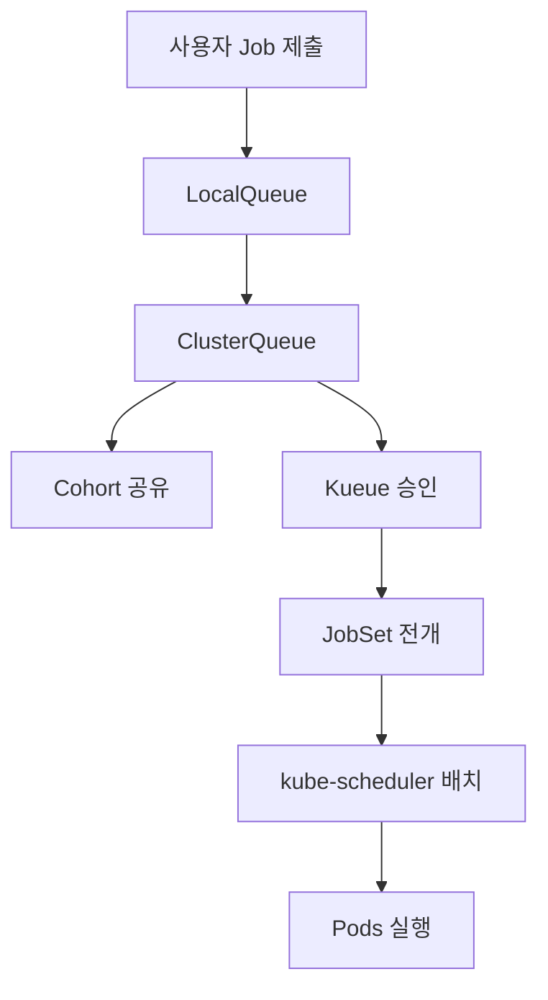
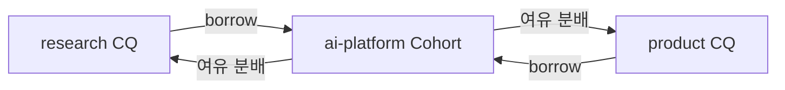
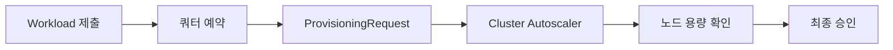
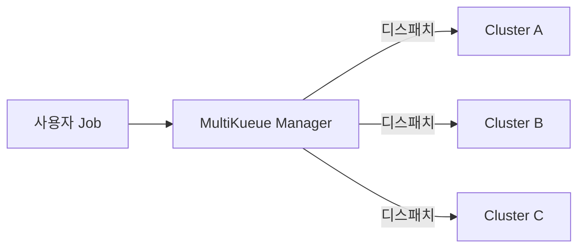
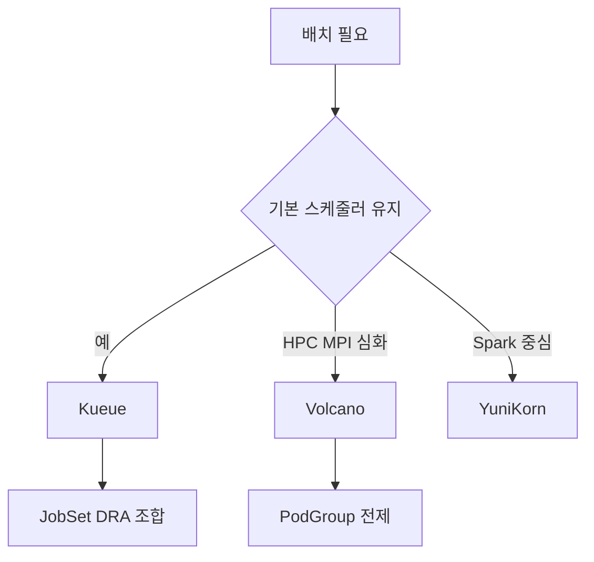

# 배치 워크로드 — Kueue, JobSet, Queueing

> 쿠버네티스의 기본 Job은 "파드 하나 이상 끝나면 끝"이라는 최소 단위 모델이다.
> 하지만 **GPU·HPC·분산 학습**은 *파드 여러 벌을 동시에* 띄워야 하고, *한정된
> 고가 자원*을 *여러 팀이 공정하게* 써야 한다. Kueue는 "큐·쿼터·승인" 계층,
> JobSet은 "다역할 분산 Job" 계층을 채워 이 간극을 해결한다.

- **Job / CronJob** — 파드 수준 재시도·완료 모델
- **Indexed Job + backoffLimitPerIndex (1.33 GA)** — 독립 인덱스별 실패 제어
- **JobSet** — 여러 ReplicatedJob 조합, 헤드리스 서비스·토폴로지 배치 자동화
- **Kueue** — ClusterQueue·ResourceFlavor·Cohort·Fair Sharing
- **Gang Scheduling·TAS** — 전원 승인·토폴로지 인지 배치
- **Volcano** — 대안 스케줄러 (Kueue와의 선택 기준 포함)

선행: [Job·CronJob](../workloads/job-cronjob.md), [Priority·Preemption](../scheduling/priority-preemption.md),
[GPU 스케줄링](./gpu-scheduling.md). 분산 학습의 프레임워크 관점은 `ai-ml/`에서 별도.

---

## 1. 왜 기본 Job으로는 부족한가

| 요구 | 기본 Job | 필요한 확장 |
|---|---|---|
| 여러 역할 (리더·워커·PS) | 단일 파드 템플릿 | **JobSet**, LeaderWorkerSet |
| 전원 동시 시작 (Gang) | 스케줄러 비인지, 파셜 자원 점유 | **Kueue + Workload 승인** |
| 팀별 쿼터·공유 | `ResourceQuota` 네임스페이스 한정 | **ClusterQueue·Cohort** |
| 큐잉·우선순위 | Priority만 있음, 대기열 없음 | **LocalQueue → ClusterQueue** |
| 토폴로지 인지 (같은 랙·NVLink 도메인) | Topology Spread만 존재 | **TAS (Topology Aware Scheduling)** |
| 인덱스별 실패 제어 | `backoffLimit`이 전체 단일 | **backoffLimitPerIndex (1.33 GA)** |

**결론**: Job은 **실행 단위**, Kueue는 **승인 계층**, JobSet은 **구성 계층**이다.
세 가지가 서로 대체재가 아니라 **스택**으로 동작한다는 점이 핵심.



---

## 2. 기본 Job의 현대적 기능 — 1.33~1.34 GA 요약

배치 도구를 붙이기 전에 기본 Job이 이미 제공하는 기능부터 정확히 안다.

| 기능 | GA | 의미 |
|---|---|---|
| **Indexed completion** | 1.24 | 파드에 `JOB_COMPLETION_INDEX` 환경 변수, 순서·역할 표현 |
| **Pod Failure Policy** | 1.31 | `Ignore` / `FailJob` / `FailIndex` / `Count` 액션으로 실패 분류 |
| **SuccessPolicy** | **1.33** | `succeededIndexes`·`succeededCount`로 조기 성공 종료 (Indexed 전용). JobSet `successPolicy`와 이름만 같을 뿐 다른 리소스 |
| **backoffLimitPerIndex** | **1.33** | 인덱스별 재시도 한도. 한 테스트 스위트가 전체 예산을 먹는 문제 해결 |
| **maxFailedIndexes** | 1.33 | 실패 허용 인덱스 개수 상한 |
| **Pod Replacement Policy** | **1.34** | 실패한 파드를 완전 삭제 후 교체 vs 즉시 교체 선택. 기본값은 `TerminatingOrFailed` — 파드가 Terminating에 들어가자마자 새 파드 생성. Indexed·분산 학습처럼 인덱스당 파드 1개가 전제면 `Failed`로 명시 필요 |

### 2.1 현대적 Indexed Job 예

```yaml
apiVersion: batch/v1
kind: Job
metadata:
  name: matrix-tests
spec:
  completions: 16
  parallelism: 4
  completionMode: Indexed
  backoffLimit: 6                       # maxFailedIndexes × backoffLimitPerIndex = 3×2=6
  backoffLimitPerIndex: 2              # 인덱스별 최대 2회 재시도
  maxFailedIndexes: 3                  # 3개 인덱스 실패 시 Job 실패
  podReplacementPolicy: Failed          # 1.34 GA. podFailurePolicy 사용 시 자동 강제
  podFailurePolicy:
    rules:
      - action: FailJob
        onExitCodes:
          containerName: runner
          operator: In
          values: [42]                  # 치명적 코드는 즉시 Job 실패
      - action: Ignore
        onPodConditions:
          - type: DisruptionTarget       # 드레인·프리엠션은 실패로 세지 않음
  template:
    spec:
      restartPolicy: Never
      containers:
        - name: runner
          image: test-runner:1.2
          env:
            - name: SUITE_INDEX
              value: "$(JOB_COMPLETION_INDEX)"
```

**운영 포인트**: `DisruptionTarget` 조건을 `Ignore`로 처리하는 패턴은
Karpenter·Cluster Autoscaler 환경에서 **배치 재스케줄링이 실패로 카운트되는
오탐**을 제거한다. 현대 배치 Job의 사실상 표준 설정.

---

## 3. JobSet — 분산 Job의 1급 리소스

JobSet은 **여러 개의 ReplicatedJob**을 하나의 상위 리소스로 묶어 분산 워크로드(리더-워커, PS-worker, 멀티 슬라이스 TPU 등)를 선언한다.

### 3.1 핵심 기능

| 기능 | 설명 |
|---|---|
| **Multi-template ReplicatedJob** | 역할별로 서로 다른 파드 템플릿 (리더 1, 워커 N) |
| **자동 Headless Service** | 각 파드에 안정 DNS (`<job>-<idx>.<jobset>`) |
| **Configurable Success Policy** | `Any` / `All` ReplicatedJob 성공 조건 |
| **Configurable Failure Policy (v0.6+)** | 에러 유형별 재시작·종료 전략 |
| **Exclusive Placement Per Topology** | 자식 Job을 토폴로지 도메인(랙·존)에 1:1로 고정. **도메인 수 ≥ 자식 Job 수**가 아니면 영구 파셜 상태 |
| **InPlaceRestart (alpha)** | 파드 재생성 없이 컨테이너만 재시작, 모델 로딩 시간 절약 |
| **PodDisruptionBudget 통합** | 학습 중 노드 드레인 보호 |
| **VolumeClaimPolicies** | 체크포인트·데이터셋 PVC 수명 제어 |

### 3.2 버전 현황

| 항목 | 값 |
|---|---|
| 최신 버전 | `v0.11.1` (2026-03) |
| API | `jobset.x-k8s.io/v1alpha2` |
| 지원 K8s 범위 | 최신 3 minor |
| GA 일정 | 공식 고지 없음, 안정화 진행 중 |

### 3.3 전형적인 분산 학습 JobSet

```yaml
apiVersion: jobset.x-k8s.io/v1alpha2
kind: JobSet
metadata:
  name: llm-pretrain
spec:
  failurePolicy:
    maxRestarts: 3
  successPolicy:
    operator: All
  replicatedJobs:
    - name: leader
      replicas: 1
      template:
        spec:
          parallelism: 1
          completions: 1
          template:
            spec:
              containers:
                - name: leader
                  image: trainer:1.4
                  resources:
                    limits:
                      nvidia.com/gpu: 8
    - name: worker
      replicas: 7                       # 워커 Job 7개
      template:
        spec:
          parallelism: 1
          completions: 1
          template:
            spec:
              containers:
                - name: worker
                  image: trainer:1.4
                  resources:
                    limits:
                      nvidia.com/gpu: 8
```

- 총 **8 노드 × 8 GPU = 64 GPU** 클러스터 학습
- 각 파드는 `llm-pretrain-worker-0-0.llm-pretrain` 형태 DNS로 접근
- 리더가 성공하고 워커 전원 성공해야 JobSet 성공

**운영 주의**: JobSet은 "N개 파드를 동시에 띄우는 것"을 보장하지만, **전원이
한꺼번에 스케줄될지**는 스케줄러 책임이 아니다. 빈 자원이 없어 파셜로 뜨면
GPU가 묶인 채 대기하는 데드락이 발생한다. 이걸 막는 장치가 다음 장 **Kueue의
Gang Admission**.

---

## 4. Kueue — 큐잉·쿼터·승인 계층

### 4.1 위치

Kueue는 **kube-scheduler를 교체하지 않는다**. Job의 `spec.suspend: true`
필드를 활용해 "승인받기 전까지 파드를 만들지 않는 Job"을 만들고, 쿼터와
우선순위에 따라 `false`로 전환해 실행을 허가한다. 기본 스케줄러·RBAC·네트워킹
전제를 그대로 유지하므로 도입 비용이 매우 낮다.

### 4.2 핵심 리소스

| 리소스 | 역할 |
|---|---|
| **ResourceFlavor** | 노드 그룹·GPU 타입의 논리 이름 (`h100-80gb`, `cpu-pool`, `spot`) |
| **ClusterQueue** | 클러스터 범위 쿼터·플레이버 구성. 승인 판단의 주체 |
| **LocalQueue** | 네임스페이스 범위 큐, 사용자가 Job에 참조 |
| **Workload** | Kueue가 Job·JobSet·MPIJob·RayJob 등을 추상화한 내부 리소스 |
| **Cohort** | ClusterQueue 묶음. 서로 미사용 쿼터를 **빌려/빌려줄** 수 있음 |
| **AdmissionCheck** | 승인 전에 외부 조건(예: ProvisioningRequest) 대기 |
| **WorkloadPriorityClass** | 배치 전용 우선순위 (파드 PriorityClass와 독립) |

### 4.3 버전 현황 (2026-04)

| 항목 | 값 |
|---|---|
| 최신 버전 | `v0.17.1` (2026-04-16) |
| API | `kueue.x-k8s.io/v1beta2` (신규 표준). `v1beta1`은 **deprecated, 제거 예정** — 신규 작성은 전부 v1beta2 |
| LendingLimit | **v0.17.0 GA** (이번 릴리스의 실제 GA 승격 항목) |
| Hierarchical Cohort | 기존 안정 지원. v0.17에서 KueueViz 트리 뷰·Fair Sharing 경로 개선 |
| **TAS** (Topology Aware Scheduling) | **v0.14 이후 Beta·기본 활성**. 멀티레이어(3계층) 피처 게이트 `TASMultiLayerTopology`만 알파 |
| **ProvisioningRequest** | **v0.14 GA** (Cluster Autoscaler 연동 2단계 승인) |
| MultiKueue | 안정화. v0.17에서 Job·JobSet·MPIJob·RayJob·LeaderWorkerSet 지원 |
| 네이티브 통합 신규 | Apache Spark, Kubeflow Trainer v2 (TrainJob) 공식 추가 |

### 4.4 최소 설정 예

```yaml
# 1) 플레이버 — 물리 자원 타입을 이름으로 추상화
apiVersion: kueue.x-k8s.io/v1beta2
kind: ResourceFlavor
metadata:
  name: h100-80gb
spec:
  nodeLabels:
    nvidia.com/gpu.product: NVIDIA-H100-80GB-HBM3
  tolerations:
    - key: nvidia.com/gpu
      operator: Exists
      effect: NoSchedule
---
apiVersion: kueue.x-k8s.io/v1beta2
kind: ResourceFlavor
metadata:
  name: cpu-default
---
# 2) ClusterQueue — 전체 쿼터 및 플레이버
apiVersion: kueue.x-k8s.io/v1beta2
kind: ClusterQueue
metadata:
  name: research
spec:
  cohort: ai-platform
  namespaceSelector: {}
  resourceGroups:
    - coveredResources: ["cpu", "memory", "nvidia.com/gpu"]
      flavors:
        - name: h100-80gb
          resources:
            - name: cpu
              nominalQuota: "1600"
            - name: memory
              nominalQuota: "12Ti"
            - name: nvidia.com/gpu
              nominalQuota: "64"
              borrowingLimit: "32"       # nominalQuota 초과로 빌릴 수 있는 최대 (64+32=96)
              lendingLimit:  "16"        # 남에게 양보 가능한 최대 (48장은 항상 내 몫 보장)
        - name: cpu-default
          resources:
            - name: cpu
              nominalQuota: "400"
            - name: memory
              nominalQuota: "2Ti"
  preemption:
    withinClusterQueue: LowerPriority
    reclaimWithinCohort: Any            # 빌려준 쿼터는 되찾을 때 강제 가능
---
# 3) LocalQueue — 네임스페이스에서 사용자가 참조
apiVersion: kueue.x-k8s.io/v1beta2
kind: LocalQueue
metadata:
  name: research-queue
  namespace: team-vision
spec:
  clusterQueue: research
---
# 4) 사용자의 Job — 큐만 지정하면 됨
apiVersion: batch/v1
kind: Job
metadata:
  name: imagenet-train
  namespace: team-vision
  labels:
    kueue.x-k8s.io/queue-name: research-queue
spec:
  suspend: true                         # Kueue가 승인 시 false로 전환
  parallelism: 4
  completions: 4
  template:
    spec:
      restartPolicy: Never
      containers:
        - name: trainer
          image: trainer:1.4
          resources:
            limits:
              nvidia.com/gpu: 8
              cpu: "32"
              memory: "200Gi"
```

### 4.5 Cohort로 쿼터 빌리기



- 각 CQ는 `nominalQuota`(고정 할당)를 가진다.
- 같은 cohort의 다른 CQ가 **놀고 있으면 빌려 쓴다**.
- `borrowingLimit`·`lendingLimit`으로 과도한 쏠림을 막는다.
- 원 소유 CQ에 Job이 들어오면 `reclaimWithinCohort`가 빌려간 쪽을 **선점(preempt)**한다.

**효과**: "팀별로 하드하게 GPU 8장씩 나누면 평균 이용률이 30%도 안 된다"는 전형적인 문제를, *평균적으로는 공유하되 보장 구간은 지키는* 구조로 해결.

**Hierarchical Cohort**는 이미 안정 지원되며, cohort를 트리 구조로 구성해 "부서 → 팀 → 프로젝트" 단계별 공유·제한을 선언할 수 있다. 조직도가 3단계 이상인 회사에서 필수. v0.17.0에서는 KueueViz 트리 뷰 UI와 Fair Sharing 경로 개선이 추가됐고, **이번 릴리스의 실제 GA 승격은 `lendingLimit`** — 여유 자원을 빌려주되 상한을 명확히 제한하는 운영 패턴이 표준화됐다.

### 4.6 지원 워크로드와 `integrations.frameworks`

Kueue는 Job 외에도 JobSet·RayJob·MPIJob·TrainJob·Plain Pod 등 다양한 워크로드를 **쿼터·승인의 단일 추상(Workload)**으로 감싼다. 단, **설치 직후에 모두 활성화되어 있지 않으므로** `kueue-manager-config` ConfigMap에서 명시해야 한다. "RayJob 제출했는데 Kueue가 인식을 안 한다"는 가장 흔한 함정의 원인.

```yaml
# kueue-manager-config (ConfigMap) 일부
integrations:
  frameworks:
    - batch/job
    - jobset.x-k8s.io/jobset
    - kubeflow.org/mpijob
    - ray.io/rayjob
    - ray.io/raycluster
    - pod                                 # Plain Pod / PodGroup
    - leaderworkerset.x-k8s.io/leaderworkerset
    - trainer.kubeflow.org/trainjob        # Kubeflow Trainer v2
    - spark.apache.org/sparkapplication    # v0.17 신규
```

| 워크로드 | Integration 키 | MultiKueue 지원 | 비고 |
|---|---|---|---|
| Job | `batch/job` | O | 기본, `suspend: true` 경로 |
| JobSet | `jobset.x-k8s.io/jobset` | O | 분산 학습 기본 |
| RayJob / RayCluster | `ray.io/rayjob`, `ray.io/raycluster` | O | Ray 네이티브 큐잉 |
| MPIJob | `kubeflow.org/mpijob` | O | HPC·OpenMPI |
| TrainJob | `trainer.kubeflow.org/trainjob` | — | Kubeflow Trainer v2 |
| LeaderWorkerSet | `leaderworkerset.x-k8s.io/leaderworkerset` | O (v0.17+) | LLM 추론·학습 리더-워커 |
| SparkApplication | `spark.apache.org/sparkapplication` | — | v0.17 신규 |
| **Plain Pod / PodGroup** | `pod` | — | Job 없이 큐잉, Argo Workflow·레거시 파이프라인 수용 |

**Plain Pod / PodGroup** 모드에서는 `kueue.x-k8s.io/pod-group-name` 라벨로 파드 묶음을 지정하고 Kueue가 이를 Workload 하나로 추상화한다. `pod-group-total-count`로 gang 크기를 선언하면 "쿼터는 묶음 단위로, 승인은 전체 사이즈로"라는 원칙이 그대로 적용된다.

**용어 구분**:
- **Kueue Workload** = 승인·쿼터의 추상 단위. Job·JobSet·RayJob·PodGroup 위에 1:1로 씌운다.
- **Volcano·K8s 1.35 PodGroup** = 스케줄러 레벨의 gang 단위. 실제 파드 배치의 원자성을 담당.

### 4.7 ProvisioningRequest — 2단계 승인

Kueue의 기본 승인은 **쿼터 수준의 원자적 예약**이다. 하지만 쿼터가 확보되어도 **실제 물리 노드가 비어 있지 않으면** 파드가 대기한다. 온프레미스·Cluster Autoscaler 환경에서 이 간극을 메우는 것이 **ProvisioningRequest**(v0.14 GA).



```yaml
apiVersion: kueue.x-k8s.io/v1beta2
kind: ProvisioningRequestConfig
metadata:
  name: capacity-check
spec:
  provisioningClassName: check-capacity.autoscaling.x-k8s.io
  managedResources:
    - nvidia.com/gpu
  retryStrategy:
    backoffLimitCount: 3
    backoffBaseSeconds: 60
---
apiVersion: kueue.x-k8s.io/v1beta2
kind: AdmissionCheck
metadata:
  name: gpu-capacity
spec:
  controllerName: kueue.x-k8s.io/provisioning-request
  parameters:
    apiGroup: kueue.x-k8s.io
    kind: ProvisioningRequestConfig
    name: capacity-check
```

| 프로비저닝 클래스 | 용도 |
|---|---|
| `check-capacity.autoscaling.x-k8s.io` | 노드 증설 없이 **현재 용량만** 검증. 온프레미스 기본 |
| `best-effort-atomic-scale-up.autoscaling.x-k8s.io` | 클라우드 CA 환경 — 가능하면 전원 증설, 실패 시 취소 |

**온프레미스 응용**: ProvisioningRequest는 확장 포인트이기도 해서 **커스텀 AdmissionCheck**로 Rook-Ceph 잔여 용량·GPU 드라이버 워밍업·ExternalSecret 동기화 상태까지 직접 검증할 수 있다. 이 구조가 13장에서 언급하는 "Rook-Ceph 용량·GPU 가용성 검증"의 실체.

### 4.8 플레이버 설계 패턴

ResourceFlavor는 **물리 자원의 논리적 분류**다. 한 GPU 카드라도 "언제·누가·어떻게" 쓰는지에 따라 분리해야 Fair Sharing·Preemption 논리가 깔끔해진다.

| 플레이버 | 쓰임 | 노드 라벨·테인트 |
|---|---|---|
| `h100-reserved` | 팀 보장 GPU (유지보수 창 외 항상 사용) | `tier=reserved` |
| `h100-burst` | 버스트용 GPU (유지보수·하드웨어 전환 시 먼저 회수) | `tier=burst` |
| `a100-legacy` | 구세대, 낮은 우선순위 학습 전용 | `tier=legacy` |
| `cpu-default` | CPU 전용 파이프라인·데이터 전처리 | `tier=cpu` |

```yaml
spec:
  resourceGroups:
    - coveredResources: ["nvidia.com/gpu"]
      flavors:                     # 우선순위 순서 — fungibility
        - name: h100-reserved      # 1순위
        - name: h100-burst         # 2순위
        - name: a100-legacy        # 3순위 (fallback)
```

**Flavor Fungibility**(대체 가능성): `ClusterQueue.spec.flavorFungibility`로 `Borrow` / `Preempt` 정책을 설정하면, 1순위 플레이버가 쿼터 초과일 때 동일 리소스를 가진 하위 플레이버로 **자동 폴백**한다. "가능하면 신형 GPU, 아니면 구형으로 떨어뜨려 학습은 계속"이라는 원칙을 선언으로 구현.

---

## 5. 우선순위·선점·Gang 승인

### 5.1 우선순위

```yaml
apiVersion: kueue.x-k8s.io/v1beta2
kind: WorkloadPriorityClass
metadata:
  name: high
value: 1000
description: "Prod inference retraining"
```

- 일반 `PriorityClass`는 **파드 스케줄**에 영향
- `WorkloadPriorityClass`는 **Kueue 승인·선점**에 영향 (서로 독립)
- 같은 CQ 안에서 `LowerPriority`·`LowerOrNewerEqualPriority` 정책으로 선점 범위 제어

### 5.2 Gang Admission — 두 층으로 이해

Kueue의 기본 승인은 **쿼터 수준의 원자적 예약(atomic reservation)**이다. Workload 전체의 요구 쿼터가 확보된 경우에만 `suspend=false`로 풀어준다. 그러나 **쿼터 확보 ≠ 모든 파드가 실제로 스케줄·Ready**. 노드 단편화·Taint/Affinity·프로비저닝 대기로 인한 **파셜 스케줄·학습 데드락은 여전히 발생 가능**.

실 파드 수준의 all-or-nothing을 원한다면 `waitForPodsReady`를 켠다.

```yaml
# kueue-manager-config (ConfigMap)
waitForPodsReady:
  enable: true
  timeout: 10m                       # 전원 Ready까지의 상한
  blockAdmission: true               # 한 Workload 실패 시 후속 승인 차단
  requeuingStrategy:
    timestamp: Eviction              # Creation 또는 Eviction
    backoffBaseSeconds: 60           # 재큐 백오프 시작
    backoffMaxSeconds: 3600          # 최대 1시간
    backoffLimitCount: null          # null이면 무한 재시도
```

| 층 | 보장 범위 | 발동 조건 | 실패 시 |
|---|---|---|---|
| **쿼터 원자성** (기본) | 쿼터 단위 예약 | 쿼터·플레이버 부족 | Workload 대기 (admission 미승인) |
| **waitForPodsReady** (옵션) | 모든 파드 Ready까지 | 타임아웃 내 파드 미Ready | Workload Evict → 재큐잉 |

- RayJob·JobSet·MPIJob·TFJob 등 다중 파드 워크로드 전부 해당.
- `requeuingStrategy`로 "전원 Ready 실패 → 백오프 후 재시도" 정책 지정.
- "Kueue만 붙이면 데드락 없음"이 아니라, **Kueue + `waitForPodsReady`** 조합이 실 파드 gang의 표준. 이 조합이 없으면 JobSet이 8-GPU 중 6장만 잡고 먹혀버리는 상황이 그대로 재현된다.

> **참고 — K8s 1.35 Native Gang Scheduling**: 1.35에서 `scheduling.k8s.io/v1alpha1/Workload` API와
> 스케줄러 레벨 **Gang Scheduling 플러그인**(알파, 기본 비활성), **Opportunistic Batching**(Beta, 기본 활성)이
> 도입됐다. 현재는 **Kueue = 승인·쿼터 계층**, **1.35 GangScheduling = 스케줄러 계층**의 역할이 분리되어 있다.
> 장기적으로 두 스택이 수렴할 여지는 있으나(KEP-4671 논의 중), 2026-04 기준 프로덕션 기본은
> **Kueue + `waitForPodsReady`**. 신규 네이티브 Workload API는 피처 게이트 활성 후 PoC 권장.

### 5.3 선점 정책

| 필드 | 의미 |
|---|---|
| `reclaimWithinCohort` | 빌려준 쿼터를 되찾을 때 다른 CQ 선점 가능 여부 |
| `withinClusterQueue` | 같은 CQ 안에서 우선순위 기반 선점 |
| `borrowWithinCohort` | 빌리는 중에도 cohort 내 선점 허용 |

**권장 시작점**: `reclaimWithinCohort=Any`, `withinClusterQueue=LowerPriority`. 이 조합이면 "내 자원은 우선 내 것이고, 나 없을 때만 빌려준다"는 기본 공정성을 유지한다.

### 5.4 Preemption vs Eviction

"왜 내 Job이 중단됐는가?"를 디버깅할 때 가장 먼저 구분해야 할 두 가지.

| 구분 | **Preemption** | **Eviction** |
|---|---|---|
| 원인 | 우선순위·쿼터 회수 정책 | `waitForPodsReady` 타임아웃, Flavor Fungibility 실패, API 강제 |
| 발동 정책 | `withinClusterQueue`, `reclaimWithinCohort`, `borrowWithinCohort` | `waitForPodsReady.timeout`·`blockAdmission` |
| 기록 | `kueue_preempted_workloads_total` | `kueue_evicted_workloads_total` |
| 복구 | 상위 Workload 승인 이후 재큐 | `requeuingStrategy`의 백오프 후 재큐 |
| 예방 책 | priority class 단계 정리, cohort 설계 | 타임아웃 여유, 토폴로지 라벨·플레이버 정리 |

**운영 원칙**: 둘이 동일한 "중단"으로 보이지만 **원인과 예방 책이 다르다**. Prometheus 알림은 반드시 두 메트릭을 분리해 튜닝한다.

---

## 6. Topology Aware Scheduling (TAS)

### 6.1 왜 필요한가

8-GPU 노드 간 NCCL All-Reduce는 **NVLink·NVSwitch** 대역(수 TB/s)과 **InfiniBand·RoCE** 대역(수백 GB/s)의 차이가 10배 이상이다. 단순한 Topology Spread는 "존 분산"만 보지 파드 간 **물리 근접성**을 몰라, 같은 랙에 들어갈 수 있었던 파드를 일부러 떨어뜨려 학습 처리량을 수십% 깎기도 한다.

### 6.2 TAS 모델

Kueue는 노드 라벨로 계층(존 > 블록 > 랙)을 선언하고, Workload가 **원하는 근접도**를 표현한다.

```yaml
apiVersion: kueue.x-k8s.io/v1alpha1
kind: Topology
metadata:
  name: datacenter
spec:
  levels:
    - nodeLabel: topology.k8s.io/zone     # 공식 표준
    - nodeLabel: topology.k8s.io/block    # 커스텀 (NVIDIA·GCP 관례)
    - nodeLabel: topology.k8s.io/rack     # 커스텀 — 조직별 자체 도메인 사용 가능
    - nodeLabel: kubernetes.io/hostname
---
apiVersion: kueue.x-k8s.io/v1beta2
kind: ResourceFlavor
metadata:
  name: h100-tas
spec:
  nodeLabels:
    nvidia.com/gpu.product: NVIDIA-H100-80GB-HBM3
  topologyName: datacenter
```

Job에서는 PodSet 어노테이션으로 요청:

```yaml
metadata:
  annotations:
    kueue.x-k8s.io/podset-required-topology: topology.k8s.io/rack
    # 또는 preferred-topology 로 "되면 좋고, 안 되면 허용"
```

TAS 본체는 **v0.14 이후 Beta로 기본 활성**화되어 프로덕션 투입 가능하다. 3단계 계층(존 > 블록 > 랙) 이상의 멀티레이어 토폴로지만 아직 알파(`TASMultiLayerTopology`). TAS는 K8s 1.35에서 정식 릴리스된 **Workload Aware Scheduling**(§5.2 참고)의 개념 기반과 겹치는 영역이므로, GB200·NVL72 같은 고밀도 시스템을 온프레미스로 운영하는 조직은 지금부터 라벨 스킴을 준비해두면 장기적으로도 유효하다.

---

## 7. DRA와 Kueue 연동

DRA(Dynamic Resource Allocation)가 1.34에서 GA되면서 Kueue도 `ResourceClaimTemplate` 기반 워크로드의 쿼터·승인을 지원한다.

| 경로 | 권장 사용 |
|---|---|
| **기존**: 확장 리소스 (`nvidia.com/gpu`) | 간단한 GPU 카운트 제한 |
| **DRA**: `DeviceClass` 기반 claim | MIG 프로파일·NVLink 도메인·드라이버 버전 조건까지 표현 |

Kueue는 `ResourceClaim`을 `Workload`로 묶어 동일한 큐잉·공정성·선점 원칙을 적용한다. GPU 스케줄링의 세부 전환 전략은 [GPU 스케줄링 §9](./gpu-scheduling.md#9-dra--134-ga-속성-기반-스케줄링)를 참조.

---

## 8. MultiKueue — 멀티 클러스터 배치

온프레미스 + 버스트용 원격 클러스터를 함께 쓰거나, 리전별로 나뉜 GPU 풀을 하나의 큐에서 본다.



- 관리 클러스터의 `ClusterQueue`에 **여러 워커 클러스터**를 등록 (`MultiKueueConfig`·`MultiKueueCluster` 리소스)
- Workload가 승인되면 가장 적합한 워커 클러스터로 **투영(projection)**되어 실제 Job이 그쪽에 만들어짐
- 투영 경로: 관리 클러스터가 워커 클러스터의 `kueue-mgr-sa` ServiceAccount 토큰을 **KubeConfig Secret**으로 보유, 해당 토큰으로 워커 클러스터 API 호출
- v0.17에서 동기화·조율 버그 다수 개선, 지원 워크로드(Job·JobSet·MPIJob·RayJob·LeaderWorkerSet) 확장

**운영 함정** (빈번):
- **토큰 만료** — ServiceAccount 토큰 수명 관리, 자동 갱신(ExternalSecret·cert-manager) 전제
- **ClusterRoleBinding 권한 범위** — 관리 클러스터가 워커의 Job·Pod·Secret을 쓰기/읽기 모두 해야 하므로 최소 권한 설계가 까다롭다
- **버전 차이** — 관리·워커 클러스터 간 Kueue 마이너 버전 차가 크면 투영 실패. 업그레이드 창을 합쳐야 함
- **지원 리소스 차이** — 버전별 지원 워크로드 목록 상이, 릴리스 노트 교차 확인 필수

**적용 기준**: 단일 클러스터에서 GPU 수백 장 넘어가거나, 원격 리전·계열사·버스트 제휴로 실행 풀을 확장해야 할 때.

---

## 9. Fair Sharing

기본 Kueue는 **FIFO + 쿼터**다. 여러 사용자가 큰 Job을 순차로 제출하면 먼저 낸 사람이 오래 독점한다. Fair Sharing(공정 공유)을 켜면 사용자별·큐별 누적 사용량을 고려해 *시간 평균을 균일하게* 만든다.

```yaml
apiVersion: kueue.x-k8s.io/v1beta2
kind: ClusterQueue
metadata:
  name: research
spec:
  fairSharing:
    weight: 1
  preemption:
    withinClusterQueue: LowerOrNewerEqualPriority
```

- 가중치로 팀별 상대적 지분 조정 가능
- 장기 학습이 짧은 Job들을 계속 미루는 기아(starvation) 방지

---

## 10. Kueue vs Volcano vs YuniKorn

| 항목 | **Kueue** | **Volcano** | **YuniKorn** |
|---|---|---|---|
| 포지션 | Job·JobSet 위의 **승인 계층** | **대체 스케줄러** | **대체 스케줄러** |
| kube-scheduler | 그대로 사용 | 교체 | 교체 (또는 공존) |
| 강점 | K8s 네이티브, 도입 점진적 | Gang, MPI/PyTorch 직통, HPC 성숙 | 멀티테넌시·계층 큐, 빅데이터(Spark) |
| 약점 | 스케줄링 최적화는 기본 스케줄러 의존 | 네이티브 스케줄러 기능 따라잡기 부담 | 학습 곡선, k8s 외 YARN 문맥 혼재 |
| 대표 사용처 | 현대적 K8s 표준 스택 | AI/HPC 고성능, Kubeflow 오래된 배포 | Spark-on-K8s, 멀티테넌트 데이터 플랫폼 |

### 의사결정



**실무 권장**: 새로 시작한다면 **Kueue + JobSet**. 이미 Volcano 생태에 깊이
들어간 팀(MPIJob·TFJob·PyTorchJob 전면 의존)은 마이그레이션 비용을 따져
점진적으로. Kubeflow Trainer v2.x가 Kueue·JobSet·LeaderWorkerSet를 기본 통합
대상으로 삼으면서 흐름은 Kueue 쪽으로 기울고 있다.

---

## 11. 관측 — 배치 SLO의 지표

| 지표 | 의미 | 질문 |
|---|---|---|
| **대기 시간** (admission latency) | Job 제출 → 승인까지 | "우선순위가 실제로 먹히는가" |
| **실행 시간 분포** | 승인 → 완료 | "테일이 튀는 인덱스가 있는가" |
| **큐 점유율** | 대기 Workload 수 | "병목 큐는 어디인가" |
| **쿼터 이용률** | 플레이버별 사용량 | "놀고 있는 플레이버가 있는가" |
| **선점 발생** | 빈도·원인 | "프리엠션이 학습 체크포인트와 맞물리나" |
| **Gang 승인 실패** | 자원 부족·단편화 | "클러스터 확장 또는 리팩터링 필요" |

Kueue는 `/metrics`로 Prometheus 노출. 대표 메트릭:
- `kueue_pending_workloads` (큐별 대기)
- `kueue_admitted_workloads_total`
- `kueue_admission_wait_time_seconds` (histogram)
- `kueue_cluster_queue_resource_usage`
- `kueue_preempted_workloads_total`
- `kueue_evicted_workloads_total` (waitForPodsReady 타임아웃)

### 11.1 SLO 연동 예

메트릭을 그대로 두면 알림이 안 울리거나 소음만 커진다. 배치 SLO는 **질문**으로 정의.

| SLO 문장 | 대응 메트릭 | 목표 |
|---|---|---|
| "프로덕션 우선순위 Job은 제출 후 5분 이내 승인" | `histogram_quantile(0.95, rate(kueue_admission_wait_time_seconds_bucket{priority_class="prod"}[5m]))` | p95 < 5m |
| "Gang 실패로 학습이 1시간 내 3회 이상 재큐되지 않는다" | `rate(kueue_evicted_workloads_total[1h])` | < 3 |
| "선점은 의도한 우선순위에서만 발생" | `kueue_preempted_workloads_total` × label (`preemptor_priority`, `preempted_priority`) | 역전 없음 |

Prometheus Recording Rule 예:
```yaml
groups:
  - name: kueue-slo
    rules:
      - record: kueue:admission_wait_seconds:p95
        expr: histogram_quantile(0.95, sum by (cluster_queue, le)
              (rate(kueue_admission_wait_time_seconds_bucket[5m])))
      - alert: KueueProdAdmissionSlow
        expr: kueue:admission_wait_seconds:p95{cluster_queue="prod"} > 300
        for: 10m
        labels: {severity: warning}
```

---

## 12. 실무 함정·체크리스트

### 12.1 자주 하는 실수

| 증상 | 원인 | 해결 |
|---|---|---|
| Kueue 적용 후 Job이 영원히 `Suspend` | LocalQueue 라벨 누락, 또는 참조 CQ 미존재 | `kueue.x-k8s.io/queue-name` 라벨 확인, CQ 상태 확인 |
| 승인되어도 파드 0개 | PodSet 리소스 요청이 쿼터 대비 너무 큼 | `kubectl describe workload` → `admissionChecks`·`podSets` |
| Cohort 빌림이 기대대로 안 됨 | `borrowingLimit`·`lendingLimit`이 `nominalQuota`를 넘음 | 값 재검토, Cohort 내 CQ 합계 = cohort 가용 자원 |
| 선점이 학습 체크포인트를 날림 | 파드 `terminationGracePeriodSeconds` 짧음 | 길게 + preStop 체크포인트 저장 |
| JobSet 파셜 실행 후 데드락 | Kueue·`waitForPodsReady` 미사용 | **Kueue + `waitForPodsReady` 동시 활성**이 표준. 쿼터 원자성만으로는 실 파드 gang 미보장 |
| Indexed Job 진도 역주행 | 기본값 `TerminatingOrFailed` — 파드 1개당 2개 실행 구간 발생 | ML 프레임워크(TF·JAX)·Indexed Job은 `podReplacementPolicy: Failed`로 명시. `podFailurePolicy` 사용 시 자동 강제 |
| Preemption 폭주 | 우선순위 설계 실패 (많은 워크로드가 동일 고우선순위) | priority class 3~4 단계로 제한 |

### 12.2 도입 체크리스트

| 항목 | 내용 |
|---|---|
| **도입 순서** | 1) Job + Pod Failure Policy → 2) Kueue CQ/LQ → 3) `waitForPodsReady` 활성 → 4) JobSet → 5) ProvisioningRequest → 6) TAS (옵션) |
| **integrations 확인** | 설치 후 `kueue-manager-config.integrations.frameworks`에 사용 워크로드(JobSet·RayJob·MPIJob·Pod·TrainJob 등) 모두 포함 확인 |
| **API 버전** | 전부 `v1beta2`로 통일. `v1beta1` YAML 리포지토리 잔존 여부 점검 |
| **플레이버 설계** | GPU 세대별(H100/A100) + `tier=reserved/burst/legacy` 운영 정책 라벨, 전력·냉각 세그먼트별 이름 분리 |
| **Cohort 설계** | 조직도 1:1 대응 지양, "공유 가능한 단위"로 묶음. Hierarchical Cohort로 부서-팀-프로젝트 |
| **쿼터** | `nominalQuota`는 보장 분, 공유는 cohort로. `borrowingLimit`·`lendingLimit`로 상한 고정 |
| **우선순위 클래스** | 2~4개 단계 (예: `critical`/`prod`/`dev`) |
| **관측** | `kueue_admission_wait_time_seconds` p95 / `preempted` / `evicted`을 분리한 SLO + DCGM GPU 메트릭 + JobSet 이벤트 |
| **선점 안전** | 체크포인트 전략, `terminationGracePeriodSeconds`, DRA 클레임 해제 |
| **정기 리뷰** | 쿼터·코호트·TAS 라벨·integrations 목록 분기 1회 재검토 |

---

## 13. 온프레미스 운영 관점

본 위키 환경(100% 온프레미스·Gateway API·Cilium·Rook-Ceph)에서의 배치 고려사항:

| 항목 | 고려사항 |
|---|---|
| **GPU 풀** | 세대별(H100/A100) ResourceFlavor 분리, 스팟 개념 없으므로 `tier=reserved/burst/legacy`로 운영 정책 반영 |
| **대용량 데이터셋** | Rook-Ceph ObjectStore(S3 호환) 또는 CephFS로 다중 파드 공유. 학습 중 PVC는 RWX 필요 |
| **체크포인트** | 로컬 NVMe → 정기적으로 Ceph로 플러시. 학습 IOPS와 네트워크 충돌 회피 |
| **네트워크** | InfiniBand·RoCE 사용 시 Cilium eBPF 데이터패스와 CNI 우회 구성 점검 (분산 학습 대역 보장) |
| **노드 유지보수** | PDB + JobSet PDB 통합으로 학습 중 드레인 차단. 정해진 유지보수 창구에서만 진행 |
| **선점 안전** | 체크포인트 간격 < 유지보수 창구 간격 설계 |
| **쿼터 승인 경로** | ProvisioningRequest + 커스텀 AdmissionCheck로 Rook-Ceph 잔여 용량·GPU 드라이버 워밍업·ExternalSecret 동기화까지 체인화 |
| **JobSet VolumeClaimPolicies** | 대량 PVC 생성·삭제는 Ceph PG 재분배를 유발해 학습 중 네트워크·CPU 스파이크 발생 가능. 고정 PVC 재사용 또는 유지보수 창구 내 재할당 |

---

## 14. 핵심 요약

1. **Job은 실행 단위, Kueue는 승인 계층, JobSet은 구성 계층** — 세 층이 스택.
2. **기본 Job을 먼저 최신 기능으로 업그레이드** — SuccessPolicy(1.33), `backoffLimitPerIndex`(1.33), `podReplacementPolicy`(1.34, 기본값 주의), Pod Failure Policy.
3. **Kueue의 gang은 두 층** — 쿼터 원자성(기본) + 실 파드 Ready의 `waitForPodsReady`(옵션). 둘 다 켜야 학습 데드락 없음.
4. **2단계 승인** — 쿼터 예약 → `ProvisioningRequest`로 물리 용량 검증까지 체인화. 온프레미스는 커스텀 AdmissionCheck로 확장.
5. **분산 학습은 JobSet + Kueue + `waitForPodsReady` + TAS(Beta, 기본 활성)** 가 기본 조합. Volcano는 MPI 심화·레거시 Kubeflow 자산이 있을 때만.
6. **TAS·DRA·MultiKueue + K8s 1.35 Native Gang Scheduling**은 차세대 축. 지금은 역할이 분리(Kueue=승인, 1.35=스케줄러)되어 공존, 장기적 수렴 가능성에 대비해 라벨·Workload 스킴 준비.

---

## 참고 자료

- [Kueue Concepts](https://kueue.sigs.k8s.io/docs/concepts/) (확인: 2026-04-24)
- [Kueue Cluster Queue](https://kueue.sigs.k8s.io/docs/concepts/cluster_queue/) (확인: 2026-04-24)
- [Kueue Cohort](https://kueue.sigs.k8s.io/docs/concepts/cohort/) (확인: 2026-04-24)
- [Kueue Topology Aware Scheduling](https://kueue.sigs.k8s.io/docs/concepts/topology_aware_scheduling/) (확인: 2026-04-24)
- [Kueue ProvisioningRequest](https://kueue.sigs.k8s.io/docs/concepts/admission_check/provisioning_request/) (확인: 2026-04-24)
- [Kueue Run Plain Pods](https://kueue.sigs.k8s.io/docs/tasks/run/plain_pods/) (확인: 2026-04-24)
- [Kueue Setup waitForPodsReady](https://kueue.sigs.k8s.io/docs/tasks/manage/setup_wait_for_pods_ready/) (확인: 2026-04-24)
- [Kueue Set Up DRA](https://kueue.sigs.k8s.io/docs/tasks/manage/setup_dra/) (확인: 2026-04-24)
- [kubernetes-sigs/kueue Releases](https://github.com/kubernetes-sigs/kueue/releases) (확인: 2026-04-24)
- [Kueue v1beta2 API Reference](https://kueue.sigs.k8s.io/docs/reference/kueue.v1beta2/) (확인: 2026-04-24)
- [TAS: Graduate to Beta (Issue #3450)](https://github.com/kubernetes-sigs/kueue/issues/3450) (확인: 2026-04-24)
- [JobSet Overview](https://jobset.sigs.k8s.io/docs/overview/) (확인: 2026-04-24)
- [kubernetes-sigs/jobset](https://github.com/kubernetes-sigs/jobset) (확인: 2026-04-24)
- [Kubernetes Jobs](https://kubernetes.io/docs/concepts/workloads/controllers/job/) (확인: 2026-04-24)
- [Backoff Limit Per Index GA in 1.33](https://kubernetes.io/blog/2025/05/13/kubernetes-v1-33-jobs-backoff-limit-per-index-goes-ga/) (확인: 2026-04-24)
- [Job SuccessPolicy GA in 1.33](https://kubernetes.io/blog/2025/05/15/kubernetes-1-33-jobs-success-policy-goes-ga/) (확인: 2026-04-24)
- [Pod Replacement Policy GA in 1.34](https://kubernetes.io/blog/2025/09/05/kubernetes-v1-34-pod-replacement-policy-for-jobs-goes-ga/) (확인: 2026-04-24)
- [Pod Failure Policy GA in 1.31](https://kubernetes.io/blog/2024/08/19/kubernetes-1-31-pod-failure-policy-for-jobs-goes-ga/) (확인: 2026-04-24)
- [Kubernetes v1.35: Workload Aware Scheduling](https://kubernetes.io/blog/2025/12/29/kubernetes-v1-35-introducing-workload-aware-scheduling/) (확인: 2026-04-24)
- [Introducing JobSet (Kubernetes Blog)](https://kubernetes.io/blog/2025/03/23/introducing-jobset/) (확인: 2026-04-24)
- [Kubeflow Trainer V2 Introduction](https://blog.kubeflow.org/trainer/intro/) (확인: 2026-04-24)
- [volcano-sh/volcano](https://github.com/volcano-sh/volcano) (확인: 2026-04-24)
- [Apache YuniKorn](https://yunikorn.apache.org/) (확인: 2026-04-24)
