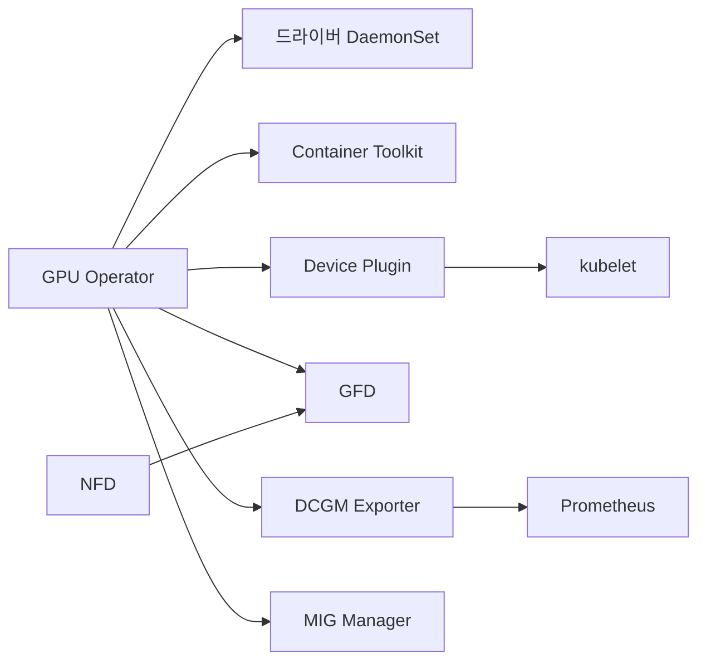
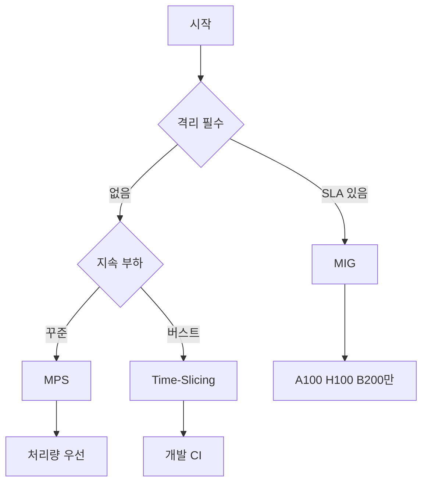
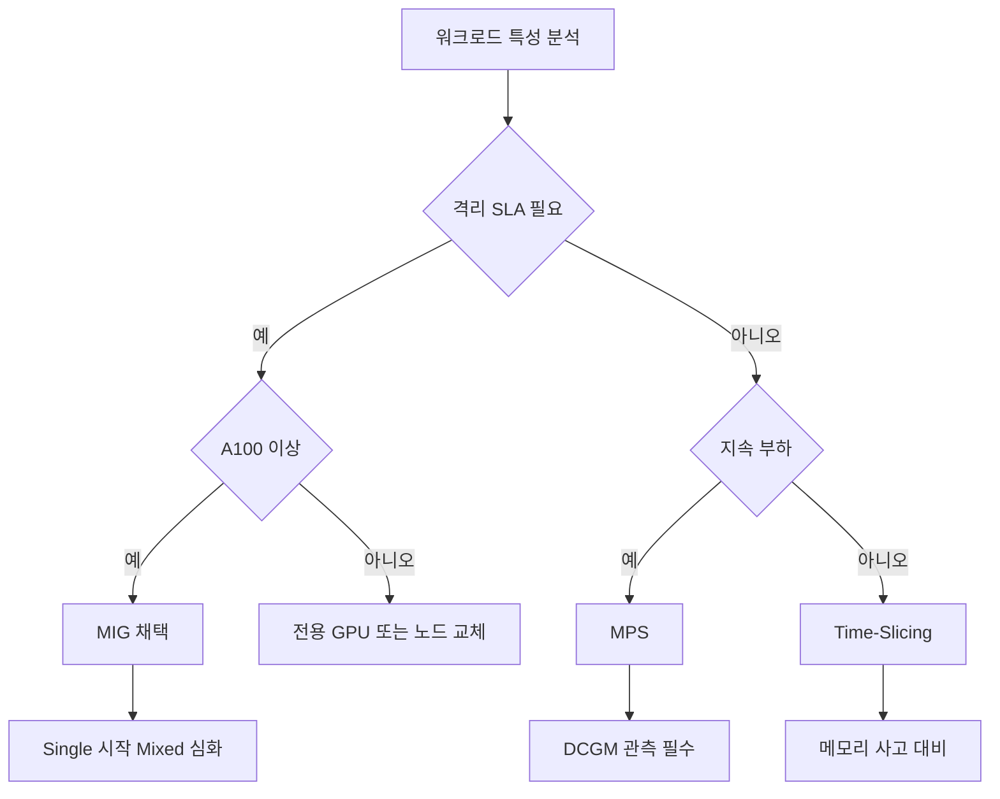

# GPU 스케줄링 — Device Plugin, MIG, Time-Slicing, MPS

> Kubernetes는 GPU를 **정수 카운트 확장 리소스**로 다룬다. 기본 스케줄러는
> 메모리·컴퓨트 점유율을 모른다. 공유·격리·관측은 디바이스 플러그인과
> MIG·Time-Slicing·MPS·DRA의 조합으로 풀어야 한다.

- **NVIDIA Device Plugin** — 노드의 GPU를 `nvidia.com/gpu` 확장 리소스로 광고
- **GPU Operator** — 드라이버·런타임·플러그인·DCGM·MIG Manager를 일괄 오케스트레이션
- **MIG** — 하드웨어 격리, A100·H100·B200 세대에서 SM·L2·메모리 대역까지 물리 분할
- **Time-Slicing** — 컨텍스트 스위칭, 격리 없음, 가장 단순
- **MPS** — 동시 CUDA 컨텍스트, 처리량↑ 격리↓
- **DRA** — 1.34에서 GA, 속성 기반 GPU 선택의 새 표준

선행: [Requests·Limits](../resource-management/requests-limits.md),
[NodeSelector·Affinity](../scheduling/node-selector-affinity.md).
다음 단계: [배치 워크로드 — Kueue·JobSet](./batch-workload.md)에서 GPU 쿼터·큐잉을 다룬다.
AI/ML 분산 학습 상세는 `ai-ml/` 카테고리에서 별도 다룬다.

---

## 1. GPU가 일반 리소스와 다른 점

| 항목 | CPU·Memory | GPU |
|---|---|---|
| 스케줄러 인식 | 기본 리소스, mCPU·MiB 단위 | **확장 리소스**, 정수만 |
| 분할 | 자유 (`cpu: 500m`) | 하드웨어·소프트웨어 트릭 필요 |
| 격리 | cgroup v2 | MIG만 하드웨어, 나머지 협조적 |
| 관측 | cAdvisor·kubelet 기본 | DCGM 별도 필요 |
| 드라이버 | 커널 빌트인 | 사용자 공간 NVIDIA 드라이버·CUDA |

결과: GPU 한 장을 **여러 팟에 나누어 쓰려면** 플러그인이 GPU를 "여러 개로 보이게" 해야 한다. 어떻게 보이게 하느냐가 곧 공유 방식의 차이.

---

## 2. 핵심 컴포넌트 — GPU Operator가 묶어주는 것



| 컴포넌트 | 역할 | 미배포 시 영향 |
|---|---|---|
| NVIDIA 드라이버 | 커널 모듈 + 사용자 공간 라이브러리 | CUDA 호출 불가 |
| Container Toolkit | `nvidia` 런타임, CDI 스펙 생성 | 컨테이너가 GPU 못 봄 |
| Device Plugin | `nvidia.com/gpu` 리소스 광고 | 스케줄링 불가 |
| **GFD** (GPU Feature Discovery) | `nvidia.com/gpu.product=A100-80GB` 등 라벨링 | 제품·메모리 셀렉션 불가 |
| **NFD** (Node Feature Discovery) | PCI·커널·CPU 피처 라벨 | GFD 전제 조건 |
| **DCGM Exporter** | SM 점유율·온도·ECC·전력 메트릭 | 관측·용량 산정 불가 |
| **MIG Manager** | 노드 라벨 보고 MIG 재구성 | MIG 수동 재설정 필요 |

**운영 원칙**: 베어메탈·온프레미스에서 이 스택을 손으로 짜맞추지 않는다.
GPU Operator(Helm 차트)로 한 번에 배포하고, 노드 라벨만 건드려 상태를
바꾸는 방식이 복구·업그레이드 비용을 가장 낮춘다.

**CDI(Container Device Interface)**: 과거 NVIDIA Container Runtime은
OCI hook 방식으로 `/dev/nvidia*`·드라이버 라이브러리를 컨테이너에 주입했다.
CDI는 같은 일을 **런타임 중립적 스펙** (`/etc/cdi/*.yaml`)으로 표현해
containerd·CRI-O·Podman 어디서든 동일한 방식으로 처리한다. `nvidia-ctk cdi
generate`가 스펙을 만들고, kubelet은 CDI 주입을 Device Plugin·DRA 양쪽에서
참조한다. **DRA는 CDI가 활성화되어 있지 않으면 동작하지 않는다**. Device
Plugin의 `DEVICE_LIST_STRATEGY=cdi-annotations` 또는 `cdi-cri` 모드가 여기에
대응.

**선택 배포 라벨**: 드라이버를 사전 설치한 베어메탈 노드에서는
`nvidia.com/gpu.deploy.driver=false`로 GPU Operator 드라이버 DaemonSet을
끌 수 있다. 마찬가지로 `deploy.container-toolkit=false`, `deploy.mig-manager=false` 등 노드별 컴포넌트 선택이 가능. 온프레미스 표준 빌드에서
드라이버 수명 주기를 OS 이미지와 맞추는 팀에 필수 기법.

**보안**: GPU Operator 컴포넌트는 `privileged: true` + 호스트 경로 마운트로 동작한다. `gpu-operator` 네임스페이스는 PSA `privileged` 프로파일로 두되, **워크로드 네임스페이스는 반드시 분리**해 `baseline`/`restricted`를 적용한다.

---

## 3. 버전·상태 (2026-04 기준)

| 라인 | 버전 | 비고 |
|---|---|---|
| GPU Operator | `v26.3.1` | 2026-03 릴리스. 정확한 기본 드라이버/툴킷은 [Platform Support Matrix](https://docs.nvidia.com/datacenter/cloud-native/gpu-operator/latest/platform-support.html) 참조 |
| k8s-device-plugin | `v0.19.0` | Operator 기본; 독립 배포는 `v0.17.x` 계열도 다수 |
| NVIDIA 드라이버 | `580` 이상 | DRA 드라이버 최소 요건 |
| DCGM Exporter | `4.5.2-4.8.x` (DCGM-exporter 태그) | DCGM 버전과 exporter 버전을 하이픈으로 연결한 태그 형식 |
| MIG Manager | `v0.14.0` | 동적 MIG config 자동 생성 (v26.3.0~) |
| DRA | **1.34 GA** | `resource.k8s.io/v1` 기본 활성화 |
| NVIDIA DRA Driver | CNCF 기증 완료 (KubeCon EU 2026) | ComputeDomain·GPU 두 플러그인 |

**EOL 주의**: GPU Operator 23.x, 드라이버 535 이하는 2026년 기준 사실상 지원
종료 수순. 특히 H100·H200·B200은 드라이버 570+ 권장.

---

## 4. 요청 모델 — 파드가 GPU를 받는 방법

기본 경로는 `limits`에 확장 리소스 숫자를 적는 것뿐이다. 요청·리밋이 반드시 같아야 하고, `requests`만 단독으로 쓸 수 없다.

```yaml
apiVersion: v1
kind: Pod
metadata:
  name: cuda-job
spec:
  restartPolicy: Never
  containers:
    - name: trainer
      image: nvcr.io/nvidia/pytorch:24.12-py3
      resources:
        limits:
          nvidia.com/gpu: 1              # 전체 GPU 1장
  tolerations:
    - key: nvidia.com/gpu
      operator: Exists
      effect: NoSchedule
  nodeSelector:
    nvidia.com/gpu.product: NVIDIA-H100-80GB-HBM3
```

**필드 의미**:
- `nvidia.com/gpu: 1` — 공유 비활성화 시 1장 통째 점유
- `tolerations` — GPU 노드는 `nvidia.com/gpu:NoSchedule` 테인트로 보호하는 것이 표준
- `nodeSelector` — GFD가 붙인 `gpu.product`·`gpu.memory`·`gpu.compute.major` 라벨로 세대·용량 고정

**흔한 실수**: `limits.nvidia.com/gpu: 0.5` 같은 소수점은 **불가**. GPU는
정수 리소스다. 분할 공유는 뒤의 MIG/Time-Slicing/MPS 메커니즘으로만
표현된다.

---

## 5. GPU 공유 3대 모드 — 고르는 기준



| 모드 | 격리 | 성능 특성 | 하드웨어 | 대표 용도 |
|---|:-:|---|---|---|
| **MIG** | **하드웨어** (SM·L2·메모리) | 각 인스턴스 결정적 성능 | A100·H100·H200·B200·GB200 | 프로덕션 추론, 멀티테넌시 |
| **Time-Slicing** | **없음** | 컨텍스트 스위치 오버헤드 | 거의 모든 NVIDIA GPU | 개발·노트북·CI |
| **MPS** | **약함** (메모리 공유) | 동시 커널, 처리량↑ | 거의 모든 NVIDIA GPU | 다수의 경량·지속 추론 |

**Time-Slicing과 MPS는 같은 물리 GPU에 동시에 켤 수 없다.** 노드 안에서
`renameByDefault: true`로 리소스 이름을 분리하면 GPU별로 전략을 섞는 구성이
기술적으로 가능하지만 운영 복잡도 대비 이득이 적어 권장하지 않는다. MIG와는
각각 결합 가능 (MIG 슬라이스를 다시 Time-Slice 하거나 MPS로 공유).

---

## 6. MIG — 하드웨어 파티션

MIG는 GPU의 SM·L2 캐시·메모리 컨트롤러·DRAM 대역을 물리적으로 쪼갠다. 한 슬라이스에서 OOM이 나도 옆 슬라이스는 영향을 받지 않는다.

### 6.1 프로파일 명명

`[compute]g.[memory]gb` 형식. A100·H100·H200·B200·GB200은 모두 7 컴퓨트 유닛 + 8 메모리 유닛 설계.

| GPU | 메모리 | 대표 프로파일 |
|---|:-:|---|
| A100-40GB | 40 GB | `1g.5gb`, `1g.5gb+me`, `2g.10gb`, `3g.20gb`, `4g.20gb`, `7g.40gb` |
| A100-80GB | 80 GB | `1g.10gb`, `1g.10gb+me`, `1g.20gb`, `2g.20gb`, `3g.40gb`, `4g.40gb`, `7g.80gb` |
| H100-80GB | 80 GB | `1g.10gb`, `1g.10gb+me`, `1g.20gb`, `2g.20gb`, `3g.40gb`, `4g.40gb`, `7g.80gb` |
| H200-141GB | 141 GB | `1g.18gb`, `2g.35gb`, `3g.71gb`, `7g.141gb` 계열 |
| B200-180GB | 180 GB | 8 메모리 유닛 균등 분할 기반. **정확한 프로파일은 NVIDIA MIG User Guide r580+ 공식 표 확인 후 사용** |

`+me` 접미사(예: `1g.10gb+me`)는 전체 GPU의 미디어 엔진 하나를 해당
인스턴스에 붙인 변형. 비디오 트랜스코딩 파이프라인에서 사용.

### 6.2 단일(single) vs 혼합(mixed) 전략

| 전략 | 특징 | 리소스 이름 |
|---|---|---|
| `single` | 노드의 모든 GPU가 **동일** 프로파일 | `nvidia.com/gpu: 1` (프로파일 라벨로 구분) |
| `mixed` | 한 노드에 **서로 다른** 프로파일 혼재 | `nvidia.com/mig-1g.10gb: 1` 등 프로파일별 리소스 |

`single`은 스케줄링이 단순(기존 `nvidia.com/gpu` 그대로)해서 마이그레이션이
쉽다. `mixed`는 한 노드에서 워크로드 크기 다양성을 감당할 때 유용하지만
스케줄링·쿼터 설계가 복잡해진다. **먼저 `single`로 시작, 정말 필요할 때
`mixed`**가 기본 권장.

### 6.3 MIG Manager로 동적 재구성

GPU Operator의 MIG Manager는 노드 라벨을 보고 MIG 파티션을 재생성한다.

```bash
# A100-80GB 노드를 2g.20gb × 3 + 1g.10gb × 1 로 재편
kubectl label node gpu-worker-03 \
  nvidia.com/mig.config=all-2g.20gb --overwrite

# ConfigMap으로 커스텀 프로파일 선언 후 참조도 가능
kubectl -n gpu-operator get cm default-mig-parted-config -o yaml
```

재구성은 GPU를 **일시적으로 드레인**한다. `nvidia.com/mig.config.state` 라벨이 `success`가 될 때까지 해당 노드에 파드가 스케줄되지 않는다.

**운영 주의**: MIG 모드 전환은 GPU 리셋이 필요하다. PID가 물려있으면 실패하므로 `mig-manager` 로그에서 `failed to set MIG mode` 메시지가 반복되면 드라이버 재로드 또는 노드 재부팅을 검토한다.

---

## 7. Time-Slicing — 가장 단순한 공유

디바이스 플러그인이 물리 GPU 하나를 **N개의 복제 리소스**로 광고한다. 각 복제본은 파드에 할당되어도 실제로는 같은 GPU를 시간 분할로 쓴다.

```yaml
# time-slicing-config.yaml — GPU Operator values.yaml에 주입
version: v1
sharing:
  timeSlicing:
    resources:
      - name: nvidia.com/gpu
        replicas: 4
    renameByDefault: false
    failRequestsGreaterThanOne: true
```

| 옵션 | 의미 |
|---|---|
| `replicas` | 물리 GPU 1장을 몇 개로 보이게 할지 |
| `renameByDefault` | true면 `nvidia.com/gpu.shared`로 리소스 이름 분리 (원본 리소스와 공존) |
| `failRequestsGreaterThanOne` | **Time-Slicing 리소스**를 파드가 `>1`로 요청하면 실패. 복제본이 서로 다른 물리 GPU를 보장하지 않으므로(모두 같은 GPU에 배당될 수 있음) 2장이 필요한 워크로드의 오해 예약을 차단. **프로덕션 권장 true** |

**한계**:
- 메모리 격리 **없음**. 한 파드가 80 GB VRAM 중 70 GB를 먹으면 나머지는 OOM.
- 컨텍스트 스위치 오버헤드. 지연에 민감한 추론에는 부적합.
- CUDA `cudaMalloc` 실패 시 원인이 불명확 — 이웃 파드의 점유 때문인지 구분 어려움.

**권장 용도**: 주피터 노트북 팜, 개발·CI 샌드박스, 배치 학습 시험용.

---

## 8. MPS — 동시 커널 실행

CUDA MPS(Multi-Process Service) 서버가 여러 CUDA 컨텍스트를 하나의 GPU 컨텍스트로 병합한다. Time-Slicing과 달리 커널이 **동시 실행**된다.

```yaml
sharing:
  mps:
    resources:
      - name: nvidia.com/gpu
        replicas: 4
```

| 항목 | Time-Slicing | MPS |
|---|---|---|
| 실행 모델 | 순차 컨텍스트 스위칭 | 병렬 커널 |
| 오버헤드 | 스위치 비용 | 없음에 가까움 |
| 처리량 | 낮음 | 높음 |
| 메모리 격리 | 없음 | **약한 공간 분할** — `memoryLimit`·`activeThreadPercentage`로 파드별 VRAM·SM 비율을 강제 가능 (하드웨어 격리는 아님) |
| 호환성 | 모든 NVIDIA GPU | Volta+ (Tesla V100 이상) |

**상태**: `v0.15.0`부터 공식 지원, `v0.17.x` 이후 프로덕션 사용이 일반화됐다. MPS 데몬은 `nvidia-cuda-mps-control`로 관리되며, **한 클라이언트의 크래시가 같은 MPS 서버에 붙은 다른 클라이언트를 죽일 수 있다**는 점을 반드시 인지하고 사용. SLA가 필요한 추론은 MIG로 가야 안전.

---

## 9. DRA — 1.34 GA, 속성 기반 스케줄링

DRA(Dynamic Resource Allocation)는 GPU를 "정수 카운트"가 아닌 **속성을 가진 리소스**로 다룬다. 드라이버가 `ResourceSlice`로 각 디바이스의 모델·메모리·드라이버 버전·MIG 프로파일을 공시하고, 파드는 `ResourceClaim`에 CEL 표현식으로 조건을 건다.

```yaml
apiVersion: resource.k8s.io/v1
kind: ResourceClaimTemplate
metadata:
  name: h100-80gb-claim
spec:
  spec:
    devices:
      requests:
        - name: gpu
          deviceClassName: gpu.nvidia.com
          selectors:
            - cel:
                expression: |
                  device.attributes["gpu.nvidia.com"].productName == "NVIDIA H100 80GB HBM3"
                  && device.capacity["gpu.nvidia.com"].memory.compareTo(quantity("80Gi")) >= 0
---
apiVersion: v1
kind: Pod
metadata:
  name: llm-inference
spec:
  resourceClaims:
    - name: gpu-claim
      resourceClaimTemplateName: h100-80gb-claim
  containers:
    - name: server
      image: nvcr.io/nvidia/tritonserver:24.12-py3
      resources:
        claims:
          - name: gpu-claim
```

### 9.1 DRA를 쓰는 이유

| 기존 Device Plugin | DRA |
|---|---|
| 리소스명으로만 구분 (`nvidia.com/mig-1g.10gb`) | 속성·용량 기반 CEL 매칭 |
| 파드당 정적 할당 | ResourceClaim 공유 가능·파드 수명 독립 |
| MIG는 관리자가 사전 파티션 | DRA 드라이버가 **요청에 맞춰 동적 파티션** |
| Multi-Node NVLink 표현 불가 | ComputeDomain으로 MNNVL 표현 (GB200·NVL72) |

### 9.2 전환 전략

1. **Kubernetes 1.34+** 클러스터를 먼저 확보. DRA는 1.34에서 기본 활성화.
2. NVIDIA 드라이버 **580 이상**, CDI가 활성화된 containerd·CRI-O.
3. NVIDIA DRA Driver를 GPU Operator로 배포 (`v26.3.x` 이상).
4. 신규 워크로드부터 `ResourceClaim` 사용, 기존 Device Plugin 경로는 병행 유지.

**병행 운영의 충돌 경계**: 한 GPU는 **두 경로에 동시에 광고될 수 없다**.
즉 "이 노드의 GPU는 DRA 전용 / 저 노드의 GPU는 Device Plugin 전용"으로
노드 단위 분리가 현실적이다. 특히 DRA 드라이버는 MIG를 **동적으로**
재파티션하므로, GPU Operator의 `MIG Manager`가 관리 중인 노드와는
반드시 분리. 전환 시 라벨·테인트로 경계를 명확히 한다.

```bash
# DRA 전용 노드
kubectl label node gpu-worker-05 nvidia.com/gpu.deploy.device-plugin=false
kubectl label node gpu-worker-05 nvidia.com/gpu.deploy.mig-manager=false
kubectl label node gpu-worker-05 nvidia.com/gpu.deploy.dra-driver=true
```

KubeCon EU 2026에서 NVIDIA DRA Driver가 **CNCF에 기증**되었다. 이는 향후 커뮤니티 거버넌스로 통합되는 신호이며, 당분간 NVIDIA 레지스트리와 CNCF SIG 양쪽에서 릴리스가 병행된다.

---

## 10. 스케줄링 패턴 — 테인트·어피니티·노드 그룹

### 10.1 GPU 노드 격리

```yaml
# 노드에 테인트: GPU 없는 워크로드 차단
kubectl taint nodes gpu-worker-01 nvidia.com/gpu=true:NoSchedule

# 워크로드는 toleration 필수
tolerations:
  - key: nvidia.com/gpu
    operator: Exists
    effect: NoSchedule
```

### 10.2 세대·용량으로 분기

GFD 라벨을 활용한 어피니티. 장치 세대가 다른 GPU가 혼재할 때 필수.

```yaml
affinity:
  nodeAffinity:
    requiredDuringSchedulingIgnoredDuringExecution:
      nodeSelectorTerms:
        - matchExpressions:
            - key: nvidia.com/gpu.product
              operator: In
              values:
                - NVIDIA-H100-80GB-HBM3
                - NVIDIA-H200-141GB-HBM3e
            - key: nvidia.com/gpu.memory
              operator: Gt
              values: ["70000"]        # 70 GB 이상
```

### 10.3 주요 GFD 라벨

| 라벨 | 예 |
|---|---|
| `nvidia.com/gpu.product` | `NVIDIA-A100-SXM4-80GB` |
| `nvidia.com/gpu.memory` | `81920` (MiB) |
| `nvidia.com/gpu.count` | `8` |
| `nvidia.com/gpu.compute.major` / `.minor` | `9` / `0` (Hopper) |
| `nvidia.com/mig.strategy` | `single` / `mixed` / `none` |
| `nvidia.com/mig.config` | `all-1g.10gb` 등 현재 MIG 구성 |

---

## 11. 관측 — DCGM이 표준

DCGM Exporter는 `nvidia-smi`로는 보이지 않는 수준의 메트릭을 내놓는다. 대시보드·SLO의 1차 데이터 소스.

| 메트릭 | 의미 | 이상 신호 |
|---|---|---|
| `DCGM_FI_DEV_GPU_UTIL` | GPU SM 점유율 (%) | 낮으면 배치 사이즈·인풋 파이프라인 병목 |
| `DCGM_FI_DEV_MEM_COPY_UTIL` | 메모리 대역 사용률 | 지속 90%+면 HBM 병목 |
| `DCGM_FI_DEV_FB_USED` / `_FREE` | Frame Buffer 메모리 | Time-Slicing 환경 OOM 추적 |
| `DCGM_FI_DEV_XID_ERRORS` | 하드웨어 에러 카운트 | 코드별 대응표는 §12 참고 |
| `DCGM_FI_DEV_POWER_USAGE` | 소비 전력 (W) | PSU·쿨링 용량 계획 |
| `DCGM_FI_DEV_GPU_TEMP` | GPU 온도 | 85°C+ 지속 시 쓰로틀 |
| `DCGM_FI_PROF_PIPE_TENSOR_ACTIVE` | Tensor Core 활성률 | LLM 추론에서 `GPU_UTIL` 대체 지표로 더 정확 |
| `DCGM_FI_DEV_NVLINK_BANDWIDTH_TOTAL` | NVLink 누적 대역 | 분산 학습에서 기대값 미달 시 NVLink 미형성 의심 |
| `DCGM_FI_DEV_NVLINK_CRC_FLIT_ERROR_COUNT_TOTAL` | NVLink CRC 에러 | 증가 추세 = 케이블·스위치·브리지 점검 |

**주의**: MIG 환경에서는 메트릭 라벨에 `gpu_instance_id`가 붙는다. 대시보드를 MIG 전에 만든 것이라면 재작성 필요.

**XID 자동 대응**: XID 에러가 특정 임계치를 넘으면 노드를 자동 `cordon` 하는
파이프라인을 Node Problem Detector(NPD) + DCGM 이벤트와 결합해 구성하는 것이
표준. 수동 대응은 대규모 GPU 플릿에서 확장성이 없다.

---

## 12. 트러블슈팅 — 자주 만나는 증상

| 증상 | 원인 후보 | 확인 |
|---|---|---|
| 파드 `Pending`, 이벤트 `0/N nodes are available: nvidia.com/gpu` | 노드 드라이버 로드 실패, 플러그인 미등록 | `kubectl -n gpu-operator get pods`, `nvidia-smi` on 노드 |
| `nvidia-smi`는 보이지만 리소스 0 | Device Plugin 설정 누락, CDI 미활성 | `kubectl describe node` → `Allocatable` 확인 |
| `CUDA error: no CUDA-capable device` | 컨테이너가 라이브러리를 못 봄 | 런타임 클래스 `nvidia`, `NVIDIA_VISIBLE_DEVICES` 체크 |
| Time-Slicing에서 간헐 OOM | 메모리 격리 부재, 피어 파드 폭주 | DCGM `FB_USED` 시계열, 범인 파드 식별 |
| MIG 재구성 실패 | GPU 사용 중, 드라이버 정체 | `mig-manager` 로그, 노드 재부팅 |
| XID 에러 반복 | 코드별 원인 상이 — 아래 표 참조 | DCGM 이벤트 + dmesg |
| H100 대역 기대보다 낮음 | NVLink 미형성, PCIe 폴백 | `nvidia-smi topo -m`, NCCL 테스트 |
| 파드 삭제 후 다음 파드 `CUDA out of memory` | 컨텍스트·메모리 잔류 | `terminationGracePeriodSeconds` 연장, MPS 환경이면 서버 재시작 |

### 12.1 XID 에러 코드 분류

| XID | 분류 | 대응 |
|:-:|---|---|
| 13 / 31 | **소프트웨어** — 애플리케이션 커널 범위 외 접근·명령 실패 | 앱 레벨 디버깅. **RMA 아님** |
| 43 / 45 | 애플리케이션 또는 드라이버 충돌 | 스택 추적, 드라이버 버전 재확인 |
| 48 | **DBE** (Double Bit Error) ECC | 페이지 리타이어가 막으면 RMA 검토 |
| 63 / 64 | ECC 페이지 리타이어 성공 / 실패 | 성공은 운영 지속, **실패 반복은 RMA** |
| 74 | **NVLink 에러** — 링크 끊김·CRC | 브리지·케이블·토폴로지 점검 |
| 79 | **GPU fall off the bus** | PCIe·전원·열, 심하면 하드웨어 교체 |
| 94 / 95 | **Contained ECC** (할당 범위 내에서 격리) | 페이지 리타이어로 운영 지속 가능 |

**원칙**: 재시작으로 증상이 사라져도 XID 로그를 남기고 추세를 본다. "재시작하면 되더라"는 GPU 영역에서 거의 항상 ECC·열·전원·드라이버 버전 불일치의 전조. XID 로그를 DCGM으로 중앙집중해서 패턴을 본다.

### 12.2 GPU 파드의 Graceful Shutdown

- `terminationGracePeriodSeconds`를 **CUDA 컨텍스트 해제·VRAM 반환**에 충분한 값으로 설정. LLM 추론 서버는 수십 초~수 분까지 필요한 경우도 있음.
- `startupProbe`로 드라이버 초기화·모델 로드 완료 후 트래픽 진입. 단순 `readinessProbe`만 두면 초기화 중에 503이 튄다.
- MPS 환경에서는 한 파드의 비정상 종료가 MPS 서버를 오염시킬 수 있으므로, `preStop` 훅에서 조용한 종료를 시도한다.

---

## 13. 의사결정 — 어떤 공유 방식을 쓸 것인가



| 선택 | 언제 |
|---|---|
| **전용 GPU** (`nvidia.com/gpu: 1`) | 학습 대용량·SLA 엄격·디버깅 단순성 |
| **MIG** | 추론 서빙 멀티테넌시, 격리된 성능 예측, 과금 경계 |
| **MPS** | 다수의 지속적인 경량 추론·노트북 클러스터 |
| **Time-Slicing** | 개발·CI·노트북, 이용률 끌어올리기, 돈이 우선 |
| **DRA** | 1.34+ 환경, 동적 MIG·멀티노드 NVLink, 향후 표준 |

---

## 14. 온프레미스 체크리스트

본 위키의 환경(100% 온프레미스·Cilium·Rook-Ceph)에서 운영자가 먼저 점검할 것:

| 항목 | 이유 |
|---|---|
| BIOS에서 **SR-IOV·IOMMU·Above 4G Decoding·Resizable BAR** 활성 | H100·B200 권장, 드라이버 로드 실패 방지 |
| `nouveau` 드라이버 블랙리스트 | NVIDIA 드라이버와 충돌 |
| `cgroup v2` 커널 사용 | 디바이스 cgroup 방식 업데이트 |
| containerd `nvidia` 런타임 + **CDI** 활성 | Device Plugin v0.15+, DRA 전제 |
| GPU 노드 **NTP 동기화** | DCGM 메트릭·XID 타임라인 신뢰성 |
| NVLink 토폴로지 점검 (`nvidia-smi topo -m`) | NCCL All-Reduce 성능, 분산 학습 전제 |
| GPU 노드 **전력·쿨링 설계** | B200 단일 ~1000W, 랙당 용량 재검토 |
| PV는 Rook-Ceph NVMe 풀, 학습 체크포인트는 로컬 NVMe 분리 | 네트워크 I/O와 충돌 회피 |

---

## 15. 핵심 요약

1. **GPU Operator로 스택 일괄 배포**, 손으로 구성요소를 조립하지 않는다.
2. **격리가 SLA를 좌우**한다면 MIG. 없어도 된다면 MPS(지속)·Time-Slicing(버스트).
3. **Time-Slicing의 메모리 비격리**가 대부분의 프로덕션 사고 원인.
4. **DCGM이 관측의 기본**, GPU 영역에서 `nvidia-smi`만으로는 부족하다.
5. **DRA(1.34 GA)** 는 장기 정답. 신규 설계는 DRA 전제로 한다.

---

## 참고 자료

- [NVIDIA GPU Operator — About](https://docs.nvidia.com/datacenter/cloud-native/gpu-operator/latest/index.html) (확인: 2026-04-24)
- [NVIDIA GPU Operator — Release Notes](https://docs.nvidia.com/datacenter/cloud-native/gpu-operator/latest/release-notes.html) (확인: 2026-04-24)
- [NVIDIA GPU Operator — Platform Support (Component Matrix)](https://docs.nvidia.com/datacenter/cloud-native/gpu-operator/latest/platform-support.html) (확인: 2026-04-24)
- [NVIDIA k8s-device-plugin GitHub](https://github.com/NVIDIA/k8s-device-plugin) (확인: 2026-04-24)
- [NVIDIA dcgm-exporter Releases](https://github.com/NVIDIA/dcgm-exporter/releases) (확인: 2026-04-24)
- [Time-Slicing GPUs in Kubernetes](https://docs.nvidia.com/datacenter/cloud-native/gpu-operator/latest/gpu-sharing.html) (확인: 2026-04-24)
- [NVIDIA MIG User Guide](https://docs.nvidia.com/datacenter/tesla/mig-user-guide/index.html) (확인: 2026-04-24)
- [MIG Supported Profiles](https://docs.nvidia.com/datacenter/tesla/mig-user-guide/supported-mig-profiles.html) (확인: 2026-04-24)
- [NVIDIA XID Errors Guide](https://docs.nvidia.com/deploy/xid-errors/index.html) (확인: 2026-04-24)
- [NVIDIA Container Toolkit — CDI Support](https://docs.nvidia.com/datacenter/cloud-native/container-toolkit/latest/cdi-support.html) (확인: 2026-04-24)
- [Kubernetes — Dynamic Resource Allocation](https://kubernetes.io/docs/concepts/scheduling-eviction/dynamic-resource-allocation/) (확인: 2026-04-24)
- [Kubernetes — Schedule GPUs](https://kubernetes.io/docs/tasks/manage-gpus/scheduling-gpus/) (확인: 2026-04-24)
- [NVIDIA DRA Driver for GPUs](https://docs.nvidia.com/datacenter/cloud-native/gpu-operator/latest/dra-intro-install.html) (확인: 2026-04-24)
- [NVIDIA blog — KubeCon EU 2026 DRA 기증](https://blogs.nvidia.com/blog/nvidia-at-kubecon-2026/) (확인: 2026-04-24)
- [Kubernetes Device Plugins](https://kubernetes.io/docs/concepts/extend-kubernetes/compute-storage-net/device-plugins/) (확인: 2026-04-24)
