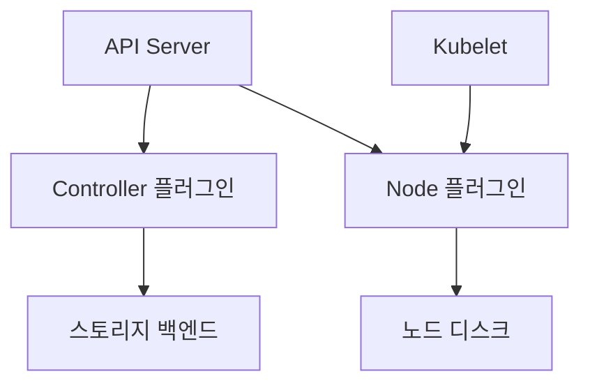

# CSI Driver

CSI(Container Storage Interface)는 **스토리지 벤더와 컨테이너 오케스트레이터
를 분리**하는 표준 gRPC API다. 쿠버네티스·Mesos·Nomad 등이 같은 드라이버를
공유한다.

**CSI Migration** 현황: 주요 클라우드 블록·파일 드라이버(AWS EBS·GCE PD·
Azure Disk·vSphere) in-tree 이관이 v1.25~v1.27에 GA로 완료됐고, v1.31에서
**CephFS in-tree 플러그인이 제거**됐다. 이후 버전에서 잔여 in-tree 플러그인
이 단계적으로 제거되는 흐름이다. **신규 클러스터는 CSI만 고려하면 된다**.

운영 관점 핵심 질문은 다섯 가지다.

1. **Controller와 Node 플러그인이 각각 뭘 하나** — 책임 분리
2. **사이드카가 왜 이렇게 많나** — Kubernetes API 관찰·호출 역할을 분리해
   벤더 코드를 최소화
3. **`CSIDriver` 리소스 설정이 왜 중요한가** — fsGroupPolicy·attachRequired
   등 클러스터 전체 동작을 결정
4. **용량 부족 스케줄 실패는 어떻게 예방하나** — `CSIStorageCapacity`
5. **볼륨 상태 이상은 어떻게 탐지하나** — Volume Health Monitoring

> 관련: [PV·PVC](./pv-pvc.md) · [StorageClass](./storageclass.md)
> · [Volume Snapshot](./volume-snapshot.md) · [분산 스토리지](./distributed-storage.md)

---

## 1. 전체 아키텍처



| 컴포넌트 | 배포 형태 | 역할 |
|---|---|---|
| Controller 플러그인 | Deployment·StatefulSet | 프로비저닝·스냅샷·attach 등 **클러스터 단일 처리** |
| Node 플러그인 | DaemonSet | mount·unmount·stage 등 **노드 단일 처리** |
| 사이드카 | Controller·Node 각 Pod | K8s API 이벤트 → CSI gRPC 변환 |
| 벤더 플러그인 컨테이너 | 위 두 곳 | 실제 백엔드 I/O 구현 (벤더가 작성) |

**통신**: 사이드카 ↔ 벤더 플러그인은 같은 Pod 내 **Unix 도메인 소켓**(emptyDir
볼륨) 공유. Kubelet ↔ Node 플러그인은 HostPath로 노출된 소켓 사용.

---

## 2. Controller 플러그인

클러스터 단일 처리가 필요한 모든 볼륨 관리 오퍼레이션을 담당한다.

| gRPC 호출 | 언제 |
|---|---|
| `CreateVolume` | PVC 생성 → 동적 프로비저닝 |
| `DeleteVolume` | PVC 삭제 (reclaim Delete) |
| `ControllerPublishVolume` | Pod가 볼륨 사용 시작 (attach) |
| `ControllerUnpublishVolume` | Pod 종료 (detach) |
| `CreateSnapshot` / `DeleteSnapshot` | VolumeSnapshot 생성·삭제 |
| `ControllerExpandVolume` | PVC 리사이즈 (컨트롤러 측) |
| `ControllerModifyVolume` | VolumeAttributesClass 전환 (`MODIFY_VOLUME` 능력 필요) |

배포는 대부분 **Deployment + 사이드카 리더 선출**(`--leader-election=true`)
조합이다. 사이드카가 리소스 락으로 HA를 보장하므로 StatefulSet이 필수는 아니
다. 소수 드라이버만 순서·상태 유지를 위해 StatefulSet을 쓴다.

---

## 3. Node 플러그인

각 노드에서 실제 볼륨을 파일 시스템에 노출한다.

| gRPC 호출 | 언제 |
|---|---|
| `NodeStageVolume` | 볼륨을 노드의 글로벌 경로에 **마운트** |
| `NodePublishVolume` | Pod의 볼륨 경로에 **바인드 마운트** |
| `NodeUnpublishVolume` | Pod 종료 시 언마운트 |
| `NodeUnstageVolume` | 노드 글로벌 경로 정리 |
| `NodeExpandVolume` | 파일 시스템 확장 |
| `NodeGetInfo` | 노드 토폴로지 레이블 반환 |
| `NodeGetVolumeStats` | PVC 사용량 메트릭 |

**DaemonSet**으로 모든 노드에 배포, `priv: true`·`hostPID` 권한이 필요한
경우가 많다.

---

## 4. 사이드카 컨테이너

사이드카는 쿠버네티스 API를 관찰하고 적절한 CSI gRPC 호출을 만드는 **공통
로직**이다. kubernetes-csi 커뮤니티가 유지하므로 벤더는 자기 백엔드 로직만
작성하면 된다.

### Controller Plugin 사이드카

| 사이드카 | 감시 리소스 | 호출 | 필요 능력 |
|---|---|---|---|
| `external-provisioner` | PVC | `CreateVolume`·`DeleteVolume` | `CREATE_DELETE_VOLUME` |
| `external-attacher` | VolumeAttachment | `ControllerPublishVolume` | `PUBLISH_UNPUBLISH_VOLUME` |
| `external-resizer` | PVC (size 변경) | `ControllerExpandVolume` | `EXPAND_VOLUME` |
| `external-snapshotter` | VolumeSnapshot | `CreateSnapshot`·`DeleteSnapshot` | `CREATE_DELETE_SNAPSHOT` |
| `external-health-monitor-controller` | PV | `ControllerGetVolume` | `VOLUME_CONDITION` |

### Node Plugin 사이드카

| 사이드카 | 역할 |
|---|---|
| `node-driver-registrar` | Kubelet의 플러그인 레지스트레이션 디렉터리에 소켓 등록 |
| `livenessprobe` | 벤더 플러그인 `Probe` gRPC로 헬스체크 |

### 공통 원칙

- 사이드카는 **같은 Pod 안**에서 벤더 플러그인과 emptyDir 공유
- 사이드카 버전과 Kubernetes 버전의 **skew 정책**은 **사이드카·메이저 버전
  마다 다르다**. 고정된 "N/N-1/N-2" 규칙은 없고, 각 사이드카 릴리스 노트에
  명시된 min/max Kubernetes 버전을 개별 확인해야 한다. 통상 최신 사이드카
  는 K8s 최신 2~3개 마이너를 지원한다
- 사이드카 업그레이드는 보통 **드라이버 배포본(Helm 차트)이 함께** 제공

---

## 5. `CSIDriver` 리소스

CSI 드라이버가 설치될 때 함께 만들어지는 **클러스터 범위** 리소스. 드라이버
의 동작 힌트를 쿠버네티스에 알려준다.

```yaml
apiVersion: storage.k8s.io/v1
kind: CSIDriver
metadata:
  name: rook-ceph.rbd.csi.ceph.com
spec:
  attachRequired: true
  podInfoOnMount: true
  fsGroupPolicy: File
  storageCapacity: false
  requiresRepublish: false
  volumeLifecycleModes:
    - Persistent
  seLinuxMount: false
  tokenRequests: []
```

| 필드 | 설명 | 기본값 |
|---|---|---|
| `attachRequired` | attach/detach 컨트롤 루프 사용 여부 | `true` |
| `podInfoOnMount` | NodePublish 호출에 Pod 정보(이름·UID·SA) 전달 | `false` |
| `fsGroupPolicy` | fsGroup 처리 위임 정책 (아래) | `ReadWriteOnceWithFSType` |
| `storageCapacity` | CSIStorageCapacity 기반 스케줄링 | `false` |
| `requiresRepublish` | 주기적 NodePublish 재호출 (토큰 갱신) | `false` |
| `volumeLifecycleModes` | `Persistent`·`Ephemeral` 허용 | `Persistent`만 |
| `seLinuxMount` | `-o context=` 기반 SELinux 라벨링 | `false` |
| `tokenRequests` | Pod SA 토큰을 NodePublish로 전달 | 비어있음 |

### `fsGroupPolicy` 선택

| 값 | 동작 | 사용 사례 |
|---|---|---|
| `File` | kubelet이 fsGroup 재귀 chown 수행 | 블록 볼륨 (EBS·RBD) |
| `None` | kubelet이 처리하지 않음 | 공유 파일 시스템 (RWX) |
| `ReadWriteOnceWithFSType` | RWO + 파일 시스템이 있으면만 처리 (기본) | 대부분 블록 |

**RWX + `File` 조합은 마운트마다 수십 분 지연**을 만든다. Rook-CephFS·NFS
처럼 공유 파일 시스템은 `None` 권장.

### `podInfoOnMount`·`tokenRequests`

Secrets Store CSI Driver처럼 **Pod 신원이 필요한 드라이버**가 켠다. 활성화
되면 NodePublishVolume 호출에 `csi.storage.k8s.io/pod.name` 등 VolumeContext
가 추가되고, SA 토큰이 포함된다.

### `seLinuxMount` 피처게이트 조건

`-o context=`로 마운트 시 1회 라벨링하면 Pod 시작 시 파일 단위 재귀 relabel
이 사라져 대용량 RWX에서 수 분~수십 분의 지연을 없앤다.

| 버전 | 상태 |
|---|---|
| v1.27 | Beta (RWOP 한정) |
| v1.33 | Beta 범위 확대 (기본 비활성) |
| v1.36 | GA |

v1.33~v1.35 사용 시 `SELinuxMount`·`SELinuxMountReadWriteOncePod`·
`SELinuxChangePolicy` 피처게이트를 **명시적으로 활성**해야 하고, 드라이버의
`CSIDriver.spec.seLinuxMount: true`도 필요하다.

### `volumeLifecycleModes` — Persistent vs Ephemeral

| 모드 | 용도 | 보안 주의 |
|---|---|---|
| `Persistent` | 일반 PVC 기반 볼륨 | 표준 경로 |
| `Ephemeral` | **CSI Inline Volume** (Pod 스펙에 직접 CSI 정의) | RBAC 우회 위험 |

**CSI Inline Volume은 NodePublish만 호출**되어 Pod 작성자가 드라이버 파라
미터를 **직접 지정**할 수 있다. Secrets Store CSI, image volume 등 **설계
상 Inline이 필수인 드라이버**만 활성화하고, 일반 스토리지 드라이버는 비활
성 유지가 원칙.

> Generic Ephemeral Volume(PVC 기반, `spec.volumes[].ephemeral`)과는 **다른
> 개념**. Generic Ephemeral은 PVC를 자동 생성하는 편의 기능이고 RBAC가 정상
> 적용된다. 상세는 [PV·PVC](./pv-pvc.md#pvc-핵심-필드)의 Generic Ephemeral
> Volume 참고.

---

## 6. `CSINode` 리소스

각 노드에서 사용 가능한 CSI 드라이버 목록과 그 노드의 토폴로지를 기록한다.

```yaml
apiVersion: storage.k8s.io/v1
kind: CSINode
metadata:
  name: worker-01
spec:
  drivers:
    - name: rook-ceph.rbd.csi.ceph.com
      nodeID: worker-01
      topologyKeys:
        - topology.kubernetes.io/zone
```

- `node-driver-registrar`가 생성·관리
- 스케줄러가 토폴로지 제약을 평가할 때 참조
- 드라이버 제거 후에도 CSINode 엔트리가 남아 있을 수 있음 → 수동 정리 필요

---

## 7. `VolumeAttachment` — attach 상태

external-attacher가 감시하는 **attach 상태를 표현하는 API 오브젝트**. Pod가
볼륨을 쓰기 시작하면 VolumeAttachment가 만들어지고, Pod가 종료되면 삭제된다.

```bash
kubectl get volumeattachment
```

### 운영 시 자주 마주치는 이슈

| 증상 | 원인 |
|---|---|
| Pod 종료 후 VolumeAttachment 잔존 (좀비) | 노드 장애·CSI 컨트롤러 오류. 수동 정리 필요 |
| 새 Pod가 `Multi-Attach error` | 이전 노드의 detach 미완료. 노드 복구 또는 6분 force-detach 대기 |
| Detach 수분 지연 | 백엔드 응답 지연, csi-attacher 로그 확인 |

좀비 VolumeAttachment 정리:

```bash
kubectl patch volumeattachment <name> \
  -p '{"metadata":{"finalizers":null}}' --type=merge
```

> **주의**: PV/백엔드가 실제로 detach된 것을 확인한 후에 강제 제거한다.

---

## 8. Node Volume Limits — 노드당 attach 한계

대부분의 백엔드는 **노드당 붙일 수 있는 볼륨 수**에 제약이 있다. 이 한계가
스케줄링 실패의 빈번한 원인이다.

| 백엔드 | 노드당 한계 (일반적) |
|---|---|
| AWS EBS (M5/C5/R5) | 25 |
| AWS EBS (기타 인스턴스) | 최대 39 |
| GCE PD | 최대 127 |
| Azure Disk | VM SKU별 4~64 |
| Rook-Ceph RBD | 수백 (커널 블록 디바이스 한계) |

한계는 `CSINode.spec.drivers[].allocatable.count`에 기록되고, **스케줄러**
가 Pod 배치 시 참조한다. 초과 시 `0/N nodes are available: ...exceed max
volume count`.

### `MutableCSINodeAllocatableCount` (v1.33 alpha → v1.34 beta)

과거에는 값이 **노드 부팅 시 1회 결정**되고 고정이었다. 인스턴스 타입 변경·
Nitro 업그레이드로 실제 한계가 바뀌어도 반영 안 됐다.

v1.33부터 드라이버가 **런타임에 업데이트**할 수 있게 돼, 인스턴스 크기 변경
후 재스케줄링이 정확해진다.

### 확인과 대응

```bash
kubectl get csinode <node> -o yaml | \
  yq '.spec.drivers[] | {name, allocatable: .allocatable.count}'
```

| 증상 | 대응 |
|---|---|
| 특정 노드에만 Pod가 몰림 | Topology Spread·PodAntiAffinity로 분산 |
| 한계 자주 초과 | 노드 인스턴스 업그레이드, 또는 노드 수 확장 |
| Generic Ephemeral도 한계 차감 | 임시 볼륨이 슬롯을 먹는 점 유의 |

---

## 9. `CSIStorageCapacity` — 용량 인식 스케줄링 (v1.24 GA)

CSI 드라이버가 **남은 용량**을 Kubernetes에 보고하면, 스케줄러가 용량 부족
한 토폴로지에는 Pod를 배치하지 않는다.

```yaml
apiVersion: storage.k8s.io/v1
kind: CSIStorageCapacity
metadata:
  name: csisc-zone-a
  namespace: csi-driver
storageClassName: fast-local
capacity: 500Gi
maximumVolumeSize: 100Gi
nodeTopology:
  matchLabels:
    topology.kubernetes.io/zone: zone-a
```

### 활성화 조건

1. `CSIDriver.spec.storageCapacity: true`
2. Helm 차트 등에서 `--enable-capacity`로 external-provisioner 설정
3. 드라이버가 `GetCapacity` gRPC 구현

### 언제 가치가 큰가

- **Local PV·분산 스토리지의 용량 편차**가 심한 환경
- 클라우드 디스크처럼 사실상 무한한 백엔드에는 의미가 작다
- Rook-Ceph의 경우 OSD 편차 관리에 유용

---

## 10. Volume Health Monitoring (alpha)

CSI 드라이버가 **비정상 볼륨 상태**(백엔드 장애·용량 임박·I/O 에러)를 감지
해 PVC/Pod 이벤트로 보고한다. **2026-04 기준 alpha** — 프로덕션은 신중히.

### 두 컴포넌트

| 컴포넌트 | 위치 | 감지 대상 |
|---|---|---|
| `external-health-monitor-controller` | Controller 사이드카 | 백엔드 측 비정상 (볼륨 삭제·연결 끊김) |
| kubelet (`CSIVolumeHealth` 피처게이트) | 노드 | 노드 측 비정상 (마운트 해제, 파일 시스템 오류) |

과거 사이드카 `external-health-monitor-agent`(노드 측)는 **kubelet 내장으
로 통합**되어 deprecate되는 흐름이다.

### 이벤트 예시

```
Warning  VolumeConditionAbnormal  ...  Volume is not healthy:
  backend reports read-only due to ceph-osd full
```

Prometheus에서 이 이벤트와 `kube_persistentvolume_status_phase`를 조합해 알
림을 구성한다.

---

## 11. 주요 CSI 드라이버 매트릭스

드라이버별 **지원 능력(capability)** 관점. SC 샘플과 파라미터는
[StorageClass](./storageclass.md#8-주요-csi-드라이버별-storageclass) 참고.

| 드라이버 | 스냅샷 | 클론 | 리사이즈 | RWX | 암호화 | 용량 추적 |
|---|:-:|:-:|:-:|:-:|:-:|:-:|
| `rook-ceph.rbd.csi.ceph.com` | ✓ | ✓ | ✓ | ✗ | ✓ (LUKS) | ✓ |
| `rook-ceph.cephfs.csi.ceph.com` | ✓ | ✓ | ✓ | ✓ | ✗ | ✓ |
| `driver.longhorn.io` | ✓ | ✓ | ✓ | 제한적 | ✓ | ✓ |
| `ebs.csi.aws.com` | ✓ | ✓ | ✓ | ✗ | ✓ (KMS) | ✗ |
| `pd.csi.storage.gke.io` | ✓ | ✓ | ✓ | ✗ | ✓ | ✗ |
| `disk.csi.azure.com` | ✓ | ✓ | ✓ | ✗ | ✓ | ✗ |
| `efs.csi.aws.com` | ✗ | ✗ | ✗ | ✓ | ✓ (in-transit) | ✗ |
| `file.csi.azure.com` | ✗ | ✗ | ✓ | ✓ | ✓ | ✗ |
| `local.csi.openebs.io` | LVM 기반 | ✓ | ✓ | ✗ | ✗ | ✓ |
| `topolvm.cybozu.com` | ✓ | ✓ | ✓ | ✗ | ✗ | ✓ |
| `secrets-store.csi.x-k8s.io` | — | — | — | — | — | Secret 주입 전용 |

---

## 12. 설치와 업그레이드

### 설치

대부분의 드라이버는 **Helm 차트** 또는 **Operator**(Rook 등)로 제공된다.

```bash
# Rook-Ceph 예시
helm install rook-ceph rook-release/rook-ceph \
  -n rook-ceph --create-namespace

# AWS EBS CSI Driver
helm install aws-ebs-csi-driver aws-ebs-csi-driver/aws-ebs-csi-driver \
  -n kube-system
```

설치 후 생성되는 것:

- `CSIDriver` 리소스
- Controller Deployment/StatefulSet + 사이드카
- Node DaemonSet + 사이드카
- `StorageClass` (기본 SC)
- RBAC: ClusterRole·ClusterRoleBinding·ServiceAccount
- `VolumeSnapshotClass`

### 업그레이드

| 대상 | 주의 |
|---|---|
| 벤더 플러그인 | 드라이버 릴리스 노트 확인, Node DaemonSet 순차 업데이트 |
| 사이드카 | **K8s 버전 skew 범위** 준수 (대부분 N±2) |
| `CSIDriver` 리소스 | 차트가 갱신, 수동 수정한 필드는 덮어씀 주의 |

**업그레이드 순서 원칙**: Controller 먼저, Node는 점진 (`maxUnavailable`).
Node 재시작 동안 **진행 중인 mount/unmount는 중단**될 수 있다.

---

## 13. 관측·모니터링

| 지표 | 컴포넌트 | 의미 | 경보 예시 |
|---|---|---|---|
| `csi_operations_seconds` | 사이드카 | CSI RPC 지연 | p99 > 5초 |
| `csi_sidecar_operations_seconds` | 사이드카 | 사이드카별 오퍼레이션 | 실패율 > 5% |
| `kubelet_volume_stats_*` | kubelet | 볼륨별 용량·inode | 사용률 > 0.8 |
| `storage_operation_duration_seconds` | controller-manager | 프로비저닝·attach 지연 | p99 > 30초 |
| `volume_manager_total_volumes` | kubelet | 노드당 마운트 수 | allocatable의 0.8 |

예시 PromQL:

```promql
# 사이드카 실패율 > 5% (5분 윈도우)
sum(rate(csi_sidecar_operations_seconds_count{grpc_status_code!="OK"}[5m]))
  by (driver_name)
/ sum(rate(csi_sidecar_operations_seconds_count[5m])) by (driver_name) > 0.05
```

기본 대시보드:
- Controller Pod 재시작 횟수
- 각 사이드카의 에러율·지연
- `CSIStorageCapacity`의 남은 용량
- Volume Health 이벤트 카운트
- VolumeAttachment 좀비 수

---

## 14. 보안 — CSI는 공급망 경로다

Node Plugin은 구조상 `privileged: true`·`hostPath`·`hostPID` 권한을 요구한
다. **드라이버 이미지가 손상되면 곧 클러스터 탈취로 이어진다**.

| 위협 | 대응 |
|---|---|
| 벤더 이미지 신뢰성 | cosign·Sigstore 서명 검증, 공식 OCI 레지스트리만 허용 |
| CSI Inline Volume 악용 | 특수 용도(Secrets Store 등) 외 `Ephemeral` 비활성 |
| NodePlugin 권한 남용 | ImagePolicyWebhook·Kyverno로 이미지 허용 목록 |
| CSIDriver 수정 권한 | `CSIDriver` RBAC를 Platform 팀으로 제한 |

**Pod Security Admission**: Node Plugin 네임스페이스는 `privileged` 프로파
일이 필요하다. 전용 네임스페이스로 분리하고, 애플리케이션 네임스페이스는
`restricted` 유지.

CIS Kubernetes Benchmark와 NSA/CISA Kubernetes Hardening Guide가 공통으로
다루는 영역이다.

---

## 15. 트러블슈팅

### Pod의 볼륨 마운트가 안 됨

```bash
kubectl describe pod <pod>       # 이벤트 메시지 확인
kubectl logs -n <csi-ns> <node-pod-on-that-node> -c csi-driver
kubectl logs -n <csi-ns> <node-pod> -c node-driver-registrar
```

| 메시지 | 원인 | 해결 |
|---|---|---|
| `failed to stage volume` | 백엔드 접근 실패 | 네트워크·권한·백엔드 상태 |
| `MountVolume.SetUp failed` | 파일 시스템·권한 | 로그에서 mount 에러 확인 |
| `driver not found` | CSINode에 드라이버 없음 | node-driver-registrar 로그 |

### Controller가 새 PVC 처리 안 함

```bash
kubectl logs -n <csi-ns> deploy/csi-provisioner -c csi-provisioner
```

흔한 원인:
- 리더 선출 실패 (같은 네임스페이스에 중복 배포)
- 백엔드 인증 실패 (Secret 경로 확인)
- 사이드카와 벤더 플러그인 버전 skew

### 기존 PVC의 리사이즈 멈춤

```bash
kubectl get pvc <name> -o yaml | yq .status.conditions
```

`ControllerResizeError` 또는 `NodeResizeError` 확인. 상세는
[PV·PVC](./pv-pvc.md#실패-복구-v134-ga) 참고.

### Node Plugin 재시작 후 마운트 유실

node-driver-registrar가 CSINode를 재등록해야 한다. 등록 지연 시 새 Pod가
`driver not found`로 실패. `livenessprobe` 컨테이너가 프로브를 늦게 반환하
면 ready 상태가 늦어진다.

### 온프레미스·Rook-Ceph 체크리스트

| 상황 | 확인 |
|---|---|
| CSI Pod CrashLoopBackOff | `ceph -s`로 Ceph 자체 상태 먼저 |
| Provisioner Pending | `kubectl logs -n rook-ceph deploy/csi-rbdplugin-provisioner` |
| Node Plugin mount 실패 | `kubectl logs -n rook-ceph ds/csi-rbdplugin -c csi-rbdplugin` |
| MDS 장애로 CephFS 마운트 불가 | `ceph mds stat`, MDS failover 대기 |
| OSD full 경고 | `ceph osd df`, 재분산·노드 추가 |

---

## 16. 안티패턴

- **Controller를 단일 replica로 무제한 운영** — 리더 HA가 필요한 경우는
  replica 2+로 하고 `leader-election-namespace` 명시.
- **사이드카 이미지 태그를 `latest`로** — skew 버그 재현 어려움. 릴리스
  고정.
- **`CSIDriver` 리소스를 수동 수정** — Helm 업그레이드 시 덮어씀. 차트
  values를 쓴다.
- **`fsGroupPolicy: File`로 대용량 RWX** — chown 재귀로 수 분~수십 분 지연.
- **DaemonSet에 `rollingUpdate.maxUnavailable: 100%`** — 모든 노드가 동시
  재시작되며 마운트 중인 Pod가 실패한다.
- **여러 네임스페이스에 동일 드라이버 중복 배포** — 리더 선출이 엉켜 프로
  비저닝 레이스 컨디션 발생.
- **`securityContext.privileged: true` 없이 Node Plugin 실행** —
  bind mount·device open 실패.
- **CSI Inline Volume(`volumeLifecycleModes: Ephemeral`)을 일반 스토리지
  드라이버에 활성화** — RBAC 우회 위협. Secrets Store CSI 등 설계상 필요한
  드라이버만 활성.
- **`MutableCSINodeAllocatableCount` 미고려로 인스턴스 크기만 변경** —
  한계값이 고정된 클러스터에서 실제 attach 여력 반영 안 됨.

---

## 참고 자료

- [Kubernetes CSI Docs: Introduction](https://kubernetes-csi.github.io/docs/) (확인: 2026-04-23)
- [Kubernetes CSI Docs: Sidecar Containers](https://kubernetes-csi.github.io/docs/sidecar-containers.html)
- [Kubernetes CSI Docs: CSIDriver Object](https://kubernetes-csi.github.io/docs/csi-driver-object.html)
- [Kubernetes CSI Docs: Deploying](https://kubernetes-csi.github.io/docs/deploying.html)
- [Kubernetes CSI Docs: Storage Capacity Tracking](https://kubernetes-csi.github.io/docs/storage-capacity-tracking.html)
- [Kubernetes CSI Docs: Volume Health Monitor](https://kubernetes-csi.github.io/docs/volume-health-monitor.html)
- [Kubernetes Docs: CSIDriver API](https://kubernetes.io/docs/reference/kubernetes-api/config-and-storage-resources/csi-driver-v1/)
- [Kubernetes Docs: Volume Health Monitoring](https://kubernetes.io/docs/concepts/storage/volume-health-monitoring/)
- [Kubernetes Blog: Container Storage Interface GA (v1.13)](https://kubernetes.io/blog/2019/01/15/container-storage-interface-ga/)
- [Kubernetes Blog: v1.24 Storage Capacity Tracking GA](https://kubernetes.io/blog/2022/05/06/storage-capacity-ga/)
- [Kubernetes Blog: v1.27 Efficient SELinux Volume Relabeling (Beta)](https://kubernetes.io/blog/2023/04/18/kubernetes-1-27-efficient-selinux-relabeling-beta/)
- [Kubernetes Blog: v1.33 Mutable CSI Node Allocatable Count (alpha)](https://kubernetes.io/blog/2025/05/02/kubernetes-1-33-mutable-csi-node-allocatable-count/)
- [Kubernetes Blog: v1.34 Mutable CSI Node Allocatable Graduates to Beta](https://kubernetes.io/blog/2025/09/11/kubernetes-v1-34-mutable-csi-node-allocatable-count/)
- [Kubernetes Docs: Node-specific Volume Limits](https://kubernetes.io/docs/concepts/storage/storage-limits/)
- [KEP-596: CSI Inline Volumes](https://github.com/kubernetes/enhancements/blob/master/keps/sig-storage/596-csi-inline-volumes/README.md)
- [KEP-1710: SELinux Relabeling](https://github.com/kubernetes/enhancements/blob/master/keps/sig-storage/1710-selinux-relabeling/README.md)
- [Kubernetes CSI Docs: Project Policies](https://kubernetes-csi.github.io/docs/project-policies.html)
- [CSI Spec (GitHub)](https://github.com/container-storage-interface/spec)
