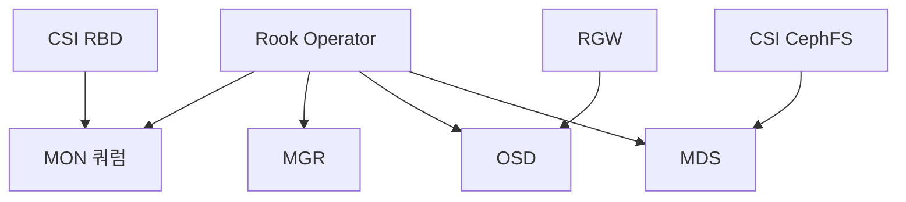
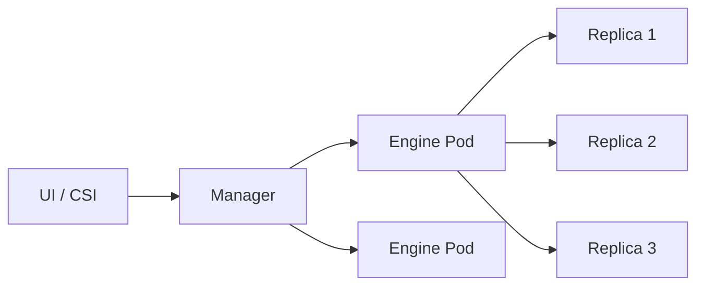
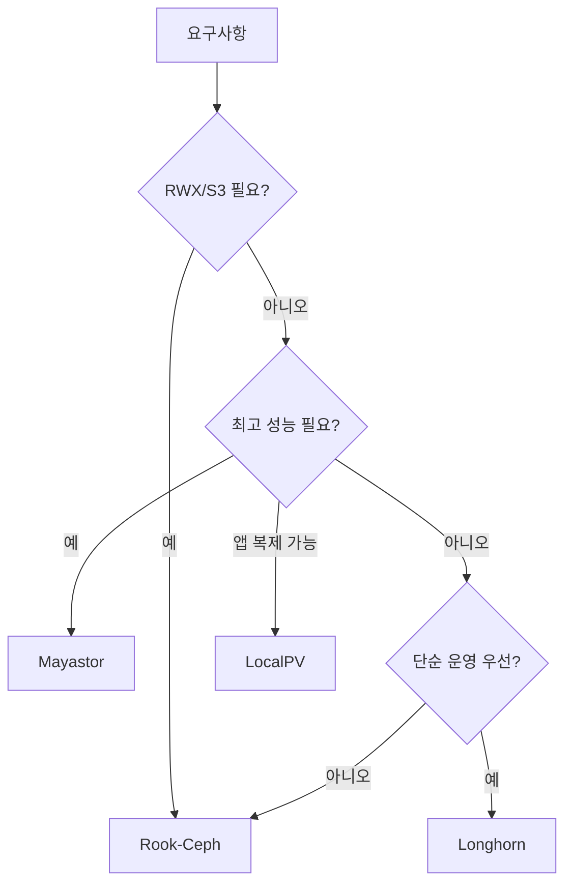

# 분산 스토리지

**분산 스토리지**는 여러 노드의 로컬 디스크를 하나의 공유 볼륨으로 묶어주는
계층이다. 쿠버네티스가 노드 장애·파드 재스케줄링을 허용하려면, 데이터가
**어느 노드에서든 접근 가능**해야 한다. 클라우드는 EBS·PD가 이 역할을
대신하지만, **온프레미스는 분산 스토리지가 사실상 필수**.

CNCF 생태계에서 **가장 많이 쓰이는** 실무 옵션은 세 가지다. 아래 "타 선택
지"도 환경에 따라 유효하다.

| 솔루션 | 상태 | 핵심 성격 |
|---|---|---|
| **Rook-Ceph** | CNCF Graduated (2020) | 엔터프라이즈급. 블록·파일·오브젝트 동시 제공 |
| **Longhorn** | CNCF Incubating | 단순성. 블록만, "그냥 돌아간다" |
| **OpenEBS** | CNCF Sandbox (2024 Archived → 재수용) | Mayastor·LocalPV 2축으로 재편 |

### 타 선택지

| 솔루션 | 특징 |
|---|---|
| **Piraeus Datastore** (DRBD/LINSTOR) | CNCF Sandbox. 동기 복제 RPO=0, 소규모·지연 민감에 강함 |
| **Portworx (PX-Store)** | Pure Storage 상용. 엔터프라이즈 표준의 하나 |
| **CubeFS** | CNCF Graduated (2025). 대규모 파일 시스템 |
| **MinIO DirectPV** | 오브젝트 스토리지 전용 |

운영 관점 핵심 질문은 다섯 가지다.

1. **얼마나 복잡한가** — Rook-Ceph는 Ceph 운영자 역량을 요구, Longhorn은
   하루 만에 시작
2. **성능 얼마나 나오나** — OpenEBS Mayastor > Rook-Ceph > Longhorn (2026
   벤치마크 기준)
3. **RWX(공유 파일 시스템)가 필요한가** — CephFS·NFS CSI가 선택지
4. **블록만 충분한가** — Longhorn·Mayastor로 단순 구성
5. **백업·DR은 어떻게 하나** — 백엔드별 기본 기능 + Velero·Kasten

> 관련: [PV·PVC](./pv-pvc.md) · [StorageClass](./storageclass.md)
> · [CSI Driver](./csi-driver.md) · [Volume Snapshot](./volume-snapshot.md)

---

## 1. 왜 분산 스토리지인가

### 쿠버네티스와 스토리지의 미스매치

| 상황 | 노드 로컬 스토리지 | 분산 스토리지 |
|---|---|---|
| 파드 재스케줄 | 데이터 유실 | 다른 노드에서 동일 데이터 |
| 노드 장애 | 해당 노드 파드 영구 다운 | 복제본으로 자동 복구 |
| 확장성 | 노드 디스크 한계 | 노드 추가로 용량·성능 확장 |
| RWX 요구 | 불가 | 파일 시스템 계층(CephFS·NFS) |

### 온프레미스의 현실

- 워커 노드의 로컬 NVMe/SSD를 **풀링**해 하나의 스토리지로
- 특정 노드 장애 시 **복제본(replica)**으로 서비스 지속
- 클라우드 네이티브 워크로드가 기대하는 **영속적 볼륨** 모델 충족

---

## 2. 솔루션 개요

### Rook-Ceph

Ceph를 쿠버네티스 오퍼레이터로 감싼 프로젝트. 블록(RBD)·파일(CephFS)·오브
젝트(RGW) 세 가지 프로토콜을 **하나의 스토리지 클러스터**에서 제공한다.

- **CNCF Graduated (2020)**
- Rook v1.19 기준 Kubernetes v1.30~v1.35, Ceph v19.2+ (Squid) 지원
- 복제본 3개·Erasure Coding 지원
- 대용량(수 PB)에서도 선형 확장

### Longhorn

Rancher(SUSE)가 만든 **블록 전용** 분산 스토리지. 목표는 단순성.

- **CNCF Incubating**
- Longhorn v1.11 기준
- 볼륨마다 독립 Engine 파드 → 장애 격리 좋음
- 내장 백업(S3·NFS), 스냅샷, DR 볼륨
- RWX는 **NFSv4 기반 제한적 지원**

### OpenEBS

"Container Attached Storage(CAS)" 철학. 2024년 CNCF Archived → Sandbox 재
수용이라는 비정상 경로를 거쳤고, v4부터 **Local PV + Replicated PV
(Mayastor) 2축**으로 재편됐다. 레거시 엔진(cStor·Jiva·Device-LocalPV·
NDM 등)은 `openebs-archive` 조직으로 이동.

- **CNCF Sandbox (2024 재수용)**, 현행 v4.x
- **OpenEBS Replicated PV Mayastor** (구 Mayastor): NVMe-oF 기반 복제
- **OpenEBS Local PV**: HostPath / LVM / ZFS 3종으로 통합
- **cStor · Jiva**: openebs-archive로 이동, **신규 도입 금지**

> **노드 준비사항**: Mayastor는 **HugePages 2MiB × 2048개 이상**,
> **nvme-tcp 커널 모듈**, 권장 `isolcpus` 설정이 필요하다. 컨테이너로 배포
> 되지만 호스트 커널·메모리 튜닝 요구가 결코 가볍지 않다.

---

## 3. Rook-Ceph 아키텍처



| 컴포넌트 | 역할 | 권장 개수 |
|---|---|---|
| MON | 클러스터 맵 관리, Paxos 쿼럼 | 3 또는 5 (**홀수**) |
| MGR | 모니터링·플러그인 | 2 (active + standby) |
| OSD | 실제 데이터 저장 (노드 디스크마다 1개) | 노드 수 × 디스크 수 |
| MDS | CephFS 메타데이터 | 최소 2 (active + standby) |
| RGW | S3·Swift API 게이트웨이 | 필요 시 |

### 복제 vs Erasure Coding

| 방식 | 오버헤드 | 성능 | 사용처 |
|---|---|---|---|
| Replica 3 | 3x (용량 1/3) | 최고 | 기본 권장 |
| Replica 2 | 2x | 좋음 | 비중요 데이터 (OSD 2개 동시 장애 취약) |
| EC 4+2 | 1.5x | 쓰기 느림 | 대용량 아카이브 |
| EC 8+3 | 1.375x | 쓰기 매우 느림 | 콜드 스토리지 |

### 풀(Pool)·CRUSH

- **Pool**: 논리적 데이터 그룹 (PVC 단위가 아닌 **풀 단위 정책**)
- **CRUSH 룰**: 복제본을 노드·rack·row 수준으로 분산 배치
- 프로덕션은 **failure domain을 rack 또는 host**로

### MON 쿼럼·split-brain

MON 5개를 **2개 rack에 2:3으로 배치**하면, rack 연결 끊김 시 2 MON 쪽은
쿼럼을 잃어 서비스 중단. **3개 rack에 2:2:1** 분산이면 한 rack 전체 상실
에도 쿼럼 유지 가능.

| 배치 | 1 rack 손실 시 |
|---|---|
| MON 3, 3 rack에 1:1:1 | 쿼럼 유지 |
| MON 5, 2 rack에 2:3 | **2 쪽 손실이면 쿼럼 붕괴** |
| MON 5, 3 rack에 2:2:1 | 어느 rack 손실에도 쿼럼 유지 |

노드 3개 미만·rack 2개 이하 환경에서는 **물리 redundancy를 먼저** 고민한
다. 물리가 부족하면 분산 스토리지 자체가 위험.

### 대표 자원 수요 (노드당)

| 리소스 | HDD OSD | NVMe OSD |
|---|---|---|
| CPU | OSD당 1~2코어 | OSD당 **2~4코어** |
| Memory (`osd_memory_target`) | 4GiB | **6~8GiB** |
| Network | 10GbE | **25~100GbE** |
| NIC 분리 | 권장 | 3~5노드 소규모면 본딩이 더 효율적 |

NVMe 환경에서 기본값만 쓰면 **CPU 병목**이 먼저 온다. `osd_memory_target`
을 올리고, OSD Pod의 CPU limits를 충분히 배정한다.

---

## 4. Longhorn 아키텍처



### 핵심 특징

- 각 볼륨마다 **독립 Engine Pod** → 장애 격리
- Replica는 기본 3개, 노드별 분산 자동
- **V2 Data Engine (SPDK)** 옵션: NVMe 직접 접근, 성능 대폭 향상
- 내장 S3/NFS 백업, Recurring Job으로 자동화
- Disaster Recovery Volume: 표준 볼륨의 실시간 미러

### 데이터 로컬리티

Longhorn은 **워크로드가 있는 노드에 primary replica를 두려는** 스케줄러 옵
션이 있다. 로컬 디스크 지연을 최대한 활용.

### 제약

- RWX는 **NFSv4 공유 서버**(Longhorn이 제공) 방식 → SPOF·성능 제한
- Ceph처럼 파일·오브젝트 통합 제공 못 함
- 복제 중 노드 장애 시 리빌드 시간이 Ceph보다 길 수 있음

---

## 5. OpenEBS — 엔진별 선택

### Replicated PV Mayastor (권장·Default)

- NVMe-over-TCP 기반, 사용자 공간 IO 스택 (SPDK)
- **최고 성능**: 저지연 NVMe SSD 환경에서 Ceph 이상
- 복제본은 노드 간 NVMe-oF로 전달
- **노드 요구사항**: HugePages 2MiB × 2048+, `nvme_tcp` 커널 모듈, 권장
  `isolcpus` 및 CPU affinity. "컨테이너로 배포"되지만 **호스트 준비는 OS
  레벨 작업**

### LocalPV (LVM·ZFS·Hostpath)

- **복제 없음**. 단일 노드 로컬 디스크 → 노드 장애 = 데이터 손실
- 지연이 가장 낮다 (로컬 디스크 직접)
- 용도: **앱 레벨에서 복제**하는 DB(Kafka·Cassandra·CockroachDB)
- TopoLVM도 유사 스펙트럼

### cStor / Jiva (권장 X)

cStor는 ZFS 기반 복제, Jiva는 경량 블록. 둘 다 **EOL 진행 중**. 신규
클러스터는 Mayastor 또는 LocalPV로.

### 엔진 선택 가이드

| 요구 | 엔진 |
|---|---|
| 최고 IOPS, NVMe | Replicated PV Mayastor |
| 단일 노드, 앱 레벨 복제 | Local PV (LVM·ZFS·HostPath) |
| 다중 엔진 혼재 | **안티패턴** — 하나로 표준화 |

### Longhorn V2 도 동일한 요구사항

Longhorn **V2 Data Engine(SPDK)**도 Mayastor와 같은 **HugePages·uio_pci_
generic·DPDK 드라이버 바인딩**이 필요하다. "커널 모듈 없이 돈다"는 표현에
속지 말 것 — V2 성능을 얻으려면 노드 준비가 동등하게 필요하다.

---

## 6. 성능·기능 비교

### 대략적 벤치마크 (2026, 동일 하드웨어 기준)

| 솔루션 | 랜덤 4K IOPS | 순차 RW(MB/s) | p99 지연 | CPU 비용 |
|---|---|---|---|---|
| Mayastor | ~28k | ~720 | 낮음 | 낮음 |
| Rook-Ceph (Replica 3) | ~32k | ~890 | 중간 | 높음 |
| Longhorn (V1) | ~19k | ~610 | 간헐 스파이크 | 중간 |
| Longhorn (V2, SPDK) | Mayastor 근사 | 높음 | 낮음 | 낮음 |
| OpenEBS LocalPV | 로컬 디스크 한계 | 로컬 디스크 한계 | 가장 낮음 | 매우 낮음 |

※ 워크로드·하드웨어에 따라 순위 변동. **자기 환경에서 직접 측정**이 원칙.

### 왜 이런 수치가 나오나 — 쓰기 증폭

| 솔루션 | 1회 쓰기당 실제 디스크 쓰기 |
|---|---|
| Rook-Ceph (Replica 3) | WAL + DB + 데이터 × 3복제 = **4~6회** |
| Longhorn (Replica 3) | 3복제 네트워크 fanout |
| Mayastor (Replica 3) | NVMe-oF 왕복 × 3 |
| LocalPV | 1회 (복제 없음) |

**네트워크 왕복·CoW·저널**이 쓰기 지연의 실체다. 벤치마크 수치만 보지 말고
**워크로드의 쓰기/읽기 비율·크기 분포**를 먼저 파악한다.

### 벤치마크 방법론 (권장 fio)

```bash
# 랜덤 4K 쓰기 (IOPS 측정)
fio --name=rw --ioengine=libaio --iodepth=32 --direct=1 \
  --bs=4k --rw=randwrite --size=10G --runtime=60 --time_based \
  --group_reporting --filename=/mnt/test/bench

# 순차 1M 읽기 (처리량)
fio --name=seq --ioengine=libaio --iodepth=16 --direct=1 \
  --bs=1M --rw=read --size=10G --runtime=60 --time_based
```

`kbench` 같은 Kubernetes 전용 도구도 있지만, fio가 가장 범용이다.

### 기능 매트릭스

| 기능 | Rook-Ceph | Longhorn | Mayastor | LocalPV |
|---|:-:|:-:|:-:|:-:|
| 블록 (RWO) | ✓ | ✓ | ✓ | ✓ |
| 파일 (RWX) | ✓ (CephFS) | 제한적 (NFS) | ✗ | ✗ |
| 오브젝트 (S3) | ✓ (RGW) | ✗ | ✗ | ✗ |
| 스냅샷·클론 | ✓ | ✓ | ✓ | 엔진별 |
| 리사이즈 | ✓ | ✓ | ✓ | LVM만 |
| 암호화 | ✓ (LUKS) | ✓ | ✓ | ✗ |
| 내장 백업 | 부분 | ✓ (S3·NFS) | ✗ | ✗ |
| Erasure Coding | ✓ | ✗ | ✗ | ✗ |
| 업그레이드 | 복잡 | 간단 | 중간 | 간단 |

---

## 7. 선택 기준



### 워크로드별 권장

| 워크로드 | 권장 |
|---|---|
| 범용 StatefulSet (DB·메시지큐) | Rook-Ceph RBD 또는 Longhorn |
| 공유 파일 시스템 (ML 데이터셋, CI 캐시) | Rook-CephFS |
| S3 호환 오브젝트 | Rook-RGW 또는 MinIO |
| 고성능 NVMe DB | Mayastor 또는 LocalPV + 앱 복제 |
| 로그·메트릭 (시계열) | LocalPV + 앱 레벨 복제 |
| ML 학습 임시 | LocalPV 또는 Generic Ephemeral |

### 클러스터 규모별

| 규모 | 권장 |
|---|---|
| 3~10 노드, 100TB 이하 | Longhorn |
| 10~50 노드, ~1PB | Rook-Ceph |
| 50+ 노드, 1PB+, 멀티 프로토콜 | Rook-Ceph (전담팀 필요) |
| 고성능 소규모 | Mayastor |

---

## 8. 공통 운영 고려사항

### 네트워크

분산 스토리지 성능의 **80%가 네트워크**. 10GbE는 최소, 25~100GbE가 프로덕션
표준.

| 패턴 | 효과 |
|---|---|
| 스토리지 전용 VLAN | 애플리케이션 트래픽과 격리 |
| public vs cluster 네트워크 분리 (Ceph) | 복제 트래픽이 사용자 IO를 방해 안 함 |
| jumbo frame (MTU 9000) | 작은 CPU로 큰 처리량 |
| RDMA (RoCE·iWARP) | NVMe-oF·Ceph에서 지연 대폭 감소 |

### 노드 장애 복구

| 솔루션 | 복구 시간 | 메커니즘 |
|---|---|---|
| Rook-Ceph | 수 분 (backfill 시간) | CRUSH 재배치, 다른 OSD로 복제 |
| Longhorn | 수 분 (rebuild) | 다른 노드에 replica 재생성 |
| Mayastor | 초~분 (NVMe-oF 재연결) | nexus 전환 |
| LocalPV | **복구 불가** (앱 복제 의존) | — |

### 용량 관리

| 지표 | 경보 임계 |
|---|---|
| 전체 사용량 | 70% warn / 85% critical |
| OSD 편차 | 10%p 이상 시 rebalance |
| PG 수 (Ceph) | pool당 50~200 권장 |
| 복구 중인 PG | 장기간 유지 시 백엔드 문제 |

### 업그레이드

| 솔루션 | 방법 |
|---|---|
| Rook-Ceph | Operator → 버전 순차, Ceph minor는 자동 rolling |
| Longhorn | 매니저 → 엔진(볼륨 단위 rolling), downtime 최소 |
| Mayastor | helm 업그레이드, nexus failover로 무중단 |

---

## 9. 백업·재해 복구

**단일 분산 스토리지로 DR이 끝나지 않는다**. 반드시 다음 계층이 추가된다.

| 계층 | 도구 |
|---|---|
| 클러스터 내 복제 | 분산 스토리지 기본 기능 |
| 스냅샷 | VolumeSnapshot + 백엔드 기능 |
| 오프사이트 복제 | Ceph RBD Mirror, Longhorn 원격 백업, S3 |
| 앱 인식 백업 | Velero, Kasten K10, CloudNativePG |
| DR 사이트 | 원격 클러스터 + 주기적 복제 |

상세는 [Volume Snapshot](./volume-snapshot.md#11-백업-도구와의-관계) 참고.

### Rook-Ceph RBD Mirror

원격 Ceph 클러스터에 **저널 기반 비동기 복제**. RPO는 수 초~분.

```yaml
apiVersion: ceph.rook.io/v1
kind: CephBlockPool
spec:
  mirroring:
    enabled: true
    mode: image
```

---

## 10. 마이그레이션 전략 — 잘못 선택했을 때

분산 스토리지는 한 번 정하면 바꾸기 어렵다. 그래도 탈출 경로는 있다.

| 이동 | 경로 |
|---|---|
| Longhorn → Rook-Ceph | VolumeSnapshot → S3 백업(Longhorn) → 새 PVC(Ceph) 복원, 또는 앱 레벨 리플레이 |
| OpenEBS cStor → Mayastor·LocalPV | cStor 스냅샷을 tar 아카이브로 추출, 새 PVC에 적재 |
| 클라우드 EBS → 온프렘 Rook-Ceph | Velero + 오브젝트 스토리지 경유 |
| Rook-Ceph RBD → CephFS | RBD 마운트 → `rsync` → CephFS 볼륨 |

공통 원칙:

- **점진 이동**: 작은 워크로드부터, 카나리·롤백 경로 유지
- **앱 수준 중복 실행**: 기존 PVC와 새 PVC에 병행 쓰기
- **백업을 거쳐 이동**: 직접 블록 복제보다 백업 도구 경유가 안전

---

## 11. 온프레미스 Rook-Ceph 베스트 프랙티스

현재 환경(워커 노드 로컬 NVMe 10TB × N대, rook-ceph 통합) 기준.

### 설계

- **노드 수 ≥ 3** (MON 쿼럼을 위해 **최소 3**, 권장 5)
- **failure domain = host** (replica 3 → 3노드 동시 장애 이전엔 안전)
- 디스크당 1 OSD, BlueStore 사용
- `device class`로 NVMe·SSD·HDD 분리 (pool별 클래스 지정)

### 운영

- `rook-ceph-tools` Pod로 `ceph` CLI 상시 이용
- `ceph -s` 대시보드를 Grafana에 연동 (ceph-mgr prometheus 모듈)
- Vault + ExternalSecret으로 CSI 크레덴셜·암호화 키 관리
- StorageClass는 용도별로 분리 (replicated-ssd, ec-archive, cephfs 등)

### 주의

- `ceph osd set noout`을 건 상태로 방치 금물 (백필 정지)
- MON 디스크는 OSD와 분리 (SSD 권장)
- 업그레이드는 Rook · Ceph · K8s 버전 호환 매트릭스 엄격 확인

---

## 12. 안티패턴

- **단일 노드·소수 노드 분산 스토리지** — 3노드 미만은 쿼럼 불가. replica
  3도 불가.
- **복제 안 되는 LocalPV에 앱 복제 없이 운영** — 노드 한 번 죽으면 끝.
- **Ceph 모니터·OSD를 같은 노드에 몰아넣기** — 장애 도메인 병합으로 HA
  무력화.
- **10GbE 미만에서 Rook-Ceph 프로덕션** — 복구·백필이 영구 지속 가능.
- **EC pool을 쓰기 집중 워크로드에** — 쓰기 성능 저하 심각.
- **cStor·Jiva 신규 도입** — EOL. Mayastor·LocalPV로.
- **StorageClass를 replica 1로** — "개발용"이라 해도 실수 복제로 재앙.
- **Rook-Ceph에 `failureDomain: osd`** — 한 노드의 여러 OSD에 복제가 몰려
  노드 장애 = 데이터 손실.
- **모든 워크로드에 RWX 남발** — 파일 시스템 오버헤드·락 경쟁. 실제로
  RWX가 필요한 워크로드만.
- **분산 스토리지 백엔드를 백업으로 간주** — 오프사이트 복제는 별도.

---

## 참고 자료

- [Rook Docs](https://rook.io/docs/rook/latest-release/) (확인: 2026-04-23)
- [Longhorn Docs](https://longhorn.io/docs/)
- [OpenEBS Docs](https://openebs.io/docs/)
- [Ceph Docs](https://docs.ceph.com/en/latest/)
- [CNCF Storage Landscape](https://landscape.cncf.io/?category=cloud-native-storage)
- [Kubernetes Docs: Volumes](https://kubernetes.io/docs/concepts/storage/volumes/)
- [Kubernetes CSI Driver List](https://kubernetes-csi.github.io/docs/drivers.html)
- [Ceph Reference Architecture (Red Hat)](https://access.redhat.com/documentation/en-us/red_hat_ceph_storage/)
- [Longhorn v1.11 Best Practices](https://longhorn.io/docs/1.11.1/best-practices/)
- [OpenEBS Replicated PV Mayastor](https://openebs.io/docs/user-guides/replicated-storage-user-guide/replicated-pv-mayastor/rs-overview)
- [OpenEBS Local PV Guide](https://openebs.io/docs/user-guides/local-storage-user-guide/)
- [OpenEBS CNCF Sandbox 재수용 이슈](https://github.com/cncf/sandbox/issues/104)
- [Longhorn V2 Data Engine Prerequisites](https://longhorn.io/docs/latest/v2-data-engine/prerequisites/)
- [Piraeus Datastore (DRBD/LINSTOR)](https://piraeus.io/)
- [CubeFS (CNCF Graduated 2025)](https://www.cubefs.io/)
