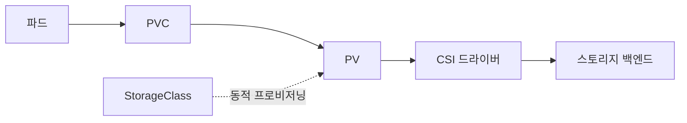
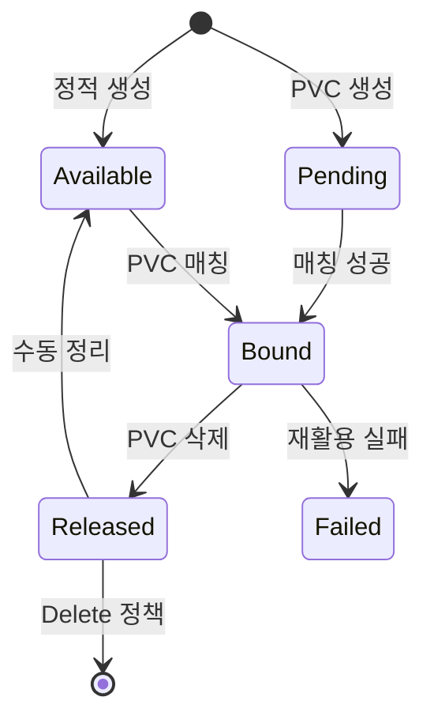

# PV·PVC

PersistentVolume(PV)과 PersistentVolumeClaim(PVC)은 **스토리지 공급자와 소비자
를 분리**하는 쿠버네티스의 표준 추상화다. PV는 클러스터 자원(관리자 관점), PVC
는 네임스페이스 자원(개발자 관점)이다. 둘은 **1:1 바인딩**으로 맺어지고, 파드는
PVC를 참조한다.

운영 관점에서 핵심 질문은 다섯 가지다.

1. **바인딩이 왜 Pending에 멈춰 있나** — access mode·volumeMode·용량·토폴로지
   미스매치, `WaitForFirstConsumer`의 정상 대기 상태
2. **PVC를 지웠는데 PV가 왜 남아있나** — reclaim policy와 v1.33 GA된
   `HonorPVReclaimPolicy`의 역순 삭제 처리
3. **리사이즈가 실패하면 어떻게 복구하나** — v1.34 GA된
   `RecoverVolumeExpansionFailure`와 `pvc.status.conditions`
4. **성능 등급을 바꾸고 싶은데 PVC를 재생성해야 하나** — v1.34 GA된
   `VolumeAttributesClass`로 런타임 변경
5. **여러 파드가 쓰고 싶은데 RWO/RWX/RWOP 중 무엇인가** — CSI 드라이버 지원
   매트릭스에 따른 선택

> 관련: [StorageClass](./storageclass.md) · [CSI Driver](./csi-driver.md)
> · [Volume Snapshot](./volume-snapshot.md) · [분산 스토리지](./distributed-storage.md)

---

## 1. 전체 구조



| 요소 | 스코프 | 역할 |
|---|---|---|
| PersistentVolume | Cluster | 실제 스토리지 자원 추상화 (용량·access mode·reclaim) |
| PersistentVolumeClaim | Namespace | 사용자 요청 (용량·access mode·StorageClass) |
| StorageClass | Cluster | 동적 프로비저닝 정책 (provisioner·파라미터·binding) |
| VolumeAttributesClass | Cluster | 런타임 변경 가능한 QoS 클래스 (IOPS·throughput) |
| CSI Driver | Cluster | 백엔드 I/O (프로비저닝·attach·mount·resize·snapshot) |

**분리 이유**: 관리자는 스토리지를 한 번 정의하면 끝나고, 개발자는
환경별 디테일을 몰라도 동일한 PVC 매니페스트로 여러 클러스터에 배포할 수 있다.

**In-tree 플러그인 이관 완료**: AWS EBS·GCE PD·Azure Disk·vSphere 등 주요
in-tree 볼륨 플러그인은 v1.33까지 모두 **CSI Migration**을 통해 CSI 드라이버
로 이관이 완료됐다. 신규 클러스터는 CSI만 고려하면 된다.

---

## 2. 라이프사이클



| 단계 | 설명 |
|---|---|
| **Provisioning** | 정적(관리자 수동) 또는 동적(StorageClass) 생성 |
| **Binding** | 컨트롤 루프가 PVC를 매칭되는 PV에 결합, `claimRef`로 양방향 참조 |
| **Using** | 파드가 PVC를 마운트, **Storage Object in Use Protection** 활성 |
| **Reclaiming** | PVC 삭제 후 reclaim policy에 따라 Retain·Delete 처리 |

### Phase 전이

| Phase | 의미 | 복구 |
|---|---|---|
| `Available` | 자유 상태, 바인딩 대기 | — |
| `Bound` | PVC와 결합됨 | — |
| `Pending`(PVC) | 매칭 실패 또는 `WaitForFirstConsumer` 대기 | 파드 스케줄로 해소 |
| `Released` | PVC 삭제됨, 데이터 잔존 (Retain) | `claimRef` 제거로 Available 복귀 |
| `Failed` | 자동 재활용 실패 | 수동 검증 후 삭제·복구 |

### `lastPhaseTransitionTime` (v1.31 GA)

PV 상태가 마지막으로 바뀐 시각이 `.status.lastPhaseTransitionTime`에 기록된다.
Released 상태로 전이된 지 **N일 이상 경과한 PV만 자동 정리**하는 런북·
Prometheus 알림에 활용한다.

```bash
kubectl get pv -o json | jq '.items[] | {name:.metadata.name,
  phase:.status.phase, ts:.status.lastPhaseTransitionTime}'
```

### Storage Object in Use Protection

| 리소스 | finalizer |
|---|---|
| PVC | `kubernetes.io/pvc-protection` |
| PV | `kubernetes.io/pv-protection` |

파드가 쓰고 있는 PVC는 삭제 요청이 와도 `Terminating` 상태로만 전이하고
실제 삭제를 보류한다. 이 finalizer를 **강제 제거하면 데이터 손실**로 이어진다.

---

## 3. PV 핵심 필드

```yaml
apiVersion: v1
kind: PersistentVolume
metadata:
  name: pv-data-01
spec:
  capacity:
    storage: 100Gi
  volumeMode: Filesystem              # Filesystem | Block
  accessModes:
    - ReadWriteOnce
  persistentVolumeReclaimPolicy: Retain  # Retain | Delete (Recycle deprecated)
  storageClassName: rook-ceph-block
  volumeAttributesClassName: silver     # v1.34 GA, 선택 사항
  mountOptions:
    - noatime
    - discard
  nodeAffinity:
    required:
      nodeSelectorTerms:
        - matchExpressions:
            - key: topology.kubernetes.io/zone
              operator: In
              values: [zone-a]
  csi:
    driver: rook-ceph.rbd.csi.ceph.com
    volumeHandle: 0001-0009-rook-ceph-0000000000000001-xxx
    fsType: ext4
```

| 필드 | 설명 | 주의 |
|---|---|---|
| `capacity.storage` | 실제 용량, `Gi`/`Ti` | 동적 프로비저닝 시 PVC 요청값으로 설정 |
| `volumeMode` | `Filesystem` 또는 `Block` | PV·PVC 모드가 **일치**해야 바인딩 |
| `accessModes` | 아래 표 참고 | **선언만** 하며 실제 enforcement는 CSI |
| `persistentVolumeReclaimPolicy` | PVC 삭제 후 처리 | 동적 프로비저닝은 기본 `Delete` |
| `storageClassName` | SC 참조 | 공백 문자열이면 "no class"(다른 SC와 바인딩 불가) |
| `volumeAttributesClassName` | VAC 참조 | 런타임 QoS 변경 (섹션 7) |
| `mountOptions` | 마운트 옵션 | CSI 드라이버 호환성 확인 필요 |
| `nodeAffinity` | 어느 노드에서 접근 가능한가 | Local PV·topology-aware CSI에서 필수 |

### Access Modes

| Mode | 약어 | 범위 | 사용 사례 |
|---|---|---|---|
| ReadWriteOnce | RWO | 단일 노드 R/W | 대부분의 블록 스토리지 (RBD, EBS, PD) |
| ReadOnlyMany | ROX | 다중 노드 R/O | 공유 설정, 모델 아티팩트 |
| ReadWriteMany | RWX | 다중 노드 R/W | NFS, CephFS, EFS |
| ReadWriteOncePod | RWOP | **단일 파드** R/W | 리더 선출, 단일 라이터 보장 (v1.29 GA) |

- **RWO는 "단일 노드"**. 같은 노드 위 여러 파드가 동시에 마운트 가능하다.
  이를 막고 싶으면 **RWOP**을 쓴다.
- RWOP은 CSI 드라이버가 `SINGLE_NODE_SINGLE_WRITER` 또는
  `SINGLE_NODE_MULTI_WRITER` 능력을 공개해야 동작한다.
- RWX는 파일 시스템 자체가 멀티 라이터를 지원해야 한다. 블록 RBD를 ext4로
  RWX 마운트하면 데이터가 깨진다.

### Reclaim Policy

| 정책 | 동작 | 기본값 |
|---|---|---|
| `Retain` | PVC 삭제 시 PV가 `Released`로 전이, 데이터 보존 | 정적 PV 권장 |
| `Delete` | PV와 백엔드 스토리지 모두 삭제 | 동적 PV 기본 |
| `Recycle` | `rm -rf`로 스크러빙 (**deprecated**) | 쓰지 말 것 |

**`Released` PV를 재사용하는 절차** (수동):

```bash
# 1. claimRef 제거 → Available로 복귀
kubectl patch pv pv-data-01 -p '{"spec":{"claimRef": null}}'

# 2. 필요시 데이터 정리 (rook-ceph rbd, nfs 등 백엔드 도구 사용)
```

---

## 4. PVC 핵심 필드

```yaml
apiVersion: v1
kind: PersistentVolumeClaim
metadata:
  name: data-app-0
  namespace: app
spec:
  accessModes: [ReadWriteOnce]
  volumeMode: Filesystem
  resources:
    requests:
      storage: 50Gi
  storageClassName: rook-ceph-block
  volumeAttributesClassName: gold
  selector:
    matchLabels:
      tier: premium
  dataSourceRef:
    apiGroup: snapshot.storage.k8s.io
    kind: VolumeSnapshot
    name: data-snapshot-20260420
```

| 필드 | 설명 |
|---|---|
| `resources.requests.storage` | 최소 요구 용량 |
| `storageClassName` | SC 이름. `""`는 "no class", 생략은 default SC |
| `volumeAttributesClassName` | QoS 등급 런타임 변경 (섹션 7) |
| `selector` | 정적 PV 레이블 매칭 (동적과 병행 금지) |
| `volumeName` | 특정 PV 예약 (정적 바인딩) |
| `dataSource` / `dataSourceRef` | 스냅샷·PVC 클론·populator에서 복원 |

### `dataSource` vs `dataSourceRef`

| 항목 | `dataSource` | `dataSourceRef` |
|---|---|---|
| 허용 타입 | Snapshot, PVC만 | 모든 populator (v1.33 GA) |
| 크로스 네임스페이스 | 불가 | `namespace` 필드로 가능 (alpha) |
| 권장 | 레거시 호환 | **신규 코드 표준** |

두 필드는 **동시 지정 불가**. Volume Populators API로 정의된 외부 소스를 쓰려
면 `dataSourceRef`만 사용할 수 있다.

### Generic Ephemeral Volume

파드 수명과 묶인 일회성 볼륨이 필요하면 `volumeClaimTemplates` 없이 파드 스펙
에 직접 정의한다. 파드 삭제 시 PVC도 자동 삭제된다.

```yaml
spec:
  volumes:
  - name: scratch
    ephemeral:
      volumeClaimTemplate:
        spec:
          accessModes: [ReadWriteOnce]
          storageClassName: rook-ceph-block
          resources:
            requests:
              storage: 10Gi
```

StatefulSet이 과한 단일 파드 워크로드(배치, ML 학습 임시 데이터)에 적합.

---

## 5. StorageClass와 Binding Mode

```yaml
apiVersion: storage.k8s.io/v1
kind: StorageClass
metadata:
  name: rook-ceph-block
provisioner: rook-ceph.rbd.csi.ceph.com
parameters:
  clusterID: rook-ceph
  pool: replicapool
  imageFormat: "2"
  imageFeatures: layering
  csi.storage.k8s.io/fstype: ext4
reclaimPolicy: Delete
allowVolumeExpansion: true
volumeBindingMode: WaitForFirstConsumer
```

| `volumeBindingMode` | 동작 | 언제 쓰나 |
|---|---|---|
| `Immediate` | PVC 생성 즉시 프로비저닝·바인딩 | 토폴로지 제약 없는 원격 블록 |
| `WaitForFirstConsumer` | 파드 스케줄 결정 후 프로비저닝 | Local PV, zone-aware CSI |

**WaitForFirstConsumer가 기본 권장**. 스케줄러가 파드의 노드·존을 먼저 정하
고, 그에 맞는 위치에 볼륨을 만든다. Immediate는 파드가 엉뚱한 존에 스케줄되
어 볼륨 attach가 실패하는 시나리오를 만든다.

StorageClass 상세는 [StorageClass](./storageclass.md) 참고.

---

## 6. Volume Expansion (리사이즈)

v1.24 GA 이후 **프로덕션 표준**. v1.34에서 `RecoverVolumeExpansionFailure`가
GA로 추가되며 실패 복구까지 자동화됐다.

### 조건

- StorageClass에 `allowVolumeExpansion: true`
- CSI 드라이버가 `EXPAND_VOLUME` 능력 공개
- 파일 시스템이 온라인 확장 지원 (ext4, XFS 대부분 OK)

### 절차

```bash
# PVC의 요청 용량을 늘리기만 하면 된다
kubectl patch pvc data-app-0 -p \
  '{"spec":{"resources":{"requests":{"storage":"100Gi"}}}}'
```

1. PVC에 `Resizing` condition 생성
2. external-resizer가 CSI `ControllerExpandVolume` 호출
3. 노드 kubelet이 파일 시스템 확장 (`NodeExpandVolume`)
4. PVC `status.capacity`가 새 값으로 갱신

### 실패 복구 (v1.34 GA)

확장 실패 시 `pvc.status.conditions`에 다음이 기록된다.

| Condition | 의미 |
|---|---|
| `ControllerResizeError` | 백엔드 확장 실패 (용량 초과·권한 등) |
| `NodeResizeError` | 노드 파일 시스템 확장 실패 |

**복구**: PVC 요청값을 **더 작은 값으로** 낮춰 재시도할 수 있다 (이전에는 불가).
단, 현재 할당량보다는 커야 한다.

```bash
# 이전: 500Gi 요청 → 실패 (백엔드 할당 부족)
# 이전에는 관리자만 복구 가능. 이제 요청값을 200Gi로 낮춰 재시도 가능.
kubectl patch pvc data-app-0 -p \
  '{"spec":{"resources":{"requests":{"storage":"200Gi"}}}}'
```

### 온라인 vs 오프라인

- **온라인**: 파드 실행 중 확장, 대부분의 최신 CSI 드라이버 지원
- **오프라인**: 파드 종료 후만 확장 가능, 구형 드라이버

리사이즈는 **축소 불가**. 축소가 필요하면 새 PVC 생성 후 데이터 마이그레이션.

---

## 7. VolumeAttributesClass — 런타임 QoS 변경 (v1.34 GA)

용량(size)은 리사이즈로 바꿀 수 있지만, **IOPS·throughput** 같은 성능 등급
을 바꾸려면 과거에는 PVC 재생성 + 데이터 마이그레이션이 필요했다.

`VolumeAttributesClass`(VAC)는 이런 **QoS 속성**을 PVC에서 참조하는 등급으로
분리해 **파드 재시작 없이** 변경 가능하게 만든다.

```yaml
apiVersion: storage.k8s.io/v1beta1
kind: VolumeAttributesClass
metadata:
  name: gold
driverName: rook-ceph.rbd.csi.ceph.com
parameters:
  iops: "10000"
  throughput: "500MiB"
```

### 사용 흐름

```bash
# bronze → gold로 전환
kubectl patch pvc data-app-0 \
  -p '{"spec":{"volumeAttributesClassName":"gold"}}'
```

1. PVC `status.currentVolumeAttributesClassName`이 갱신 대기
2. external-resizer가 CSI `ControllerModifyVolume` 호출
3. 성공 시 PVC·PV 모두 새 VAC 반영

### 주의

- CSI 드라이버가 `MODIFY_VOLUME` 능력을 공개해야 한다
- VAC 이름이 **즉시 적용되지는 않는다** — 백엔드 처리 시간 필요
- 등급 이름(`bronze`/`silver`/`gold`)은 관례일 뿐 표준 아님
- 실패 시 PVC condition에 `ModifyVolumeError` 기록

DB·검색·AI 인퍼런스 등 **성능 등급 전환이 잦은** 워크로드에서 가장 가치가 크
다. 기존에는 PVC 재생성 필요로 수 시간 다운타임이 발생하던 시나리오가 런타임
변경으로 해결된다.

---

## 8. `HonorPVReclaimPolicy` — PV 누수 방지 (v1.33 GA)

과거 문제: PV와 PVC를 **역순으로** (PV 먼저) 삭제하면 reclaim policy가
무시되어 Delete 정책인데도 백엔드 스토리지가 남는 버그가 있었다.

| 버전 | 상태 |
|---|---|
| v1.23 | Alpha |
| v1.31 | Beta (기본 활성화) |
| v1.33 | **GA** (lock to default) |

v1.31+ external-provisioner 5.0.1+가 PV에 finalizer
`external-provisioner.volume.kubernetes.io/finalizer`를 자동 부착한다.

| 상황 | 이전 | 이후 |
|---|---|---|
| PVC 먼저 삭제 | 정책대로 동작 | 정책대로 동작 |
| PV 먼저 삭제 (Delete) | 백엔드에 볼륨 누수 | finalizer가 PVC 삭제까지 대기 |
| PV 먼저 삭제 (Retain) | 데이터 잔존 (의도대로) | 동일 |

**운영 주의**: 기존 클러스터 업그레이드 시 기존 PV에도 finalizer가 추가된다.
`kubectl delete pv`가 즉시 반환하지 않고 PVC 삭제까지 대기한다.

---

## 9. StatefulSet PVC 리텐션 (v1.32 GA)

StatefulSet의 `volumeClaimTemplates`로 만들어진 PVC의 생존 정책을 제어한다.

```yaml
apiVersion: apps/v1
kind: StatefulSet
spec:
  persistentVolumeClaimRetentionPolicy:
    whenDeleted: Retain   # StatefulSet 삭제 시
    whenScaled: Delete    # 스케일 다운 시
```

| whenDeleted / whenScaled | 동작 |
|---|---|
| Retain / Retain (기본) | 모든 PVC 유지. 데이터 안전하지만 청소 부담 |
| Retain / Delete | 스케일 인 시 남은 PVC만 삭제. 확장 유연·축소 정리 |
| Delete / Retain | StS 제거 시 전체 정리, 축소 시는 유지 |
| Delete / Delete | 완전 자동 정리. 개발·테스트 권장 |

**프로덕션 기본값은 Retain/Retain 유지**. 의도치 않은 데이터 손실을 막는다.

---

## 10. 바인딩 매칭 규칙

PVC → PV 매칭 조건 (**모두 만족**해야 바인딩):

| 조건 | 설명 |
|---|---|
| `storageClassName` | 문자열 완전 일치 (`""`도 하나의 값) |
| `accessModes` | PVC 모드가 PV 모드의 부분집합 |
| `volumeMode` | Filesystem·Block 정확히 일치 |
| `capacity` | PV 용량 ≥ PVC 요청 용량 |
| `selector` (있으면) | PV 레이블이 PVC 셀렉터 만족 |
| `volumeName` (있으면) | 특정 PV 이름 일치 |

동적 프로비저닝은 매칭되는 PV가 없을 때 SC의 provisioner를 호출해 PV를 **새로
만든다**. 정적 PV가 조건에 먼저 맞으면 프로비저닝은 일어나지 않는다.

---

## 11. 실무 함정 — fsGroup과 subPath

### `fsGroup`과 `fsGroupChangePolicy`

파드 securityContext에 `fsGroup`을 지정하면 kubelet이 볼륨의 **파일 소유권을
재귀적으로 chown**한다. RWX CephFS·NFS처럼 **수백만 파일**이 있는 볼륨에서는
마운트마다 수십 분이 걸린다.

```yaml
spec:
  securityContext:
    fsGroup: 1000
    fsGroupChangePolicy: OnRootMismatch   # Always(기본) | OnRootMismatch
```

| 정책 | 동작 | 언제 쓰나 |
|---|---|---|
| `Always` (기본) | 매번 전체 재귀 chown | 매번 권한이 틀어질 수 있는 환경 |
| `OnRootMismatch` | 루트 디렉터리 소유권만 확인, 다를 때만 재귀 | **프로덕션 권장** |

CSI 드라이버 쪽에서 `CSIDriver.spec.fsGroupPolicy`로 위임 방식을 제어할 수
있다 (`None`·`File`·`ReadWriteOnceWithFSType`).

### `subPath`의 함정

볼륨의 특정 하위 경로만 마운트하는 기능.

| 함정 | 설명 |
|---|---|
| **ConfigMap/Secret 자동 갱신 안 됨** | subPath로 마운트된 파일은 프로젝션에서 제외, 수정해도 파드 반영 안 됨 |
| **CVE-2021-25741** | 과거 심볼릭 링크 공격 취약점 (현재 패치됨) |
| **볼륨 서브디렉터리 존재 필요** | 없으면 마운트 실패 |

대안: `subPathExpr`로 파드 env 기반 경로 생성, 또는 `projected` 볼륨 사용.

---

## 12. 운영 시나리오

### Pending PVC 디버깅

```bash
kubectl describe pvc <name> -n <ns>
```

| 이벤트 메시지 | 원인 | 해결 |
|---|---|---|
| `waiting for first consumer` | `WaitForFirstConsumer` 정상 대기 | 파드 스케줄 필요 |
| `no persistent volumes available` | 정적 PV 없음, 동적 provisioner 실패 | SC·프로비저너 로그 확인 |
| `failed to provision volume` | CSI 드라이버 에러 | `kubectl logs -n <ns> <csi-provisioner>` |
| `node(s) did not have...` | nodeAffinity·토폴로지 미스매치 | PVC 요구 토폴로지 재확인 |

### Terminating에 멈춘 PVC

```bash
kubectl get pvc <name> -o json | jq .metadata.finalizers
# [ "kubernetes.io/pvc-protection" ]
```

원인 대부분:
1. **사용 중인 파드가 여전히 존재** — 파드 먼저 제거
2. **CSI 드라이버 컨트롤러 장애** — csi-provisioner Pod 로그 확인
3. **백엔드 스토리지 응답 없음** — 스토리지 쪽 확인

> **주의**: finalizer 강제 제거(`--force`, patch로 null)는 **PV·백엔드 누수**
> 를 만든다. 근본 원인을 먼저 해결한다.

### Released PV 재사용

```bash
# claimRef 필드만 제거. 데이터 보존 상태로 Available 복귀
kubectl patch pv <pv-name> --type=json \
  -p='[{"op": "remove", "path": "/spec/claimRef"}]'
```

### 모니터링 지표

용량뿐 아니라 **inode 고갈**과 **CSI 오퍼레이션 지연**을 같이 본다.

| 지표 | 의미 | 경보 임계 |
|---|---|---|
| `kubelet_volume_stats_used_bytes / capacity_bytes` | 용량 사용률 | > 0.8 |
| `kubelet_volume_stats_inodes_used / inodes` | inode 사용률 | > 0.8 |
| `csi_operations_seconds{quantile="0.99"}` | CSI p99 지연 | 드라이버별 기준선 |
| `volume_manager_total_volumes` | 노드당 볼륨 수 | 노드 한계 대비 모니터 |

**inode 고갈이 용량보다 먼저 오는 경우**(소형 파일 대량, 캐시 볼륨)가 프로덕
션에서 자주 터지므로 반드시 병행 모니터링.

---

## 13. 온프레미스·Rook-Ceph 특이 사항

온프레미스 노드 로컬 NVMe를 Rook-Ceph로 통합하는 환경에서 자주 부딪히는 지점.

| 이슈 | 대응 |
|---|---|
| RBD RWX 마운트 시 데이터 손상 | RWX는 **CephFS**로, 블록이 필요하면 RWO/RWOP |
| `rook-ceph-block` PVC Pending | OSD 상태 확인: `ceph -s`, `ceph osd tree` |
| Local PV 노드 장애 | `nodeAffinity`로 파드가 다른 노드로 못 감 → StatefulSet 설계 시 고려 |
| 리사이즈 지연 | rook-ceph-operator 재시작, PVC condition 확인 |
| fsGroup chown 지연 | CephFS RWX는 `fsGroupChangePolicy: OnRootMismatch` 필수 |

클라우드 제공 CSI(EBS·PD·Azure Disk)도 동일 추상화를 따른다. 차이는 AZ 제약
(`topology.kubernetes.io/zone` nodeAffinity)과 RWX 옵션(EFS·Filestore) 정도.

---

## 14. 데이터 소스·Populator

PVC 생성 시 초기 데이터를 주입할 수 있다.

| 소스 | 용도 |
|---|---|
| `VolumeSnapshot` | 스냅샷에서 복원 |
| `PersistentVolumeClaim` | 기존 PVC 클론 |
| Volume Populator (v1.33 GA) | 외부 시스템에서 시드 (Git, S3, 커스텀 CRD 등) |

상세는 [Volume Snapshot](./volume-snapshot.md) 참고.

### Cross-Namespace (alpha)

`CrossNamespaceVolumeDataSource` + `AnyVolumeDataSource` 피처게이트를 켜고
Gateway API의 `ReferenceGrant`로 권한을 부여하면, 다른 네임스페이스의 스냅샷
을 소스로 쓸 수 있다. **v1.34 기준 alpha**, 운영 환경은 GA 전까지 보수적으로
접근.

---

## 15. 베스트 프랙티스

| 항목 | 권장 |
|---|---|
| 기본 Binding Mode | `WaitForFirstConsumer` |
| 기본 Reclaim Policy | 동적은 `Delete`, 중요 데이터는 `Retain` |
| default SC | 1개만 (다수면 PVC가 어디 붙을지 예측 불가) |
| default SC 설정 | `storageclass.kubernetes.io/is-default-class: "true"` |
| RWX + fsGroup | `fsGroupChangePolicy: OnRootMismatch` 필수 |
| PVC 모니터링 | 용량·inode·CSI 지연을 **함께** 본다 |
| RWX 사용 | CephFS·NFS CSI 등 파일 시스템 기반만 |
| StatefulSet | retention 정책 명시 (기본 Retain/Retain) |
| 업그레이드 | v1.33+ finalizer로 PV 삭제 지연, 자동화 스크립트 재검토 |
| QoS 등급 운영 | `VolumeAttributesClass`로 분리, 런타임 전환 가능 구조 |

---

## 16. 안티패턴

- **hostPath PV를 프로덕션에 사용** — 노드 이동 시 데이터 유실. Local PV의
  동적 프로비저너(Static Local Provisioner)를 쓴다.
- **Recycle reclaim policy** — deprecated. 쓰지 말 것.
- **PV·PVC finalizer 강제 제거** — 백엔드 누수. 근본 원인 해결.
- **default SC 두 개 이상** — PVC가 어느 쪽에 붙을지 비결정적.
- **Immediate + zone-aware CSI** — 존 불일치로 attach 실패 재발.
- **RWO를 RWX 대용으로** — 같은 노드에서만 공유되고, 다른 노드에서 호출되면
  실패. 초반 개발 단계에서는 동작하지만 운영 확장 시 터진다.
- **subPath로 ConfigMap 마운트** — 업데이트가 반영되지 않는다. 디렉터리
  마운트나 `projected` 볼륨을 쓴다.
- **대용량 RWX에 `fsGroup: Always`** — 마운트마다 chown 재귀로 수십 분 지연.

---

## 참고 자료

- [Kubernetes Docs: Persistent Volumes](https://kubernetes.io/docs/concepts/storage/persistent-volumes/) (확인: 2026-04-23)
- [Kubernetes Docs: Change PV Reclaim Policy](https://kubernetes.io/docs/tasks/administer-cluster/change-pv-reclaim-policy/)
- [Kubernetes Blog: v1.34 Recovery From Volume Expansion Failure (GA)](https://kubernetes.io/blog/2025/09/19/kubernetes-v1-34-recover-expansion-failure/)
- [Kubernetes Blog: v1.34 VolumeAttributesClass for Volume Modification GA](https://kubernetes.io/blog/2025/09/08/kubernetes-v1-34-volume-attributes-class/)
- [Kubernetes Blog: v1.33 Prevent PersistentVolume Leaks graduates to GA](https://kubernetes.io/blog/2025/05/05/kubernetes-v1-33-prevent-persistentvolume-leaks-when-deleting-out-of-order-graduate-to-ga/)
- [Kubernetes Blog: v1.33 Volume Populators Graduate to GA](https://kubernetes.io/blog/2025/05/08/kubernetes-v1-33-volume-populators-ga/)
- [Kubernetes Blog: v1.31 PersistentVolume Last Phase Transition Time GA](https://kubernetes.io/blog/2024/08/14/last-phase-transition-time-ga/)
- [Kubernetes Blog: v1.29 ReadWriteOncePod Graduates to Stable](https://kubernetes.io/blog/2023/12/18/read-write-once-pod-access-mode-ga/)
- [Kubernetes Blog: v1.27 StatefulSet PVC Auto-Deletion](https://kubernetes.io/blog/2023/05/04/kubernetes-1-27-statefulset-pvc-auto-deletion-beta/)
- [KEP-2485: ReadWriteOncePod](https://github.com/kubernetes/enhancements/blob/master/keps/sig-storage/2485-read-write-once-pod-pv-access-mode/README.md)
- [KEP-2644: Honor PV Reclaim Policy](https://github.com/kubernetes/enhancements/blob/master/keps/sig-storage/2644-honor-pv-reclaim-policy/README.md)
- [CSI Spec: Cross-Namespace Data Sources](https://kubernetes-csi.github.io/docs/cross-namespace-data-sources.html)
