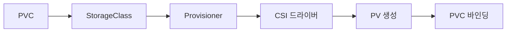
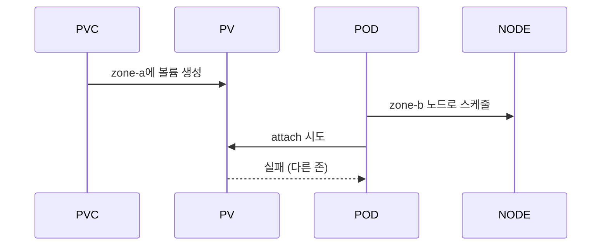

# StorageClass

StorageClass(SC)는 **동적 프로비저닝의 정책**을 정의하는 클러스터 리소스다.
사용자가 PVC에 SC를 명시(또는 default SC 사용)하면, 컨트롤 루프가 해당 SC의
`provisioner`를 호출해 PV를 **새로 만든다**.

같은 CSI 드라이버라도 용도가 다르면 SC를 여러 개 둔다. 예: 성능 SSD용
`fast-ssd`, 아카이브용 `archive`, 존 고정용 `zone-a-ssd`.

운영 관점 핵심 질문은 네 가지다.

1. **언제 바인딩되나** — `volumeBindingMode`로 제어, 토폴로지 안전
2. **기본 SC는 어떻게 지정·전환하나** — `is-default-class` 어노테이션,
   v1.28 GA된 retroactive assignment
3. **민감 정보(인증·암호화 키)는 어떻게 넘기나** — `csi.storage.k8s.io/*`
   시크릿 키
4. **파라미터가 왜 조용히 실패하나** — SC 파라미터는 **검증되지 않는다**

> 관련: [PV·PVC](./pv-pvc.md) · [CSI Driver](./csi-driver.md)
> · [분산 스토리지](./distributed-storage.md)

---

## 1. 전체 구조



| 역할 | 주체 |
|---|---|
| 정책 선언 | 관리자가 SC 작성 (provisioner·파라미터·binding·reclaim) |
| 요청 | 사용자가 PVC에서 SC 참조 |
| 프로비저닝 | SC의 provisioner가 CSI를 호출해 백엔드 볼륨 생성 |
| 바인딩 | 만들어진 PV를 PVC에 결합 |

---

## 2. 필드 리퍼런스

```yaml
apiVersion: storage.k8s.io/v1
kind: StorageClass
metadata:
  name: rook-ceph-block
  annotations:
    storageclass.kubernetes.io/is-default-class: "true"
provisioner: rook-ceph.rbd.csi.ceph.com
reclaimPolicy: Delete
allowVolumeExpansion: true
volumeBindingMode: WaitForFirstConsumer
mountOptions:
  - discard
  - noatime
allowedTopologies:
  - matchLabelExpressions:
      - key: topology.kubernetes.io/zone
        values: [zone-a, zone-b]
parameters:
  clusterID: rook-ceph
  pool: replicapool
  csi.storage.k8s.io/fstype: ext4
  csi.storage.k8s.io/provisioner-secret-name: rook-csi-rbd-provisioner
  csi.storage.k8s.io/provisioner-secret-namespace: rook-ceph
```

| 필드 | 필수 | 설명 | 변경 가능 |
|---|:-:|---|:-:|
| `provisioner` | ✓ | CSI 드라이버 이름 (예: `ebs.csi.aws.com`) | ✗ |
| `parameters` | ✗ | provisioner로 전달되는 키-값 (드라이버 정의) | ✗ |
| `reclaimPolicy` | ✗ | `Delete`(기본) 또는 `Retain` | ✗ |
| `allowVolumeExpansion` | ✗ | 리사이즈 허용 여부 | ✓ |
| `volumeBindingMode` | ✗ | `Immediate`(기본) 또는 `WaitForFirstConsumer` | ✗ |
| `allowedTopologies` | ✗ | 프로비저닝 허용 토폴로지 | ✗ |
| `mountOptions` | ✗ | 마운트 옵션 (검증 안 됨) | ✓ |

**변경 가능 필드는 `allowVolumeExpansion`·`mountOptions` 두 개뿐**. 나머지
를 바꾸려면 새 SC를 만들고 새 PVC가 그것을 쓰도록 한다.

---

## 3. `volumeBindingMode` — 토폴로지 안전의 핵심

### 두 모드

| 모드 | 바인딩 시점 | 언제 쓰나 |
|---|---|---|
| `Immediate` (기본) | PVC 생성 즉시 | 전 존 접근 가능한 NAS·오브젝트 기반 |
| `WaitForFirstConsumer` | 파드 스케줄 결정 후 | **거의 모든 경우 권장** |

### Immediate의 위험

파드가 아직 스케줄되지 않은 상태에서 볼륨이 먼저 만들어진다. 결과:



zone-aware 블록 스토리지(EBS·PD·RBD 등)는 **볼륨이 만들어진 존 밖에서
attach 불가**. 파드가 엉뚱한 존에 스케줄되면 `FailedAttachVolume`으로
Pending에 박힌다.

### WaitForFirstConsumer의 동작

1. PVC 생성 → Pending 유지 (`waiting for first consumer`)
2. 파드가 PVC를 참조 → 스케줄러가 노드 결정
3. 결정된 노드의 토폴로지 레이블로 CSI에 **힌트** 전달
4. CSI가 해당 토폴로지에 맞는 볼륨 생성
5. PV가 PVC와 바인딩되고 파드가 실행

**예외**: 파드가 여러 PVC를 쓰면 스케줄러가 모든 PVC의 토폴로지 교집합을
찾아 노드를 고른다. 교집합이 비면 파드가 스케줄되지 않는다.

---

## 4. `allowedTopologies` — 프로비저닝 제한

WaitForFirstConsumer를 쓰면 토폴로지 문제가 대부분 사라지지만, **특정 존만
쓰게 강제**하고 싶을 때 사용한다.

```yaml
allowedTopologies:
  - matchLabelExpressions:
      - key: topology.kubernetes.io/zone
        values: [zone-a]
```

### 주요 토폴로지 키

| 키 | 의미 |
|---|---|
| `topology.kubernetes.io/zone` | 존 (가용 영역) |
| `topology.kubernetes.io/region` | 리전 |
| `kubernetes.io/hostname` | 노드 단위 (Local PV) |
| `topology.ebs.csi.aws.com/zone` | AWS EBS 전용 존 |
| `topology.rook.io/rack` | Rook-Ceph rack |

드라이버별로 고유 키를 정의할 수 있으므로 CSI 드라이버 문서를 먼저 본다.

### 사용 사례

- **라이선스·규정**: 특정 데이터센터에만 볼륨을 둔다
- **Local PV**: `hostname` 키로 노드 단위 고정
- **존 이원화**: 중요 데이터는 특정 존에만, 나머지는 전체에 분산

---

## 5. CSI 표준 파라미터 키

`csi.storage.k8s.io/` 프리픽스는 **Kubernetes가 예약**한 영역이다. CSI
external-provisioner가 드라이버에 전달하지 않고 **직접 해석**한다.

| 키 | 용도 |
|---|---|
| `csi.storage.k8s.io/fstype` | 파일 시스템 타입 (ext4·xfs·btrfs) |
| `csi.storage.k8s.io/provisioner-secret-name` | 볼륨 생성 시 사용할 시크릿 |
| `csi.storage.k8s.io/provisioner-secret-namespace` | 시크릿 네임스페이스 |
| `csi.storage.k8s.io/node-stage-secret-name` | 노드 stage 시 시크릿 |
| `csi.storage.k8s.io/node-publish-secret-name` | 노드 publish 시 시크릿 |
| `csi.storage.k8s.io/controller-expand-secret-name` | 컨트롤러 리사이즈 시 시크릿 |
| `csi.storage.k8s.io/node-expand-secret-name` | 노드 리사이즈 시 시크릿 (v1.25+) |

### 템플릿 치환

시크릿 이름·네임스페이스에 **템플릿**을 쓸 수 있다. **키별로 허용되는 변수
가 다르므로** 반드시 확인하고 쓴다.

| 치환 | 의미 | provisioner-secret | node-stage / publish / expand secret |
|---|---|:-:|:-:|
| `${pv.name}` | PV 이름 | ✓ | ✓ |
| `${pvc.namespace}` | PVC 네임스페이스 | ✓ | ✓ |
| `${pvc.name}` | PVC 이름 | ✗ | ✓ |
| `${pvc.annotations['<key>']}` | PVC 어노테이션 | ✗ | ✓ |
| `${pod.name}` | 파드 이름 | ✗ | ✓ (node-publish만) |
| `${pod.namespace}` | 파드 네임스페이스 | ✗ | ✓ (node-publish만) |
| `${pod.uid}` | 파드 UID | ✗ | ✓ (node-publish만) |
| `${serviceAccount.name}` | 파드 SA 이름 | ✗ | ✓ (node-publish만) |

`provisioner-secret`에서는 PVC·PV 정보만 쓸 수 있다. 프로비저닝 시점에는
아직 파드가 결정되지 않아서다. `pod.*` 변수는 **node-publish 시점**(파드
마운트 직전)에만 유효하다. Secrets Store CSI Driver·pod identity 시나리오
구현의 핵심.

**예시**: 네임스페이스별로 다른 암호화 키 쓰기

```yaml
parameters:
  csi.storage.k8s.io/provisioner-secret-name: storage-key
  csi.storage.k8s.io/provisioner-secret-namespace: ${pvc.namespace}
```

### RBAC

external-provisioner에는 지정한 네임스페이스의 시크릿 read 권한이 필요하다.
`${pvc.namespace}` 치환을 쓰면 **모든 네임스페이스의 secret**을 읽을 수 있
어야 하므로 ClusterRole로 부여한다.

```yaml
# csi-provisioner용 ClusterRole 일부
apiVersion: rbac.authorization.k8s.io/v1
kind: ClusterRole
metadata:
  name: csi-provisioner-secrets
rules:
  - apiGroups: [""]
    resources: ["secrets"]
    verbs: ["get", "list"]
```

권한 부족 시 csi-provisioner 로그에 `secrets is forbidden` 에러가 남는다.

---

## 6. Default StorageClass

### 어노테이션

```yaml
metadata:
  annotations:
    storageclass.kubernetes.io/is-default-class: "true"
```

### Retroactive Assignment (v1.28 GA)

과거 문제: PVC가 먼저 생성되고 default SC가 나중에 설정되면, 그 PVC는
영원히 Pending 상태였다. v1.28부터는 **기존 PVC도 소급 적용**된다.

| 시나리오 | 동작 |
|---|---|
| default SC 있는 상태에서 PVC 생성(`storageClassName` 생략) | default SC 자동 할당 |
| **PVC가 먼저 Pending**, 이후 default SC 추가 (v1.28 GA 핵심) | **기존 PVC에 소급 할당** → Bound 전이 |
| PVC에 `storageClassName: ""` | 변경 없음 (정적 PV만 바인딩 대기) |
| PVC에 `storageClassName: "foo"` | 변경 없음 (명시값 존중) |

**운영 가치**: default SC 교체·추가 시 신규 PVC와 **기존 Pending PVC** 모두
안전하게 전환된다.

### Default SC 전환 절차

```bash
# 1. 새 default 후보에 어노테이션 추가
kubectl annotate sc new-default \
  storageclass.kubernetes.io/is-default-class=true

# 2. 기존 default 해제
kubectl annotate sc old-default \
  storageclass.kubernetes.io/is-default-class=false --overwrite
```

기존 **Bound** PVC는 영향받지 않는다. 새로 생성되는 PVC만 새 default로
간다.

### 다중 default 처리

여러 SC에 `is-default-class: "true"`가 있으면 **가장 최근에 만들어진 것**이
선택된다. 그러나 **운영 표준은 default 1개**. 다중 default는 혼란만 만든다.

```bash
# 다중 default 체크
kubectl get sc -o json | jq -r \
  '.items[] | select(.metadata.annotations."storageclass.kubernetes.io/is-default-class"=="true") | .metadata.name'
```

---

## 7. `storageClassName` 값 3종

| PVC의 값 | 동작 |
|---|---|
| 필드 **없음** (unset) | default SC 사용. 없으면 Pending, default 생기면 소급 적용 |
| `""` (빈 문자열) | **"no class"**. `storageClassName: ""`인 정적 PV만 바인딩 |
| `"foo"` (지정) | SC `foo`의 provisioner로 동적 프로비저닝 또는 매칭 PV |

**함정**: default SC가 있는데 "정적 PV만 쓰게" 하려면 `""`로 명시해야 한다.
필드를 생략하면 default가 자동 할당된다.

---

## 8. 주요 CSI 드라이버별 StorageClass

### 드라이버 선택 매트릭스

| 카테고리 | 대표 provisioner | Access Mode | 용도 |
|---|---|---|---|
| 클라우드 블록 | `ebs.csi.aws.com`·`pd.csi.storage.gke.io`·`disk.csi.azure.com` | RWO | DB·상태 저장 |
| 클라우드 파일 | `efs.csi.aws.com`·`filestore.csi.storage.gke.io`·`file.csi.azure.com` | RWX | 공유 설정·모델 |
| 온프레 블록 | `rook-ceph.rbd.csi.ceph.com`·`driver.longhorn.io` | RWO | DB·PVC 단위 볼륨 |
| 온프레 파일 | `rook-ceph.cephfs.csi.ceph.com`·NFS CSI·JuiceFS | RWX | 공유 저장 |
| Local/NVMe | `local.csi.openebs.io`·TopoLVM | RWO | 고IOPS 로컬 |

**In-tree provisioner 사용 금지**: `kubernetes.io/aws-ebs`·`kubernetes.io/
gce-pd`·`kubernetes.io/vsphere-volume` 등은 **CSI Migration**으로 내부적으
로 CSI에 리다이렉트된다. 동작하지만 신규 SC에는 쓰지 말 것 — 향후 제거 예정
이고 일부 기능(스냅샷·리사이즈)이 제약된다.

### Rook-Ceph RBD (블록)

```yaml
apiVersion: storage.k8s.io/v1
kind: StorageClass
metadata:
  name: rook-ceph-block
provisioner: rook-ceph.rbd.csi.ceph.com
parameters:
  clusterID: rook-ceph
  pool: replicapool
  imageFormat: "2"
  imageFeatures: layering
  csi.storage.k8s.io/fstype: ext4
  csi.storage.k8s.io/provisioner-secret-name: rook-csi-rbd-provisioner
  csi.storage.k8s.io/provisioner-secret-namespace: rook-ceph
  csi.storage.k8s.io/controller-expand-secret-name: rook-csi-rbd-provisioner
  csi.storage.k8s.io/controller-expand-secret-namespace: rook-ceph
  csi.storage.k8s.io/node-stage-secret-name: rook-csi-rbd-node
  csi.storage.k8s.io/node-stage-secret-namespace: rook-ceph
reclaimPolicy: Delete
allowVolumeExpansion: true
volumeBindingMode: Immediate
```

RBD는 원격 블록이라 **Immediate도 허용**되지만, 노드-OSD 토폴로지를 고려
하면 WaitForFirstConsumer가 더 안전하다.

### Rook-CephFS (RWX 파일 시스템)

```yaml
apiVersion: storage.k8s.io/v1
kind: StorageClass
metadata:
  name: rook-cephfs
provisioner: rook-ceph.cephfs.csi.ceph.com
parameters:
  clusterID: rook-ceph
  fsName: myfs
  pool: myfs-replicated
  csi.storage.k8s.io/provisioner-secret-name: rook-csi-cephfs-provisioner
  csi.storage.k8s.io/provisioner-secret-namespace: rook-ceph
reclaimPolicy: Delete
allowVolumeExpansion: true
```

RWX 용도. `csi.storage.k8s.io/fstype`은 지정하지 않는다 (CephFS는 자체 FS).

### AWS EBS (클라우드 블록)

```yaml
apiVersion: storage.k8s.io/v1
kind: StorageClass
metadata:
  name: ebs-gp3
provisioner: ebs.csi.aws.com
parameters:
  type: gp3
  iops: "3000"
  throughput: "125"
  encrypted: "true"
  csi.storage.k8s.io/fstype: ext4
reclaimPolicy: Delete
allowVolumeExpansion: true
volumeBindingMode: WaitForFirstConsumer
allowedTopologies:
  - matchLabelExpressions:
      - key: topology.ebs.csi.aws.com/zone
        values: [us-east-1a, us-east-1b, us-east-1c]
```

### GCE Persistent Disk

```yaml
provisioner: pd.csi.storage.gke.io
parameters:
  type: pd-ssd
  csi.storage.k8s.io/fstype: ext4
volumeBindingMode: WaitForFirstConsumer
```

### Local PV (Static Local Provisioner)

```yaml
apiVersion: storage.k8s.io/v1
kind: StorageClass
metadata:
  name: local-nvme
provisioner: kubernetes.io/no-provisioner   # 정적 PV만
volumeBindingMode: WaitForFirstConsumer
reclaimPolicy: Retain
```

로컬 디스크는 **동적 프로비저닝이 없다**. `no-provisioner`를 쓰고 정적
provisioner 데몬셋(sig-storage-local-static-provisioner)으로 PV를 만든다.

---

## 9. VolumeAttributesClass와의 관계

| 리소스 | 정의 범위 | 변경 |
|---|---|---|
| StorageClass | 프로비저닝 시점의 **생성 파라미터** | 사실상 불변 |
| VolumeAttributesClass | 런타임 **QoS 속성** (IOPS·throughput) | PVC에서 런타임 변경 가능 |

**분리 원칙**: 용량·파일 시스템·토폴로지 = SC, 성능 등급 = VAC. 등급을 바꾸
려고 SC를 바꾸는 패턴은 금물.

### 중요한 제약

- VAC의 `driverName`과 PVC를 만든 SC의 `provisioner`가 **같아야** 한다
- 다른 CSI 드라이버 간 VAC 전환은 불가 (새 PVC·마이그레이션 필요)

### 기존 SC `parameters`에서 VAC로 이관

```yaml
# 이전: SC에 성능 등급을 고정
parameters:
  type: gp3
  iops: "3000"
  throughput: "125"

# 이후: SC는 기본 등급, VAC로 등급을 분리
# SC
parameters:
  type: gp3
# VAC (bronze)
parameters:
  iops: "3000"
  throughput: "125"
# VAC (gold)
parameters:
  iops: "16000"
  throughput: "1000"
```

상세는 [PV·PVC](./pv-pvc.md#7-volumeattributesclass--런타임-qos-변경-v134-ga)
참고.

---

## 10. 운영 시나리오

### SC 파라미터 변경이 필요할 때

SC의 대부분 필드가 불변이므로 새 SC를 만든다.

```bash
# 1. 새 SC 생성 (다른 이름으로)
kubectl apply -f new-sc.yaml

# 2. 새 PVC는 새 SC 사용, 기존 PVC는 그대로 둠
# 3. 마이그레이션이 필요하면 VolumeSnapshot → 새 PVC로 복원
```

### SC 잘못 지웠을 때

이미 Bound된 PVC는 **영향 없음**. 새 PVC가 실패할 뿐이다. SC를 재생성하면
복구된다 (이름·파라미터가 동일해야 한다).

### 디버깅 체크리스트

| 증상 | 확인 |
|---|---|
| PVC가 Pending, `no volume plugin matched` | provisioner 이름 오타 |
| `failed to provision volume with StorageClass` | 파라미터 오류, 드라이버 로그 확인 |
| `node(s) had volume node affinity conflict` | 토폴로지 미스매치, WaitForFirstConsumer로 전환 |
| 기대한 default SC가 동작 안 함 | 여러 default 또는 PVC에 `storageClassName: ""` |

### 파라미터 오류는 조용히 실패한다

SC 파라미터는 **API 서버에서 검증하지 않는다**. 오타·잘못된 값은
프로비저닝 시점에 CSI 드라이버가 뱉는 에러로만 드러난다.

```bash
# csi-provisioner 로그를 우선 확인
kubectl logs -n <csi-ns> -l app=csi-provisioner --tail=100
```

### 암호화 SC 설계

암호화가 필요한 워크로드는 **전용 SC**로 분리한다. 같은 드라이버라도 평문·
암호화 SC를 나눠 혼용 사고를 막는다.

**AWS EBS 암호화 예시**:

```yaml
apiVersion: storage.k8s.io/v1
kind: StorageClass
metadata:
  name: ebs-gp3-encrypted
provisioner: ebs.csi.aws.com
parameters:
  type: gp3
  encrypted: "true"
  kmsKeyId: arn:aws:kms:ap-northeast-2:...:key/...
```

**Rook-Ceph RBD 암호화 예시** (LUKS):

```yaml
parameters:
  encrypted: "true"
  encryptionKMSID: vault-kms
  csi.storage.k8s.io/provisioner-secret-name: rook-csi-rbd-provisioner
  csi.storage.k8s.io/provisioner-secret-namespace: rook-ceph
```

`encryptionKMSID`는 Rook-Ceph의 KMS ConfigMap에 정의된 항목을 참조한다.
Vault 인증 정보는 **ExternalSecret**으로 관리해 키 로테이션 시 SC를 건드리
지 않는다.

### 관측 지표

SC 파라미터 오류는 조용히 실패하므로 **메트릭 관측이 조기 탐지의 핵심**.

| 지표 | 의미 |
|---|---|
| `storage_operation_duration_seconds{operation_name="provision"}` | SC별 프로비저닝 지연 |
| `storage_operation_errors_total` | 프로비저닝 실패 카운터 |
| `csi_sidecar_operations_seconds` | external-provisioner p99 지연 |
| `volume_operation_total_seconds` | controller-manager 집계 |

예시 알림 규칙:

```promql
# 특정 SC의 프로비저닝 5분 실패율 > 10%
sum(rate(storage_operation_errors_total{volume_plugin=~".*rook.*"}[5m]))
  / sum(rate(storage_operation_duration_seconds_count[5m])) > 0.1
```

---

## 11. 베스트 프랙티스

| 항목 | 권장 |
|---|---|
| 기본 `volumeBindingMode` | `WaitForFirstConsumer` |
| default SC 수 | **1개만** |
| SC 이름 규칙 | `<driver>-<tier>` 형태 (예: `rook-ceph-block`, `ebs-gp3`) |
| `allowVolumeExpansion` | 기본 `true` (비활성 이유가 없으면) |
| 암호화가 필요한 워크로드 | 전용 SC 분리 (`*-encrypted`) |
| 시크릿 관리 | ExternalSecret·Vault 연동 |
| SC 변경 | 기존 SC 수정 금지, 새 이름으로 생성 |
| 파라미터 검증 | 신규 SC는 **테스트 PVC**로 검증 후 공개 |

---

## 12. 안티패턴

- **여러 SC를 default로 설정** — 가장 최근 SC가 이기므로 결정적이지 않다.
- **SC 파라미터 오타 방치** — 조용히 실패하고 PVC가 Pending에 박힌다.
- **Immediate + 존 제약 블록 드라이버** — `FailedAttachVolume` 재발.
- **SC를 재사용하려 수정 시도** — 대부분 필드가 불변. 새 SC로 교체.
- **`storageClassName`을 Helm values에서 "" 기본값** — default SC 무시로
  정적 PV만 바인딩 시도, 프로덕션에서 혼란.
- **kubernetes.io/no-provisioner에 WaitForFirstConsumer 빠짐** — Local PV
  는 노드에 고정이라 Immediate로 바인딩하면 파드가 다른 노드로 스케줄될 때
  `node(s) had volume node affinity conflict`로 `FailedScheduling`.
- **신규 SC에 in-tree provisioner 사용** (`kubernetes.io/aws-ebs` 등) —
  CSI Migration으로 동작은 하지만 제거 예정. 처음부터 CSI provisioner로.
- **PVC 네임스페이스에 provisioner 시크릿 배치** — 모든 네임스페이스마다
  복제 필요. 전용 네임스페이스 + `${pvc.namespace}` 치환 권장.

---

## 참고 자료

- [Kubernetes Docs: Storage Classes](https://kubernetes.io/docs/concepts/storage/storage-classes/) (확인: 2026-04-23)
- [Kubernetes Docs: Change Default StorageClass](https://kubernetes.io/docs/tasks/administer-cluster/change-default-storage-class/)
- [Kubernetes Blog: v1.28 Retroactive Default StorageClass GA](https://kubernetes.io/blog/2023/08/18/retroactive-default-storage-class-ga/)
- [Kubernetes Blog: Topology-Aware Volume Provisioning](https://kubernetes.io/blog/2018/10/11/topology-aware-volume-provisioning-in-kubernetes/)
- [CSI Developer Docs: StorageClass Secrets](https://kubernetes-csi.github.io/docs/secrets-and-credentials-storage-class.html)
- [CSI Developer Docs: Topology](https://kubernetes-csi.github.io/docs/topology.html)
- [CSI Developer Docs: external-provisioner](https://kubernetes-csi.github.io/docs/external-provisioner.html)
- [Rook-Ceph Docs: CSI Driver](https://rook.io/docs/rook/latest-release/Storage-Configuration/Block-Storage-RBD/block-storage/)
