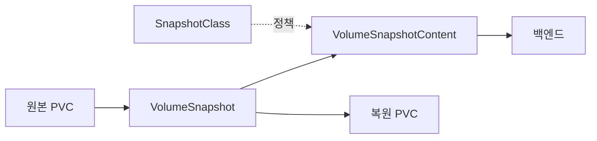
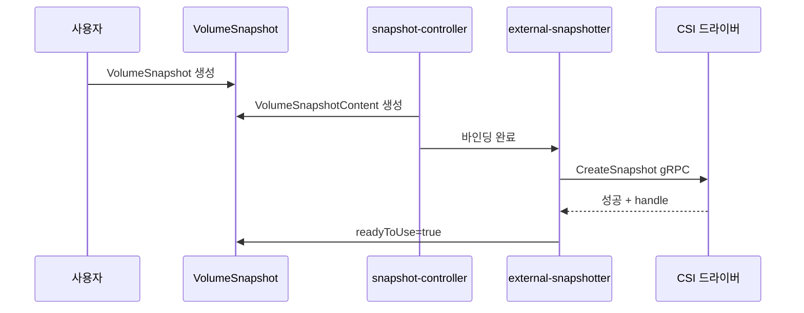

# Volume Snapshot

VolumeSnapshot은 **PVC의 시점 복제본**을 만들고 복원하는 쿠버네티스 표준
API다. v1.20에서 GA(`snapshot.storage.k8s.io/v1`)로 안정화됐고,
**VolumeGroupSnapshot**은 v1.32 Beta → **v1.36 GA**로 승격됐다.

스냅샷 자체는 **백업이 아니다**. 백엔드 내부 복제(OSD 복제본·RAID)는 노드
장애엔 견디지만 **논리적 삭제·랜섬웨어·리전 장애**는 못 막는다. **장기 보
관은 Velero·Kasten·CloudNative-PG 같은 백업 솔루션이 스냅샷을 트리거로
써서** 외부 저장소로 옮기는 구조가 표준.

운영 관점 핵심 질문은 네 가지다.

1. **Kubernetes API는 어떤 일관성을 보장하나** — **크래시 일관성만**, 애플
   리케이션 일관성은 앱이 책임
2. **여러 PVC를 **원자적으로** 스냅샷 찍고 싶을 때** — VolumeGroupSnapshot
3. **스냅샷을 다른 네임스페이스·클러스터로 옮길 때** — Pre-provisioned,
   Cross-namespace dataSource (alpha)
4. **스냅샷이 쌓이면서 백엔드 용량이 터질 때** — 보존 정책·정기 정리

> 관련: [PV·PVC](./pv-pvc.md) · [CSI Driver](./csi-driver.md)
> · [StorageClass](./storageclass.md)

---

## 1. 전체 구조



| 리소스 | 스코프 | 역할 |
|---|---|---|
| `VolumeSnapshot` | Namespace | 사용자 요청 (PVC 스냅샷 생성) |
| `VolumeSnapshotContent` | Cluster | 실제 백엔드 스냅샷과 매핑 (PV와 유사) |
| `VolumeSnapshotClass` | Cluster | 드라이버·삭제 정책·파라미터 |

**PV/PVC와 동일한 1:1 바인딩 모델**을 따른다. 스냅샷도 정적·동적 프로비저닝
을 지원한다.

---

## 2. snapshot-controller와 사이드카

VolumeSnapshot API 동작에는 **두 가지 구성 요소**가 필요하다.

| 컴포넌트 | 역할 | 배포 |
|---|---|---|
| **snapshot-controller** | VolumeSnapshot ↔ VolumeSnapshotContent 바인딩 | 클러스터당 **1개** (Deployment) |
| **external-snapshotter** 사이드카 | CSI `CreateSnapshot`·`DeleteSnapshot` 호출 | 드라이버 Controller Pod 내부 |

> **validation webhook**: external-snapshotter v7까지 별도 웹훅이 있었으나
> **v8에서 제거**. 검증 로직은 CRD validation rule로 이관됐다.

### 설치 주의

- CRD와 snapshot-controller는 **드라이버와 독립적**으로 배포 (Kubernetes
  배포자·플랫폼 팀의 책임)
- 클러스터에 **1개만** 설치해야 한다 (여러 개면 레이스 발생)
- v1beta1은 deprecated. **v1 CRD만 쓴다**
- external-snapshotter v8은 VolumeGroupSnapshot을 지원 (v1.36에서 GA)

```bash
# CRD (공식 external-snapshotter 저장소에서)
kubectl apply -k 'https://github.com/kubernetes-csi/external-snapshotter/\
client/config/crd?ref=v8.x.x'

# snapshot-controller
kubectl apply -k 'https://github.com/kubernetes-csi/external-snapshotter/\
deploy/kubernetes/snapshot-controller?ref=v8.x.x'
```

---

## 3. `VolumeSnapshotClass`

```yaml
apiVersion: snapshot.storage.k8s.io/v1
kind: VolumeSnapshotClass
metadata:
  name: rook-ceph-rbd-snap
driver: rook-ceph.rbd.csi.ceph.com
deletionPolicy: Retain
parameters:
  clusterID: rook-ceph
  csi.storage.k8s.io/snapshotter-secret-name: rook-csi-rbd-provisioner
  csi.storage.k8s.io/snapshotter-secret-namespace: rook-ceph
```

| 필드 | 설명 |
|---|---|
| `driver` | CSI 드라이버 이름 (SC의 `provisioner`와 동일) |
| `deletionPolicy` | `Delete`(기본) 또는 `Retain` |
| `parameters` | 드라이버 정의 파라미터 |

### `deletionPolicy`

| 정책 | VolumeSnapshot 삭제 시 동작 |
|---|---|
| `Delete` | VolumeSnapshotContent와 백엔드 스냅샷 모두 삭제 |
| `Retain` | VolumeSnapshotContent 유지, 백엔드 스냅샷도 보존 |

**실제 효력은 VolumeSnapshotContent의 `spec.deletionPolicy`**. SnapshotClass
값은 동적 프로비저닝 시 VSC의 기본값이 된다. 정적 프로비저닝(섹션 5)에서는
VSC에 직접 지정한다.

**중요 데이터는 `Retain`**. 실수로 VolumeSnapshot을 지워도 복구 가능.

### Default VolumeSnapshotClass

PVC의 default StorageClass처럼, **driver별로 default**를 지정한다.

```yaml
metadata:
  annotations:
    snapshot.storage.kubernetes.io/is-default-class: "true"
```

---

## 4. 스냅샷 생성 흐름

```yaml
apiVersion: snapshot.storage.k8s.io/v1
kind: VolumeSnapshot
metadata:
  name: data-app-0-20260423
  namespace: app
spec:
  volumeSnapshotClassName: rook-ceph-rbd-snap
  source:
    persistentVolumeClaimName: data-app-0
```

### 동적 프로비저닝 절차



### Status 필드

| 필드 | 의미 |
|---|---|
| `boundVolumeSnapshotContentName` | 바인딩된 VSC 이름 |
| `creationTime` | 백엔드가 기록한 생성 시각 |
| `restoreSize` | 이 스냅샷으로 복원 시 최소 PVC 크기 |
| `readyToUse` | 복원에 사용 가능한 상태 |
| `error` | 실패 시 원인 메시지 |

**`readyToUse: false`는 아직 진행 중**. dataSource로 참조해도 실패한다.

---

## 5. 정적(Pre-provisioned) 스냅샷

클러스터 외부에서 찍힌 스냅샷·다른 클러스터에서 옮겨온 스냅샷을 쿠버네티스
로 가져올 때.

```yaml
# 1. VolumeSnapshotContent를 수동 생성
apiVersion: snapshot.storage.k8s.io/v1
kind: VolumeSnapshotContent
metadata:
  name: imported-snap-content
spec:
  deletionPolicy: Retain
  driver: rook-ceph.rbd.csi.ceph.com
  source:
    snapshotHandle: "rook-ceph/csi-vol-xxxxxxxxx-snap-xxxxxxxxx"
  volumeSnapshotRef:
    name: imported-snap
    namespace: app
---
# 2. VolumeSnapshot을 생성해 VSC에 바인딩
apiVersion: snapshot.storage.k8s.io/v1
kind: VolumeSnapshot
metadata:
  name: imported-snap
  namespace: app
spec:
  source:
    volumeSnapshotContentName: imported-snap-content
```

`snapshotHandle`은 드라이버마다 형식이 다르다. 백엔드에서 확인 후 입력.

---

## 6. 스냅샷에서 복원

```yaml
apiVersion: v1
kind: PersistentVolumeClaim
metadata:
  name: data-app-0-restored
  namespace: app
spec:
  accessModes: [ReadWriteOnce]
  storageClassName: rook-ceph-block
  resources:
    requests:
      storage: 50Gi    # status.restoreSize 이상
  dataSourceRef:
    apiGroup: snapshot.storage.k8s.io
    kind: VolumeSnapshot
    name: data-app-0-20260423
```

### 주의 사항

- 복원 PVC의 크기는 `status.restoreSize` **이상**이어야 한다
- 스냅샷과 **동일한 StorageClass**가 보통 필요 (일부 드라이버는 교차 허용)
- **데이터 일관성은 복원자가 검증** (파일 시스템 fsck, DB 무결성 체크)
- 두 필드는 **동시 지정 불가** (admission이 거부)
- `dataSource`는 VolumeSnapshot·PVC만 허용, `dataSourceRef`는 **Volume
  Populator·Cross-namespace까지 확장**. 신규 코드는 `dataSourceRef` 권장

---

## 7. VolumeGroupSnapshot (v1.32 Beta → v1.36 GA)

단일 원자 시점에 **여러 PVC를 묶어** 스냅샷을 찍는다. 대부분의 분산 DB·
샤딩 시스템이 필요로 하는 기능.

```yaml
apiVersion: groupsnapshot.storage.k8s.io/v1beta1
kind: VolumeGroupSnapshot
metadata:
  name: pg-group-20260423
  namespace: db
spec:
  volumeGroupSnapshotClassName: rook-ceph-rbd-groupsnap
  source:
    selector:
      matchLabels:
        app: postgres
        shard: "*"
```

### 동작 원리

1. snapshot-controller가 라벨 셀렉터로 **PVC 집합**을 확정
2. CSI 드라이버의 `CreateVolumeGroupSnapshot` gRPC 호출
3. 드라이버가 백엔드에서 원자적 그룹 스냅샷 생성
4. 개별 `VolumeSnapshot` 오브젝트가 자동 생성되어 그룹에 속함

### 활성화 조건

- v1.36 GA 이전(v1.32~v1.35) 클러스터는 **snapshot-controller와
  external-snapshotter 사이드카 양쪽** 모두에 `--feature-gates=
  CSIVolumeGroupSnapshot=true` 플래그를 직접 설정
- v1.34부터 CRD는 `groupsnapshot.storage.k8s.io/v1beta2`로 전환
- CSI 드라이버가 `VOLUME_GROUP_SNAPSHOT` capability 공개

### 제약

- **크래시 일관성만** 보장 (앱 일관성은 별도)
- 모든 PVC가 **같은 CSI 드라이버·SC**여야 함
- 드라이버 지원이 아직 제한적 (Ceph·Portworx·일부 상용)

---

## 8. 일관성 — 크래시 vs 애플리케이션

쿠버네티스 Snapshot API는 **스토리지 레벨 일관성만** 보장한다. 백엔드가
크래시 일관성을 제공하면 그 수준이다.

| 일관성 레벨 | 의미 | 필요 작업 |
|---|---|---|
| **크래시 일관성** | 전원 차단 직후 상태 | 없음 (백엔드 기본) |
| **파일 시스템 일관성** | fs가 마운트 해제된 상태 | `fsfreeze` 또는 Pod 중단 |
| **애플리케이션 일관성** | 앱이 트랜잭션을 flush한 상태 | pre/post hook, quiesce |

### 애플리케이션 일관성 확보 패턴

| 앱 | 방법 |
|---|---|
| PostgreSQL 15+ | `pg_backup_start()` → 스냅샷 → `pg_backup_stop()` (구 `pg_start_backup`은 15에서 제거) |
| PostgreSQL 운영 | **CloudNativePG·pgBackRest·Barman**이 스냅샷 hook 관리 |
| MySQL InnoDB | `mysqldump --single-transaction` 또는 **XtraBackup** (lock-free) |
| MySQL MyISAM 혼재 | `FLUSH TABLES WITH READ LOCK` (레거시) |
| MongoDB | `fsyncLock()` 또는 Percona Backup for MongoDB |
| 파일 시스템 | `fsfreeze -f <mountpoint>` (ext4·XFS) |

운영에서는 **Velero·Kasten K10·CloudNativePG**가 스냅샷 전후 hook을 실행해
일관성을 맡는 구조가 일반적. 직접 구현하지 말고 검증된 백업 툴을 쓴다.

---

## 9. Cross-Namespace 복원 (alpha)

v1.26에서 도입된 `CrossNamespaceVolumeDataSource`로 다른 네임스페이스의
스냅샷에서 PVC를 만들 수 있다.

```yaml
# 대상(소스) 네임스페이스에 ReferenceGrant를 둔다
apiVersion: gateway.networking.k8s.io/v1
kind: ReferenceGrant
metadata:
  name: allow-snapshot-restore
  namespace: prod          # 스냅샷이 있는 곳
spec:
  from:
    - group: ""
      kind: PersistentVolumeClaim
      namespace: staging   # 복원 PVC가 만들어지는 곳
  to:
    - group: snapshot.storage.k8s.io
      kind: VolumeSnapshot
      name: daily-backup   # 구체 이름 (생략 시 네임스페이스 내 전체)
```

`ReferenceGrant`는 Gateway API v1.5에서 `v1`로 GA 승격됐다. 구버전
`v1beta1`도 한동안 served되지만 신규 매니페스트는 `v1`로.

```yaml
# staging 네임스페이스에서 prod 스냅샷으로 PVC 생성
spec:
  dataSourceRef:
    apiGroup: snapshot.storage.k8s.io
    kind: VolumeSnapshot
    name: daily-backup
    namespace: prod
```

### 활성화 조건

- 피처게이트: `AnyVolumeDataSource`·`CrossNamespaceVolumeDataSource`
- `ReferenceGrant` CRD (Gateway API)
- **v1.34 기준 alpha**. 프로덕션은 GA 전까지 보수적으로.

---

## 10. 보존 정책과 용량 관리

스냅샷은 백엔드의 **얇은 레이어**로 축적되지만, 원본 블록이 변경되면
CoW(Copy-on-Write) 때문에 실제 사용량이 증가한다.

### 무엇이 용량을 먹나

- 원본 대비 **델타가 쌓이면** 델타 크기만큼 증가
- 오래된 스냅샷이 많을수록 원본 삭제 시 공간이 회수 안 됨
- Ceph는 RBD object에 snap-id 단위로 델타 기록

### 스냅샷 체인(lineage)

대부분의 백엔드(Ceph RBD·LVM thin·ZFS·EBS)는 스냅샷이 **부모-자식 체인**
을 형성한다.

| 동작 | 결과 |
|---|---|
| 중간 스냅샷 삭제 | 인접 스냅샷에 블록이 병합(merge)되거나, 백엔드에 따라 **dangling delta**로 남음 |
| 체인이 길어짐 | 복원·I/O 성능 저하 (CoW 추적 깊이 증가) |
| 원본 PVC 삭제 | 자식 스냅샷이 있으면 PV 삭제 대기·flatten 필요 |

**Ceph RBD**의 경우 `rbd snap protect` 후 clone, 깊어지면 `rbd flatten`으
로 체인 리셋. 운영에서는 주기적으로 오래된 스냅샷을 정리해 체인을 짧게 유
지한다.

### 증분 스냅샷

CSI `LIST_SNAPSHOTS` capability를 공개하는 드라이버는 증분 백업을 지원한
다. AWS EBS는 자동 증분, Ceph RBD는 `rbd export-diff`, EBS 스냅샷 diff API
등. Velero·Kasten이 이 기능을 활용해 오프사이트 전송량을 줄인다.

### 보존 정책 패턴

| 정책 | 예 |
|---|---|
| 시간 기반 | 7일/30일/90일 보관 후 삭제 |
| 개수 기반 | 최신 N개만 유지 |
| 계층 보존 | 일일×7 + 주간×4 + 월간×12 (GFS) |

**프로덕션은 Velero·Kasten·CloudNativePG에 맡긴다**. 아래는 긴급 복구용
참고 스니펫이며, 실 운영에서는 사용하지 말 것.

```bash
# [주의] 참조 중(dataSource)·진행 중 스냅샷 필터 미포함.
# 프로덕션은 백업 도구의 보존 정책 사용 권장.
kubectl get volumesnapshot -A -o json | jq -r \
  --argjson cutoff "$(date -v-30d -u +%s 2>/dev/null || \
    date -d '30 days ago' +%s)" '
  .items[] |
  select(.status.readyToUse == true) |
  select((.status.creationTime | fromdateiso8601) < $cutoff) |
  "\(.metadata.namespace) \(.metadata.name)"' | \
  while read ns name; do
    echo "DELETE: $ns/$name"   # 실제 삭제 전에 dry-run 확인
  done
```

### ResourceQuota로 무한 생성 방어

네임스페이스별로 스냅샷 개수·용량 quota를 걸 수 있다.

```yaml
apiVersion: v1
kind: ResourceQuota
metadata:
  name: snapshot-quota
  namespace: app
spec:
  hard:
    count/volumesnapshots.snapshot.storage.k8s.io: "50"
```

### 모니터링 지표

| 지표 | 의미 |
|---|---|
| 네임스페이스별 VolumeSnapshot 수 | 보존 정책 위반 감지 |
| 백엔드 pool 사용량 | Ceph `ceph df`, EBS 스냅샷 비용 |
| `creationTime` 분포 | 오래된 스냅샷 누적 확인 |

---

## 11. 백업 도구와의 관계

쿠버네티스 네이티브 스냅샷 = **원시 빌딩 블록**. 프로덕션 백업은 다음 계층
이 스냅샷을 활용한다.

| 도구 | 접근 방식 | 장점 |
|---|---|---|
| Velero | 스냅샷 + 오브젝트 스토리지 복제 | 네임스페이스 단위, 크로스 클러스터 복원 |
| Kasten K10 | 정책 기반 자동화, 앱 인식 | 엔터프라이즈, 컴플라이언스 리포트 |
| CloudNative-PG | Postgres 전용, 스냅샷 + WAL | 앱 일관성·PITR |
| Rook-Ceph 자체 | RBD mirror, CephFS snap-schedule | 백엔드 레벨 재해 복구 |

**한 가지만 쓰지 말 것**: 스냅샷 + 오프사이트 복제(S3·원격 Ceph)가 DR 최소
기준. [SRE의 포스트모템](../../sre/)에서 반복 등장하는 교훈.

---

## 12. 운영 시나리오

### Pending 상태 디버깅

```bash
kubectl describe volumesnapshot <name> -n <ns>
kubectl describe volumesnapshotcontent <bound-content-name>
```

| 증상 | 원인 |
|---|---|
| `readyToUse=false` 장기 유지 | 백엔드 용량 부족, CSI 사이드카 로그 |
| `snapshot controller failed` | snapshot-controller Pod 상태 확인 |
| VolumeSnapshotContent 생성 안 됨 | VolumeSnapshotClass `driver` 오타 |
| `Source PVC not bound` | 원본 PVC가 Bound 상태가 아님 |

### PVC 삭제됐는데 스냅샷 남았을 때

`deletionPolicy: Retain`이면 **VolumeSnapshotContent와 백엔드 스냅샷은
생존**. 복원에는 문제없다.

### 스냅샷이 바로 복원에 쓰이지 않음

- `status.readyToUse`가 true인지 확인
- 복원 PVC의 `size >= status.restoreSize`인지 확인
- 같은 StorageClass·드라이버인지 확인
- CSI 드라이버가 `CREATE_DELETE_SNAPSHOT` capability 공개하는지
  (snapshot을 `content_source`로 하는 `CreateVolume` 지원)

---

## 13. 안티패턴

- **스냅샷을 백업으로 간주** — 같은 백엔드에 누적. 오프사이트 복제 필수.
- **`deletionPolicy: Delete` 중요 데이터** — VolumeSnapshot 실수 삭제로
  데이터 영구 손실. `Retain` 기본.
- **앱 일관성 무시하고 DB 스냅샷** — 복원 시 WAL 손상. 반드시 앱 hook.
- **v1beta1 CRD 계속 사용** — deprecated. v1로 전환.
- **snapshot-controller 여러 개 설치** — 레이스로 VolumeSnapshotContent가
  뒤엉킨다. 클러스터당 1개.
- **보존 정책 없음** — 스냅샷 누적으로 백엔드 용량 소진.
- **Cross-namespace 의존 (alpha)** — GA 전까지 중요 경로에 두지 말 것.
- **GroupSnapshot 없이 분산 DB 백업** — 샤드 간 시간 불일치로 복원 불가.
- **PVC 삭제 전 Retain 스냅샷 미확인** — 백엔드 cleanup 스크립트가
  dependency 무시하고 원본 블록 삭제 → 실제 복구 불능. 삭제 전 남은
  VolumeSnapshotContent 확인.
- **무한 스냅샷 생성** — ResourceQuota로 개수 제한, 백엔드 용량 알람 필수.

---

## 참고 자료

- [Kubernetes Docs: Volume Snapshots](https://kubernetes.io/docs/concepts/storage/volume-snapshots/) (확인: 2026-04-23)
- [Kubernetes Docs: Volume Snapshot Classes](https://kubernetes.io/docs/concepts/storage/volume-snapshot-classes/)
- [Kubernetes Blog: v1.20 Volume Snapshot GA](https://kubernetes.io/blog/2020/12/10/kubernetes-1.20-volume-snapshot-moves-to-ga/)
- [Kubernetes Blog: v1.32 Volume Group Snapshots Beta](https://kubernetes.io/blog/2024/12/18/kubernetes-1-32-volume-group-snapshot-beta/)
- [Kubernetes Blog: v1.34 Volume Group Snapshots v1beta2](https://kubernetes.io/blog/2025/09/16/kubernetes-v1-34-volume-group-snapshot-beta-2/)
- [Kubernetes Blog: v1.26 Cross-Namespace Storage Data Sources (alpha)](https://kubernetes.io/blog/2023/01/02/cross-namespace-data-sources-alpha/)
- [Kubernetes CSI Docs: Snapshot Controller](https://kubernetes-csi.github.io/docs/snapshot-controller.html)
- [Kubernetes CSI Docs: Snapshot & Restore](https://kubernetes-csi.github.io/docs/snapshot-restore-feature.html)
- [KEP-3476: Volume Group Snapshot](https://github.com/kubernetes/enhancements/blob/master/keps/sig-storage/3476-volume-group-snapshot/README.md)
- [external-snapshotter GitHub](https://github.com/kubernetes-csi/external-snapshotter)
- [CloudNativePG Docs: Backup on Volume Snapshots](https://cloudnative-pg.io/documentation/current/backup_volumesnapshot/)
