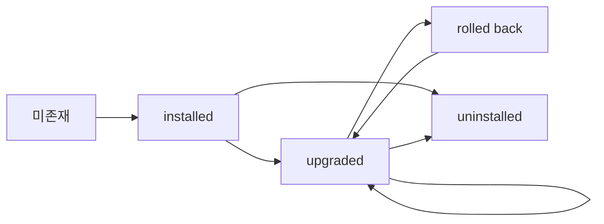

# Helm — 차트 구조, values, subchart, OCI

> Helm은 "Kubernetes 패키지 매니저"라고 소개되지만 실체는 네 가지다.
> **템플릿 엔진·릴리스 매니저·의존성 해결기·OCI 아티팩트 클라이언트**.
> 이 글은 운영에서 매일 마주치는 축만 깊이 다룬다.

- **Chart** 구조와 필수 파일
- **values** 계층 구조(precedence, scope, schema, 패턴)
- **subchart·dependencies**(범위, condition/tags, global)
- **OCI** 기반 배포(`helm push/pull`, provenance·서명)
- **릴리스 수명 주기**(hooks, upgrade, rollback, test)
- **Helm 4(2025-11)** 주요 변경과 **v3(Helm 3.x) 지원 로드맵**

경계: GitOps 맥락(ArgoCD·Flux와의 통합)은 `cicd/` 카테고리에서 다룬다.

---

## 1. Helm 버전 현황

| 라인 | 상태 | 특징 |
|---|---|---|
| Helm 3.x (3.19/3.20) | **프로덕션 기본선** (3.20.x 최신) | 안정, OCI GA, `--take-ownership`(3.17+), `toYamlPretty` 등 증분 개선 |
| Helm 4.0 | `2025-11-12` 릴리스 | Wasm 플러그인, server-side apply, kstatus watcher, OCI digest, 콘텐츠 주소 기반 캐시, SDK API 파괴적 변경 |
| Helm 3 지원 | 버그 수정 `2026-07-08`, 보안 수정 `2026-11-11` | 이후 k8s 신버전 client 갱신만 |
| Chart API v3 | 개발 중 | Helm 4에서 단계 도입 예정. 현행 차트는 `apiVersion: v2` 유지 |

**운영 전략**: 신규 컨트롤 파이프라인은 Helm 4 SDK로 시작하더라도, **차트 자체는
`apiVersion: v2`**를 유지한다. v3 도입 전까지는 4에서 v2 차트가 변함없이 동작한다.

---

## 2. 차트 구조

### 필수·선택 파일

```text
mychart/
├── Chart.yaml           # 메타데이터, 필수
├── values.yaml          # 기본값
├── values.schema.json   # values 스키마 검증, 권장
├── templates/           # 렌더링 대상
│   ├── _helpers.tpl     # 재사용 템플릿 (define 블록 모음)
│   ├── deployment.yaml
│   ├── service.yaml
│   ├── tests/           # helm test 대상, hook=test
│   └── NOTES.txt        # 설치 후 사용자 안내
├── charts/              # subchart tgz, helm dep up로 채워짐
├── crds/                # CRD, helm이 특별 처리 (템플릿 렌더 안 함)
├── README.md
└── .helmignore
```

### `_helpers.tpl` 관용

`_`로 시작하는 파일은 렌더 대상이 아니라 **재사용 template 정의 컨테이너**다.
관용 이름은 다음과 같다.

| template | 용도 |
|---|---|
| `chart.name` | `.Chart.Name`, 63자 제한 |
| `chart.fullname` | `<release>-<chart>`, 이름 기본값 |
| `chart.chart` | `.Chart.Name-.Chart.Version` |
| `chart.labels` | 표준 라벨 블록 (`app.kubernetes.io/*`) |
| `chart.selectorLabels` | Selector용 최소 라벨 |

`helm create`로 생성된 기본 `_helpers.tpl`을 그대로 유지하면, ArgoCD·Flux·
Kubernetes Recommended Labels과의 호환이 자동으로 맞는다.

### NOTES.txt

설치·업그레이드 직후 stdout에 출력된다. 서비스 접근 URL·포트포워딩 명령·
검증 커맨드를 간단히 안내하는 용도. values로 분기해 환경별 메시지도 가능.

### Library 차트

`type: library`로 선언된 차트는 **자체 렌더 대상이 없다**. `define` 블록만
제공해 다른 차트에서 `{{ include "lib.foo" . }}`로 가져다 쓴다.

쓰는 시점:
- 사내 공통 Deployment/Service 보일러플레이트가 수십 개 차트에 중복될 때
- PodSecurityContext·ImagePullSecrets·Affinity 기본값을 조직 표준으로 주입할 때
- subchart로 묶기엔 너무 가볍고, 각자 복붙하기엔 drift가 심할 때

### `Chart.yaml` 필수 필드

| 필드 | 의미 | 주의 |
|---|---|---|
| `apiVersion` | v2 (Helm 3+) | v1은 레거시. 신규 차트는 v2 고정 |
| `name` | 차트 이름 | OCI push 시 basename으로 사용됨 |
| `version` | 차트 SemVer | 이미지·앱 버전과 독립 |
| `appVersion` | 앱 버전 | 이미지 태그 기본값으로 관습적 사용 |
| `type` | `application` / `library` | 라이브러리 차트는 templates 렌더 대상 없음 |
| `dependencies` | subchart 선언 | 별도 섹션 참고 |
| `kubeVersion` | 대상 K8s 제약 | 설치 시 검증됨 |
| `icon`, `annotations` | 메타데이터 | Artifact Hub·UI 표시 |

### CRD 처리의 예외

- `crds/` 디렉터리의 리소스는 템플릿 처리되지 않고 **설치 시 1회만** 적용된다.
- `helm upgrade`는 CRD를 **업데이트하지 않는다**(의도된 동작, 데이터 호환성 보호).
- CRD 갱신 전략: 차트 외부에서 별도 관리하거나, 업그레이드 시 수동 `kubectl apply`.

---

## 3. values — 계층과 우선순위

### 우선순위 (낮음 → 높음)

아래 표의 순서가 그대로 **머지 우선순위**다. 뒤에 올수록 이긴다.

| 소스 | 경로 | 특징 |
|---|---|---|
| 차트 기본 | `values.yaml` | 최저 우선 |
| 사용자 `-f` | 여러 번 지정 가능, **뒤가 우선** | 운영 기본 |
| `--values <URL>` | 원격 values | 3.x 지원 |
| `--set key=val` | CLI 오버라이드 | 다중 가능, 배열은 `key[0]=a` |
| `--set-file key=path` | 파일 내용을 값으로 | cert·script 주입 |
| `--set-string` | 숫자·불린 강제 문자열화 | 이미지 태그 `"1.0"` |

### schema 검증 (`values.schema.json`)

JSON Schema로 **타입·필수·enum·범위**를 강제한다. 잘못된 values가 렌더링 시점이
아닌 `helm install` 단계에서 거부된다.

```json
{
  "$schema": "https://json-schema.org/draft-07/schema#",
  "type": "object",
  "required": ["image", "replicaCount"],
  "properties": {
    "replicaCount": { "type": "integer", "minimum": 1, "maximum": 50 },
    "image": {
      "type": "object",
      "required": ["repository", "tag"],
      "properties": {
        "repository": { "type": "string" },
        "tag":        { "type": "string", "pattern": "^[a-zA-Z0-9._-]+$" },
        "pullPolicy": { "enum": ["Always", "IfNotPresent", "Never"] }
      }
    }
  }
}
```

**부모 차트의 스키마는 subchart 스키마도 함께 검증**한다. 즉, subchart가 갖는
제약을 부모에서 우회할 수 없다.

### 운영상 values 패턴

| 패턴 | 내용 |
|---|---|
| 환경별 분리 | `values-dev.yaml`, `values-stage.yaml`, `values-prod.yaml` |
| 공통 베이스 + 덮어쓰기 | `-f values.yaml -f values-prod.yaml`(뒤가 우선) |
| Secret 분리 | 비밀값은 values에 넣지 말 것. `security/` 카테고리의 External Secrets·Vault 참고 |
| 이미지 태그 주입 | CI가 `--set-string image.tag=$(git sha)` |
| feature flag | `features.newRouter: false`로 토글 후 점진 enable |
| 공통 values lib 차트 | `library` 타입 차트로 partial 재사용 |

### 템플릿에서 흔한 실수

| 실수 | 증상·대책 |
|---|---|
| `{{ .Values.image.tag }}`가 숫자 | 태그 `"1.0"`은 YAML에서 숫자로 파싱, 이미지 조회 실패 → `--set-string` 또는 `quote` 함수 |
| `required` 미사용 | 필수값 누락을 런타임에 발견 → `{{ required "X is required" .Values.x }}` |
| `with`·`range` 안에서 전역 접근 | `.Release`·`.Values` 접근 불가 → `$` root 사용 |
| `tpl` 함수 남용 | values에 템플릿 문자열 넣고 `tpl`로 렌더 → 디버깅·보안 함정 |
| toYaml indent 실수 | `{{ toYaml .Values.x | indent 4 }}`에서 앞 공백 두 줄 다름 → `nindent` 권장 |

---

## 4. subchart·dependencies

### 선언 (`Chart.yaml`)

```yaml
dependencies:
  - name: postgresql
    version: "~15.5.0"          # 패치 범위
    repository: "oci://registry.example.com/charts"
    condition: postgresql.enabled
    tags: [database]
    alias: pg                   # 네임스페이스 충돌 회피
    import-values:              # subchart exports 가져오기
      - child: dbHost
        parent: backend.dbHost
```

### 네 가지 제어 수단

| 수단 | 용도 |
|---|---|
| `condition` | 단일 값 true/false로 포함/제외 |
| `tags` | 여러 dep에 태그, 한 번에 on/off |
| `alias` | 동일 차트를 여러 인스턴스로 |
| `import-values` | subchart 출력을 부모 네임스페이스로 주입 |

### 값 흐름 규칙

1. 부모 `values.yaml`에 subchart 이름 키로 넣으면 subchart 네임스페이스로 주입.
2. **global**은 부모·자식·손자 모두에서 공유. 충돌 시 **부모 global이 우선**.
3. subchart는 부모 values를 **읽지 못한다**. 필요하면 `import-values`로 위로 노출.
4. 스키마는 부모 스키마가 subchart 스키마를 **포함해 검증**한다.

```yaml
# 부모 values.yaml
global:
  imagePullSecrets: [ "regcred" ]   # 모든 subchart에 전파
postgresql:
  enabled: true
  auth:
    database: app
pg:                                 # alias로 재사용
  enabled: true
  auth:
    database: analytics
```

### `helm dependency` 워크플로

```bash
helm dependency update ./mychart     # Chart.lock 생성·tgz 다운로드
helm dependency list   ./mychart
helm dependency build  ./mychart     # Chart.lock 기준 재현
```

- **Chart.lock**은 커밋 대상. 재현성을 보장한다.
- CI 파이프라인: `lint → dep build → template --validate → package → push`.

### 언제 subchart를 쓰지 말 것

- subchart가 사실상 **다른 팀 소유**: 별도 릴리스로 배포하고 app of apps 패턴 사용.
- subchart 버전 차이로 **parent 업그레이드가 빈번하게 막힘**: umbrella를 분리.
- subchart가 단순 YAML 몇 개: **library chart + include** 쪽이 관리 편함.

---

## 5. OCI 레지스트리

### 왜 OCI인가

- `index.yaml` 방식은 HTTP 서버·정적 인덱스 관리가 번거롭고, 차트 수가 많아지면
  **인덱스가 수백 MB**로 커진다.
- OCI는 이미지와 **같은 레지스트리·같은 인증·같은 RBAC**를 쓴다. 보안·공급망 도구
  (cosign, SBOM, Trivy, Harbor 등) 스택이 그대로 붙는다.
- Helm 3.8에서 GA, **Helm 4에서 digest 기반 참조**가 1급 지원된다.

### 로그인·push·pull

```bash
# 인증(ghcr, Harbor, Artifactory, ECR 등 OCI 호환이면 모두 가능)
helm registry login registry.example.com -u user -p "$TOKEN"

# 차트를 tgz로 패키징
helm package ./mychart --version 1.4.2

# push — basename=차트이름, tag=차트버전
helm push mychart-1.4.2.tgz oci://registry.example.com/charts
# → oci://registry.example.com/charts/mychart:1.4.2

# 설치 (install은 oci:// 직접 지원)
helm install api oci://registry.example.com/charts/mychart \
  --version 1.4.2 -f values-prod.yaml

# pull (불변 참조가 필요할 때는 digest 사용)
helm pull oci://registry.example.com/charts/mychart \
  --version 1.4.2 --untar
```

### 참조 형태

| 형태 | 예 | 특성 |
|---|---|---|
| 태그 | `oci://.../mychart:1.4.2` | 가변. 덮어쓰기 가능 |
| 다이제스트 | `oci://.../mychart@sha256:...` | 불변. **공급망 보증에 필수** |
| 버전 플래그 | `--version 1.4.2`, `--version "~1.4"` | CLI에서 SemVer 범위 해석 |

### Provenance·서명

| 옵션 | 방식 |
|---|---|
| 전통적 GPG `.prov` | `helm package --sign` → `.tgz + .prov` 동시 push, `helm verify`로 검증 |
| cosign (권장) | `cosign sign oci://.../mychart:1.4.2` — 이미지와 동일한 서명 체계 |
| helm-sigstore 플러그인 | Sigstore keyless·투명 로그 연동 |

**운영에서는 cosign keyless + 정책 엔진**이 표준 조합이다. 검증은 admission 단
(`Kyverno`/`Sigstore policy-controller`) 또는 CD 파이프라인에서 수행한다.
도구 자체의 상세는 `security/` 공급망 섹션을 참고.

cosign 서명 대상은 **OCI manifest digest**다. 차트 OCI artifact는
이미지와 동일하게 `cosign sign oci://registry/charts/mychart:1.4.2` 형태로
서명한다. 이미지용 `--type=` 옵션은 차트에는 그대로 쓰지 말고, 차트는 별도
레퍼런스(`@sha256:...`)로 정확히 pin한 뒤 서명해야 서명·태그 이동 공격을
막을 수 있다.

### `.prov` 자동 업로드

push 시점에 `.tgz`와 같은 디렉터리에 `.prov`가 있으면 **자동으로 추가 레이어**로
업로드된다. 수동 업로드 불필요.

---

## 6. 릴리스 수명 주기

### install·upgrade·rollback 상태 전이



- `helm history <release>`로 리비전 전체 추적.
- `helm rollback <release> <rev>`로 임의 리비전 복귀.
- 기본은 **in-place upgrade**. 파괴적 변경은 blue/green 릴리스 2개로 운영.

### 자주 쓰는 플래그

| 플래그 | 효과 |
|---|---|
| `--install` | 릴리스 없으면 install, 있으면 upgrade (**멱등**, CI 필수) |
| `--atomic` | 실패 시 자동 롤백 |
| `--wait --wait-for-jobs --timeout=10m` | 리소스 Ready까지 대기 |
| `--take-ownership` | 기존에 있던 k8s 리소스 인수 (3.17+) |
| `--create-namespace` | 없는 네임스페이스 생성 |
| `--reset-values` / `--reuse-values` | 이전 values 무시 / 재사용 |
| `--dry-run=server` | admission까지 검증만 |
| `--post-renderer <plugin>` | 렌더 결과 후처리 (Helm 4부터 **플러그인만** 허용) |
| `--history-max 10` | 저장 리비전 수. 너무 크면 Secret이 `1 MiB` 한계에 걸려 upgrade 실패 |
| `--kube-version 1.32.0` | 에어갭·CI에서 **서버 없이 렌더**. `.Capabilities.KubeVersion`을 오버라이드 |

### hooks — 릴리스에 작업 끼워넣기

| 시점 | 리소스 |
|---|---|
| `pre-install` / `post-install` | 스키마 마이그레이션, 초기 데이터 |
| `pre-upgrade` / `post-upgrade` | backup, 이관 Job |
| `pre-rollback` / `post-rollback` | 롤백 시 data fixup |
| `pre-delete` / `post-delete` | 리소스 정리 |
| `test` | `helm test`에서만 실행, 스모크 검증 |

```yaml
metadata:
  annotations:
    "helm.sh/hook": pre-upgrade,pre-install
    "helm.sh/hook-weight": "10"
    "helm.sh/hook-delete-policy": before-hook-creation,hook-succeeded
```

- **weight**: 낮을수록 먼저. 오름차순 직렬 실행.
- **delete-policy**: 기본은 재실행 시 남는다 → `before-hook-creation`로 중복 방지.
- Job hook가 실패하면 릴리스 전체 실패. `--atomic`과 조합 시 자동 롤백.

### `helm test` 패턴

- `templates/tests/` 하위에 `helm.sh/hook: test` 주석을 붙인 Job/Pod 배치.
- `helm test <release>`로 실행. CI에서 배포 검증 게이트로 사용.
- Test Pod는 실제 서비스 엔드포인트를 찌르는 smoke 검사 수준을 권장(통합 테스트는 별도 파이프라인).

### Server-Side Apply (Helm 4)

- Helm 4는 CSA(Client-Side Apply)에 더해 **SSA가 네이티브**.
- field ownership 충돌 해결이 명시적 — kubectl SSA와 동일 모델.
- 3-way merge 사고(삭제 필드 유령 잔존)를 근본 해결.
- 기존 3.x 릴리스 → 4 SSA 전환 시 **take-over 시 충돌 재현**이 있으므로 테스트 클러스터에서 먼저.

---

## 7. 주변 생태계 — 언제 Helm 자체로 부족한가

### 상위 오케스트레이터

| 도구 | 역할 | 언제 쓰나 |
|---|---|---|
| **helmfile** | 여러 릴리스·values·repo를 **선언적 파일 하나**로 묶어 apply | 환경별·네임스페이스별 릴리스 수 ≥ 5, CLI 래핑이 필요 |
| **Helmsman** | 비슷한 선언적 관리, TOML/YAML | 간단한 릴리스 목록을 버전 관리하고 싶을 때 |
| **ArgoCD / Flux** | GitOps에서 Helm 차트를 Application으로 감쌈 | 프로덕션 CD 표준. GitOps 섹션(`cicd/`)에서 상세 |

helmfile은 **CD가 없는 팀의 중간 단계** 또는 **CI에서 일괄 드라이런**용으로 유용하다.
GitOps를 도입했다면 helmfile 계층은 대부분 ArgoCD ApplicationSet으로 대체된다.

### 플러그인 — 기존 vs Wasm 전환

```bash
helm plugin list
helm plugin install https://github.com/databus23/helm-diff
helm plugin update diff
```

| 시대 | 구조 | 특징 |
|---|---|---|
| Helm 3 | shell/Go 바이너리를 `plugin.yaml`로 등록 | 임의 코드 실행, 보안 경계 약함 |
| Helm 4 | **Wasm 모듈** + post-renderer·downloader 역할 | 샌드박스 실행, 공급망·권한 명확 |

3.x에서 널리 쓰던 `helm-diff`, `helm-secrets`, `helm-s3` 등은 4 이주 시
**Wasm 포팅 여부**를 먼저 확인한다. 미포팅 플러그인에 의존하는 파이프라인은
3의 보안 패치 종료(`2026-11-11`) 전에 대체 경로를 만들어야 한다.

### 공개 리포지토리 이슈 — Bitnami 차트

가장 많이 쓰이던 `charts.bitnami.com/bitnami`는 `2025-08`부터 **일부 이미지·차트가
유료 라이선스 레지스트리로 이동**하면서 공개 태그가 제한되었다. 기존 설치가
`imagePullBackOff`로 멈추는 사례가 빈번하다.

대응:
- 현재 쓰는 차트·이미지가 Bitnami에 의존하는지 먼저 인벤토리.
- 공개 미러(`bitnamicharts/archive`)나 대체 차트(cert-manager 공식, postgres-operator 등)로 이관.
- 사내 OCI 레지스트리에 pin한 버전을 미러해 두고 digest로 참조.

---

## 8. Helm 4 — 변화와 이주 판단

SDK 공개 API의 파괴적 변경은 **CLI 사용자보다 도구 제작자**에게 영향이 크다.
ArgoCD·Flux·Flagger·사내 operator가 Helm SDK에 의존한다면, 업그레이드 계획의
첫 단계는 "SDK 소비자 재빌드"다.

| 변경 | 영향 |
|---|---|
| SDK 공개 API 파괴적 변경 | SDK 소비자(operators·CD 툴)는 재빌드 필요 |
| Plugin이 **Wasm 기반**으로 재설계 | 안전·휴대성 향상, 기존 쉘 플러그인은 재패키징 필요 |
| `--post-renderer <path>` 제거 | **반드시 플러그인 이름**으로 지정. Kustomize 포스트렌더링은 공식 플러그인 경유 |
| kstatus watcher | `--wait`가 `Ready`를 더 정확히 판정 |
| OCI digest 지원 | `@sha256:...` 1급 참조 |
| 콘텐츠 기반 캐시 | 반복 pull 가속 |
| slog 로깅 | SDK·CLI 로그 포맷 변화 |
| k8s 1.15 이하 지원 중단 | 과거 레거시 운용체와 단절 |

### 이주 체크리스트

1. **차트는 그대로**(v2). 우선 CLI와 SDK 컨슈머 먼저.
2. `--post-renderer`로 Kustomize 등을 쓰던 파이프라인 → 공식 플러그인(helm-post-renderer) 경유.
3. ArgoCD·Flux 지원 버전 확인 — 두 도구 모두 단계적 Helm 4 지원.
4. 사내 플러그인(bash/Go) → Wasm 포팅 계획 수립.
5. Helm 3 리포지토리 유지 시, 보안 패치 `2026-11-11`까지 마이그레이션 완료 목표.

---

## 9. 운영 팁 요약

| 상황 | 권장 |
|---|---|
| 재현 가능한 설치 | `--install --atomic --wait --timeout` 기본 조합 |
| 값 충돌 디버그 | `helm template` + `helm get values`·`helm get manifest` |
| 긴 values 파일 분리 | `values.yaml` + `values-<env>.yaml` 레이어링 |
| Secret 값 주입 | values에 넣지 말 것. `external-secrets` + `valueFrom` 참고 |
| 의존성 고정 | `Chart.lock` 커밋 필수 |
| 차트 무결성 | `helm verify` 또는 cosign 검증 게이트 |
| 레지스트리 제한 | Artifactory·Harbor·ECR 프록시로 외부 호출 최소화 |
| 롤백 실험 | 스테이징에서 `--history-max`를 키워 `helm rollback` 드릴 |
| 대량 차트 | OCI digest 핀 + 캐시 프록시 |
| 차트 CI | `lint → dep build → template --validate → kubeconform/policy → package → push` |
| Helm 3 잔여 | `2026-11-11` 보안 패치 종료 기한 내 Helm 4 이주 |

---

## 참고 자료

- [Helm Charts](https://helm.sh/docs/topics/charts/) (2026-04-24)
- [Helm Dependencies](https://helm.sh/docs/chart_best_practices/dependencies/) (2026-04-24)
- [Subcharts and Global Values](https://helm.sh/docs/chart_template_guide/subcharts_and_globals/) (2026-04-24)
- [Chart Hooks](https://helm.sh/docs/topics/charts_hooks/) (2026-04-24)
- [OCI-based registries](https://helm.sh/docs/topics/registries/) (2026-04-24)
- [Helm 4 Released — 2025-11-12](https://helm.sh/blog/helm-4-released/) (2026-04-24)
- [Helm 4 Changelog](https://helm.sh/docs/changelog/) (2026-04-24)
- [Path to Helm v4](https://helm.sh/blog/path-to-helm-v4/) (2026-04-24)
- [Storing Helm Charts in OCI Registries](https://helm.sh/blog/storing-charts-in-oci/) (2026-04-24)
- [Helm Releases on GitHub](https://github.com/helm/helm/releases) (2026-04-24)
