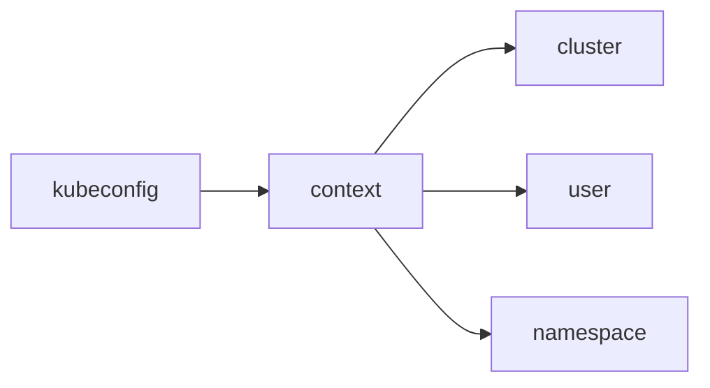

# kubectl 팁 — context, jsonpath, debug, krew

> `kubectl`은 "쿼리 언어 + 디버거 + 패키지 매니저 + 출력 포매터"를 겸한다.
> get/apply만 쓰면 10 %도 활용하지 못한 것이다. 이 글은 운영 현장에서
> **매일 쓰게 되는 기능**을 네 축으로 정리한다.

- **context·kubeconfig**: 여러 클러스터를 안전하게 오가기
- **출력 가공**: `-o jsonpath`·`-o go-template`·`-o kyaml`·`--sort-by`
- **디버깅**: `kubectl debug`로 Pod·Node에 ephemeral 컨테이너 투입
- **확장**: `krew`와 플러그인, `kuberc`로 개인 환경 표준화

선행 글: [API Server](../architecture/api-server.md) · [Pod 디버깅](../troubleshooting/pod-debugging.md) · [Pod Security Admission](../security/pod-security-admission.md).

---

## 1. context·kubeconfig 관리

### 구조

kubeconfig는 `clusters`·`users`·`contexts` 세 레이어의 조합표다.
**context = cluster + user + namespace** 튜플이며, 현재 쓰는 조합을
`current-context`로 지정한다.

| 구성 요소 | 의미 | 전형적 값 |
|---|---|---|
| cluster | API server 엔드포인트·CA | `https://api.prod.example:6443` |
| user | 인증 자격 | x509 cert, token, OIDC exec plugin |
| context | cluster+user+namespace 튜플 | `prod-admin@prod` |



### 핵심 명령

```bash
# 현재 context 확인
kubectl config current-context

# context 목록·전환
kubectl config get-contexts
kubectl config use-context prod-admin@prod

# 현재 context의 기본 네임스페이스만 바꾸기
kubectl config set-context --current --namespace=observability

# 여러 kubeconfig 병합해서 쓰기
export KUBECONFIG=~/.kube/config:~/.kube/dev.yaml:~/.kube/prod.yaml
```

### 안전 원칙

| 원칙 | 이유 |
|---|---|
| prod·stage·dev를 **별도 파일**로 분리 | 실수로 prod에 `apply` 방지 |
| context 이름에 환경 prefix | 프롬프트·로그에서 즉시 식별 |
| kube-ps1·starship 프롬프트 표시 | "지금 어느 클러스터인가"를 시각화 |
| `kubectl ctx` / `kubectx` 사용 | 긴 `config use-context` 반복 회피 |
| `--context` 플래그로 **명시적** 실행 | 위험 명령은 current-context에 의존하지 않기 |

prod 클러스터 조작은 **current-context에 의존하지 않는 편이 안전**하다.

```bash
# nuke 위험 명령은 반드시 --context 명시
kubectl --context=prod-readonly get pods -A
kubectl --context=stage-admin delete ns stale
```

---

## 2. 출력 포맷 — jsonpath·go-template·kyaml

### 출력 포맷 종류

| 포맷 | 언제 쓰나 | 비고 |
|---|---|---|
| `-o wide` | 한 줄 요약에 node·IP 추가 | 기본 표에 컬럼만 더해짐 |
| `-o yaml` / `-o json` | 리소스 스펙 전문 검사 | 대량 리스트에는 무겁다 |
| `-o kyaml` | `1.34+` YAML 함정 회피 | `KUBECTL_KYAML=true` 환경 변수 필요 |
| `-o jsonpath=...` | 단순 필드 추출·스크립트 | 조건·반복 표현력은 약함 |
| `-o go-template=...` | 조건·반복·포맷팅 | 본격 템플릿. 파일은 `-o go-template-file=` |
| `-o custom-columns=...` | 표 형태 요약 | 줄당 하나의 리소스 |
| `--sort-by=...` | jsonpath 키로 정렬 | `-o custom-columns`와 조합 |

### KYAML — `1.34` 신규 출력 포맷

YAML의 고질적 함정(공백 민감, `no`/`off` 같은 암묵 불린 캐스팅, 인용 누락)을
피하도록 **Kubernetes에 맞춘 YAML 서브셋**이 도입되었다. `1.34`에서 알파
(opt-in, `KUBECTL_KYAML=true`)로 들어왔고, 이후 릴리즈에서 베타 승격이
논의 중이다(확정 일정은 릴리즈 노트로 재확인 필요). 출력만 KYAML이고 입력은
표준 YAML 그대로 받는다(모든 KYAML은 valid YAML이다).

```bash
# 1.34+
export KUBECTL_KYAML=true
kubectl get deploy -o kyaml
```

### JSONPath 핵심 패턴

kubectl의 JSONPath는 [표준 JSONPath](https://kubernetes.io/docs/reference/kubectl/jsonpath/)에
**내장 함수 + `range`/`end` 확장**을 얹은 방언이다.

| 표현 | 의미 |
|---|---|
| `.items[*].metadata.name` | 리스트의 모든 name |
| `.items[0].spec.containers[*].image` | 첫 리소스의 모든 이미지 |
| `.items[?(@.status.phase=="Running")]` | 필터 |
| `{range .items[*]}{.metadata.name}{"\n"}{end}` | 반복 출력 |
| `{.items[*].status.conditions[?(@.type=="Ready")].status}` | 중첩 조건 |

**실전 예시**:

```bash
# 모든 Pod의 node 분포
kubectl get pod -A -o jsonpath='{range .items[*]}{.spec.nodeName}{"\n"}{end}' \
  | sort | uniq -c | sort -rn

# 이미지 태그 인벤토리
kubectl get pod -A -o jsonpath='{range .items[*]}{range .spec.containers[*]}{.image}{"\n"}{end}{end}' \
  | sort -u

# 컨테이너별 requests.cpu / limits.memory
kubectl get pod -n kube-system -o custom-columns=\
NAME:.metadata.name,\
CPU_REQ:.spec.containers[*].resources.requests.cpu,\
MEM_LIM:.spec.containers[*].resources.limits.memory

# CPU request 기준 정렬
kubectl get pod -A --sort-by='.spec.containers[0].resources.requests.cpu'
```

### JSONPath vs go-template

| 기준 | `jsonpath` | `go-template` |
|---|---|---|
| 단순 필드 추출 | ✅ 짧다 | 장황 |
| 조건 분기 | 제한적 | ✅ `if`/`else` |
| 반복 중 인덱스 사용 | 어려움 | ✅ |
| 함수 호출 (`printf`) | 없음 | ✅ |
| 표현식 디버깅 | 어려움 | 구문 에러 메시지 명확 |

복잡한 포맷팅은 `go-template-file`로 빼서 재사용한다.

```gotemplate
{{- range .items }}
{{ .metadata.namespace }}/{{ .metadata.name }}
  {{- range .spec.containers }}
  - {{ .name }}: {{ .image }}
  {{- end }}
{{- end }}
```

```bash
kubectl get pod -A -o go-template-file=pod-inventory.tmpl
```

### `--raw`·`--chunk-size`

| 플래그 | 용도 |
|---|---|
| `--raw /apis/metrics.k8s.io/v1beta1/nodes` | API server에 직접 쿼리, 클라이언트 가공 없이 JSON 수신 |
| `--chunk-size=500` | 대규모 리스트를 청크로 페이징 |
| `--server-print=false` | 서버 사이드 출력 포맷 비활성, raw 객체 수신 |

---

## 3. 디버깅 — `kubectl debug`

### 세 가지 모드

| 모드 | 대상 | 결과물 |
|---|---|---|
| ephemeral 컨테이너 | 실행 중 Pod | Pod에 디버그 컨테이너 주입 |
| Pod copy | 크래시 Pod | 원본을 복제해 명령·이미지 변경 |
| Node | 노드 | 호스트 네임스페이스에서 실행되는 Pod 생성 |

**원본 워크로드를 수정하지 않는다**는 점이 핵심이다. distroless·scratch
이미지처럼 디버깅 도구가 없는 컨테이너에서도 `busybox`·`nicolaka/netshoot`를
이어붙여 쉘을 띄울 수 있다.

### Ephemeral 컨테이너

```bash
# Pod에 netshoot 주입, 대상 컨테이너 PID 공유
kubectl debug -it pod/web-5d4b \
  --image=nicolaka/netshoot \
  --target=app \
  --profile=general

# distroless 컨테이너를 "복사"해 shell 추가
kubectl debug pod/web-5d4b \
  --copy-to=web-5d4b-debug \
  --container=app \
  --image=busybox:1.36 \
  --share-processes -- sleep 3600
```

- 주입된 ephemeral 컨테이너는 **삭제 불가**: 필요 없으면 Pod 자체를 재생성.
- `--target`이 있어야 `/proc` 공유로 대상 프로세스를 볼 수 있다.
- Pod Security Admission의 `restricted` 프로파일에서는 `--profile=restricted`
  외에는 거부된다. 프로파일과 정책 충돌은 [PSA](../security/pod-security-admission.md) 참고.

### `--profile` 선택

| 프로파일 | 권한·NS 조정 | 전형적 용도 |
|---|---|---|
| `legacy` | 구버전 호환 | 신규 쓰지 말 것 |
| `general` | 보수적 기본값 | 일반 쉘·네트워크 점검 |
| `baseline` | PSA baseline 준수 | baseline 클러스터 |
| `restricted` | `runAsNonRoot` 등 강화 | restricted 네임스페이스 |
| `netadmin` | `NET_ADMIN`·`NET_RAW` | tcpdump·iptables |
| `sysadmin` | privileged | 노드 디스크·커널 점검 |

기본 프로파일은 버전에 따라 바뀌고 있다(`legacy` → `general`로 이동 중, 향후
`legacy` 제거 예정). PSA가 걸린 네임스페이스에서는 `legacy` 기본이 거부되는
경우가 많다. **항상 `--profile`을 명시**하는 것이 유일하게 안전한 습관이다.

### 노드 디버깅

```bash
# 노드에 debug Pod 생성, 호스트 / 를 /host에 마운트
kubectl debug node/worker-03 -it --image=busybox:1.36 --profile=sysadmin
# 컨테이너 안에서
chroot /host
# 이제 worker-03의 루트에서 작업 (systemctl, journalctl, ...)
```

- 호스트 IPC·Network·PID 네임스페이스에서 실행된다.
- 디스크 풀, kubelet 로그, 컨테이너 런타임 장애 조사에 적합.
- 노드 디버그 Pod는 일반 Pod라 **종료해도 남는다**. 끝나면 반드시 삭제.

### `exec`·`logs`·`attach` 사용 기준

| 도구 | 전제 | 장단점 |
|---|---|---|
| `exec` | 컨테이너가 Running, 쉘·툴 존재 | 가장 가볍다 |
| `logs` | 로그 스트림 존재 | `-f` tail, `--previous`로 이전 인스턴스 |
| `attach` | stdin/tty 필요 | 컨테이너 **1개**에만 연결 |
| `debug` | ephemeral 허용 클러스터 | 툴 없는 이미지·크래시 Pod 대응 |

`logs --previous` + `--timestamps`는 CrashLoopBackOff 디버깅의 첫 수.

---

## 4. 확장 — krew·플러그인·kuberc

### krew 개요

krew는 SIG-CLI가 유지하는 **kubectl 플러그인 패키지 매니저**다. `kubectl-<name>`
이름의 바이너리를 PATH에서 찾아 서브커맨드로 연결하는 기본 메커니즘 위에,
**중앙 인덱스·버전 관리·업그레이드**를 얹은 계층이다.

```bash
# 설치 (macOS/Linux). krew 자체도 krew로 관리된다.
kubectl krew update
kubectl krew install ctx ns neat view-secret tree who-can

# 업그레이드
kubectl krew upgrade
```

### 운영에서 자주 쓰는 플러그인

| 플러그인 | 기능 | 대체 수단 |
|---|---|---|
| `ctx` / `ns` | context·namespace 빠른 전환 | `kubectl config ...` |
| `neat` | manifest에서 서버 기입 필드 제거 | 수동 편집 |
| `tree` | 소유 그래프 시각화 | `get events` |
| `view-secret` | Secret base64 디코딩 | `jsonpath | base64 -d` (평문이 셸 히스토리·로그에 남음) |
| `who-can` | 특정 동작 가능 주체 | `auth can-i --as=...` |
| `rbac-tool` | RBAC 시각화·감사 | 수동 그래프 |
| `resource-capacity` | node 별 cpu/mem 할당·사용 | `top node`·수동 계산 |
| `outdated` | 이미지 새 태그 확인 | 별도 스캐너 |
| `score` / `kubescape` | 워크로드 보안·모범사례 검사 | — |
| `stern` / `tail` | 멀티 Pod 로그 tail | `logs -f` 반복 |
| `sniff` | Pod 트래픽 캡처 | `tcpdump` (ephemeral) |

플러그인은 **바이너리 실행**이므로 신뢰할 수 있는 인덱스·서명 경로로만 설치한다.
개인 PC뿐 아니라 공용 bastion에 설치한 플러그인은 공급망 리스크의 일부다.

### kuberc — 개인 kubectl 설정

`1.33` 알파, `1.34` 베타로 도입된 개인 설정 파일이다. kubeconfig에 섞여
있던 alias·기본 플래그를 **별도 파일**(`~/.kube/kuberc`)로 분리해 공유·버전
관리를 단순화한다.

활성화 방법:

| 버전 | 활성화 | 경로 오버라이드 |
|---|---|---|
| `1.33` (알파) | `KUBECTL_KUBERC=true` 환경 변수 필수 | `--kuberc=<path>` 또는 `KUBERC=<path>` |
| `1.34+` (베타, 기본 on) | 환경 변수 없이 동작 | `--kuberc=<path>` / `KUBERC=<path>` |

공용 bastion처럼 여러 사용자가 공유하는 환경에서는 `KUBERC=/etc/kube/team.kuberc`
같은 시스템 기본값을 세팅하고, 각자 `~/.kube/kuberc`로 override하는 구성이
깔끔하다.

```yaml
# ~/.kube/kuberc
apiVersion: kubectl.config.k8s.io/v1beta1
kind: Preference
defaults:
  - command: apply
    options:
      - name: server-side
        default: "true"
  - command: delete
    options:
      - name: interactive
        default: "true"
aliases:
  - name: getn
    command: get
    prependArgs: ["nodes"]
    options:
      - name: output
        default: "wide"
  - name: runx
    command: run
    options:
      - name: image
        default: "busybox:1.36"
      - name: rm
        default: "true"
      - name: stdin
        default: "true"
      - name: tty
        default: "true"
```

- `defaults`: 특정 서브커맨드의 기본 플래그. 예를 들어 `apply`를 항상
  server-side로 강제해 3-way merge 사고를 줄인다.
- `aliases`: 셸 alias와 달리 **kubectl 내부에서 인식**되므로 플러그인·래퍼가
  그대로 인식한다.
- kubeconfig와 달리 **민감 정보가 없다** — Git으로 공유해도 된다.

beta 단계이므로 활성화 플래그를 확인하고, 팀 공통 기본값은 repo에
`kuberc.sample`로 두고 개인 `~/.kube/kuberc`로 링크하는 것이 실용적이다.

### 커스텀 플러그인 만들기

1. `kubectl-foo` 실행 가능 파일을 PATH에 둔다.
2. `kubectl foo ...` 실행 시 해당 바이너리가 인자를 받아 실행된다.
3. 사내 공통 유틸(예를 들어 운영 클러스터 전환·감사 로그 수집)은
   **크루 인덱스에 올리지 말고** 사내 바이너리 배포 채널로 관리한다.

```bash
# PATH 확인
kubectl plugin list
```

---

## 5. 매일 쓰는 명령 — 빠뜨리면 사고로 이어지는 기본기

### 변경 전 프리뷰·롤백

| 명령 | 용도 |
|---|---|
| `kubectl diff -f manifest.yaml` | 서버와 비교한 변경점 미리 보기. **apply 전 확정 단계** |
| `kubectl apply --dry-run=server -f -` | admission까지 통과하는지 검증 |
| `kubectl apply --server-side --field-manager=gitops --force-conflicts` | 서버 사이드 apply, 소유권 충돌 강제 인수 |
| `kubectl apply --prune -l app=foo --applyset=...` | `--applyset`(1.27 알파, 1.30 베타)로 prune 범위 명시 |
| `kubectl rollout status deploy/api --timeout=5m` | 배포 완료 판정 기준선 |
| `kubectl rollout history deploy/api --revision=3` | 리비전 상세 |
| `kubectl rollout undo deploy/api --to-revision=2` | 즉시 롤백 |
| `kubectl rollout restart deploy/api` | Pod 전체 재기동(설정 변경 반영) |

`apply --prune`은 과거 `-l` 라벨만으로 동작해 **삭제 대상이 의도치 않게 확장되는**
사고가 잦았다. `--applyset`은 ApplySet CR에 범위를 못박아 이를 방지한다.
GitOps가 없는 임시 환경에서 prune을 쓸 때는 `--applyset` 조합을 기본으로 둔다.

### 스키마 탐색·대기·관찰

| 명령 | 용도 |
|---|---|
| `kubectl explain deploy.spec.strategy --recursive` | CRD 포함 모든 필드 트리 덤프 |
| `kubectl api-resources --verbs=list,watch -o name` | 현재 클러스터의 리소스 종류 |
| `kubectl api-versions` | 활성 API 그룹·버전 |
| `kubectl wait --for=condition=Ready pod -l app=api --timeout=120s` | CI·스크립트에서 상태 동기화 |
| `kubectl wait --for=delete pod/foo --timeout=60s` | 삭제 완료 대기 |
| `kubectl get events -A --sort-by=.lastTimestamp -w` | 운영 1번 명령. 경보 맥락 파악 |
| `kubectl top pod -A --sort-by=cpu` | metrics-server 기반 실시간 사용량 |
| `kubectl top node` | 노드별 할당·사용 |

### 노드·Pod 운영

| 명령 | 용도 |
|---|---|
| `kubectl drain node/worker-03 --ignore-daemonsets --delete-emptydir-data` | 유지보수 전 eviction |
| `kubectl cordon / uncordon` | 스케줄링 on/off. 자세한 내용은 [노드 유지보수](../upgrade-ops/node-maintenance.md) |
| `kubectl label node worker-03 role=gpu` | 스케줄링 키 부여 |
| `kubectl annotate pod foo debug.acme.io/ticket=1234 --overwrite` | 감사·추적 메타데이터 |
| `kubectl cp foo:/var/log/app.log ./app.log` | 컨테이너 파일 복사. `tar` 필요, 심볼릭 링크 주의 |
| `kubectl port-forward svc/api 8080:80` | 로컬 개발·점검. **프로덕션 상시 경로로 쓰지 말 것**(SPoF, 인증 우회 가능) |
| `kubectl exec -it deploy/api -c sidecar -- sh` | Deployment·컨테이너 지정 exec |

### 권한·리소스 점검 — `--v` 로그로 RBAC 디버그

`--v=6`은 요청 URL, `--v=8`은 요청 바디, `--v=9`는 응답 바디까지 출력한다.
`Forbidden` 응답은 사유가 바디에 담기므로 최소 `--v=8`이 필요하다.

```bash
kubectl --v=8 get secret -n payments 2>&1 | grep -iE 'forbidden|reason'
# ... "reason": "Forbidden", "message": "secrets \"x\" is forbidden: User
#       \"system:serviceaccount:app:api\" cannot get resource \"secrets\"..."
```

곧이어 `auth can-i --as=...`로 주체를 바꿔가며 재현한다.

---

## 6. 자주 빠뜨리는 옵션

| 옵션 | 효과 |
|---|---|
| `--dry-run=server` | admission까지 통과시켜 검증, 오브젝트는 생성 안 함 |
| `--server-side` | 서버 사이드 apply. field ownership이 충돌 난 뒤라면 `--force-conflicts` |
| `--field-selector` | `status.phase=Running`, `spec.nodeName=xyz` 등으로 서버 필터링 |
| `--selector` / `-l` | 라벨 셀렉터 |
| `--show-labels` | get 결과에 라벨 컬럼 추가 |
| `-w` / `--watch` | stream. `--watch-only`는 초기 리스트 생략 |
| `--as`, `--as-group` | impersonation. RBAC 디버그 핵심 |
| `--v=6/8/9` | verbosity. 8부터 요청 바디, 9는 응답까지 |
| `--timeout=30s` | apply·rollout·delete 대기 상한 |
| `rollout status --timeout=Ns` | 배포 완료 판정의 기준선 |

### 권한 점검 3종

```bash
# 내가 할 수 있는가
kubectl auth can-i create pods -n payments
# 특정 SA가 할 수 있는가
kubectl auth can-i create pods --as=system:serviceaccount:payments:app -n payments
# 내 권한 전체 요약 (1.30+)
kubectl auth whoami
```

---

## 7. 운영 팁 요약

| 상황 | 명령·옵션 |
|---|---|
| "어느 클러스터인지 잊지 말자" | `kube-ps1` + `--context` 명시 |
| prod 전용 readonly context | `user`에 read 전용 ServiceAccount·OIDC 그룹 매핑 |
| CrashLoopBackOff 첫 수 | `logs --previous --timestamps` → `describe` → `debug --copy-to` |
| distroless 이미지 디버그 | `debug --image=nicolaka/netshoot --target=app` |
| 노드 디스크 풀 | `debug node/<n> --profile=sysadmin` → `chroot /host` |
| RBAC 미스 추적 | `--v=8`로 forbidden 응답 확인 → `auth can-i --as=...` |
| 대량 리스트 | `--chunk-size=500` + jsonpath 파이프 |
| apply 충돌 | `--server-side --force-conflicts` (소유권 넘겨받기) |
| alias·기본 플래그 표준화 | kuberc에 공통값, 개인 override |
| 플러그인 버전 드리프트 | `krew upgrade`를 CI로 주기 실행 |

---

## 참고 자료

- [kubectl overview](https://kubernetes.io/docs/reference/kubectl/) (2026-04-24)
- [JSONPath Support](https://kubernetes.io/docs/reference/kubectl/jsonpath/) (2026-04-24)
- [kubectl debug reference](https://kubernetes.io/docs/reference/kubectl/generated/kubectl_debug/) (2026-04-24)
- [Debug Running Pods — Ephemeral Containers](https://kubernetes.io/docs/tasks/debug/debug-application/debug-running-pod/) (2026-04-24)
- [Ephemeral Containers](https://kubernetes.io/docs/concepts/workloads/pods/ephemeral-containers/) (2026-04-24)
- [Kubectl user preferences (kuberc)](https://kubernetes.io/docs/reference/kubectl/kuberc/) (2026-04-24)
- [Kubernetes v1.34 — kuberc Beta](https://kubernetes.io/blog/2025/08/28/kubernetes-v1-34-kubectl-kuberc-beta/) (2026-04-24)
- [Kubernetes v1.34 Release — Of Wind & Will](https://kubernetes.io/blog/2025/08/27/kubernetes-v1-34-release/) (2026-04-24)
- [Krew — kubectl plugin manager](https://krew.sigs.k8s.io/) (2026-04-24)
- [kubectl plugins index](https://krew.sigs.k8s.io/plugins/) (2026-04-24)
- [Extend kubectl with plugins](https://kubernetes.io/docs/tasks/extend-kubectl/kubectl-plugins/) (2026-04-24)
