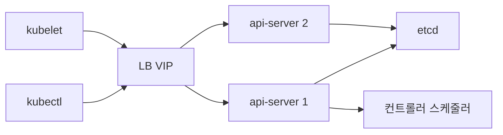
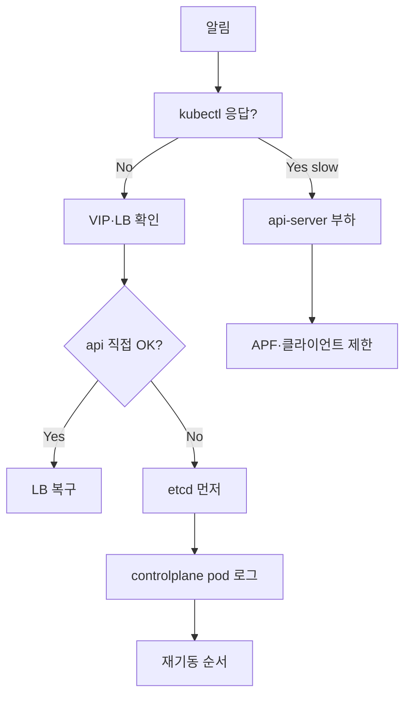

# 컨트롤 플레인 장애

컨트롤 플레인이 죽으면 **신규 Pod 생성·노드 조인·스케일링·자동 치유**가
모두 멎는다. 다만 **기존 워크로드는 계속 돈다** — kube-proxy·CNI 경로가
노드 로컬에 살아 있기 때문. 이 비대칭을 이해하면 장애 중 "지금
당장 해야 할 것"과 "복구 후에 해도 되는 것"이 분리된다.

이 글은 컴포넌트별 증상·복구 절차, HA 클러스터의 쿼럼 손실 시나리오,
LB·인증서·시간 동기화 문제를 운영 관점으로 정리한다.

> 연관: [etcd 트러블슈팅](./etcd-troubleshooting.md) ·
> [K8s 에러 메시지](./k8s-error-messages.md) ·
> [HA 클러스터 설계](../cluster-setup/ha-cluster-design.md) ·
> [인증서 관리](../cluster-setup/certificates.md)

---

## 1. 컨트롤 플레인 구성 요소

장애를 잘 고치려면 **요청 경로**를 머릿속에 그려야 한다.



| 컴포넌트 | 역할 | 장애 즉시 영향 |
|---|---|---|
| kube-apiserver | 모든 요청의 유일한 관문 | 클러스터 조작 불가 |
| etcd | 상태 저장소 | api-server가 기동·응답 못 함 |
| kube-controller-manager | 컨트롤러 루프(Deployment, Node 등) | 자동 치유·재조정 정지 |
| kube-scheduler | Pod 스케줄링 결정 | 신규 Pod가 Pending에 쌓임 |
| kubelet (각 노드) | 노드 에이전트, static pod 관리 | 해당 노드 NotReady |
| kube-proxy / CNI | 서비스 라우팅 | 기존 연결은 유지, 변경 미반영 |

**kube-controller-manager와 kube-scheduler는 liveness만 있으면 즉시
재시작되지 않는다**. leader election으로 1개만 활성, 나머지는 대기.

---

## 2. "클러스터가 먹통" 1차 진단

증상이 비슷해도 원인이 다르다. 3초 안에 가닥을 잡는 명령 셋.

```bash
# 1) API 응답 확인 (timeout 5초)
kubectl --request-timeout=5s get --raw /healthz
kubectl --request-timeout=5s get --raw /readyz?verbose

# 2) 노드 상태
kubectl get node -o wide

# 3) 컨트롤 플레인 Pod 상태
kubectl -n kube-system get pod -l tier=control-plane -o wide

# 4) 최근 이벤트
kubectl get events -A --sort-by=.lastTimestamp | tail -30
```

### 증상 → 원인 지도

| 증상 | 1차 의심 | 확인 명령 |
|---|---|---|
| `kubectl` 자체 무응답 | LB·VIP·DNS | `curl -k https://<api>:6443/livez` |
| `Unable to connect to the server: EOF` | api-server 기동 실패 | 컨트롤노드 `journalctl -u kubelet` |
| `error: the server doesn't have a resource type` | api-server 일부 비정상 | `/readyz` 항목별 |
| 기존 Pod는 정상, 신규 Pod만 Pending | scheduler 장애 | scheduler Pod 로그 |
| 재시작·스케일이 안 됨 | controller-manager 장애 | controller-manager Pod 로그 |
| 특정 노드만 NotReady | kubelet·노드 문제 | 해당 노드 syslog |
| 모든 노드 NotReady | 컨트롤 플레인 네트워크 | LB/VIP |
| API 응답은 되는데 매우 느림 | etcd·과부하 | etcd SLO, `top pod` |

### `/healthz` vs `/readyz` vs `/livez`

- `/livez`: 프로세스가 살아 있는가 (kubelet 재시작 판단)
- `/readyz`: 요청을 받을 준비가 됐는가 (**LB 헬스체크 대상**)
- `/healthz`: v1.16부터 deprecated. 사용 금지

`/readyz?verbose`는 **체크 항목별 상태**를 보여준다. `etcd`가 fail로
뜨면 etcd 쪽 문제, `ping`이 fail이면 완전히 죽은 상태.

```bash
# 항목별 세부 경로
curl -k https://<api>:6443/livez/etcd
curl -k https://<api>:6443/readyz/poststarthook/bootstrap-controller
# 특정 체크 제외 (부트스트랩 중 우회)
curl -k "https://<api>:6443/readyz?exclude=etcd"
```

**LB 헬스체크에 `/livez`를 쓰면 안 된다**. api-server는 etcd 연결이
끊기면 `/readyz`는 false지만 `/livez`는 true다. livez로 걸면 문제
있는 api-server에 트래픽이 계속 들어간다. 반대로 graceful shutdown
시에도 `/readyz`만 먼저 false가 되어 LB가 트래픽을 빼준다.

---

## 3. kube-apiserver 장애

### 기동이 안 됨

static pod로 뜨는 경우 `kubelet`이 매니페스트를 읽고 돌린다. 기동
실패의 흔한 원인.

| 원인 | 로그/증상 | 확인 |
|---|---|---|
| etcd 미응답 | `failed to list *: etcd: ... context deadline` | etcd health |
| 인증서 만료·경로 오류 | `unable to load server certificate` | `kubeadm certs check-expiration` |
| 포트 충돌 | `address already in use` | `ss -ltnp \| grep 6443` |
| 이미지 풀 실패 | 노드 `crictl ps -a`에 없음 | 레지스트리·인증 |
| 매니페스트 syntax | kubelet 재시작 루프 | `/etc/kubernetes/manifests/kube-apiserver.yaml` |

### 매니페스트 경로 (kubeadm 기준)

```text
/etc/kubernetes/manifests/kube-apiserver.yaml
/etc/kubernetes/manifests/kube-controller-manager.yaml
/etc/kubernetes/manifests/kube-scheduler.yaml
/etc/kubernetes/manifests/etcd.yaml
```

**이 파일을 수정하면 kubelet이 즉시 Pod을 재시작**한다. 되돌리기
어려우니 수정 전 반드시 백업한다.

### OOM으로 죽는 경우

대규모 클러스터·CRD 폭주 환경에서 api-server가 OOMKilled로 반복
재시작. 원인은 거의 다 **list/watch 폭주**다.

```bash
# api-server 자원 사용량
kubectl top pod -n kube-system -l component=kube-apiserver

# list를 많이 하는 클라이언트 찾기
kubectl -n kube-system logs <apiserver> \
  | grep -i "large response" | tail
```

해결 순서:

1. **resource 상향** (임시): `requests.memory`·`limits.memory`를 노드
   여유만큼 올린다
2. **APF(API Priority & Fairness)** 튜닝 — 과도한 클라이언트를
   저우선 FlowSchema에 묶어 다른 트래픽 보호 (§3.1 참조)
3. **원인 클라이언트 제거** — 보통 외부 오퍼레이터·인시던트 도구

> `--max-requests-inflight`(기본 400), `--max-mutating-requests-inflight`
> (기본 200)은 **APF가 활성화되면 무시**된다. APF가 기본 활성이므로
> 이 플래그로는 보호되지 않는다. 반드시 FlowSchema로 제한한다.

### 3.1 API Priority & Fairness 실전

APF는 기본 활성이며 **8개의 내장 PriorityLevelConfiguration**이 있다.

| Priority Level | 용도 |
|---|---|
| `system` | kubelet·핵심 시스템 |
| `leader-election` | 컨트롤러·스케줄러의 lease renew |
| `node-high` | 노드 상태 업데이트 |
| `workload-high` | 컨트롤러 핵심 루프 |
| `workload-low` | 일반 워크로드 |
| `global-default` | 기타 |
| `exempt` | 제한 없음 (kubelet health 등) |
| `catch-all` | 매칭 실패 시 최후 |

폭주 클라이언트 격리 예시.

```yaml
apiVersion: flowcontrol.apiserver.k8s.io/v1
kind: FlowSchema
metadata:
  name: throttle-noisy-operator
spec:
  priorityLevelConfiguration:
    name: workload-low
  matchingPrecedence: 1000
  rules:
  - subjects:
    - kind: ServiceAccount
      serviceAccount:
        namespace: noisy-ns
        name: noisy-operator
    resourceRules:
    - verbs: ["list", "watch"]
      apiGroups: ["*"]
      resources: ["*"]
```

장애 시 관찰할 메트릭:

| 메트릭 | 의미 |
|---|---|
| `apiserver_flowcontrol_rejected_requests_total` | 거부된 요청 |
| `apiserver_flowcontrol_current_inqueue_requests` | 대기 큐 길이 |
| `apiserver_flowcontrol_request_wait_duration_seconds` | 대기 시간 |

**`leader-election`·`system` priority의 거부가 발생하면 비상**. 다른
priority의 요청을 추가로 제한해 보호한다.

### 인증 실패 폭주

`kubectl` 요청마다 `Unauthorized`가 뜨면:

- **kubelet의 client-ca가 api-server와 불일치** — 대부분 인증서 갱신 실수
- **ServiceAccount 토큰 발급 문제** — `kube-controller-manager`가 죽어서
  TokenController가 동작 안 함
- **webhook authenticator가 느림/고장** — 외부 IdP 장애

`kubectl auth can-i --list -v=6`로 요청 경로와 거부 사유를 본다.

---

## 4. kube-controller-manager 장애

### 증상

- Deployment 스케일 안 됨, Pod이 사라져도 안 채움
- Node NotReady 후 Pod이 evict 안 됨
- Job이 완료 후에도 정리 안 됨
- ServiceAccount 토큰이 생성되지 않음

### 리더 확인

HA에서는 1개만 active. 어느 Pod이 리더인지 모르면 엉뚱한 로그를 본다.

```bash
kubectl -n kube-system get lease kube-controller-manager -o yaml \
  | grep holderIdentity
```

리더 Pod의 로그를 먼저 읽는다.

```bash
kubectl -n kube-system logs <leader-pod> --tail=200 | grep -iE 'error|leader'
```

### 리더 election 재시작 루프

로그에 다음이 반복되면 **leader election 자체가 불안정**하다.

```text
leaderelection lost: unable to renew lease
failed to tryAcquireOrRenew ... context deadline exceeded
```

원인:

- **etcd 지연**: renew가 10초 내 안 끝나 lease가 만료
- **api-server 과부하**: renew 요청이 밀림
- **lease duration이 너무 짧음**: 기본 15s/10s/2s가 맞지 않는 환경
- **시간 동기화 실패**: 노드 간 NTP drift

기본값(`--leader-elect-lease-duration=15s`, `renew-deadline=10s`,
`retry-period=2s`)을 바꾸는 건 마지막 수단. 대부분의 현장은 튜닝이
아니라 etcd·네트워크 문제 해결이 답이다.

```yaml
# 과격한 튜닝 예 (고지연 환경에 한함)
- --leader-elect-lease-duration=30s
- --leader-elect-renew-deadline=20s
- --leader-elect-retry-period=4s
```

**리더 재시작 시 예상 지연**: 리더가 SIGTERM 받고 lease를 반환하지
못하면 lease-duration(15s) 만료 후 새 리더가 선출된다. 이 15초 동안
컨트롤러·스케줄러 동작이 멈춘다. 롤링 업데이트 시 이 창을 고려한다.

### Coordinated Leader Election (v1.31+)

기존 Lease 기반은 먼저 잡는 쪽이 리더가 된다. **Coordinated**는
`LeaseCandidate`로 후보를 등록하고 **가장 compatibility version이
높은 인스턴스를 선호**한다. 업그레이드 중 구 버전과 신 버전이 섞여
있을 때 안전하다.

- v1.31 Alpha, v1.33 Beta **(기본 비활성)**
- 활성화: `--feature-gates=CoordinatedLeaderElection=true`
- 진단은 기존 Lease API와 동일

프로덕션에서는 기본 비활성이라는 점을 염두에 두고, 활성화한 사이트는
`LeaseCandidate` 리소스도 함께 확인한다.

---

## 5. kube-scheduler 장애

scheduler가 죽으면 **기존 Pod은 멀쩡**하지만 신규 Pod·재배치·축출 후
재생성이 멈춘다. 증상이 분명해 진단이 쉽다.

### 진단

```bash
# 리더
kubectl -n kube-system get lease kube-scheduler -o yaml | grep holderIdentity

# 로그
kubectl -n kube-system logs <scheduler-pod> --tail=200

# Pending Pod의 스케줄링 에러
kubectl get pod -A --field-selector=status.phase=Pending
kubectl describe pod <pending> | sed -n '/Events/,$p'
```

### 리더 부재

모든 scheduler Pod이 `leader election lost`를 반복하면 위 controller-manager와
동일한 원인 범주(etcd, api-server, 시간). 추가로:

- **`--profiling`이 열려 있어 CPU 프로파일이 돌면서 renew 누락**
- **plugin 설정 파일(KubeSchedulerConfiguration) 문법 오류** —
  scheduler가 `CrashLoopBackOff`로 뜨지 못함

### 스케줄링 자체 실패

리더는 살아 있는데 Pod이 계속 Pending이면 **스케줄러 정책**이 원인.
`describe pod`의 `FailedScheduling` 사유로 분기한다. 상세:
[Pod 디버깅 — Pending](./pod-debugging.md#3-pending--스케줄링-실패).

---

## 6. kubelet 장애 — 노드 NotReady

kubelet이 죽으면 **그 노드만** 작동을 멈춘다. api-server의
`node-monitor-grace-period`(기본 40초)가 지나면 노드가 `NotReady`로
전환되고, **node-lifecycle controller가 taint 기반 축출**을 시작한다.

### 노드 축출 메커니즘

v1.16+에서 `--pod-eviction-timeout`은 deprecated. 현재 축출은
**taint 기반**이다.

| taint | 부착 | 기본 tolerationSeconds |
|---|---|---|
| `node.kubernetes.io/not-ready:NoExecute` | NotReady 지속 | 300초 |
| `node.kubernetes.io/unreachable:NoExecute` | 도달 불가 | 300초 |

모든 Pod은 기본적으로 이 taint에 300초 toleration이 자동 주입된다
(`DefaultTolerationSeconds` admission). 즉 **노드가 40초 후
NotReady → 다시 300초 후 Pod 축출**, 전체 약 5분 40초.

stateful 워크로드는 `tolerationSeconds`를 길게 두어 짧은 네트워크
블립으로 Pod이 재생성되지 않게 막는다.

### 원인 지도

| 원인 | 증상 | 확인 |
|---|---|---|
| 프로세스 중단 | systemd `failed` | `journalctl -u kubelet --since "10 min ago"` |
| 설정 파일 오류 | 재시작 루프 | `/var/lib/kubelet/config.yaml` |
| 컨테이너 런타임 다운 | kubelet 기동은 되지만 Pod 생성 실패 | `systemctl status containerd` |
| TLS 부트스트랩 실패 | 신규 노드가 조인 불가 | kubelet 로그 `x509` |
| Kubelet server cert 만료 | 노드의 `kubectl logs`·`exec` 실패 | `/var/lib/kubelet/pki` |
| 디스크 고갈 | `DiskPressure=True` | `df -h /var/lib/kubelet` |
| cgroup 드라이버 불일치 | `failed to create ... cgroup` | `kubelet --cgroup-driver` |
| 시간 동기화 불일치 | `x509: certificate has expired or is not yet valid` | `timedatectl` |

### Kubelet 인증서 순환

- **client cert**(api-server 통신): controller-manager의
  `csrapprover`가 자동 승인. 보통 문제 없음
- **server cert**(exec·logs·metrics 수신): **자동 승인 안 됨**.
  `RotateKubeletServerCertificate`를 켜도 CSR을 수동 승인해야 한다

```bash
# Pending CSR 확인
kubectl get csr | grep Pending

# 서버 인증서 CSR 승인 (신뢰된 노드만)
kubectl certificate approve <csr-name>
```

서버 인증서가 만료되면 `kubectl logs node/...`·`exec`가 `x509:
certificate has expired`로 실패한다. client cert는 멀쩡하니 노드는
Ready로 보인다 — 혼란의 원인.

### 컨테이너 런타임 진단

```bash
# containerd 상태
systemctl status containerd
ctr --namespace=k8s.io containers list | head
crictl version
crictl ps -a | head

# CRI 소켓 경로 (kubelet과 일치해야 함)
ls -l /run/containerd/containerd.sock
```

**고아 shim**(containerd-shim-runc-v2 프로세스가 남아 Pod 정리 안 됨),
**runc bug로 container create 무한 대기**, **CRI 소켓 경로 불일치**가
흔한 패턴. kubelet 로그에 `CRI error` 또는 `failed to get sandbox`가
뜨면 런타임 쪽을 먼저 본다.

### 복구 순서

```bash
# 1) 런타임 먼저
systemctl status containerd crio 2>/dev/null

# 2) kubelet 재시작
systemctl restart kubelet
journalctl -u kubelet -f

# 3) api-server 도달성
curl -k https://<api>:6443/livez

# 4) static pod 복구 확인
crictl ps | grep -E 'apiserver|etcd|controller|scheduler'
```

**컨테이너 런타임 → kubelet 순서**가 원칙. kubelet은 런타임이 있어야
의미가 있다.

---

## 7. HA 클러스터 — 쿼럼 손실

### 3-마스터 구성

| 생존 마스터 | 상태 | 결과 |
|---|---|---|
| 3/3 | 정상 | — |
| 2/3 | 쿼럼 유지 | 쓰기 정상, 자동 복구 가능 |
| 1/3 | **쿼럼 손실** | etcd 쓰기 불가, 컨트롤 플레인 읽기만 |
| 0/3 | 전체 손실 | 스냅샷에서 전체 복구 |

5-마스터는 2개까지 잃어도 된다. 5 이상은 합의 비용이 커져 역효과.

### 2/3 손실 복구 절차

쿼럼이 깨진 상태에서 옵션은 두 가지.

**옵션 A — 가능하면 손실 노드를 되살린다** (권장)

```bash
# 각 손실 노드에서
systemctl start kubelet
# static pod로 etcd·api-server가 자동 기동
# learner 모드라면 기존 leader가 재동기화를 자동 수행
```

**옵션 B — 복구 불가면 남은 노드로 단일 멤버 재구성**

```bash
# 남은 노드에서 etcd를 --force-new-cluster로 기동
# 그 후 새 멤버를 learner로 재가입
# 상세: etcd 트러블슈팅·백업 글
```

옵션 B는 **데이터 롤백·분기 위험**이 있다. 백업 복구 대신 택할 때는
신중해야 한다. 상세 절차: [etcd 트러블슈팅 §7](./etcd-troubleshooting.md#7-멤버-장애와-복구)
및 [etcd 백업](../backup-recovery/etcd-backup.md).

### 3/3 전체 손실 복구

백업 스냅샷이 있어야만 가능. 없으면 클러스터 재구축이 빠르다.

```bash
# 1) 모든 컨트롤 플레인 Pod 중지
#    (controller가 stale 상태로 과도 조치하는 것 방지)
for n in master1 master2 master3; do
  ssh $n 'mv /etc/kubernetes/manifests/*.yaml /tmp/'
done

# 2) 각 노드에서 동일 스냅샷으로 restore
ssh master1 'etcdutl snapshot restore /backup/etcd.db \
  --name=master1 --initial-cluster=master1=https://10.0.0.1:2380,... \
  --initial-advertise-peer-urls=https://10.0.0.1:2380 \
  --data-dir=/var/lib/etcd-restore'
# master2, master3도 동일

# 3) 데이터 디렉터리 교체 후 매니페스트 복원
#    (모든 노드 동시에)
```

복구 직후 확인할 것:

- Pod status (스냅샷 이후 변경은 **전부 소실**)
- Event (원래 휘발성이지만 재발 확인용)
- dangling PV·PVC (etcd는 과거 상태, 스토리지는 현재 상태)
- CRD·오퍼레이터 등록 상태

### 네트워크 분할 (split brain)

DC 간 스트레치 클러스터에서 네트워크가 끊기면 소수 쪽 마스터는
etcd 쓰기 불가로 들어간다. 이 때 **소수 쪽에서 Pod을 강제 생성하지
않는다** — 분할이 복구되면 상태가 충돌해 데이터 손상 위험.

근본 대책은 **스트레치 구성을 피하고** DC별 클러스터 분리 후
멀티클러스터 페더레이션을 쓰는 것.

---

## 8. LB·VIP 장애

kube-apiserver 자체는 멀쩡한데 **LB가 죽어 접근 자체가 안 되는**
경우. 증상은 "갑자기 `kubectl`이 안 됨, 노드들도 동시에 NotReady".

### 진단

```bash
# LB VIP로 직접
curl -k --max-time 5 https://<vip>:6443/livez

# 각 마스터에 직접
for m in master1 master2 master3; do
  curl -k --max-time 5 https://$m:6443/livez
done
```

**VIP는 타임아웃, 개별 마스터는 정상**이면 LB 쪽이다.

### 흔한 원인

| 범주 | 구성 | 실패 지점 |
|---|---|---|
| On-cluster VIP | keepalived + HAProxy | VRRP 멀티캐스트 차단, 헬스체크 실패 |
| On-cluster VIP | kube-vip (ARP) | ARP announce 충돌, 리더 election 실패 |
| On-cluster VIP | kube-vip (BGP) | 피어 ASN·패스워드 불일치, holdtime |
| On-cluster LB | MetalLB (L2/BGP) | 피어 세션 끊김, speaker Pod 다운 |
| External LB | F5·NetScaler 등 | 백엔드 헬스체크 임계, 설정 drift |
| DNS 라운드로빈 | — | 캐시된 IP가 죽은 노드를 가리킴 |

VIP 기반 구성은 **VRRP가 통하는 L2 도메인**이 전제다. 클라우드·일부
DC 네트워크는 멀티캐스트를 막으므로 BGP(kube-vip BGP, MetalLB) 또는
외부 LB가 필수.

### worker의 local LB

일부 배포판(kubespray의 nginx-proxy, k3s agent)은 **각 워커에 로컬
프록시**를 두고 마스터 리스트를 하드코딩한다. 마스터 주소가 바뀌면
이 설정도 갱신해야 노드가 붙는다.

---

## 9. 인증서·시간 동기화

### 인증서 만료

"1년 주기"로 한꺼번에 터지는 전형적 사고. kubeadm 기본 유효기간 1년.

```bash
kubeadm certs check-expiration
```

**HA 환경 권장 갱신 절차**: 컨트롤 플레인 노드를 **하나씩** 순환.

```bash
# 노드 한 대에서만
kubeadm certs renew all

# 매니페스트별로 하나씩 재기동 (다운타임 최소화)
for f in etcd apiserver controller-manager scheduler; do
  mv /etc/kubernetes/manifests/kube-$f.yaml /tmp/ 2>/dev/null
  mv /etc/kubernetes/manifests/$f.yaml /tmp/ 2>/dev/null
  sleep 15
  mv /tmp/*.yaml /etc/kubernetes/manifests/
  sleep 30
done

# 다음 컨트롤 플레인 노드로 이동
```

> **함정**: `kubeadm certs renew`는 **kubelet 인증서는 갱신하지
> 않는다**. kubelet은 `/var/lib/kubelet/pki`의 자동 rotation에
> 의존한다. `rotateCertificates: true`가 kubelet config에 있는지 확인.

> **HA가 아닌 단일 마스터에서는 다운타임이 발생**한다. 사전 공지
> 후 유지보수 창에서 수행.

정기 `kubeadm upgrade`를 돌리는 사이트는 자동 갱신된다. 아니면
달력에 연간 작업으로 잡는다.

### 시간 동기화

노드 간 clock drift가 30초 이상이면 **mTLS가 `x509: certificate is
not yet valid`** 로 실패한다. etcd Raft·leader election 타이머도
깨진다.

```bash
# 드리프트 확인
chronyc sources -v
timedatectl status
```

**모든 컨트롤 플레인·etcd·워커 노드는 같은 시간 소스**를 봐야 한다.
방화벽이 NTP(UDP 123) 또는 chrony NTS(TCP 4460)를 막지 않는지 확인.

---

## 10. 긴급 대응 런북

### 순서



### 재기동 순서

컴포넌트는 **의존 순서대로** 살린다.

1. 노드 OS·런타임(containerd)
2. kubelet
3. etcd (쿼럼 회복)
4. kube-apiserver
5. kube-controller-manager, kube-scheduler
6. add-on(CoreDNS, Cilium, metrics-server)

순서를 섞으면 "api-server는 떴는데 etcd 못 봐서 다시 죽음" 같은
무한 루프가 생긴다.

### api-server graceful termination

rolling restart 시 `--shutdown-delay-duration`(기본 0)을 설정하면
SIGTERM 수신 → **`/readyz`가 false로 전환** → LB가 트래픽 빼는 동안
기존 요청을 처리하고 종료한다.

```yaml
- --shutdown-delay-duration=30s
- --shutdown-send-retry-after=true
```

**HA 롤링 순서**: 한 번에 한 api-server만 내린다. 첫 번째가 완전히
ready(`/readyz` OK, 트래픽 들어옴)가 된 후 두 번째로 넘어간다.
동시 재기동은 LB 뒤에 살아 있는 인스턴스가 0이 되는 순간을 만든다.

### Konnectivity 사용 환경

`kubectl exec`·`logs`·`port-forward`만 hang하고 `get`은 정상이면
**konnectivity-server/agent**를 의심한다. egress-selector 구성을 쓰는
사이트 한정.

```bash
kubectl -n kube-system get pod -l k8s-app=konnectivity-agent
kubectl -n kube-system logs -l k8s-app=konnectivity-agent --tail=100
```

agent와 server 간 터널이 끊기면 "원격 노드로 가야 하는 API"만 실패한다.
api-server 자체는 정상.

---

### 하지 말아야 할 것

- **`kubectl delete pod`로 컨트롤 플레인 Pod을 지우지 않는다** —
  mirror pod이라 매니페스트가 있는 한 즉시 재생성, 오히려 flap 유발
- **매니페스트 수정을 vim in-place** 하지 않는다 — 저장 순간 kubelet이
  재시작. `cp`로 백업 후 새 파일 작성 → `mv`
- **복구 중 인증서·매니페스트 동시 변경** 금지 — 원인 분리 불가
- **동시 다발 재시작** 금지 — 한 번에 하나, 상태 확인 후 다음

---

## 참고 자료

- [Troubleshooting Clusters — Kubernetes 공식](https://kubernetes.io/docs/tasks/debug/debug-cluster/) (2026-04-24 확인)
- [Coordinated Leader Election](https://kubernetes.io/docs/concepts/cluster-administration/coordinated-leader-election/) (2026-04-24 확인)
- [API Priority and Fairness](https://kubernetes.io/docs/concepts/cluster-administration/flow-control/) (2026-04-24 확인)
- [Options for Highly Available Topology](https://kubernetes.io/docs/setup/production-environment/tools/kubeadm/ha-topology/) (2026-04-24 확인)
- [Certificate Management with kubeadm](https://kubernetes.io/docs/tasks/administer-cluster/kubeadm/kubeadm-certs/) (2026-04-24 확인)
- [Static Pods](https://kubernetes.io/docs/tasks/configure-pod-container/static-pod/) (2026-04-24 확인)
- [Troubleshooting controller manager — GDC](https://docs.cloud.google.com/kubernetes-engine/distributed-cloud/bare-metal/docs/troubleshooting/kube-controller-manager) (2026-04-24 확인)
- [HA recovery 사례 — Medium 2026](https://medium.com/@tradingcontentdrive/three-masters-one-reboot-total-control-plane-meltdown-how-we-recovered-a-kubernetes-ha-cluster-6d580fb7f791) (2026-04-24 확인)
- [KEP-4355 Coordinated Leader Election](https://github.com/kubernetes/enhancements/tree/master/keps/sig-api-machinery/4355-coordinated-leader-election) (2026-04-24 확인)
- [Leases — Kubernetes](https://kubernetes.io/docs/concepts/architecture/leases/) (2026-04-24 확인)
- [Kubernetes API health endpoints](https://kubernetes.io/docs/reference/using-api/health-checks/) (2026-04-24 확인)
- [Flow control 레퍼런스](https://kubernetes.io/docs/reference/debug-cluster/flow-control/) (2026-04-24 확인)
- [Set up Konnectivity service](https://kubernetes.io/docs/tasks/extend-kubernetes/setup-konnectivity/) (2026-04-24 확인)
- [Configure Certificate Rotation for the Kubelet](https://kubernetes.io/docs/tasks/tls/certificate-rotation/) (2026-04-24 확인)
- [TLS bootstrapping — Kubernetes](https://kubernetes.io/docs/reference/access-authn-authz/kubelet-tls-bootstrapping/) (2026-04-24 확인)
