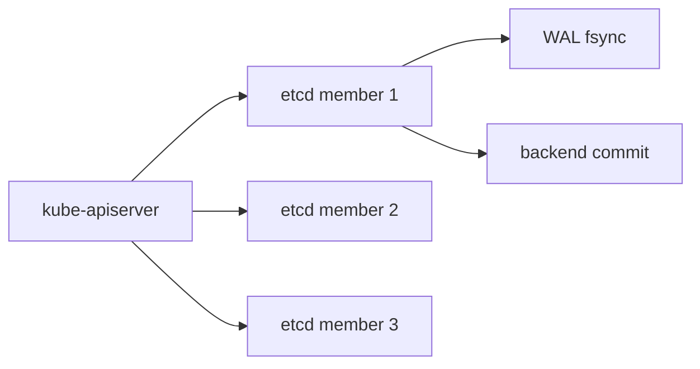

# etcd 트러블슈팅

etcd는 Kubernetes 클러스터의 **유일한 상태 저장소**다. API 서버는
etcd에 의존하고, 컨트롤러·스케줄러는 API 서버에 의존한다. 즉
etcd가 느려지면 클러스터 전체가 느려지고, etcd가 쓰기를 멈추면
클러스터 전체의 쓰기가 멈춘다. 트러블슈팅 비중이 큰 이유다.

이 글은 건강 상태 진단, 디스크 I/O 성능 지표, **MVCC 누적으로 인한
fragmentation과 DB 쿼터 초과**, 리더 선출 이슈, 멤버 재가입까지
운영 관점으로 정리한다.

> 선행/연관: [etcd 백업](../backup-recovery/etcd-backup.md) ·
> [컨트롤 플레인 장애](./control-plane-failure.md) ·
> [HA 클러스터 설계](../cluster-setup/ha-cluster-design.md)

---

## 1. 아키텍처와 장애 지점



etcd는 **홀수 멤버 클러스터(보통 3·5)** 로 구성되고 Raft로 합의한다.
쓰기 요청은 리더가 WAL에 fsync → 팔로워 과반 동의 → backend 적용
순서다. 각 단계가 병목일 수 있다.

| 레이어 | 흔한 장애 |
|---|---|
| 디스크 I/O | fsync 지연, disk full, SSD 노후화 |
| 네트워크 | 멤버 간 RTT 증가, 패킷 손실 |
| Raft | 불필요한 리더 재선출, split brain 위험 |
| MVCC 스토리지 | 리비전 누적, fragmentation, quota 초과 |
| API 접근 | 인증서 만료, RBAC, 포트 차단 |

---

## 2. 기본 진단 명령

### etcdctl vs etcdutl

etcd v3.5부터 두 바이너리가 분리됐다. 헷갈리면 복구 장애를 부른다.

| 바이너리 | 용도 | 대표 명령 |
|---|---|---|
| `etcdctl` | **살아 있는 클러스터** 조작 | `endpoint`, `alarm`, `defrag`, `member`, `get`, `compact` |
| `etcdutl` | **오프라인 데이터** 조작 | `snapshot restore`, `backup`, `hash` |

v3.5에서 `etcdctl snapshot restore`는 deprecated, v3.6에서 제거됐다.
**복구는 반드시 `etcdutl`**.

### 접근 패턴

kubeadm 환경에서 `etcdctl`을 쓰는 3가지 방법:

```bash
# 방법 1: kubectl exec로 etcd static pod 진입
kubectl -n kube-system exec -it etcd-<node> -- \
  etcdctl endpoint status --write-out=table --cluster

# 방법 2: crictl로 etcd 컨테이너 진입
crictl exec -it $(crictl ps -q --name etcd) etcdctl ...

# 방법 3: 임시 Pod로 외부에서 (인증서 Secret 마운트 필요)
kubectl debug node/<cp-node> -it --image=quay.io/coreos/etcd:v3.5
```

### 환경변수로 인증 고정

장애 중에 `--cacert/--cert/--key`를 반복 타이핑하면 오타로 진단이
지연된다. 쉘 세션에 고정한다.

```bash
export ETCDCTL_API=3
export ETCDCTL_CACERT=/etc/kubernetes/pki/etcd/ca.crt
export ETCDCTL_CERT=/etc/kubernetes/pki/etcd/server.crt
export ETCDCTL_KEY=/etc/kubernetes/pki/etcd/server.key
export ETCDCTL_ENDPOINTS=https://127.0.0.1:2379
```

### 진단 명령 세트

```bash
# 1) 엔드포인트 상태 (장애 중엔 --dial-timeout 짧게)
etcdctl endpoint status --cluster -w table --dial-timeout=2s

# 2) 멤버 상태
etcdctl member list -w table

# 3) Alarm 확인 (quota 초과 시 NOSPACE가 뜸)
etcdctl alarm list

# 4) 헬스체크
etcdctl endpoint health --cluster
```

`--cluster`는 모든 멤버를 순회하므로 **한 멤버가 먹통이면 명령이
늘어진다**. 장애 상황에서는 엔드포인트를 명시하고 짧은 타임아웃을 건다.

### `endpoint status` 해석

출력의 핵심 컬럼.

| 컬럼 | 정상 | 이상 신호 |
|---|---|---|
| `DB SIZE` | 쿼터 이하 | 8GB 근접 시 경고 |
| `DB SIZE IN USE` | `DB SIZE`와 근접 | **사용률 = `IN USE / SIZE` < 50%이면 fragmentation** |
| `IS LEADER` | 정확히 1개만 true | 0 또는 복수는 이상 |
| `RAFT TERM` | 멤버 간 동일 | 자주 증가하면 재선출 반복 |
| `RAFT INDEX` | 멤버 간 격차 작음 | 100 이상 격차는 팔로워 지연 |

---

## 3. 성능 지표와 임계치

etcd 성능 문제는 **디스크 fsync 지연**이 원인인 경우가 대부분이다.

### 핵심 메트릭

| 메트릭 | 의미 | SLO 목표 (P99) |
|---|---|---|
| `etcd_disk_wal_fsync_duration_seconds` | WAL fsync 시간 | < 10ms |
| `etcd_disk_backend_commit_duration_seconds` | backend 커밋 시간 | < 25ms |
| `etcd_server_proposals_pending` | 대기 중 제안 | 근사 0 |
| `etcd_server_leader_changes_seen_total` | 리더 변경 누계 | 주간 0–1 |
| `etcd_network_peer_round_trip_time_seconds` | 멤버 RTT | < 50ms |

### 로그 시그널

etcd 로그에서 즉시 의심해야 할 메시지.

```text
slow fdatasync
took too long (>X) to write response
apply request took too long
wal: sync duration of X exceeded expected maximum
local member has not received any message from leader
```

`slow fdatasync`는 kernel의 `fdatasync`가 1초 이상 걸렸다는 뜻. 디스크
성능 문제의 가장 명확한 시그널이다.

### 디스크 요구사항

| 항목 | 권고 | 이유 |
|---|---|---|
| 매체 | **NVMe SSD** 전용 디스크 | fsync P99 < 10ms 달성 |
| 분리 | etcd 전용 디스크 또는 파티션 | I/O 경합 제거 |
| WAL 분리 | `--wal-dir`로 WAL 디스크 별도 | WAL fsync와 snapshot I/O 분리 |
| IOPS | 5000+ random 4K | Raft 연쇄 fsync 대응 |
| 대역폭 | 500MB/s+ | 대형 DB defrag 대응 |
| RAM | DB 크기 × 4배 | mmap 캐시 보장 |

공유 스토리지(NFS, 네트워크 디스크)는 **절대 쓰지 않는다**.

- fsync가 네트워크 왕복에 묶여 SLO를 깨뜨림
- NFS의 파일 잠금 의미가 POSIX와 달라 WAL 일관성 위험
- client write-back 캐시와 server stable write 보장 의미 불일치

### Raft 튜닝 포인트

| 플래그 | 기본 | 운영 의미 |
|---|---|---|
| `--snapshot-count` | 100000 | Raft 스냅샷 주기. 낮추면 재시작 복구↑, 메모리↓ |
| `--heartbeat-interval` | 100ms | 팔로워에게 heartbeat 보내는 간격 |
| `--election-timeout` | 1000ms | heartbeat 못 받으면 재선출. heartbeat의 10배 |
| `--max-request-bytes` | 1.5MB | 큰 Secret·CRD 대응 시 상향 |

대부분 **기본값을 건드리지 않는다**. `--snapshot-count`만 DB가 매우
큰 환경에서 50000 정도로 낮추는 사례가 있다.

---

## 4. MVCC와 Fragmentation

### MVCC 작동 방식

etcd는 모든 변경을 **새 리비전**으로 저장한다. Kubernetes는 분당 수천
건의 객체 변화(status 업데이트, Event, lease renewal)를 발생시켜
리비전이 폭발적으로 누적된다. Compaction이 없으면 DB가 무한 증가.

### Compaction vs Defragmentation

두 개념을 혼동하면 운영 실수가 발생한다.

| 작업 | 무엇을 | 영향 |
|---|---|---|
| **Compaction** | 오래된 리비전을 논리적으로 삭제 | DB 파일 크기는 안 줄어듦 |
| **Defragmentation** | 비어 있는 공간을 재정렬해 파일 축소 | **해당 멤버는 읽기·쓰기 모두 블로킹** |

> Defrag 동안 클라이언트가 해당 엔드포인트로 고정되어 있으면 **읽기도
> 타임아웃**된다. kube-apiserver의 `--etcd-servers`가 여러 엔드포인트를
> 갖도록 구성하거나, etcd v3.6+의 `--experimental-stop-grpc-service-on-defrag`
> 플래그로 defrag 중 gRPC를 중단시켜 클라이언트가 다른 엔드포인트로
> 재시도하게 만든다. 단일 엔드포인트 구성이면 defrag가 곧 API 다운타임.

> etcd v3.5.0–v3.5.5에는 online defrag 중 데이터 inconsistency 버그가
> 있었다. v3.5.6에서 수정. 구 버전을 쓰는 사이트는 업그레이드를
> 최우선으로, 불가하면 offline defrag로 전환한다.

→ 순서: **Compaction → Defrag**. Compaction 없이 Defrag만 하면 줄지
않고, Defrag 없이 Compaction만 하면 디스크 공간이 회수되지 않는다.

### 자동 Compaction 설정

Kubernetes는 kube-apiserver의 `--etcd-compaction-interval`(기본 5분)
로 **API 서버가 주기적으로 compact를 호출**한다. etcd 자체에도 보조
설정이 있다.

```yaml
# etcd 매니페스트 (kubeadm: /etc/kubernetes/manifests/etcd.yaml)
- --auto-compaction-mode=periodic
- --auto-compaction-retention=8h   # 8시간 리비전 보존
```

| 모드 | 동작 | 권고 |
|---|---|---|
| `periodic` | 시간 기반 | 쓰기 빈도가 균일한 Kubernetes에 적합 |
| `revision` | 개수 기반 | 이벤트 폭주 방지가 필요할 때 |

### Defrag 실행 원칙

```bash
# 멤버 하나씩, 팔로워부터
etcdctl defrag --endpoints=https://node1:2379
sleep 60
etcdctl defrag --endpoints=https://node2:2379
sleep 60
# 리더는 마지막
etcdctl defrag --endpoints=https://leader:2379
```

**반드시 지킬 것**:

- 한 번에 한 멤버만 (쿼럼 유지)
- 리더는 마지막에 (불필요한 재선출 방지)
- 멤버 사이 1분 이상 간격
- 실행 중 해당 멤버는 **쓰기 응답 불가**. 트래픽이 몰리는 시간대 피함

### 자동화

v3.6+에서 `etcdctl defrag`는 online-only. 오프라인 defrag가 필요하면
`etcdutl defrag --data-dir=/var/lib/etcd`를 쓴다. 서드파티
[`etcd-defrag`](https://github.com/ahrtr/etcd-defrag) CLI는 멤버
순회와 조건부 실행(사용률 임계 기반)을 지원해 cron·Job 래핑에 쓰인다.

CNCF의 `etcd-operator` WG는 defrag를 포함한 lifecycle 자동화를
목표로 한다. 프로덕션 표준 패턴은 Prometheus 알림(사용률 < 50%,
10분 지속)으로 defrag Job을 트리거하는 것.

---

## 5. "database space exceeded" — 쿼터 초과

### 증상

```text
etcdserver: mvcc: database space exceeded
```

API 서버가 `Internal error` 또는 `rpc error: code = Unavailable`을
던지고, `kubectl apply`는 "connection refused"로 실패한다. etcd는
**읽기와 삭제만 받고 쓰기는 전부 거부**한다.

### 긴급 복구 런북

**순서가 중요하다**. 원인 제거 없이 disarm만 하면 몇 분 만에 재발한다.

```bash
# 0) 먼저 원인 제거 — 폭주 Pod·컨트롤러 정지 (아래 "원인 분석")
#    이 단계를 건너뛰면 disarm 후 즉시 다시 NOSPACE로 진입

# 1) 현재 리비전 확인
rev=$(etcdctl endpoint status -w json \
  | jq -r '.[0].Status.header.revision')

# 2) Compaction (현재 리비전 기준)
etcdctl compact $rev

# 3) Defragmentation — 팔로워부터, 리더는 마지막, 사이 60초 간격
etcdctl defrag --endpoints=https://follower1:2379
sleep 60
etcdctl defrag --endpoints=https://follower2:2379
sleep 60
etcdctl defrag --endpoints=https://leader:2379

# 4) DB 사용률이 줄었는지 확인
etcdctl endpoint status --cluster -w table

# 5) NOSPACE 경보 확인 후 해제
etcdctl alarm list
etcdctl alarm disarm

# 6) 쓰기 재개 검증
kubectl create ns test-write && kubectl delete ns test-write

# 7) 자동 compaction 설정 재확인
grep auto-compaction /etc/kubernetes/manifests/etcd.yaml
```

### 원인 분석

공간을 차지한 객체를 찾아 재발 방지.

```bash
# 리소스 타입별 객체 수 (네임스페이스 포함)
kubectl get --raw /metrics \
  | grep '^apiserver_storage_objects' | sort -k2 -n | tail

# etcd 직접: 리소스 타입별 키 분포
etcdctl get "" --prefix --keys-only \
  | awk -F/ '{print $3}' | sort | uniq -c | sort -rn | head
```

`apiserver_storage_objects{resource="..."}`는 각 리소스의 총 객체 수를
반환해 폭주 리소스를 바로 찾는다. etcd 키 직접 조회는 prefix 경로를
그대로 보여주므로 CRD·시스템 리소스까지 포함된다.

흔한 원인 TOP:

- **Event 과잉**: 범용 TTL 1시간인데도 폭발적 생성. 원인 Pod·컨트롤러
  제거가 우선
- **CRD 오용**: 관측성 CRD에 고카디널리티 데이터 저장
- **Secret·ConfigMap 남용**: 수만 개 Pod이 각자 생성
- **Lease 폭주**: 잘못된 컨트롤러가 Lease를 초당 수백 개 생성

### 쿼터 상향

임시 처방으로 쿼터를 올릴 수 있지만 **8GB 상한을 넘기지 않는다**.
etcd 커뮤니티 권고. DB가 커질수록 defrag가 느려지고 장애 복구 시간이
선형으로 늘어난다.

```yaml
- --quota-backend-bytes=8589934592   # 8 GiB
```

---

## 6. 리더 선출 이슈

### 재선출이 자주 발생하는 경우

`etcd_server_leader_changes_seen_total`이 주기적으로 증가하면 클러스터
전체가 불안정하다. 리더가 바뀌는 사이 **쓰기 요청이 큐에 쌓이고**
API 응답 지연이 튄다.

| 원인 | 로그 키워드 | 대응 |
|---|---|---|
| 디스크 지연 | `slow fdatasync`, `heartbeat 손실` | 디스크 교체, 전용 디스크 분리 |
| 네트워크 문제 | `lost leader`, `connection refused` | 멤버 간 RTT·MTU·방화벽 점검 |
| CPU 경합 | `took too long to send heartbeat` | etcd Pod에 전용 CPU 확보 |
| heartbeat 설정 과격 | 5s 이하 timeout 튜닝 | 기본값(100ms/1000ms) 유지 |

### Heartbeat·Election 튜닝

고지연 네트워크(DC 간)를 제외하면 **기본값(100ms/1000ms)을 건드리지
않는다**. DC 간 스트레치 클러스터는 `heartbeat-interval=500`,
`election-timeout=5000` 같이 보수적으로 조정. 단, **스트레치 구성
자체가 반패턴**이라는 점을 먼저 검토할 것.

### CPU·메모리 경합 지표

| 지표 | 의미 |
|---|---|
| `etcd_server_slow_apply_total` | Raft apply가 느린 횟수 |
| `etcd_server_slow_read_indexes_total` | 읽기 인덱스 지연 |
| `process_cpu_seconds_total` 증가율 | etcd 프로세스 CPU 포화 |
| `process_resident_memory_bytes` | RSS 상승은 mmap 캐시가 아닌 leak 의심 |

---

## 7. 멤버 장애와 복구

### 멤버 이탈 진단

```bash
etcdctl member list
# 응답에 unreachable 또는 특정 멤버가 unhealthy로 표시
```

Raft는 **과반이 살아 있으면 계속 동작**한다. 3-멤버는 1개까지, 5-멤버는
2개까지 장애 허용. 과반 손실 시 쓰기 불가 → 스냅샷에서 복구.

### 과반 손실 — 단일 멤버 재구성

쿼럼이 복구 불가 상태라면 남은 한 멤버에서 `--force-new-cluster`로
새 클러스터를 시작하고 나머지를 learner로 재가입시키는 재해 복구
절차가 있다. **데이터 롤백·분기 위험이 있어** 백업 복구 대신 선택할
때는 신중해야 한다. 상세: [etcd 백업](../backup-recovery/etcd-backup.md)

### Learner 모드로 안전 재가입

새 멤버는 **learner(비투표)** 로 시작해 WAL을 따라잡은 후 voting
member로 승격된다. 쿼럼에 미치는 영향 없이 안전히 가입.

kubeadm의 `EtcdLearnerMode` 피처 게이트 진행 상황.

| kubeadm 버전 | 상태 | 기본값 |
|---|---|---|
| v1.27 | Alpha | `false` (수동 활성화 필요) |
| v1.29 | Beta | `false` |
| v1.31+ | Beta | **`true`** (기본 활성) |

v1.30 이하를 쓰는 사이트는 `featureGates: { EtcdLearnerMode: true }`
를 kubeadm 설정에 명시해야 동작한다.

```bash
# 수동 learner 추가 (kubeadm 이외 환경)
etcdctl member add <name> --learner --peer-urls=https://<new-node>:2380

# 동기화 후 승격
etcdctl member promote <member-id>
```

learner가 동기화 안 된 상태에서 `promote`는 `can only promote a
learner member which is in sync with leader` 에러로 거부된다. 정상
동작이니 동기화를 기다린다.

### 스냅샷 복구

멤버 손실·데이터 손상 시 백업 스냅샷으로 복구.

```bash
# 각 노드에서 실행
etcdutl snapshot restore /backup/etcd-snapshot.db \
  --name=node1 \
  --initial-cluster=node1=https://10.0.0.1:2380,... \
  --initial-advertise-peer-urls=https://10.0.0.1:2380 \
  --data-dir=/var/lib/etcd-restore
```

**주의**: 스냅샷 복구는 클러스터 전체를 백업 시점으로 되돌린다.
그 사이 변경사항은 **모두 소실**. 복구 직전 kube-apiserver를 먼저
중지해 오염된 데이터가 더 안 들어가게 한다.

→ 상세 절차: [etcd 백업](../backup-recovery/etcd-backup.md)

---

## 8. 인증서·권한 이슈

### 인증서 만료

클러스터가 갑자기 "connection refused"를 쏟아내고 컨트롤 플레인 전체가
죽으면 **인증서 만료**를 먼저 의심한다. kubeadm 기본 유효기간 1년이
지나면 한꺼번에 끊긴다.

```bash
# 서버 인증서 만료일
openssl x509 -in /etc/kubernetes/pki/etcd/server.crt -noout -enddate

# kubeadm 전체 만료 확인
kubeadm certs check-expiration
```

**kubeadm 자동 갱신 트리거**는 `kubeadm upgrade apply` 또는
`kubeadm upgrade node`다 (기본 `--certificate-renewal=true`). 컨트롤
플레인을 재시작한다고 갱신되지 않는다. 만료 임박 시 수동 절차:

```bash
# 1) 모든 인증서 갱신
kubeadm certs renew all

# 2) static pod 재기동 — 매니페스트 임시 이동으로 kubelet이 재생성
mv /etc/kubernetes/manifests/*.yaml /tmp/
sleep 20
mv /tmp/*.yaml /etc/kubernetes/manifests/

# 3) kubelet용 kubeconfig도 갱신 필요 시
# kubeadm kubeconfig user --client-name ... > /etc/kubernetes/kubelet.conf
```

정기적으로 `kubeadm upgrade`를 수행하는 사이트는 자동 갱신으로
운영된다. 업그레이드가 뜸하면 연간 수동 갱신을 달력에 잡는다.

### 흔한 에러 매핑

| 메시지 | 원인 |
|---|---|
| `x509: certificate has expired` | 인증서 만료 |
| `x509: certificate signed by unknown authority` | CA 불일치 |
| `rpc error: code = Unauthenticated` | 클라이언트 인증서 누락 |
| `context deadline exceeded` | 네트워크·쿼럼 손실·과부하 |
| `etcdserver: request timed out` | 리더 과부하, apply 지연 |
| `etcdserver: mvcc: database space exceeded` | 쿼터 초과 |

---

## 9. 모니터링·알림 체크리스트

| 알림 | 출처 | 조건 | 대응 |
|---|---|---|---|
| `etcdHighFsyncDurations` | kube-prometheus | WAL fsync P99 > 10ms, 10분 | 디스크 점검 |
| `etcdHighCommitDurations` | kube-prometheus | backend commit P99 > 25ms | 디스크·부하 |
| `etcdHighNumberOfLeaderChanges` | kube-prometheus | 리더 변경 > 3/시 | 네트워크·디스크 |
| `etcdMembersDown` / `etcdNoLeader` | kube-prometheus | 멤버 다운·리더 없음 | 쿼럼 손실 긴급 |
| `etcdDatabaseQuotaLowSpace` | kube-prometheus | DB 사용률 > 95% | Compact + Defrag |
| `etcdExcessiveDatabaseGrowth` | kube-prometheus | 4시간 증가폭 > 50% | 폭주 원인 조사 |
| `etcdHighNumberOfFailedGRPCRequests` | kube-prometheus | 실패율 > 1% | API 품질 저하 |
| `etcdFragmentationHigh` | 커스텀 권장 | `IN_USE / SIZE < 0.5` 지속 | Defrag 스케줄 |
| `etcdMemberCommunicationSlow` | kube-prometheus | peer RTT > 150ms | 네트워크 점검 |

**kube-prometheus-stack**의 etcd ServiceMonitor를 활성화하면 위
알림 대부분이 기본 제공된다. Fragmentation 알림은 기본 제공되지
않으므로 커스텀 규칙을 추가한다.

### 메트릭 엔드포인트 분리

etcd 메트릭을 2379(클라이언트 포트)에서 긁으면 mTLS 인증이 까다롭다.
**`--listen-metrics-urls=http://0.0.0.0:2381`** 로 비인증 경로를
분리하고 NetworkPolicy·Cilium Policy로 Prometheus만 접근하게 막는
구성이 표준이다.

```yaml
# etcd static pod spec
- --listen-client-urls=https://0.0.0.0:2379
- --listen-metrics-urls=http://127.0.0.1:2381  # node-local만
```

### Grafana 대시보드

- **3070**: etcd (기본) — DB·fsync·리더
- **etcd-operator** 대시보드(v3.6+): 최신 메트릭 반영

---

## 10. 하지 말아야 할 것

- **프로덕션에 단일 멤버 etcd 운영**: HA가 아예 없다
- **etcd와 워크로드 같은 디스크**: I/O 경합으로 fsync가 밀린다
- **NFS·분산 스토리지에 etcd 데이터 디렉터리**: 아예 금지
- **defrag를 모든 멤버 동시에**: 쿼럼 손실로 쓰기 중단
- **DB 쿼터 8GB 초과 설정**: 복구가 선형으로 느려진다
- **리더가 살아 있는데 강제 스냅샷 복구**: 데이터 롤백이 발생
- **인증서 갱신 없이 장기 운영**: 1년 뒤 한꺼번에 먹통

---

## 참고 자료

- [etcd Maintenance — etcd.io](https://etcd.io/docs/v3.5/op-guide/maintenance/) (2026-04-24 확인)
- [Operating etcd clusters for Kubernetes](https://kubernetes.io/docs/tasks/administer-cluster/configure-upgrade-etcd/) (2026-04-24 확인)
- [How to debug large db size issue — etcd Blog](https://etcd.io/blog/2023/how_to_debug_large_db_size_issue/) (2026-04-24 확인)
- [kubeadm: Use etcd Learner Mode](https://kubernetes.io/blog/2023/09/25/kubeadm-use-etcd-learner-mode/) (2026-04-24 확인)
- [etcd Learner — etcd.io](https://etcd.io/docs/v3.3/learning/learner/) (2026-04-24 확인)
- [Etcd High Fsync Durations runbook](https://runbooks.prometheus-operator.dev/runbooks/etcd/etcdhighfsyncdurations/) (2026-04-24 확인)
- [OKD — Recommended etcd practices](https://docs.okd.io/4.18/scalability_and_performance/recommended-performance-scale-practices/recommended-etcd-practices.html) (2026-04-24 확인)
- [Why the etcd Database Size Should Not Exceed 8GB](https://www.perfectscale.io/blog/etcd-8gb) (2026-04-24 확인)
- [etcdutl vs etcdctl (etcd-io#13863)](https://github.com/etcd-io/etcd/issues/13863) (2026-04-24 확인)
- [etcd v3.6 릴리즈 공지](https://kubernetes.io/blog/2025/05/15/announcing-etcd-3.6/) (2026-04-24 확인)
- [Kubernetes Feature Gates Reference](https://kubernetes.io/docs/reference/command-line-tools-reference/feature-gates/) (2026-04-24 확인)
- [Certificate Management with kubeadm](https://kubernetes.io/docs/tasks/administer-cluster/kubeadm/kubeadm-certs/) (2026-04-24 확인)
- [etcd 3.5 Disaster Recovery](https://etcd.io/docs/v3.5/op-guide/recovery/) (2026-04-24 확인)
- [etcd-defrag CLI](https://github.com/ahrtr/etcd-defrag) (2026-04-24 확인)
