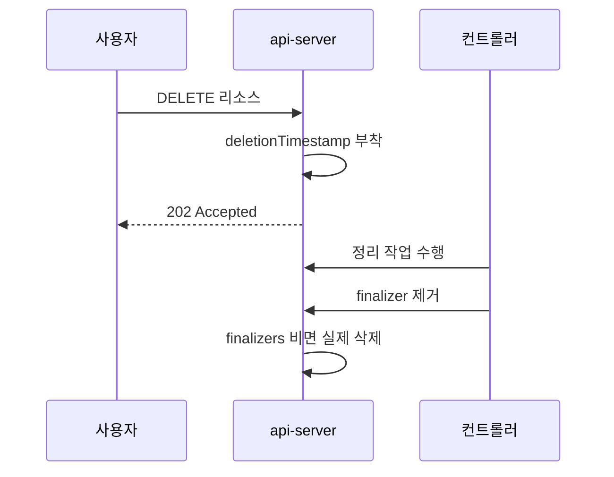

# Finalizer Stuck

`kubectl delete`는 즉시 리소스를 지우는 명령이 아니다. 실제로는
"삭제 요청을 표시"하는 것. 리소스가 `Terminating`에 머물고 사라지지
않으면 **finalizer가 남아 있거나**, **컨트롤러가 finalizer를 제거
못 하는** 상태다. 이걸 힘으로 지우면 **외부 리소스 고아**(Cloud LB,
PV 백엔드, DNS 레코드)가 발생한다.

이 글은 finalizer의 작동 원리, 대표 막힘 패턴(Namespace·PV·PVC·CRD·
Node), 안전한 복구 절차, 힘으로 지울 때의 위험과 후속 정리를 운영
관점으로 정리한다.

> 연관: [Pod 디버깅 §7](./pod-debugging.md#7-terminating-지연) ·
> [K8s 에러 메시지](./k8s-error-messages.md) ·
> [컨트롤 플레인 장애](./control-plane-failure.md)

---

## 1. Finalizer 작동 원리

### 삭제 플로우



핵심 규칙:

- `DELETE` 요청 시 **즉시 지워지지 않는다**. `metadata.deletionTimestamp`
  가 붙고 HTTP 202 반환
- finalizer가 **모두 제거될 때까지** 객체는 유지
- `deletionTimestamp` 부착 이후 **새 finalizer는 추가 불가**, 기존
  것은 제거만 가능
- 객체는 "삭제 마킹됨"이므로 수정 대부분이 거부된다

### 내장 finalizer — 상시 부착형

생성·사용 시점에 **항상** 붙는다.

| Finalizer | 붙는 리소스 | 제거 조건 |
|---|---|---|
| `kubernetes.io/pv-protection` | PersistentVolume | PVC와 연결 해제 |
| `kubernetes.io/pvc-protection` | PersistentVolumeClaim | Pod가 사용 중이 아님 |
| `kubernetes` | Namespace (`spec.finalizers`) | 내부 리소스 전부 삭제 |
| `service.kubernetes.io/load-balancer-cleanup` | LoadBalancer Service | 클라우드·온프레 LB 해제 |
| `kubernetes.io/legacy-service-account-token-cleanup` | legacy SA 토큰 Secret | v1.29+ 자동 정리 |

### 내장 finalizer — 동적 부착형

**삭제 시점의 `propagationPolicy`에 따라** API 서버·GC가 임시로 붙인다.
평상시에는 존재하지 않는다.

| Finalizer | 붙는 시점 | 제거 조건 |
|---|---|---|
| `foregroundDeletion` | `--cascade=foreground` 삭제 시 | `blockOwnerDeletion=true` dependent 전부 삭제 |
| `orphan` | `--cascade=orphan` 삭제 시 | dependent의 ownerReference 해제 |

### 커스텀 finalizer

오퍼레이터가 붙인다. `example.com/cleanup` 같이 **도메인이 붙은 이름**
만 허용. 위 동적 부착형 두 개(`foregroundDeletion`·`orphan`)는
API 서버 예외로 도메인 없이 허용된다.

| 예시 | 붙이는 주체 | 정리 대상 |
|---|---|---|
| `cert-manager.io/...` | cert-manager | ACME 주문, CertificateRequest |
| `kubernetes.io/legacy-service-account-token-cleanup` | kube-controller-manager | SA 토큰 |
| `velero.io/...` | Velero | 백업 메타 |
| `operator.openshift.io/...` | OpenShift 오퍼레이터 | 다수 |
| `ceph.rook.io/...` | Rook | Ceph 풀·OSD |

---

## 2. 삭제 전략 세 가지

`kubectl delete --help`에는 안 나오지만, GC 전략이 세 가지다.

| 전략 | 동작 | 기본 대상 |
|---|---|---|
| **Background** | owner 즉시 삭제, dependent는 GC가 비동기로 처리 | 대부분의 리소스 |
| **Foreground** | dependent 먼저 삭제 후 owner 삭제 | 명시 필요 |
| **Orphan** | owner만 삭제, dependent는 고아로 유지 | 명시 필요 |

```bash
# Foreground (cascading)
kubectl delete deploy my-app --cascade=foreground

# Orphan (고아 남김 — 주의)
kubectl delete deploy my-app --cascade=orphan
```

**Background가 기본**. ownership 체인은 Deployment → ReplicaSet → Pod.
`--cascade=orphan`으로 Deployment를 지우면 **ReplicaSet이 고아**가 되고
Pod은 ReplicaSet 소유 상태로 계속 동작한다. "Deployment를 지웠는데
Pod이 남는" 경우 `kubectl get rs -o wide`로 고아 RS부터 찾는다.

### Foreground 내부 동작

`--cascade=foreground`는 API 서버가 owner에 `foregroundDeletion`
finalizer를 자동 부착하고, GC가 **`ownerReferences[*].blockOwnerDeletion=true`**
인 dependent를 모두 삭제할 때까지 owner를 보존한다. dependent 중
하나가 자체 finalizer로 stuck이면 **owner도 영원히 stuck**이다. CRD +
커스텀 컨트롤러 조합에서 흔한 패턴.

### Orphan 내부 동작

`--cascade=orphan`은 API 서버가 owner에 `orphan` finalizer를 붙이고
GC가 dependent의 `ownerReferences`를 제거한 뒤 owner를 삭제한다.

---

## 3. 진단 — 무엇이 막고 있는가

### 공통 1차 명령

```bash
# 해당 리소스의 finalizer·owner 확인
kubectl get <kind> <name> -o yaml | yq '.metadata | \
  {finalizers, deletionTimestamp, ownerReferences}'

# deletionTimestamp가 있는 리소스 전체 조회 (jq 필터)
kubectl get pvc -A -o json \
  | jq -r '.items[] | select(.metadata.deletionTimestamp != null)
           | "\(.metadata.namespace)/\(.metadata.name)"'
kubectl get ns -o json \
  | jq -r '.items[] | select(.metadata.deletionTimestamp != null)
           | .metadata.name'
```

### 진단 체크리스트

1. **deletionTimestamp**가 있는가? (없으면 아직 삭제 요청 안 된 것)
2. **finalizers 목록**에 누가 남아 있는가?
3. 그 finalizer를 관리하는 **컨트롤러가 돌고 있는가**?
4. 컨트롤러 로그에 **정리 에러**가 있는가?
5. **ownerReferences**로 종속 관계가 막고 있는가?

### 컨트롤러 찾기

finalizer 이름의 도메인 부분이 힌트다.

```bash
# cert-manager.io/... 라면
kubectl -n cert-manager get pod
kubectl -n cert-manager logs -l app=cert-manager --tail=200 | grep -i <리소스명>
```

**컨트롤러가 죽어 있으면** finalizer가 영원히 제거되지 않는다.
먼저 컨트롤러를 살려야 한다.

---

## 4. Namespace Terminating 고착

가장 흔한 사례. 네임스페이스를 지웠는데 `Terminating`에서 멈춘다.

### 원인 분류

```bash
# 1) 해당 네임스페이스의 남은 리소스 전체
kubectl api-resources --verbs=list --namespaced -o name \
  | xargs -n1 kubectl get --show-kind --ignore-not-found -n <ns>

# 2) Namespace 자체의 status
kubectl get ns <ns> -o yaml
```

네임스페이스 `status.conditions`에서 다음을 본다.

| Condition | 의미 |
|---|---|
| Condition | 의미 | 진단 방향 |
|---|---|---|
| `NamespaceDeletionDiscoveryFailure` | API 디스커버리 실패 | `kubectl get apiservice \| grep False` |
| `NamespaceDeletionGroupVersionParsingFailure` | API 버전 파싱 실패 | CRD/APIService 버전 정리 |
| `NamespaceDeletionContentFailure` | 내부 리소스 삭제 실패 | 해당 리소스 개별 조사 |
| `NamespaceContentRemaining` | 아직 남은 리소스가 있음 | 남은 리소스 나열 후 삭제 |
| `NamespaceFinalizersRemaining` | 남은 리소스에 finalizer가 박힘 | 해당 컨트롤러 복구·로그 |

`NamespaceContentRemaining`은 "정리 자체를 못 한 리소스"가, `Finalizers
Remaining`은 "finalizer 때문에 못 지운 리소스"가 남은 경우다. 전자는
삭제 권한·webhook, 후자는 **컨트롤러 복구**가 급선무.

### 흔한 원인 TOP 5

| 원인 | 증상 |
|---|---|
| Aggregated APIService unavailable | `DiscoveryFailure`. metrics-server 다운 등 |
| CRD 관련 오퍼레이터 죽음 | `ContentFailure`. CR이 남아 있음 |
| PVC가 PV-protection 때문에 | `ContentRemaining`. Pod가 마운트 중 |
| 외부 자원 정리 실패 | 오퍼레이터가 외부 API 호출 실패 |
| Webhook 오작동 | validating webhook이 삭제 요청 거부 |

### 안전한 복구 절차

```bash
# 1) 남은 리소스와 finalizer 목록 확인
for r in $(kubectl api-resources --verbs=list --namespaced -o name); do
  echo "== $r =="
  kubectl get $r -n <ns> -o json 2>/dev/null \
    | jq -r '.items[] | "\(.metadata.name)\t\(.metadata.finalizers)"' \
    | grep -v "null"
done

# 2) 각 리소스에 대해 담당 컨트롤러 살리기
# 3) 컨트롤러가 스스로 finalizer 제거 못 하면
#    개별 리소스에서 제거 (아래 §7 절차)
```

**권장**: 네임스페이스 `spec.finalizers`를 직접 지우기 전에 항상
**내부 리소스부터** 정리한다. 네임스페이스 finalizer만 지우면
내부 리소스가 **고아**가 되어 나중에 찾기 어렵다.

### Aggregated API가 원인일 때

```bash
# 비정상 APIService
kubectl get apiservice | grep -iE 'false|unknown'
```

`custom.metrics.k8s.io`·`external.metrics.k8s.io`·`metrics.k8s.io`가
`Available=False`이면 네임스페이스 discovery가 실패한다. 해당
APIService의 백엔드 Service를 수리하거나, 불필요하면 APIService
자체를 삭제한다.

```bash
kubectl delete apiservice <stale-apiservice>
```

---

## 5. PV·PVC Terminating

### `kubernetes.io/pvc-protection`

PVC를 지웠는데 `Terminating`이면 **여전히 Pod가 마운트 중**이다.

```bash
# PVC 사용 중인 Pod
kubectl get pod -A -o json | jq -r '.items[]
  | select(.spec.volumes[]?.persistentVolumeClaim.claimName == "<pvc>")
  | "\(.metadata.namespace)/\(.metadata.name)"'
```

Pod이 사라지면 controller-manager가 finalizer를 자동 제거한다.
Pod이 Terminating으로 stuck이면 Pod부터 해결.

### `kubernetes.io/pv-protection`

PV를 지웠는데 멈췄다. PVC와 아직 연결 중이거나, reclaimPolicy가
`Retain`이어서 의도적으로 남아 있다.

```bash
# PV의 claimRef와 reclaimPolicy
kubectl get pv <pv> -o jsonpath='{.spec.claimRef}{"\n"}{.spec.persistentVolumeReclaimPolicy}'
```

### 외부 CSI finalizer

CSI 드라이버(`external.storage.k8s.io/...`)가 붙이는 finalizer는
**볼륨 detach·백엔드 삭제가 끝나야** 제거된다. Rook-Ceph에서는
RBD/CephFS 이미지 삭제가 안 끝나서 멈추는 경우가 잦다.

```bash
# Rook-Ceph 기준
kubectl -n rook-ceph logs -l app=csi-rbdplugin-provisioner --tail=200
```

백엔드에서 이미지가 실제로 삭제되었는지(`rbd ls`) 확인 후 finalizer를
수동 제거한다.

---

## 6. LoadBalancer Service Terminating

`type: LoadBalancer` Service는 삭제 시 서비스 컨트롤러가
`service.kubernetes.io/load-balancer-cleanup` finalizer를 자동
부착한다. **외부 LB 리소스 해제가 끝나야** 제거된다.

### 원인

| 구성 | 실패 지점 |
|---|---|
| 클라우드 (AWS/GCP/Azure) | cloud-controller-manager 다운, IAM·쿼터 |
| MetalLB | speaker Pod 다운, BGP 세션 단절 |
| Cilium L2/BGP | L2Announce·BGP 매니페스트 정리 실패 |
| kube-vip | 리더 election 실패, ARP 충돌 |

### 진단

```bash
# Service의 finalizer·status
kubectl get svc <name> -n <ns> -o yaml | yq '.metadata.finalizers, .status.loadBalancer'

# cloud-controller-manager 로그 (클라우드)
kubectl -n kube-system logs -l k8s-app=cloud-controller-manager --tail=200

# MetalLB
kubectl -n metallb-system logs -l app=metallb,component=controller --tail=200
```

### 복구 원칙

1. 먼저 **LB 프로바이더 컨트롤러**를 복구한다
2. 외부 LB 리소스(클라우드 LB, BGP 광고 주소)가 실제 해제됐는지
   **프로바이더 쪽에서 확인**
3. 그래도 안 되면 수동 해제 후 finalizer 제거

수동 제거는 §7 참조. 클라우드 LB는 콘솔·CLI로 실물을 지워야 **과금
지속**과 IP 누적을 막을 수 있다.

---

## 7. CRD·CR Terminating

CRD를 삭제하는데 해당 CR이 남아 있으면 **각 CR의 finalizer가
제거될 때까지** CRD도 삭제되지 않는다.

```bash
# CRD에 등록된 CR 전체
kubectl get <crd-kind> -A

# 각 CR의 finalizer
kubectl get <crd-kind> -A -o json \
  | jq -r '.items[] | "\(.metadata.namespace)/\(.metadata.name): \
    \(.metadata.finalizers)"'
```

### 오퍼레이터 제거 순서 원칙

**CRD보다 오퍼레이터를 먼저 지우면 사고**다. 순서:

1. 모든 CR 삭제 (오퍼레이터가 정리 수행)
2. CR이 모두 사라진 것 확인
3. 오퍼레이터 Deployment 삭제
4. CRD 삭제

반대로 하면 오퍼레이터가 없어 finalizer 제거를 못 하고, CR이 영영 안
지워진다. 복구하려면 오퍼레이터를 **다시 설치**해서 정리를 맡긴다.

---

## 8. 강제 제거 — 최후의 수단

### 기본 원칙

finalizer를 강제로 제거하는 것은 **컨트롤러가 하지 못한 외부 정리를
포기**한다는 뜻. 부작용:

- 클라우드 LB·디스크·DNS가 고아로 남아 과금 지속
- 외부 DB·메시지 큐의 해지 안 됨
- Ceph 이미지 남아 용량 차지
- 다음 배포에서 이름 충돌

**먼저 컨트롤러 복구를 시도하고**, 안 되면 외부 리소스를 **수동으로**
정리한 후 finalizer를 제거한다.

### 리소스별 finalizer 제거

```bash
# JSON patch로 finalizers 비우기 (전체 배열 덮어쓰기)
kubectl patch <kind> <name> -n <ns> --type=merge \
  -p '{"metadata":{"finalizers":null}}'

# 여러 finalizer 중 하나만 제거 (인덱스 기반)
kubectl patch <kind> <name> -n <ns> --type=json \
  -p='[{"op":"remove","path":"/metadata/finalizers/0"}]'
```

**RBAC 요구사항**: finalizer 편집은 해당 리소스의 **`finalizers`
서브리소스에 `update` 권한**이 필요하다. `403 Forbidden`이 뜨면
이것부터 의심.

```yaml
# 필요한 Role 예시
rules:
- apiGroups: [""]
  resources: ["pods/finalizers"]
  verbs: ["update"]
```

**동시성 함정**: `--type=merge`로 `finalizers:null`을 쓰면 배열 전체를
덮어쓴다. 동시에 컨트롤러가 새 finalizer를 추가 중이면 그 변경이
사라질 수 있다. 운영 중에는 **인덱스 기반 `--type=json`** 또는
`resourceVersion`을 포함한 optimistic update가 안전하다.

### Namespace의 finalizer 제거

Namespace는 `metadata.finalizers`가 아니라 **`spec.finalizers`**다.
잘못된 필드를 지우면 효과 없다. 게다가 `spec.finalizers`는 일반
`update`/`patch`로 바꿀 수 없고 **반드시 `/finalize` 서브리소스
엔드포인트**로만 수정 가능하다 (kubernetes/kubernetes#90438).

**권장 방법 — `kubectl replace --raw`**.

```bash
ns=<stuck-namespace>
kubectl get namespace $ns -o json \
  | jq 'del(.spec.finalizers)' \
  | kubectl replace --raw "/api/v1/namespaces/$ns/finalize" -f -
```

**비권장 — 프록시 편집**. 구형 블로그에 자주 나오는 `kubectl proxy`
+ `curl -X PUT`은 동일한 효과지만 타이핑 실수 위험이 높다.

### Pod의 강제 삭제

```bash
# grace period 0으로 즉시 제거
kubectl delete pod <pod> --grace-period=0 --force
```

이 명령은 **kubelet에 정리 기회를 주지 않고 etcd에서 즉시 제거**한다.
노드 측에는 컨테이너와 마운트가 살아 있을 수 있다. StatefulSet에서는
같은 이름의 Pod이 즉시 새로 생성되어 **같은 볼륨에 2중 쓰기**가
일어나 데이터 코럽션이 발생한다.

공식 가이드의 전제 조건은 "노드가 물리적으로 꺼져 있거나 kubelet이
확실히 죽은 것을 확인했을 때". 그 외에는 쓰지 않는다.

---

## 9. 대표 시나리오 매트릭스

| 증상 | 먼저 볼 것 | 안전한 해결 |
|---|---|---|
| Namespace Terminating | `kubectl get ns -o yaml` conditions | 내부 리소스부터 정리 |
| PVC Terminating | 마운트 중인 Pod | Pod 종료 대기 |
| PV Terminating | claimRef, reclaimPolicy | 백엔드 먼저 정리 |
| Pod Terminating | preStop, grace period | 노드·런타임 복구 |
| CRD Terminating | 남은 CR | 오퍼레이터 복구 후 CR 삭제 |
| Node에서 Drain 안 빠짐 | PDB, finalizer | PDB 완화·stuck Pod |
| Service Terminating | 거의 없음, LB finalizer | 클라우드 LB 정리 |

---

## 10. 사전 예방

### 오퍼레이터 설치 시

- **Helm chart의 `keep` 어노테이션**을 이용해 삭제 시 실행 순서 통제
- 오퍼레이터 제거 스크립트를 README에 명시
- CRD에 `finalizer`가 붙는 리소스는 **운영 문서에 삭제 순서 명시**

### 모니터링

```promql
# Terminating 상태에서 5분 이상 있는 네임스페이스
kube_namespace_status_phase{phase="Terminating"} == 1
  unless
  kube_namespace_created > (time() - 300)
```

### GitOps 환경

ArgoCD는 Application에 **`resources-finalizer.argocd.argoproj.io`**를
붙여 cascading delete(기본 foreground)를 수행한다. 삭제 시 관리 중인
리소스가 stuck이면 **Application 자체도 stuck**된다.

- 진단: Application의 관리 리소스 중 어느 것이 stuck인가부터 확인
- 안전 경로: `syncPolicy.preserveResourcesOnDeletion: true` 또는
  finalizer를 빼고 Non-Cascading 삭제
- Flux도 `kustomize.toolkit.fluxcd.io/finalizer` 류를 붙인다

GitOps 자체 finalizer + 워크로드 finalizer가 겹쳐 꼬이므로 제거
순서를 런북에 문서화한다.

---

## 11. 하지 말아야 할 것

- **원인 없이 `finalizers: null`**: 외부 리소스 고아 발생
- **controller-manager 살아 있는데 `kubectl delete --force`**:
  상태 불일치 → 다음 재배포 시 충돌
- **Namespace `metadata.finalizers` 직접 수정**: 올바른 필드는
  `spec.finalizers`
- **CRD 먼저 삭제**: 오퍼레이터가 정리를 못 해 고아
- **`kubectl proxy` 우회 편집 습관화**: 타이핑 실수로 스키마 깨짐
- **고아 탐지 없이 끝내기**: 클라우드 비용·보안 사각 발생.
  삭제 후 외부 리소스(LB, DNS, 디스크) 점검을 포함시킨다

---

## 참고 자료

- [Finalizers — Kubernetes 공식](https://kubernetes.io/docs/concepts/overview/working-with-objects/finalizers/) (2026-04-24 확인)
- [Garbage Collection — Kubernetes 공식](https://kubernetes.io/docs/concepts/architecture/garbage-collection/) (2026-04-24 확인)
- [Use Cascading Deletion](https://kubernetes.io/docs/tasks/administer-cluster/use-cascading-deletion/) (2026-04-24 확인)
- [Using Finalizers to Control Deletion — Kubernetes Blog](https://kubernetes.io/blog/2021/05/14/using-finalizers-to-control-deletion/) (2026-04-24 확인)
- [How to fix namespaces stuck in terminating — Red Hat](https://www.redhat.com/en/blog/troubleshooting-terminating-namespaces) (2026-04-24 확인)
- [Owner References](https://kubernetes.io/docs/concepts/architecture/garbage-collection/#owners-dependents) (2026-04-24 확인)
- [spec.finalizers 수정 제한 (k/k#90438)](https://github.com/kubernetes/kubernetes/issues/90438) (2026-04-24 확인)
- [Foreground deletion stuck (k/k#77081)](https://github.com/kubernetes/kubernetes/issues/77081) (2026-04-24 확인)
- [ArgoCD App Deletion](https://argo-cd.readthedocs.io/en/latest/user-guide/app_deletion/) (2026-04-24 확인)
- [Service — LoadBalancer](https://kubernetes.io/docs/concepts/services-networking/service/#loadbalancer) (2026-04-24 확인)
