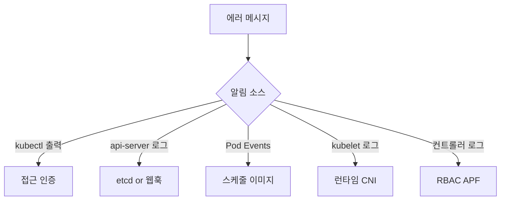

# K8s 에러 메시지

장애 중에 가장 먼저 만나는 것은 **에러 문구 한 줄**이다. 같은 메시지도
레이어에 따라 의미가 달라 잘못 해석하면 엉뚱한 곳을 판다. 이 글은
프로덕션에서 월 1회 이상 보는 메시지만 카테고리별로 정리한 **레퍼런스
카드**다.

각 항목은 `메시지 → 발생 레이어 → 실제 원인 → 1차 명령`으로 구성. 상세
런북은 각 트러블슈팅 글로 연결한다.

> 상세: [Pod 디버깅](./pod-debugging.md) ·
> [etcd 트러블슈팅](./etcd-troubleshooting.md) ·
> [컨트롤 플레인 장애](./control-plane-failure.md) ·
> [Finalizer Stuck](./finalizer-stuck.md)

---

## 1. 메시지 해석 원칙

에러 메시지 해석 전에 세 가지를 확인한다.

1. **어디서 뜬 메시지인가** — kubectl, kubelet, api-server, 컨트롤러,
   CSI, CNI 로그 중 어느 것
2. **언제 처음 나왔는가** — 최근 변경(이미지·manifest·인증서)과 상관
3. **같은 메시지가 어디까지 퍼졌는가** — 특정 Pod만 vs 네임스페이스 전체
   vs 클러스터 전체

같은 `connection refused`도 api-server 로그에 뜨면 백엔드 문제,
`kubectl`에서 뜨면 LB·VIP 문제다.

---

## 2. 접근·인증 에러

| 메시지 | 레이어 | 실제 원인 | 1차 대응 |
|---|---|---|---|
| `Unable to connect to the server: EOF` | kubectl | LB·VIP 문제, TLS 핸드셰이크 실패, api-server 재시작 중 | LB/VIP → api-server Pod → `/livez` 순 |
| `Unable to connect to the server: x509: certificate has expired` | kubectl | 클라이언트 kubeconfig 인증서 만료 (사용자 측) | `openssl x509 -noout -enddate` |
| `x509: certificate signed by unknown authority` | 다수 | CA 불일치. kubeconfig vs api-server | 인증서 체인 대조 |
| `x509: certificate is valid for X, not Y` | kubectl | SAN 불일치(LB IP·도메인 추가 안 됨) | 기존 인증서 백업 후 재생성 |
| `error: You must be logged in to the server (Unauthorized)` | kubectl | 토큰 만료·SA 토큰 교체·webhook auth 실패 | 토큰 갱신 |
| `forbidden: User "..." cannot <verb> resource ...` | api-server | RBAC 권한 없음 | `kubectl auth can-i` |
| `cannot impersonate user/group/serviceaccount` | api-server | `impersonate` 권한 미부여 | ClusterRole 추가 |
| `admission webhook "..." denied the request` | api-server | 정책 엔진 거부 | 웹훅 규칙 확인 |

> `kubeadm certs check-expiration`은 **컨트롤 플레인 노드의 PKI 전체**
> 를 스캔한다. 사용자 `~/.kube/config`의 만료 확인에는 쓰이지 않는다.
> 사용자 kubeconfig 만료는 `kubectl config view --raw` 후
> `client-certificate-data`를 base64 디코드해 `openssl x509 -noout
> -enddate`로 본다.

> SAN 재생성 절차 (kubeadm): `mv /etc/kubernetes/pki/apiserver.{crt,key}
> /tmp/` → `kubeadm init phase certs apiserver
> --apiserver-cert-extra-sans=<추가 IP·도메인>` → api-server 재기동.
> 기존 인증서를 지우지 않으면 `already exists`로 실패한다.

### 흔한 혼동

`x509: certificate has expired`는 **두 위치**에서 나온다.

- **kubectl에서 뜨면**: `~/.kube/config`의 클라이언트 인증서 만료
- **kubelet 로그에서 뜨면**: 노드 → api-server 통신 인증서 만료

후자가 더 흔하고 심각. 상세: [컨트롤 플레인 §9](./control-plane-failure.md#9-인증서시간-동기화).

### Forbidden 빠른 진단

```bash
# 내가 이 동작이 가능한지
kubectl auth can-i create pods -n <ns>

# 특정 SA의 권한 나열
kubectl auth can-i --list --as=system:serviceaccount:<ns>:<sa>

# 거부 사유 확인 (-v=6)
kubectl -v=6 get pod -n <ns>
```

---

## 3. 네트워크·연결 에러

같은 메시지가 여러 레이어에서 나오므로 **발생 위치**가 해석의 핵심.

| 메시지 | 흔한 발생 위치 | 실제 원인 |
|---|---|---|
| `connection refused` | kubectl / kubelet / 컨트롤러 | 대상 프로세스 비동작, 포트 오타 |
| `no route to host` | kubelet / CNI | 라우팅 테이블·방화벽·MTU |
| `i/o timeout` | kubelet / webhook | 네트워크 패킷 손실·방화벽 |
| `context deadline exceeded` | api-server / etcd 클라이언트 | 백엔드 지연·쿼럼 손실·리소스 부족 |
| `TLS handshake timeout` | api-server → webhook | 서비스 Pod 다운·NetworkPolicy 차단 |
| `failed calling webhook "...": Post ... dial tcp: i/o timeout` | api-server | 웹훅 서비스 도달 불가 |
| `dial tcp: lookup <svc>: no such host` | api-server / Pod | CoreDNS 실패·서비스 미존재 |
| `proxy: unknown network` | kubectl | kubeconfig `proxy` 잘못된 스킴 |
| `unexpected EOF` | 다수 | HTTP/2 세션 중단, 업스트림 종료 |

### `context deadline exceeded`의 진짜 의미

"시간 안에 응답 안 왔다" — 거의 항상 **인프라 문제**. 소프트웨어 버그가
아니다.

| 발생 로그 | 실제 원인 |
|---|---|
| api-server → etcd | etcd 과부하·디스크·쿼럼 손실 |
| controller → api-server | api-server 과부하·APF 대기 |
| kubelet → api-server | 네트워크, api-server 다운 |
| api-server → webhook | 웹훅 Pod 다운·timeout 너무 짧음 |

기본 타임아웃 값.

| 경로 | 기본 | 플래그 |
|---|---|---|
| api-server → etcd | 5초 | `--etcd-request-timeout` |
| api-server → webhook | 10초 | webhook `timeoutSeconds` |
| kubectl 요청 | 60초 | `--request-timeout` |
| watch 연결 | 1800–3600초 랜덤 | `--min-request-timeout` |

**watch는 무한이 아니다**. 주기적으로 서버가 끊어 재연결을 강제한다.
"watch 끊김" 로그가 정상적으로 찍히는 이유.

---

## 4. 스케줄링 에러 (Pending)

`kubectl describe pod`의 `Events`에서 `FailedScheduling`으로 시작.

| 메시지 | 원인 | 대응 |
|---|---|---|
| `0/N nodes are available: N Insufficient cpu` | CPU 부족 | request 조정·노드 증설 |
| `0/N nodes are available: N Insufficient memory` | 메모리 부족 | 동일 |
| `0/N nodes are available: N Insufficient pods` | kubelet `--max-pods` 한계 | 노드 증설·pod 수 확인 |
| `N had untolerated taint` | taint에 toleration 없음 | toleration 추가 |
| `N didn't match Pod's node affinity/selector` | affinity 불일치 | 라벨·selector 재확인 |
| `N node(s) didn't have free ports for the requested pod ports` | hostPort 충돌 | DaemonSet 포트 분리 |
| `N node(s) had volume node affinity conflict` | PV가 다른 AZ·노드 | `WaitForFirstConsumer` |
| `N node(s) exceed max volume count` | CSI 볼륨 상한 도달 | attach 상한 확인 |
| `N node(s) had taint {node.kubernetes.io/unschedulable: }` | cordon된 노드 | `kubectl uncordon` |
| `pod has unbound immediate PersistentVolumeClaims` | `Immediate` 모드에서 프로비저너 실패 | 프로비저너 Pod·SC 확인 |
| `pod has unbound PersistentVolumeClaims (WaitForFirstConsumer)` | 스케줄 노드가 토폴로지 불만족 | affinity·노드 라벨 |
| `Pod's node affinity/selector doesn't match any node` | 매칭 노드 0 | 라벨 확인 |

상세: [Pod 디버깅 §3](./pod-debugging.md#3-pending--스케줄링-실패).

---

## 5. 컨테이너 런타임·이미지

| 메시지 | 원인 | 1차 확인 |
|---|---|---|
| `ErrImagePull` | 첫 이미지 풀 실패 | `kubectl describe pod` Events |
| `ImagePullBackOff` | 반복 실패로 백오프 중 | 위와 동일, 원인은 같음 |
| `ErrImageNeverPull` | `imagePullPolicy: Never`인데 노드에 이미지 없음 | 이미지 사전 로드 |
| `InvalidImageName` | 이미지 문자열 오류 | 태그·레지스트리 경로 |
| `manifest unknown` | 레지스트리에 해당 태그 없음 | 실제 푸시 확인 |
| `toomanyrequests: You have reached your pull rate limit` | Docker Hub rate limit | 인증 설정·미러 |
| `no matching manifest for linux/amd64` | 멀티아키 이미지 부재 | 아키별 빌드 |
| `CreateContainerConfigError` | Secret/ConfigMap 참조 실패 | 참조 리소스 존재·key 확인 |
| `CreateContainerError` | 런타임 create 실패 | containerd 로그 |
| `RunContainerError` | 런타임 실행 실패 | entrypoint·permission |
| `InvalidDiskCapacity` | 노드 디스크 정보 이상 | kubelet 재기동 |

### `CreateContainerConfigError` 흔한 원인

```bash
kubectl describe pod <pod> | grep -A3 "Warning.*CreateContainer"
```

- `secret "..." not found` — Secret 미존재 또는 다른 네임스페이스
- `couldn't find key ... in ConfigMap ...` — 키 이름 오타
- `configmap "..." not found` — 컨트롤 플레인 재시작 후 ConfigMap 재생성 안 됨

---

## 6. Pod 상태 에러

| 상태 | 의미 | 상세 |
|---|---|---|
| `CrashLoopBackOff` | 반복 크래시 | `logs --previous` |
| `OOMKilled` | 메모리 초과로 kill | exit code 137 |
| `Evicted` | 노드 리소스 부족으로 축출 | `kubectl get pod -o yaml` status.reason |
| `NodeLost` | 노드 응답 없음 | 노드 자체 문제 |
| `Error` | 일반 비정상 종료 | `lastState.terminated` |
| `Completed` | Job 정상 종료 (정상 상태) | — |
| `Terminating` | 삭제 진행 중 | grace period·finalizer |
| `Unknown` | kubelet과 통신 불가 | 노드 상태 |

Events 로그에 자주 뜨는 문구.

| 문구 | 의미 |
|---|---|
| `Back-off restarting failed container` | CrashLoopBackOff 선행 이벤트 |
| `Liveness probe failed: HTTP probe failed with statuscode: N` | 프로브 실패 |
| `Readiness probe failed` | 프로브 실패, 트래픽에서 빠짐 |
| `Killing container with id ...: Container failed liveness probe` | liveness 자살 |
| `Pulling image "..."` / `Successfully pulled image` | 정상 |

### Exit code 빠른 참조

| Exit code | 의미 |
|---|---|
| 0 | 정상 종료 |
| 1 | 일반 에러 (애플리케이션 예외) |
| 125 | 컨테이너 런타임 오류 |
| 126 | 실행 권한 없음 |
| 127 | 명령·PATH 오류 |
| 137 | SIGKILL (OOMKilled or graceful timeout) |
| 139 | SIGSEGV (세그폴트) |
| 143 | SIGTERM (정상 graceful shutdown) |

### Evicted 분석

```bash
# 축출 사유 한눈에
kubectl get pod -A --field-selector=status.phase=Failed \
  -o jsonpath='{range .items[*]}{.metadata.namespace}/{.metadata.name}: {.status.reason}{"\n"}{end}'
```

`The node was low on resource: memory` / `... ephemeral-storage` 가
흔한 축출 사유. 원인 노드의 `MemoryPressure`·`DiskPressure` 확인.

---

## 7. 볼륨·스토리지 에러

| 메시지 | 원인 | 대응 |
|---|---|---|
| `FailedAttachVolume` | CSI attach 실패 | CSI driver Pod 로그 |
| `FailedMount: MountVolume.SetUp failed` | 마운트 실패 | kubelet 로그 상세 |
| `FailedMount: Unable to attach or mount volumes: timed out waiting` | 일반적으로 CSI 드라이버 문제 | CSI controller Pod |
| `FailedMount: ... permission denied` | fsGroup·SELinux | securityContext 확인 |
| `FailedMount: rpc error: code = Internal` | CSI 내부 에러 | 드라이버 버전 확인 |
| `VolumeFailedDelete` | PV 삭제 실패 | 백엔드 상태, finalizer |
| `PersistentVolumeClaim is not bound` | 매칭 PV 없음·프로비저너 실패 | StorageClass |
| `MountVolume.NewMounter initialization failed` | 마운트 옵션 오류 | PV spec 점검 |
| `Orphan pod found, but volume paths are still present` | 컨테이너 삭제 후 마운트 잔존 | kubelet 재시작·수동 언마운트 |

### 볼륨 문제 1차 명령

```bash
# Pod에 연결된 PVC·PV
kubectl describe pod <pod> | grep -A5 Volumes

# PVC·PV 상태
kubectl get pvc <pvc> -o yaml
kubectl get pv <pv> -o yaml

# CSI 드라이버 로그
kubectl -n <csi-ns> logs -l app=<csi-driver> --tail=200
```

Rook-Ceph 환경에서는 `ceph -s`·`kubectl -n rook-ceph get cephcluster`도
병행.

---

## 8. Admission Webhook 에러

컨트롤 플레인에는 정상인데 **특정 리소스 생성만** 실패한다면 거의
웹훅 문제.

| 메시지 | 원인 | 대응 |
|---|---|---|
| `failed calling webhook "X": Post ... context deadline exceeded` | 웹훅 Pod 다운·지연 | 웹훅 Pod 상태·timeout |
| `failed calling webhook "X": tls: no matching cipher` | 웹훅 서버 인증서·TLS 설정 | 인증서 갱신 |
| `failed calling webhook "X": ... x509: certificate signed by unknown authority` | CA bundle 미매치 | `caBundle` 필드 재주입 |
| `admission webhook "X" denied the request: ...` | 정책 엔진 거부 | 정책 수정 또는 예외 |
| `connect: connection refused` (api-server 로그) | 웹훅 서비스 없음 | Service·Endpoints |
| `no endpoints available for service "X"` | 웹훅 Pod 0개 | 웹훅 Deployment |
| `the server could not find the requested resource` (CRD 관련) | CRD 미등록 또는 deleted | CRD 상태 |

### failurePolicy 함정

웹훅 `failurePolicy: Fail`이고 웹훅 Pod이 다운되면 **클러스터 기능이
마비**된다. kyverno·OPA Gatekeeper의 기본값이 `Fail`이라 사고가 잦다.

```bash
# 웹훅 설정 확인
kubectl get validatingwebhookconfiguration -o custom-columns=\
NAME:.metadata.name,POLICY:.webhooks[*].failurePolicy,TIMEOUT:.webhooks[*].timeoutSeconds
kubectl get mutatingwebhookconfiguration -o custom-columns=\
NAME:.metadata.name,POLICY:.webhooks[*].failurePolicy,TIMEOUT:.webhooks[*].timeoutSeconds
```

긴급 시 **웹훅 설정을 임시 삭제**해 클러스터를 복구할 수 있다.

```bash
# 백업 후 삭제
kubectl get validatingwebhookconfiguration <name> -o yaml > /tmp/backup.yaml
kubectl delete validatingwebhookconfiguration <name>

# 복구 후 재적용
kubectl apply -f /tmp/backup.yaml
```

---

## 9. etcd 에러

| 메시지 | 원인 | 대응 |
|---|---|---|
| `etcdserver: mvcc: database space exceeded` | DB 쿼터 초과 | compact + defrag |
| `etcdserver: request timed out` | 리더 과부하, apply 지연 | 디스크·부하 |
| `etcdserver: leader changed` | 리더 재선출 직후 | 재시도 (클라이언트 레벨) |
| `etcdserver: no leader` | 쿼럼 손실 | 긴급 복구 |
| `rpc error: code = Unavailable desc = not ready yet` | etcd 기동 중 | 상태 확인 |
| `rpc error: code = Unauthenticated` | 클라이언트 인증서 누락 | etcd 인증서 |
| `slow fdatasync` (etcd 로그) | 디스크 지연 | 디스크 교체 |
| `took too long to apply` | apply 지연 | 부하·디스크 |

상세: [etcd 트러블슈팅](./etcd-troubleshooting.md).

---

## 10. API Server 응답 에러

| 메시지 | 원인 | 대응 |
|---|---|---|
| `the server is currently unable to handle the request` | aggregated APIService(metrics.k8s.io 등) unavailable | `kubectl get apiservice \| grep False` |
| `the server is currently unable to handle the request (get pods.metrics.k8s.io)` | metrics-server 다운·설치 안 됨 | metrics-server Pod |
| `TooManyRequests: the server has received too many requests` | **APF throttling (429)** | FlowSchema·우선순위 |
| `Client.Timeout exceeded while awaiting headers` | api-server 과부하·네트워크 | APF·부하 |
| `etcdserver: request timed out` (api-server에서) | etcd 지연 | etcd SLO |
| `the cache is not synced yet` | informer 초기 동기화 중 | 기다리거나 재시도 |

### Aggregated APIService 진단

```bash
# 비정상 APIService
kubectl get apiservice | grep -iE 'false|unknown'

# 상세
kubectl describe apiservice v1beta1.metrics.k8s.io
```

`v1beta1.metrics.k8s.io`가 `Available=False`면 `kubectl top`·HPA·
prometheus-adapter가 모두 실패한다. metrics-server Pod 상태·CA
bundle을 확인.

### TooManyRequests (APF 429)

```bash
# 어떤 priority level에서 거부되는지
kubectl get --raw /metrics | grep apiserver_flowcontrol_rejected
```

대규모 클러스터·컨트롤러 다수 환경에서 빈발. FlowSchema로 폭주
클라이언트를 낮은 priority로 격리. 상세: [컨트롤 플레인 §3.1](./control-plane-failure.md#31-api-priority--fairness-실전).

---

## 11. 노드·kubelet 에러

알림 주체가 노드·kubelet이면 여기를 본다.

| 메시지 | 원인 | 대응 |
|---|---|---|
| `PLEG is not healthy: pleg was last seen active X ago; threshold is 3m0s` | 컨테이너 런타임 hang | containerd·runc 점검 |
| `container runtime is down` | CRI 소켓 통신 실패 | 런타임 프로세스 |
| `runtime network not ready: cni plugin not initialized` | CNI DaemonSet 미기동 | CNI Pod 상태 |
| `failed to sync configmap cache: timed out waiting for the condition` | api-server 통신 문제 | 네트워크·token |
| `too many open files` | inotify watch·FD 소진 | `fs.inotify.max_user_watches` 상향 |
| `no space left on device` | `/var/lib/containerd` · `/var/lib/kubelet` 가득 | image GC·로그 정리 |
| `invalid capacity 0 on image filesystem` | 이미지 FS 측정 실패 | kubelet 재기동 |
| `cgroup v1/v2 mismatch` | 드라이버 불일치 | `cgroupDriver: systemd` 통일 |
| `OrphanedPod` | 컨테이너 삭제 후 마운트 잔존 | 수동 unmount 또는 kubelet 재시작 |

### PLEG 고전 진단

```bash
# 어떤 컨테이너가 hang인가
crictl ps -a | grep -iE 'created|exit'

# shim 프로세스 존재 여부
ps -ef | grep containerd-shim | wc -l
```

**PLEG 3분 임계**는 kubelet이 주기적으로 모든 컨테이너 상태를 훑는데,
runc·shim이 응답 안 하면 초과되어 노드가 `NotReady`로 떨어진다.
근본 원인은 대부분 runc bug·디스크 hang·커널 이슈.

---

## 12. 리소스 제한·쿼터

| 메시지 | 원인 | 대응 |
|---|---|---|
| `exceeded quota: <name>, requested: ...` | ResourceQuota 초과 | 쿼터 상향·리소스 정리 |
| `forbidden: maximum cpu usage per Container is X` | LimitRange 최대값 초과 | spec 수정 또는 LimitRange 완화 |
| `forbidden: minimum memory usage per Container is X` | LimitRange 최소값 미달 | 동일 |
| `pods "X" is forbidden: cannot set blockOwnerDeletion ...` | RBAC 부족 | `ownerReferences` 관련 권한 |
| `forbidden: cannot set spec.unschedulable` | 권한 부족 | Node 변경 권한 |

### ResourceQuota 진단

```bash
# 네임스페이스 쿼터 현황
kubectl describe quota -n <ns>

# 쿼터 소비 상위
kubectl get pod -n <ns> \
  -o custom-columns=NAME:.metadata.name,\
CPU:.spec.containers[*].resources.requests.cpu,\
MEM:.spec.containers[*].resources.requests.memory
```

---

## 13. 스펙·API 에러

| 메시지 | 원인 | 대응 |
|---|---|---|
| `field is immutable` | 변경 불가 필드 수정 시도 | 재생성 |
| `unknown field "..."` | 오타 또는 API 버전 미지원 | `kubectl explain` |
| `strict decoding error` | unknown field에 strict 모드 | 스펙 정리 |
| `the server could not find the requested resource` | 리소스 타입 없음·CRD 미등록 | `kubectl api-resources` |
| `error: the namespace from the provided object "A" does not match the namespace "B"` | `-n`과 manifest namespace 불일치 | 한 쪽으로 통일 |
| `conversion webhook for "X" failed` | CRD conversion webhook 실패 | webhook Pod 상태 |
| `Operation cannot be fulfilled on ...: the object has been modified` | optimistic concurrency 실패 | 재시도 (정상) |
| `the object has been modified; please apply your changes to the latest version and try again` | Server-Side Apply 충돌 (409) | `kubectl apply --force-conflicts` |
| `Apply failed with N conflicts: conflicts with "kubectl-client-side-apply"` | field manager 충돌 | SSA 전환·force |
| `resource name may not be empty` | 메타데이터 필드 비어 있음 | manifest 수정 |
| `<resource> "X" already exists` | 이름 중복 | 삭제 후 재생성 |

`Operation cannot be fulfilled`는 **에러처럼 보이지만 정상**이다.
둘 이상의 컨트롤러가 같은 객체를 동시에 업데이트할 때 하나는 실패
후 재시도하도록 설계되어 있다. 로그에 많이 보여도 무시해도 되는
경우가 대부분.

---

## 14. 네트워크·DNS (클러스터 내)

| 메시지 | 원인 | 대응 |
|---|---|---|
| `lookup <svc>.<ns>.svc.cluster.local: i/o timeout` | CoreDNS 응답 지연 | CoreDNS Pod 상태 |
| `no such host` | 서비스·네임스페이스 오타 | 리소스 존재 확인 |
| `connection refused` (Pod 간) | 대상 Pod 비동작·포트 오타 | `kubectl get ep <svc>` |
| `nodeport allocation failed` | nodePort 범위 소진 | service-node-port-range |
| `IP address already allocated` | IPAM 상태 불일치 | IPAM 재동기화 |
| `CNI plugin not initialized` | CNI DaemonSet 미기동 | CNI Pod 상태 |
| `NetworkPlugin cni failed to set up pod` | CNI 설정 오류 | CNI 로그 |
| `Failed to create pod sandbox: rpc error` | 런타임·CNI 초기화 실패 | kubelet·containerd 로그 |

CoreDNS 문제는 `kubectl -n kube-system logs -l k8s-app=kube-dns`로
직접 본다. DNS 테스트:

```bash
kubectl run -it --rm dns-test --image=busybox:1 --restart=Never -- \
  nslookup kubernetes.default
```

---

## 15. 빠른 참조 매트릭스

알림 한 줄만 보고 어디를 먼저 볼지 판정.



| 증상 한 줄 | 먼저 볼 것 |
|---|---|
| kubectl이 통째로 안 됨 | LB·VIP·인증서 |
| 특정 네임스페이스만 이상 | ResourceQuota·Webhook·RBAC |
| 특정 노드 Pod만 이상 | kubelet·CNI·노드 리소스 |
| 특정 이미지만 실패 | ErrImagePull 원인 분류 |
| 새 Pod이 Pending만 | 스케줄러·리소스·taint |
| 기존 Pod만 크래시 | 애플리케이션·프로브 |
| DB 쓰기 전체 실패 | etcd 쿼터·쿼럼 |
| 웹훅 검증 실패 다수 | 정책 엔진·웹훅 Pod |

---

## 참고 자료

- [Troubleshoot deployed workloads — GKE](https://docs.cloud.google.com/kubernetes-engine/docs/troubleshooting/deployed-workloads) (2026-04-24 확인)
- [Dynamic Admission Control](https://kubernetes.io/docs/reference/access-authn-authz/extensible-admission-controllers/) (2026-04-24 확인)
- [Admission Webhook Good Practices](https://kubernetes.io/docs/concepts/cluster-administration/admission-webhooks-good-practices/) (2026-04-24 확인)
- [Troubleshoot CSI — Kubernetes](https://kubernetes.io/docs/tasks/configure-pod-container/configure-persistent-volume-storage/) (2026-04-24 확인)
- [Resource Quotas](https://kubernetes.io/docs/concepts/policy/resource-quotas/) (2026-04-24 확인)
- [RBAC Authorization](https://kubernetes.io/docs/reference/access-authn-authz/rbac/) (2026-04-24 확인)
- [DNS for Services and Pods](https://kubernetes.io/docs/concepts/services-networking/dns-pod-service/) (2026-04-24 확인)
- [10 Kubernetes Errors — Perfectscale](https://www.perfectscale.io/blog/kubernetes-errors) (2026-04-24 확인)
- [Debug Running Pods — Kubernetes 공식](https://kubernetes.io/docs/tasks/debug/debug-application/debug-running-pod/) (2026-04-24 확인)
- [Debug Services — Kubernetes 공식](https://kubernetes.io/docs/tasks/debug/debug-application/debug-service/) (2026-04-24 확인)
- [API Priority and Fairness](https://kubernetes.io/docs/concepts/cluster-administration/flow-control/) (2026-04-24 확인)
- [Server-Side Apply](https://kubernetes.io/docs/reference/using-api/server-side-apply/) (2026-04-24 확인)
- [PLEG is not healthy — Red Hat Developer](https://developers.redhat.com/blog/2019/11/13/pod-lifecycle-event-generator-understanding-the-pleg-is-not-healthy-issue-in-kubernetes) (2026-04-24 확인)
