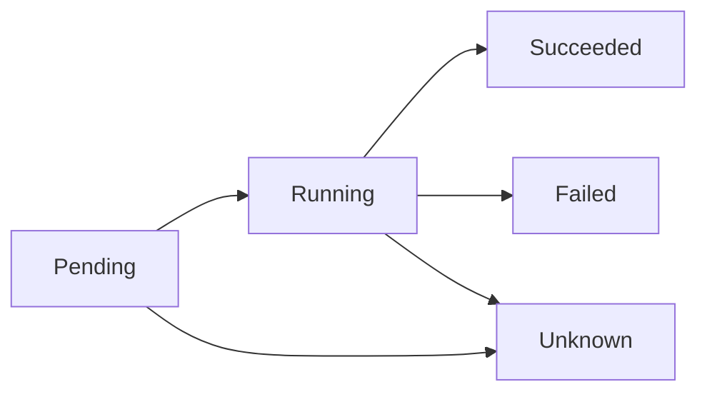
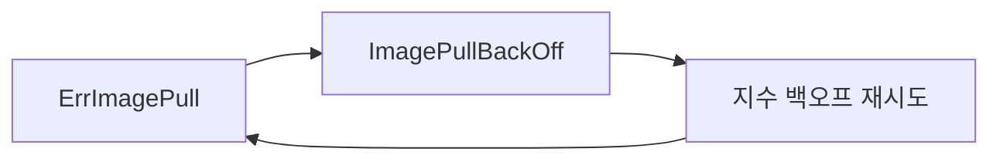
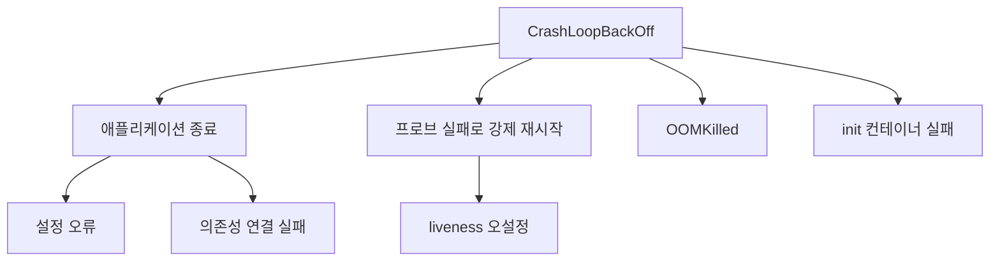
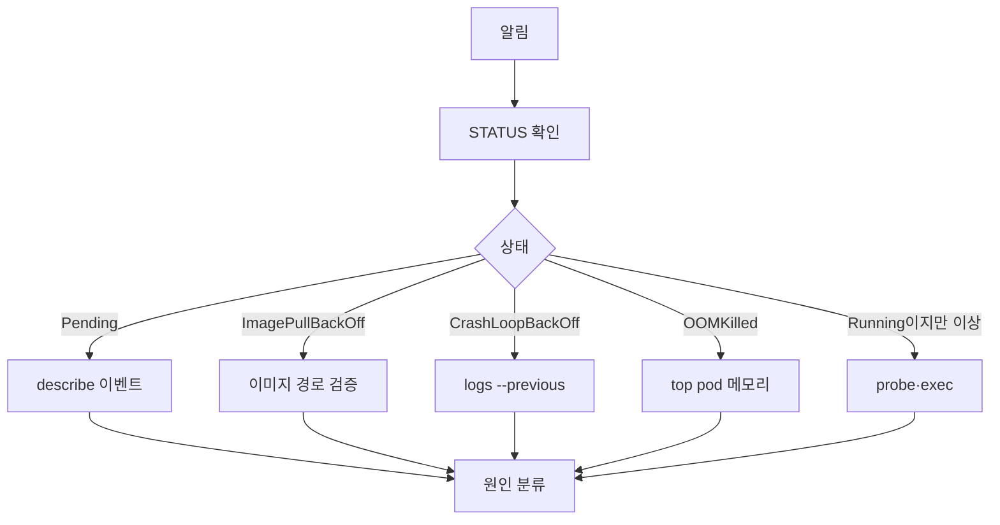

# Pod 디버깅

Pod 디버깅은 트러블슈팅의 가장 기본 레이어다. 알림이 울리고 PagerDuty가
흔들리면 90%는 "왜 Pod가 정상이 아닌가"부터 시작한다. Pending인지
CrashLoopBackOff인지, OOMKilled인지, 이미지 풀 실패인지 — 상태 이름
하나가 원인 80%를 줄여주기 때문에 **상태를 정확히 읽는 능력**이 먼저다.

이 글은 Pod 라이프사이클 기준으로 `Pending → Running → Terminated`
각 단계의 실패 패턴, kubectl 진단 명령 체계, 흔한 exit code
(137/143/125), `kubectl debug` 프로파일까지 운영 관점으로 정리한다.

> 상세 주제: [컨트롤 플레인 장애](./control-plane-failure.md) ·
> [K8s 에러 메시지](./k8s-error-messages.md) ·
> [Finalizer Stuck](./finalizer-stuck.md)
> 선행 개념: [Pod 라이프사이클](../workloads/pod-lifecycle.md) ·
> [스케줄러](../scheduling/scheduler.md)

---

## 1. Pod 라이프사이클과 실패 지점

Pod의 상태(`phase`)는 5가지지만, 실전에서 마주치는 **컨테이너 상태**는
더 세분화된다. `kubectl get pod` 한 줄에 뜨는 `STATUS`는 phase가 아닌
`ContainerStatuses`에서 계산된 값이다.

| Pod phase | 의미 | 흔한 원인 |
|---|---|---|
| `Pending` | 스케줄·이미지 풀·볼륨 마운트 대기 | 리소스 부족, taint, PVC pending |
| `Running` | 1개 이상 컨테이너가 실행 중 | — |
| `Succeeded` | 모든 컨테이너가 0으로 종료 | Job 정상 종료 |
| `Failed` | 1개 이상 컨테이너가 비정상 종료 | 설정 오류, 애플리케이션 버그 |
| `Unknown` | kubelet과 통신 불가 | 노드 장애·네트워크 단절 |



`kubectl get pod`에 찍히는 `CrashLoopBackOff`·`ImagePullBackOff`·
`ContainerCreating`은 phase가 아니라 **컨테이너 대기 사유**(`waiting.reason`)다.
`Pending` phase에 머물러 있는 시간이 길 뿐이다.

---

## 2. 1차 진단 명령 5종 세트

알림을 받으면 **순서대로** 이 다섯 개만 때린다. 대부분 여기서 끝난다.

```bash
# 1) 상태·재시작 횟수 파악
kubectl get pod <pod> -o wide

# 2) 이벤트와 최근 상태 변화
kubectl describe pod <pod>

# 3) 현재 컨테이너 로그
kubectl logs <pod> -c <container> --tail=200

# 4) 직전 컨테이너 로그 (크래시한 경우)
kubectl logs <pod> -c <container> --previous --tail=200

# 5) 네임스페이스 전체 이벤트 시간순
kubectl get events -n <ns> --sort-by=.lastTimestamp
```

### 핵심은 `--previous`

CrashLoopBackOff에서 **지금 실행 중인 컨테이너 로그는 비어 있다**.
크래시 직전 로그를 보려면 반드시 `--previous` 플래그가 필요하다.
이걸 모르고 `kubectl logs`만 반복해서 보면 평생 원인을 못 찾는다.

### 이벤트는 휘발성

`kubectl describe` 하단 Events는 기본 1시간만 보관된다
(`--event-ttl` kube-apiserver 플래그). 오래된 사건은 설령 있었어도
사라진다. 장애 조사는 **알림 직후** 하는 것이 원칙.

### `--previous`의 한계

`--previous`는 **바로 직전 종료 인스턴스** 하나만 제공한다. kubelet은
`--maximum-dead-containers-per-container`(기본 1) 이후 죽은 컨테이너를
GC하므로, 크래시가 2회 이상 반복되면 첫 크래시 로그는 접근 불가다.
**원격 로그 수집(Loki, Elastic, OTel 수집기 등)이 1차 소스**이고
`--previous`는 백업 수단으로 봐야 한다.

### Pod 문제 vs 노드 문제 구분

같은 노드의 여러 Pod이 동시에 이상하면 **Pod이 아니라 노드**다.

```bash
kubectl get pod -A -o wide | grep <node> | grep -v Running
kubectl describe node <node>
```

노드의 `Conditions`에 `MemoryPressure`·`DiskPressure`·`PIDPressure`·
`NetworkUnavailable`이 `True`면 즉시 노드 레이어로 조사를 옮긴다.

---

## 3. Pending — 스케줄링 실패

### 증상과 원인 지도

Pod이 `Pending`에서 움직이지 않는다면 스케줄러가 **어느 노드도
선택하지 못했다**는 뜻이다. `kubectl describe pod` Events에서
`FailedScheduling`을 찾고 사유를 읽는다.

| Events 메시지 | 원인 | 1차 확인 |
|---|---|---|
| `Insufficient cpu/memory` | 리소스 부족 | `kubectl describe node` Allocated |
| `didn't match node selector` | nodeSelector 불일치 | 라벨: `kubectl get node --show-labels` |
| `had untolerated taint` | taint에 toleration 없음 | `kubectl describe node \| grep Taint` |
| `didn't match pod affinity` | affinity 조건 실패 | Pod spec affinity 재검토 |
| `pod has unbound PersistentVolumeClaims` | PVC 미바인딩 | `kubectl get pvc` |
| `node(s) didn't have free ports` | hostPort 충돌 | DaemonSet `hostPort`·`hostNetwork` |
| `0/N nodes are available` | 전체 노드 실패 | 사유별 숫자 합산으로 진단 |

### 리소스 부족 진단

```bash
# 각 노드의 실제 할당률
kubectl describe node <node> | grep -A5 "Allocated resources"

# 전체 노드의 가용 리소스 요약
kubectl top node
```

`Requests`가 노드 capacity에 근접하면 신규 Pod이 못 들어간다. **limit이
아니라 request 합계**가 스케줄링 기준이다. 오버커밋해서 운영하는
환경이라면 request를 줄이거나 노드를 추가한다.

### Taint/Toleration 매칭

```bash
kubectl describe node <node> | grep -i taint
# Taints: node-role.kubernetes.io/control-plane:NoSchedule
```

컨트롤플레인·GPU·Spot 노드에 흔히 걸려있다. Pod에 대응하는
toleration이 없으면 스케줄러가 후보에서 제외한다.

### PVC Pending

PVC가 `Pending`이면 Pod도 계속 Pending이다. 흔한 원인:

- StorageClass의 프로비저너가 죽었거나 노드에 없음
- `WaitForFirstConsumer` 모드인데 Pod이 스케줄 안 되어 순환 대기
- 남은 용량 부족 (Ceph OSD full, local-path-provisioner 디스크 부족)

### hostPort 포트 충돌

DaemonSet(ingress 컨트롤러, node-exporter 류)이 `hostPort`를 쓰면
해당 포트가 비어 있는 노드에만 스케줄된다. 같은 노드에서 이미 쓰고
있으면 `didn't have free ports for the requested pod ports` 메시지로
Pending에 고정된다. **DaemonSet끼리 hostPort가 겹치지 않도록** 포트
영역을 분리하는 것이 원칙.

---

## 4. ImagePullBackOff / ErrImagePull

### 상태 전이

이미지 풀 실패는 단계적으로 상태가 바뀐다.



`ErrImagePull`이 즉시 발생, kubelet이 재시도하면서
`ImagePullBackOff`(최대 5분 간격)로 바뀐다. **원인은 동일**, 상태
이름만 시점에 따라 다르다.

### 원인 분류

| 원인 | 메시지 예시 | 대응 |
|---|---|---|
| 이미지 이름 오타 | `manifest unknown` | 태그·레지스트리 경로 확인 |
| 이미지 태그 없음 | `not found: manifest unknown` | 레지스트리에 실제 푸시됐는지 |
| 사설 레지스트리 인증 | `401 Unauthorized` | `imagePullSecrets` 확인 |
| 레지스트리 접속 불가 | `dial tcp: no such host` | DNS·방화벽·프록시 |
| Rate limit (Docker Hub) | `toomanyrequests` | 인증 설정 또는 미러 |
| 아키텍처 불일치 | `no matching manifest for linux/arm64` | 멀티아키 이미지 빌드 |

### 사설 레지스트리 인증 디버깅

```bash
# Pod에 붙어있는 pull secret 확인
kubectl get pod <pod> -o jsonpath='{.spec.imagePullSecrets}'

# Secret 내용 디코드
kubectl get secret <pull-secret> -o jsonpath='{.data.\.dockerconfigjson}' \
  | base64 -d | jq
```

ServiceAccount의 `imagePullSecrets`은 **Pod 생성 시점에만** 주입된다.
Secret을 교체했다면 Pod을 재생성해야 새 값이 반영된다.

### 노드에서 직접 당겨보기

kubelet이 실제로 실패하는지 확인하려면 노드 접근 후
컨테이너 런타임으로 직접 풀한다.

```bash
# containerd
crictl pull <image>

# 또는 debug node
kubectl debug node/<node> -it --image=alpine
```

---

## 5. CrashLoopBackOff — 재시작 루프

### 왜 `BackOff`인가

컨테이너가 종료되면 kubelet이 재시작하는데, 짧은 시간 내 반복 실패
시 **지수 백오프**로 대기 시간을 늘린다(10s → 20s → 40s … 최대 5분).
`CrashLoopBackOff`는 "크래시했고, 지금 재시작 대기 중"이라는 뜻.

> v1.32부터 KEP-4603(CrashLoopBackOff 튜너블)이 알파로 들어와
> 백오프 상한을 kubelet 플래그로 조정할 수 있다. 대부분 클러스터는
> 여전히 상한 5분이 기본.

### 원인 트리



### exit code로 원인 좁히기

```bash
kubectl get pod <pod> -o jsonpath='{.status.containerStatuses[*].lastState.terminated}' | jq
```

| Exit code | 의미 | 흔한 원인 |
|---|---|---|
| 0 | 정상 종료 | 메인 프로세스가 할 일 끝내고 빠짐 |
| 1 | 일반 에러 | 애플리케이션 예외 |
| 125 | 컨테이너 런타임 오류 | 이미지 손상, 설정 오류 |
| 126 | 실행 권한 없음 | `chmod +x` 누락 |
| 127 | 명령 없음 | PATH 오류, binary 누락 |
| 137 | `SIGKILL` (128+9) | OOMKilled / graceful timeout |
| 139 | `SIGSEGV` (128+11) | 세그폴트, 메모리 접근 오류 |
| 143 | `SIGTERM` (128+15) | 정상 graceful shutdown |

**137은 두 갈래로 분기**한다. `lastState.terminated.reason`이
`OOMKilled`면 메모리 초과, **비어 있는데도 137**이면 kubelet이
`terminationGracePeriodSeconds` 경과 후 SIGKILL한 graceful timeout
케이스다. 후자는 preStop 훅 또는 앱의 SIGTERM 핸들러를 점검한다.

### Liveness 프로브 오설정

CrashLoopBackOff의 상당 비율이 애플리케이션 버그가 아닌 **프로브
자살**이다. 시작이 느린 앱에 `initialDelaySeconds`가 짧으면
kubelet이 liveness 실패로 판단하고 SIGTERM → SIGKILL로 죽인다.

```yaml
# ❌ 나쁜 예 — 시작 30초 걸리는 앱을 5초에 판정
livenessProbe:
  httpGet: { path: /healthz, port: 8080 }
  initialDelaySeconds: 5
  periodSeconds: 10
  failureThreshold: 3

# ✅ 좋은 예 — startup probe로 시작 보호
startupProbe:
  httpGet: { path: /healthz, port: 8080 }
  periodSeconds: 5
  failureThreshold: 30       # 최대 150초까지 허용
livenessProbe:
  httpGet: { path: /healthz, port: 8080 }
  periodSeconds: 10
  failureThreshold: 3
```

**Liveness는 DB·외부 API를 체크하지 않는다**. 외부가 죽으면 모든 Pod이
재시작되고 새 Pod도 똑같이 실패해서 장애가 증폭된다. 외부 의존성은
**readiness**에서만 본다.

### Probe와 graceful shutdown 상호작용

`failureThreshold × periodSeconds`가 `terminationGracePeriodSeconds`
보다 크게 남아 있으면 **preStop 훅이 돌고 있는 와중에 liveness가
다시 실패로 판정**되어 SIGKILL이 먼저 떨어진다. 결과: graceful
shutdown이 잘려 나간다. preStop·drain 시간을 쓰는 Pod은

- liveness `periodSeconds × failureThreshold` ≤ grace period
- 또는 `terminationGracePeriodSeconds`를 충분히 길게

둘 중 하나를 반드시 맞춘다.

### init 컨테이너 실패

init 컨테이너가 실패하면 Pod은 `Init:N/M` 또는 `Init:CrashLoopBackOff`
상태로 멈춘다. **메인 컨테이너는 아예 뜨지 않는다**. 진단은 init에
맞춰 별도로 한다.

```bash
# init 컨테이너 상태
kubectl get pod <pod> -o jsonpath='{.status.initContainerStatuses}' | jq

# 실패한 init 로그
kubectl logs <pod> -c <init-container>
kubectl logs <pod> -c <init-container> --previous
```

여러 init이 직렬로 돌기 때문에 **어느 단계에서 멈췄는지** 순서대로
확인한다. 흔한 패턴: migration init이 DB 접속을 기다리다 타임아웃,
config fetcher가 S3/Vault에 닿지 못함, wait-for-dependency 패턴이
무한 대기.

---

## 6. OOMKilled — 메모리 초과

### 메커니즘

컨테이너 메모리 사용량이 `resources.limits.memory`를 넘으면 **리눅스
커널 OOM killer**가 프로세스를 죽인다. kubelet은 이를 감지해
`containerStatuses[*].lastState.terminated.reason: OOMKilled`로
기록한다. Exit code는 137.

```bash
kubectl get pod <pod> \
  -o jsonpath='{.status.containerStatuses[*].lastState.terminated.reason}'
# OOMKilled
```

### 두 가지 OOM

| 종류 | 대상 | 원인 |
|---|---|---|
| 컨테이너 OOM | 해당 컨테이너만 | `limits.memory` 초과 |
| 노드 OOM | 노드 전체 Pod | 노드 물리 메모리 고갈, `kernel: Out of memory` |

노드 OOM은 `kubectl describe node`의 `SystemOOM` 이벤트와 노드
syslog(`dmesg | grep -i oom`)로 확인한다. kubelet이 `MemoryPressure`
상태로 바뀌고 Pod eviction이 일어난다.

### 실제 사용량 측정

```bash
# 현재 사용량 (metrics-server 필요)
kubectl top pod <pod> --containers

# 장기 추세는 Prometheus
# container_memory_working_set_bytes{pod="<pod>"}
```

`working_set`은 "실제 회수할 수 없는 RSS + 활성 캐시"로, OOM killer의
판정 기준과 유사하다. RSS만 보면 과소추정한다.

### 대응

- **limit을 사용량 피크 × 1.3**이 일반 경험칙. 단, 런타임 특성을 감안
- JVM: heap(`-Xmx`) 외에 **metaspace, direct buffer, 스레드 스택,
  JIT 코드 캐시**가 컨테이너 limit에 합산된다. `-Xmx`는 limit보다
  20–30% 낮게, 나머지는 측정 후 여유를 둔다
- Go: `GOMEMLIMIT`(soft) + container limit(hard)을 함께 설정. soft
  limit에서 GC가 공격적으로 돌아 SIGKILL 전에 자체 회수
- Node.js: `--max-old-space-size`는 V8 heap만 제한. native addon
  메모리는 별도로 누적
- 메모리 누수 의심 시 `pprof`·`jmap`·`heapdump` 수집
- VPA(Vertical Pod Autoscaler) recommend 모드로 권장값 산출

---

## 7. Running인데 이상한 경우

`STATUS=Running`이지만 장애 증상이 있는 패턴. 가장 흔한 두 가지.

### Readiness 실패 → 트래픽 0

Readiness 프로브가 실패하면 **EndpointSlice에서 제외**되어
Service 트래픽이 오지 않는다. Pod은 Running으로 보이지만 호출자가
"503" 또는 "connection refused"를 본다.

```bash
# Service에 연결된 엔드포인트 확인
kubectl get endpointslice -l kubernetes.io/service-name=<svc> -o wide

# Pod의 Ready 조건
kubectl get pod <pod> -o jsonpath='{.status.conditions[?(@.type=="Ready")]}'
```

Pod의 `Ready: False`이면 원인이 readiness 프로브 실패인지
(`Events`에서 `Readiness probe failed` 확인), 아니면 Pod이
`Terminating` 또는 `NotReady` 노드에 있는지 확인한다.

### CPU throttling

limit을 꽉 채우면 CFS(Completely Fair Scheduler) 쿼터에 걸려
스레드가 **마이크로 단위로 일시정지**된다. CPU 사용률은 limit 근처로
잡히는데 p99 지연이 튀는 전형적 패턴.

```bash
# Prometheus (컨테이너 메트릭이 있다면)
# rate(container_cpu_cfs_throttled_periods_total[5m])
#   / rate(container_cpu_cfs_periods_total[5m])
```

throttled 비율이 20% 넘으면 **CPU limit을 늘리거나, 아예 limit을
빼고** request로만 운영한다. 많은 조직이 Kubernetes의 CFS 구현
특성 때문에 CPU limit을 쓰지 않는다.

---

## 8. Terminating 지연

Pod이 `Terminating` 상태로 오래 머무는 경우.

| 원인 | 진단 | 대응 |
|---|---|---|
| graceful shutdown이 느림 | 앱 로그 | `terminationGracePeriodSeconds` 조정 |
| preStop 훅이 막힘 | `kubectl describe` | 훅 타임아웃 설정 |
| Finalizer 미제거 | `kubectl get pod -o yaml` | 컨트롤러 상태 확인 |
| 노드 응답 없음 | 노드 상태 | 노드 복구 후 강제 삭제 |
| PDB로 evict 차단 | `cannot evict pod ... disruption budget` | PDB 재설계·임시 완화 |

PDB 관련 메시지는 노드 드레인·업그레이드 중에 자주 나온다. 대응은
*PDB를 강제로 무시하지 말고* PDB의 `minAvailable`·`maxUnavailable`이
현실적인지 재검토, 레플리카 증설, 드레인 순서 조정으로 푼다.

**`kubectl delete --force --grace-period=0`은 마지막 수단**이다.
stateful 워크로드(StatefulSet, DB)에서 강제 삭제는 데이터 손상
위험이 있다. 반드시 실제 프로세스가 죽은 것을 확인한 뒤 사용.

→ 상세: [Finalizer Stuck](./finalizer-stuck.md)

---

## 9. kubectl debug — ephemeral 컨테이너

일반 이미지는 `sh`·`curl`·`ps`도 없는 경우가 많다(distroless, scratch).
`kubectl debug`는 **기존 Pod에 디버그 컨테이너를 임시 주입**한다.
v1.25에서 GA.

```bash
# 실행 중 Pod에 busybox 붙이기
kubectl debug <pod> -it --image=busybox --target=<container>

# 크래시한 Pod 복제 + 명령 변경
kubectl debug <pod> --copy-to=debug-<pod> --set-image=*=busybox \
  --share-processes -- sleep 1d

# 노드에 루트 셸
kubectl debug node/<node> -it --image=ubuntu
```

### 프로파일

권한 수준을 프로파일로 지정한다(KEP-1441 기준).

| 프로파일 | 성격 | 용도 |
|---|---|---|
| `legacy` | 현재 default (v1.36부터 general로 default 변경, v1.39 제거 예정) | 이전 동작 유지. PSA restricted 네임스페이스에서는 막힘 |
| `general` | 표준 디버깅 권한 | 일반 트러블슈팅 |
| `baseline` | PSA baseline 호환 | PSA baseline 네임스페이스 |
| `restricted` | PSA restricted 호환 | PSA restricted 네임스페이스 |
| `netadmin` | NET_ADMIN, NET_RAW | 네트워크 분석 |
| `sysadmin` | 거의 모든 캡 | 노드·커널 레벨 |

```bash
kubectl debug <pod> -it --image=nicolaka/netshoot \
  --profile=netadmin --target=app
```

`baseline`·`restricted`는 "최고 보안"이 아니라 **PSA 정책이 적용된
네임스페이스에서도 디버그가 실패하지 않도록 권한을 축소해주는 호환
프로파일**이다. 강한 권한이 필요하면 `sysadmin`을 쓴다.

### `--target` vs 복제

| 방식 | 장점 | 단점 |
|---|---|---|
| `--target` (ephemeral) | Pod 안에서 네임스페이스 공유, 재시작 없음 | `CrashLoopBackOff`인 Pod엔 무효 |
| `--copy-to` | 크래시한 Pod도 조사 가능 | 새 Pod이므로 원본 상태 보존 안 됨 |

ephemeral 컨테이너는 **Pod 삭제 전까지 제거 불가**다. 장기 운영 중인
Pod에 무분별하게 붙이면 리소스 누수가 쌓인다.

### 보안 주의

`kubectl debug node/<node>`는 호스트 파일시스템이 `/host`에 마운트되고
호스트 PID·Network 네임스페이스를 공유하는 **사실상 루트 셸**이다.
프로덕션에서는 RBAC로 운영자 계정에만 허용, 감사 로그 필수, Kyverno·
OPA Gatekeeper로 프로파일·이미지를 제한한다. static pod(mirror pod)는
`kubectl delete`로 사라지지 않고 kubelet이 즉시 재생성하므로,
매니페스트 디렉터리(`/etc/kubernetes/manifests`)에서 제거해야 한다.

### RBAC 권한 에러

`kubectl logs`·`exec`·`debug` 실행 중 `forbidden: User "..." cannot ...`
메시지는 RBAC가 원인이다.

```bash
# 현재 자격으로 가능한지 확인
kubectl auth can-i create pods/ephemeralcontainers -n <ns>
kubectl auth can-i --as=<sa> get pods/log -n <ns>
```

ephemeral 컨테이너 주입에는 **`pods/ephemeralcontainers`** 서브리소스
권한이 별도로 필요하다. `pods/exec`·`pods/log`만 있으면 `kubectl debug`는
실패한다. 디버깅 전용 Role을 만들어 운영자에게만 부여하는 것이 안전.

---

## 10. 운영 체크리스트

알림 발생 순간부터 1차 대응까지 순서대로 진행한다.



### 표준 진단 절차

1. `kubectl get pod -o wide` — STATUS·RESTARTS·NODE·AGE
2. `kubectl describe pod` — Events 마지막 5건 읽기
3. `kubectl logs --previous` (크래시한 경우) — 에러 스택
4. 원인 분류 후 해당 섹션 절차 진행
5. 해결 후 `kubectl get events --sort-by=.lastTimestamp` 로 재발 확인
6. 포스트모템: `last_verified` 데이터에 근본 원인 기록

### 하지 말아야 할 것

- `kubectl delete pod`로 "해결": 원인 없이 증상만 덮는 것. 로그
  확보 전에 지우면 조사가 불가능해진다.
- `kubectl delete --force` 남용: 컨트롤러 상태 불일치를 유발.
- 프로덕션에서 `--image=ubuntu:latest`: 이미지 풀로 장애 시간 연장.
  사전에 사내 미러에 디버그 이미지(`netshoot`, `busybox`)를 캐싱.
- liveness probe를 외부 의존성에 걸기: 연쇄 재시작의 주범.

---

## 참고 자료

- [Debug Pods — Kubernetes 공식](https://kubernetes.io/docs/tasks/debug/debug-application/debug-pods/) (2026-04-24 확인)
- [Debug Running Pods — Kubernetes 공식](https://kubernetes.io/docs/tasks/debug/debug-application/debug-running-pod/) (2026-04-24 확인)
- [Ephemeral Containers — Kubernetes 공식](https://kubernetes.io/docs/concepts/workloads/pods/ephemeral-containers/) (2026-04-24 확인)
- [kubectl debug 레퍼런스](https://kubernetes.io/docs/reference/kubectl/generated/kubectl_debug/) (2026-04-24 확인)
- [Liveness, Readiness, Startup Probes](https://kubernetes.io/docs/concepts/configuration/liveness-readiness-startup-probes/) (2026-04-24 확인)
- [Taints and Tolerations](https://kubernetes.io/docs/concepts/scheduling-eviction/taint-and-toleration/) (2026-04-24 확인)
- [GKE — Troubleshoot CrashLoopBackOff events](https://docs.cloud.google.com/kubernetes-engine/docs/troubleshooting/crashloopbackoff-events) (2026-04-24 확인)
- [Kubernetes Exit Codes — Komodor](https://komodor.com/learn/exit-codes-in-containers-and-kubernetes-the-complete-guide/) (2026-04-24 확인)
- [KEP-1441 kubectl debug](https://github.com/kubernetes/enhancements/blob/master/keps/sig-cli/1441-kubectl-debug/README.md) (2026-04-24 확인)
- [KEP-4603 Tune CrashLoopBackOff](https://github.com/kubernetes/enhancements/blob/master/keps/sig-node/4603-tune-crashloopbackoff/README.md) (2026-04-24 확인)
- [kubectl debug default profile 변경 (kubectl#1780)](https://github.com/kubernetes/kubectl/issues/1780) (2026-04-24 확인)
- [Pod Lifecycle — Kubernetes](https://kubernetes.io/docs/concepts/workloads/pods/pod-lifecycle/) (2026-04-24 확인)
