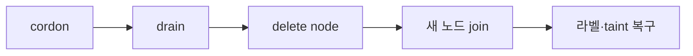
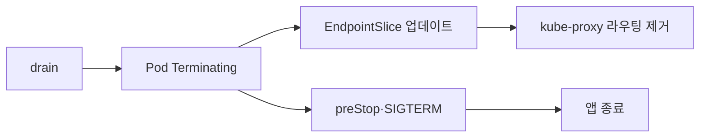

# 노드 유지보수

노드 유지보수는 **"Pod을 다치지 않게 치워두고, 노드를 손보고, 다시
스케줄링에 돌려놓는" 순환**이다. 구체적 시나리오.

| 시나리오 | 필요 작업 |
|---------|---------|
| OS 패치·재부팅 | cordon → drain → 재부팅 → uncordon |
| 커널·펌웨어 업그레이드 | 상동 |
| 하드웨어 점검·교체 | drain → `delete node` → 새 노드 join |
| 노드 풀 축소(Cluster Autoscaler·Karpenter) | drain 자동화, budgets·PDB 존중 |
| 버전 업그레이드(kubelet) | [클러스터 업그레이드](./cluster-upgrade.md) |

**원칙 세 가지.**

1. **한 번에 한 노드씩**. 병렬 drain은 PDB·쿼럼을 깬다.
2. **자발적 중단은 Eviction API**를 거친다 — 여기서 PDB·graceful
   terminate가 지켜진다. `kubectl delete pod` 와 의미가 다르다.
3. **노드가 예기치 않게 꺼지면** PDB는 지켜지지 않는다(involuntary).
   Graceful Node Shutdown·Non-Graceful Node Shutdown 으로 보완한다.

이 글은 **노드 단위 유지보수 절차·함정·도구**에 집중한다. PDB의 상세
설계는 [PDB](../reliability/pdb.md), 클러스터 업그레이드 절차는
[클러스터 업그레이드](./cluster-upgrade.md), 애플리케이션 graceful
shutdown 은 [Graceful Shutdown](../reliability/graceful-shutdown.md)
참조.

> 관련: [클러스터 업그레이드](./cluster-upgrade.md)
> · [PDB](../reliability/pdb.md)
> · [Graceful Shutdown](../reliability/graceful-shutdown.md)
> · [Eviction](../reliability/eviction.md)
> · [Pod 라이프사이클](../workloads/pod-lifecycle.md)

---

## 1. 중단의 분류 — voluntary vs involuntary

PDB·grace period·Graceful Node Shutdown 이 어떻게 얽히는지 이해하려면
**중단의 4가지 유형**을 구분해야 한다.

| 중단 | 경로 | PDB | graceful shutdown |
|------|------|:---:|:---:|
| `kubectl drain`(이 글) | Eviction API | ✓ | ✓ |
| Cluster Autoscaler·Karpenter 축소 | Eviction API | ✓ | ✓ |
| `kubectl delete pod` | DELETE | ✗ | ✓ |
| Graceful Node Shutdown(OS reboot) | kubelet | **✗** | ✓(노드 전체 grace 안) |
| Non-Graceful Node Shutdown(오프라인) | controller-manager | ✗ | ✗ |
| OOMKilled·노드 하드 장애 | kubelet / OS | ✗ | ✗ |

PDB가 보호하는 영역은 **"자발적"** 뿐. 노드가 꺼지는 순간부터는 다른
메커니즘이 필요하다.

---

## 2. 기본 명령 — cordon·drain·uncordon

### 2.1 의미


| 명령 | 의미 |
|------|------|
| `kubectl cordon <node>` | 신규 Pod 스케줄 금지. **기존 Pod은 유지**. |
| `kubectl drain <node>` | cordon + 기존 Pod을 Eviction API 로 퇴거. |
| `kubectl uncordon <node>` | 스케줄 가능 상태로 복구. |

drain은 내부적으로 cordon을 포함한다. 분리해서 써야 할 때는 "신규
스케줄만 막고 기존은 그대로"(점진적 축소, 디버깅)일 때다.

### 2.2 노드 교체 라이프사이클



OS 패치는 2.1 순환으로 충분하지만, **하드웨어 교체·수명 다한 노드**
는 `kubectl delete node` 후 새 노드를 조인시키고 라벨·taint·affinity
키를 복구한다.

### 2.3 프로덕션 안전 drain 명령

```bash
kubectl drain <node> \
  --ignore-daemonsets \
  --delete-emptydir-data \
  --grace-period=-1 \
  --timeout=600s
```

| 플래그 | 의미·권장 |
|-------|---------|
| `--ignore-daemonsets` | DaemonSet Pod은 evict 안 됨. **필수** |
| `--delete-emptydir-data` | emptyDir 데이터 삭제 동의. 스테이징·로그 Pod 확인 후 |
| `--grace-period=N` | -1(기본): Pod spec 값 사용. 0: `--force` 동반 시 즉시 삭제 |
| `--timeout=600s` | drain 전체 타임아웃. 0은 무한 |
| `--pod-selector=...` | 라벨 필터 |
| `--force` | 컨트롤러 없는 Pod 강제 |
| `--disable-eviction` | **Eviction API 자체 우회, DELETE로 전환** — 4.3 참조 |

### 2.4 Eviction API 흐름

drain은 Pod마다 `POST /api/v1/namespaces/<ns>/pods/<pod>/eviction` 을
호출한다. API 서버가 PDB를 확인하고 OK면 `Pod.DeletionTimestamp` 설정.
이후 kubelet 이 graceful shutdown 을 진행.

**`kubectl delete pod` 와의 차이.**

| 항목 | Eviction(=drain) | delete |
|------|:---------------:|:------:|
| PDB 확인 | ✓ | ✗ |
| graceful shutdown | ✓ | ✓ |
| 관련 컨트롤러 재생성 | ✓ | ✓ |
| 쿼럼 보호 | ✓ | ✗ |

쿼럼 워크로드(etcd·Kafka·ZooKeeper)에는 delete 금지 — 반드시 eviction.

### 2.5 Eviction 재시도·backoff

eviction 요청이 PDB 위반으로 429를 받으면 **kubectl은 약 5초 간격으로
재시도** 한다. `--timeout` 이 전체 상한. `--timeout=0` 은 무한.
"몇 분 대기해도 진행이 없으면 stuck 판단"이 실무 감각. 3.4 진단 참조.

### 2.6 한 번에 한 노드씩

여러 노드를 동시에 drain 하면 PDB 계산이 꼬인다. 수동이라면 순차.

```bash
for n in node-01 node-02 node-03; do
  kubectl drain "$n" --ignore-daemonsets --delete-emptydir-data \
    --timeout=600s
  # 유지보수 수행
  kubectl uncordon "$n"
done
```

자동화 도구(Karpenter·CA·system-upgrade-controller·Kured·CAPI) 는
이미 한 노드씩 동작하도록 설계됐다.

---

## 3. PDB·Eviction 상호작용

### 3.1 PDB가 drain을 막는다

PDB(`PodDisruptionBudget`) 는 `disruptionsAllowed=0` 일 때 eviction
을 HTTP 429로 거절. drain은 대기·재시도한다.

### 3.2 Unhealthy Pod Eviction Policy

`unhealthyPodEvictionPolicy` — **1.26 Alpha → 1.27 Beta(기본 on) →
1.31 GA**.

- `IfHealthyBudget`(기본): Ready Pod만 currentHealthy 로 계산. CrashLoop
  만 있을 때 drain stuck 발생.
- `AlwaysAllow`: unhealthy Pod 은 언제든 evict. **권장 기본**.

```yaml
apiVersion: policy/v1
kind: PodDisruptionBudget
spec:
  minAvailable: 2
  selector: {matchLabels: {app: web}}
  unhealthyPodEvictionPolicy: AlwaysAllow
```

상세는 [PDB](../reliability/pdb.md).

### 3.3 DisruptionTarget Pod condition

Pod이 중단 대상이 되면 Pod에 `DisruptionTarget=True` condition 이
붙고, reason 이 원인을 알려준다.

| reason | 의미 |
|--------|------|
| `EvictionByEvictionAPI` | drain·eviction API |
| `PreemptionByScheduler` | 우선순위 preemption |
| `DeletionByTaintManager` | taint `NoExecute` |
| `TerminationByKubelet` | Graceful Node Shutdown, 노드 압박 |

drain stuck 디버깅 시 `kubectl get pod -o jsonpath` 로 condition 과
reason 을 조회.

### 3.4 drain stuck 진단

```bash
kubectl get pdb -A                              # ALLOWED DISRUPTIONS
kubectl describe pdb <name> -n <ns>             # DisruptionAllowed 이유
kubectl get pod -o wide | grep <node>           # 노드의 남은 Pod
kubectl get events --sort-by=.lastTimestamp | grep -i evict
kubectl get pod -o jsonpath='{.status.conditions}'
```

### 3.5 해결 패턴

| 상황 | 해결 |
|------|------|
| PDB 0 허용, 모든 Pod healthy but 꽉 참 | replica 임시 증가·PDB 일시 완화 |
| 모든 Pod unhealthy 로 stuck | `unhealthyPodEvictionPolicy: AlwaysAllow` |
| 쿼럼 워크로드 리더 ↔ PDB 경합 | 리더 이동 후 drain |
| 절박한 긴급 | `--disable-eviction`(4.3 경고 읽고) |

---

## 4. grace period — 네 곳의 값이 어떻게 얽히나

2026 프로덕션 drain 사고의 최빈 원인. 값이 **네 곳** 에 있다.

| 설정 위치 | 의미 | 예 |
|---------|------|-----|
| Pod `spec.terminationGracePeriodSeconds` | Pod의 기본 grace | 60 |
| `kubectl drain --grace-period=N` | Pod 값 **덮어쓰기**(N초) | 30 |
| kubelet `shutdownGracePeriod` | 노드 전체 셧다운 grace **상한** | 45s |
| kubelet `shutdownGracePeriodCriticalPods` | critical 전용 | 15s |

### 4.1 precedence

- `kubectl drain --grace-period=-1`(기본) → Pod spec 값 사용.
- `--grace-period=N` 지정 → Pod spec 값을 N으로 **덮어쓴다**(더 짧게).
- `--grace-period=0` 만 해도 서버가 1초 최소값으로 강제. **즉시
  삭제는 `--grace-period=0 --force` 조합**.
- **Graceful Node Shutdown 의 `shutdownGracePeriod` 가 Pod grace
  보다 짧으면 Pod grace 가 잘린다** — 노드 전체 유예가 개별 Pod grace
  의 상한이다. preStop 이 충분한 wait을 원해도 노드 shutdown grace 가
  먼저 만료되면 SIGKILL.

### 4.2 preStop · SIGTERM · SIGKILL 순서

Pod 종료 시퀀스.

1. `Pod.DeletionTimestamp` 설정 → Pod `Terminating` 상태.
2. **preStop hook** 실행(grace 안에서).
3. SIGTERM 전송.
4. 애플리케이션 종료 or grace 만료.
5. grace 만료 후에도 프로세스 남아있으면 SIGKILL.

preStop 이 grace 말까지 실행 중이면 **2초 one-off extension** 이 주어
진다. 그래도 안 끝나면 SIGKILL.

### 4.3 `--disable-eviction` 의 실제 동작과 위험

**`--disable-eviction` 은 Eviction API 자체를 우회하고 DELETE API 로
직행한다.**

- PDB **우회** — 의도.
- graceful shutdown·preStop 은 여전히 동작(DELETE는 삭제 트리거만
  걸고 kubelet이 처리).
- **쿼럼 워크로드(etcd·Kafka)에 사용 금지** — 과반 Pod을 동시에 삭제
  하면 클러스터가 split-brain 또는 쿼럼 손실.
- 알려진 이슈: **timeout 없이 무한 대기하는 동작** 이 있음
  (kubectl/issues/1830). `--timeout` 반드시 지정.

**쓸 때만 쓴다.** PDB가 잘못 설정되어 있고, 지금 당장 drain 해야
하며, 대상 Pod이 쿼럼 워크로드가 아님을 확신할 때. 근본 해결은 PDB
재설계.

---

## 5. 예기치 않은 노드 종료

### 5.1 Graceful Node Shutdown

노드 OS가 shutdown·reboot 신호를 받을 때 kubelet이 **systemd
Inhibitor Lock** 으로 지연하면서 Pod을 graceful 하게 종료.

```yaml
# /var/lib/kubelet/config.yaml
apiVersion: kubelet.config.k8s.io/v1
kind: KubeletConfiguration
shutdownGracePeriod: 60s
shutdownGracePeriodCriticalPods: 20s
```

동작.

1. systemd 가 shutdown 이벤트 통지.
2. kubelet 이 노드에 `NotReady(reason: node is shutting down)` 설정.
3. Pod 마다 `DisruptionTarget=True`(reason: `TerminationByKubelet`).
4. **일반 Pod 먼저** `(shutdownGracePeriod - shutdownGracePeriodCriticalPods)`
   동안 종료.
5. **critical Pod**(`system-node-critical`) 을 남은 시간에 종료.

**중요.** Graceful Node Shutdown 은 **PDB 를 무시** — involuntary 로
간주.

### 5.2 Windows 노드

Linux systemd 에 해당하는 **Windows Graceful Node Shutdown** 은
`WindowsGracefulNodeShutdown` feature gate 로 **1.32 Alpha → 1.34
Beta(기본 on)** 로 진행 중. Windows 노드가 섞인 클러스터에서는
feature gate 와 kubelet 버전을 확인.

### 5.3 Non-Graceful Node Shutdown (1.26 Beta · 1.28 GA)

노드가 **응답 없이 꺼진 경우**(커널 패닉·네트워크 차단). StatefulSet
Pod은 volume attachment가 풀리지 않아 다른 노드에서 재스케줄 되지
않는다.

```bash
# 관리자가 확인 후 수동 표시
kubectl taint node <node> node.kubernetes.io/out-of-service=nodeshutdown:NoExecute
```

이 taint를 붙이면:

- **taint 에 tolerate 하지 않는 Pod** 이 강제 삭제.
- CSI 드라이버가 **ForceDetach** 지원 시 volume attachment 해제.
- 다른 노드에서 재스케줄·attach.

**주의.**

- 실제로 꺼진 경우에만. 오진 시 **데이터 손상 가능**(두 노드가 같은
  볼륨 write).
- `system-node-critical` 등 tolerate 하는 Pod 은 영향 없음 — 남아 있다.
- 로컬 스토리지(hostPath·local PV·emptyDir) 는 detach 개념이 없어
  혜택 제한적.

### 5.4 자동화 도구

| 도구 | 역할 |
|------|------|
| **Kured**(Kubernetes Reboot Daemon) | `/var/run/reboot-required` 감지 → 한 노드씩 drain·reboot |
| **system-upgrade-controller** | K8s Plan CRD 기반 노드 업그레이드 |
| **Cluster Autoscaler** | scale-in 시 drain 자동 |
| **Karpenter** | Disruption(Consolidation·Drift·Expiration) 자동 |
| **Cluster API MHC** | Unhealthy 노드 자동 교체 |
| **Node Problem Detector** | 노드 condition 감지·이벤트 생성 |

### 5.5 Karpenter Disruption Budgets

Karpenter NodePool 은 **자체 disruption budget** 이 있다. PDB 위에
한 층 더.

```yaml
apiVersion: karpenter.sh/v1
kind: NodePool
spec:
  disruption:
    consolidationPolicy: WhenEmptyOrUnderutilized
    budgets:
      - nodes: "10%"          # 전체 노드의 10%만 동시 disrupt
      - nodes: "0"            # cron 표현으로 블랙아웃
        schedule: "0 8 * * mon-fri"
        duration: 10h
        reasons: [Drifted, Underutilized, Empty]
```

Pod 레벨 어노테이션 `karpenter.sh/do-not-disrupt: "true"` 로 **개별
보호**도 가능. Karpenter 가 PDB 를 존중하지만, budget 은 그 위에서
도 한 번 더 제한.

### 5.6 Cluster API MachineHealthCheck

MHC 는 **Unhealthy 노드를 자동 교체** 한다. `drain` 을 호출해 gracious
이전 시도를 하되, `maxUnhealthy`·`unhealthyRange`·`nodeStartupTimeout`
경계 안에서만. 대량 장애 시 루프 방지가 핵심.

**중요.** MHC 는 "자동 복구"이지 "유지보수 예약"이 아니다. 계획된
작업에는 쓰지 않는다.

### 5.7 Node Problem Detector 와 자동 taint

NPD 는 커널 로그·디스크·네트워크 이상을 감지해 Node Condition
(`KernelDeadlock`·`ReadonlyFilesystem` 등)을 달거나 이벤트를 생성.
`TaintNodesByCondition` 기능(1.17+ GA)이 condition 을 taint 로 변환
(`node.kubernetes.io/memory-pressure` 등). 스케줄러는 이 taint를
존중해 자동 회피.

**함의.** NPD + TaintNodesByCondition + scheduler + CA/Karpenter 가
"자동 유지보수" 파이프라인을 이룬다. 수동 cordon/drain 은 이 체인의
보조 수단.

---

## 6. 배치·토폴로지와의 상호작용

### 6.1 DaemonSet 롤링

DaemonSet 은 노드마다 1 Pod.

```yaml
spec:
  updateStrategy:
    type: RollingUpdate
    rollingUpdate:
      maxUnavailable: 1      # or 10%
      maxSurge: 0            # 1.25 GA (2022-08 이후)
```

`maxSurge > 0` 이면 같은 노드에 일시적으로 기존 + 신규 공존 가능.
로그 수집기처럼 drop 이 치명적인 DaemonSet 에 유용.

### 6.2 Deployment 롤링과 노드 유지보수의 관계

Deployment의 `maxSurge`·`maxUnavailable` 는 **Pod replica 단위**.
drain 중 Pod 재스케줄이 가능하려면:

- **리소스 헤드룸** — CPU·메모리 + **kubelet `--max-pods`(기본 110)**
  슬롯 여유. slot 부족은 흔한 pending 원인.
- Topology Spread 가 엄격(`DoNotSchedule`)이면 **다른 존에 여유가
  있을 때만** 재스케줄.
- **사전 노드 +1**(headroom) 으로 창 준비.

### 6.3 Statefulset·쿼럼 워크로드

etcd·Kafka·ZooKeeper·Redis Cluster 는 **한 번에 하나씩** 교체.

- PDB `maxUnavailable: 1` 또는 `minAvailable: N-1`.
- PodAntiAffinity 로 같은 존·노드 금지.
- **drain 전에 리더 이동**.

**리더 이동 예시.**

| 시스템 | 명령 |
|--------|------|
| etcd | `etcdctl move-leader <target-member>` |
| Kafka | `kafka-leader-election.sh --election-type PREFERRED --topic X --partition Y` |
| Redis Cluster | `CLUSTER FAILOVER` (replica에서) |
| PostgreSQL(Patroni) | `patronictl switchover <cluster>` |

상세는 [PDB](../reliability/pdb.md) · [StatefulSet](../workloads/statefulset.md).

### 6.4 Service·LB — endpoint 제거 race

drain 직후 **5xx 스파이크** 는 실무 최빈 현상. 원인은 **EndpointSlice
업데이트와 Pod SIGTERM 이 병렬**이기 때문.



E와 F가 경쟁한다. D가 먼저 끝나면 **제거되기 전 트래픽이 이미 죽은
Pod으로** 간다.

**완화.**

1. **preStop hook 에 wait** — `sleep 10` 같은 짧은 대기로 EndpointSlice
   전파를 기다림.
2. **terminationGracePeriodSeconds 충분 확보**.
3. **ProxyTerminatingEndpoints**(1.28 GA) — Terminating Pod도 Ready
   상태라면 일시적으로 트래픽 수용.
4. **Service topology aware** — 같은 존 우선.

### 6.5 `externalTrafficPolicy: Local` 와 healthCheckNodePort

Local 모드에서는 `healthCheckNodePort` 로 외부 LB가 "해당 노드에
Ready endpoint 있는가" 판정. **drain 중 노드 마지막 Ready Pod이
Terminating 으로 전환되는 순간 healthCheckNodePort 가 503 반환** →
LB 가 그 노드를 pool 에서 제외. 이 타이밍이 부드러우려면
ProxyTerminatingEndpoints + preStop wait 병행.

### 6.6 Ingress·Gateway API

- LoadBalancer 뒤 Pod의 readiness 와 preStop 이 핵심.
- Gateway API 구현(Cilium·Envoy Gateway·Traefik)은 각자 healthcheck
  주기·drain 동작 차이. 벤더 문서 확인.

### 6.7 CoreDNS·CNI·CSI

- **CoreDNS**: Deployment. Topology Spread 로 분산. NodeLocal DNSCache
  로 완충.
- **CNI·kube-proxy**: DaemonSet — drain 에서 `--ignore-daemonsets`.
- **CSI**: PV attach·detach. 로컬 스토리지(local-path·Longhorn) 는
  재스케줄 대상 노드 제약 발생.

---

## 7. 노드 라벨·taint 운영

### 7.1 taint 기반 유지보수 예약

```bash
kubectl taint node <node> maintenance=true:PreferNoSchedule
kubectl taint node <node> maintenance=true:NoSchedule
kubectl taint node <node> maintenance=true:NoExecute
```

`NoExecute` 는 tolerate 하지 않는 모든 Pod 즉시 퇴거 — **drain 보다
덜 우아**(graceful shutdown 대신 삭제 트리거). `taint-based eviction
tolerationSeconds` 로 지연 가능.

### 7.2 cordon 과 Cluster Autoscaler 의 해석

- CA 는 **cordon(SchedulingDisabled) 노드를 축소 대상으로 보지 않는다**
  (CA FAQ). 수동 cordon 은 "유지보수 예약" 의미.
- CA `--skip-nodes-with-system-pods`·`--skip-nodes-with-local-storage`
  옵션이 drain 자동화에 간섭.
- **장기 cordon 방치 = 영구 유지보수 상태 고착**. 작업 끝났으면 즉시
  uncordon.

### 7.3 system-reserved·kube-reserved

노드 자원을 시스템·kubelet 이 먼저 확보. 유지보수 중 OOM 회피.

```yaml
systemReserved:
  cpu: 500m
  memory: 1Gi
kubeReserved:
  cpu: 500m
  memory: 500Mi
evictionHard:
  memory.available: "200Mi"
```

---

## 8. 유지보수 창·타임박스

**창 안에 마치지 못하면 중단** 원칙.

| 단계 | 타임박스 가이드 |
|------|-------------|
| 단일 노드 drain | 10~20분(워크로드 크기별) |
| 재부팅·작업 | 10~15분 |
| Ready 복귀·CNI·CSI 준비 | 5분 |
| 단일 노드 전체 | **30~45분** 이상은 롤백 판단 |

타임박스 초과 시점 판단 체크.

- `kubectl get pods -o wide | grep <node>` 가 줄어들지 않는가.
- PDB ALLOWED DISRUPTIONS 가 계속 0 인가.
- 재부팅 후 NotReady 10분 이상인가.

이런 신호에서는 무리하게 진행하지 말고 **원복 후 근본 원인**(PDB·
볼륨·하드웨어)을 먼저 해결.

---

## 9. 관측 — drain 중 무엇을 볼 것인가

| 지표·이벤트 | 의미 |
|----------|------|
| `kubelet_evictions` | kubelet 의 eviction 횟수·원인 |
| `kube_poddisruptionbudget_status_pod_disruptions_allowed` | PDB 여유 |
| `kube_pod_status_phase{phase="Pending"}` | 재스케줄 대기 |
| `kube_pod_status_reason{reason="NodeShutdown"}` | Graceful Node Shutdown 통과 |
| `apiserver_request_duration_seconds{verb="CREATE",resource="pods/eviction"}` | eviction 지연 |
| `node_condition` / `DisruptionTarget` | 노드·Pod 상태 |
| LB 5xx 스파이크(외부 메트릭) | endpoint race |

---

## 10. 안티패턴

| 안티패턴 | 문제 | 대안 |
|---------|------|------|
| `kubectl delete node` 먼저 | Pod 정리 없이 제거 → 갑작스런 실패 | drain → delete |
| 여러 노드 동시 drain | PDB 경합·쿼럼 손실 | 한 대씩 |
| `kubectl delete pod` 로 쿼럼 워크로드 이동 | PDB 미준수 | eviction |
| `--disable-eviction` 상습 사용 | PDB 무의미·쿼럼 위험 | PDB 재설계 |
| `--force` 만능 | 데이터 손실 위험 | 컨트롤러 있는 Pod만 |
| `--grace-period=0` 단독 | 서버 1초 강제. 의도한 즉시 삭제 아님 | `0 --force` 조합 |
| preStop wait 없음 | endpoint race → 5xx | preStop sleep + TGP 확보 |
| `unhealthyPodEvictionPolicy` 기본 방치 | CrashLoop 시 stuck | `AlwaysAllow` |
| 노드 NotReady 방치(볼륨 묶임) | StatefulSet 이동 못 함 | out-of-service taint |
| 한 존 전체 재부팅 | Topology Spread 위반 | 존·랙 순차 |
| Graceful Node Shutdown 미설정 | 재부팅 시 Pod 난폭 종료 | kubelet config |
| cordon 장기 방치 | CA 가 "유지보수 예약" 으로 해석 | 작업 완료 즉시 uncordon |
| Karpenter budgets 무시한 수동 drain | 중복 disruption | Pod `karpenter.sh/do-not-disrupt` |

---

## 11. 체크리스트

**유지보수 전.**

- [ ] PDB `ALLOWED DISRUPTIONS` 사전 확인, 0 해소
- [ ] `unhealthyPodEvictionPolicy: AlwaysAllow` 확인
- [ ] 쿼럼 워크로드 리더 이동
- [ ] 리소스 헤드룸(CPU·메모리·`--max-pods` 슬롯)
- [ ] Topology Spread·Anti-Affinity 제약 확인
- [ ] Graceful Node Shutdown kubelet 설정 확인
- [ ] Karpenter budgets·`do-not-disrupt` 어노테이션
- [ ] LoadBalancer healthCheckNodePort·ProxyTerminatingEndpoints
- [ ] 타임박스·롤백 기준 공지

**유지보수 중.**

- [ ] 한 번에 한 노드
- [ ] `kubectl drain --ignore-daemonsets --delete-emptydir-data --timeout=600s`
- [ ] `kubectl get pods -o wide | grep <node>` 비었는지 확인
- [ ] Stateful Pod 이동 성공(attach OK)
- [ ] 작업 수행·재부팅(Graceful Node Shutdown 동작)
- [ ] 타임박스 초과 시 중단·롤백

**유지보수 후.**

- [ ] `kubectl uncordon <node>`
- [ ] 노드 Ready 확인
- [ ] CNI·kube-proxy·CSI DaemonSet 준비 완료
- [ ] DisruptionTarget 조건 없음
- [ ] 트래픽·SLO 지표 정상
- [ ] 다음 노드 진행

---

## 참고 자료

- [Safely Drain a Node — kubernetes.io](https://kubernetes.io/docs/tasks/administer-cluster/safely-drain-node/) — 2026-04-24
- [Disruptions](https://kubernetes.io/docs/concepts/workloads/pods/disruptions/) — 2026-04-24
- [Node Shutdowns (Graceful / Non-Graceful)](https://kubernetes.io/docs/concepts/cluster-administration/node-shutdown/) — 2026-04-24
- [Kubernetes 1.26: Unhealthy Pod Eviction Policy for PDBs](https://kubernetes.io/blog/2023/01/06/unhealthy-pod-eviction-policy-for-pdbs/) — 2026-04-24
- [Kubernetes 1.28: Non-Graceful Node Shutdown GA](https://kubernetes.io/blog/2023/08/16/kubernetes-1-28-non-graceful-node-shutdown-ga/) — 2026-04-24
- [kubectl drain reference](https://kubernetes.io/docs/reference/kubectl/generated/kubectl_drain/) — 2026-04-24
- [Container Lifecycle Hooks (preStop)](https://kubernetes.io/docs/concepts/containers/container-lifecycle-hooks/) — 2026-04-24
- [Pod Lifecycle — termination](https://kubernetes.io/docs/concepts/workloads/pods/pod-lifecycle/) — 2026-04-24
- [Pod and Endpoint Termination Flow (ProxyTerminatingEndpoints)](https://kubernetes.io/docs/tutorials/services/pods-and-endpoint-termination-flow/) — 2026-04-24
- [Perform a Rolling Update on a DaemonSet](https://kubernetes.io/docs/tasks/manage-daemon/update-daemon-set/) — 2026-04-24
- [KEP-2000 Graceful Node Shutdown](https://github.com/kubernetes/enhancements/blob/master/keps/sig-node/2000-graceful-node-shutdown/README.md) — 2026-04-24
- [Karpenter Disruption](https://karpenter.sh/docs/concepts/disruption/) — 2026-04-24
- [Kured — Kubernetes Reboot Daemon](https://kured.dev/) — 2026-04-24
- [Cluster API MachineHealthCheck](https://cluster-api.sigs.k8s.io/tasks/automated-machine-management/healthchecking) — 2026-04-24
- [Node Problem Detector](https://github.com/kubernetes/node-problem-detector) — 2026-04-24
- [kubectl drain --disable-eviction known issue](https://github.com/kubernetes/kubectl/issues/1830) — 2026-04-24
