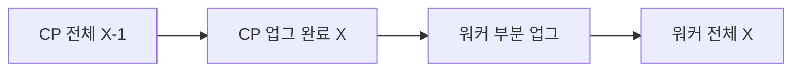

# Version Skew

**Version skew** 는 Kubernetes 컴포넌트 간에 **허용되는 마이너 버전
차이**를 규정한다. 이 규칙이 없으면 업그레이드가 **원자적 재기동**
(모든 컴포넌트를 동시에 교체) 이 되어 HA 자체가 불가능해진다.

skew 정책이 허용하는 핵심은 두 가지.

1. **롤링 업그레이드 중 과도기** — 한 노드씩 kubelet 을 올릴 때 CP와
   잠시 버전이 다른 상태를 허용.
2. **CP 먼저, 워커 나중** — 워커 kubelet 이 CP 보다 **오래된 상태**로
   최대 n-3 까지 운영 가능.

이 글은 **컴포넌트별 skew 매트릭스, 업그레이드 중 과도기, 인접 시스템
(etcd·CRI·CSI·CNI) skew, 관리형·벤더별 차이, Compatibility Version**
을 정리한다. 업그레이드 절차는
[클러스터 업그레이드](./cluster-upgrade.md) 참조.

> 관련: [클러스터 업그레이드](./cluster-upgrade.md)
> · [노드 유지보수](./node-maintenance.md)
> · [HA 클러스터 설계](../cluster-setup/ha-cluster-design.md)
> · [etcd](../architecture/etcd.md)

---

## 1. 기본 원칙

### 1.1 황금률

- **kube-apiserver 가 기준점** — 모든 컴포넌트는 apiserver 를 기준으로
  skew 를 계산한다.
- **어떤 컴포넌트도 apiserver 보다 신규 금지** — apiserver 와 같거나
  **더 오래됨**만 허용.
- **kubelet·kube-proxy 는 최대 n-3**(1.28+ 정책, 이전은 n-2).
- **HA 내 여러 apiserver 간 차이는 1 마이너 이내**.
- **kubectl·kubeadm 은 apiserver 기준 ±1 마이너** 허용.

### 1.2 왜 이런 형태인가

- **CP 먼저 업그레이드** — apiserver·controller-manager·scheduler 를
  먼저 올려 워커 노드의 긴 업그레이드 주기 중에도 안정 보장.
- **kubelet n-3** — 대규모 클러스터에서 워커 노드 업그레이드에 긴 시간
  이 걸리므로 여유 창이 필요.
- **apiserver HA 1 마이너** — 롤링 업그레이드 중 한 CP 가 새 버전,
  다른 CP가 구 버전인 상태를 허용.

---

## 2. 컴포넌트별 Skew 표

**기준점: kube-apiserver = X**

| 컴포넌트 | 허용 범위(apiserver X 기준) | apiserver 보다 신규? | 비고 |
|---------|---------------------------|:----:|------|
| HA apiserver 간 | 최신·최구 차이 ≤ 1 마이너 | — | 롤링 중 허용 |
| kube-controller-manager | X 또는 X-1 | **금지** | |
| kube-scheduler | X 또는 X-1 | **금지** | |
| cloud-controller-manager | X 또는 X-1 | **금지** | |
| kubelet | X, X-1, X-2, **X-3** | **금지** | 1.28+. 이전은 X-2까지 |
| kube-proxy | X, X-1, X-2, X-3 | **금지** | apiserver 상한이 항상 타이트 |
| kubectl | X-1, X, **X+1** | 허용(신규도 OK) | |
| kubeadm | X 또는 X+1 | 허용(업그레이드 시) | |

### 2.1 kube-proxy 의 복합 제약

kube-proxy 는 **두 개의 제약** 을 동시에 받는다.

1. **apiserver 기준**: 오래됨만 허용(n-3 까지, apiserver 보다 신규 금지).
2. **kubelet 과 ±3 마이너**.

1 이 2 보다 **항상 타이트**하다(apiserver 가 상한). 실무에서는
kube-proxy 와 kubelet 을 같은 노드에서 **같은 버전**으로 배포하는 게
관례. DaemonSet 태그를 kubelet 업그레이드와 함께 올린다.

### 2.2 CP 컴포넌트는 apiserver 보다 신규 금지

| 클러스터 상태 | CM/Scheduler/CCM | 허용? |
|--------------|------------------|:----:|
| apiserver=X | X 또는 X-1 | ✓ |
| apiserver=X-1(롤링 중 일부 CP) | X | ✗(신규) |
| apiserver=X-1 | X-1 | ✓ |

이 제약이 "CP 먼저"의 반대 방향을 막는다.

### 2.3 HA apiserver 1 마이너 이내 — 롤링 예

HA 3대 CP 를 X-1 → X 롤링 중 허용 상태.

| 시점 | CP1 | CP2 | CP3 | OK? |
|------|:---:|:---:|:---:|:---:|
| 시작 | X-1 | X-1 | X-1 | ✓ |
| 한 대 업그 후 | X | X-1 | X-1 | ✓ |
| 두 대 업그 후 | X | X | X-1 | ✓ |
| 완료 | X | X | X | ✓ |

**2 마이너 혼재 금지** — X-1 과 X+1 을 동시에 두는 것은 불가.

**혼재 기간 상한.** 정책상 제한은 없지만, 실무에서 **48~72시간 이내
수렴**을 원칙으로 한다. 장기 혼재는 문제 진단을 복잡하게 만든다.

---

## 3. 업그레이드 중 과도기 skew

### 3.1 전형적 시나리오



| 단계 | CP | kubelet | OK? |
|------|:--:|:-------:|:---:|
| 1 | X-1 | X-1 | ✓ |
| 2(CP 업그) | **X** | X-1 | ✓(n-1) |
| 3(워커 부분) | X | 일부 X, 일부 X-1 | ✓ |
| 4(완료) | X | X | ✓ |

### 3.2 금지 상태

| 금지 상태 | 이유 |
|---------|------|
| CP=X-1, kubelet=X | kubelet 이 apiserver 보다 신규 |
| HA CP: X-2 와 X 혼재 | apiserver 간 차이 2 마이너 |
| 워커 kubelet=X-4 | n-3 허용 한계 초과 |

---

## 4. 실전 시나리오

### 4.1 n-3 끝까지 버티기 → 업그레이드 데드락

**가정.** CP=1.35, 워커 kubelet=1.32(=n-3).

CP를 1.36 으로 올리려면 kubelet 1.32 와 skew 가 **n-4** 가 되어 불가.

**해결.** 워커를 1.33 이상으로 먼저 올리고 나서 CP 1.36. "허용 범위
= 영구 유지 범위 아님". 실무 권장은 **kubelet = CP 또는 n-1**.

### 4.2 HA 롤링 중단 후 장기 혼재

3 CP 중 1대만 1.36, 2대는 1.35 상태에서 창이 닫힌다. 정책상 1 마이너
차이라 OK. 하지만 48~72h 이내 수렴 원칙.

### 4.3 kubectl 구버전 — 새 기능 미지원

**상황.** kubectl=1.30, CP=1.36(skew 6).

정책은 ±1 이라 **지원 범위 밖**. 기본 명령은 작동할 수 있으나 버그
리포트 대상 아님. 실제로 막히는 기능 예.

- `kubectl debug` profile 신규(1.30+).
- `kubectl apply --prune` 신규 동작(1.27+).
- subresource 지원(1.27+).

**실무.** kubectl 은 항상 **최신 patch + CP 마이너 매칭**.

### 4.4 kubeadm 자체 skew

kubeadm 은 **apiserver 보다 1 마이너 위**까지 허용. 업그레이드 절차.

1. kubeadm 패키지를 1.36 으로 업그레이드.
2. `kubeadm upgrade apply v1.36.0` 실행.
3. 노드별 kubelet·kubectl 패키지 전환.

kubeadm 1.30+ 은 `upgrade plan` 에서 **skew 위반 선감지** 가 강화됐다.

---

## 5. 인접 시스템과의 Skew

### 5.1 etcd ↔ kube-apiserver

공식 version skew 매트릭스와는 별도의 호환 규칙이 있다.

| K8s | 권장 etcd |
|-----|-----------|
| 1.31 | etcd 3.5.x |
| 1.32 | etcd 3.5.x |
| 1.33 | etcd 3.5.x (3.6 지원 시작 일부) |
| 1.34 이후 | etcd 3.6 지원 |

**etcd 3.5 → 3.6 직접 업그레이드는 불가**. **3.5.26 이상을 경유**
해야 한다. kubeadm 은 `upgrade apply` 에서 **해당 K8s 버전에 맞는
권장 etcd 버전을 자동 선택** 한다.

external etcd 를 쓰는 경우 **K8s 업그레이드와 별도 창**으로 etcd 를
관리. `etcdctl version` 으로 주기 점검.

### 5.2 CRI (containerd·CRI-O)

| K8s | containerd 지원 | CRI-O 지원 |
|-----|---------------|-----------|
| 1.33 | 1.7, 2.0(지원 시작) | 1.33 |
| 1.34 | 1.7, 2.0 | 1.34 |
| 1.35 | 1.7(**마지막**), 2.0 | 1.35 |
| 1.36 | **2.0 이상 필수** | 1.36 |

containerd 와 CRI-O 는 Kubernetes 와 마이너 매칭이 아니라 **CRI 프로
토콜 버전** 으로 호환. 그러나 EOL·보안 패치 정책은 각 프로젝트
(containerd: 2개 마이너 지원, CRI-O: K8s 마이너 동기) 에 따른다.

### 5.3 CSI 사이드카 ↔ K8s

CSI 사이드카(external-provisioner·external-snapshotter·external-attacher
등)는 **자체 min/max K8s 버전** 을 선언. CSI 드라이버 벤더가 정의.

- 사이드카 업그레이드는 **K8s 업그레이드와 별도 창**.
- `VolumeSnapshot v1` API 는 external-snapshotter CRD·컨트롤러가 제공
  (in-tree 아님).
- K8s 업그레이드 시 **사이드카 min 버전 확인** 필수.

### 5.4 CNI 플러그인

CNI 는 **CNI spec 버전**(0.3·0.4·1.0 등) 과 **K8s 지원 매트릭스** 를
가진다. 주요 CNI.

| CNI | K8s 지원 창(통상) |
|-----|----------------|
| Cilium | 최신 3~4 마이너 |
| Calico | 최신 3~4 마이너 |
| Flannel | 최신 2~3 마이너 |
| Kube-OVN | 최신 2~3 마이너 |

CNI 업그레이드는 **K8s 와 분리된 주기**로 진행. K8s 업그레이드 전에
CNI 가 타깃 K8s 를 지원하는지 먼저 확인.

### 5.5 Cloud Controller Manager(CCM) ↔ CSI

1.31+ 에서 in-tree cloud provider 가 영구 제거됐다. CCM(예: AWS
cloud-provider-aws, vSphere CPI)은 **apiserver 스큐 규칙(X 또는 X-1)**
을 따르며, **CSI 드라이버와는 별도** 의 릴리즈 주기.

---

## 6. 도구·벤더별 Skew 차이

정책 자체는 업스트림 동일. 차이는 **허용되는 업그레이드 경로·주기·
연장 지원**.

| 도구/벤더 | 정책 | 특이사항 |
|----------|------|---------|
| kubeadm | 업스트림 | 마이너 skip 금지, upgrade plan 이 skew 선감지(1.30+) |
| Kubespray | 업스트림 | 플레이북 재실행 |
| RKE2 | 업스트림 | 업스트림 대비 수 주 지연 가능, SUSE 상용 지원 |
| k3s | 업스트림 | 릴리즈 태그 `+k3sN`, 3개 마이너 지원 |
| Talos | 업스트림 | `talosctl upgrade-k8s` 가 skew-aware |
| OpenShift(OCP) | 독자 EUS | CVO 기반 자동, 일부 마이너는 **EUS**(18개월 장기) |
| EKS | 업스트림 + Extended Support | managed node group **n-3 정책**(1.28+), Extended Support **유료 14개월 추가** |
| GKE | 업스트림 + 채널 | Rapid·Regular·Stable, **Extended version**(24개월) 옵션 |
| AKS | 업스트림 + LTS | 특정 마이너만 **AKS LTS**(2년 지원) |
| Cluster API | `KubeadmControlPlane` | v1.12+ ChainedUpgrade, MaxSurge·MHC 상호작용 |

### 6.1 관리형 Extended Support 의 의미

연장 지원은 **EOL 이후 유료 연장**. 하지만 **skew 정책은 여전히 적용**
된다. 연장 지원은 "업그레이드 압박을 늦추는 것"이지 "skew 를 늘리는
것"이 아니다.

예: EKS 1.28 Extended Support 에서도 워커 kubelet 은 1.25·1.26·1.27·
1.28 만 허용(n-3).

### 6.2 Cluster API — Provider 차원의 skew

CAPI 는 **코어·부트스트랩·컨트롤플레인·인프라** 프로바이더가 각각
독립 릴리즈.

| 레이어 | 예 | 자체 skew 정책 |
|-------|-----|-------------|
| Core CAPI | `cluster-api` | minor skew 정책 명시 |
| Bootstrap | KubeadmBootstrap, RKE2Bootstrap | 코어와 match |
| ControlPlane | KubeadmControlPlane, TalosControlPlane | 코어와 match |
| Infrastructure | CAPA·CAPZ·CAPG·CAPM3·Metal3 | 프로바이더별 K8s 지원 창 |

`KubeadmControlPlane.spec.version` 변경 시 CAPI 컨트롤러가 `MaxSurge`·
`MaxUnavailable`·MHC 를 고려하며 롤링. **ChainedUpgrade**(v1.12+)는
여러 마이너를 순차 자동. 각 단계는 여전히 업스트림 skew 정책을 준수.

---

## 7. Compatibility Version — skew 의 새 차원

KEP-4330(Compatibility Versions) 은 **skew 에 새 축** 을 도입했다.

| 플래그 | 의미 |
|-------|------|
| binary version | 바이너리 실제 버전 |
| `--emulated-version` | 동작을 emulate 할 이전 마이너 |
| `--min-compatibility-version` | 제거하지 말아야 할 기능의 최소 버전 |

### 7.1 2026-04 기준 지원 범위

- **1.31 Alpha** — kube-apiserver 시험적 도입.
- **1.32** — kube-apiserver 일반화(Beta).
- **1.33·1.34 이후** — 다른 CP 컴포넌트(scheduler·controller-manager)
  로 확장 진행 중.
- **kubelet** 은 `--emulated-version` 을 **일반적으로 노출하지 않는다**
  (2026-04 시점). 확장은 로드맵 단계.

**적용 대상은 Beta·GA 기능만**. Alpha 는 emulate 불가.

### 7.2 2상 업그레이드 시 skew 해석

바이너리 = 1.36, emulated = 1.35 인 kube-apiserver 는 **API·feature
동작이 1.35**. 다른 컴포넌트의 skew 는 **emulated version 기준**으로
판정된다.

**실용적 의미.** 1.36 바이너리 + emulated 1.35 apiserver 는 기존
1.35 kubelet·CM·scheduler 와 **완전 호환**. 바이너리만 롤백하는 **롤백
창** 을 확보.

**주의.** emulated 미지원 컴포넌트(kubelet 등)는 기존 skew 규칙 적용.
상세는 [클러스터 업그레이드](./cluster-upgrade.md) §2.

---

## 8. Bootstrap Token·kubelet 인증서 skew

skew 는 바이너리뿐 아니라 **인증 체계에도 걸린다**.

### 8.1 Bootstrap Token

- `kubeadm token create` 로 발급, **기본 TTL 24시간** (`--ttl 0` 무기한).
- 마이너 업그레이드 후 기존 토큰은 여전히 유효하되, **토큰의 RBAC
  그룹(`system:bootstrappers:kubeadm:default-node-token`)** 이 타깃
  버전에서 변경되지 않았는지 확인.
- 조인 경로가 막히면 `kubectl get csr` 에서 Pending CSR 로 증상.

### 8.2 kubelet client 인증서 rotation

- `--rotate-certificates=true`(1.19+ 기본) 로 자동 갱신.
- CA 서명 수명(`cluster-signing-duration`, 기본 1년) 과 apiserver
  서명 검증 로직은 마이너 업그레이드에 큰 영향 없음.
- 단, **kubelet serving 인증서** 는 별도. `serverTLSBootstrap: true`
  + CSR 승인기(cert-manager·approver-policy) 필요.

### 8.3 `kubeadm certs renew` 와 마이너 교차

- `kubeadm certs renew all` 은 **업그레이드와 무관**하게 인증서만
  갱신.
- 업그레이드(`kubeadm upgrade apply`) 시 인증서가 자동 갱신됨
  (`--certificate-renewal=false` 로 끌 수 있음).
- 마이너 교차 업그레이드(예: 1.35 → 1.36) 중 인증서 체인 호환은
  보장. 다만 **수년 전 발급된 CA** 의 경우 signing algorithm deprec
  ation 점검.

---

## 9. Skew 위반의 증상·진단

### 9.1 위반 시 증상

| 위반 | 전형적 증상 |
|------|----------|
| kubelet 이 apiserver 보다 신규 | Pod 생성·업데이트 실패, webhook mismatch |
| controller-manager 가 apiserver 보다 신규 | 컨트롤러 리컨실 실패 |
| HA apiserver 2 마이너 차이 | 요청마다 응답 불일치 |
| removed API 호출 | 404, deployment 실패 |
| kubectl 구버전 | "unknown resource", 신규 필드 인식 실패 |
| TLS 서명 알고리즘 불일치 | webhook 접속 실패 |
| etcd 3.5 → 3.6 직접 시도 | apiserver 기동 불가 |

### 9.2 진단 명령

```bash
# 전체 버전
kubectl version --output=yaml

# 노드 kubelet·kube-proxy
kubectl get nodes -o wide -o=custom-columns='NAME:.metadata.name,KUBELET:.status.nodeInfo.kubeletVersion,KUBEPROXY:.status.nodeInfo.kubeProxyVersion'

# CP 컴포넌트 이미지
kubectl -n kube-system get pods -o jsonpath='{.items[*].spec.containers[*].image}' | tr ' ' '\n' | sort -u

# etcd
etcdctl version
etcdctl endpoint status --cluster

# deprecated API 감시
kubectl get --raw /metrics | grep apiserver_requested_deprecated_apis

# kubeadm plan 선감지(1.30+)
kubeadm upgrade plan
```

### 9.3 HA apiserver 버전 추적

Prometheus `kube_apiserver_version`·`kubernetes_build_info` 지표, 또는
LB 뒤 각 apiserver 노드에 TLS SNI 로 직접 접속해 버전 확인.

---

## 10. 안티패턴

| 안티패턴 | 문제 | 대안 |
|---------|------|------|
| kubelet n-3 장기 방치 | 업그레이드 데드락 | kubelet=CP 또는 n-1 유지 |
| 워커 먼저 업그레이드 | 스큐 역전 | CP 먼저 |
| 마이너 skip | kubeadm 비지원 | 한 단계씩 |
| HA CP 한 번에 모두 재시작 | 쿼럼 손실·skew 혼란 | 한 대씩 |
| kubectl 로컬 고정 | 신규 기능 미지원 | 최신 patch 유지 |
| Extended Support 로 장기 연장 | 비용·skew 체감 상실 | 주기적 업그레이드 |
| Compatibility Version 없이 복잡 마이그 | 롤백 창 없음 | 2상 업그레이드 |
| etcd 3.5 → 3.6 직접 | 기동 실패 | 3.5.26 경유 |
| containerd 1.x 유지한 채 1.36 | CRI 깨짐 | 사전 2.0 마이그 |
| CNI·CSI·K8s 동시 메이저 업 | 호환 이슈 중첩 | 분리 창 |
| HA 혼재 상태 장기 방치 | 운영 복잡 | 48~72h 내 수렴 |

---

## 11. 체크리스트

**업그레이드 전.**

- [ ] 현재 skew 전수 조사(CP·kubelet·kube-proxy·kubectl·kubeadm·etcd)
- [ ] 가장 구버전 컴포넌트 식별
- [ ] 목표 버전이 가장 구버전과 skew 허용 범위 안인지
- [ ] kubelet 이 n-2 이상이면 먼저 정렬
- [ ] etcd 호환(3.5 → 3.6 경로)
- [ ] containerd·CRI-O 지원 버전
- [ ] CNI·CSI 사이드카 min 버전
- [ ] 관리형 연장 지원·채널 정책
- [ ] Compatibility Version 활용 여부

**업그레이드 중.**

- [ ] CP 먼저, 워커 나중
- [ ] HA CP 한 대씩
- [ ] 각 단계에서 `kubectl version`·이미지·etcd 확인
- [ ] 48~72h 내 혼재 상태 수렴
- [ ] skew 위반 증상·지표 모니터링

**업그레이드 후.**

- [ ] 모든 컴포넌트 동일 마이너 수렴
- [ ] `apiserver_requested_deprecated_apis` = 0
- [ ] kubectl 포함 버전 정렬
- [ ] etcd 버전 스큐 없음

---

## 12. 빠른 참조 — "CP = X 일 때"

`X` 를 현재 CP 마이너로 치환해서 읽는다. 예: X=1.36.

| 컴포넌트 | 허용 버전 |
|---------|---------|
| 다른 HA CP | X-1·X |
| CM·scheduler·CCM | X-1·X |
| kubelet·kube-proxy | X-3·X-2·X-1·X |
| kubectl | X-1·X·X+1 |
| kubeadm | X·X+1(업그레이드 시) |
| etcd | K8s 권장 맵 기준 |

**X = 1.36 예시.**

| 컴포넌트 | 허용 버전 |
|---------|---------|
| HA CP | 1.35, 1.36 |
| CM·scheduler·CCM | 1.35, 1.36 |
| kubelet·kube-proxy | 1.33, 1.34, 1.35, 1.36 |
| kubectl | 1.35, 1.36, 1.37(미래 릴리즈) |
| kubeadm | 1.36, 1.37 |
| etcd | 권장 3.6(또는 3.5.x) |

---

## 참고 자료

- [Version Skew Policy — kubernetes.io](https://kubernetes.io/releases/version-skew-policy/) — 2026-04-24
- [Upgrading kubeadm clusters](https://kubernetes.io/docs/tasks/administer-cluster/kubeadm/kubeadm-upgrade/) — 2026-04-24
- [KEP-4330 Compatibility Versions](https://github.com/kubernetes/enhancements/blob/master/keps/sig-architecture/4330-compatibility-versions/README.md) — 2026-04-24
- [Compatibility Version For Control Plane Components](https://kubernetes.io/docs/concepts/cluster-administration/compatibility-version/) — 2026-04-24
- [TLS bootstrapping](https://kubernetes.io/docs/reference/access-authn-authz/kubelet-tls-bootstrapping/) — 2026-04-24
- [Kubernetes Release Cycle](https://kubernetes.io/releases/release/) — 2026-04-24
- [CSI project policies](https://kubernetes-csi.github.io/docs/project-policies.html) — 2026-04-24
- [etcd upgrade notes](https://etcd.io/docs/v3.6/upgrades/upgrade_3_3/) — 2026-04-24
- [Cluster API Version Support](https://cluster-api.sigs.k8s.io/reference/versions) — 2026-04-24
- [EKS Kubernetes Version Lifecycle & Extended Support](https://docs.aws.amazon.com/eks/latest/userguide/kubernetes-versions.html) — 2026-04-24
- [GKE Release Channels & Extended Versions](https://cloud.google.com/kubernetes-engine/docs/release-notes) — 2026-04-24
- [AKS LTS](https://learn.microsoft.com/azure/aks/long-term-support) — 2026-04-24
