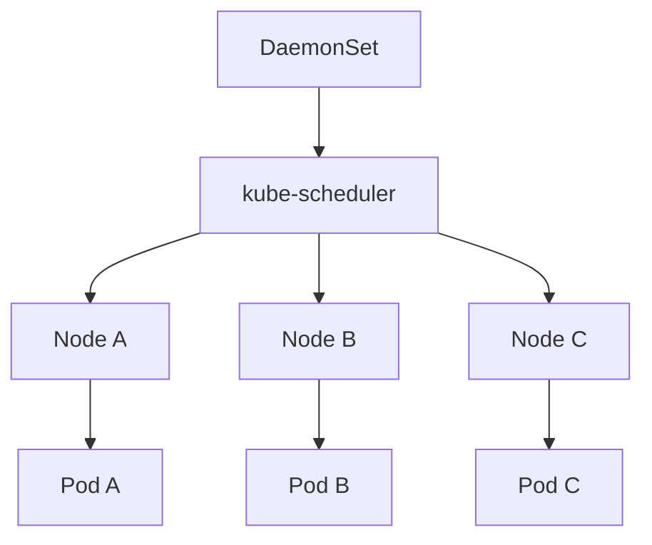

# DaemonSet

DaemonSet은 **"모든(또는 일부) 노드에 정확히 한 개의 Pod"**을 보장하는
컨트롤러다. CNI·CSI node 플러그인, kube-proxy, 로그 shipper, node-exporter,
GPU device plugin 같은 **노드 에이전트**가 이 리소스로 돌아간다. 노드가
추가되면 자동 배치, 제거되면 함께 수거된다.

프로덕션 장애의 상당수가 DaemonSet에서 비롯된다. CNI 롤아웃 순서 실수로
네트워크가 단절되거나, taint toleration 누락으로 control plane에 kube-proxy가
안 뜨거나, 대규모 클러스터에서 `maxUnavailable=1` 순차 교체에 수십 분 공백이
쌓이는 식이다.

이 글은 DaemonSet의 스케줄링 메커니즘, 자동 tolerations, RollingUpdate와
`maxSurge`/`maxUnavailable`의 실제 의미, PDB·Cluster Autoscaler 상호작용,
1.33~1.35 관련 변경, 노드 에이전트 운영 체크리스트를 다룬다.

> Pod 자체의 라이프사이클: [Pod 라이프사이클](./pod-lifecycle.md)
> Deployment와의 차이: [Deployment](./deployment.md)
> 컨트롤러 일반 원리: [Reconciliation Loop](../architecture/reconciliation-loop.md)
> CNI·CSI 구현 자체: `network/` · `storage/` 섹션

---

## 1. DaemonSet의 위치



| 항목 | Deployment | StatefulSet | DaemonSet |
|---|---|---|---|
| 배치 단위 | cluster wide | cluster wide | **node 당 1개** |
| replicas 필드 | 있음 | 있음 | **없음** (노드 수 = 사실상 replicas) |
| Pod 이름 | 랜덤 hash | ordinal | 랜덤 hash |
| 신규 노드 | 영향 없음 | 영향 없음 | **자동 생성** |
| 업데이트 | RS 교체 | 역순 | 노드별 순차 |
| 대표 용도 | stateless app | DB·분산 시스템 | **node agent**·CNI·CSI·log·metric |

**핵심**: Deployment가 "요청한 개수만큼"이라면, DaemonSet은 "**자격을 갖춘
모든 노드에 1개씩**"이다. "자격"은 nodeSelector·nodeAffinity·taint 조합으로
결정한다(§3).

---

## 2. 스케줄링 주체 — 컨트롤러가 아닌 kube-scheduler

과거 DaemonSet 컨트롤러는 `.spec.nodeName`을 **직접 써넣는** 방식으로 Pod을
특정 노드에 묶었다. 스케줄러를 우회한 탓에 우선순위·선점·affinity가 제대로
반영되지 않았다.

`ScheduleDaemonSetPods`는 **1.11 Alpha → 1.12 Beta(기본 활성) → 1.17 GA** 로
승격됐다(feature gate는 1.18에서 제거). 현재는 DaemonSet 컨트롤러가 Pod을
만들 때 `nodeAffinity`로 대상 호스트를 지정하고, 실제 바인딩은
**kube-scheduler**가 수행한다.

| 동작 | 담당 |
|---|---|
| 대상 노드 선정 (selector·affinity 해석) | DaemonSet 컨트롤러 |
| `spec.affinity.nodeAffinity` 주입 | DaemonSet 컨트롤러 |
| 노드 바인딩(`.spec.nodeName`) | **kube-scheduler** |
| 우선순위·선점 처리 | kube-scheduler |
| 업데이트 전략 집행 | DaemonSet 컨트롤러 |

덕분에 `priorityClassName`·`schedulerName`·선점·topologySpread가 모두 표준
스케줄러 문법으로 작동하고 커스텀 스케줄러로 교체도 가능하다.

---

## 3. 노드 선택 — selector·affinity·tolerations

```yaml
spec:
  template:
    spec:
      nodeSelector:                   # 단순 필터
        node-role.kubernetes.io/worker: ""
      affinity:                       # 복합 조건(부등호·OR)
        nodeAffinity:
          requiredDuringSchedulingIgnoredDuringExecution:
            nodeSelectorTerms:
            - matchExpressions:
              - { key: nvidia.com/gpu, operator: Exists }
```

- `nodeSelector`: 단순 필터
- `nodeAffinity`: 부등호·OR 필요 시. GPU 노드 전용 device plugin이 대표 예
- 둘 다 없으면 **모든 노드**에 배치

### tolerations — DaemonSet 자동 주입 목록이 특별하다

DaemonSet 컨트롤러는 아래 toleration을 **자동으로 주입**한다. 노드가
NotReady·Unreachable·자원 압박이어도 노드 에이전트는 살아 있어야 하기
때문이다.

| Key | Effect | 목적 |
|---|---|---|
| `node.kubernetes.io/not-ready` | `NoExecute` | Ready 아니어도 유지 |
| `node.kubernetes.io/unreachable` | `NoExecute` | 통신 끊긴 노드에서도 유지 |
| `node.kubernetes.io/disk-pressure` | `NoSchedule` | 디스크 압박 배치 허용 |
| `node.kubernetes.io/memory-pressure` | `NoSchedule` | 메모리 압박 배치 허용 |
| `node.kubernetes.io/pid-pressure` | `NoSchedule` | PID 압박 배치 허용 |
| `node.kubernetes.io/unschedulable` | `NoSchedule` | unschedulable 배치 허용 |
| `node.kubernetes.io/network-unavailable` | `NoSchedule` | hostNetwork=true만 |

**주의**: control plane(`node-role.kubernetes.io/control-plane:NoSchedule`)
taint는 **자동 주입되지 않는다**. kube-proxy·CNI처럼 control plane에도
떠야 하는 에이전트는 toleration을 **직접 선언**해야 한다.

```yaml
tolerations:
- { key: node-role.kubernetes.io/control-plane, operator: Exists, effect: NoSchedule }
- { key: node-role.kubernetes.io/master,        operator: Exists, effect: NoSchedule } # legacy
```

### priorityClassName — 노드 에이전트는 critical이어야 한다

```yaml
spec:
  template:
    spec:
      priorityClassName: system-node-critical
```

| PriorityClass | 값 | 용도 |
|---|---|---|
| `system-node-critical` | 2000001000 | 노드 가용성을 좌우 (CNI·CSI·kube-proxy) |
| `system-cluster-critical` | 2000000000 | 클러스터 서비스이나 노드 로컬 아님 (CoreDNS 등) |

kubelet의 node pressure eviction·자원 부족 선점에서 우선순위 높은 Pod이
마지막까지 살아남는다. CNI DaemonSet이 OOMKilled로 죽으면 노드 전체 네트워크
단절이므로 `system-node-critical`은 사실상 필수.

---

## 4. volume·hostPath·hostNetwork 패턴

DaemonSet은 "노드 자체에 붙는 에이전트"라 일반 워크로드에서 꺼리는 기능을
**적극 활용**한다.

| 기능 | 대표 용례 | 주의 |
|---|---|---|
| `hostPath` | `/var/log`, containerd 소켓 | PSA `restricted` 위배 |
| `hostNetwork: true` | kube-proxy, CNI, node-exporter | Service 우회, 포트 충돌 |
| `hostPID: true` | 프로세스 메트릭 수집 | 네임스페이스 격리 해제 |
| privileged | CNI iptables·BPF, CSI mount | 최소 권한 위반 |

운영 원칙:

- **PSA 네임스페이스 분리** — DaemonSet 전용(`kube-system` 등)만 `privileged`,
  일반 워크로드는 `restricted`
- **최소 capability** — `privileged: true` 대신 `capabilities.add:
  [NET_ADMIN]` 식으로 좁힌다
- `hostNetwork: true`이면 `network-unavailable` toleration이 자동 주입되어
  네트워크 미가용 노드에서도 에이전트가 기동한다

---

## 5. updateStrategy — RollingUpdate vs OnDelete

```yaml
spec:
  updateStrategy:
    type: RollingUpdate
    rollingUpdate:
      maxUnavailable: 1        # 기본 1
      maxSurge: 0              # 기본 0, KEP-1591로 1.25 GA
  minReadySeconds: 30
  revisionHistoryLimit: 10
```

| 필드 | 기본 | 의미 |
|---|---|---|
| `type` | `RollingUpdate` | `OnDelete`는 **수동 삭제 시에만** 재생성 |
| `maxUnavailable` | `1` | 동시 unavailable 허용 수 (또는 %) |
| `maxSurge` | `0` | 한 노드에 **임시로 old+new 동시** 존재 허용 |
| `minReadySeconds` | `0` | Ready 후 available 판정까지 대기 |
| `revisionHistoryLimit` | `10` | 보존할 ControllerRevision 수 |

### maxSurge — KEP-1591 (1.21 Alpha · 1.22 Beta · **1.25 GA**)

노드마다 Pod이 1개라는 특성상 `maxUnavailable>0`은 곧 **노드 관측·기능 공백**
을 의미한다. `maxSurge`는 이 공백을 없애기 위해 한 노드에서 잠깐 두 Pod을
동시에 띄우고, new Pod이 Ready가 되면 old를 종료한다.

| 조합 | 의미 |
|---|---|
| `maxUnavailable: 1`, `maxSurge: 0` (기본) | 노드 1대씩 공백을 두고 교체 |
| `maxUnavailable: 0`, `maxSurge: 1` | 노드 1대씩 **무공백 교체** |
| `maxUnavailable: 10%`, `maxSurge: 0` | 대규모 클러스터의 속도 우선 |

제약:
- `maxUnavailable`과 `maxSurge`를 **동시에 0 지정 불가** — 진행 정지
- `hostPort`·`hostNetwork` **단일 점유 포트**는 surge 불가 (포트 충돌).
  이 경우 `maxUnavailable`만 조정

### OnDelete

template을 바꿔도 컨트롤러가 Pod을 **삭제하지 않는다**. 운영자가
`kubectl delete pod`·drain으로 제거해야 새 template으로 재생성. CSI·CNI
드라이버처럼 **노드 단위 카나리 검증**을 사람이 직접 보면서 진행해야 할 때
사용한다.

### minReadySeconds

Ready 진입 후 지정 초만큼 안정 상태면 available로 집계. `rollout status`의
진행률 기준. CNI처럼 초기화가 긴 에이전트는 15~30초 권장.

### revisionHistoryLimit와 rollback

DaemonSet은 ReplicaSet이 아니라 **`ControllerRevision`** 리소스로 revision을
기록한다(StatefulSet과 공유하는 메커니즘). 각 Pod에는
`controller-revision-hash` 라벨이 붙어 어떤 revision 소속인지 식별된다.

```bash
kubectl rollout history ds/cni
kubectl rollout undo    ds/cni --to-revision=3
kubectl get controllerrevisions -l name=cni
```

> 과거에는 `pod-template-generation` 라벨로 revision을 추적했으나 **obsolete**
> 상태이며 현재는 `controller-revision-hash`가 표준. 파이프라인·
> 대시보드에서 구 라벨을 참조하면 작동하지 않을 수 있다.

---

## 6. 자주 쓰는 예제 — node-exporter

```yaml
apiVersion: apps/v1
kind: DaemonSet
metadata:
  name: node-exporter
  namespace: monitoring
spec:
  selector:
    matchLabels:
      app: node-exporter
  updateStrategy:
    type: RollingUpdate
    rollingUpdate:
      maxUnavailable: 10%
      maxSurge: 0                    # hostPort 9100 단일 점유
  minReadySeconds: 15
  revisionHistoryLimit: 5
  template:
    metadata:
      labels: { app: node-exporter }
    spec:
      priorityClassName: system-node-critical
      hostNetwork: true
      hostPID: true
      tolerations:
      - operator: Exists             # 모든 taint 수용
      containers:
      - name: node-exporter
        image: quay.io/prometheus/node-exporter:v1.9.1
        ports:
        - { containerPort: 9100, hostPort: 9100, name: metrics }
        resources:
          requests: { cpu: 50m,  memory: 64Mi }
          limits:   { cpu: 200m, memory: 180Mi }
        securityContext:
          readOnlyRootFilesystem: true
          capabilities: { drop: ["ALL"] }
```

**주목 포인트**:

- `tolerations: operator: Exists` — 노드 에이전트의 전형(모든 taint 수용)
- `maxSurge: 0` — `hostPort` 충돌로 surge 불가
- `maxUnavailable: 10%` — 500 노드에서 50대씩 병렬 롤아웃
- `system-node-critical` — OOM·선점 최후 생존
- 최소 권한 — `privileged` 없이 capability 전량 drop

---

## 7. 상태 컬럼·conditions 해석

| 컬럼 | `.status` 필드 | 의미 |
|---|---|---|
| `DESIRED` | `desiredNumberScheduled` | selector·affinity 충족 노드 수 |
| `CURRENT` | `currentNumberScheduled` | 실제 존재하는 Pod 수(Pending 포함) |
| `READY` | `numberReady` | Ready condition=True Pod 수 |
| `UP-TO-DATE` | `updatedNumberScheduled` | 현재 template hash 일치 Pod 수 |
| `AVAILABLE` | `numberAvailable` | Ready 상태로 `minReadySeconds` 경과 |

진행 중 해석:

- `UP-TO-DATE < DESIRED` → 롤아웃 진행 중 혹은 stuck
- `READY < CURRENT` → Pod은 떴지만 probe 실패
- `CURRENT < DESIRED` → 일부 노드에 배치 실패(taint·자원·affinity)
- `AVAILABLE < READY` → `minReadySeconds` 대기

`kubectl rollout status ds/<name>`은 `updatedNumberScheduled ==
desiredNumberScheduled` 그리고 `numberAvailable == desiredNumberScheduled`를
본다. CI/CD 게이트는 이 명령의 exit code로 rollout 완료를 판정한다.

`.status.numberMisscheduled > 0`은 **selector 변경 후 이탈 노드에 잔존**한
Pod 수. 다음 sync loop에서 자동 정리된다. `observedGeneration ==
metadata.generation` 조건이 "컨트롤러가 현재 spec을 봤다"는 유일한 증거
(파이프라인 정확성의 기준).

---

## 8. 최신 변경 (1.33~1.35)

| 변경 | KEP | 버전 | DaemonSet 관점 영향 |
|---|---|---|---|
| Native Sidecar | KEP-753 | **1.33 GA** | log shipper·proxy의 시작·종료 순서 보장 |
| DRA kubelet seamless upgrade | KEP-4381 계열 | **1.33** | DRA 드라이버 DaemonSet 롤링 시 ResourceSlice 유지 |
| Pod-level Resources | KEP-2837 | **1.34 Beta** | DaemonSet + 사이드카 리소스 예산 단순화 |
| Per-container Restart Policy | KEP-5307 | 1.34 Alpha · **1.35 Beta** | 컨테이너 단위 재시작 제어 |
| In-place Pod Resize | KEP-1287 | 1.33 Beta · **1.35 GA** | DaemonSet Pod 재생성 없이 resize |
| Pod Certificates | KEP-4317 | 1.34 Alpha · **1.35 Beta** | 노드 에이전트의 mTLS ID |

> **DaemonSet 리소스 자체에 1.33~1.35 전용 신규 필드는 없다**. 모두 Pod
> 차원 변경이지만 DaemonSet 운영에 직결된다.

**Native Sidecar의 DaemonSet 의미**: log-shipper·proxy를 `initContainers[]`
+ `restartPolicy: Always`로 선언하면 앱보다 먼저 startup probe 통과 후 앱
시작, 종료 시 앱이 먼저 끝난 뒤 sidecar drain. 기존 `containers[]` 사이드카
방식의 **초기 로그 유실·drain 미완 문제**가 해결된다.

**In-place Resize의 실전 의미**: CNI·CSI는 노드 밀도에 따라 메모리 튜닝이
잦다. 1.35 GA 기준 Linux + Guaranteed QoS 제약 하에 **Pod 재생성 없이 cgroup
조정** 가능. 단 DaemonSet `spec.template` patch는 여전히 rollout을 유발하므로
`resize` 서브리소스로 Pod별 직접 patch가 현실적이다. 상세 제약은
[Pod 라이프사이클](./pod-lifecycle.md).

**Pod Certificates (1.35 Beta)**: `projected.podCertificate`로 kubelet이
Pod 단위 단기 인증서를 주입. 노드 에이전트의 mTLS 통신에 정적 Secret 대신
SPIFFE 기반 워크로드 ID 사용. `PodCertificateRequest` feature gate 필요.

---

## 9. PDB·Cluster Autoscaler·drain

### `kubectl drain`과 DaemonSet

```bash
kubectl drain node-1 --ignore-daemonsets --delete-emptydir-data
```

`--ignore-daemonsets`는 drain의 사실상 필수 옵션이다. DaemonSet Pod은 drain
평가만 건너뛰고 살아 있다가, 노드 제거·재부팅 시점에 함께 종료된다.

### PDB와 DaemonSet — 제한적 효용

PDB(`policy/v1`, 1.21 GA)는 DaemonSet에 **selector로 지정할 수 있으나**
실효성은 제한적이다.

| 상황 | PDB 동작 |
|---|---|
| `kubectl drain --ignore-daemonsets` | **평가 자체를 우회** — 무의미 |
| Eviction API로 DaemonSet Pod eviction | PDB 평가됨 |
| 노드 장애·kubelet 재기동 | involuntary → PDB 무관 |

전체 rollout 속도 제어는 PDB가 아니라
`updateStrategy.rollingUpdate.maxUnavailable`로 하는 것이 맞다.

### Cluster Autoscaler

| CA 플래그 | 기본값 | 효과 |
|---|:-:|---|
| `--ignore-daemonsets-utilization` | false | DaemonSet Pod을 utilization 계산에서 제외 |
| `--daemonset-eviction-for-empty-nodes` | true | empty 노드의 DS Pod도 evict |
| `--daemonset-eviction-for-occupied-nodes` | true | 일반 scale-down 시 DS Pod evict |

Pod별 오버라이드: `cluster-autoscaler.kubernetes.io/enable-ds-eviction:
"false"` 어노테이션.

**운영 원칙**: Cilium·Datadog 등 request가 큰 DaemonSet이 있다면
`--ignore-daemonsets-utilization=true`가 사실상 필수. 설정 없으면 scale-down이
원천 봉쇄되어 비용·자원 낭비가 누적된다.

---

## 10. 프로덕션 체크리스트

- [ ] `updateStrategy` 선택 — 일반 `RollingUpdate`, CSI·CNI 검증형 `OnDelete`
- [ ] `maxUnavailable` — 소규모 `1`, 대규모 `10%` 내외
- [ ] `maxSurge` — `hostPort`·단일 점유 없으면 `1`/`10%`로 **무공백**
- [ ] `minReadySeconds` ≥ 15~30 — 초기화 긴 에이전트
- [ ] `priorityClassName: system-node-critical` — CNI·CSI·kube-proxy
- [ ] control plane 배치 필요 시 **control-plane taint toleration 수동 추가**
- [ ] 최소 권한 — `privileged` 대신 필요한 `capabilities`만
- [ ] PSA 네임스페이스 분리 — DaemonSet 전용 ns만 `privileged` 허용
- [ ] Guaranteed QoS — eviction 최후 보장
- [ ] Native Sidecar 전환 — log·proxy 사이드카 종료 순서 보장
- [ ] CA 플래그 — `--ignore-daemonsets-utilization=true`
- [ ] `hostNetwork` 사용 시 **포트 충돌 리스트** 문서화
- [ ] `kubectl rollout status ds/<name> --timeout` 게이팅
- [ ] CNI 업그레이드 순서 문서화 — control plane 먼저 or 마지막 중 명시

---

## 11. 트러블슈팅

| 증상 | 근본 원인 | 진단·조치 |
|---|---|---|
| `DESIRED` 0 | selector·affinity 불일치, 노드 라벨 없음 | `kubectl get nodes --show-labels` |
| `CURRENT < DESIRED` | taint 미수용, 자원 부족, `hostPort` 충돌 | pending Pod events, toleration 추가 |
| control plane 노드 누락 | control-plane taint toleration 미선언 | toleration 수동 추가 |
| 롤아웃 stuck | probe 실패, image pull, PSA 거부 | `rollout status` → `describe ds/pod` |
| `numberMisscheduled > 0` | selector 변경 후 이탈 노드 잔존 | 다음 sync에서 자동 정리 |
| CNI 업그레이드 후 네트워크 단절 | 동시 롤아웃 순서 꼬임 | `maxUnavailable: 1` + `OnDelete`로 1대씩 검증 |
| OOMKilled 반복 | memory limit 부족 | limit 상향 또는 In-place Resize |
| drain 거부 | `--ignore-daemonsets` 누락 | 플래그 추가 |
| CA scale-down 안 됨 | DS request가 utilization 초과 | `--ignore-daemonsets-utilization=true` |
| `hostPort` 충돌로 Pending | 포트 중복 점유 | `maxSurge: 0` 강제 |
| rollout 성공인데 old 남음 | `OnDelete` + 수동 삭제 누락 | Pod 수동 삭제 |

### 자주 쓰는 명령

```bash
kubectl rollout status  ds/<name> -n <ns> --timeout=15m
kubectl rollout history ds/<name> -n <ns>
kubectl rollout undo    ds/<name> -n <ns> --to-revision=N
kubectl rollout restart ds/<name> -n <ns>
kubectl get ds <name> -o jsonpath='{.status}' | jq
kubectl get pod -l name=<name> -o wide
kubectl get controllerrevisions -l name=<name>
```

`rollout restart`는 `kubectl.kubernetes.io/restartedAt` 어노테이션을 주입해
template hash를 바꾸고 노드별 교체를 유도한다. ConfigMap/Secret 변경 후
에이전트 재기동 시 표준 패턴. GitOps라면 **체크섬 annotation**으로 drift
없이 동일 효과.

---

## 12. DaemonSet이 다루지 않는 것

| 필요 기능 | 제공? | 대안 |
|---|:-:|---|
| 노드 중 일부만 선택 | ❌ | nodeSelector·nodeAffinity |
| 노드당 여러 인스턴스 | ❌ | Deployment + 포트 분리 |
| 카나리 노드 점진 검증 | 제한 | `OnDelete` + 수동, 또는 Argo Rollouts 확장 |
| 순서 보장 시작·종료 | ❌ | StatefulSet |
| 배치·one-shot | ❌ | Job·CronJob |

---

## 13. 이 카테고리의 경계

- **DaemonSet 리소스 자체** → 이 글
- **CNI·CSI 구현·비교** → `network/` · `storage/`
- **Pod probe·graceful·resize 전반** → [Pod 라이프사이클](./pod-lifecycle.md)
- **스케줄러 내부 동작·affinity 심화** → `kubernetes/scheduling/`
- **PodSecurityAdmission·공급망** → `security/`
- **메트릭·로그 파이프라인** → `observability/`
- **클러스터 업그레이드·노드 자동화** → `iac/` · `sre/`

---

## 참고 자료

- [Kubernetes — DaemonSet](https://kubernetes.io/docs/concepts/workloads/controllers/daemonset/)
- [Kubernetes — Perform a Rolling Update on a DaemonSet](https://kubernetes.io/docs/tasks/manage-daemon/update-daemon-set/)
- [Kubernetes — Pod Priority and Preemption](https://kubernetes.io/docs/concepts/scheduling-eviction/pod-priority-preemption/)
- [Kubernetes — Guaranteed Scheduling For Critical Add-On Pods](https://kubernetes.io/docs/tasks/administer-cluster/guaranteed-scheduling-critical-addon-pods/)
- [Kubernetes — Disruptions](https://kubernetes.io/docs/concepts/workloads/pods/disruptions/)
- [KEP-548 — Schedule DaemonSet Pods by kube-scheduler](https://github.com/kubernetes/enhancements/issues/548)
- [KEP-1591 — DaemonSet MaxSurge](https://github.com/kubernetes/enhancements/issues/1591)
- [KEP-753 — Sidecar Containers](https://github.com/kubernetes/enhancements/tree/master/keps/sig-node/753-sidecar-containers)
- [KEP-1287 — In-place Pod Resize](https://github.com/kubernetes/enhancements/tree/master/keps/sig-node/1287-in-place-update-pod-resources)
- [KEP-4317 — Pod Certificates](https://github.com/kubernetes/enhancements/issues/4317)
- [KEP-5307 — Container Restart Policy](https://github.com/kubernetes/enhancements/tree/master/keps/sig-node/5307-container-restart-policy)
- [Kubernetes 1.25 Blog — App Rollouts Graduate to Stable (maxSurge GA)](https://kubernetes.io/blog/2022/09/15/app-rollout-features-reach-stable/)
- [Kubernetes v1.33 Release Blog](https://kubernetes.io/blog/2025/04/23/kubernetes-v1-33-release/)
- [Kubernetes v1.34 Release Blog](https://kubernetes.io/blog/2025/08/27/kubernetes-v1-34-release/)
- [Kubernetes v1.35 Release Blog](https://kubernetes.io/blog/2025/12/17/kubernetes-v1-35-release/)
- [Cluster Autoscaler FAQ — DaemonSet Handling](https://github.com/kubernetes/autoscaler/blob/master/cluster-autoscaler/FAQ.md)
- [Production Kubernetes — Josh Rosso](https://www.oreilly.com/library/view/production-kubernetes/9781492092292/)

(최종 확인: 2026-04-21)
