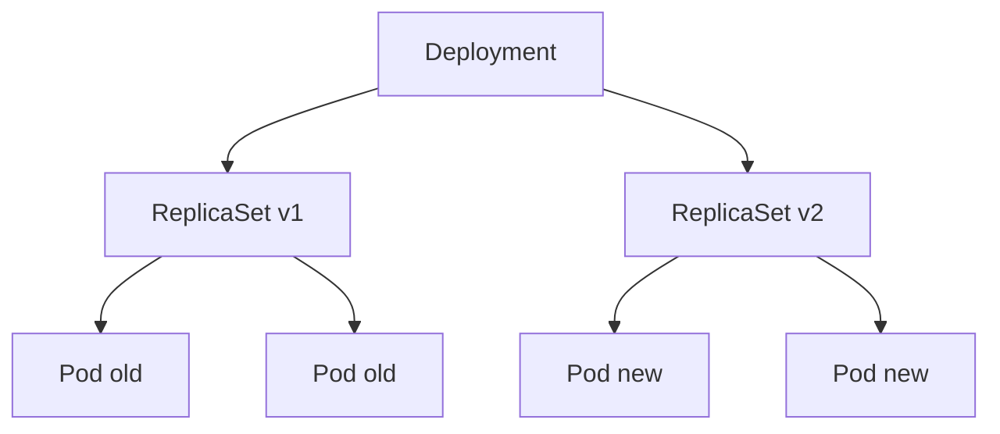

# Deployment

Deployment는 **stateless 애플리케이션의 표준 컨트롤러**다. ReplicaSet을
래핑해서 **선언적 업데이트·롤백·롤아웃 관측**을 제공한다. 프로덕션에서
롤아웃 중 발생하는 절반 이상의 사고(stuck rollout, 서비스 누락, HPA와의
경합)가 이 리소스의 동작 원리를 오해해서 생긴다.

이 글은 롤아웃 전략, conditions, 롤백 메커니즘, paused/scale, HPA와의
상호작용, 그리고 **1.33~1.35 변경**(`terminatingReplicas` Beta,
`podReplacementPolicy` Alpha, In-place Resize가 바꾸는 운영 습관)까지
다룬다.

> Pod 자체의 라이프사이클: [Pod 라이프사이클](./pod-lifecycle.md)
> 컨트롤러의 일반 원리: [Reconciliation Loop](../architecture/reconciliation-loop.md)
> 배포 전략(Blue/Green·Canary·Traffic shifting) 구현 도구: `cicd/` 섹션

---

## 1. Deployment의 위치



- Deployment는 **ReplicaSet을 관리**하고, ReplicaSet이 Pod을 관리한다
- 새 `spec.template`이 들어오면 **새 ReplicaSet**을 만든다
- old RS scale down + new RS scale up을 조율하는 것이 Deployment의 본질

**무엇을 하지 않는가**:
- Blue/Green·Canary·Traffic Shifting은 **native 미지원** (RollingUpdate, Recreate만)
- 위 전략이 필요하면 Argo Rollouts, Flagger 또는 Service/Gateway API 트래픽 제어 도구 사용 (→ `cicd/`)

---

## 2. 롤아웃 전략

### RollingUpdate (기본)

```yaml
spec:
  strategy:
    type: RollingUpdate
    rollingUpdate:
      maxSurge: 25%
      maxUnavailable: 25%
```

| 파라미터 | 기본값 | 의미 |
|---|---|---|
| `maxSurge` | 25% | desired 위로 **초과 생성** 허용 Pod 수 |
| `maxUnavailable` | 25% | desired 아래로 **허용되는 unavailable** Pod 수 |
| `minReadySeconds` | 0 | probe 통과 후 **available 판정까지 대기** 시간 |
| `progressDeadlineSeconds` | 600 | 이 시간 내 진척 없으면 `Progressing=False` |
| `revisionHistoryLimit` | 10 | 보존할 비활성 RS 개수, 0이면 롤백 불가 |

**퍼센트 계산**: 정수 또는 퍼센트(내림). 둘 다 0은 불가(교착 방지).

### Recreate

```yaml
spec:
  strategy:
    type: Recreate
```

**모든 old Pod 종료 → 전부 사라진 후 new Pod 생성**. 다운타임 발생.
멀티버전 공존이 불가능한 레거시 앱(파일 lock·singleton writer 등)에만 사용.

### 운영 원칙

- **`minReadySeconds=0`은 사실상 probe 통과 즉시 available로 간주** — warmup
  필요한 앱(JVM·model loading)은 **15~30초** 권장
- `maxUnavailable=0` + 엄격한 PDB 조합은 **롤아웃 영구 정지** 유발
  (예: `replicas=3`, `maxUnavailable=0`, PDB `minAvailable=3` → eviction
  불가로 교착)
- `maxSurge=100% + maxUnavailable=100%`는 Recreate와 실질 동일(폭주)
- **GPU·라이선스 1:1 자원**에는 `maxSurge=0` + `podReplacementPolicy` 활용 (§8)
- **EndpointSlice·conntrack 지연** 탓에 새 Pod Ready 직후에도 502 가능 →
  `minReadySeconds`만으로 부족하면 Pod 라이프사이클의 `preStop.sleep` 병행

---

## 3. Rollout 메커니즘

### pod-template-hash

- `spec.template`을 해싱한 값을 ReplicaSet과 Pod에 **자동 라벨링**
- 같은 template이면 같은 hash → **롤백 시 기존 RS 재사용**
- Deployment selector에는 hash 없음. 각 RS selector에만 hash 추가 → RS 간
  Pod 소유권 충돌 방지

### Surge·Unavailable 계산 예시

desired=10, `maxSurge=2`, `maxUnavailable=1`:
- 동시 최대 Pod 수: **12** (10 + 2)
- 동시 최소 Ready: **9** (10 − 1)
- 각 스텝에서 new RS scale up → ready 대기 → old RS scale down 반복

### Proportional Scaling

스케일 중 rollout이 중첩되면 **활성 RS들에 replicas를 비율로 배분**.
어느 버전이 장애여도 영향이 제한된다.

### TopologySpread `matchLabelKeys` (1.34+)

```yaml
topologySpreadConstraints:
- maxSkew: 1
  topologyKey: topology.kubernetes.io/zone
  whenUnsatisfiable: ScheduleAnyway
  matchLabelKeys:
  - pod-template-hash
```

**롤링 중에도 새 RS 내에서만** skew 계산 → old·new 합산이 왜곡을 만들던
오래된 문제를 해결. 존 간 균등 배포가 중요한 서비스에 필수.

---

## 4. Deployment Conditions

| Type | Status | Reason | 의미 |
|---|:-:|---|---|
| `Progressing` | True | `NewReplicaSetCreated` | 새 RS 생성 |
| `Progressing` | True | `ReplicaSetUpdated` | RS 스케일 진행 |
| `Progressing` | True | `NewReplicaSetAvailable` | 새 RS가 desired ready 달성 |
| `Progressing` | False | `ProgressDeadlineExceeded` | 데드라인 초과 (rollout 중단 아님) |
| `Progressing` | Unknown | `DeploymentPaused` | paused 상태 |
| `Available` | True | `MinimumReplicasAvailable` | ready ≥ desired − maxUnavailable |
| `Available` | False | `MinimumReplicasUnavailable` | 미달 |
| `ReplicaFailure` | True | `FailedCreate` / `FailedDelete` | 쿼터·admission 거부 |

### 판정 원칙

- **`Available=True`여도 `Progressing=False`일 수 있음** — 이전 RS가 살아있고
  새 RS가 stuck
- `kubectl rollout status`는 **두 조건 모두**를 본다
- **`observedGeneration == metadata.generation`** 확인이 "컨트롤러가 현재
  spec을 봤다"는 유일한 증거 (CI/CD 파이프라인의 정확한 게이트)

---

## 5. Rollback

```bash
kubectl rollout history deploy/app
kubectl rollout undo    deploy/app
kubectl rollout undo    deploy/app --to-revision=5
```

### 동작 원리

- 각 RS에 `deployment.kubernetes.io/revision` 어노테이션으로 revision 기록
- `undo`는 대상 revision의 RS에서 `spec.template`을 추출 → 현재 Deployment에
  patch
- 해당 hash의 RS가 이미 있으면 **scale up만**, 없으면 새로 생성

### GitOps와의 상호작용

| 환경 | `rollout undo` 권장 | 이유 |
|---|:-:|---|
| 수동 운영 | ✅ | 즉각 복구 |
| ArgoCD/Flux 자동 sync | ❌ | Git 되감기 없이는 다음 reconcile이 덮어씀 |

**원칙**: GitOps에서는 **Git revert → sync**가 rollback 표준.
`kubectl rollout undo`는 **긴급 완화(mitigation)**로만 쓰고, 직후 Git 상태
정리 필수.

### `CHANGE-CAUSE`

- 과거 `kubectl apply --record`로 채워지던 `kubernetes.io/change-cause`
  어노테이션은 **수년 전부터 deprecated** 표시였고 최근 kubectl에서는 사실상
  동작하지 않는다(이슈 #40422 계통)
- GitOps 환경에서는 해당 컬럼이 비어 있는 것이 정상 — commit hash를 직접
  annotation으로 주입하는 패턴 권장

---

## 6. Paused Deployment

```bash
kubectl rollout pause  deploy/app
# bulk 변경 (image + resources + env ...)
kubectl rollout resume deploy/app
```

- `spec.paused=true` 시 template 변경을 감지해도 **새 RS 생성 안 함**
- **`spec.replicas` 변경(스케일)은 계속 처리**
- `Progressing` condition: `Unknown / DeploymentPaused`

### 운영 활용

- 여러 변경을 한 번의 rollout으로 묶기 (sprawling한 매니페스트 정리 시)
- 장애 중 **자동 rollout 차단**하고 수동 검증 후 resume

---

## 7. Scaling과 HPA

### 수동 스케일

```bash
kubectl scale deploy/app --replicas=20
kubectl patch deploy/app -p '{"spec":{"replicas":20}}'
```

### HPA와의 충돌 — GitOps 고질병

**문제**: HPA가 `replicas=30`으로 올렸는데 ArgoCD가 Git의 `replicas=5`로
되돌림 → 30→5→30→5 반복.

**해결** (택 1):

| 방법 | 설정 |
|---|---|
| Git에서 `replicas` **필드 제거** | 가장 깔끔, HPA 전용 |
| ArgoCD `ignoreDifferences` + `RespectIgnoreDifferences=true` | replicas 필드만 Git 무시 |
| Flux `patches`로 대상 필드 drift 허용 | Flux 전용 |

> **콜드스타트 주의**: Git에서 `replicas`를 완전 제거하면 **최초 생성 시
> Kubernetes 기본값 1**로 배포된다. HPA가 reconcile하기 전까지 replica=1로
> 트래픽이 몰릴 수 있음. `HPA.spec.minReplicas`를 안전 수준으로 설정 +
> 초기 배포 시 수동으로 scale 맞추기 권장.

### In-place Pod Resize(1.35 GA)의 영향

리소스 변경(CPU/Mem requests·limits)만 필요한 경우 **Deployment rollout
불필요**. Pod을 그대로 두고 resize. 단 **Guaranteed QoS·Linux·재시작 정책
지정** 등 제약은 [Pod 라이프사이클](./pod-lifecycle.md) 의 "In-place Pod
Resize" 섹션 참조.

**결과**: "CPU 부족 → replicas 상향" 대신 "resize로 vertical 확대" 같은
새 운영 패턴이 가능.

---

## 8. 최신 변경 (1.33~1.35)

| 변경 | KEP | 버전 | 영향 |
|---|---|---|---|
| `status.terminatingReplicas` 노출 | KEP-3973 | 1.33 Alpha · **1.35 Beta(기본 활성)** | graceful shutdown 긴 앱의 "진짜 끝" 관측 |
| `spec.podReplacementPolicy` | KEP-3973 (이슈 #5882 트래킹) | **1.34 Alpha** · 1.35 Alpha 유지 | old Pod 완전 종료까지 new 생성 보류 |
| In-place Pod Resize GA | KEP-1287 | **1.35 GA** | 리소스 변경 시 Deployment rollout 불필요 |
| Pod `.status.observedGeneration` | KEP-5067 | **1.35 GA** (Pod 수준) | Deployment는 활용측 |
| TopologySpread `matchLabelKeys` 머지 구현 명시화 | — | 필드 1.25 Alpha · 1.27 Beta · 1.32 GA, 1.34 구현 개선 | 롤링 중 skew 왜곡 완화 |
| Native Sidecar (Pod template) | KEP-753 | 1.33 GA | Deployment 내 sidecar 종료 순서 결정 |

> **참고**: `terminatingReplicas`와 `podReplacementPolicy`는 **같은 모 KEP-3973**
> 의 두 단계 결과물이다. 이슈 #5882는 `podReplacementPolicy` 세부 구현의
> 트래킹 번호.

### `status.terminatingReplicas` (1.35 Beta, 기본 활성)

```yaml
status:
  replicas: 10
  readyReplicas: 10
  updatedReplicas: 10
  terminatingReplicas: 3       # 1.35 Beta, 기본 활성
  availableReplicas: 10
```

기존 `kubectl rollout status`는 "새 RS ready" 시점에 완료로 판정 → preStop
sleep + 긴 grace의 old Pod가 아직 살아 있어도 "성공"으로 보였다.
`terminatingReplicas`로 이 누락이 해소된다.

### `spec.podReplacementPolicy` (**1.34 Alpha**, 1.35 Alpha 유지)

```yaml
spec:
  podReplacementPolicy: TerminationComplete
```

| 값 | 의미 | 사용 사례 |
|---|---|---|
| `TerminationStarted` (기본) | old Pod 종료 시작하면 new 생성 | 일반 stateless |
| `TerminationComplete` | old Pod **완전 종료 후** new 생성 | GPU·외부 라이선스·포트 1:1 점유 |

> 1.34 도입 Alpha, 1.35에서도 **여전히 Alpha**. `DeploymentPodReplacementPolicy`
> 피처 게이트 필요, 기본 비활성. Jobs의 `podReplacementPolicy`(1.26 Alpha →
> 1.34 GA)와는 **별개 기능**이니 혼동 주의.

### `matchLabelKeys` 구현 개선 (1.34)

`matchLabelKeys` **필드 자체는 1.25 Alpha로 등장** → 1.27 Beta → 1.32 GA.
1.34에서는 `MatchLabelKeysInPodTopologySpreadSelectorMerge` 피처 게이트가
기본 활성화되어 **스케줄러가 `matchLabelKeys`를 `labelSelector`에 명시적으로
머지**하도록 내부 동작이 정돈됐다(독자 가시성 개선).

---

## 9. 프로덕션 체크리스트

- [ ] `minReadySeconds` ≥ 15~30 (warmup 있는 앱)
- [ ] `progressDeadlineSeconds`가 **앱 부팅 + probe grace**를 충분히 포함
- [ ] `revisionHistoryLimit` 3~10 (롤백 여유 + etcd 부하 균형, 0 금지)
- [ ] `strategy`가 워크로드 성격과 일치 (멀티버전 불가 앱만 Recreate)
- [ ] **selector 변경이 없는지** — `apps/v1`에서 immutable, 변경 시 Deployment 재생성 필요
- [ ] HPA 사용 시 Git에 `replicas` 필드 없음 (또는 `ignoreDifferences` 설정)
- [ ] PDB 설정 — drain·rollout 중 최소 가용 Pod 명시
- [ ] `topologySpreadConstraints`에 `matchLabelKeys: [pod-template-hash]` (존 분산 서비스)
- [ ] GPU·라이선스 1:1 자원은 `podReplacementPolicy: TerminationComplete` 검토
- [ ] `terminatingReplicas` 기반 rollout 완료 판정 파이프라인 (1.35+)
- [ ] readiness/liveness probe 적절 (→ Pod 라이프사이클 참조)

---

## 10. 트러블슈팅

| 증상 | 근본 원인 | 진단 순서 |
|---|---|---|
| **Stuck rollout** | 이미지 pull, probe 실패, 쿼터, PSA admission 거부 | `describe deploy` → `get rs` → `describe pod` |
| `Progressing=False ProgressDeadlineExceeded` | 진척 없음. 원인은 별개 | RS events, pod events. `kubectl rollout status`가 **non-zero exit** → CI/CD가 이를 실패로 인지·자동 롤백 트리거 |
| `ReplicaFailure=True FailedCreate` | ResourceQuota·LimitRange·PSA·PVC | `get events -n ns --field-selector reason=FailedCreate` |
| **PDB로 교착** | `maxUnavailable`과 PDB `minAvailable`이 수학적으로 양립 불가 | `kubectl describe pdb`, 계산식 점검 |
| selector immutable 에러 | `matchLabels` 변경 | Deployment 재생성 (Service label swap 병행) |
| HPA flapping | Git의 static replicas | Git에서 replicas 제거 |
| 롤백 안 됨 | `revisionHistoryLimit=0` 또는 history 초과 | `rollout history` 확인 |
| 새 Pod이 Ready인데 **502** | `minReadySeconds=0` + probe 느슨, EndpointSlice/conntrack 지연 | §2·Pod 라이프사이클 `preStop.sleep` |
| old Pod이 **영원히 Terminating** | finalizer, volume detach 실패 | Pod 라이프사이클 참조 |
| rollout status는 성공, 사용자는 에러 | preStop drain 중 old Pod이 요청 받음 | `terminatingReplicas`·앱 graceful drain 점검 |
| Orphan ReplicaSet | `--cascade=orphan`, selector 강제 변경, Helm/Kustomize hook 잔재 | RS 수동 삭제 + 재발 방지(`--cascade=background` 기본 사용) |

### 자주 쓰는 명령

```bash
kubectl rollout status   deploy/app --timeout=10m
kubectl rollout history  deploy/app
kubectl rollout undo     deploy/app --to-revision=N
kubectl rollout pause    deploy/app
kubectl rollout resume   deploy/app
kubectl rollout restart  deploy/app       # template에 restartedAt 주입

kubectl get deploy app -o jsonpath='{.status.observedGeneration}/{.metadata.generation}'
kubectl get deploy app -o jsonpath='{.status.terminatingReplicas}'   # 1.35+
kubectl describe rs -l app=app
```

**`rollout restart`**는 `spec.template`에 `restartedAt` 어노테이션을
주입 → template hash 변경 → 새 RS 생성. 설정·비밀 변경 후 강제 재기동에
표준. 단 **revision 1개 소모** + `maxSurge`/`maxUnavailable` 경계를
재평가하므로, ConfigMap/Secret 변경은 **template annotation에 checksum을
함께 주입**하는 패턴(Helm `sha256sum`·Kustomize generator hash)이 GitOps
친화적.

---

## 11. Deployment가 다루지 않는 것

- **Ordered start·네트워크 식별**: → [StatefulSet](./statefulset.md)
- **노드 단위 데몬**: → [DaemonSet](./daemonset.md)
- **배치·one-shot**: → [Job·CronJob](./job-cronjob.md)
- **Blue/Green·Canary·Traffic Shifting**: → `cicd/` (Argo Rollouts·Flagger)
- **SLO 기반 자동 롤백**: → `sre/`
- **Feature Flag 기반 점진 노출**: → `cicd/`

---

## 12. 이 카테고리의 경계

- **Deployment 리소스 자체** → 이 글
- **ReplicaSet 세부 동작**(거의 직접 안 씀) → [ReplicaSet](./replicaset.md)
- **Pod 라이프사이클**(probe·graceful·resize 전반) → [Pod 라이프사이클](./pod-lifecycle.md)
- **GitOps에서 Deployment 관리** → `cicd/` (ArgoCD·Flux)
- **고급 배포 전략**(canary·blue-green) → `cicd/`

---

## 참고 자료

- [Kubernetes — Deployments](https://kubernetes.io/docs/concepts/workloads/controllers/deployment/)
- [Kubernetes — Rolling Back a Deployment](https://kubernetes.io/docs/concepts/workloads/controllers/deployment/#rolling-back-a-deployment)
- [kubectl rollout reference](https://kubernetes.io/docs/reference/generated/kubectl/kubectl-commands#rollout)
- [KEP-3973 — Consider Terminating Pods in Deployment](https://github.com/kubernetes/enhancements/tree/master/keps/sig-apps/3973-consider-terminating-pods-deployment)
- [Deployment PodReplacementPolicy 트래킹 이슈 #5882](https://github.com/kubernetes/enhancements/issues/5882)
- [KEP-5067 — Pod Generation](https://github.com/kubernetes/enhancements/issues/5067)
- [KEP-753 — Sidecar Containers](https://github.com/kubernetes/enhancements/tree/master/keps/sig-node/753-sidecar-containers)
- [KEP-1287 — In-place Pod Resize](https://github.com/kubernetes/enhancements/tree/master/keps/sig-node/1287-in-place-update-pod-resources)
- [v1.34 Jobs PodReplacementPolicy GA Blog](https://kubernetes.io/blog/2025/09/05/kubernetes-v1-34-pod-replacement-policy-for-jobs-goes-ga/)
- [Kubernetes v1.33 Release Blog](https://kubernetes.io/blog/2025/04/23/kubernetes-v1-33-release/)
- [Kubernetes v1.35 Release Blog](https://kubernetes.io/blog/2025/12/17/kubernetes-v1-35-release/)
- [ArgoCD — Diffing Customization (replicas)](https://argo-cd.readthedocs.io/en/stable/user-guide/diffing/)
- [Production Kubernetes — Josh Rosso](https://www.oreilly.com/library/view/production-kubernetes/9781492092292/)

(최종 확인: 2026-04-21)
