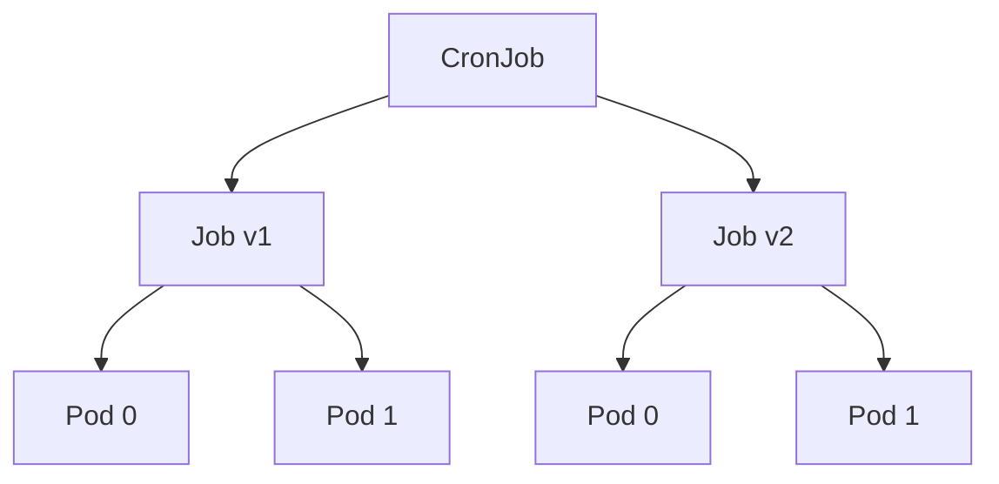

# Job·CronJob

Job은 **run-to-completion** 워크로드의 표준 컨트롤러다. 마이그레이션,
데이터 처리, 배치 학습, 스냅샷·백업 — "끝나야 하는 일"은 전부 여기 속한다.
CronJob은 **Job을 주기 실행**하는 상위 래퍼다.

운영에서 Job은 생각보다 까다롭다. sidecar 때문에 영원히 안 끝나는 Job,
`backoffLimit` 소진 후 재처리 불가, CronJob 시간대 혼동, GPU·라이선스
slot 중복 기동. 이 글은 **스펙·상태 모델·실패 정책·1.33~1.35 변경**을
운영 관점에서 다룬다.

> Pod 자체의 라이프사이클: [Pod 라이프사이클](./pod-lifecycle.md)
> 컨트롤러의 일반 원리: [Reconciliation Loop](../architecture/reconciliation-loop.md)
> 배치 큐잉·멀티클러스터 dispatch: `kubernetes/scheduling/` (Kueue)
> 워크플로우·DAG 오케스트레이션: `cicd/` (Argo Workflows, Airflow)

---

## 1. Job의 위치



- CronJob은 **스케줄에 맞춰 Job을 생성**만 한다
- Job은 **Pod을 직접** 만들고 완료까지 추적한다
- Job은 ReplicaSet을 거치지 않는다 — Pod은 Job이 직접 소유

| 항목 | Deployment | StatefulSet | **Job** |
|---|---|---|---|
| 종료 모델 | 계속 실행 | 계속 실행 | **run-to-completion** |
| restartPolicy | Always | Always | **OnFailure · Never** |
| 완료 판정 | 없음 | 없음 | `Complete` / `Failed` condition |
| 실패 처리 | 재시작 무한 | 재시작 무한 | `backoffLimit` 도달 시 포기 |
| GC | revision history | revision history | **`ttlSecondsAfterFinished`** |

---

## 2. Job 스펙의 핵심 필드

```yaml
apiVersion: batch/v1
kind: Job
metadata:
  name: import
spec:
  completions: 10            # 총 성공해야 하는 Pod 수
  parallelism: 3             # 동시 실행 상한
  completionMode: Indexed    # NonIndexed(기본) · Indexed
  backoffLimit: 6            # 기본 6, 총 재시도 한도
  activeDeadlineSeconds: 3600
  ttlSecondsAfterFinished: 86400
  template:
    spec:
      restartPolicy: Never   # Job은 Never 또는 OnFailure만
      containers:
      - { name: worker, image: myimage:latest }
```

| 필드 | 기본값 | 의미 |
|---|---|---|
| `completions` | 1 | 성공해야 하는 Pod 개수 |
| `parallelism` | 1 | 동시 실행 상한 |
| `completionMode` | `NonIndexed` | `Indexed`면 각 Pod이 고정 index 소유 |
| `backoffLimit` | 6 | **누적 실패 한도** (초과 시 Job Failed) |
| `activeDeadlineSeconds` | 없음 | 총 소요 시간 상한 (즉시 종료) |
| `ttlSecondsAfterFinished` | 없음 | 완료 후 이 시간 뒤 Job·Pod 삭제 |
| `suspend` | false | 대기열 제어 (Kueue 등에서 활용) |
| `podReplacementPolicy` | `TerminatingOrFailed` | §7 참조 |
| `podFailurePolicy` | 없음 | §6 참조 |
| `successPolicy` | 없음 | §8 참조 |
| `managedBy` | 없음 | §9 참조 |

### restartPolicy — Never vs OnFailure

| 값 | 실패 시 | 사용처 |
|---|---|---|
| `Never` | **새 Pod 생성** (Pod 교체) | Job 표준. 로그·events 분석 쉬움 |
| `OnFailure` | 같은 Pod에서 **컨테이너 재시작** | 빠른 재시도가 유리한 경우 |

**`podFailurePolicy`를 쓰려면 `Never` 필수** — kubelet과 Job 컨트롤러
사이 race 방지 때문(§6).

---

## 3. 완료 모델과 병렬 패턴

### NonIndexed (기본)

- Pod은 **교환 가능** — `completions` 개수만 성공하면 끝
- 대표 패턴: **Work Queue** (외부 큐에서 pop)
- `completions` 미지정 + `parallelism`만 → **단일 성공 Pod**까지 경쟁

### Indexed — 정적 작업 분할

- 각 Pod에 `0 ~ completions-1`의 **고유 index** 부여
- Pod 이름: `<job>-<index>-<hash>`
- 환경변수·annotation 두 경로로 index 노출

```yaml
spec:
  completions: 10
  parallelism: 3
  completionMode: Indexed
  template:
    spec:
      restartPolicy: Never
      containers:
      - name: worker
        image: myimage:latest
        env:
        - name: JOB_COMPLETION_INDEX
          valueFrom:
            fieldRef:
              fieldPath: metadata.annotations['batch.kubernetes.io/job-completion-index']
```

Pod hostname/subdomain(`<job>-<index>`)도 자동 부여 → Headless Service와
조합하면 Pod 간 **DNS 통신** 가능. MPI·분산 학습의 표준 구성.

### 병렬 패턴 비교

| 패턴 | 설정 | 용도 |
|---|---|---|
| Work Queue | `NonIndexed`, completions=N | 큐 pop, 데이터 import |
| Fixed Completion | `Indexed`, completions=N | shard별 static 분할 |
| Single-Pod | completions=1, parallelism=1 | 단발성 migration |
| Elastic Indexed | `Indexed` + completions == parallelism | 실행 중 규모 조정 |

### Elastic Indexed Job (KEP-3715, 1.31 Stable)

`completions == parallelism`일 때만 실행 중 `completions` 변경 허용.
HPC·ML에서 자원 여건에 따라 워커 수 조정 용도. 두 값은 **항상 같이 패치**.

---

## 4. Job Conditions와 상태 판정

### Conditions

| Type | Status | Reason 예 | 의미 |
|---|:-:|---|---|
| `Suspended` | True | `JobSuspended` | `spec.suspend=true`로 중지 |
| `FailureTarget` | True | `BackoffLimitExceeded` · `DeadlineExceeded` · `MaxFailedIndexesExceeded` · `PodFailurePolicy` | 실패 확정, cleanup 중 |
| `SuccessCriteriaMet` | True | `SuccessPolicy` · `CompletionsReached` | 성공 확정, cleanup 중 |
| `Complete` | True | `CompletionsReached` · `SuccessPolicy` | cleanup 완료, 최종 성공 |
| `Failed` | True | 위 FailureTarget의 reason | cleanup 완료, 최종 실패 |

**중간 Condition 존재 이유**: 실패·성공은 결정됐으나 **Pod이 남은**
cleanup 구간을 명시 표현. Argo Workflows 등 외부 컨트롤러가 이 구간을
정확히 구분할 수 있다.

판정 원칙:

- **최종 판정은 `Complete` / `Failed`만** — 중간 condition에 기대지 말 것
- `status.succeeded`·`status.failed`는 **Pod 단위**, index별 집계는
  `status.completedIndexes`·`status.failedIndexes`
- `status.ready`·`status.terminating`으로 **진행 중 Pod 가시화** (1.31+)

---

## 5. Job GC와 누적 방지

### `ttlSecondsAfterFinished`

완료된 Job·Pod 자동 정리.

```yaml
spec:
  ttlSecondsAfterFinished: 3600   # 완료 1시간 후 삭제
```

- 미설정 시 Job이 etcd에 영원히 남음 — 분·시간 배치가 잦은 클러스터는 필수
- CronJob이 만드는 Job은 §12 `successfulJobsHistoryLimit`로도 제어
- `0` 허용(즉시 삭제) — 로그 수집 대기 시간 확보 후 사용

### `activeDeadlineSeconds` vs `backoffLimit`

| 필드 | 트리거 | 효과 |
|---|---|---|
| `backoffLimit` | **실패 Pod 누적** 초과 | Job `Failed`, Pod 재시도 종료 |
| `activeDeadlineSeconds` | **시간 경과** | Job 즉시 `Failed`, 실행 중 Pod 강제 종료 |

- `backoffLimit=0`이면 **단 1회 시도**로 실패 확정
- `activeDeadlineSeconds`는 `spec.startTime` 기준 — **suspend 시간은
  포함 안 됨**
- 두 값은 **독립적** — 무한 재시도 위험을 막으려면 둘 다 설정

---

## 6. podFailurePolicy — 재시도 전략의 핵심 (KEP-3329, 1.31 GA)

기본 동작은 **모든 실패를 동등하게** `backoffLimit`에 카운트한다.
실제로는 재시도 의미가 다르다:

| 구분 | 예 |
|---|---|
| 재시도 의미 있음 | 일시적 네트워크 오류, preemption, 노드 eviction |
| 재시도 무의미 | 코드 버그(segfault, panic), 입력 데이터 오류 |
| 재시도 위험 | 외부 서비스 destructive 호출 부분 실패 |

`podFailurePolicy`로 **exit code·condition 기반** 구분.

```yaml
spec:
  backoffLimit: 6
  template:
    spec:
      restartPolicy: Never         # podFailurePolicy는 Never 강제
  podFailurePolicy:
    rules:
    - action: FailJob              # 즉시 실패
      onExitCodes:
        containerName: main
        operator: In
        values: [42]
    - action: Ignore               # backoffLimit에 카운트 안 함
      onPodConditions:
      - type: DisruptionTarget     # preemption·eviction
    - action: Count                # 기본 동작
      onExitCodes:
        containerName: main
        operator: NotIn
        values: [0, 42]
```

### Action 3종

| Action | 동작 | 사용 예 |
|---|---|---|
| `Count` | 기본. `backoffLimit`에 카운트 | 일반 실패 |
| `Ignore` | 카운트 안 함, Pod만 교체 | preemption·eviction |
| `FailJob` | Job 즉시 `Failed` | 코드 버그 exit code |

### Matcher 2종

| Matcher | 평가 대상 | 비고 |
|---|---|---|
| `onExitCodes` | 컨테이너 exit code | `operator: In / NotIn`, 0은 항상 제외 |
| `onPodConditions` | `status.conditions[].type` | 인프라 신호 (`DisruptionTarget` 등) |

### 프로덕션 효과

- **없을 때**: preemption 3회 → `backoffLimit=3` 소진 → Job 실패
- **있을 때**: preemption은 `Ignore`, 실제 오류만 카운트 → 인프라
  disruption에 **자연스럽게 내성**

> Indexed Job 전용 `FailIndex` action(§7)과 헷갈리지 말 것. `FailJob`은
> Job 전체 실패, `FailIndex`는 해당 index만 실패.

---

## 7. BackoffLimitPerIndex — index별 독립 한도 (KEP-3850, 1.33 GA)

### 기본 `backoffLimit`의 한계

Indexed Job에서 **모든 index가 한 카운터를 공유** → index 7이 세 번
실패하면 다른 9개 index가 정상이어도 Job 전체 실패. 테스트 스위트·독립
배치 같은 "embarrassingly parallel"에서 치명적.

```yaml
spec:
  completions: 10
  parallelism: 10
  completionMode: Indexed
  backoffLimitPerIndex: 1       # index별 재시도 한도
  maxFailedIndexes: 5           # 실패 index 총 상한
  template:
    spec:
      restartPolicy: Never
  podFailurePolicy:
    rules:
    - action: Ignore
      onPodConditions: [{ type: DisruptionTarget }]
    - action: FailIndex         # ← Indexed Job 전용
      onExitCodes:
        operator: In
        values: [42]
```

| 항목 | 의미 |
|---|---|
| `backoffLimitPerIndex` | 각 index별 허용 재시도 횟수 |
| `maxFailedIndexes` | 총 실패 index 수 상한 (초과 시 Job 종료) |
| `status.failedIndexes` | 한도 초과로 실패 확정된 index 목록 |
| `FailIndex` action | 해당 index만 즉시 실패 (재시도 스킵) |

결과: index 3·7 실패 + 나머지 8개 성공 → Job은 일부 성공으로 끝나고
**어느 index가 실패했는지** 명확히 보고된다.

---

## 8. JobSuccessPolicy — 조기 성공 판정 (KEP-3998, 1.33 GA)

MPI·분산 학습의 **leader-worker** 패턴 — leader(index 0) 성공 = 작업
완료, worker는 leader 종료 후 의미 없음. 기본 동작으로는 모든 worker가
끝나야 Job 완료.

```yaml
spec:
  completions: 10
  parallelism: 10
  completionMode: Indexed
  successPolicy:
    rules:
    - succeededIndexes: "0"    # leader
      succeededCount: 1
  template:
    spec:
      restartPolicy: Never
```

상태 흐름: leader 성공 → Job에 `SuccessCriteriaMet` 추가 → 컨트롤러가
나머지 Pod 종료 → cleanup 완료 후 `Complete`.

| 규칙 필드 | 의미 |
|---|---|
| `succeededIndexes` | 성공 인정 index 범위 (`"0"`, `"0,2-4"`) |
| `succeededCount` | 범위 내 필요한 성공 개수 |

**제약**: `completionMode: Indexed` 필수.

---

## 9. podReplacementPolicy·managedBy — 최근 GA

### podReplacementPolicy (KEP-3939, 1.34 GA)

기본적으로 Job 컨트롤러는 **Pod 종료 시작**(deletionTimestamp)만 해도 즉시
새 Pod을 만든다. GPU·라이선스·포트 1:1 slot에서는 old가 살아 있는 상태로
new가 같은 slot을 요구 → 실패·중복 점유.

```yaml
spec:
  podReplacementPolicy: Failed     # 완전 종료까지 대기
```

| 값 | 의미 | 사용처 |
|---|---|---|
| `TerminatingOrFailed` (기본) | 종료 시작 즉시 new 생성 | 일반 stateless Job |
| `Failed` | old가 **`Failed` phase**까지 내려간 뒤 new | GPU·외부 slot 배타 |

> **예외 규칙**: `podFailurePolicy`가 설정된 Job은 **기본값이 `Failed`**이며
> 다른 값 허용 안 됨. TensorFlow·JAX 등 index당 Pod 1개 가정의 프레임워크
> 안전성을 위한 설계.

### managedBy (KEP-4368, 1.35 GA)

**외부 컨트롤러**에 Job 관리 위임. 내장 Job 컨트롤러가 해당 Job에 대해
reconcile을 **완전히 skip**한다.

```yaml
spec:
  managedBy: kueue.x-k8s.io/multikueue
```

| 값 | 결과 |
|---|---|
| 미설정 또는 `kubernetes.io/job-controller` | 내장 컨트롤러가 처리 |
| 그 외 문자열 | 외부 컨트롤러가 책임, 내장은 무시 |

**Immutable** — 생성 후 변경 불가. 도중 전환 시 Pod orphan 위험.

대표 사용처는 MultiKueue(관리 클러스터 ↔ 워커 클러스터 Job dispatch),
JobSet·Kueue(상위 워크로드가 Job 통제), Kubeflow Trainer·KubeRay(ML
커스텀 스케줄링). 배치 큐잉 심화는 `kubernetes/scheduling/` 참조.

---

## 10. Suspended Job — Kueue·대기열의 기반

```bash
kubectl patch job big --type=merge -p '{"spec":{"suspend":true}}'
```

- `suspend: true` → 모든 active Pod **종료**, Job은 보존
- `false` 전환 → Pod 재생성 시작
- 대표 활용: Kueue가 Job을 `suspend=true`로 생성 → 쿼터 확보 후 resume

### Suspended 상태의 mutability

| 변경 가능 필드 | 비고 |
|---|---|
| `template.spec.nodeSelector / affinity / tolerations` | 안정 지원 |
| `template.spec.containers[*].resources` | **1.35 신규** |
| `completions`, `parallelism` | Indexed 일부 외 immutable |

1.35에서 suspended Job의 **resources 변경이 허용**됨 — Kueue가 쿼터에
맞춰 resource를 재조정한 뒤 resume하는 시나리오가 깔끔해진다.

---

## 11. 최신 변경 (1.33~1.35)

| 변경 | KEP | 버전 | 영향 |
|---|---|---|---|
| JobSuccessPolicy | KEP-3998 | **1.33 GA** | leader 성공만으로 조기 종료 |
| BackoffLimitPerIndex | KEP-3850 | **1.33 GA** | index별 독립 재시도 한도 |
| PodReplacementPolicy | KEP-3939 | **1.34 GA**, 기본 `TerminatingOrFailed` | 완전 종료 후 교체 |
| Suspended Job resources 변경 | — | **1.35 신규** | Kueue·큐잉 통합 향상 |
| JobManagedBy | KEP-4368 | **1.35 GA** | 외부 컨트롤러 위임 (MultiKueue) |
| RestartAllContainers | KEP-467 | **1.35 Alpha** | Pod 유지 in-place 재시작 (ML) |
| Opportunistic Batching | — | **1.35 Beta (스케줄러)** | 동일 Pod 대량 스케줄 가속 |

참고 — 이전 GA: CronJob 안정화 1.21, CronJob TimeZone 1.27, Elastic
Indexed Job 1.31, PodFailurePolicy 1.31.

### RestartAllContainers — 1.35 Alpha 주의

Pod 삭제·재생성 없이 **전체 컨테이너만 재기동**. 대규모 ML 학습에서
재스케줄 비용 절감이 목적. Alpha·기본 비활성이라 프로덕션 사용 금지.
피처 게이트: `RestartAllContainersOnContainerExits`.

---

## 12. CronJob

### 스펙

```yaml
apiVersion: batch/v1
kind: CronJob
metadata:
  name: nightly-backup
spec:
  schedule: "0 3 * * *"                 # 매일 03:00
  timeZone: "Asia/Seoul"                # 1.27 GA
  concurrencyPolicy: Forbid
  startingDeadlineSeconds: 600
  successfulJobsHistoryLimit: 3
  failedJobsHistoryLimit: 1
  suspend: false
  jobTemplate:
    spec:
      backoffLimit: 2
      ttlSecondsAfterFinished: 3600
      template:
        spec:
          restartPolicy: OnFailure
          containers:
          - { name: backup, image: backup:1.0 }
```

### 스펙 필드

| 필드 | 기본 | 의미 |
|---|---|---|
| `schedule` | 필수 | 5필드 cron 표기 + macro (`@hourly` 등) |
| `timeZone` | kube-controller-manager 로컬 | IANA 이름 (`Asia/Seoul`) |
| `concurrencyPolicy` | `Allow` | `Allow` · `Forbid` · `Replace` |
| `startingDeadlineSeconds` | 없음 | 예정 시각 + 이 시간 내에만 실행 허용 |
| `successfulJobsHistoryLimit` | 3 | 보관할 성공 Job 개수 |
| `failedJobsHistoryLimit` | 1 | 보관할 실패 Job 개수 |
| `suspend` | false | 새 Job 생성 중지, 이미 실행 중 Job은 영향 없음 |

### concurrencyPolicy

| 값 | 이전 Job 실행 중일 때 | 대표 용도 |
|---|---|---|
| `Allow` (기본) | **중첩 허용** | 상호 독립 배치 |
| `Forbid` | 스킵 | 장기 backup, DB 마이그레이션 |
| `Replace` | 기존 종료 후 새 실행 | 최신 데이터만 의미 있는 잡 |

### timeZone — 1.27 GA

- IANA 이름 필수 (`Asia/Seoul`, `UTC`)
- `CRON_TZ=`·`TZ=` prefix는 API에서 거부됨
- Go 표준 tzdata 번들 — 노드에 OS tzdata 없어도 동작
- 온프레미스에서 kcm 로컬 타임존 의존 금지, **항상 명시**

### startingDeadlineSeconds

- 컨트롤러 복구 직후 **예정 시각이 이 윈도 밖이면 스킵**
- 미설정이면 무한 — 과거 누락분을 몰아서 실행할 위험
- 권장: 스케줄 간격보다 짧게 (예: hourly → 600~1800)
- **missed schedule 100회 한도** 초과 시 해당 Job 포기 — 장기 suspend
  복구 시 유의

### 히스토리 제어

`successfulJobsHistoryLimit`(기본 3)와 `failedJobsHistoryLimit`(기본 1)은
보관할 Job 개수. Job의 `ttlSecondsAfterFinished`와 **중첩 작용**하니
두 가지 모두 설정하되 TTL을 더 짧게 두면 etcd 부담이 줄어든다.

---

## 13. 프로덕션 체크리스트

### Job

- [ ] `restartPolicy`: `Never` 권장 (`podFailurePolicy` 쓰면 필수)
- [ ] `backoffLimit` 명시 — 기본 6을 맹신하지 말 것
- [ ] `activeDeadlineSeconds` — 무한 루프 방어의 최종 라인
- [ ] `ttlSecondsAfterFinished` — etcd 누적 방지
- [ ] `podFailurePolicy`: preemption `Ignore` + 코드 오류 `FailJob`
- [ ] Indexed는 `backoffLimitPerIndex` + `maxFailedIndexes`
- [ ] leader-worker 패턴은 `successPolicy`
- [ ] GPU·라이선스 slot은 `podReplacementPolicy: Failed`
- [ ] Native Sidecar로 로그 shipper 구성 — Job 완료 방해 없음
- [ ] `resources` 명시 — OOMKill로 backoff 소진 방지
- [ ] Kueue·MultiKueue면 `managedBy` 일관성 (1.35+)

### CronJob

- [ ] `timeZone` 명시 — kcm 로컬 의존 금지
- [ ] `concurrencyPolicy` — DB 작업 기본 `Forbid`
- [ ] `startingDeadlineSeconds` — 장기 누락 방지
- [ ] 히스토리 limit + Job 템플릿 `ttlSecondsAfterFinished`
- [ ] 이름 52자 이하 (Job suffix 11자 여유)

---

## 14. 트러블슈팅

| 증상 | 근본 원인 | 진단·조치 |
|---|---|---|
| **Job 영원히 미완료** | 구식 `containers[]` sidecar가 안 끝남 | **Native Sidecar**(1.33 GA)로 전환 — `initContainers`에 `restartPolicy: Always` |
| Job이 금방 `Failed` | `backoffLimit=0` 또는 낮은 값 + OOMKilled | exit code 137 확인, `requests/limits`·`backoffLimit` 재조정 |
| preemption마다 Job 실패 | 모든 실패가 `Count`로 집계 | `podFailurePolicy` `Ignore`로 `DisruptionTarget` 제외 |
| Indexed Job에서 한 index만 실패인데 전체 실패 | 기본 `backoffLimit` 공유 | `backoffLimitPerIndex` + `maxFailedIndexes` |
| 완료된 Job·Pod이 누적 | `ttlSecondsAfterFinished` 없음 | Job 템플릿·CronJob jobTemplate 전부 설정 |
| CronJob이 안 돌아감 | `suspend: true`, `startingDeadlineSeconds` 초과, missed 100회 초과 | `kubectl describe cronjob`, `status.lastScheduleTime` |
| 예정 시각과 다르게 실행됨 | `timeZone` 미설정 → kcm 로컬 tz | `timeZone: Asia/Seoul` 명시 |
| CronJob이 **중첩 실행** | `Allow` 기본값, 실행 길이 > 주기 | `Forbid` 또는 `Replace` |
| GPU slot 중복 점유 | 기본 `TerminatingOrFailed` 교체 | `podReplacementPolicy: Failed` |
| Job이 **영원히 Suspended** | Kueue 쿼터 부족, admission webhook 차단 | `kubectl events --for job/...`, Kueue `Workload` 점검 |
| 외부 컨트롤러가 Job 상태를 못 씀 | `managedBy` 미설정 → 내장 컨트롤러가 덮어씀 | `managedBy` 설정 + immutable 확인 |
| `ActiveDeadlineSeconds` 초과 후 로그 유실 | grace period 미확보 | `terminationGracePeriodSeconds` + sidecar로 로그 flush |

### 자주 쓰는 명령

```bash
kubectl get job -o wide
kubectl get cronjob -o wide
kubectl describe job <name>
kubectl get job <name> -o jsonpath='{.status.conditions}'
kubectl get job <name> -o jsonpath='{.status.completedIndexes}'
kubectl get job <name> -o jsonpath='{.status.failedIndexes}'
kubectl logs job/<name> --all-containers                # 대표 Pod
kubectl logs -l batch.kubernetes.io/job-name=<name> --tail=-1
kubectl patch job/<name> --type=merge -p '{"spec":{"suspend":true}}'
kubectl create job manual --from=cronjob/<name>        # 수동 트리거
```

---

## 15. Job이 다루지 않는 것

- **DAG·의존성 있는 워크플로우** → Argo Workflows, Tekton, Airflow (`cicd/`)
- **멀티클러스터 배치 큐잉** → Kueue + MultiKueue (`kubernetes/scheduling/`)
- **장기 이벤트 consumer** → Deployment (Job은 종료 전제)
- **실시간 반복 처리** → CronJob 간격보다 짧으면 Deployment·StatefulSet
- **실험 추적·메타데이터** → MLflow, Kubeflow Training Operator

---

## 16. 이 카테고리의 경계

- **Job·CronJob 리소스 자체** → 이 글
- **Pod probe·graceful·resize** → [Pod 라이프사이클](./pod-lifecycle.md)
- **배치 큐잉·admission·공정성** → `kubernetes/scheduling/` (Kueue)
- **워크플로우 오케스트레이션** → `cicd/` (Argo Workflows, Airflow)
- **ML 학습 잡 전용 프레임워크** → `kubernetes/operator/` (Kubeflow, KubeRay)

---

## 참고 자료

- [Kubernetes — Jobs](https://kubernetes.io/docs/concepts/workloads/controllers/job/)
- [Kubernetes — CronJobs](https://kubernetes.io/docs/concepts/workloads/controllers/cron-jobs/)
- [Handling Retriable and Non-Retriable Pod Failures](https://kubernetes.io/docs/tasks/job/pod-failure-policy/)
- [Indexed Job for Parallel Processing](https://kubernetes.io/docs/tasks/job/indexed-parallel-processing-static/)
- [Kubernetes 1.31 — Pod Failure Policy GA Blog](https://kubernetes.io/blog/2024/08/19/kubernetes-1-31-pod-failure-policy-for-jobs-goes-ga/)
- [Kubernetes 1.33 — Job's Backoff Limit Per Index GA](https://kubernetes.io/blog/2025/05/13/kubernetes-v1-33-jobs-backoff-limit-per-index-goes-ga/)
- [Kubernetes 1.33 — Job's Success Policy GA](https://kubernetes.io/blog/2025/05/15/kubernetes-1-33-jobs-success-policy-goes-ga/)
- [Kubernetes 1.34 — Pod Replacement Policy for Jobs GA](https://kubernetes.io/blog/2025/09/05/kubernetes-v1-34-pod-replacement-policy-for-jobs-goes-ga/)
- [Kubernetes 1.35 Release Blog](https://kubernetes.io/blog/2025/12/17/kubernetes-v1-35-release/)
- [Kubernetes 1.35 — Job Managed By GA](https://kubernetes.io/blog/2025/12/18/kubernetes-v1-35-job-managedby-for-jobs-goes-ga/)
- [KEP-19 — CronJob Stable](https://github.com/kubernetes/enhancements/tree/master/keps/sig-apps/19-Graduate-CronJob-to-Stable)
- [KEP-3140 — CronJob TimeZone](https://github.com/kubernetes/enhancements/tree/master/keps/sig-apps/3140-TimeZone-support-in-CronJob)
- [KEP-3329 — PodFailurePolicy](https://github.com/kubernetes/enhancements/tree/master/keps/sig-apps/3329-retriable-and-non-retriable-failures)
- [KEP-3715 — Elastic Indexed Job](https://github.com/kubernetes/enhancements/issues/3715)
- [KEP-3850 — BackoffLimitPerIndex](https://github.com/kubernetes/enhancements/tree/master/keps/sig-apps/3850-backoff-limits-per-index-for-indexed-jobs)
- [KEP-3939 — Allow replacement when fully terminated](https://github.com/kubernetes/enhancements/tree/master/keps/sig-apps/3939-allow-replacement-when-fully-terminated)
- [KEP-3998 — Job SuccessPolicy](https://github.com/kubernetes/enhancements/tree/master/keps/sig-apps/3998-job-success-completion-policy)
- [KEP-4368 — Job ManagedBy](https://github.com/kubernetes/enhancements/issues/4368)
- [Kueue](https://kueue.sigs.k8s.io/)
- [Production Kubernetes — Josh Rosso](https://www.oreilly.com/library/view/production-kubernetes/9781492092292/)

(최종 확인: 2026-04-21)
