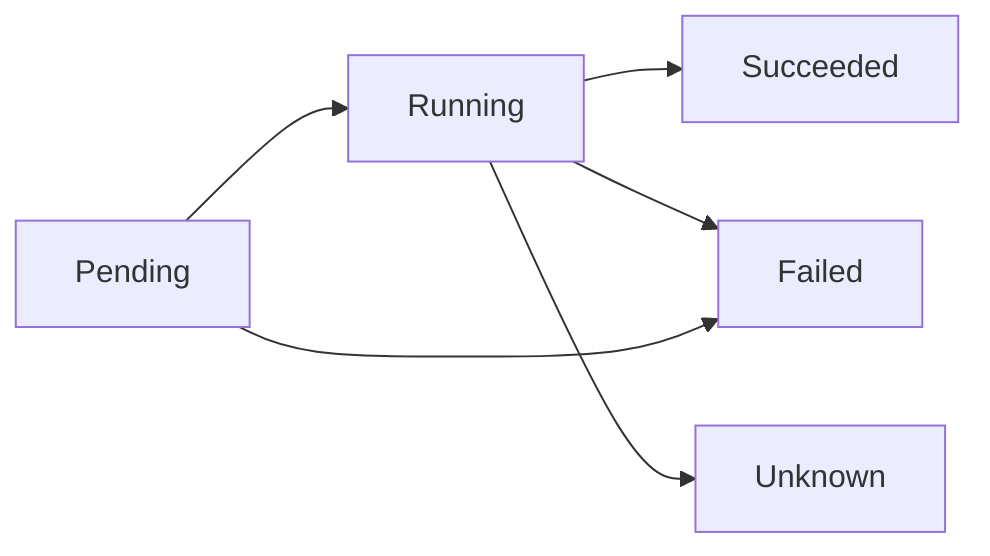
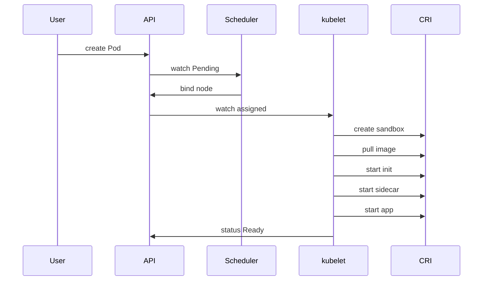
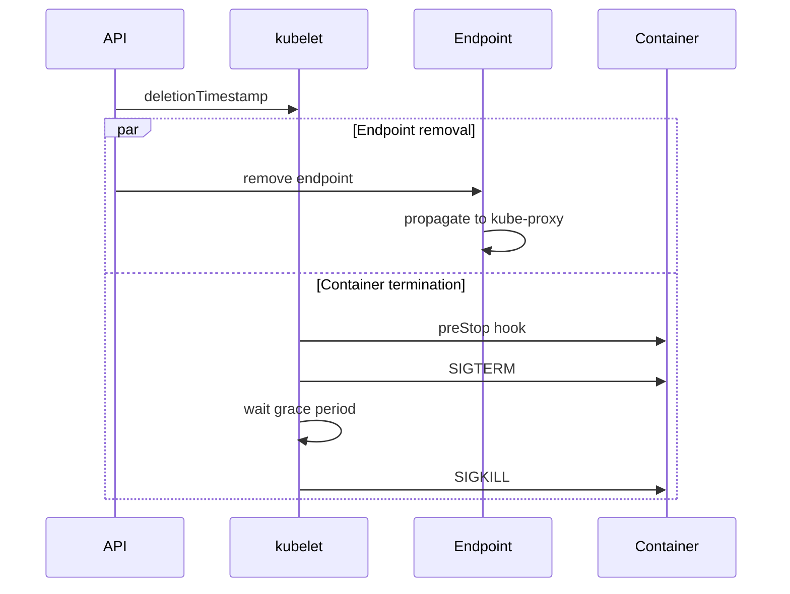

# Pod 라이프사이클

Pod는 Kubernetes의 **최소 배포 단위**이자 **가장 빈번한 장애 지점**이다.
롤링 중 발생하는 502, 재기동 루프(CrashLoopBackOff), `Terminating` 스턱,
OOMKilled — 표면은 다르지만 전부 **라이프사이클 이해 부족**에서 온다.

이 글은 Pod의 상태 모델, probe, 컨테이너 구성(Init·Sidecar), graceful
shutdown, 재시작 정책·QoS, 그리고 **1.33~1.35 핵심 변경**(Native Sidecar GA,
preStop Sleep GA, In-place Pod Resize GA)까지 운영 관점에서 다룬다.

> 상위 컨트롤러(Deployment/StatefulSet 등)에서의 활용은 각 리소스 문서 참조.
> 컨트롤러 작동 원리: [Reconciliation Loop](../architecture/reconciliation-loop.md)
> kubelet이 Pod을 실제로 돌리는 방식: [Controller·kubelet](../architecture/controller-kubelet.md)

---

## 1. Pod의 위치와 상태 모델

Pod는 **같은 네트워크·스토리지·라이프사이클**을 공유하는 하나 이상의 컨테이너
집합이다. 스케줄링·재시작·종료는 **Pod 단위**로 일어난다.



이 5개는 `status.phase` 값. 단 phase는 **고수준 요약**이고, 실제 판정은
`status.conditions`와 `containerStatuses`로 해야 한다(§3).

**"Running = 정상 서비스 중"이 아님을 명심**. Running은 "컨테이너가 최소 1개
실행 중"만 의미. 트래픽 수신 가능 여부는 반드시 `Ready` condition으로 판정.

---

## 2. Pod Phase 5가지

| Phase | 정의 | 대표 진입 조건 |
|---|---|---|
| `Pending` | API 승인 후, 실행 준비 미완 | 스케줄 대기 · 이미지 pull · init 실행 중 |
| `Running` | 노드 바인딩 + 컨테이너 1개 이상 기동 | 컨테이너가 시작·실행·재시작 중 |
| `Succeeded` | 모든 컨테이너가 성공 종료, 재시작 없음 | `restartPolicy: Never` + exit 0 |
| `Failed` | 1개 이상 실패 종료 | non-zero exit 또는 시스템 종료, 재시작 불가 |
| `Unknown` | kubelet 통신 불가 | 노드 분리, heartbeat 실패 |

**판정 우선순위**: `conditions[Ready]` > `containerStatuses` > `phase`.
대시보드·알림은 phase가 아니라 **Ready condition**을 기준으로 설계한다.

---

## 3. Container States와 Pod Conditions

### Container States (컨테이너 레벨)

| State | 주요 필드 | 대표 reason |
|---|---|---|
| `Waiting` | `reason`, `message` | `ContainerCreating`, `ImagePullBackOff`, `CrashLoopBackOff` |
| `Running` | `startedAt` | — |
| `Terminated` | `exitCode`, `signal`, `reason` | `Completed`(0), `Error`(non-zero), `OOMKilled`(137) |

디버깅 시작점:

```bash
kubectl get pod <name> -o jsonpath='{.status.containerStatuses[*].state}'
kubectl get pod <name> -o jsonpath='{.status.containerStatuses[*].lastState}'
```

`lastState`는 **직전 종료 정보**를 담는다. CrashLoopBackOff 원인 추적에 필수.

### Pod Conditions (Pod 레벨)

| Condition | 의미 | 비고 |
|---|---|---|
| `PodScheduled` | 노드 바인딩 완료 | |
| `PodReadyToStartContainers` | 샌드박스·네트워크 준비 완료 | 1.29 Beta · **1.31 GA** |
| `Initialized` | 일반 init 컨테이너 완료 (sidecar는 started) | |
| `ContainersReady` | 모든 컨테이너가 Ready | readinessGate 미포함 |
| `Ready` | Service 라우팅 대상 | `readinessGates` 포함 |
| `DisruptionTarget` | eviction 대상 지정 | 1.31 GA |
| `PodResizePending` | resize 요청 대기 | **1.35 GA** |
| `PodResizeInProgress` | resize 진행 중 | **1.35 GA** |

**`DisruptionTarget.reason`**으로 종료 원인을 분류:

| reason | 발생 시점 |
|---|---|
| `PreemptionByKubeScheduler` | 우선순위 선점 |
| `DeletionByTaintManager` | NoExecute taint |
| `EvictionByEvictionAPI` | `kubectl drain`, PDB API |
| `DeletionByPodGC` | orphan GC |
| `TerminationByKubelet` | 노드 압박, graceful node shutdown |

Job의 `podFailurePolicy`는 이 reason으로 retriable/non-retriable을 구분(1.31 GA).

---

## 4. Pod 라이프사이클 흐름



**핵심 순서** (Native Sidecar GA 1.33 이후):

1. PodScheduled
2. 샌드박스·네트워크 생성 → `PodReadyToStartContainers`
3. **일반 init 순차 실행** (전부 성공 필수)
4. **Sidecar init 시작 후 startup probe 통과 대기**
5. **Initialized** condition True (일반 init 완료 시점)
6. 앱 컨테이너 병렬 시작
7. probe 통과 → `ContainersReady` → `Ready`

---

## 5. Init 컨테이너와 Native Sidecar

### 일반 Init

- `initContainers[]`에 정의, **순차 실행**
- 모두 성공해야 앱 컨테이너 시작
- 실패 시 Pod `restartPolicy`에 따라 재시도
- 용도: DB 마이그레이션, 자격증명 주입 대기, 파일 system 준비

### Native Sidecar (KEP-753, **1.33 GA**)

`initContainers` 배열에 **`restartPolicy: Always`**를 지정한 컨테이너.
기존 `containers[]` 사이드카 패턴의 모든 약점을 해결한다.

```yaml
spec:
  initContainers:
  - name: log-shipper
    image: fluent-bit:latest
    restartPolicy: Always      # ← sidecar 마커
    startupProbe: {...}
    volumeMounts: [...]
  containers:
  - name: app
    image: myapp:latest
```

| 항목 | 기존 패턴 (containers[]) | Native Sidecar |
|---|---|---|
| 시작 순서 | race 가능 | **앱 이전 보장** (startup probe 통과 후) |
| 종료 순서 | 앱과 동시 SIGTERM | **앱 종료 후 역순 SIGTERM** |
| Job 완료 | sidecar가 끝나지 않으면 Job 미완료 | Job 완료 방해 안 함 |
| Probe | 지원 | **startup·readiness·liveness 모두** |
| 재시작 | Pod 재시작 필요 | 컨테이너만 개별 재시작 |

**리소스 계산**: `effective = max(init 단계 최대 request, sum(app + sidecar))`.

**프로덕션 영향**:
- Istio/Linkerd의 기존 주입 방식 → Native Sidecar로 마이그레이션 가능
  (Istio 1.19 experimental, **안정 사용은 1.24+ 권장**)
- 로그 shipper를 **첫 번째** sidecar로 두면 **마지막까지 생존** → 앱 로그 drain
- Job에서 `sleep infinity` sidecar 때문에 영원히 안 끝나던 고질적 문제 해결

---

## 6. Probes — liveness · readiness · startup

| Probe | 실패 시 동작 | 용도 |
|---|---|---|
| `startupProbe` | 컨테이너 **재시작**, liveness/readiness 지연 | slow-start 앱 보호 |
| `livenessProbe` | 컨테이너 **재시작** | deadlock 감지 |
| `readinessProbe` | Service endpoint에서 **제거** (컨테이너 유지) | 트래픽 차단 |

**메커니즘**: `exec`, `httpGet`, `tcpSocket`, `grpc`(1.24 Beta · **1.27 GA**).

```yaml
containers:
- name: app
  startupProbe:
    httpGet: { path: /healthz, port: 8080 }
    failureThreshold: 30
    periodSeconds: 10          # 최대 5분 부팅 허용
  livenessProbe:
    httpGet: { path: /livez, port: 8080 }
    periodSeconds: 10
    failureThreshold: 3
  readinessProbe:
    httpGet: { path: /readyz, port: 8080 }
    periodSeconds: 5
```

### 운영 원칙

- **startupProbe 없이 시작이 긴 앱(JVM·Rails·모델 로딩)** — liveness가 부팅
  중 킬 → CrashLoopBackOff 무한 루프
- **liveness에 의존성 체크 넣지 말 것** — 외부 DB 장애가 전체 Pod 재기동으로
  증폭(연쇄 실패). 의존성은 **readiness**로
- `initialDelaySeconds` 대신 `startupProbe`로 모델링
- **기본값은 짧다**: `periodSeconds:10`, `failureThreshold:3` — 30초면 kill.
  GC pause가 긴 JVM은 이 수치 반드시 재검토
- **`livenessProbe.terminationGracePeriodSeconds`**(1.25 GA)로 probe 실패 시
  grace period를 **별도로 짧게** 지정 가능 — hang 감지 시 빠른 강제 종료

---

## 7. Graceful Shutdown

### 종료 흐름



**핵심**: Endpoint 제거와 SIGTERM이 **병렬**. 전파 지연(수백 ms~수 초)
동안 새 트래픽이 들어오면 502 발생.

### 502 during rolling update — 근본 원인과 해결

**원인**: kube-proxy·CoreDNS·클라이언트 Connection pool이 endpoint 변경을
인지하기 전에 앱이 이미 종료됨.

**해결 (KEP-3960, 1.29 GA)**: `preStop.sleep`으로 SIGTERM을 지연. 단
**preStop 자체만으로 충분하지 않음** — 앱도 SIGTERM 수신 시 in-flight 요청
drain·connection 정리를 직접 구현해야 502가 완전히 사라진다.

```yaml
containers:
- name: app
  lifecycle:
    preStop:
      sleep:
        seconds: 10           # endpoint 전파 시간 확보
  terminationGracePeriodSeconds: 60
```

**과거 패턴**인 `exec: ["sleep","10"]`는 **distroless/scratch 이미지에 sleep
바이너리가 없어** 사용 불가 → `preStop.sleep`이 표준. `seconds: 0` 허용은
**KEP-4818, 1.34 GA**(`PodLifecycleSleepActionAllowZero`)로 분리 승격.

> **시간 예산 주의**: `preStop` hook과 `terminationGracePeriodSeconds`는
> **병렬**로 카운트된다. `grace=30 + preStop.sleep=30`이면 앱은 SIGTERM을
> 거의 **0초 만에** SIGKILL로 받는다. 반드시 `preStop.sleep + 앱 drain <
> terminationGracePeriodSeconds` 관계를 유지할 것.

### Custom Stop Signal (KEP-4960, 1.33 Alpha)

| 앱 | 권장 종료 신호 | 이유 |
|---|---|---|
| nginx | `SIGQUIT` | graceful worker drain |
| Apache | `SIGWINCH` | graceful restart |
| PostgreSQL | `SIGINT` | fast shutdown |

```yaml
containers:
- name: nginx
  image: nginx:1.27
  lifecycle:
    stopSignal: SIGQUIT
```

OCI 런타임(containerd 1.7+, CRI-O 1.29+)에서 지원. `ContainerStopSignals`
피처 게이트 필요 — **아직 기본 비활성**이므로 프로덕션 적용 전 반드시 확인.

### terminationGracePeriodSeconds

- 기본 **30초**. SIGTERM 후 이 시간 내 종료 안 되면 SIGKILL
- DB·캐시·장시간 요청 앱은 **60~300초**로 상향
- **주의**: `preStop.sleep + 앱 drain 시간 < terminationGracePeriod`가 성립해야
  SIGKILL 전에 끝남

### Windows Graceful Node Shutdown (1.34 Beta)

기존 Linux 전용이던 node-level graceful shutdown이 Windows로 확장.
노드 재부팅 시 Pod에 SIGTERM 전달 보장.

---

## 8. Restart Policy와 QoS

### Pod-level Restart Policy

| Policy | 기본 대상 | 의미 |
|---|---|---|
| `Always` | Deployment·StatefulSet·DaemonSet | 종료 원인 무관 재시작 |
| `OnFailure` | Job | non-zero exit만 재시작 |
| `Never` | Job (one-shot) | 재시작 금지 |

### Per-Container Restart Policy (KEP-5307, 1.34 Alpha · **1.35 Beta**)

컨테이너 단위로 Pod 정책을 **오버라이드**. Native Sidecar의 `restartPolicy:
Always`(KEP-753)와는 **별개 KEP**이며 적용 대상이 다르다.

| 기능 | KEP | 적용 |
|---|---|---|
| Native Sidecar `restartPolicy: Always` | KEP-753 (1.33 GA) | `initContainers[]`만 |
| 일반 컨테이너 `restartPolicy` | KEP-5307 (1.35 Beta) | `containers[]` |

**`ContainerRestartRules` 피처 게이트** 필요. 1.34에서는 Alpha로 기본
비활성, 1.35부터 Beta로 기본 활성. **1.34에서 프로덕션 사용 금지**.

### restartPolicyRules (KEP-5307, **1.35 Beta**)

Exit code 범위별 재시작 규칙 (같은 KEP의 하위 기능). 배치 잡에서
"100~109는 재시도, 그 외는 중단" 같은 세밀한 제어.

```yaml
containers:
- name: batch
  restartPolicy: OnFailure
  restartPolicyRules:
  - action: DoNotRestart
    exitCodes: { operator: In, values: [42] }
```

### QoS Class — eviction 순서를 결정

| Class | 조건 | eviction 순서 | OOM killer 우선순위 |
|---|---|---|---|
| `Guaranteed` | **모든** 컨테이너 requests == limits (CPU·Mem 둘 다) | 마지막 | 가장 낮음 |
| `Burstable` | 일부 requests/limits | 중간 | 중간 |
| `BestEffort` | requests/limits 전혀 없음 | **첫 번째** | 가장 높음 |

**불변**: QoS는 생성 시 결정. In-place resize로도 **class 변경 불가**.

### Pod-level Resources (**1.34 Beta**)

```yaml
spec:
  resources:
    requests: { cpu: "2", memory: "4Gi" }
    limits:   { cpu: "4", memory: "8Gi" }
  containers: [...]
```

컨테이너별 합산 복잡성 제거. sidecar 포함 Pod 전체 예산 선언에 유용.

---

## 9. In-place Pod Resize (**1.35 GA**) — 핵심 변경

Pod 재생성 **없이** 컨테이너 resources를 변경. KEP-1287, 1.27 Alpha →
1.33 Beta → **1.35 Stable(GA)**.

### API

```bash
kubectl patch pod <name> --subresource=resize --patch '
spec:
  containers:
  - name: app
    resources:
      requests: { cpu: "500m", memory: "1Gi" }
      limits:   { cpu: "1",    memory: "2Gi" }
'
```

kubectl 1.32+ 필요. `resize`는 `spec`과 별도 subresource라 RBAC 분리 가능.

### resizePolicy — 재시작 필요 여부 선언

```yaml
containers:
- name: app
  resizePolicy:
  - resourceName: cpu
    restartPolicy: NotRequired      # 무중단 변경
  - resourceName: memory
    restartPolicy: RestartContainer # 메모리 감소는 재시작 필요할 수 있음
```

### 새 Conditions

| Condition | 의미 |
|---|---|
| `PodResizePending` | 요청 접수, 노드 자원 부족 등으로 대기(`Deferred`) |
| `PodResizeInProgress` | kubelet이 cgroup 변경 적용 중 |

### 1.35 GA 기준 제약

| 항목 | 상태 |
|---|---|
| Memory 감소 | **허용** (이전 금지) |
| QoS class | **Guaranteed만** 지원 (requests == limits) |
| 플랫폼 | **Linux only** |
| 호환 불가 | Swap, Static CPU Manager, Static Memory Manager |
| 재시도 순서 | **Prioritized Queue**(1.35 신규): PriorityClass → QoS → deferred 시간 |

> 1.35 이전의 FIFO 재시도에서 우선순위 큐로 전환 — 고우선순위 워크로드의
> resize가 자원 부족 상황에서도 먼저 시도된다.

### 프로덕션 활용

- **CPU Startup Boost**: 부팅 시 높은 CPU → 정상 이후 감량 (JVM 워밍업)
- **VPA `InPlaceOrRecreate` 모드**(VPA는 별도 beta)와 연계해 재생성 최소화
- Guaranteed 제약은 의미가 있음 — best-effort·burstable에서 resize 허용하면
  QoS 경계를 넘나드는 사고 위험

---

## 10. Pod Readiness Gates

Pod 자체 condition 외 **외부 신호**를 Ready 조건에 포함.

```yaml
spec:
  readinessGates:
  - conditionType: "cloud.example.com/lb-registered"
```

- 지정한 conditionType이 `True`가 되어야 Pod `Ready`
- 대표 용례: 외부 LB 타겟 등록 완료 전까지 트래픽 차단
- 외부 컨트롤러가 `status.conditions`에 해당 type 쓰기

온프레미스에서는 **MetalLB·Cilium LB-IPAM + ExternalDNS** 등록 확인 조건으로
응용 가능.

---

## 11. 프로덕션 체크리스트

운영 배포 전 최소 확인:

- [ ] `readinessProbe` 존재 — 의존성 확인 포함
- [ ] `startupProbe` 존재 — slow-start 앱인 경우
- [ ] `livenessProbe`는 **프로세스 상태만** 체크 (외부 의존성 금지)
- [ ] `terminationGracePeriodSeconds` ≥ `preStop.sleep + 앱 drain`
- [ ] `preStop.sleep` 추가 — 롤링 시 502 방지 (distroless 포함)
- [ ] `requests/limits` 설정 — QoS 의도대로 (중요 서비스는 Guaranteed)
- [ ] 사이드카는 **Native Sidecar**(init + `restartPolicy: Always`)로
- [ ] PDB 설정 — 동시 eviction 한도 명시
- [ ] `restartPolicy`가 워크로드 성격과 일치 (배치 Job에 Always 금지)
- [ ] Custom stop signal — nginx/Apache 등 필요 시
- [ ] resource 변경을 In-place resize로 검토 (Guaranteed 전제)

---

## 12. 트러블슈팅 (라이프사이클 관점)

| 증상 | 근본 원인 | 진단·조치 |
|---|---|---|
| `CrashLoopBackOff` | liveness 과민, startup 부재, init 실패 | `lastTerminationState.exitCode`, 로그, startupProbe 추가 |
| **롤링 중 502** | endpoint 전파 < SIGTERM | `preStop.sleep` 10s |
| `ImagePullBackOff` | 레지스트리 auth, rate limit, 태그 오탈자 | `kubectl events`, imagePullSecrets |
| `OOMKilled` (137) | limit 부족, 리크, JVM heap 미튜닝 | `lastTerminationState`, 메모리 프로파일 |
| Stuck `Terminating` | finalizer 미해제, volume detach 실패 | `metadata.finalizers`, CSI 드라이버 상태 |
| **Job 영원히 미완료** | 구식 sidecar 미종료 | Native Sidecar 전환 |
| 부팅 중 kill | startupProbe 부재 + 짧은 liveness 간격 | startupProbe 추가, `failureThreshold` 상향 |
| 중요 서비스가 먼저 evict | BestEffort/Burstable | Guaranteed로 변경 |
| Pod `Ready=False` 고착 | readiness 의존성 실패, readinessGate 미통과 | 의존성·외부 컨트롤러 점검 |
| resize `Deferred` | 노드 자원 부족, QoS 비호환 | `PodResizePending.message`, 스케줄 재배치 |

**진단 명령**:

```bash
kubectl describe pod <name>
kubectl get pod <name> -o yaml | yq '.status'
kubectl logs <name> -c <container> --previous
kubectl events --for pod/<name>
```

---

## 13. 이 카테고리의 경계

- **Pod 라이프사이클 전반** → 이 글
- Pod을 **생성·관리하는 컨트롤러**(Deployment·StatefulSet·DaemonSet·Job) →
  본 섹션의 각 문서
- **PDB·Eviction 정책 심화** → `reliability/` 섹션
- **HPA·VPA·In-place resize 자동화** → `autoscaling/` 섹션
- **Sidecar로 구현하는 Service Mesh**(Istio·Linkerd 전반) → `network/`
- **Security Context·Pod Security Admission** → `security/` 섹션

---

## 참고 자료

- [Kubernetes — Pod Lifecycle](https://kubernetes.io/docs/concepts/workloads/pods/pod-lifecycle/)
- [Kubernetes — Sidecar Containers](https://kubernetes.io/docs/concepts/workloads/pods/sidecar-containers/)
- [Kubernetes — Container Lifecycle Hooks](https://kubernetes.io/docs/concepts/containers/container-lifecycle-hooks/)
- [Kubernetes — Pod QoS](https://kubernetes.io/docs/concepts/workloads/pods/pod-qos/)
- [Kubernetes — Resize CPU and Memory](https://kubernetes.io/docs/tasks/configure-pod-container/resize-container-resources/)
- [Kubernetes v1.33 Release Blog](https://kubernetes.io/blog/2025/04/23/kubernetes-v1-33-release/)
- [v1.33 Container Lifecycle Updates](https://kubernetes.io/blog/2025/05/14/kubernetes-v1-33-updates-to-container-lifecycle/)
- [v1.33 In-place Pod Resize Beta](https://kubernetes.io/blog/2025/05/16/kubernetes-v1-33-in-place-pod-resize-beta/)
- [Kubernetes v1.34 Release Blog](https://kubernetes.io/blog/2025/08/27/kubernetes-v1-34-release/)
- [Kubernetes v1.35 Release Blog](https://kubernetes.io/blog/2025/12/17/kubernetes-v1-35-release/)
- [v1.35 In-place Pod Resize GA](https://kubernetes.io/blog/2025/12/19/kubernetes-v1-35-in-place-pod-resize-ga/)
- [KEP-753 — Sidecar Containers](https://github.com/kubernetes/enhancements/tree/master/keps/sig-node/753-sidecar-containers)
- [KEP-1287 — In-place Pod Resize](https://github.com/kubernetes/enhancements/tree/master/keps/sig-node/1287-in-place-update-pod-resources)
- [KEP-3960 — Pod Lifecycle Sleep Action](https://github.com/kubernetes/enhancements/tree/master/keps/sig-node/3960-pod-lifecycle-sleep-action)
- [KEP-3329 — Retriable and non-retriable Pod failures (Job podFailurePolicy)](https://github.com/kubernetes/enhancements/tree/master/keps/sig-apps/3329-retriable-and-non-retriable-failures)
- [KEP-4818 — Allow zero value for Sleep Action](https://github.com/kubernetes/enhancements/tree/master/keps/sig-node/4818-allow-zero-value-for-sleep-of-sleep-action-of-prestop-hook)
- [KEP-4960 — Container Stop Signals](https://github.com/kubernetes/enhancements/tree/master/keps/sig-node/4960-container-stop-signals)
- [KEP-5307 — Container Restart Policy / Rules](https://github.com/kubernetes/enhancements/tree/master/keps/sig-node/5307-container-restart-policy)
- [v1.34 Per-Container Restart Policy Blog](https://kubernetes.io/blog/2025/08/29/kubernetes-v1-34-per-container-restart-policy/)
- [Production Kubernetes — Josh Rosso](https://www.oreilly.com/library/view/production-kubernetes/9781492092292/)

(최종 확인: 2026-04-21)
