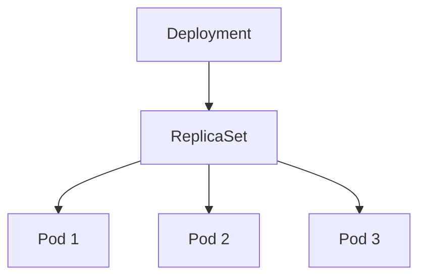

# ReplicaSet

ReplicaSet은 **"지정한 수의 동일 Pod이 항상 실행되도록 유지"** 하는 얇은
컨트롤러다. **직접 만드는 일은 거의 없다** — 대부분 Deployment가 내부적으로
찍어낸다. 그럼에도 이 리소스를 이해해야 하는 이유는 **Deployment의 사고가
결국 ReplicaSet 레이어에서 일어나기** 때문이다.

이 글은 ReplicaSet의 위치, Deployment와의 관계, pod-template-hash,
Pod adoption, scale-down 우선순위, 그리고 **Argo Rollouts가 ReplicaSet을
직접 다루는 이유**까지 다룬다.

> Deployment 전반: [Deployment](./deployment.md)
> Pod 자체의 라이프사이클: [Pod 라이프사이클](./pod-lifecycle.md)
> 컨트롤러 일반 원리·ownerReference·GC: [Reconciliation Loop](../architecture/reconciliation-loop.md)
> Canary·Blue/Green 구현 도구: `cicd/` 섹션

---

## 1. ReplicaSet의 위치



공식 문서가 직접 명시: *"you may never need to manipulate ReplicaSet
objects: use a Deployment instead."*

| 항목 | ReplicaSet | Deployment |
|---|:-:|:-:|
| 동일 Pod 수 유지 | O | O (RS 경유) |
| template 해시·버저닝 | X | O |
| Rolling update·rollback | X | O |
| revision history | X | O |
| HPA target (`/scale`) | O | O |

**원칙**: 롤아웃이 필요 없는 고정 Pod 집합이거나 Argo Rollouts 같은
**커스텀 오케스트레이션**이 필요할 때에만 RS를 직접 쓴다.

---

## 2. ReplicationController — 왜 대체됐나

ReplicationController(RC)는 **legacy**. 공식 문서: *"Superseded by the
Deployment and ReplicaSet APIs."*

| 항목 | ReplicationController | ReplicaSet (`apps/v1`) |
|---|---|---|
| selector | **equality-based만** | **set-based 지원**(`In`, `NotIn`, `Exists`, `DoesNotExist`) |
| API group | `v1` (core) | `apps/v1` |
| selector 변경 | 가능 | **불가(immutable)** |
| 권장 | 사용 금지 | Deployment 경유 |

set-based selector 예:

```yaml
selector:
  matchExpressions:
  - { key: tier, operator: In, values: [frontend, edge] }
```

신규에 RC 금지. 레거시 매니페스트는 Deployment로 마이그레이션.

---

## 3. ReplicaSet 스펙

직접 만들 일은 드물지만 구조는 한 번 봐 둔다.

```yaml
apiVersion: apps/v1
kind: ReplicaSet
metadata:
  name: frontend
  labels: { app: guestbook, tier: frontend }
spec:
  replicas: 3
  selector:
    matchLabels: { tier: frontend }
  template:
    metadata:
      labels: { tier: frontend }   # selector와 일치 필수
    spec:
      containers:
      - { name: app, image: registry.example.com/app:1.2.3 }
```

| 필드 | 제약 |
|---|---|
| `spec.selector` | **immutable**(`apps/v1`). 변경 시 재생성 필요 |
| `spec.template.metadata.labels` | selector와 반드시 일치. 불일치 시 API reject |
| `spec.replicas` | 음수 불가. `/scale` subresource로도 변경 |
| `metadata.name` | DNS subdomain. Pod 이름 접두사 |

---

## 4. pod-template-hash — Deployment의 핵심 트릭

Deployment가 새 `spec.template`을 받으면 **새 RS**를 만든다. 이때 같은
template이 여러 RS에 공존하지 않도록 충돌 방지를 거는 값이
`pod-template-hash`다.

| 항목 | 값 |
|---|---|
| 알고리즘 | **FNV-1a 32비트**(Go `hash/fnv` `New32a`) |
| 입력 | `spec.template` (PodTemplateSpec) |
| 충돌 처리 | Deployment `status.collisionCount` 를 입력에 섞어 재해싱 |
| 부착 위치 | RS `metadata.labels`, RS `spec.selector.matchLabels`, Pod 라벨 |

### 이중 selector 효과

- RS selector: `app=myapp` + `pod-template-hash=55d4b645f4`
- Pod 라벨: 동일
- **Deployment selector에는 hash 없음** → 모든 자식 RS의 Pod을 합쳐 "이
  Deployment의 replica"로 셈

덕분에 **같은 Deployment 안의 두 RS가 서로의 Pod을 adopt 하지 못한다.**

### 운영 주의

| 현상 | 원인 |
|---|---|
| RS **이름 접미사**와 Pod 라벨 hash가 다름 | 라벨이 정답. 이름 접미사에서 hash 파싱 금지(kubernetes/#55346) |
| 매니페스트 변화 없는데 hash 바뀜 | API server defaulting 차이. GitOps drift와 별개 |

**Argo Rollouts는 별도 라벨** `rollouts-pod-template-hash`를 사용해 Deployment
와 공존 시 adoption 충돌을 피한다(argo-rollouts/#219에서 표준 라벨 전환 논의).

---

## 5. Pod Adoption과 Orphan

RS는 **template으로 만든 Pod만 소유하지 않는다.** selector에 매치되는
**모든 Pod**을 소유 시도한다. 공식 문서: *"If there is a Pod that has no
OwnerReference ... and it matches a ReplicaSet's selector, it will be
immediately acquired."*

| 상황 | 결과 |
|---|---|
| 라벨만 맞는 bare Pod 선존재 | RS가 adopt → `replicas` 충족이면 신규 생성 생략 |
| RS 생성 후 같은 라벨 Pod 추가 | adopt 후 **즉시 terminate**(desired 초과) |
| Pod이 이미 다른 controller의 owner 보유 | adopt 시도 안 함 |

### ownerReference 형태

```yaml
metadata:
  ownerReferences:
  - apiVersion: apps/v1
    kind: ReplicaSet
    name: frontend
    uid: e129deca-...
    controller: true           # 정확히 하나의 관리자
    blockOwnerDeletion: true   # foreground cascading 정리 보장
```

**함정 — bare Pod 라벨 충돌**: 디버깅용 임시 Pod이 우연히 동일 라벨을 달면
기존 RS가 adopt 후 즉시 kill. 트러블슈팅 시간을 허비하는 전형적 함정.

---

## 6. Scale-Down 우선순위 — 누가 먼저 죽는가

`replicas`를 줄이면 RS 컨트롤러가 **어떤 Pod부터** 죽일지 결정한다.
공식 문서에 **순서**가 명시돼 있다.

| 순위 | 기준 | 의도 |
|:-:|---|---|
| 1 | **Pending / Unschedulable** Pod | 아직 자원 안 쓰는 Pod부터 |
| 2 | `controller.kubernetes.io/pod-deletion-cost` **낮은 값** | 사용자 선호 반영 |
| 3 | **같은 RS Pod이 더 많은 노드**의 Pod | node spread 유지 |
| 4 | **더 최근에 생성된** Pod | 오래 검증된 Pod 보존 (creation time은 **정수 log 버킷**으로 비교) |
| 5 | 랜덤 | tie-breaker |

### `pod-deletion-cost` annotation

```yaml
metadata:
  annotations:
    controller.kubernetes.io/pod-deletion-cost: "100"
```

- 범위 `[-2147483648, 2147483647]`, 기본 `0`, 낮을수록 먼저 삭제
- 정책: **best-effort** (보장 아님) — KEP-2255 `PodDeletionCost` GA
- **금기**: 메트릭 기반으로 **자주 갱신**하면 대량 Pod update 이벤트로
  API Server throttling 유발. HPA/KEDA의 축소 타겟 제어는 `scaleDown.policies`
  로 해결할 것

### log bucket 착시

"더 최근 Pod" 비교는 **정밀 timestamp가 아니라 log-scale bucket**이다.
동일 버킷이면 4단계 생략 후 랜덤. 수 초 차이에서는 실질 선호가 없어
관찰과 문서가 어긋나 보이는 원인(kubernetes/#111443).

---

## 7. Revision·Lifecycle·Cascade

Deployment rollout마다 **새 RS**가 생기고 **구 RS는 `replicas=0`으로 축소만**
된다. 삭제되지 않는 이 구 RS 보존이 **rollback의 근거**다.

- `revisionHistoryLimit`: 기본 10. `0`은 rollback 불가. 운영 권장 3~10
- `deployment.kubernetes.io/revision` annotation: 각 RS의 revision 번호.
  **수동 편집 금지** (Deployment 컨트롤러 단독 관리)
- 상세 rollout·rollback 동작은 [Deployment](./deployment.md) 참조

### Cascading Delete

| Propagation | 결과 |
|---|---|
| `Background` (**kubectl 기본**) | 부모 즉시 삭제, GC가 자식 비동기 정리 |
| `Foreground` | 자식 전부 정리 후 부모 삭제 |
| `Orphan` | 자식 `ownerReferences` 제거, **RS·Pod 그대로 남음** |

### Orphan RS가 생기는 경로

- `kubectl delete deploy/x --cascade=orphan` 명시 사용
- Deployment selector 불변 → orphan 후 재생성 workflow
- Helm/Kustomize 잘못된 hook (pre-delete에서 Deployment만 제거)

같은 selector + 같은 template hash의 새 Deployment 생성 시 orphan RS·Pod을
**adopt** (공식 동작). 라벨이 달라졌으면 수동 RS 삭제, 기본값 `background`
를 존중할 것.

---

## 8. 직접 ReplicaSet을 다루는 드문 사례

| 사용자 | 이유 |
|---|---|
| **Argo Rollouts** | Canary·Blue/Green·Traffic Shifting (Deployment로 표현 불가) |
| **Flagger**(간접) | RS 레벨 오케스트레이션 |
| 학습·디버깅 | pod-template-hash·adoption 동작 검증 |
| 내부 커스텀 컨트롤러 | 자체 업그레이드 로직 |

### Argo Rollouts가 RS를 직접 찍어내는 이유

Deployment rollout은 **"한 방향 선형"**(old scale down + new scale up)만
지원한다. Canary 가중치 단계(5→20→50→100%), pause·analysis·auto-rollback,
두 RS를 장시간 병존시키는 Blue/Green은 Deployment 컨트롤러 로직에 **아예
없다**.

Rollout 컨트롤러는 `spec.template` 기반으로 RS를 직접 생성하고,
`rollouts-pod-template-hash`로 버전을 식별하며, Service selector·Gateway API
·Istio VirtualService로 트래픽 분할, AnalysisRun으로 SLO 기반 자동 rollback
까지 수행한다. → 상세는 `cicd/` 섹션.

---

## 9. 최신 변경 (1.33~1.35)

| 변경 | KEP | 버전 | 영향 |
|---|---|---|---|
| `ReplicaSet.status.terminatingReplicas` | KEP-3973 | 1.33 Alpha → **1.35 Beta(기본 활성)** | 종료 중 Pod의 "진짜 개수" 가시화 |
| Pod `status.observedGeneration` | KEP-5067 | 1.33 Alpha · 1.34 Beta · **1.35 GA** | RS→Pod 동기화 관측 개선 |
| Native Sidecar | KEP-753 | 1.33 GA | RS가 관리하는 Pod template의 sidecar 종료 순서 보장 |
| In-place Pod Resize | KEP-1287 | **1.35 GA** | RS 자체 변화 없음. Pod 교체 없이 리소스 조정 가능 |

### `status.terminatingReplicas` (1.35 Beta)

```yaml
status:
  replicas: 10
  readyReplicas: 10
  availableReplicas: 10
  terminatingReplicas: 2    # 1.35 Beta, 기본 활성
```

- `preStop.sleep` + 긴 grace 중인 Pod은 `replicas`에서 빠지지만 자원·포트·
  볼륨을 계속 점유. 이전엔 API 수준에서 개수 관측 불가
- 피처 게이트: **`DeploymentReplicaSetTerminatingReplicas`** (API Server +
  kube-controller-manager, 1.35 Beta 기본 on)
- Deployment의 같은 필드와 합쳐 rollout 완료 판정 정확도 향상

---

## 10. 프로덕션 체크리스트

RS는 Deployment 뒤에 숨으므로 체크리스트도 **"RS 관점에서 착각하기 쉬운
것들"** 중심.

- [ ] 직접 만드는 것이 아니면 **Deployment로 감싸기**
- [ ] selector와 template.labels **정확히 일치**(immutable 주의)
- [ ] 디버깅용 bare Pod 라벨이 RS selector와 **겹치지 않는지**
- [ ] `kubectl delete`에 `--cascade=orphan`을 무의식적으로 붙이지 않기
- [ ] `pod-deletion-cost`는 **드물게만** 갱신 (API 부하 주의)
- [ ] `status.terminatingReplicas` 기반 rollout 판정 파이프라인(1.35+)
- [ ] Argo Rollouts 공존 시 두 해시 라벨 충돌 가능성 확인

---

## 11. 트러블슈팅

| 증상 | 근본 원인 | 진단·조치 |
|---|---|---|
| RS가 Pod을 **만들지 못함** | ResourceQuota, LimitRange, PSA, PVC, affinity | `describe rs` Events, `get events --field-selector reason=FailedCreate` |
| bare Pod 생성 즉시 종료 | RS가 selector 매치로 adopt 후 desired 초과 kill | bare Pod 라벨을 RS selector와 분리 |
| Deployment 삭제 후 **RS·Pod 잔존** | `--cascade=orphan` | RS 수동 삭제, 기본 `background` 복귀 |
| **Orphan RS**가 Pod 유지 | ownerReference 없어 GC 미대상. RS 자체 로직은 동작 | RS 수동 삭제 또는 새 Deployment로 adopt |
| 새 Deployment 후 **Pod 이름 접두사 동일** | orphan RS adopt 발생(selector + hash 일치) | 의도 확인, 아니면 라벨·selector 정리 |
| `status.replicas`가 실제와 **잠깐 어긋남** | level-triggered 재동기화 지연 | 즉시 수렴. 지속되면 controller-manager 로그 |
| 둘 이상 RS가 **같은 Pod 소유 시도** | 수동 RS에 hash 없이 생성 또는 label 충돌 | selector에 고유 라벨(hash) 부여 |
| rollout 성공인데 **old Pod 잔존** | 긴 `terminationGracePeriod` 또는 finalizer | `terminatingReplicas`(1.35+), Pod 라이프사이클 참조 |

### 자주 쓰는 명령

```bash
kubectl get rs -l app=myapp
kubectl describe rs <name>
kubectl get rs <name> -o jsonpath='{.spec.selector.matchLabels}'
kubectl get rs <name> -o jsonpath='{.status.terminatingReplicas}'   # 1.35+
kubectl get pod -l pod-template-hash=<hash>
kubectl get pod <name> -o jsonpath='{.metadata.ownerReferences}'

# scale subresource 직접 호출 (HPA가 쓰는 경로)
kubectl scale rs <name> --replicas=5
```

---

## 12. 이 카테고리의 경계

- **ReplicaSet 자체** → 이 글
- **Deployment(롤아웃·롤백·conditions)** → [Deployment](./deployment.md)
- **Pod 라이프사이클(probe·graceful·resize)** → [Pod 라이프사이클](./pod-lifecycle.md)
- **컨트롤러 일반 원리·ownerReference·GC** → [Reconciliation Loop](../architecture/reconciliation-loop.md)
- **Argo Rollouts·Flagger·Canary·Blue/Green** → `cicd/`
- **SLO 기반 자동 롤백** → `sre/`

---

## 참고 자료

- [Kubernetes — ReplicaSet](https://kubernetes.io/docs/concepts/workloads/controllers/replicaset/)
- [Kubernetes — ReplicationController (legacy)](https://kubernetes.io/docs/concepts/workloads/controllers/replicationcontroller/)
- [Kubernetes — Deployments](https://kubernetes.io/docs/concepts/workloads/controllers/deployment/)
- [Kubernetes — Use Cascading Deletion](https://kubernetes.io/docs/tasks/administer-cluster/use-cascading-deletion/)
- [KEP-2255 — Pod Deletion Cost](https://github.com/kubernetes/enhancements/tree/master/keps/sig-apps/2255-pod-cost)
- [KEP-3973 — Consider Terminating Pods in Deployment](https://github.com/kubernetes/enhancements/tree/master/keps/sig-apps/3973-consider-terminating-pods-deployment)
- [KEP-5067 — Pod Generation](https://github.com/kubernetes/enhancements/issues/5067)
- [KEP-753 — Sidecar Containers](https://github.com/kubernetes/enhancements/tree/master/keps/sig-node/753-sidecar-containers)
- [Argo Rollouts](https://argo-rollouts.readthedocs.io/en/stable/)
- [argo-rollouts/#219 — pod-template-hash 표준 라벨 전환 논의](https://github.com/argoproj/argo-rollouts/issues/219)
- [kubernetes/#111443 — Pod deletion order 동작 정정](https://github.com/kubernetes/kubernetes/issues/111443)
- [kubernetes/#55346 — RS 이름과 hash 라벨 불일치](https://github.com/kubernetes/kubernetes/issues/55346)
- [Kubernetes v1.35 Release Blog](https://kubernetes.io/blog/2025/12/17/kubernetes-v1-35-release/)
- [How Kubernetes picks which pods to delete — R. Padovani](https://rpadovani.com/k8s-algorithm-pick-pod-scale-in)

(최종 확인: 2026-04-21)
