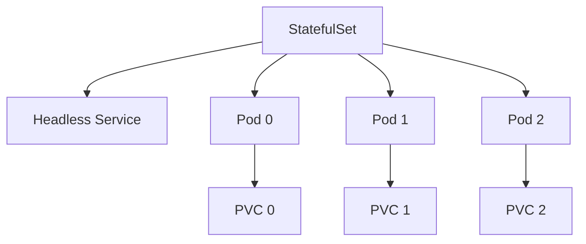

# StatefulSet

StatefulSet은 **stable 식별자·ordered lifecycle·per-Pod 스토리지**가 필요한
워크로드를 위한 컨트롤러다. Deployment가 "replicas가 서로 교환 가능하다"는
가정 위에 서는 반면, StatefulSet은 **각 Pod이 고유한 정체성**을 갖는다는
전제로 설계됐다.

이 글은 정체성 보장(이름·PVC·네트워크), 업데이트 전략, 스케일 동작,
**PVC Retention Policy(1.32 GA)**, **Start Ordinal(1.31 GA)**,
**maxUnavailable(1.35 Beta)**, 그리고 실제 Operator 사용이 왜 거의 필수인지
까지 다룬다.

> Pod 자체의 라이프사이클: [Pod 라이프사이클](./pod-lifecycle.md)
> Deployment와의 차이: [Deployment](./deployment.md)
> 스토리지(PV/PVC/CSI): `kubernetes/storage/` 섹션
> 분산 DB·메시징 Operator: `kubernetes/operator/`

---

## 1. StatefulSet의 위치



| 항목 | Deployment | StatefulSet |
|---|---|---|
| Pod 이름 | 랜덤 hash | **ordinal 기반**(`app-0`, `app-1`) |
| 네트워크 ID | 일회성 | **stable DNS**(`app-0.svc...`) |
| 스토리지 | 공유·선택 | **Pod별 PVC**(자동 생성) |
| 시작 순서 | 병렬 | **ordered**(기본) |
| 업데이트 순서 | RS 교체 | **역순**(N-1 → 0) |
| 용도 | stateless HTTP | DB·분산 시스템·leader election |

**핵심**: StatefulSet은 "ordinal 0번은 언제나 동일한 PVC에 붙는다"를 보장.
이 정체성이 DB·Kafka·Cassandra 운영의 최소 전제다.

---

## 2. 필수 전제 — Headless Service

```yaml
apiVersion: v1
kind: Service
metadata:
  name: db
spec:
  clusterIP: None          # headless
  selector:
    app: db
  ports:
  - port: 5432
```

- `clusterIP: None`으로 **수동 생성 필수** — StatefulSet이 자동 생성하지 않음
- DNS: `<pod>-<ordinal>.<service>.<ns>.svc.cluster.local`
- SRV 레코드로 **peer discovery** — gossip 기반 시스템(Cassandra·Kafka)의
  클러스터 형성 기반

**프로덕션 함정**: `serviceName` 오타 또는 Headless Service 누락 → Pod은
뜨지만 DNS 해석 실패 → 클러스터 분열. StatefulSet 생성 전 Service를
**먼저** 만들어 두는 것이 원칙.

추가로 Pod에는 **`apps.kubernetes.io/pod-index`** 라벨이 자동 부여(**1.31 GA**,
`PodIndexLabel` 피처 게이트 lock) — Service·NetworkPolicy selector에 활용 가능.

### `publishNotReadyAddresses` — 부트스트랩 필수 설정

```yaml
apiVersion: v1
kind: Service
metadata:
  name: cassandra
spec:
  clusterIP: None
  publishNotReadyAddresses: true    # ← 부트스트랩 peer discovery
  selector:
    app: cassandra
```

Cassandra·Kafka·Elasticsearch처럼 **Ready 되기 전에도 peer DNS가 필요한**
시스템은 이 값이 `true`여야 클러스터 형성 가능. 기본값 `false` 상태로 두면
부트스트랩 단계에서 peer 해석 실패 → 고전적 함정.

---

## 3. volumeClaimTemplates — Pod별 PVC

```yaml
spec:
  volumeClaimTemplates:
  - metadata:
      name: data
    spec:
      accessModes: ["ReadWriteOnce"]
      storageClassName: fast-ssd
      resources:
        requests: { storage: 100Gi }
```

- Pod별 PVC 자동 생성: **`<template>-<sts>-<ordinal>`**
  (예: `data-db-0`)
- Pod 재생성·노드 이동에도 **같은 PVC가 재사용**
- **immutable** — `volumeClaimTemplates` 변경 시 컨트롤러 거부

### 용량 확장 절차

```
1. StorageClass가 allowVolumeExpansion: true 인지 확인
2. 각 PVC를 개별 patch (resources.requests.storage 상향)
3. Pod 재기동 (online expansion 미지원 FS는 필수)
4. volumeClaimTemplates도 미래 재생성 대비 맞춰 업데이트
```

**`kubectl delete sts --cascade=orphan` 후 재생성으로 template을 맞추는
우회책**은 프로덕션 DB에서 **극도로 위험**하다:

- selector·라벨·revision 히스토리 초기화 → GitOps·Operator와 충돌
- 라벨 불일치 시 새 sts가 기존 Pod을 **adopt하지 못하는 엣지 케이스** 존재
- 반드시 **선행 백업 + 스테이징 검증** 후에만 수행. Operator 환경이면
  Operator API(예: CloudNativePG `cnpg-plugin`)로 처리

**KEP-4650 `VolumeClaimTemplate` 업데이트(1.35 Alpha)**로 컨트롤러 레벨
지원이 시작됐다. 피처 게이트 필요, 기본 비활성 → 프로덕션 부적합. GA까지
기다리거나 Operator 경로를 사용.

---

## 4. podManagementPolicy와 업데이트 전략

### podManagementPolicy

| 값 | 생성 순서 | 종료 순서 | 용도 |
|---|---|---|---|
| `OrderedReady` (기본) | 0 → N-1 (**이전 Ready 대기**) | N-1 → 0 | 엄격한 순서 필요 DB |
| `Parallel` | 동시 생성 | 동시 종료 | Kafka·Cassandra 대형 클러스터 |

> **업데이트 시에는 둘 다 역순** (N-1 → 0). 단 `Parallel`은 `maxUnavailable`
> 허용치만큼 병렬 업데이트 가능.

### updateStrategy

```yaml
spec:
  updateStrategy:
    type: RollingUpdate
    rollingUpdate:
      partition: 0           # 이 index 이상만 업데이트
      maxUnavailable: 1      # 1.35 Beta, 기본 활성
```

| type | 동작 | 용도 |
|---|---|---|
| `RollingUpdate` (기본) | 컨트롤러가 역순 업데이트 | 일반 |
| `OnDelete` | **수동 삭제 시에만** 재생성 | DB 승격·검증 수동 제어 |

### partition — staged 업데이트

- `partition=N`이면 **ordinal >= N만** 새 template 적용
- `partition=replicas-1`로 **단일 Pod 카나리** 가능
- 검증 통과 → partition 감소로 점진 확대

### maxUnavailable (KEP-961, **1.35 Beta 기본 활성**)

- 1.24 Alpha → **1.35 Beta(기본값 1)**
- `Parallel` 정책과 조합 시 효과 최대
- **`OrderedReady`에서는 스케일업 완료 이후에만 적용** — Beta까지 남은 제약

### minReadySeconds (1.25 GA)

Deployment와 동일. Ready 직후 불안정한 Pod이 업데이트 진행 기준에 잡히지
않도록 대기 시간.

---

## 5. Start Ordinal (KEP-3335, **1.31 GA**)

```yaml
spec:
  ordinals:
    start: 5                 # Pod 범위는 [5, 5+replicas-1]
```

### 무중단 이관의 정석

Kafka·Elasticsearch처럼 **"at most one"** 를 유지해야 하는 이관에서:

1. 소스 클러스터 `replicas` 감소 (예: 10 → 7)
2. 목적지 클러스터 `ordinals.start=7`, `replicas=3`로 시작
3. 데이터 rebalance 대기
4. 반복으로 전체 이관

**데이터 안전성 함정**:
- `start` 변경 시 기존 ordinal의 PVC는 **orphan** — sts가 더 이상 인식하지
  않지만 **데이터는 남아 있다**. 백업 전 sts 삭제 금지
- `whenScaled: Delete`와 `ordinals.start` 증가를 **조합하면 스케일 다운으로
  해석되어 데이터 소실 위험**
- 이관 시작 전 PVC 스냅샷 + DR 플랜 필수

---

## 6. PVC Retention Policy (KEP-1847, **1.32 GA**)

```yaml
spec:
  persistentVolumeClaimRetentionPolicy:
    whenDeleted: Retain      # StatefulSet 삭제 시
    whenScaled: Retain       # 스케일 다운 시
```

| 필드 | 값 | 의미 |
|---|---|---|
| `whenDeleted` | `Retain`(기본) | sts 삭제해도 PVC 유지 |
|  | `Delete` | sts 삭제 시 PVC도 삭제 |
| `whenScaled` | `Retain`(기본) | 스케일 다운 PVC 유지 |
|  | `Delete` | 스케일 다운 시 해당 PVC 삭제 |

### 원칙

- **DB 운영은 반드시 `Retain` 유지**
- `Delete` 설정은 **StorageClass `reclaimPolicy`와 결합**되어 실제 PV·볼륨도
  함께 삭제됨. 운영 실수 → 영구 데이터 손실
- 캐시·임시 분산 시스템처럼 **ephemeral 성격이 명확한 경우에만** `Delete`
  검토

---

## 7. Scaling 동작

| 시나리오 | 동작 |
|---|---|
| Scale up (OrderedReady) | 0 → N-1, **이전 Ready 필수** |
| Scale up (Parallel) | 동시 생성 |
| Scale down (모든 정책) | N-1 → 0 역순 종료 |
| `replicas=0` | 모든 Pod 종료, **PVC 유지** (일시 정지) |
| 재-scale up | 같은 ordinal Pod이 **같은 PVC 재사용** |

**성능 주의**: `OrderedReady` + 30개 노드 = 직렬 30회 기동. Kafka 같은
대형 클러스터에서는 롤아웃이 수십 분 소요. **`Parallel` + `maxUnavailable`**
조합으로 현실적 배포 시간 확보.

---

## 8. 최신 변경 (1.33~1.35)

| 변경 | KEP | 버전 | 영향 |
|---|---|---|---|
| `maxUnavailable` Beta 기본 활성 | KEP-961 | **1.35 Beta** | Parallel 업데이트 속도 개선 |
| **VolumeClaimTemplate 업데이트** | KEP-4650 | **1.35 Alpha** | sts 재생성 없이 용량 변경 (프로덕션 부적합, GA 대기) |
| In-place Pod Resize GA | KEP-1287 | **1.35 GA** | DB **무중단 vertical scale** 가능 |
| Native Sidecar (Pod template) | KEP-753 | 1.33 GA | DB의 로그 shipper·backup agent 안정화 |
| PVC Retention Policy GA | KEP-1847 | 1.32 GA (1.35 기준 완전 안정) | 삭제·스케일 다운 PVC 운명 제어 |
| Start Ordinal GA | KEP-3335 | 1.31 GA (안정) | 클러스터 이관 |
| Pod Index 라벨 | — | 1.31 GA | `apps.kubernetes.io/pod-index` selector 가능 |

### In-place Pod Resize의 실전 의미

PostgreSQL `shared_buffers` 증설, JVM heap 확대 등 **메모리 긴밀 워크로드**를
Pod 재기동 없이 처리. 단 Guaranteed QoS + Linux 등 제약은
[Pod 라이프사이클](./pod-lifecycle.md) 참조.

```yaml
spec:
  template:
    spec:
      containers:
      - name: db
        resizePolicy:
        - resourceName: cpu
          restartPolicy: NotRequired       # 무중단
        - resourceName: memory
          restartPolicy: RestartContainer  # 메모리는 재시작
```

---

## 9. StatefulSet만으로 부족한 이유

StatefulSet은 **저수준 primitive**다. 아래는 StatefulSet이 **하지 않는** 것:

| 필요 기능 | StatefulSet 제공? | 해결 |
|---|:-:|---|
| PVC 용량 자동 확장 | ❌ | Operator 또는 수동 procedure |
| Leader election | ❌ | 앱 또는 Operator |
| 초기 데이터 복제·부트스트랩 | ❌ | init 컨테이너 + Operator |
| 버전 업그레이드 오케스트레이션 | ❌ | Operator |
| 백업·PITR | ❌ | Operator (CloudNativePG 등) |
| Failover·리더 승격 | ❌ | Operator |

**프로덕션 DB는 Operator가 사실상 필수**:

| 워크로드 | 권장 Operator |
|---|---|
| PostgreSQL | CloudNativePG, Zalando, Percona |
| MySQL | Percona, MySQL Operator |
| Kafka | Strimzi(KRaft 지원) |
| Cassandra | K8ssandra |
| Elasticsearch | ECK |
| MongoDB | Community/Enterprise Operator |
| Redis | Redis Operator |

→ 상세는 `kubernetes/operator/` 섹션에서 다룬다.

---

## 10. 프로덕션 체크리스트

- [ ] Headless Service (`clusterIP: None`) **먼저** 생성
- [ ] `serviceName` 정확 — DNS 해석 실패가 가장 흔한 초기 버그
- [ ] 부트스트랩 peer discovery 필요 시 Service `publishNotReadyAddresses: true`
- [ ] `podManagementPolicy` 선택 — DB는 OrderedReady, 분산 클러스터는 Parallel
- [ ] `updateStrategy.type`: DB는 `OnDelete` 검토, 일반은 `RollingUpdate`
- [ ] `maxUnavailable` 설정 (1.35+) — Parallel과 조합으로 속도 확보
- [ ] **`persistentVolumeClaimRetentionPolicy`**: DB는 반드시 `Retain` 유지
- [ ] StorageClass **`allowVolumeExpansion: true`** — 확장 여지 확보
- [ ] PDB 설정 — 최소 quorum 보장
- [ ] `topologySpreadConstraints` — 존·랙 분산 (quorum 안정성)
- [ ] Native Sidecar 고려 — 백업 agent·exporter의 종료 순서 제어
- [ ] In-place Resize 가능 QoS(Guaranteed)로 설계
- [ ] **Operator 사용 검토** — 프로덕션 DB는 거의 필수

---

## 11. 트러블슈팅

| 증상 | 근본 원인 | 진단·조치 |
|---|---|---|
| Pod 0번 Pending, 이후 ordinal 시작 안 됨 | OrderedReady 제약, 0번 Ready 실패 | 0번 Pod 로그·PVC 바인딩 확인, 필요 시 `Parallel` 전환 검토 |
| 잘못된 template 롤아웃 후 **revert해도 복구 안 됨** | 깨진 Pod이 Ready 안 되면 롤아웃 멈춤 | 깨진 Pod **수동 삭제** → 컨트롤러가 revert된 template로 재생성 |
| Pod DNS 해석 실패 | Headless Service 누락, `serviceName` 오타 | Service 생성·`sts.spec.serviceName` 재확인 |
| PVC 안 커짐 | StorageClass `allowVolumeExpansion: false` 또는 CSI 미지원 | 드라이버 기능 확인, Pod 재기동 |
| 클러스터 이관 후 **PVC orphan** | Start Ordinal 변경 시 기존 PVC 미처리 | 이관 전 PVC 복사·재맵핑 |
| scale-down 시 데이터 **영구 손실** | `whenScaled: Delete` 오설정 | `Retain`으로 변경, 운영 프로세스 점검 |
| 대형 클러스터 롤아웃 수십 분 | `OrderedReady`의 직렬 기동 | `Parallel` + `maxUnavailable` 조합 |
| PDB로 롤아웃·drain 교착 | PDB `minAvailable`과 `maxUnavailable` 수학적 불일치 (예: replicas=3, minAvailable=3, maxUnavailable=1) | `describe pdb` 값 점검 후 재조정 |
| 부트스트랩 시 peer 해석 실패 | `publishNotReadyAddresses` 누락 | Service에 `true`로 설정 |
| Pod 이름 변경 요구 | StatefulSet은 ordinal 기반 불변 | 이름 규약을 앱 설정에 쓰지 말 것 |
| 삭제했는데 PVC 남음 | `whenDeleted: Retain`(기본) | 의도라면 OK, 아니면 수동 정리 |

### 자주 쓰는 명령

```bash
kubectl get sts -o wide
kubectl rollout status sts/db --timeout=20m
kubectl rollout history sts/db
kubectl rollout undo sts/db --to-revision=N
kubectl scale sts/db --replicas=0           # 일시 정지 (PVC 유지)
kubectl get pvc -l app=db                   # PVC 매핑 확인
kubectl get endpoints <headless-svc>        # peer discovery 상태
```

---

## 12. 이 카테고리의 경계

- **StatefulSet 리소스 자체** → 이 글
- **PVC·StorageClass·CSI 상세** → `kubernetes/storage/`
- **분산 DB Operator 패턴** → `kubernetes/operator/`
- **DB 자체의 튜닝·백업·PITR** → 위키 범위 밖(각 DB 공식 문서)
- **Pod probe·graceful·resize 전반** → [Pod 라이프사이클](./pod-lifecycle.md)

---

## 참고 자료

- [Kubernetes — StatefulSets](https://kubernetes.io/docs/concepts/workloads/controllers/statefulset/)
- [StatefulSet Basics Tutorial](https://kubernetes.io/docs/tutorials/stateful-application/basic-stateful-set/)
- [KEP-961 — MaxUnavailable for StatefulSet](https://github.com/kubernetes/enhancements/tree/master/keps/sig-apps/961-maxunavailable-for-statefulset)
- [KEP-1847 — StatefulSet PVC Retention](https://github.com/kubernetes/enhancements/tree/master/keps/sig-apps/1847-autoremove-statefulset-pvcs)
- [KEP-3335 — StatefulSet Start Ordinal](https://github.com/kubernetes/enhancements/tree/master/keps/sig-apps/3335-statefulset-slice)
- [KEP-4650 — StatefulSet VolumeClaimTemplate 업데이트](https://github.com/kubernetes/enhancements/issues/4650)
- [KEP-2599 — minReadySeconds for StatefulSets](https://github.com/kubernetes/enhancements/tree/master/keps/sig-apps/2599-minreadyseconds-for-statefulsets)
- [KEP-1287 — In-place Pod Resize](https://github.com/kubernetes/enhancements/tree/master/keps/sig-node/1287-in-place-update-pod-resources)
- [Kubernetes v1.35 Release Blog](https://kubernetes.io/blog/2025/12/17/kubernetes-v1-35-release/)
- [CloudNativePG](https://cloudnative-pg.io/)
- [Strimzi (Kafka Operator)](https://strimzi.io/)
- [K8ssandra (Cassandra Operator)](https://k8ssandra.io/)
- [Production Kubernetes — Josh Rosso](https://www.oreilly.com/library/view/production-kubernetes/9781492092292/)

(최종 확인: 2026-04-21)
