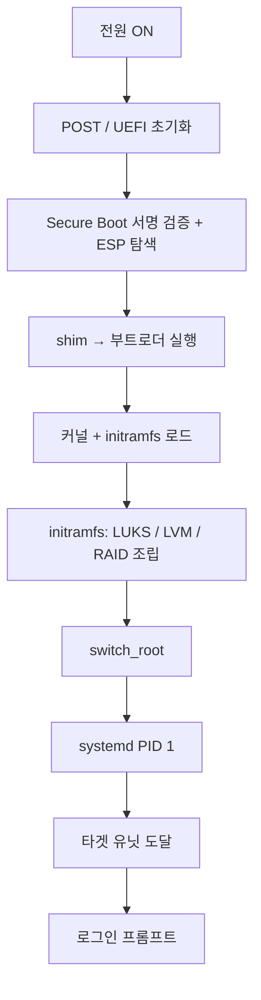
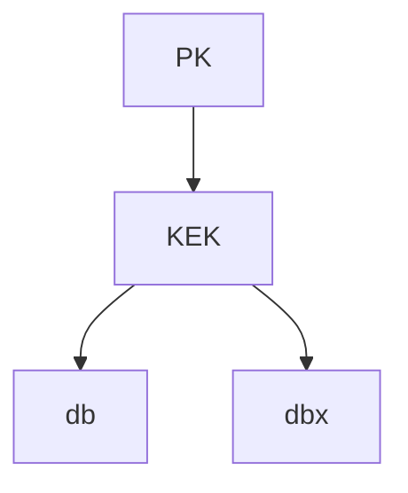
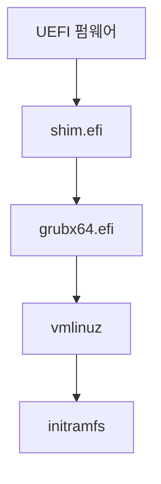
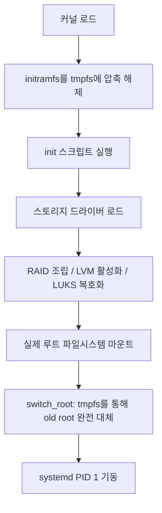
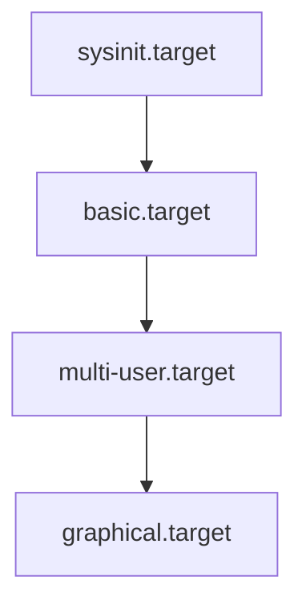
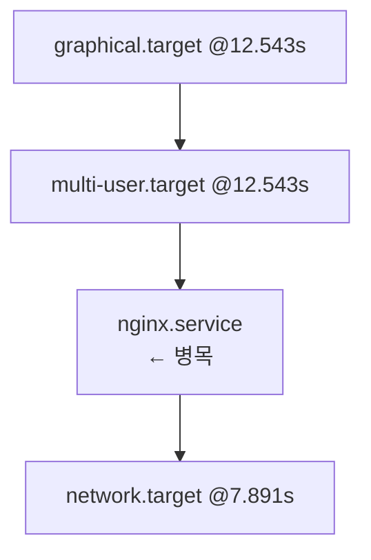

# 부팅 프로세스 (BIOS/UEFI → GRUB → systemd)

전원 버튼에서 로그인 프롬프트까지, 각 단계를 이해하면
부팅 실패 시 어느 지점에서 멈췄는지 즉시 판단할 수 있다.

## 전체 흐름



---

## BIOS → UEFI

### BIOS의 한계

| 항목 | BIOS | UEFI |
|------|------|------|
| 파티션 테이블 | MBR (최대 2.2TB) | GPT (최대 9.4ZB) |
| 실행 환경 | 16-bit real mode | 32/64-bit Protected mode |
| 보안 | 없음 | Secure Boot, TPM 연동 |
| 드라이버 | 없음 | 네트워크 스택, 셸 내장 |
| 부팅 시간 | 느린 순차 POST | Fast Boot (병렬 탐지) |

### UEFI 핵심 구조

**EFI System Partition (ESP)**:
- FAT32 포맷, 권장 크기 512MB~1GB
- 마운트 포인트: `/boot/efi` (GRUB2) 또는 `/efi`, `/boot` (systemd-boot)
- Fallback 경로: `EFI/BOOT/BOOTX64.EFI` (x86_64)

```bash
# ESP 확인
lsblk -o NAME,FSTYPE,MOUNTPOINT
fdisk -l | grep "EFI System"
```

### Secure Boot 키 계층



| 키 | 역할 |
|----|------|
| PK | OEM 루트 신뢰의 기반 |
| KEK | db/dbx 변경 권한 부여 |
| db | SHA-256 해시 또는 X.509 인증서 허용 목록 |
| dbx | 부팅 시 가장 먼저 파싱, 매칭 시 차단 |

부팅 순서: UEFI가 `dbx`를 먼저 검사 → 해당 없으면 `db` 검사 →
서명 일치 시 실행 허가.

**CVE-2024-7344 (2025-01 공개)**: 일부 복구 소프트웨어(Howyar 등) UEFI 앱이
표준 `LoadImage`/`StartImage` API 대신 자체 PE 로더를 사용하여
서명 검증을 우회, `cloak.dat`에서 임의의 비서명 UEFI 바이너리를 실행.
2025-01-14 Microsoft Patch Tuesday에서 해당 바이너리가 dbx에 등록되어 차단됐다.

> **2026년 6월 만료 예정**: 2011년 발급된 Microsoft Secure Boot 인증서가
> 2026-06 만료. 신규 2023 인증서로 전환 확인 필요
> (Windows Update 또는 펌웨어 업데이트로 자동 배포).

### TPM 2.0과 Measured Boot

TPM이 부팅 체인의 각 단계를 측정(해시)하여
PCR(Platform Configuration Register)에 누적 기록한다.
값이 예상과 다르면 비밀 키(LUKS 키 등) 봉인 해제 거부.

| PCR | 측정 대상 |
|-----|---------|
| PCR 0 | UEFI 펌웨어 코드 |
| PCR 4 | 부트로더, 파티션 |
| PCR 7 | Secure Boot 상태, PK/KEK/db/dbx |
| PCR 11 | UKI PE 섹션 (systemd-stub 측정) |
| PCR 12 | 커널 커맨드라인 |
| PCR 15 | 머신 ID, LUKS 볼륨 키 |

---

## GRUB 2

### 버전 현황 (2026)

| 배포판 | GRUB 버전 |
|--------|----------|
| GRUB 업스트림 | **2.14** |
| Ubuntu 26.04 | 2.14 (2026-02 채택) |
| Fedora 44 (2026-04) | 2.12 |

### 파일 구조

```
/etc/default/grub          ← 사용자 설정
/etc/grub.d/               ← 생성 스크립트
/boot/grub/grub.cfg        ← 최종 설정 (직접 수정 금지)
```

```bash
# grub.cfg 재생성
grub-mkconfig -o /boot/grub/grub.cfg   # 범용
update-grub                            # Debian/Ubuntu 별칭
grub2-mkconfig -o /boot/grub2/grub.cfg # RHEL/Fedora
```

### /etc/default/grub 핵심 옵션

```bash
GRUB_TIMEOUT=5
GRUB_CMDLINE_LINUX_DEFAULT="quiet splash"  # 기본 파라미터
GRUB_CMDLINE_LINUX=""                      # 복구 포함 전체 적용
GRUB_DISABLE_RECOVERY="true"              # 복구 메뉴 숨김
```

### 주요 커널 파라미터

| 파라미터 | 용도 |
|---------|------|
| `quiet` | 커널 메시지 억제 |
| `rd.break` | initramfs 쉘 진입 (복구) |
| `systemd.unit=rescue.target` | rescue 모드 부팅 |
| `systemd.unit=emergency.target` | emergency 모드 부팅 |
| `nomodeset` | GPU 드라이버 비활성화 |
| `init=/bin/bash` | init 대신 bash 직접 실행 |

### Secure Boot 환경의 GRUB 체인



커스텀 커널을 Secure Boot 환경에서 사용하려면
**MOK (Machine Owner Key)**로 직접 서명해야 한다:

```bash
# MOK 키 생성 및 등록
openssl req -new -x509 -newkey rsa:4096 \
  -keyout MOK.key -out MOK.crt \
  -days 3650 -nodes -subj "/CN=MOK/"

mokutil --import MOK.crt  # 다음 부팅 시 UEFI 화면에서 승인
```

### systemd-boot 비교

| 항목 | GRUB 2 | systemd-boot |
|------|--------|--------------|
| 설정 형식 | 스크립트 | 단순 텍스트 |
| Secure Boot | shim 필요 | shim 필요 |
| LUKS/LVM | 부트로더가 직접 처리 | initramfs가 처리 (TPM2 자동 해제 가능) |
| 테마/메뉴 | 풍부 | 단순 |
| 적합 환경 | 복잡한 스토리지 구성 | UEFI 전용 단순 환경 |
| ESP 위치 | `/boot/efi` | `/boot` (권장) |

---

## initramfs — 임시 루트 파일시스템

### 역할



### 생성 도구 비교

| 도구 | 기본 배포판 | 특징 |
|------|------------|------|
| **dracut** | RHEL, Fedora, OpenSUSE | 배포판 무관, 자동 탐지, 모듈 시스템 |
| **mkinitramfs** | Debian, Ubuntu | 스크립트 기반, hooks 시스템 |
| **mkinitcpio** | Arch Linux | HOOKS 배열 명시 필요 |

```bash
# dracut — initramfs 재생성
dracut --force                     # 현재 커널
dracut --force /boot/initramfs.img $(uname -r)

# mkinitramfs (Debian/Ubuntu)
update-initramfs -u                # 현재 커널 업데이트
update-initramfs -u -k all         # 모든 커널

# mkinitcpio (Arch)
mkinitcpio -P                      # 모든 preset
```

---

## systemd — PID 1

커널이 `/sbin/init`(→ `/lib/systemd/systemd` 심링크)를 실행.
이 순간부터 모든 프로세스의 부모가 된다.

### 버전 현황 (2026)

| 버전 | 릴리즈 | 주요 변경 |
|------|--------|---------|
| **258** | 2025-09 | **cgroup v1 완전 제거**, 커널 베이스라인 5.4+ |
| 257 | 2024-12 | MPTCP 소켓 유닛, UKI `.profile` 섹션 |
| 256 | 2024-07 | `PrivateUsers=managed`, 동적 UID |

> **systemd 258 중요**: cgroup v1 지원이 완전히 제거됐다.
> v257에서 임시로 제공되던 커널 커맨드라인 파라미터
> `SYSTEMD_CGROUP_ENABLE_LEGACY_FORCE=1`도 v258부터 무효화됐다.
> 커널 베이스라인은 5.4+.

### 부팅 타겟 의존성 체인



| 타겟 | 역할 |
|------|------|
| sysinit.target | 파일시스템 마운트, swap, 커널 파라미터 |
| basic.target | 소켓, 타이머, 경로 유닛 |
| multi-user.target | 네트워크, 백그라운드 서비스 |
| graphical.target | 디스플레이 매니저 (선택) |

```bash
# 기본 타겟 변경
systemctl set-default multi-user.target
systemctl set-default graphical.target

# 현재 세션에서 타겟 전환
systemctl isolate rescue.target
```

### 부팅 시간 분석

```bash
systemd-analyze                    # 총 부팅 시간
systemd-analyze blame              # 서비스별 시간 (내림차순)
systemd-analyze critical-chain     # 크리티컬 패스 (병목 파악)
systemd-analyze plot > boot.svg    # SVG 타임라인
```



---

## UKI — Unified Kernel Image

커널 + initrd + cmdline을 **단일 EFI 실행파일**로 통합.
UEFI가 직접 PE/COFF 바이너리로 실행한다.

### 기존 방식 vs UKI

| 항목 | 기존 (GRUB + 별도 파일) | UKI |
|------|----------------------|-----|
| 서명 범위 | 커널만 | 커널 + initrd + cmdline 전체 |
| Secure Boot | 복잡한 shim 체인 | `shim → UKI` 단순화 가능 |
| cmdline 위변조 | 가능 (GRUB에서 편집) | 불가 (서명 내 고정) |
| TPM 측정 | PCR 4, 7 | PCR 11 (systemd-stub) |

### PE 섹션 구조

| 섹션 | 내용 |
|------|------|
| `.linux` | Linux 커널 이미지 |
| `.initrd` | initramfs |
| `.cmdline` | 커널 커맨드라인 |
| `.osrel` | /etc/os-release 정보 |
| `.ucode` | 마이크로코드 initrd |
| `.pcrsig` / `.pcrpkey` | TPM PCR 서명/키 |

### ukify로 UKI 생성

```bash
# systemd 패키지에 포함
ukify build \
  --linux=/boot/vmlinuz \
  --initrd=/boot/initramfs.img \
  --cmdline="quiet splash" \
  --output=/boot/efi/EFI/Linux/linux.efi

# Secure Boot 서명 포함
ukify build \
  --linux=/boot/vmlinuz \
  --initrd=/boot/initramfs.img \
  --secureboot-private-key=db.key \
  --secureboot-certificate=db.crt \
  --output=/boot/efi/EFI/Linux/linux.efi
```

### 배포판 채택 현황 (2026)

| 배포판 | 상태 |
|--------|------|
| Fedora | 38+에서 opt-in, aarch64 지원 (40+), 기본값 아님 |
| RHEL 9+ | ukify 도구 포함, UKI addon 지원 |
| Arch Linux | mkinitcpio + UKI 지원, pacman hook 통합 가능 |
| Ubuntu | 공식 기본화 미결정 |

---

## 컨테이너·클라우드 환경

### 컨테이너 vs VM vs Bare-metal

| 항목 | 컨테이너 | VM | Bare-metal |
|------|---------|-----|-----------|
| 커널 부팅 | 없음 (호스트 커널 공유) | 있음 (OVMF UEFI) | 있음 |
| PID 1 | 앱 직접 또는 init | systemd (게스트) | systemd |
| 부팅 시간 | 밀리초 | 초~십초 | 십초~수십초 |

### cloud-init 부팅 순서 (cloud-init 26.1)

| 단계 | systemd 서비스 | 역할 |
|------|--------------|------|
| Detect | `ds-identify` | 플랫폼 탐지 |
| Local | `cloud-init-local.service` | 네트워크 설정 (네트워크 초기화 전) |
| Network | `cloud-init-network.service` | 유저 데이터 처리, 디스크 설정 |
| Config | `cloud-config.service` | 설정 모듈 실행 |
| Final | `cloud-final.service` | 패키지 설치, 유저 스크립트 |

```bash
# cloud-init 완료 대기
cloud-init status --wait

# cloud-init 로그 확인
journalctl -u cloud-init -u cloud-init-local
```

---

## 트러블슈팅

### 부팅 실패 시나리오별 대응

| 증상 | 위치 | 대응 |
|------|------|------|
| POST 멈춤 | UEFI | 하드웨어 점검, UEFI 설정 초기화 |
| `GRUB rescue>` 프롬프트 | GRUB | 아래 GRUB rescue 복구 참조 |
| `Kernel panic` | 커널 | initramfs 문제, 이전 커널로 부팅 |
| systemd 멈춤 | systemd | `systemd.unit=emergency.target` 추가 |
| 루트 마운트 실패 | initramfs | `rd.break`로 initramfs 쉘 진입 |

### rd.break — initramfs 쉘 진입

```bash
# GRUB 메뉴에서 'e' → linux 줄 끝에 추가
rd.break

# initramfs 쉘에서 SELinux 레이블 재설정 + chroot
mount -o remount,rw /sysroot
chroot /sysroot

# SELinux 환경에서 passwd 변경 후 재레이블 강제
touch /.autorelabel
exit; exit
```

### GRUB rescue 쉘 복구

```bash
# 파티션 탐색
grub rescue> ls
grub rescue> ls (hd0,gpt2)/boot/grub/

# 정상 부팅
grub rescue> set prefix=(hd0,gpt2)/boot/grub
grub rescue> set root=(hd0,gpt2)
grub rescue> insmod normal
grub rescue> normal

# 부팅 후 GRUB 재설치
# BIOS/MBR 환경
grub-install /dev/sda
grub-mkconfig -o /boot/grub/grub.cfg

# UEFI 환경
grub-install --target=x86_64-efi \
  --efi-directory=/boot/efi \
  --bootloader-id=GRUB
grub-mkconfig -o /boot/grub/grub.cfg
```

### GRUB에서 임시 커널 파라미터 변경

GRUB 메뉴에서 `e` → `linux` 줄 수정 → `Ctrl+X`로 부팅.
영구 적용은 `/etc/default/grub` 수정 후 `update-grub`이 필요하다.

### emergency.target vs rescue.target

| 항목 | emergency.target | rescue.target |
|------|----------------|--------------|
| 파일시스템 마운트 | 루트 read-only | 로컬 파일시스템 read-write |
| 네트워크 | 없음 | 없음 |
| 서비스 | 최소 | 일부 기본 서비스 |
| 사용 시기 | fsck 실패, 심각한 오류 | 관리 작업 |

### journalctl 부팅 로그 분석

```bash
journalctl -b              # 현재 부팅 로그
journalctl -b -1           # 이전 부팅 로그
journalctl -b -p err       # 현재 부팅 에러만
journalctl -b -u nginx     # 특정 유닛
journalctl --list-boots    # 전체 부팅 목록
```

---

## 참고 자료

- [GRUB 2 Manual 2.14](https://www.gnu.org/software/grub/manual/grub/)
  (확인: 2026-04-16)
- [systemd 258 릴리즈 — cgroup v1 제거](https://linuxiac.com/systemd-258-drops-cgroup-v1-raises-kernel-baseline-to-5-4/)
  (확인: 2026-04-16)
- [Unified Kernel Image 스펙 — UAPI Group](https://uapi-group.org/specifications/specs/unified_kernel_image/)
  (확인: 2026-04-16)
- [TPM2 PCR Measurements — systemd.io](https://systemd.io/TPM2_PCR_MEASUREMENTS/)
  (확인: 2026-04-16)
- [cloud-init 26.1 Boot Stages](https://docs.cloud-init.io/en/latest/explanation/boot.html)
  (확인: 2026-04-16)
- [Fedora Unified Kernel Support Phase 2](https://fedoraproject.org/wiki/Changes/Unified_Kernel_Support_Phase_2)
  (확인: 2026-04-16)
- [EFI System Partition — ArchWiki](https://wiki.archlinux.org/title/EFI_system_partition)
  (확인: 2026-04-16)
- [Secure Boot — Ubuntu 공식 문서](https://documentation.ubuntu.com/security/security-features/platform-protections/secure-boot/)
  (확인: 2026-04-16)
- [NSA Guidance: Managing UEFI Secure Boot (2025-12)](https://media.defense.gov/2025/Dec/11/2003841096/-1/-1/0/CSI_UEFI_SECURE_BOOT.PDF)
  (확인: 2026-04-16)
- [Microsoft Secure Boot 인증서 2026-06 만료 안내](https://directaccess.richardhicks.com/2025/12/04/windows-secure-boot-uefi-certificates-expiring-june-2026/)
  (확인: 2026-04-16)
