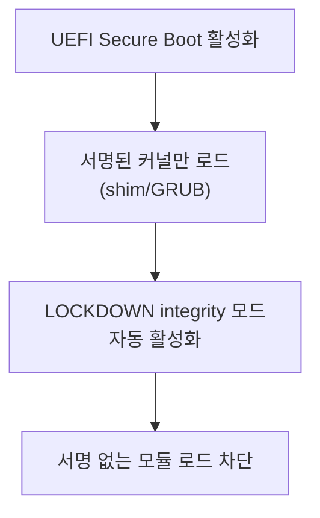
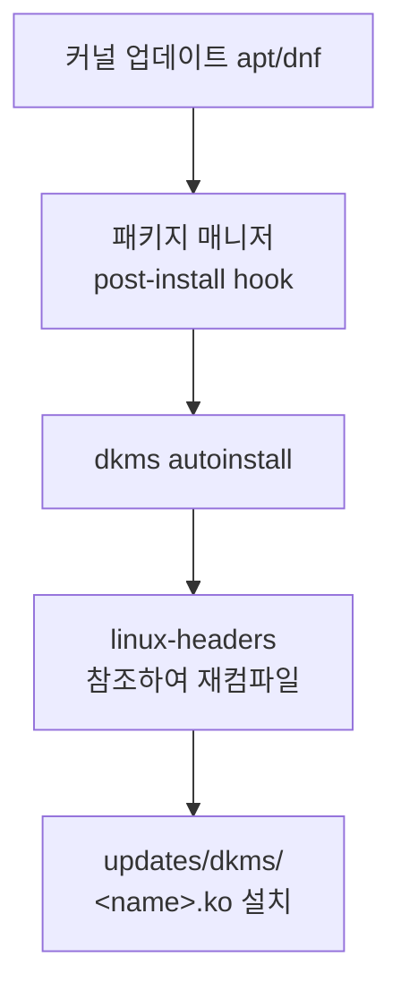

# 커널 모듈 관리 (modprobe, lsmod)

커널 모듈(`.ko`)은 런타임에 커널 기능을 동적으로 추가·제거할 수
있는 이진 파일이다. 드라이버, 파일시스템, 네트워크 프로토콜 대부분이
모듈 형태로 제공된다.

---

## 핵심 명령어

### lsmod

`/proc/modules`를 읽어 현재 로드된 모듈 목록을 출력한다.

```bash
lsmod
```

```
Module                  Size  Used by
br_netfilter           32768  0
bridge                307200  1 br_netfilter
overlay               184320  7
nf_conntrack          180224  3 xt_conntrack,nf_nat,nf_conntrack_netlink
```

| 컬럼 | 설명 |
|------|------|
| Module | 모듈 이름 (`.ko` 확장자 제외) |
| Size | 커널 메모리 내 크기 (바이트) |
| Used by | 사용 인스턴스 수 + 의존하는 모듈 목록 |

`Used by`의 숫자가 0이어야 `modprobe -r`로 제거 가능하다.

---

### modinfo

모듈의 메타데이터를 조회한다.

```bash
modinfo br_netfilter                        # 이름으로 조회
modinfo /path/to/module.ko                  # 파일 경로로 조회
modinfo -F vermagic kvm                     # 특정 필드만 출력
modinfo -k 6.8.0-50-generic nf_conntrack   # 다른 커널 기준 조회
```

**주요 출력 필드:**

| 필드 | 설명 |
|------|------|
| `filename` | `.ko` 파일의 절대 경로 |
| `license` | GPL 여부. non-GPL은 Tainted Kernel 유발 |
| `depends` | 먼저 로드되어야 하는 모듈 (하드 의존성) |
| `vermagic` | 빌드된 커널 버전 + 컴파일 플래그. 불일치 시 로드 거부 |
| `parm` | 모듈 파라미터 이름·타입·설명 |
| `signer` | 서명 키 소유자 (서명된 모듈) |
| `sig_hashalgo` | 서명 해시 알고리즘 (예: sha256) |

`vermagic` 불일치 예:
```
vermagic: 6.8.0-50-generic SMP preempt mod_unload modversions
→ 현재 커널과 다르면 로드 실패
```

---

### modprobe

의존성을 자동 해결하여 모듈을 로드/제거한다.

```bash
# 로드
modprobe overlay                       # 기본 로드
modprobe -v br_netfilter               # verbose (실행 명령 출력)
modprobe -n -v nf_conntrack            # dry-run (실제 로드 안 함)
modprobe --show-depends br_netfilter   # 의존성 체인 확인
# 출력 예:
# insmod /lib/modules/.../kernel/net/llc/llc.ko
# insmod /lib/modules/.../kernel/net/802/stp.ko
# insmod /lib/modules/.../kernel/net/bridge/bridge.ko
# insmod /lib/modules/.../kernel/net/bridge/br_netfilter.ko
modprobe nf_conntrack hashsize=65536   # 파라미터 전달

# 제거
modprobe -r overlay                    # 의존 모듈까지 연쇄 제거

# 강제 (위험, 개발/디버깅 전용)
modprobe --force-vermagic overlay      # vermagic 불일치 무시
modprobe --force-modversion overlay    # 심볼 버전 불일치 무시
```

---

### insmod / rmmod

```bash
# insmod: 파일 경로 직접 지정, 의존성 자동 해결 없음
insmod /lib/modules/$(uname -r)/kernel/net/8021q/8021q.ko

# rmmod: 단일 모듈 제거
rmmod vxlan                # Used by > 0이면 실패
rmmod --force vxlan        # 강제 제거 (CONFIG_MODULE_FORCE_UNLOAD 필요)
rmmod -w vxlan             # 사용 중이면 대기 후 제거
```

**`modprobe -r` vs `rmmod --force` 비교:**

| 항목 | `modprobe -r` | `rmmod --force` |
|------|--------------|-----------------|
| 의존성 처리 | 의존 모듈도 연쇄 제거 | 지정 모듈만 강제 제거 |
| 안전성 | 안전 (사용 중이면 실패) | 위험 (커널 패닉 가능) |
| 전제조건 | 없음 | `CONFIG_MODULE_FORCE_UNLOAD=y` 필요 |
| 용도 | 프로덕션 표준 | 디버깅/개발 전용 |

---

### depmod

모듈 의존성 데이터베이스(`modules.dep`)를 재생성한다.

```bash
depmod -a                           # 현재 커널 대상 재생성
depmod -a 6.8.0-50-generic          # 특정 커널 버전 대상
depmod -A                           # 변경된 모듈 있을 때만 재생성
```

**수동으로 실행해야 하는 경우:**

- `.ko` 파일을 패키지 매니저를 거치지 않고 수동 복사한 후
- `FATAL: Module xxx not found` 오류 발생 시
- `Unknown symbol in module` 오류 발생 시

패키지 매니저(apt, dnf)로 커널 업데이트 시에는 자동 실행된다.

---

## 모듈 설정 파일

### /etc/modprobe.d/*.conf

modprobe 동작을 제어하는 설정 파일. 줄당 하나의 지시자.

```bash
# /etc/modprobe.d/custom.conf

# options: 모듈 파라미터 기본값
options nf_conntrack hashsize=65536 expect_hashsize=8192

# alias: 별칭 부여
alias net-pf-10 ipv6

# blacklist: auto-load alias만 무효화 (직접 modprobe는 가능)
blacklist pcspkr

# install: 로드 요청 시 커스텀 명령 실행
# /bin/false → 로드 자체를 차단
install usb-storage /bin/false

# remove: 제거 요청 시 커스텀 명령
remove usb-storage /bin/true

# softdep: 소프트 의존성 (없어도 로드 실패 안 함)
softdep nouveau pre: drm_kms_helper
```

**blacklist vs install /bin/false 차이:**

| 방식 | 효과 | 직접 `modprobe` 가능 |
|------|------|---------------------|
| `blacklist foo` | auto-load alias만 무효화 | 가능 |
| `install foo /bin/false` | 로드 시도 자체를 차단 | 불가능 |

> CIS Benchmark는 **두 가지를 함께** 사용하도록 권고한다.
> `blacklist`만으로는 `modprobe foo` 직접 로드를 막지 못한다.

---

### /etc/modules-load.d/ (부팅 시 자동 로드)

부팅 시 `systemd-modules-load.service`가 읽어 모듈을 로드한다.

```bash
# /etc/modules-load.d/k8s.conf
# 한 줄에 모듈 이름 하나. # ; 은 주석
overlay
br_netfilter
nf_conntrack
```

**파일 처리 방식:**

모든 경로의 파일이 **파일명 사전순**으로 정렬되어 함께 적용된다.
**동명 파일이 여러 경로에 존재할 때만** 더 높은 우선순위 경로가 오버라이드한다.

```
/etc/modules-load.d/*.conf      ← 최우선 (동명 파일 오버라이드)
/run/modules-load.d/*.conf
/usr/local/lib/modules-load.d/
/usr/lib/modules-load.d/*.conf  ← 배포판 기본값
```

> `/usr/lib/modules-load.d/10-distro.conf`와
> `/etc/modules-load.d/90-custom.conf`는 이름이 다르므로
> **둘 다 적용된다**. sysctl.d와 동일한 드롭인(drop-in) 방식이다.

```bash
# 부팅 시 로드 결과 확인
systemctl status systemd-modules-load.service
journalctl -u systemd-modules-load.service --since boot
```

`/etc/modules`(레거시 SysVinit 방식)도 Ubuntu 등에서 계속 지원되나,
새 설정은 `/etc/modules-load.d/`를 권장한다.

---

## 커널 모듈 서명 (Module Signing)

### Secure Boot와 LOCKDOWN 모드



서명된 `.ko` 파일 구조:
```
[ELF 컨텐츠][PKCS#7 서명][서명 정보 블록][~Module signature appended~.]
```

서명은 ELF 외부에 추가된다. **서명 후 `strip` 실행 금지.**

```bash
# 서명 정보 확인
modinfo /path/to/module.ko | grep -E 'sig_id|signer|sig_key|sig_hashalgo'

# LOCKDOWN 현재 모드 확인
# [none] integrity confidentiality 중 []로 표시된 값이 현재 모드
cat /sys/kernel/security/lockdown
```

**LOCKDOWN 모드 비교:**

| 모드 | 제한 범위 | 활성화 조건 |
|------|-----------|------------|
| `none` | 제한 없음 | Secure Boot 없음 |
| `integrity` | 서명 없는 모듈 차단, `/dev/mem` 차단 등 | Secure Boot 활성화 시 자동 |
| `confidentiality` | integrity + 메모리 덤프·hibernation 차단 | 수동 설정 필요 |

**주요 dmesg 에러:**

| 메시지 | 의미 |
|--------|------|
| `module verification failed: ... tainting kernel` | 서명 없지만 로드됨 (비강제 모드) |
| `Required key not available` | SIG_FORCE=Y 또는 LOCKDOWN에서 차단 |
| `Loading of unsigned module is restricted` | LOCKDOWN integrity 모드에서 차단 |

---

### MOK (Machine Owner Key) 등록

외부 모듈(DKMS 포함)을 Secure Boot 환경에서 로드하려면 MOK를
등록하고 모듈에 서명해야 한다.

**Step 1: 키 쌍 생성**

```bash
mkdir -p /etc/mok

openssl req -new -x509 \
    -newkey rsa:2048 \
    -keyout /etc/mok/MOK.key \
    -outform DER \
    -out /etc/mok/MOK.der \
    -nodes \
    -days 36500 \
    -subj "/CN=Custom Module Signing Key"

chmod 600 /etc/mok/MOK.key
# MOK는 rsa:2048을 권장한다.
# shim 일부 구현에서 4096비트 키 등록 시 MokManager가 프리즈하는 버그가
# 보고되어 있으며, UEFI Secure Boot 스펙이 RSA-2048을 최소 요건으로 정의한다.
# 커널 소스 서명(boot-process.md의 GRUB/SBAT 맥락)은 rsa:4096이 권장되나
# MOK는 shim 호환성 때문에 2048이 더 안전하다.
```

**Step 2: MOK 등록 요청 (재부팅 필요)**

```bash
sudo mokutil --import /etc/mok/MOK.der
# 비밀번호 설정 후 재부팅
# 재부팅 중 MokManager 메뉴:
# Enroll MOK → Continue → Yes → 비밀번호 입력

# 등록 확인
mokutil --list-enrolled
```

**Step 3: 모듈 서명**

```bash
SIGN_FILE="/usr/src/linux-headers-$(uname -r)/scripts/sign-file"

sudo $SIGN_FILE sha256 \
    /etc/mok/MOK.key \
    /etc/mok/MOK.der \
    /path/to/module.ko
```

---

## DKMS (Dynamic Kernel Module Support)

커널 업데이트 시 외부 모듈을 자동으로 재빌드한다.
NVIDIA 드라이버, VirtualBox, WireGuard(구버전) 등이 대표적인 사례다.

### 동작 원리



### dkms.conf 형식

```bash
# /usr/src/mydriver-1.0/dkms.conf

PACKAGE_NAME="mydriver"
PACKAGE_VERSION="1.0"

BUILT_MODULE_NAME[0]="mydriver"
BUILT_MODULE_LOCATION[0]="src/"
DEST_MODULE_LOCATION[0]="/kernel/drivers/misc"

# 커널 업데이트 시 자동 재빌드
AUTOINSTALL="yes"

# 재빌드 후 initrd 재생성
REMAKE_INITRD="yes"

# CLEAN 지시자는 DKMS 3.1.8+(2025-04)부터 deprecated.
# 기존 dkms.conf에 CLEAN=이 있으면 경고 메시지가 출력되나 동작은 유지된다.
```

### 핵심 명령어

```bash
# 등록 → 빌드 → 설치 순서
dkms add -m mydriver -v 1.0
dkms build -m mydriver -v 1.0
dkms install -m mydriver -v 1.0

# 특정 커널 버전 대상 빌드
dkms build -m mydriver -v 1.0 -k 6.8.0-50-generic

# 상태 확인
dkms status

# 모든 등록 모듈 재빌드
dkms autoinstall

# 제거
dkms remove -m mydriver -v 1.0 --all
```

### DKMS + Secure Boot 자동 서명

```bash
# 서명 스크립트 작성
cat > /etc/dkms/sign-mok.sh << 'EOF'
#!/bin/bash
KERNEL_VER="$1"
MODULE_PATH="$2"

/usr/src/linux-headers-${KERNEL_VER}/scripts/sign-file \
    sha256 \
    /etc/mok/MOK.key \
    /etc/mok/MOK.der \
    "${MODULE_PATH}"
EOF
chmod +x /etc/dkms/sign-mok.sh

# dkms.conf에 서명 도구 등록
echo 'SIGN_TOOL="/etc/dkms/sign-mok.sh"' \
    >> /usr/src/mydriver-1.0/dkms.conf
```

> Ubuntu 22.04+는 DKMS가 `/var/lib/dkms/mok.key`와
> `/var/lib/dkms/mok.pub`을 자동 생성하고
> 첫 빌드 시 MOK 등록을 자동으로 유도한다.

---

## Kubernetes 노드 필수 모듈

### 모듈 설정 파일

```bash
# /etc/modules-load.d/k8s.conf

# containerd overlayfs 스토리지 드라이버
overlay

# 브릿지 트래픽에 iptables/ip6tables 적용 허용
# 없으면: DNS 실패, NetworkPolicy 미작동
br_netfilter

# kube-proxy, NetworkPolicy의 연결 추적
# (일부 배포판에서는 커널 빌트인이거나 br_netfilter 로드 시 자동 로드됨)
nf_conntrack
```

```bash
# /etc/modules-load.d/k8s-ipvs.conf
# kube-proxy IPVS 모드 사용 시 추가

ip_vs
ip_vs_rr       # Round Robin
ip_vs_wrr      # Weighted Round Robin
ip_vs_sh       # Source Hash
```

### 적용 및 검증

```bash
# 즉시 로드
modprobe overlay
modprobe br_netfilter
# nf_conntrack이 이미 로드/빌트인인 경우 무시됨
modprobe nf_conntrack

# br_netfilter 로드 후 sysctl 활성화
sysctl -w net.bridge.bridge-nf-call-iptables=1
sysctl -w net.bridge.bridge-nf-call-ip6tables=1
sysctl -w net.ipv4.ip_forward=1

# 검증
lsmod | grep -E 'overlay|br_netfilter|nf_conntrack'
sysctl net.bridge.bridge-nf-call-iptables
```

> `br_netfilter` 모듈이 로드되지 않으면
> `/proc/sys/net/bridge/` 경로 자체가 존재하지 않는다.
> sysctl 설정보다 모듈 로드가 반드시 먼저여야 한다.

---

## 보안 하드닝 (CIS Benchmark)

### 불필요한 모듈 비활성화

```bash
# /etc/modprobe.d/CIS-disable.conf

# 레거시 파일시스템
blacklist cramfs
install cramfs /bin/false
blacklist freevxfs
install freevxfs /bin/false
blacklist hfs
install hfs /bin/false
blacklist squashfs
install squashfs /bin/false
blacklist udf
install udf /bin/false

# USB 스토리지 (데이터 유출 방지)
blacklist usb-storage
install usb-storage /bin/false

# squashfs (Ubuntu에서는 snap이 squashfs에 의존 — snap 미사용 환경만 적용)
# blacklist squashfs
# install squashfs /bin/false

# 취약한 네트워크 프로토콜
blacklist dccp
install dccp /bin/false
blacklist sctp
install sctp /bin/false
blacklist rds
install rds /bin/false
blacklist tipc
install tipc /bin/false

# FireWire (DMA 공격 가능)
blacklist firewire-core
install firewire-core /bin/false
```

### kernel.modules_disabled

모든 모듈 로드를 런타임에 영구 차단한다.
**한 번 1로 설정하면 재부팅 전까지 되돌릴 수 없다.**

```bash
# 필요한 모든 모듈 로드 완료 후 실행
sysctl -w kernel.modules_disabled=1
```

> **`/etc/sysctl.d/`에 영구 설정하면 안 된다.**
> `systemd-sysctl.service`와 `systemd-modules-load.service` 사이에
> 레이스 컨디션이 존재한다. `modules_disabled=1`이 먼저 적용되면
> `modules-load.d`에 지정한 모듈들이 로드되지 않아 부팅 불능 상태가 된다.
>
> 영구 차단이 필요하면 `After=systemd-modules-load.service`를 설정한
> 별도 `oneshot` 서비스로 구현하거나,
> 보안 강화 정책에서 런타임 수동 적용 방식을 권장한다.

---

## 트러블슈팅

### 진단 순서

```bash
# 1. 에러 메시지 확인
dmesg | tail -50
journalctl -k --since "5 min ago"
journalctl -u systemd-modules-load.service --since boot

# 2. 모듈 존재 여부 확인
modinfo <module>
find /lib/modules/$(uname -r) -name "*.ko*" | grep <module>

# 3. 의존성 확인
modprobe --show-depends <module>

# 4. dry-run으로 확인
modprobe -n -v <module>

# 5. modules.dep 재생성 후 재시도
depmod -a && modprobe <module>
```

### 빈번한 에러

| 에러 메시지 | 원인 | 해결 방법 |
|-------------|------|-----------|
| `Module xxx not found` | 미설치 또는 modules.dep 미갱신 | `depmod -a` 또는 패키지 설치 |
| `Unknown symbol in module` | 의존 모듈의 심볼 미해결 | `depmod -a`, 의존 모듈 버전 확인 |
| `Invalid argument (EINVAL)` | vermagic 불일치 | 현재 커널 버전에 맞게 재빌드 |
| `Required key not available` | Secure Boot + 서명 없는 모듈 | MOK로 서명 또는 Secure Boot 비활성화 |
| `Operation not permitted` | `kernel.modules_disabled=1` | 재부팅 필요 |

### 심볼 미해결 진단

```bash
# 어느 심볼이 부족한지 확인
dmesg | grep "Unknown symbol"
# 예: vxlan: Unknown symbol udp_tunnel_push_rx_port (err -2)

# 해당 심볼을 제공하는 모듈 찾기
grep -r "udp_tunnel_push_rx_port" \
    /lib/modules/$(uname -r)/modules.symbols
```

---

## 참고 자료

- [Kernel module - ArchWiki](https://wiki.archlinux.org/title/Kernel_module)
  (확인: 2026-04-16)
- [modprobe(8) - Linux man page](https://man7.org/linux/man-pages/man8/modprobe.8.html)
  (확인: 2026-04-16)
- [modprobe.d(5) - Linux man page](https://man7.org/linux/man-pages/man5/modprobe.d.5.html)
  (확인: 2026-04-16)
- [Kernel module signing - kernel.org v6.13](https://www.kernel.org/doc/html/v6.13/admin-guide/module-signing.html)
  (확인: 2026-04-16)
- [Dynamic Kernel Module Support - ArchWiki](https://wiki.archlinux.org/title/Dynamic_Kernel_Module_Support)
  (확인: 2026-04-16)
- [Signing kernel modules for Secure Boot - RHEL 9](https://docs.redhat.com/en/documentation/red_hat_enterprise_linux/9/html/managing_monitoring_and_updating_the_kernel/signing-a-kernel-and-modules-for-secure-boot_managing-monitoring-and-updating-the-kernel)
  (확인: 2026-04-16)
- [UEFI/SecureBoot/DKMS - Ubuntu Wiki](https://wiki.ubuntu.com/UEFI/SecureBoot/DKMS)
  (확인: 2026-04-16)
- [kernel_lockdown(7) - Linux man page](https://man7.org/linux/man-pages/man7/kernel_lockdown.7.html)
  (확인: 2026-04-16)
