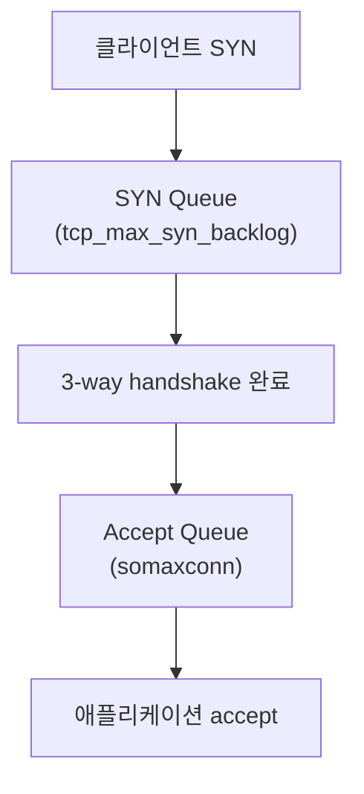
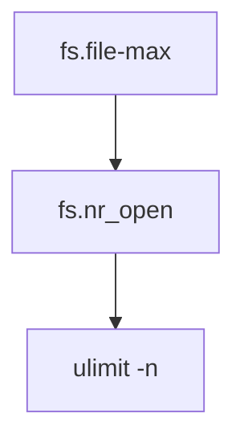
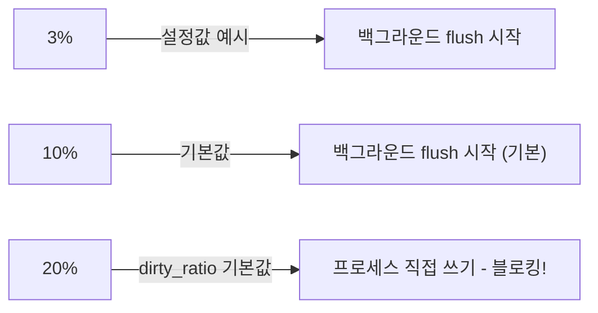

# 커널 파라미터 (sysctl, /proc, /sys)

sysctl은 `/proc/sys/` 가상 파일시스템의 래퍼다.
`net.ipv4.ip_forward`와 `/proc/sys/net/ipv4/ip_forward`는
완전히 동일한 파라미터를 가리킨다.

---

## sysctl 기본

### 명령어

```bash
# 읽기
sysctl net.ipv4.ip_forward
cat /proc/sys/net/ipv4/ip_forward     # 동일

# 런타임 변경 (재부팅 후 초기화)
sysctl -w net.ipv4.ip_forward=1
echo 1 > /proc/sys/net/ipv4/ip_forward

# 파일에서 로드
sysctl -p                              # /etc/sysctl.conf 로드
sysctl -p /etc/sysctl.d/99-custom.conf
sysctl --system                        # 모든 시스템 디렉토리를 순서대로 로드
```

### 설정 파일 우선순위

`sysctl --system`은 아래 순서로 파일을 읽는다.
**나중에 읽히는 파일이 이전 값을 덮어쓴다 (later wins).**

```
/usr/lib/sysctl.d/*.conf      ← 배포판·패키지 기본값 (먼저 읽힘)
/lib/sysctl.d/*.conf
/usr/local/lib/sysctl.d/*.conf
/run/sysctl.d/*.conf          ← 런타임 임시 설정
/etc/sysctl.d/*.conf          ← 관리자 설정
/etc/sysctl.conf              ← 마지막에 읽혀 최고 우선순위
```

> `/etc/sysctl.conf`는 전체 중 **가장 마지막**에 읽히므로
> 다른 모든 파일의 값을 오버라이드한다.
> 실무에서는 `/etc/sysctl.d/99-custom.conf`를 사용하는 것이
> 관리 용이성 측면에서 더 권장된다.

각 디렉토리 내 파일은 **파일명 사전순**으로 처리된다.
사용자 파일에는 `60-90` 범위 prefix 권장 (벤더 파일: `10-40`).

systemd-sysctl.service가 부팅 시 `sysctl --system`을 실행한다.
완전한 재적용이 필요할 때도 `--system`을 사용하자.

### 네임스페이스 분류

| 종류 | 설명 | 예시 |
|------|------|------|
| **Namespaced** | 네트워크/IPC 네임스페이스별로 격리 | `net.*`, `kernel.shm*`, `kernel.msg*` |
| **Node-level** | 호스트 커널 전체에 영향 | `vm.*`, `kernel.pid_max`, `fs.file-max` |

컨테이너 내에서 `net.ipv4.ip_local_port_range` 변경은
해당 컨테이너의 네트워크 네임스페이스에만 영향을 미친다.
반면 `vm.swappiness`는 호스트 전체에 적용된다.

---

## 네트워크 파라미터

### TCP 연결 큐



| 파라미터 | 기본값 | 고트래픽 권장 | 설명 |
|---------|--------|------------|------|
| `net.core.somaxconn` | 4096 (5.4+) | 65535 | Accept queue 최대 크기 |
| `net.ipv4.tcp_max_syn_backlog` | 메모리 기반 | 65535 | SYN_RECV 상태 최대 수 |
| `net.core.netdev_max_backlog` | 1000 | 16384 | NIC 수신 패킷 큐 |

> `somaxconn=65535`라도 애플리케이션의 `listen()` backlog 인자가
> 더 작으면 그 값이 상한선이 된다. nginx는
> `listen 80 backlog=65535;`도 함께 설정해야 한다.

### 포트 및 TIME_WAIT

| 파라미터 | 기본값 | 권장값 | 설명 |
|---------|--------|--------|------|
| `net.ipv4.ip_local_port_range` | `32768 60999` | `15000 65000` | 임시 포트 범위 |
| `net.ipv4.tcp_fin_timeout` | 60s | 15-30s | FIN_WAIT_2 타임아웃 |
| `net.ipv4.tcp_tw_reuse` | 2 | 1 | TIME_WAIT 소켓 재사용 |

> **tcp_tw_reuse 기본값 `2`**: loopback 연결에 대해서만 TIME_WAIT 재사용을
> 활성화하는 Linux 4.11+ 설정이다. 외부 연결에 미치는 영향은 없다.
> `1`로 설정 시 외부 연결에도 재사용이 활성화된다 (`tcp_timestamps=1` 필수).

> **ip_local_port_range**: `1024 65535`로 설정하면 Well-Known 포트
> (1024~49151) 범위가 포함되어 서비스 포트(8080, 3306 등)와 충돌 가능성이 있다.
> `15000 65000` 또는 IANA 동적 포트 `49152 65535`가 더 안전하다.

> `tcp_tw_recycle`은 Linux 4.12에서 **완전히 제거**됐다.
> NAT 환경에서 timestamp 충돌 문제가 있었다.

### Keepalive

| 파라미터 | 기본값 | 권장값 |
|---------|--------|--------|
| `net.ipv4.tcp_keepalive_time` | 7200s (2h) | 600s |
| `net.ipv4.tcp_keepalive_intvl` | 75s | 30s |
| `net.ipv4.tcp_keepalive_probes` | 9 | 5 |

### 라우팅·브리지

| 파라미터 | 기본 | 필요값 | 용도 |
|---------|------|--------|------|
| `net.ipv4.ip_forward` | 0 | **1** | 패킷 포워딩 (K8s, VPN 필수) |
| `net.ipv6.conf.all.forwarding` | 0 | 1 | IPv6 포워딩 |
| `net.bridge.bridge-nf-call-iptables` | 0 | **1** | 브리지 트래픽 iptables 처리 (K8s) |
| `net.bridge.bridge-nf-call-ip6tables` | 0 | **1** | 브리지 IPv6 (K8s) |

브리지 파라미터는 `br_netfilter` 모듈 로드 후에야
`/proc/sys/net/bridge/` 경로가 생성된다.

### TCP 버퍼

형식: `최소 기본 최대` (bytes)

| 파라미터 | 기본값 | 10GbE 권장 |
|---------|--------|-----------|
| `net.core.rmem_max` | 212992 | 268435456 |
| `net.core.wmem_max` | 212992 | 268435456 |
| `net.ipv4.tcp_rmem` | `4096 131072 6291456` | `4096 67108864 268435456` |
| `net.ipv4.tcp_wmem` | `4096 16384 4194304` | `4096 67108864 268435456` |

**BDP 계산**: `대역폭(bps) × RTT(초)` = 적정 버퍼 크기.
10Gbps × 10ms RTT = 100MB. 버퍼 최대값을 BDP × 2로 설정.

### 파일 디스크립터



`ulimit`은 `fs.nr_open`을 초과할 수 없다.
서비스는 systemd `LimitNOFILE=`로 조정.

---

## 메모리 파라미터

### vm.swappiness

| 값 범위 | 동작 |
|--------|------|
| 0 | 스왑 사용 최소화. OOM 위험 증가 |
| 1-10 | DB 서버 권장 |
| 10-30 | 일반 서버 권장 |
| 60 | Linux 기본값 |
| 100-200 | zram 등 빠른 스왑 장치 (Linux 5.8+에서 200까지 가능) |

- **Kubernetes 노드 (swap 비활성)**: `vm.swappiness = 0`
  swap을 비활성화한 전통적인 K8s 노드의 표준 설정.
  K8s 1.28+ 베타 swap 지원(`NoSwap`/`LimitedSwap`) 활성화 시에는
  kubelet 문서의 별도 가이드를 따른다.
- **PostgreSQL/MySQL**: `vm.swappiness = 1~10`
- Linux 5.8 이전은 0-100 범위만 지원

### vm.dirty_ratio / vm.dirty_background_ratio



| 파라미터 | 기본값 | DB 권장 | 웹서버 권장 |
|---------|--------|---------|-----------|
| `vm.dirty_background_ratio` | 10% | **3%** | 5% |
| `vm.dirty_ratio` | 20% | **10%** | 15% |
| `vm.dirty_writeback_centisecs` | 500 (5s) | 100-200 | 500 |
| `vm.dirty_expire_centisecs` | 3000 (30s) | 500-1000 | 3000 |

`dirty_ratio` 초과 시 쓰기 프로세스가 직접 flush를 수행해
레이턴시 스파이크가 발생한다. DB 서버에서는 낮게 유지한다.

### vm.overcommit_memory

| 값 | 동작 | 워크로드 |
|----|------|---------|
| **0** (기본) | 명백한 오버커밋 거부 | 일반 서버 |
| **1** | 항상 허용 (OOM까지 계속 할당) | Redis, Kubernetes 노드, fork 많은 앱 |
| **2** | 오버커밋 금지 (`스왑 + RAM × ratio/100` 한도) | PostgreSQL, 금융 |

```bash
# overcommit_memory=2일 때 최대 커밋 가능 메모리
# CommitLimit = 스왑 + (RAM × vm.overcommit_ratio / 100)
# vm.overcommit_ratio 기본값: 50
```

- **Redis**: BGSAVE 시 COW(Copy-on-Write) fork 실패를 방지하기 위해 `1` 권장.
- **PostgreSQL**: OOM killer 비정상 종료 방지를 위해 `2` 권장.
- **Kubernetes 노드**: kubelet이 QoS Guaranteed/Burstable/BestEffort 등급과
  `oom_score_adj`로 메모리를 직접 관리하므로 `1`이 적합하다.
  커널 레벨 오버커밋 제한은 kubelet의 메모리 관리와 충돌한다.

### Transparent Hugepages (THP)

```
/sys/kernel/mm/transparent_hugepage/
  enabled: always | madvise | never
  defrag:  always | defer | defer+madvise | never
```

**DB 서버 공통 권장**: `never` (비활성화)
MongoDB, PostgreSQL, Oracle 모두 THP 비활성화를 공식 권고한다.
레이턴시 스파이크와 메모리 단편화를 유발한다.

```ini
# /etc/systemd/system/disable-thp.service
[Unit]
Description=Disable Transparent Huge Pages
After=sysinit.target local-fs.target

[Service]
Type=oneshot
RemainAfterExit=yes
ExecStart=/bin/sh -c 'echo never > \
  /sys/kernel/mm/transparent_hugepage/enabled'
ExecStart=/bin/sh -c 'echo never > \
  /sys/kernel/mm/transparent_hugepage/defrag'

[Install]
WantedBy=multi-user.target
```

> `RemainAfterExit=yes`: 실행 완료 후에도 서비스를 `active` 상태로 유지한다.
> 없으면 완료 즉시 `inactive`로 표시되어 `systemctl status`에서
> 정상 실행 여부를 확인하기 어렵다.

THP는 `/sys/` 경로를 통해서만 설정 가능하다 (sysctl 불가).

### vm.nr_hugepages (고정 Hugepages)

DB나 고성능 앱의 예측 가능한 성능을 위해 static hugepages 예약:

```bash
# 현재 상태 확인
grep -i huge /proc/meminfo

# 2MB hugepage 1024개 예약 (= 2GB)
sysctl -w vm.nr_hugepages=1024
```

PostgreSQL: `huge_pages = on` 설정 후 `shared_buffers` 크기에 맞게 예약.

---

## 보안 파라미터

### 커널 정보 노출 제한

| 파라미터 | 권장값 | 설명 |
|---------|--------|------|
| `kernel.dmesg_restrict` | **1** | CAP_SYSLOG 권한자만 dmesg 조회 |
| `kernel.kptr_restrict` | **2** | 커널 포인터 주소 완전 차단 |
| `kernel.randomize_va_space` | **2** | ASLR 최강 모드 |

`kernel.perf_event_paranoid` 는 eBPF 도구(bpftrace, BCC) 실행에 직접 영향을 미친다:

| 값 | 동작 |
|----|------|
| -1 | 모든 사용자 허용 |
| 1 | 커널 프로파일링 불가 **(upstream 기본값)** |
| 2 | 비권한 사용자 완전 차단 |
| 4 | Ubuntu 22.04+ 기본값 (AppArmor 연동, 범위 -1~4로 확장) |

> **배포판별 기본값 차이**: Ubuntu 22.04+는 기본값 `4`로 비권한 사용자를
> 완전히 차단한다. Datadog Agent, Pyroscope, Cilium 등을 Ubuntu에서
> 운영할 때 `perf_event_paranoid=1`을 기대하고 설정하면 동작하지 않는다.
> `getconf LEVEL1_DCACHE_LINESIZE` 같은 기능도 제한될 수 있다.

Kubernetes에서 Datadog/Cilium 등 observability 도구는
노드 레벨에서 `perf_event_paranoid`를 낮추거나
CAP_BPF / CAP_SYS_ADMIN을 부여해야 한다.

### 네트워크 보안

| 파라미터 | 권장값 | 설명 |
|---------|--------|------|
| `net.ipv4.conf.all.rp_filter` | **1** | Strict RPF (IP 스푸핑 방지) |
| `net.ipv4.conf.default.rp_filter` | **1** | 새 인터페이스에도 적용 |
| `net.ipv4.conf.all.accept_redirects` | **0** | ICMP redirect 무시 (중간자 방지) |
| `net.ipv4.conf.all.send_redirects` | **0** | ICMP redirect 발송 금지 |
| `net.ipv4.icmp_echo_ignore_broadcasts` | **1** | Smurf DDoS 방지 |
| `net.ipv4.tcp_syncookies` | **1** | SYN Flood 방어 (기본 활성) |

> `rp_filter=2` (Loose): BGP 서버, 로드밸런서 등
> 비대칭 라우팅 환경에서는 `1` 대신 `2`를 사용한다.

### ptrace 보안

| 값 | 동작 |
|----|------|
| `kernel.yama.ptrace_scope = 0` | 동일 UID 프로세스에 자유롭게 attach |
| `kernel.yama.ptrace_scope = 1` | 자식 프로세스만 attach **(기본값)** |
| `kernel.yama.ptrace_scope = 2` | CAP_SYS_PTRACE 필요 |
| `kernel.yama.ptrace_scope = 3` | ptrace 완전 비활성화 |

---

## /proc 주요 파일

### 시스템 정보

```bash
/proc/cpuinfo       # CPU 모델, 코어 수, 플래그
/proc/meminfo       # 메모리 현황 (MemTotal, HugePages_*)
/proc/loadavg       # 1/5/15분 load average, 실행중/전체 프로세스
```

### 네트워크

```bash
/proc/net/tcp       # TCP 소켓 테이블 (16진수 주소)
/proc/net/sockstat  # 소켓 통계 요약
/proc/net/dev       # 인터페이스별 RX/TX 통계
/proc/net/snmp      # SNMP MIB (재전송률 등)
```

`/proc/net/tcp` 상태 코드: `01`=ESTABLISHED, `06`=TIME_WAIT, `0A`=LISTEN

### /proc/\<pid\>/ 구조

| 파일/디렉토리 | 설명 |
|-------------|------|
| `cmdline` | 프로세스 실행 인자 |
| `status` | 상태 요약 (이름, PID, 메모리, 스레드) |
| `stat` | 스케줄러용 원시 상태 데이터 |
| `maps` | 가상 메모리 매핑 목록 |
| `smaps` | maps의 상세 버전 (크기, RSS, PSS) |
| `fd/` | 열린 파일 디스크립터 심볼릭 링크 |
| `fdinfo/` | 파일 디스크립터 상세 정보 |
| `io` | 읽기/쓰기 바이트 통계 |
| `net/` | 네트워크 소켓, 라우팅 정보 |
| `cgroup` | 속한 cgroup 경로 |
| `oom_score` | OOM killer 점수 |
| `oom_score_adj` | OOM 점수 조정값 (-1000~1000) |

```bash
# 프로세스의 열린 FD 수
ls /proc/1234/fd | wc -l

# FD 한계 확인
cat /proc/1234/limits | grep "open files"

# 네트워크 네임스페이스 확인
readlink /proc/1234/ns/net
```

---

## /sys 주요 경로

| 경로 | 설명 |
|------|------|
| `/sys/block/<dev>/queue/scheduler` | I/O 스케줄러 설정 |
| `/sys/block/<dev>/queue/rotational` | HDD=1 / SSD=0 |
| `/sys/block/<dev>/queue/read_ahead_kb` | read-ahead 크기 |
| `/sys/class/net/<iface>/speed` | 링크 속도 (Mbps) |
| `/sys/class/net/<iface>/operstate` | 인터페이스 상태 (up/down) |
| `/sys/kernel/mm/transparent_hugepage/` | THP 설정 |
| `/sys/kernel/mm/hugepages/hugepages-2048kB/nr_hugepages` | 2MB Hugepage 수 |

### /sys vs /proc

| 특성 | /proc | /sys |
|------|-------|------|
| 목적 | 프로세스·커널 런타임 정보 | 장치 드라이버·하드웨어 |
| 구조 | 상대적으로 비구조적 | kobject 기반 엄격한 계층 |
| 설계 | 구형 (초기부터) | 신형 (2.6+, udev와 연동) |

---

## Kubernetes 환경

### Safe Sysctls (기본 허용, K8s 1.32+)

```
kernel.shm_rmid_forced
net.ipv4.ip_local_port_range
net.ipv4.tcp_syncookies
net.ipv4.ping_group_range          (1.18+)
net.ipv4.ip_unprivileged_port_start (1.22+)
net.ipv4.ip_local_reserved_ports   (1.27+)
net.ipv4.tcp_keepalive_time        (1.29+)
net.ipv4.tcp_fin_timeout           (1.29+)
net.ipv4.tcp_keepalive_intvl       (1.29+)
net.ipv4.tcp_keepalive_probes      (1.29+)
net.ipv4.tcp_rmem                  (1.32+, kernel 4.15+)
net.ipv4.tcp_wmem                  (1.32+, kernel 4.15+)
```

### Pod securityContext 설정

```yaml
spec:
  securityContext:
    sysctls:
    # Safe sysctl: 추가 설정 없이 사용 가능
    - name: net.ipv4.ip_local_port_range
      value: "1024 65535"
    - name: net.ipv4.tcp_keepalive_time
      value: "600"
    # Unsafe sysctl: kubelet --allowed-unsafe-sysctls 필요
    - name: net.core.somaxconn
      value: "65535"
```

### kubelet unsafe sysctls 활성화

```bash
# kubelet 플래그
kubelet --allowed-unsafe-sysctls \
  'net.core.somaxconn,net.ipv4.tcp_max_syn_backlog'
```

### 노드 레벨 파라미터 (DaemonSet 패턴)

`vm.*`, `fs.*`처럼 네임스페이스화되지 않은 파라미터는
Pod의 `securityContext.sysctls`로 설정 불가하다.
특권 initContainer를 가진 DaemonSet으로 적용한다:

```yaml
initContainers:
- name: sysctl
  image: busybox
  securityContext:
    privileged: true
  command:
  - sh
  - -c
  - |
    sysctl -w vm.max_map_count=262144
    sysctl -w fs.inotify.max_user_watches=524288
```

> `hostNetwork: true` Pod에서는 `net.*` sysctl 설정이 불허된다.
> 네트워크 네임스페이스 공유로 인해 노드 전체에 영향을 미치기 때문.

---

## 실무 프로파일

### 고성능 웹 서버

```ini
# /etc/sysctl.d/90-webserver.conf
net.core.somaxconn = 65535
net.ipv4.tcp_max_syn_backlog = 65535
net.core.netdev_max_backlog = 16384
net.ipv4.ip_local_port_range = 15000 65000
net.ipv4.tcp_tw_reuse = 1
net.ipv4.tcp_fin_timeout = 15
net.ipv4.tcp_keepalive_time = 600
net.ipv4.tcp_keepalive_intvl = 30
net.ipv4.tcp_keepalive_probes = 5
net.core.rmem_max = 268435456
net.core.wmem_max = 268435456
net.ipv4.tcp_rmem = 4096 67108864 268435456
net.ipv4.tcp_wmem = 4096 67108864 268435456
fs.file-max = 1048576
net.ipv4.tcp_syncookies = 1
```

### Kubernetes 노드

```ini
# /etc/sysctl.d/90-kubernetes.conf
net.ipv4.ip_forward = 1
net.bridge.bridge-nf-call-iptables = 1
net.bridge.bridge-nf-call-ip6tables = 1
net.core.somaxconn = 32768
net.ipv4.ip_local_port_range = 15000 65000
vm.swappiness = 0          # swap 비활성 노드 기준
vm.overcommit_memory = 1   # kubelet이 QoS/OOM score로 메모리 관리
vm.max_map_count = 262144  # Elasticsearch 등 memory-mapped 워크로드
fs.file-max = 1048576
fs.inotify.max_user_watches = 524288   # ArgoCD, Flux 등 파일 감시 도구
fs.inotify.max_user_instances = 512
kernel.pid_max = 4194304
```

### 데이터베이스 서버 (PostgreSQL)

```ini
# /etc/sysctl.d/90-database.conf
vm.swappiness = 1
vm.dirty_background_ratio = 3
vm.dirty_ratio = 10
vm.dirty_writeback_centisecs = 100
vm.dirty_expire_centisecs = 500
vm.overcommit_memory = 2
vm.overcommit_ratio = 80
vm.nr_hugepages = 2048        # shared_buffers에 맞게 계산
# THP 비활성화는 systemd service 사용 (/sys/ 직접 설정)
kernel.dmesg_restrict = 1
kernel.kptr_restrict = 2
kernel.randomize_va_space = 2
net.ipv4.tcp_keepalive_time = 300
net.ipv4.tcp_keepalive_intvl = 30
net.ipv4.tcp_keepalive_probes = 5
```

---

## 참고 자료

- [Linux Kernel: IP Sysctl](https://www.kernel.org/doc/html/latest/networking/ip-sysctl.html)
  (확인: 2026-04-16)
- [Linux Kernel: /proc/sys/vm/](https://docs.kernel.org/admin-guide/sysctl/vm.html)
  (확인: 2026-04-16)
- [Linux Kernel: /proc/sys/kernel/](https://www.kernel.org/doc/html/latest/admin-guide/sysctl/kernel.html)
  (확인: 2026-04-16)
- [Kubernetes: Using sysctls in a Cluster](https://kubernetes.io/docs/tasks/administer-cluster/sysctl-cluster/)
  (확인: 2026-04-16)
- [Cloudflare Blog: Optimizing TCP for High WAN Throughput](https://blog.cloudflare.com/optimizing-tcp-for-high-throughput-and-low-latency/)
  (확인: 2026-04-16)
- [PostgreSQL: Managing Kernel Resources](https://www.postgresql.org/docs/current/kernel-resources.html)
  (확인: 2026-04-16)
- [MongoDB: Disable THP](https://www.mongodb.com/docs/manual/tutorial/disable-transparent-huge-pages/)
  (확인: 2026-04-16)
- [Linux Kernel: Yama LSM](https://docs.kernel.org/admin-guide/LSM/Yama.html)
  (확인: 2026-04-16)
