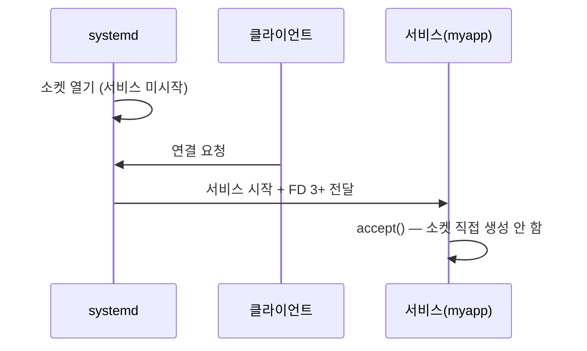
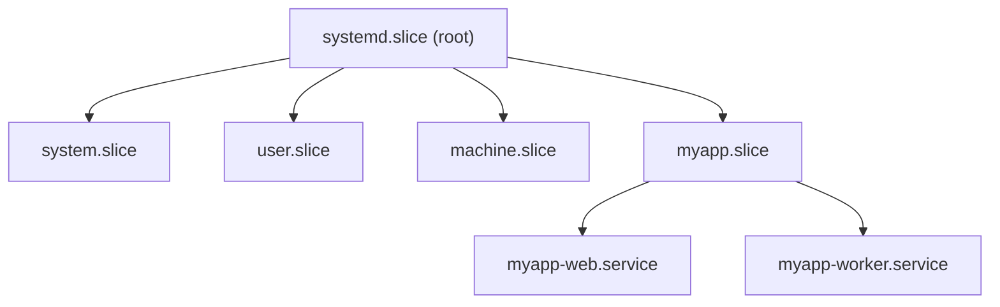
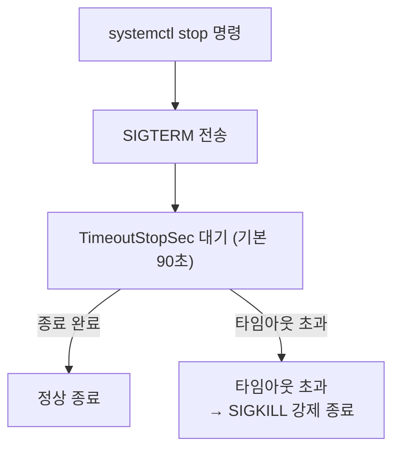

# systemd 서비스 관리

systemd는 Linux의 PID 1이자 서비스 매니저다.
unit 파일 하나로 의존성·리소스 제한·보안 격리까지
선언적으로 관리한다.

## 버전 현황 (2026)

| 버전 | 릴리즈 | 주요 변경 |
|------|--------|---------|
| **260** | 2026-03-17 | **SysV init 스크립트 완전 제거**, 커널 5.10+ |
| 258 | 2025-09 | **cgroup v1 완전 제거**, 커널 5.4+ |
| 257 | 2024-12 | MPTCP 소켓, `PrivateUsers=managed` |

---

## Unit 파일 구조

### 3섹션 기본 구조

```ini
[Unit]
Description=My Application
Documentation=https://example.com/docs
After=network-online.target
Wants=network-online.target

[Service]
Type=notify
ExecStart=/usr/bin/myapp --config /etc/myapp/config.yaml
Restart=on-failure
RestartSec=5s

[Install]
WantedBy=multi-user.target
```

### Unit 파일 위치 우선순위

| 위치 | 용도 | 우선순위 |
|------|------|---------|
| `/etc/systemd/system/` | 관리자 정의 (드롭인 포함) | 높음 |
| `/run/systemd/system/` | 런타임 생성 | 중간 |
| `/usr/lib/systemd/system/` | 패키지 제공 | 낮음 |

드롭인 오버라이드: `/etc/systemd/system/<unit>.d/override.conf`

### Type= 비교

| Type | "started" 처리 시점 | 권장 여부 |
|------|------------------|---------|
| `simple` | ExecStart 프로세스 fork 직후 | 기본값, 준비 여부 불확실 |
| **`exec`** | execve() 완료 시 | simple 대체, 바이너리 오류 즉시 감지 |
| `forking` | 부모 프로세스 exit 후 | **비권장** (notify/dbus로 교체) |
| `oneshot` | ExecStart 프로세스 완료 후 | 일회성 스크립트, `RemainAfterExit=yes` 병용 |
| **`notify`** | 서비스가 `READY=1` 전송 후 | **권장** — 진짜 준비 신호 |
| `notify-reload` | notify + SIGHUP 시 `RELOADING=1` | 재로드 지원 서비스 |
| `dbus` | 지정 BusName이 D-Bus에 등록 후 | D-Bus 서비스 전용 |

> `simple`은 바이너리 경로가 틀려도 `systemctl start`가 성공으로 반환한다.
> 신규 서비스는 `exec`을 기본으로 쓰자.

### Exec 디렉티브

```ini
ExecStartPre=/usr/bin/myapp --check-config   # 시작 전 검사
ExecStart=/usr/bin/myapp serve               # 메인 프로세스
ExecStartPost=/usr/bin/post-init.sh          # 시작 후 실행
ExecReload=/bin/kill -HUP $MAINPID           # reload 신호
ExecStop=/usr/bin/myapp --graceful-stop      # 명시적 종료
ExecStopPost=/usr/bin/cleanup.sh             # 종료 후 정리
ExecReloadPost=/usr/bin/post-reload.sh       # reload 후 (v259+)
```

앞에 `-`를 붙이면 실패해도 무시: `ExecStartPre=-/bin/optional`

### Restart= 옵션

| 값 | 재시작 조건 |
|----|-----------|
| `no` | 재시작 안 함 (기본) |
| `on-failure` | 비정상 종료·시그널·타임아웃 시 **← 실무 권장** |
| `on-abnormal` | 시그널 종료·타임아웃만 |
| `on-watchdog` | watchdog 타임아웃 시만 |
| `always` | 종료 이유 무관 항상 재시작 |

```ini
Restart=on-failure
RestartSec=5s                  # 재시작 대기 시간 (기본: 100ms)
StartLimitIntervalSec=60s      # 이 시간 윈도우 내
StartLimitBurst=5              # 5회 초과 시 failed 상태로 전환
```

`StartLimitIntervalSec=0` 설정 시 재시작 횟수 제한 없음.
제한 도달 시 `systemctl reset-failed myapp.service`로 수동 리셋.

---

## 의존성과 순서 제어

### 디렉티브 비교

| 디렉티브 | 시작 전파 | 중지 전파 | 실패 전파 |
|---------|---------|---------|---------|
| `Wants=B` | B 시작 시도 | 없음 | 없음 |
| `Requires=B` | B 시작 필수 | `After=B` 도 있을 때 B 중지 시 A도 중지 | B 실패 시 A 실패 |
| `Requisite=B` | B 실행 중이어야 함 | 없음 | B 없으면 즉시 실패 |
| `BindsTo=B` | B 시작 필수 | **즉시 중지** | B 실패 시 A 실패 |
| `PartOf=B` | 없음 | B stop/restart에만 동반 | 없음 |
| `Upholds=B` | 없음 | 없음 | A 활성 동안 B 지속 재시작 |
| `Conflicts=B` | B 중지 후 A 시작 | A 시작 시 B 중지 | — |

> `After=`/`Before=`는 **순서만** 제어, 의존성이 아님.
> 실무 표준 패턴: `Wants=` + `After=` 조합.

```ini
# 올바른 패턴
After=network-online.target postgresql.service
Wants=network-online.target
Requires=postgresql.service
```

### PartOf= vs BindsTo= 선택

```ini
# PartOf=: 논리적 컴포넌트 (stop/restart만 전파)
# 예: worker는 web 재시작 시 함께 재시작
[Unit]
PartOf=myapp-web.service
After=myapp-web.service

# BindsTo=: 물리적 분리 불가 (실패도 전파)
# 예: VPN 다운 시 의존 서비스 즉시 중지
[Unit]
BindsTo=openvpn-client.service
After=openvpn-client.service
```

---

## Socket Activation

소켓을 systemd가 미리 열어두고, 연결 요청이 오면
서비스를 시작해 소켓 FD를 전달한다.
부팅 시간을 줄이고 의존성을 단순화한다.



### .socket 유닛

```ini
# /etc/systemd/system/myapp.socket
[Unit]
Description=MyApp Socket

[Socket]
ListenStream=8080                  # TCP
# ListenStream=/run/myapp.sock     # Unix domain
Accept=no                          # 단일 서비스에 모든 연결 전달
Backlog=128

[Install]
WantedBy=sockets.target
```

### 대응 .service 유닛

```ini
# /etc/systemd/system/myapp.service
[Unit]
Description=MyApp Service
Requires=myapp.socket

[Service]
Type=notify
ExecStart=/usr/bin/myapp
# sd_listen_fds() API로 FD 3을 받아 사용
```

```bash
# 소켓만 enable, 서비스는 자동 시작
systemctl enable --now myapp.socket
```

---

## 리소스 제어 (cgroup v2)

systemd 258에서 cgroup v1이 완전히 제거됐다.
모든 리소스 제어는 cgroup v2를 통한다.

### 핵심 디렉티브 → cgroup v2 매핑

| systemd 디렉티브 | cgroup v2 파일 | 설명 |
|----------------|--------------|------|
| `CPUQuota=200%` | `cpu.max` | 2코어 최대 사용 |
| `CPUWeight=100` | `cpu.weight` | 범위 1~10000 (기본 100) |
| `MemoryMax=1G` | `memory.max` | 초과 시 OOM 발동 |
| `MemoryHigh=800M` | `memory.high` | 소프트 한계, 스로틀 먼저 |
| `MemorySwapMax=0` | `memory.swap.max` | 스왑 완전 차단 |
| `MemoryTHP=never` | `memory.huge_pages` | THP 제어 (v260+) |
| `TasksMax=512` | `pids.max` | 프로세스/스레드 수 제한 |
| `IOWeight=100` | `io.weight` | I/O 가중치 1~10000 |
| `IOReadBandwidthMax=/dev/sda 50M` | `io.max` | 장치별 읽기 대역폭 |

### 디렉토리 쿼터 (v258+)

```ini
StateDirectory=myapp           # /var/lib/myapp 자동 생성
StateDirectoryQuota=10G        # 크기 제한 (v258+)
CacheDirectory=myapp
CacheDirectoryQuota=5G
LogsDirectory=myapp
LogsDirectoryQuota=2G
RuntimeDirectory=myapp         # /run/myapp (재부팅 시 초기화)
```

### Slice 계층 구조



```ini
# /etc/systemd/system/myapp.slice
[Slice]
CPUQuota=400%
MemoryMax=8G

# 서비스에서 슬라이스 참조
[Service]
Slice=myapp.slice
```

---

## 보안 강화 (Hardening)

```bash
# 보안 점수 확인 (0=안전, 10=위험)
systemd-analyze security nginx.service

# unit 파일 직접 지정 (적용 전 테스트)
systemd-analyze security --offline /etc/systemd/system/myapp.service
```

### 파일시스템 격리

| 디렉티브 | 권장값 | 효과 |
|---------|--------|------|
| `ProtectSystem=` | `strict` | `/usr`, `/boot`, `/etc` 읽기 전용 |
| `ProtectHome=` | `yes` | `/home`, `/root`, `/run/user` 차단 |
| `PrivateTmp=` | `yes` | 독립 `/tmp`, `/var/tmp` (심링크 공격 방지) |
| `PrivateDevices=` | `yes` | `/dev` 최소화 |
| `ReadWritePaths=` | 필요 경로만 | 쓰기 허용 경로 명시 |
| `InaccessiblePaths=` | `/etc/shadow` 등 | 특정 경로 완전 차단 |

### 사용자·권한 제어

```ini
# 정적 계정
User=myapp
Group=myapp
NoNewPrivileges=yes        # setuid/setgid 통한 권한 상승 차단

# 동적 임시 계정 (stateless 서비스 권장)
DynamicUser=yes            # 랜덤 UID/GID, 종료 시 삭제
                           # NoNewPrivileges=yes 자동 활성화

# v258+ 사용자 네임스페이스 옵션
# managed: 동적 65536 UID/GID 범위 자동 할당
# full: 전체 32bit UID 범위 매핑
PrivateUsers=managed

# 최소 권한 (포트 < 1024 바인딩 시)
CapabilityBoundingSet=CAP_NET_BIND_SERVICE
AmbientCapabilities=CAP_NET_BIND_SERVICE
```

### 시스템 콜 필터링

```ini
SystemCallFilter=@system-service    # 표준 서비스 허용 그룹
SystemCallFilter=~@privileged       # 위험 콜 차단 (~=차단 목록)
SystemCallArchitectures=native      # 32-bit compat 모드 차단
SystemCallErrorNumber=EPERM         # kill 대신 EPERM 반환
MemoryDenyWriteExecute=yes          # W^X 강제
```

주요 시스템 콜 그룹: `@system-service`, `@network-io`,
`@file-system`, `@privileged`, `@process`

### 커널·네트워크 보호

```ini
ProtectKernelTunables=yes    # sysctl 수정 차단
ProtectKernelModules=yes     # 모듈 로드 차단
ProtectKernelLogs=yes        # dmesg 접근 차단
ProtectControlGroups=yes     # cgroup 변경 차단
ProtectClock=yes             # 시간 조작 차단
ProtectHostname=yes          # hostname 변경 차단
ProtectProc=invisible        # /proc의 타 프로세스 숨김
LockPersonality=yes          # 바이너리 에뮬레이션 고정
RestrictRealtime=yes         # 실시간 스케줄링 차단
RestrictNamespaces=yes       # 네임스페이스 생성 차단
RestrictSUIDSGID=yes         # SUID/SGID 파일 생성 차단
RemoveIPC=yes                # 서비스 종료 시 IPC 정리

# 네트워크
RestrictAddressFamilies=AF_INET AF_INET6 AF_UNIX
IPAddressDeny=any
IPAddressAllow=10.0.0.0/8
```

### 완전한 하드닝 예시

```ini
[Service]
Type=notify
ExecStart=/usr/local/bin/webapp

DynamicUser=yes
NoNewPrivileges=yes
ProtectSystem=strict
ProtectHome=yes
PrivateTmp=yes
PrivateDevices=yes
ReadWritePaths=/var/lib/webapp /var/log/webapp

SystemCallFilter=@system-service
SystemCallArchitectures=native
SystemCallErrorNumber=EPERM
MemoryDenyWriteExecute=yes

ProtectKernelTunables=yes
ProtectKernelModules=yes
ProtectKernelLogs=yes
ProtectControlGroups=yes
LockPersonality=yes
RestrictRealtime=yes
RestrictSUIDSGID=yes
RestrictNamespaces=yes

RestrictAddressFamilies=AF_INET AF_INET6 AF_UNIX
MemoryMax=1G
CPUQuota=200%
```

---

## systemctl 핵심 명령어

### 서비스 제어

```bash
systemctl start myapp.service
systemctl stop myapp.service
systemctl restart myapp.service
systemctl reload myapp.service         # 설정 재로드 (PID 유지)
systemctl reload-or-restart myapp      # reload 불가 시 restart

systemctl enable myapp.service         # 부팅 자동 시작 등록
systemctl disable myapp.service
systemctl enable --now myapp.service   # enable + 즉시 start

# 완전 비활성화 (Wants= 무시)
systemctl mask myapp.service
systemctl unmask myapp.service
```

### 상태 확인

```bash
systemctl status myapp.service
systemctl show myapp.service --property=MainPID,ActiveState
systemctl is-active myapp.service      # active/inactive/failed
systemctl is-enabled myapp.service     # enabled/disabled/static
systemctl reset-failed myapp.service   # 실패 상태 리셋
```

### 설정 재로드·편집

```bash
# unit 파일 수정 후 필수
systemctl daemon-reload

# 드롭인 편집기 (권장: 패키지 업데이트 후에도 유지)
systemctl edit myapp.service        # .d/override.conf 생성
systemctl edit --full myapp.service # 원본 파일 전체 편집

# 의존성 트리
systemctl list-dependencies myapp.service
systemctl list-dependencies --reverse multi-user.target
```

---

## journalctl

```bash
journalctl -u myapp.service -f           # 실시간 추적
journalctl -u myapp.service -b           # 현재 부팅 로그
journalctl -u myapp.service -b -1        # 이전 부팅
journalctl -u myapp.service -p err       # 에러만
journalctl -u myapp.service --since "1 hour ago"
journalctl -u nginx.service -u myapp.service -f   # 여러 서비스
journalctl -u myapp.service -o json-pretty        # JSON 출력
journalctl --list-boots                  # 부팅 목록
```

---

## 실무 패턴

### 환경변수 주입

```ini
Environment="APP_ENV=production" "PORT=8080"
EnvironmentFile=-/etc/myapp/environment   # 없어도 무시

# 주의: EnvironmentFile은 /proc/<pid>/environ으로 평문 노출 가능
# 시크릿은 LoadCredentialEncrypted= 사용 권장
EnvironmentFile=/etc/myapp/env

# 시크릿 크레덴셜 (v250+)
# LoadCredential=: 평문 파일을 /run/credentials/ 에 마운트
LoadCredential=db_password:/etc/myapp/db_password.txt

# LoadCredentialEncrypted=: TPM2/커널 키링으로 암호화된 파일
# systemd-creds encrypt --name=db_password secret.txt secret.cred
LoadCredentialEncrypted=db_password:/etc/myapp/db_password.cred
```

### sd_notify + Watchdog

```ini
[Service]
Type=notify
WatchdogSec=30s          # 30초 내 heartbeat 없으면 재시작
Restart=on-watchdog
RestartSec=5s
```

```python
# Python에서 sd_notify 구현
import socket, os

def sd_notify(state: str):
    path = os.environ.get("NOTIFY_SOCKET", "")
    if not path:
        return
    if path.startswith("@"):
        path = "\0" + path[1:]
    with socket.socket(socket.AF_UNIX, socket.SOCK_DGRAM) as s:
        s.connect(path)
        s.sendall(state.encode())

sd_notify("READY=1")              # 초기화 완료

# 메인 루프에서 heartbeat
while True:
    process_work()
    sd_notify("WATCHDOG=1")       # watchdog 타이머 리셋
    sd_notify("STATUS=OK")        # systemctl status에 표시
```

### 사용자 서비스 (--user)

```bash
# ~/.config/systemd/user/ 에 위치
systemctl --user enable --now myapp.service
journalctl --user -u myapp.service -f

# 로그아웃 후에도 유지
loginctl enable-linger $USER
```

### Transient Units (systemd-run)

```bash
# 임시 서비스로 명령 실행 (journal 로그 기록)
systemd-run --unit=myjob /usr/bin/backup.sh

# 리소스 제한 적용
systemd-run --slice=batch.slice \
  -p CPUQuota=50% -p MemoryMax=512M \
  /usr/bin/heavy-job

# 지연 실행
systemd-run --on-active=10min /usr/bin/delayed-task
```

### 그레이스풀 셧다운

systemd의 종료 시퀀스:



```ini
# 장기 처리 서비스 (배치 잡, DB)
TimeoutStopSec=300s        # 5분 대기
# KillMode 기본값 control-group: SIGTERM + SIGKILL 모두 cgroup 전체에 전송
# KillMode=mixed: SIGTERM은 메인 프로세스만, SIGKILL은 cgroup 전체에
KillMode=mixed
StopSignal=SIGQUIT         # 커스텀 종료 신호 (기본: SIGTERM)

# 컨테이너 환경 (k8s terminationGracePeriodSeconds와 맞춰야 함)
TimeoutStopSec=30s
```

> `TimeoutStopSec` 이 지나면 SIGKILL로 강제 종료된다.
> 배치 잡이나 DB는 기본 90초로 부족할 수 있어 조정이 필요하다.

### 실패 시 알림 연동 (OnFailure=)

```ini
[Unit]
Description=My Application
OnFailure=notify-failure@%n.service  # 실패 시 알림 서비스 호출

[Service]
ExecStart=/usr/bin/myapp
Restart=on-failure
StartLimitBurst=3
```

```ini
# /etc/systemd/system/notify-failure@.service
[Unit]
Description=Notify on failure: %i

[Service]
Type=oneshot
ExecStart=/usr/local/bin/notify-slack.sh "%i"
```

```bash
# 전체 실패 서비스 목록 확인 (사고 대응 첫 단계)
systemctl list-units --state=failed
```

### 서비스 디버깅

```bash
# 드롭인으로 로그 레벨 변경
systemctl edit myapp.service
# [Service]
# Environment=RUST_LOG=debug
# Environment=APP_DEBUG=1

# strace 연결
# [Service]
# ExecStart=
# ExecStart=/usr/bin/strace -f /usr/bin/myapp

# coredump 분석
coredumpctl list
coredumpctl debug myapp
```

---

## systemd 258~260 주요 변경

| 버전 | 변경 항목 | 영향 |
|------|---------|------|
| **260** (2026-03) | **SysV init(`/etc/init.d/`) 완전 제거** | 레거시 스크립트 사용 불가 |
| **260** | 최소 커널 5.10으로 상향 | CentOS 7 등 구형 커널 지원 종료 |
| **260** | `MemoryTHP=` 서비스별 THP 제어 | NUMA/대용량 서비스 튜닝 |
| **260** | `BindNetworkInterface=` (VRF 지원) | 멀티테넌트 네트워크 격리 |
| **258** (2025-09) | **cgroup v1 완전 제거** | 구형 컨테이너 런타임 호환성 주의 |
| **258** | `PrivateUsers=managed/full/identity` | 동적 UID/GID 범위 할당 |
| **258** | `StateDirectoryQuota=` 등 | 디렉토리 크기 제한 |
| **258** | `PrivateBPF=`, BPF 위임 옵션 | eBPF 프로그램 서비스 격리 |

---

## 참고 자료

- [systemd.unit — freedesktop.org](https://www.freedesktop.org/software/systemd/man/latest/systemd.unit.html)
  (확인: 2026-04-16)
- [systemd.exec — freedesktop.org](https://www.freedesktop.org/software/systemd/man/latest/systemd.exec.html)
  (확인: 2026-04-16)
- [systemd.resource-control — freedesktop.org](https://www.freedesktop.org/software/systemd/man/latest/systemd.resource-control.html)
  (확인: 2026-04-16)
- [sd_notify — freedesktop.org](https://www.freedesktop.org/software/systemd/man/latest/sd_notify.html)
  (확인: 2026-04-16)
- [systemd 258: cgroup v1 제거 — Linuxiac](https://linuxiac.com/systemd-258-drops-cgroup-v1-raises-kernel-baseline-to-5-4/)
  (확인: 2026-04-16)
- [systemd/Sandboxing — Arch Wiki](https://wiki.archlinux.org/title/Systemd/Sandboxing)
  (확인: 2026-04-16)
