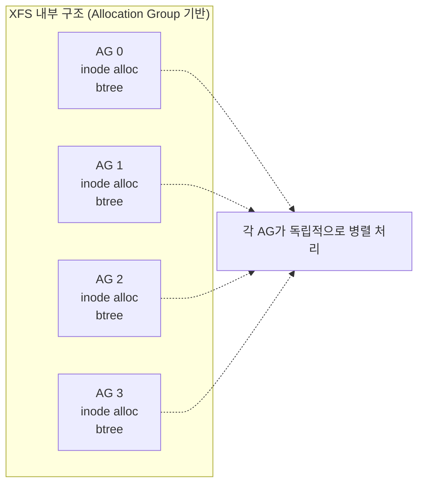
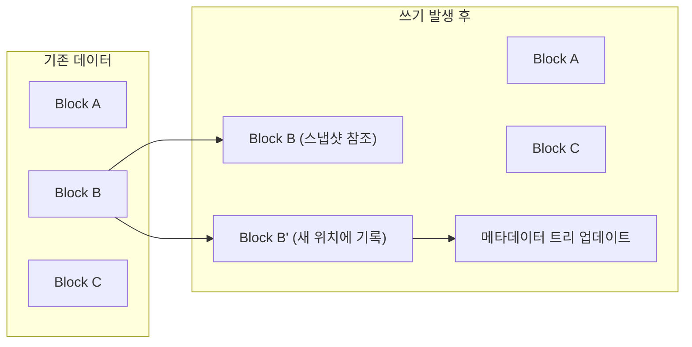
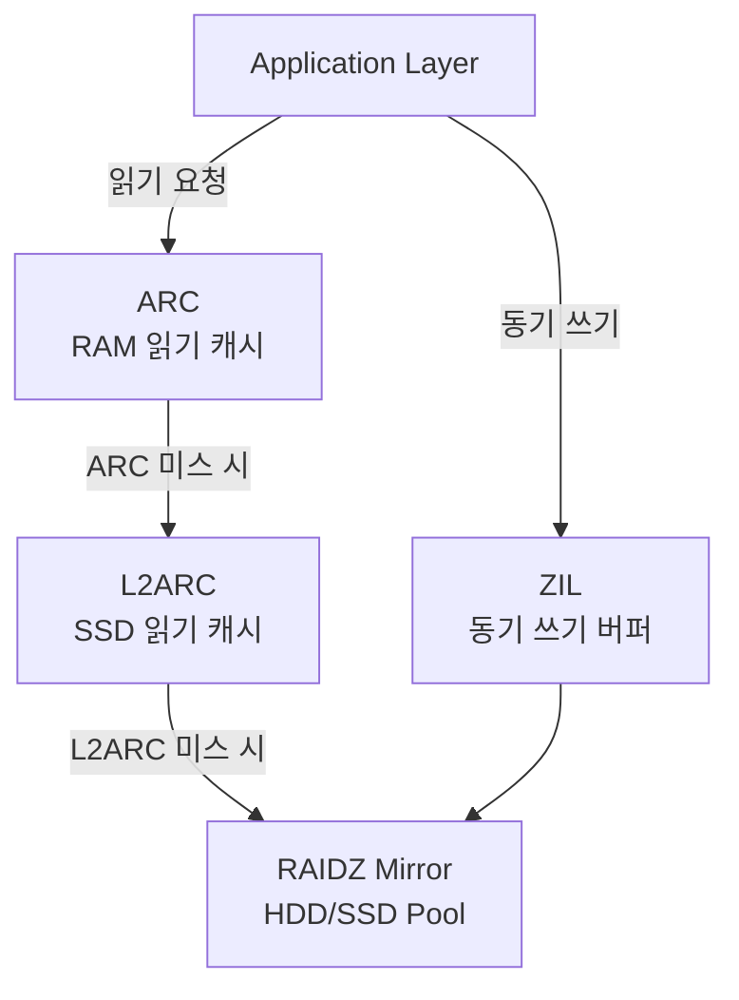
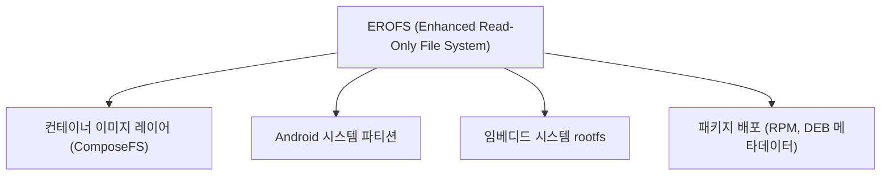

# 파일시스템 선택 가이드: ext4, XFS, Btrfs, ZFS 완전 비교

파일시스템 선택은 운영 중 변경이 어려운 결정이다.
워크로드 특성에 맞는 파일시스템을 처음부터 올바르게
선택하는 것이 장기 운영 안정성의 핵심이다.

---

## 1. 비교 요약표

| 특성 | ext4 | XFS | Btrfs | ZFS |
|------|------|-----|-------|-----|
| **커널 통합** | 네이티브 | 네이티브 | 네이티브 | DKMS (CDDL) |
| **최대 FS 크기** | 1 EiB | 16 EiB | 16 EiB | 256 ZiB |
| **최대 파일 크기** | 16 TiB | 8 EiB | 16 EiB | 16 EiB |
| **저널링** | ✅ | ✅ | COW | COW |
| **스냅샷** | ❌ | ❌ | ✅ | ✅ |
| **투명 압축** | ❌ | ❌ | ✅ | ✅ |
| **중복 제거** | ❌ | ❌ | ❌ | ✅ (RAM 집약) |
| **내장 RAID** | ❌ | ❌ | ⚠️ (RAID5/6 미권장) | ✅ RAID-Z |
| **온라인 축소** | ❌ | ❌ | ✅ | ❌ |
| **체크섬** | 메타데이터만 | 메타데이터만 | ✅ 데이터+메타 | ✅ 데이터+메타 |
| **RAM 요구사항** | 낮음 | 낮음 | 낮음 | 높음 |
| **성숙도** | 매우 높음 | 높음 | 중간 | 높음 |
| **RHEL 기본** | ❌ | ✅ (RHEL 7+) | ❌ | ❌ |
| **Ubuntu 기본** | ✅ | ❌ | ❌ | 선택적 |

### 용도별 빠른 선택 가이드

```
워크로드 / 환경           → 권장 파일시스템
─────────────────────────────────────────────
일반 서버 / 부팅 볼륨     → ext4
RHEL 계열 데이터베이스    → XFS
대용량 순차 I/O / 스트리밍 → XFS
스냅샷 기반 백업 환경     → Btrfs or ZFS
NAS / 고신뢰 스토리지     → ZFS
컨테이너 이미지 레이어    → overlayfs(ext4/xfs 위에)
읽기 전용 컨테이너 FS     → EROFS
메모리 기반 임시 공간     → tmpfs
```

---

## 2. ext4

### 특징

ext4는 ext3의 후속으로, 2008년 Linux 2.6.28에 통합됐다.
20년 이상의 운영 이력으로 가장 검증된 파일시스템이다.
커널 네이티브 지원으로 패치나 외부 모듈이 불필요하다.

### 용량 스펙

| 항목 | 값 |
|------|-----|
| 최대 파일시스템 크기 | 1 EiB (exabyte) |
| 최대 파일 크기 | 16 TiB |
| 최대 서브디렉토리 수 | 65,000개 (dir_nlink 활성 시 무제한) |
| 최대 파일명 길이 | 255 bytes |

### 저널링 모드

```
data=journal   가장 안전. 데이터+메타 모두 저널
               성능 최하. 서버 운영에는 사용 안 함

data=ordered   기본값. 데이터 먼저 쓴 후 메타 커밋
               안전성과 성능의 균형

data=writeback 메타데이터만 저널. 가장 빠름
               배터리 백업 캐시 환경에서 권장
```

### 주요 마운트 옵션

```bash
# 성능 최적화 (SSD, 배터리 백업 RAID 컨트롤러 확인 필수)
# data=writeback + commit=60 조합은 비정상 종료 시
# 데이터 손실 윈도우 60초 + 파일 오염 가능성이 있다
# 배터리 캐시(BBWC/FBWC) 없이 절대 사용 금지
/dev/sda1 /data ext4 \
  noatime,data=writeback,commit=60 0 2

# 일반 서버 (균형)
/dev/sda1 /data ext4 \
  noatime,data=ordered,discard 0 2

# 부팅 볼륨 (안전성 우선)
/dev/sda1 / ext4 \
  errors=remount-ro,relatime 0 1
```

| 옵션 | 효과 | 주의 |
|------|------|------|
| `noatime` | 읽기 시 atime 갱신 생략 | 일부 앱(mutt 등) 호환 확인 |
| `data=writeback` | 메타데이터만 저널 | 비정상 종료 시 구파일에 새 데이터 혼입 가능 |
| `barrier=0` | 쓰기 순서 강제 비활성 | 실질적 deprecated, 배터리 캐시 필수 |
| `commit=60` | 저널 커밋 주기 60초 | 데이터 손실 윈도우 증가 |
| `discard` | SSD TRIM 활성 | HDD에선 무의미, 일부 SSD에서 성능 저하 |

### 운영 도구

```bash
# 파일시스템 점검
e2fsck -f /dev/sda1

# 온라인 파일시스템 크기 확장
resize2fs /dev/sda1

# 파일시스템 정보 확인
tune2fs -l /dev/sda1 | grep -E "state|errors|features"

# 저널링 모드 변경 (언마운트 상태)
tune2fs -o journal_data_writeback /dev/sda1
```

### 적합한 용도

- 부팅 파티션 (`/boot`, `/`)
- 일반 범용 서버, 임베디드 Linux
- 데비안 계열 기본 파일시스템 환경
- 검증된 안정성이 최우선인 환경

---

## 3. XFS

### 특징

XFS는 1993년 SGI가 IRIX용으로 개발했으며,
2001년 Linux 커널에 포팅됐다.
RHEL 7(2014)부터 기본 파일시스템으로 채택됐다.



### 핵심 기능

| 기능 | 설명 |
|------|------|
| **Extent 기반 할당** | 연속 블록 범위로 관리. 단편화 최소화 |
| **지연 할당** | 실제 디스크 쓰기 시까지 블록 할당 지연 |
| **Allocation Group** | 병렬 I/O에 독립 잠금으로 확장성 확보 |
| **Reflink** | 즉시 CoW 파일 복사 (커널 4.16+) |
| **inode64** | 64비트 inode 번호 (수십억 파일 지원) |
| **bigtime** | 타임스탬프 2486년까지 지원 (XFS v5) |

### 주요 마운트 옵션

```bash
# 고성능 데이터 스토리지
# inode64는 커널 3.7+에서 기본값 (명시 불필요)
/dev/sdb1 /data xfs \
  noatime,largeio,logbsize=256k 0 2

# NVMe SSD 최적화
/dev/nvme0n1p1 /data xfs \
  noatime,discard 0 2
```

| 옵션 | 효과 |
|------|------|
| `largeio` | 대용량 순차 I/O 최적화 |
| `inode64` | inode 분산 배치 (커널 3.7+에서 기본값, 생략 가능) |
| `logbsize=256k` | 로그 버퍼 크기 증가 (대용량 워크로드) |

> **`nobarrier` 제거됨**: 커널 4.19에서 해당 옵션 파싱 코드가
> 완전 제거됐다. fstab에 기입 시 마운트 실패가 발생한다.
> 배터리 캐시 환경에서도 별도 옵션 없이 동작한다.

### 운영 도구

```bash
# 파일시스템 점검 (언마운트 필요)
xfs_repair /dev/sdb1

# 온라인 크기 확장 (축소 불가!)
xfs_growfs /data

# 조각 모음
xfs_fsr /data

# 파일시스템 정보
xfs_info /data

# 실시간 I/O 통계
xfs_io -c "statfs" /data
```

> **경고**: XFS는 파티션 축소가 불가능하다.
> 볼륨 확장 전 반드시 스토리지 계획을 수립할 것.
> 손상 시 `xfs_repair` (e2fsck 아님) 를 사용한다.

### 적합한 용도

- RHEL/Rocky/AlmaLinux 기반 서버 (기본값)
- 대용량 파일 처리 (영상, 로그, 백업)
- 고성능 병렬 I/O (HPC, 데이터베이스)
- 수백만 파일 이상 디렉토리 환경

---

## 4. Btrfs

### Copy-on-Write 구조

Btrfs는 B-tree + CoW 기반으로 설계됐다.
쓰기 시 기존 데이터를 덮어쓰지 않고 새 위치에 기록한다.
이를 통해 스냅샷, 압축, 체크섬이 자연스럽게 구현된다.



### 주요 기능

| 기능 | 상태 | 설명 |
|------|------|------|
| 스냅샷 | ✅ 안정 | 즉시 생성, 증분 send/receive |
| 서브볼륨 | ✅ 안정 | 독립 마운트 포인트 |
| 투명 압축 | ✅ 안정 | zstd/lzo/zlib 지원 |
| RAID 0/1/10 | ✅ 안정 | 프로덕션 사용 가능 |
| **RAID 5/6** | ⚠️ **미권장** | RAID5 부분 완화(커널 6.2), RAID6 미해결 |
| 온라인 축소 | ✅ 안정 | `btrfs filesystem resize` |
| 온라인 balance | ✅ 안정 | 데이터 재분배 |
| scrub | ✅ 안정 | 자동 데이터 무결성 검사 |

> **RAID 5/6 상태 (2025 기준)**:
> RAID5는 커널 6.2에서 full RMW 사이클 + 체크섬 검증이 추가되어
> 주요 write hole 경로가 부분 완화됐다.
> RAID6는 여전히 개발 중이며 프로덕션 미권장 상태 유지.
> 프로덕션에서는 RAID 1/10 또는 별도 mdadm/LVM을 사용할 것.

### 서브볼륨 레이아웃

Fedora/openSUSE가 채택한 표준 레이아웃:

```bash
# 서브볼륨 생성 (설치 시 레이아웃 예시)
btrfs subvolume create /mnt/@        # root
btrfs subvolume create /mnt/@home    # /home
btrfs subvolume create /mnt/@snapshots
btrfs subvolume create /mnt/@var_log

# /etc/fstab 예시
/dev/sda1  /      btrfs  subvol=@,noatime,compress=zstd:1      0 0
/dev/sda1  /home  btrfs  subvol=@home,noatime,compress=zstd:3  0 0
```

### 투명 압축 설정

```bash
# 마운트 옵션으로 압축 활성화
mount -o compress=zstd:1 /dev/sda1 /data   # 빠른 압축 (기본 권장)
mount -o compress=zstd:3 /dev/sda1 /data   # 균형
mount -o compress=zstd:9 /dev/sda1 /data   # 최대 압축

# 기존 파일 재압축
btrfs filesystem defragment -r -v \
  -czstd /data

# 압축률 확인
compsize /data
```

| 압축 알고리즘 | 특성 |
|--------------|------|
| `zstd:1` | 빠른 속도, 적당한 압축. 일반 권장 |
| `zstd:3` | 기본값. 속도/압축 균형 |
| `lzo` | 최고 속도, 낮은 압축률 |
| `zlib` | 높은 압축률, 느린 속도 |

### 스냅샷과 증분 백업

```bash
# 읽기 전용 스냅샷 생성
btrfs subvolume snapshot -r \
  /data /snapshots/data-$(date +%Y%m%d)

# 증분 백업 (send/receive)
# 초기 전송
btrfs send /snapshots/data-20260101 \
  | ssh backup-server btrfs receive /backup

# 증분 전송 (차분만)
btrfs send -p /snapshots/data-20260101 \
  /snapshots/data-20260417 \
  | ssh backup-server btrfs receive /backup
```

### 운영 명령

```bash
# 정기 scrub (데이터 무결성 검사)
btrfs scrub start /data
btrfs scrub status /data

# 디스크 사용량 확인
btrfs filesystem usage /data

# balance (디스크 추가 후 재분배)
btrfs balance start \
  -dusage=50 /data

# 서브볼륨 목록
btrfs subvolume list /data
```

### 적합한 용도

- 데스크탑, 개발 워크스테이션
- Fedora, openSUSE Tumbleweed (기본값)
- 스냅샷 기반 시스템 롤백 환경
- 단일 디스크에서 압축 + 스냅샷이 필요한 경우

---

## 5. ZFS (OpenZFS)

### OpenZFS 2.3 (2025년 1월 릴리즈)

OpenZFS 2.3은 세 가지 주요 기능을 추가했다:

| 기능 | 설명 |
|------|------|
| **RAIDZ Expansion** | 기존 RAIDZ vdev에 드라이브 1개씩 추가 가능 |
| **Fast Dedup** | 중복 제거 메타데이터 90% 축소, RAM 제약 자동 관리 |
| **Direct I/O** | ARC 우회. 자체 캐시를 가진 DB 앱에 적합 |

### 스토리지 계층 구조



### RAIDZ 구성 가이드

| RAIDZ 유형 | 패리티 | 최소 디스크 | 허용 장애 | 사용 효율 |
|-----------|--------|------------|----------|----------|
| Mirror | - | 2 | 1 (n-1) | 50% |
| RAIDZ1 | 1 | 3 | 1 | (n-1)/n |
| RAIDZ2 | 2 | 4 | 2 | (n-2)/n |
| RAIDZ3 | 3 | 5 | 3 | (n-3)/n |
| dRAID1 | 1 | 3+ | 1 | 유연 |

> **dRAID (분산 RAIDZ)**: OpenZFS 2.1+ 도입.
> 패리티를 모든 디스크에 분산하여 리빌드 속도를 크게 향상한다.
> 대규모 디스크 풀(8개 이상)에서 효과적이다.

### 기본 운영

```bash
# 풀 생성
# RAIDZ2 (4+2 디스크)
zpool create tank raidz2 \
  sda sdb sdc sdd sde sdf

# 미러 풀
zpool create tank \
  mirror sda sdb \
  mirror sdc sdd

# 데이터셋 생성 및 설정
zfs create tank/data
zfs create -o compression=lz4 tank/logs
zfs create -o compression=zstd tank/archive
zfs create -o quota=100G tank/team-a

# SLOG (ZIL 분리) 추가
zpool add tank log mirror nvme0 nvme1

# L2ARC 추가
zpool add tank cache ssd0
```

### 스냅샷과 복제

```bash
# 스냅샷 생성
zfs snapshot tank/data@2026-04-17

# 재귀 스냅샷 (자식 데이터셋 포함)
zfs snapshot -r tank@2026-04-17

# 스냅샷 롤백
zfs rollback tank/data@2026-04-17

# 원격 복제
zfs send tank/data@2026-04-17 \
  | ssh backup zfs receive pool/data

# 증분 복제
zfs send -i \
  tank/data@2026-04-16 \
  tank/data@2026-04-17 \
  | ssh backup zfs receive pool/data

# 변경사항 확인
zfs diff tank/data@2026-04-16 tank/data
```

### 투명 압축

```bash
# 압축 설정 (생성 후 변경 시 신규 데이터에만 적용)
zfs set compression=lz4 tank/data       # 일반 데이터
zfs set compression=zstd tank/archive   # 아카이브
zfs set compression=zstd-3 tank/logs    # 로그

# 압축 비율 확인
zfs get compressratio tank/data
```

| 압축 알고리즘 | 적합한 용도 |
|--------------|-----------|
| `lz4` | 일반 데이터. 빠름, 적당한 압축 |
| `zstd` | 균형. 대부분의 상황에서 권장 |
| `zstd-3` | 로그, 텍스트. 높은 압축률 |
| `gzip-9` | 최대 압축. 처리량 매우 낮음 |

### 풀 유지보수

```bash
# 정기 scrub (매주 권장)
zpool scrub tank
zpool status tank  # scrub 결과 확인

# 풀 상태 상세 확인
zpool status -v tank

# 디스크 교체 (장애 시)
zpool replace tank sda /dev/sde

# 성능 통계
zpool iostat -v tank 1
```

### 라이선스 이슈

ZFS는 CDDL(Common Development and Distribution License)로
배포된다. Linux 커널의 GPL v2와 라이선스가 호환되지 않아
커널 트리에 직접 통합되지 않는다.

| 배포판 | ZFS 지원 방식 |
|--------|--------------|
| Ubuntu | `zfsutils-linux` + DKMS (공식 지원) |
| Debian | `zfs-dkms` 패키지 제공 |
| RHEL/Rocky | 공식 미지원. ZFS on Linux 수동 설치 |
| FreeBSD | 커널 네이티브 통합 (라이선스 문제 없음) |
| Proxmox VE | ZFS 공식 지원 (권장 스토리지) |

```bash
# Ubuntu에서 ZFS 설치
apt install zfsutils-linux

# 커널 모듈 로드 확인
lsmod | grep zfs
# zfs: module license 'CDDL' taints kernel
# → 커널 taint는 라이선스 표시이며 기능 영향 없음
```

### 적합한 용도

- NAS, 스토리지 서버 (TrueNAS, Proxmox)
- 고신뢰 미션 크리티컬 데이터
- 중복 제거가 필요한 가상화 스토리지
- 대규모 장기 아카이브

---

## 6. 특수 목적 파일시스템

### EROFS (Enhanced Read-Only File System)

Linux 5.4+에서 지원. 읽기 전용 용도에 최적화됐다.



특징: 내장 압축, 청크 기반 데이터 중복 제거,
파일 기반 lazy-pull 컨테이너 시작 지원 (Linux 6.12+).

### tmpfs

RAM과 스왑을 사용하는 메모리 기반 파일시스템이다.

```bash
# tmpfs 마운트
mount -t tmpfs -o size=4G,mode=1777 tmpfs /tmp

# /etc/fstab
tmpfs /tmp      tmpfs defaults,size=2G,mode=1777  0 0
tmpfs /run      tmpfs defaults,size=256M           0 0
tmpfs /dev/shm  tmpfs defaults,size=1G             0 0
```

재부팅 시 데이터가 소멸한다.
빌드 캐시, 세션 데이터, 컨테이너 임시 레이어에 적합하다.

---

## 7. 실무 선택 가이드

### 워크로드별 권장

| 워크로드 | 권장 FS | 이유 |
|---------|---------|------|
| MySQL / PostgreSQL | XFS | 고성능 랜덤 I/O, RHEL 기본 |
| 오브젝트 스토리지 | XFS | 대용량 파일, 병렬 I/O |
| 컨테이너 런타임 | ext4 또는 XFS | overlayfs 지원 안정성 |
| 시스템 부팅 볼륨 | ext4 | 검증된 안정성 |
| NAS / 미디어 서버 | ZFS | 체크섬 + 스냅샷 + RAIDZ |
| 개발 워크스테이션 | Btrfs | 스냅샷 롤백 편의성 |
| 백업 대상 | ZFS 또는 Btrfs | send/receive 증분 복제 |
| CI 빌드 캐시 | tmpfs | 속도 최우선 |
| 컨테이너 이미지 | EROFS | 읽기 전용 최적화 |

### 클라우드 환경의 기본값

| 환경 | 기본 파일시스템 | 비고 |
|------|--------------|------|
| AWS EBS (Amazon Linux 2) | XFS | AL2부터 XFS 기본 |
| AWS EBS (Ubuntu) | ext4 | 우분투 기본 |
| GCP Persistent Disk | ext4 | 기본 이미지 |
| Azure Disk (RHEL) | XFS | RHEL 기본 |
| Kubernetes PVC (일반) | ext4 또는 XFS | StorageClass에 따름 |

### 마이그레이션 고려사항

```
ext4 → XFS 마이그레이션
─────────────────────────
1. XFS로 새 파티션/볼륨 생성
2. rsync --archive 로 데이터 복사
3. /etc/fstab UUID 업데이트
4. initramfs 재생성 (update-initramfs -u)
5. 재부팅 후 검증

⚠️  in-place 변환 불가. 반드시 새 볼륨으로 복사해야 함

ZFS → Btrfs (또는 반대)
─────────────────────────
동일하게 데이터 복사 방식만 가능.
스냅샷/서브볼륨 구조는 수동으로 재구성 필요.
```

### 파일시스템별 fsck 도구

| 파일시스템 | 점검 도구 | 복구 명령 |
|-----------|---------|---------|
| ext4 | `e2fsck` | `e2fsck -f -y /dev/sdX` |
| XFS | `xfs_repair` | `xfs_repair /dev/sdX` |
| Btrfs | `btrfs check` | `btrfs check /dev/sdX` (읽기 전용 진단) |
| ZFS | `zpool scrub` | `zpool scrub <pool>` |

---

## 참고 자료

- [ext4 Admin Guide — Linux Kernel Documentation](https://docs.kernel.org/admin-guide/ext4.html)
  (확인: 2026-04-17)
- [ext4 Mount Options — kernel.org](https://www.kernel.org/doc/Documentation/filesystems/ext4.txt)
  (확인: 2026-04-17)
- [XFS — Red Hat Enterprise Linux 9 문서](https://docs.redhat.com/en/documentation/red_hat_enterprise_linux/9/html/managing_file_systems/overview-of-available-file-systems_managing-file-systems)
  (확인: 2026-04-17)
- [Btrfs Status — btrfs.readthedocs.io](https://btrfs.readthedocs.io/en/latest/Status.html)
  (확인: 2026-04-17)
- [Btrfs RAID5/6 경고 — Phoronix](https://www.phoronix.com/news/Btrfs-Warning-RAID5-RAID6)
  (확인: 2026-04-17)
- [OpenZFS 2.3 릴리즈 — The Register](https://www.theregister.com/2025/01/23/openzfs_23_raid_expansion/)
  (확인: 2026-04-17)
- [OpenZFS GitHub Releases](https://github.com/openzfs/zfs/releases)
  (확인: 2026-04-17)
- [ZFS ARC/L2ARC/SLOG 아키텍처 — Klara Systems](https://klarasystems.com/articles/performance-tuning-arc-l2arc-slog/)
  (확인: 2026-04-17)
- [EROFS — Linux Kernel Documentation](https://docs.kernel.org/filesystems/erofs.html)
  (확인: 2026-04-17)
- [EROFS Overview — erofs.docs.kernel.org](https://erofs.docs.kernel.org/en/latest/)
  (확인: 2026-04-17)
- [ZFS CDDL/GPL 라이선스 이슈 — Software Freedom Conservancy](https://sfconservancy.org/blog/2016/feb/25/zfs-and-linux/)
  (확인: 2026-04-17)
- [Linux 6.12~7.0 ext4/XFS 벤치마크 — Phoronix](https://www.phoronix.com/review/linux-612-linux-70-xfs-ext4)
  (확인: 2026-04-17)
