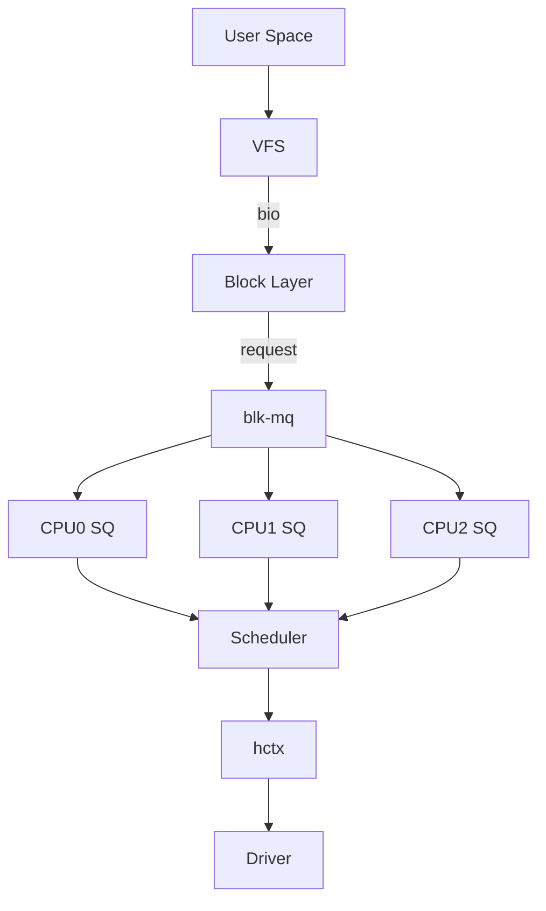

# 디스크 I/O 스케줄러 (none, mq-deadline, kyber, bfq)

스토리지 성능의 첫 번째 튜닝 포인트.
I/O 스케줄러는 프로세스들이 요청한 읽기/쓰기를
드라이버에 전달하기 전에 **정렬·병합·우선순위화**하는
커널 블록 레이어의 핵심 컴포넌트다.

> NVMe 시대에 "스케줄러는 필요 없다"는 말은
> 절반만 맞다. 워크로드와 디바이스 유형에 따라
> 올바른 선택이 수십 % 성능 차이를 만든다.

---

## 1. 커널 블록 레이어 구조

Linux 5.0 이후, 단일 큐(sq) 방식은 완전히 제거되고
**blk-mq (Multi-Queue Block I/O)** 만 남았다.



| 계층 | 설명 |
|------|------|
| User Space | `read`, `write`, `io_uring` 시스템 호출 |
| VFS | VFS 및 페이지 캐시 |
| Block Layer | bio 분할/병합을 수행하는 제네릭 블록 레이어 |
| blk-mq | Software Queue(CPU당 1개)를 관리 |
| Scheduler | `none`, `mq-deadline`, `bfq`, `kyber` 중 선택 |
| hctx | 장치 제출 큐에 매핑되는 하드웨어 큐 |
| Driver | NVMe, SCSI 등 스토리지 드라이버 |

### blk-mq의 핵심 개념

| 구성 요소 | 설명 |
|-----------|------|
| Software Queue (SQ) | CPU당 1개, lock-free. bio를 request로 변환 |
| Hardware Queue (HctX) | 디바이스 제출 큐와 1:1 매핑. NVMe는 N:N 가능 |
| Tag 시스템 | 각 요청에 정수 태그 부여, 완료 시 재사용 |
| I/O Scheduler | SQ→hctx 사이에 삽입. `none`이면 직통 |

**blk-mq 도입 이전(≤ 4.x) 단일 큐 방식의 문제**:
전역 lock 하나가 모든 I/O를 직렬화 →
NVMe(수백만 IOPS)에서 CPU 병목이 심각했다.

---

## 2. 스케줄러 종류 비교

### 2.1 한눈에 보기

| 스케줄러 | 도입 커널 | 알고리즘 | 주목적 | HDD | SATA SSD | NVMe |
|---------|-----------|----------|--------|:---:|:--------:|:----:|
| **none** | 5.0 | Passthrough (FIFO) | 최고 처리량 | - | △ | ✅ |
| **mq-deadline** | 5.0 | 정렬 + 만료 기한 | 레이턴시 보장 | ✅ | ✅ | △ |
| **bfq** | 5.0 | Budget Fair Queueing | 공정성·레이턴시 | ✅ | ✅ | - |
| **kyber** | 4.12 | 토큰 버킷 | 저오버헤드 레이턴시 | - | △ | ✅ |

### 2.2 상세 비교

#### none (Passthrough)

- **알고리즘**: 요청을 그대로 드라이버로 전달
- **병합·정렬**: 없음 (커널 bio 병합만 적용)
- **적합 워크로드**: NVMe SSD, 고성능 All-Flash
- **원리**: 장치 자체 내부 FTL·NCQ가 스케줄링 담당
- **주의**: HDD에 `none` 적용 시 탐색 거리 증가로
  처리량이 크게 저하된다

#### mq-deadline

- **알고리즘**: 읽기·쓰기 별도 FIFO + LBA 정렬 큐
- **만료 기한**: 읽기 500ms, 쓰기 5000ms (기본값)
  기한 초과 시 강제 처리 → starvation 방지
- **적합 워크로드**: 데이터베이스(읽기 우선),
  SATA SSD, SAS HDD, 가상화 게스트
- **특징**: 읽기 배치가 쓰기 배치보다 기본 우선

#### bfq (Budget Fair Queueing)

- **알고리즘**: 프로세스별 I/O 큐에 버짓(request 수)
  할당. 만료 후 순환 서비스 (C-LOOK 유사)
- **공정성**: 단일 프로세스가 대역폭을 독점 불가
- **적합 워크로드**: 인터랙티브 데스크톱,
  멀티테넌트 스토리지, HDD, SATA SSD
- **단점**: 프로세스 추적 오버헤드 → NVMe에서
  CPU 부하 증가, 처리량 저하 가능

#### kyber

- **알고리즘**: 읽기/쓰기/discard 별 토큰 버킷
- **제어 방식**: 요청 재정렬 대신 in-flight 수 제한
  으로 목표 레이턴시 유지 (피드백 루프)
- **적합 워크로드**: 고성능 NVMe, 레이턴시에 민감한
  SSD 워크로드 (`none`과 거의 동등한 처리량)
- **특징**: 병합 없음, 매우 낮은 스케줄러 오버헤드

---

## 3. 스케줄러 확인 및 변경

### 3.1 현재 스케줄러 확인

```bash
# 단일 장치 확인
cat /sys/block/nvme0n1/queue/scheduler
# 출력 예: [none] mq-deadline kyber bfq
#          ^^^^^^ 현재 활성 스케줄러

# 모든 블록 장치 일괄 확인
for dev in /sys/block/*/queue/scheduler; do
  printf "%-20s %s\n" "${dev%/queue*}" "$(cat $dev)"
done
```

### 3.2 런타임 변경 (재부팅 시 초기화됨)

```bash
# NVMe에 none 설정
echo none > /sys/block/nvme0n1/queue/scheduler

# HDD에 mq-deadline 설정
echo mq-deadline > /sys/block/sda/queue/scheduler

# 설정 확인
cat /sys/block/nvme0n1/queue/scheduler
# [none] mq-deadline kyber bfq
```

### 3.3 udev 규칙으로 영구 설정 (권장)

`/etc/udev/rules.d/60-io-scheduler.rules` 파일을
생성한다:

```bash
# NVMe: 내부 큐잉에 맡긴다 → none
ACTION=="add|change", KERNEL=="nvme[0-9]*n[0-9]*", \
  ATTR{queue/scheduler}="none"

# SATA/SAS SSD (non-rotational): mq-deadline
ACTION=="add|change", KERNEL=="sd[a-z]*", \
  ATTR{queue/rotational}=="0", \
  ATTR{queue/scheduler}="mq-deadline"

# HDD (rotational): mq-deadline
ACTION=="add|change", KERNEL=="sd[a-z]*", \
  ATTR{queue/rotational}=="1", \
  ATTR{queue/scheduler}="mq-deadline"

# VirtIO 블록 (가상 머신 게스트): none
ACTION=="add|change", KERNEL=="vd[a-z]*", \
  ATTR{queue/scheduler}="none"
```

규칙 적용:

```bash
sudo udevadm control --reload-rules
sudo udevadm trigger --type=devices --subsystem-match=block
```

### 3.4 커널 파라미터 방식 (blk-mq에서 동작하지 않음, 사용 금지)

> **주의**: `elevator=` 파라미터는 blk-mq 전환(커널 5.x) 이후
> **완전히 제거**되었다. 설정해도 커널이 무시하며,
> dmesg에 "does not have any effect anymore" 메시지가 출력된다.
> udev 규칙(3.3절)을 사용해야 한다.

```
# ❌ 아래 설정은 효과 없음 — 사용하지 말 것
# GRUB_CMDLINE_LINUX="elevator=mq-deadline"
```

---

## 4. 스케줄러별 튜닝 파라미터

파라미터 경로: `/sys/block/<dev>/queue/iosched/`

### 4.1 mq-deadline

```bash
BASE=/sys/block/sda/queue/iosched

# 읽기 요청 만료 시간 (기본: 500ms)
# 낮출수록 읽기 레이턴시 보장, 처리량 감소
echo 300 > $BASE/read_expire

# 쓰기 요청 만료 시간 (기본: 5000ms)
# 낮출수록 쓰기 지연 방지, 높을수록 배치 쓰기 효율
echo 3000 > $BASE/write_expire

# 만료 전 배치 처리할 요청 수 (기본: 16)
# 높이면 처리량 증가, 낮추면 레이턴시 감소
echo 8 > $BASE/fifo_batch

# 읽기 배치 vs 쓰기 배치 교체 전 처리 수 (기본: 2)
echo 2 > $BASE/writes_starved
```

| 파라미터 | 기본값 | 범위 | 방향성 |
|---------|--------|------|--------|
| `read_expire` | 500ms | 1~ | 낮추면 레이턴시↓ |
| `write_expire` | 5000ms | 1~ | 높이면 처리량↑ |
| `fifo_batch` | 16 | 1~ | 높이면 처리량↑ |
| `writes_starved` | 2 | 1~ | 높이면 읽기 우선↑ |

### 4.2 bfq

```bash
BASE=/sys/block/sda/queue/iosched

# 큐 비움 후 대기 시간 (기본: 8000 μs = 8ms)
# HDD: 양수 유지. Flash/NVMe: 0으로 설정
echo 0 > $BASE/slice_idle

# 프로세스당 최대 버짓 (기본: 0 = 자동)
# 0이면 과거 I/O 패턴으로 자동 조정
echo 0 > $BASE/max_budget

# 인터랙티브 프로세스 레이턴시 우선 (기본: 1=활성)
# 데이터베이스 전용 서버라면 0으로 설정
echo 1 > $BASE/low_latency

# 엄격한 대역폭 보장 (기본: 0)
# 1로 설정 시 처리량 감소, fairness 강화
echo 0 > $BASE/strict_guarantees
```

| 파라미터 | 기본값 | 설명 |
|---------|--------|------|
| `slice_idle` | 8000μs | HDD: 유지, Flash: 0 |
| `max_budget` | 0 (자동) | 프로세스당 최대 요청 수 |
| `low_latency` | 1 | 인터랙티브 우선 모드 |
| `strict_guarantees` | 0 | 엄격한 공정성 강제 |

### 4.3 kyber

```bash
BASE=/sys/block/nvme0n1/queue/iosched

# 읽기 목표 레이턴시 (기본: 2ms = 2,000,000 ns)
# NVMe SSD에 맞게 낮춘다
echo 1000000 > $BASE/read_lat_nsec   # 1ms

# 쓰기 목표 레이턴시 (기본: 10ms = 10,000,000 ns)
echo 5000000 > $BASE/write_lat_nsec  # 5ms
```

| 파라미터 | 기본값 | 설명 |
|---------|--------|------|
| `read_lat_nsec` | 2,000,000 | 읽기 목표 레이턴시(ns) |
| `write_lat_nsec` | 10,000,000 | 쓰기 목표 레이턴시(ns) |

> kyber는 이 목표 레이턴시를 피드백 제어 루프로
> 유지하기 위해 in-flight I/O 깊이를 자동 조정한다.

---

## 5. 워크로드별 권장 설정

| 워크로드 | 디바이스 | 권장 스케줄러 | 핵심 파라미터 |
|---------|---------|-------------|-------------|
| 데이터베이스 OLTP | NVMe SSD | `none` | nr_requests=64, queue_depth=32 |
| 데이터베이스 OLTP | SATA SSD | `mq-deadline` | read_expire=200, fifo_batch=8 |
| 파일 서버 / NAS | HDD | `mq-deadline` | write_expire=3000, fifo_batch=32 |
| 인터랙티브 데스크톱 | HDD | `bfq` | low_latency=1, slice_idle=8000 |
| 인터랙티브 데스크톱 | SSD | `bfq` | low_latency=1, slice_idle=0 |
| 쿠버네티스 노드 | NVMe | `none` | nr_requests=64 |
| 쿠버네티스 노드 | SATA SSD | `mq-deadline` | read_expire=300 |
| 빌드 서버 (대용량 순차) | NVMe | `none` 또는 `kyber` | - |
| 가상화 호스트 | NVMe | `none` | (게스트 OS에서 스케줄링) |
| 백업 / 아카이브 | HDD | `mq-deadline` | fifo_batch=64, write_expire=10000 |

### 쿠버네티스 노드 DaemonSet 적용 예시

```yaml
# k8s-io-scheduler-tuning.yaml
apiVersion: apps/v1
kind: DaemonSet
metadata:
  name: io-scheduler-tuning
  namespace: kube-system
spec:
  selector:
    matchLabels:
      app: io-scheduler-tuning
  template:
    metadata:
      labels:
        app: io-scheduler-tuning
    spec:
      hostPID: false
      tolerations:
        - operator: Exists
      initContainers:
        - name: set-scheduler
          image: busybox:1.36
          securityContext:
            privileged: false
            capabilities:
              add: ["SYS_ADMIN"]
              drop: ["ALL"]
            readOnlyRootFilesystem: true
          command:
            - sh
            - -c
            - |
              for dev in /sys/block/nvme*n*; do
                [ -e "$dev/queue/scheduler" ] || continue
                echo none > "$dev/queue/scheduler"
              done
              for dev in /sys/block/sd*; do
                [ -e "$dev/queue/scheduler" ] || continue
                echo mq-deadline > "$dev/queue/scheduler"
              done
          volumeMounts:
            - name: sys
              mountPath: /sys
      containers:
        - name: pause
          image: registry.k8s.io/pause:3.9
      volumes:
        - name: sys
          hostPath:
            path: /sys
```

---

## 6. 레거시 vs 현대 MQ 스케줄러

Linux 5.0에서 단일 큐(SQ) 스케줄러가 제거되었다.

| 레거시 (≤ 4.x, SQ 전용) | 알고리즘 | 현대 (5.0+, blk-mq) |
|------------------------|---------|---------------------|
| `noop` | 정렬 없음, FIFO | `none` |
| `deadline` | 만료 기한 | `mq-deadline` |
| `cfq` | 공정 큐잉 | `bfq` |
| `as` (anticipatory) | 예측적 대기 | 제거, 대안 없음 |
| - | 토큰 버킷 | `kyber` (신규) |

| 항목 | 레거시 SQ | 현대 blk-mq |
|------|-----------|-------------|
| 큐 구조 | 전역 단일 큐 + lock | CPU당 SQ + lock-free |
| 확장성 | ~수십만 IOPS 한계 | 수백만 IOPS 가능 |
| NVMe 지원 | 병목 심각 | 최적화됨 |
| NUMA 인식 | 없음 | 있음 |
| 스케줄러 선택 | cfq/deadline/noop | none/mq-deadline/bfq/kyber |
| 커널 지원 | 5.3에서 deprecated, 5.8에서 제거 | 현재 유일한 방식 |

---

## 7. 성능 측정 (fio)

스케줄러 변경 전후 반드시 동일 조건에서 측정하라.

### 7.1 설치

```bash
# Ubuntu/Debian
apt install fio

# RHEL/CentOS/Fedora
dnf install fio
```

### 7.2 랜덤 읽기 IOPS (NVMe 스케줄러 비교)

```bash
# 스케줄러 설정 후 실행
echo none > /sys/block/nvme0n1/queue/scheduler

fio \
  --name=randread-iops \
  --filename=/dev/nvme0n1 \
  --direct=1 \
  --rw=randread \
  --bs=4k \
  --ioengine=libaio \
  --iodepth=32 \
  --numjobs=4 \
  --runtime=60 \
  --time_based \
  --group_reporting \
  --readonly
```

### 7.3 순차 쓰기 처리량 (HDD 스케줄러 비교)

```bash
echo mq-deadline > /sys/block/sda/queue/scheduler

fio \
  --name=seqwrite-throughput \
  --filename=/dev/sda \
  --direct=1 \
  --rw=write \
  --bs=1M \
  --ioengine=libaio \
  --iodepth=64 \
  --numjobs=1 \
  --runtime=60 \
  --time_based \
  --group_reporting
```

### 7.4 레이턴시 측정 (큐 깊이 1, 단일 스레드)

```bash
fio \
  --name=latency-test \
  --filename=/dev/nvme0n1 \
  --direct=1 \
  --rw=randread \
  --bs=4k \
  --ioengine=libaio \
  --iodepth=1 \
  --numjobs=1 \
  --runtime=60 \
  --time_based \
  --group_reporting \
  --readonly
```

### 7.5 fio 출력 해석

```
READ: bw=1023MiB/s (1073MB/s), 1023MiB/s-1023MiB/s
  iops=261888, runt= 30001msec
  clat (usec): min=56, max=12345, avg=120.5, stdev=45.2
               ^^^^ 완료 레이턴시: avg 120μs
  lat (usec): min=57, max=12346, avg=121.0
  clat percentiles (usec):
   | 50.00th=[  112],  75.00th=[  130]
   | 90.00th=[  155],  99.00th=[  245]
   | 99.90th=[  490], 99.99th=[ 1237]
   #             ^^^ P99 레이턴시가 핵심 지표
```

> P99/P999 레이턴시가 SLA 기준에서 중요하다.
> 평균값만 보지 말 것.

---

## 8. udev 완성 예시

`/etc/udev/rules.d/60-io-scheduler.rules`:

```bash
# ─── I/O Scheduler Rules ──────────────────────────
# NVMe: 내부 컨트롤러에 스케줄링 위임
ACTION=="add|change", KERNEL=="nvme[0-9]*n[0-9]*", \
  ATTR{queue/scheduler}="none"

# SATA/SAS SSD: mq-deadline (레이턴시 + 처리량 균형)
ACTION=="add|change", KERNEL=="sd[a-z]*", \
  ATTR{queue/rotational}=="0", \
  ATTR{queue/scheduler}="mq-deadline"

# HDD: mq-deadline (탐색 최적화 + starvation 방지)
ACTION=="add|change", KERNEL=="sd[a-z]*", \
  ATTR{queue/rotational}=="1", \
  ATTR{queue/scheduler}="mq-deadline"

# VirtIO (VM 게스트): none (하이퍼바이저가 스케줄링)
ACTION=="add|change", KERNEL=="vd[a-z]*", \
  ATTR{queue/scheduler}="none"

# MMC (eMMC/SD): mq-deadline
ACTION=="add|change", KERNEL=="mmcblk[0-9]*", \
  ATTR{queue/scheduler}="mq-deadline"
```

적용 및 검증:

```bash
# 규칙 재로드 및 트리거
udevadm control --reload-rules
udevadm trigger --type=devices --subsystem-match=block

# 결과 확인
for dev in /sys/block/*/queue/scheduler; do
  name=$(echo $dev | cut -d/ -f4)
  sched=$(cat $dev)
  echo "$name: $sched"
done
```

출력 예:

```
nvme0n1: [none] mq-deadline kyber bfq
sda:     mq-deadline [mq-deadline] kyber bfq
sdb:     mq-deadline [mq-deadline] kyber bfq
vda:     [none] mq-deadline kyber bfq
```

---

## 9. 운영 체크리스트

```
□ 장치 유형 확인 (NVMe / SATA SSD / HDD)
  cat /sys/block/<dev>/queue/rotational
  # 0 = SSD, 1 = HDD

□ 현재 스케줄러 확인
  cat /sys/block/<dev>/queue/scheduler

□ 워크로드 특성 파악
  - 랜덤 소규모 I/O (DB) → none 또는 mq-deadline
  - 순차 대용량 (백업) → mq-deadline
  - 인터랙티브 (데스크톱) → bfq

□ fio로 변경 전후 측정
  - IOPS, 처리량, P99 레이턴시 비교

□ udev 규칙으로 영구 설정

□ 재부팅 후 설정 유지 확인
```

---

## 참고 자료

- [Linux Kernel docs: blk-mq](https://docs.kernel.org/block/blk-mq.html)
  (확인: 2026-04-17)
- [Linux Kernel docs: BFQ I/O Scheduler](https://docs.kernel.org/block/bfq-iosched.html)
  (확인: 2026-04-17)
- [Linux Kernel docs: Switching Schedulers](https://docs.kernel.org/block/switching-sched.html)
  (확인: 2026-04-17)
- [Red Hat: Setting the disk scheduler (RHEL 9)](https://docs.redhat.com/en/documentation/red_hat_enterprise_linux/9/html/monitoring_and_managing_system_status_and_performance/setting-the-disk-scheduler_monitoring-and-managing-system-status-and-performance)
  (확인: 2026-04-17)
- [Ubuntu Wiki: Kernel/Reference/IOSchedulers](https://wiki.ubuntu.com/Kernel/Reference/IOSchedulers)
  (확인: 2026-04-17)
- [SPEC ICPE 2024: BFQ, Multiqueue-Deadline, or Kyber? Performance Analysis](https://atlarge-research.com/pdfs/2024-io-schedulers.pdf)
  (확인: 2026-04-17)
- [Phoronix: Linux 5.6 I/O Scheduler Benchmarks](https://www.phoronix.com/review/linux-56-nvme)
  (확인: 2026-04-17)
- [openSUSE: Tuning I/O Performance](https://doc.opensuse.org/documentation/leap/tuning/html/book-tuning/cha-tuning-io.html)
  (확인: 2026-04-17)
- [fio documentation](https://fio.readthedocs.io/en/latest/fio_doc.html)
  (확인: 2026-04-17)
