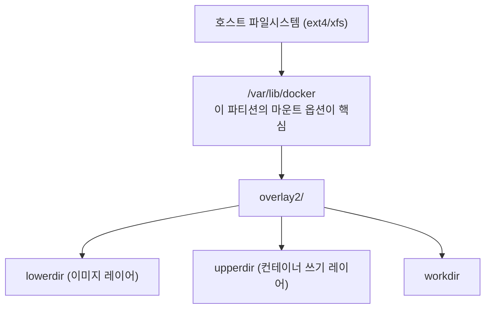

# 마운트 옵션 튜닝 (noatime, barrier)

마운트 옵션은 파일시스템의 **성능**과 **데이터 안전성** 사이의
트레이드오프를 직접 제어한다. 잘못 설정하면 크래시 후 데이터 손상,
혹은 불필요한 I/O 병목이 발생한다.

```
성능  ←—————————————————————→  안전성
noatime  relatime  lazytime  strictatime
nobarrier(위험!)  barrier=1(기본)
data=writeback  data=ordered  data=journal
```

---

## 1. 시간(atime) 관련 옵션

### 동작 원리

파일을 읽을 때마다 inode의 `atime` (access time)을 갱신한다.
HDD 시절에는 읽기 작업 1회가 쓰기 작업도 유발하는 셈이었다.
SSD/NVMe에서도 불필요한 write amplification과 수명 단축을 야기한다.

### 옵션 비교표

| 옵션 | 동작 방식 | 성능 영향 | 적합한 워크로드 |
|------|----------|----------|----------------|
| `strictatime` | 모든 읽기마다 atime 갱신 | 최저 (읽기마다 쓰기 발생) | 특수 감사 요구 환경 |
| `atime` (기본) | 커널 2.6.30 이후 = `relatime`과 동일 | - | - |
| `relatime` | mtime·ctime보다 오래됐을 때만 갱신, 24시간 이상 경과 시 갱신 | 중상 | 기본값, 대부분의 환경 |
| `noatime` | atime 갱신 안 함 | 최고 | 웹 서버, 빌드 서버, 메일 서버 |
| `lazytime` | 메모리 inode에만 갱신, flush 시 디스크 반영 | 높음 | SSD/NVMe, 빈번한 랜덤 쓰기 |

> **nodiratime**: 디렉터리 atime만 비활성화한다. `noatime`을 쓰면
> 디렉터리도 포함되므로 별도 지정 불필요.

### relatime 상세 동작

```
파일 읽기 발생
    ↓
atime < mtime 또는 atime < ctime?  →  YES → atime 갱신
    ↓ NO
마지막 atime 갱신 후 24시간 경과?  →  YES → atime 갱신
    ↓ NO
atime 갱신 안 함 (I/O 절약)
```

### lazytime 동작 원리

Linux 4.0+에서 도입. inode 변경이 발생하면 in-memory에만 기록하고,
아래 조건에서 실제 디스크에 flush한다.

- 파일이 sync/fsync 호출될 때
- 메모리에서 inode가 evict될 때
- 타임스탬프가 7일 이상 경과할 때

:::warning
`lazytime`과 `noatime`은 목적이 다르다.
`lazytime`은 atime 기록을 유지하면서 디스크 I/O만 줄인다.
`noatime`은 atime 기록 자체를 완전히 억제한다.
atime 기록이 전혀 필요 없다면 `noatime`을 단독으로 쓴다.
:::

### 실무 권장

```
일반 서버 / DB 서버     → noatime
SSD/NVMe 범용          → lazytime  (또는 noatime)
메일 서버 (atime 의존)  → relatime  (기본값 유지)
감사·컴플라이언스 환경  → strictatime
```

---

## 2. Write Barrier (쓰기 배리어) 옵션

### 배리어의 역할

저널 커밋의 디스크 상 순서를 강제한다.
휘발성(volatile) 쓰기 캐시가 있는 디스크에서 전원이 꺼져도
**저널 일관성**을 보장한다.

```
쓰기 요청 → [volatile write cache] → 실제 디스크
                    ↑
            barrier가 없으면 재배열 가능
            → 크래시 시 저널 불일치 → 데이터 손상
```

### barrier=1 vs barrier=0

| 항목 | `barrier=1` (기본) | `barrier=0` / `nobarrier` |
|------|-------------------|---------------------------|
| 저널 안전성 | 보장 | 보장 안 됨 |
| 성능 오버헤드 | ~3% (측정값) | 없음 |
| 크래시 후 위험 | 낮음 | **데이터 손상 가능** |
| 권장 여부 | 기본값 사용 권장 | 특수 환경만 허용 |

> Red Hat 공식 문서: "배리어의 이점은 일반적으로 비활성화로 얻는
> 성능 이득보다 크다."

### 쓰기 캐시가 있는 디스크에서의 위험성

```
[위험 시나리오 - barrier=0]

1. ext4가 저널 메타데이터 쓰기 요청
2. 컨트롤러 volatile cache가 재배열
3. 데이터 블록이 저널보다 먼저 디스크에 도달
4. 전원 차단
5. 부팅 → 저널이 불완전 → fsck 또는 데이터 손상
```

### BBU/FBWC가 있는 하드웨어 RAID에서의 예외

Battery-Backed Unit(BBU) 또는 Flash-Backed Write Cache(FBWC)가 있는
하드웨어 RAID 컨트롤러는 전원이 꺼져도 캐시 내용을 보존한다.
이 경우에만 `barrier=0`이 안전하며 성능 향상을 기대할 수 있다.

```
확인 방법 (MegaRAID 예시)
$ megacli -AdpBbuCmd -GetBbuStatus -aALL | grep "Battery State"
$ storcli /c0 show | grep "BBU"
```

:::danger
VM(가상머신) 게스트, 클라우드 EBS, NFS 위에서는 `nobarrier`를
**절대 사용하지 않는다.** 호스트의 캐시 동작을 게스트가 통제할 수
없기 때문이다.
:::

### 파일시스템별 barrier 옵션

| 파일시스템 | 활성화 | 비활성화 | 비고 |
|-----------|--------|---------|------|
| ext4 | `barrier=1` (기본) | `barrier=0` | 두 형태 모두 지원 |
| XFS | 항상 활성화 (강제) | ~~`nobarrier`~~ | **커널 4.19에서 옵션 제거** |
| Btrfs | 기본 활성화 | `nobarrier` | 지원하나 비권장 |

> XFS 중요: `barrier/nobarrier` 옵션은 커널 4.13에서 deprecated,
> **4.19에서 완전 제거**되었다. `/etc/fstab`에 남아 있으면
> 마운트 실패가 발생한다. XFS는 항상 barrier를 사용한다.

---

## 3. 중요 마운트 옵션 전체 요약표

### atime 계열

| 옵션 | 동작 | 권장 상황 |
|------|------|---------|
| `noatime` | atime 비활성화 | 고성능 서버, SSD |
| `relatime` | 조건부 atime 갱신 | 기본값, 범용 |
| `lazytime` | 지연 atime 갱신 | SSD, 빈번한 쓰기 |

### ext4 데이터 저널 모드

| 옵션 | 동작 | 성능 | 안전성 |
|------|------|------|--------|
| `data=journal` | 데이터+메타데이터 모두 저널 기록 | 최저 | 최고 |
| `data=ordered` | 데이터 먼저 → 메타데이터 저널 (기본) | 중간 | 높음 |
| `data=writeback` | 메타데이터 저널만, 데이터 순서 무보장 | 최고 | 낮음 |

:::warning `data=writeback` 주의
크래시 후 복구 시 파일에 이전 내용(garbage)이 나타날 수 있다.
DB 서버에서 DB 엔진이 자체 저널(WAL 등)을 사용하는 경우에만 고려한다.
:::

### TRIM 방식 비교

| 방식 | 설정 | 동작 | 권장 여부 |
|------|------|------|---------|
| `discard` (inline TRIM) | 마운트 옵션 | 파일 삭제마다 즉시 TRIM | 비권장 (I/O 지연 유발) |
| `fstrim` (batch TRIM) | systemd timer | 주기적으로 일괄 TRIM | **권장** |

```bash
# fstrim.timer 활성화 (권장 방식)
systemctl enable --now fstrim.timer

# 상태 확인
systemctl status fstrim.timer

# 수동 실행
fstrim -v /
```

> ArchWiki·Red Hat 모두 inline `discard`보다 `fstrim.timer`를 권장한다.
> NVMe는 특히 inline discard 비권장.

### 저널 커밋 간격

| 옵션 | 기본값 | 범위 | 트레이드오프 |
|------|--------|------|------------|
| ext4 `commit=N` | 5초 | 1~300초 | 높이면 성능↑, 크래시 시 손실 데이터↑ |
| Btrfs `commit=N` | 30초 | 1~300초 | 높이면 성능↑, 크래시 시 손실 데이터↑ |

> 300초 초과 시 커널 경고 출력. 프로덕션 권장: ext4 5~15초, btrfs 30~60초.

### 에러 처리 옵션

| 옵션 | 동작 | 권장 상황 |
|------|------|---------|
| `errors=remount-ro` | 오류 시 읽기 전용 재마운트 (기본) | 대부분의 프로덕션 |
| `errors=panic` | 오류 시 커널 패닉 | 금융·미션크리티컬 |
| `errors=continue` | 오류 무시하고 계속 | 비권장 (데이터 손상 위험) |

### 부팅 관련

| 옵션 | 동작 |
|------|------|
| `nofail` | 마운트 실패 시 부팅 계속 진행 |
| `x-systemd.automount` | 첫 접근 시 자동 마운트 |
| `x-systemd.device-timeout=30` | 디바이스 탐색 타임아웃 설정 |

---

## 4. 파일시스템별 권장 마운트 옵션

### ext4 — 일반 서버

```
noatime,errors=remount-ro,barrier=1
```

```ini
# /etc/fstab
UUID=xxxx  /  ext4  defaults,noatime,errors=remount-ro  0  1
```

### ext4 — DB 서버 (MySQL/PostgreSQL)

```
noatime,data=ordered,barrier=1,errors=remount-ro
```

DB 데이터 디렉터리는 DB 엔진이 fsync로 직접 안전성을 관리하므로
`data=ordered`(기본)를 유지한다. `data=writeback`은 DB WAL을
신뢰한다면 고려 가능하나 주의가 필요하다.

### XFS — 대용량 파일 서버

```
noatime,largeio,inode64
```

```ini
UUID=xxxx  /data  xfs  defaults,noatime,largeio  0  2
```

- `largeio`: 대용량 파일 I/O 최적화 (스트리밍 미디어, 백업 서버)
- `inode64`: 4TB 이상 볼륨에서 inode를 전체 공간에 분산 배치
  (커널 3.7+ 기본값이므로 명시는 선택 사항)
- XFS는 barrier 관련 옵션을 fstab에 쓰지 않는다 (커널이 제거함)

### Btrfs — 홈 서버 / 스냅샷 활용

```
noatime,compress=zstd:3,space_cache=v2,autodefrag
```

```ini
UUID=xxxx  /  btrfs
  subvol=@,noatime,compress=zstd:3,space_cache=v2,autodefrag  0  1
```

| Btrfs 옵션 | 설명 |
|-----------|------|
| `compress=zstd:3` | 투명 압축, 레벨 3 (균형) |
| `space_cache=v2` | 여유 공간 추적 v2 (성능↑) |
| `autodefrag` | 소파일 자동 조각 모음 (DB/VM 이미지 볼륨 사용 금지) |
| `subvol=@` | 서브볼륨 마운트 |

---

## 5. /etc/fstab 실전 예시

### UUID 확인

```bash
# 방법 1: blkid
blkid /dev/sda1

# 방법 2: ls -l
ls -l /dev/disk/by-uuid/

# 방법 3: lsblk
lsblk -f
```

### 서버 fstab 예시

```ini
# /etc/fstab — 프로덕션 서버 예시
# <UUID>  <mountpoint>  <fstype>  <options>  <dump>  <pass>

# 루트 파티션 (ext4)
UUID=a1b2c3d4-...  /  ext4
  noatime,errors=remount-ro  0  1

# 데이터 파티션 (XFS, 대용량)
UUID=e5f6a7b8-...  /data  xfs
  noatime,largeio,nofail  0  2

# NVMe SSD (ext4, lazytime)
UUID=c9d0e1f2-...  /var/lib/docker  ext4
  lazytime,errors=remount-ro  0  2

# 외장 디스크 (nofail로 부팅 보호)
UUID=11223344-...  /mnt/backup  ext4
  noatime,nofail,x-systemd.device-timeout=30  0  2
```

> **dump 필드**: 0 = 백업 안 함, 1 = 백업 대상  
> **pass 필드**: 0 = fsck 안 함, 1 = 루트, 2 = 그 외

### fstab 적용 및 검증

```bash
# fstab 파싱 오류 확인
findmnt --verify

# 전체 다시 마운트 (재부팅 없이)
mount -a

# 특정 파티션만 재마운트
mount -o remount,noatime /data
```

---

## 6. 마운트 옵션 확인 방법

### findmnt (권장)

```bash
# 트리 형태로 전체 마운트 출력
findmnt

# 특정 마운트 포인트 조회
findmnt /data

# 파일시스템별 필터
findmnt -t ext4
findmnt -t xfs

# 옵션 컬럼 포함 출력
findmnt -o TARGET,FSTYPE,OPTIONS

# VFS + FS 옵션 모두 출력
findmnt -o TARGET,VFS-OPTIONS,FS-OPTIONS

# fstab 검증
findmnt --verify --verbose
```

### /proc/mounts 직접 확인

```bash
# 현재 마운트된 옵션 확인
cat /proc/mounts

# 특정 장치만
grep '/dev/sda' /proc/mounts

# 현재 적용 중인 옵션 (systemd 환경)
cat /proc/self/mountinfo
```

### mount 명령

```bash
# 전체 마운트 목록
mount

# 타입별 필터
mount -t ext4

# 특정 디바이스
mount | grep /dev/nvme0n1
```

### 옵션 비교 스크립트

```bash
#!/bin/bash
# fstab 설정 vs 실제 마운트 비교
echo "=== fstab ==="
grep -v '^#' /etc/fstab | grep -v '^$'
echo ""
echo "=== 현재 마운트 ==="
findmnt -o TARGET,FSTYPE,OPTIONS --real
```

---

## 7. SSD / NVMe 특화 옵션

### 핵심 권장 옵션

```
noatime (또는 lazytime) + fstrim.timer + errors=remount-ro
```

### inline discard vs fstrim.timer

```
[inline discard - 비권장]
파일 삭제 → 즉시 TRIM 명령 → I/O 큐 간섭 → 지연 발생

[fstrim.timer - 권장]
파일 삭제 → 기록만 유지
    ↓ (주기적으로)
systemd fstrim.timer → 일괄 TRIM → I/O 영향 최소화
```

```bash
# fstrim 지원 여부 확인
lsblk -D
# DISC-GRAN, DISC-MAX가 0이 아니면 TRIM 지원

# 수동 TRIM (전체)
fstrim -a -v

# timer 확인
systemctl list-timers | grep fstrim
```

### NVMe 추가 고려사항

NVMe는 자체적으로 내부 GC(Garbage Collection)를 수행하며, inline
discard가 GC 스케줄을 방해할 수 있다. `fstrim.timer`만으로 충분하다.

```bash
# NVMe 상태 확인
nvme smart-log /dev/nvme0 | grep -E "percentage_used|data_units"

# 스케줄러: NVMe는 none 권장
cat /sys/block/nvme0n1/queue/scheduler
echo none > /sys/block/nvme0n1/queue/scheduler
```

---

## 8. 컨테이너 / 쿠버네티스 환경 고려사항

### 컨테이너 레이어 (overlay2)

Docker/containerd의 overlay2 스토리지 드라이버는 **호스트 파일시스템
위**에서 동작한다. 호스트 `/var/lib/docker`의 마운트 옵션이 컨테이너
I/O 성능에 직접 영향을 준다.



```ini
# /etc/fstab — 컨테이너 런타임 권장
UUID=xxxx  /var/lib/docker  ext4
  noatime,errors=remount-ro  0  2

UUID=xxxx  /var/lib/containerd  ext4
  noatime,errors=remount-ro  0  2
```

### Kubernetes PV (Persistent Volume)

PV는 `mountOptions` 필드로 마운트 옵션을 지정한다.

```yaml
apiVersion: v1
kind: PersistentVolume
metadata:
  name: pv-data
spec:
  mountOptions:
    - noatime
    - errors=remount-ro
  storageClassName: standard
  # ...
```

StorageClass 수준에서도 지정 가능하다.

```yaml
apiVersion: storage.k8s.io/v1
kind: StorageClass
metadata:
  name: fast-ssd
mountOptions:
  - noatime
  - lazytime
provisioner: kubernetes.io/no-provisioner
```

### rook-ceph (CephFS / RBD)

rook-ceph 기반 스토리지는 커널 모듈이 마운트를 처리한다.

```yaml
# CephFS StorageClass mountOptions 예시
apiVersion: storage.k8s.io/v1
kind: StorageClass
metadata:
  name: cephfs-ssd
provisioner: rook-ceph.cephfs.csi.ceph.com
mountOptions:
  - noatime
parameters:
  clusterID: rook-ceph
  # ...
```

> RBD(블록 디바이스)로 마운트된 ext4/xfs에서는 해당 파일시스템의
> 마운트 옵션이 그대로 적용된다.

### 주의사항 요약

```
컨테이너 환경에서 절대 금지
  ✗ barrier=0 (nobarrier) — VM/컨테이너에서 특히 위험
  ✗ data=writeback — 컨테이너 이미지 레이어에 사용 금지
  ✗ inline discard — 컨테이너 런타임 디렉터리에 사용 금지

컨테이너 환경 권장
  ✓ noatime — 컨테이너 레이어 읽기 부하 감소
  ✓ errors=remount-ro — 파일시스템 오류 시 안전 격리
  ✓ fstrim.timer — SSD 수명 관리
```

---

## 참고 자료

| 출처 | URL | 확인일 |
|------|-----|--------|
| Linux man page: ext4(5) | https://man7.org/linux/man-pages/man5/ext4.5.html | 2026-04-17 |
| Linux Kernel: ext4 General Information | https://www.kernel.org/doc/html/latest/admin-guide/ext4.html | 2026-04-17 |
| Linux Kernel: XFS Filesystem | https://docs.kernel.org/admin-guide/xfs.html | 2026-04-17 |
| Red Hat: Write Barriers (RHEL 7) | https://docs.redhat.com/en/documentation/red_hat_enterprise_linux/7/html/storage_administration_guide/writebarrieronoff | 2026-04-17 |
| SUSE: XFS nobarrier removed | https://www.suse.com/c/xfs-nobarrier-option-is-now-more-than-deprecated/ | 2026-04-17 |
| ArchWiki: Solid State Drive | https://wiki.archlinux.org/title/Solid_state_drive | 2026-04-17 |
| Debian Wiki: SSD Optimization | https://wiki.debian.org/SSDOptimization | 2026-04-17 |
| Opensource.com: noatime performance | https://opensource.com/article/20/6/linux-noatime | 2026-04-17 |
| Kubernetes: Mount Options (PV) | https://kubernetes.io/docs/concepts/storage/persistent-volumes/#mount-options | 2026-04-17 |
| Phoronix: EXT4 Tuning Benchmarks | https://www.phoronix.com/review/ext4_linux35_tuning | 2026-04-17 |
