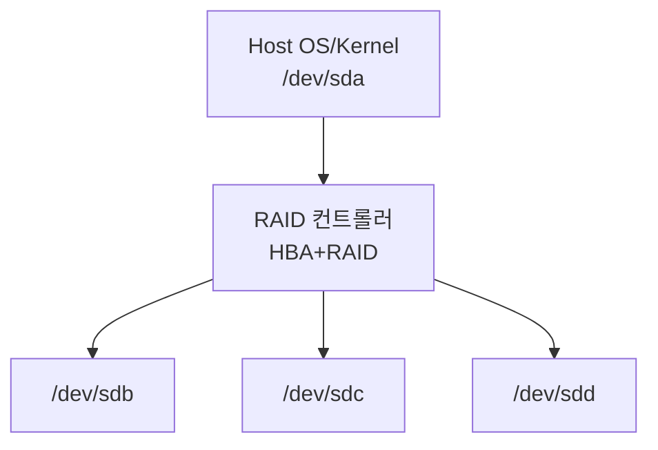
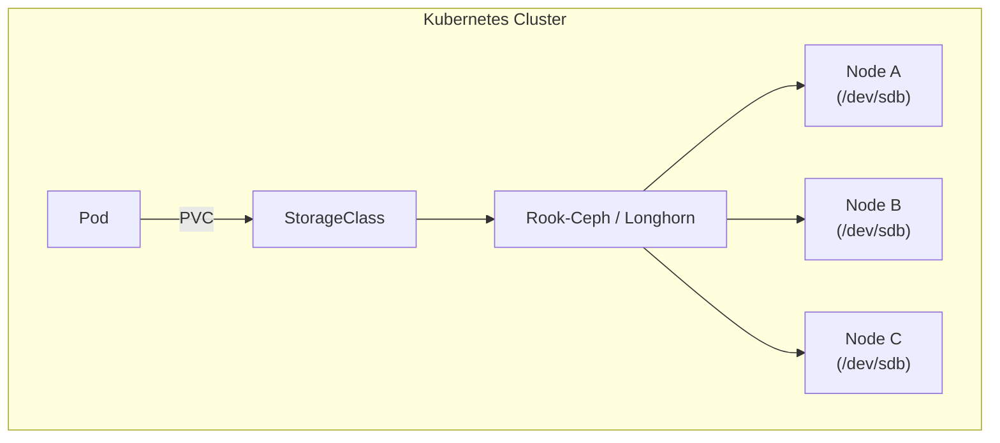

# RAID 기초 (소프트웨어/하드웨어)

RAID(Redundant Array of Independent Disks)는 여러 디스크를
하나의 논리 볼륨으로 묶어 **성능**, **가용성**, **용량**을
목적에 따라 조합하는 기술이다.

> **핵심 전제**: RAID는 백업이 아니다.
> 논리적 데이터 손상, 실수로 인한 삭제, 랜섬웨어는
> RAID로 보호되지 않는다.

---

## 1. RAID 레벨 비교

### 1.1 레벨별 특성 요약

| RAID | 최소 디스크 | 허용 장애 | 용량 효율 | 읽기 성능 | 쓰기 성능 | 주요 용도 |
|:----:|:-----------:|:---------:|:---------:|:---------:|:---------:|---------|
| 0    | 2           | 0         | 100%      | 매우 높음 | 매우 높음 | 임시 캐시, 성능 우선 |
| 1    | 2           | N-1 ¹     | 50%       | 높음      | 보통      | OS 디스크, 소규모 DB |
| 5    | 3           | 1         | (N-1)/N   | 높음      | 낮음      | 일반 파일 서버 |
| 6    | 4           | 2         | (N-2)/N   | 높음      | 낮음      | 대용량 아카이브 |
| 10   | 4           | 각 미러당 1 | 50%      | 매우 높음 | 높음      | 고성능 DB, OLTP |
| JBOD | 1           | 0         | 100%      | 단일      | 단일      | 단순 연결 확장 |

> ¹ RAID 1은 2개 디스크가 표준이며 허용 장애는 1개다.
> mdadm은 3개 이상 미러를 지원해 N-1 허용도 가능하지만
> 비표준 구성이다.

### 1.2 용량 계산 예시 (4TB × 6개 디스크)

```
RAID 0  : 4 × 6 = 24 TB  (장애 허용 없음)
RAID 1  : 4 × 1 = 4 TB   (6개 중 1개만 유효)
RAID 5  : 4 × 5 = 20 TB  (패리티 1개 디스크)
RAID 6  : 4 × 4 = 16 TB  (패리티 2개 디스크)
RAID 10 : 4 × 3 = 12 TB  (3쌍 미러)
```

### 1.3 RAID 레벨 선택 가이드

```
성능 최우선 (장애 허용 불필요)
  └─ RAID 0

소규모 / OS 볼륨
  └─ RAID 1

범용 파일 서버 (소용량 드라이브, 4TB 미만)
  └─ RAID 5

대용량 드라이브 (8TB 이상) / 아카이브
  └─ RAID 6  ← URE 위험으로 RAID 5 비권장

고성능 + 안정성 (DB, OLTP)
  └─ RAID 10
```

---

## 2. URE와 RAID 5의 위험성

### 2.1 Unrecoverable Read Error(URE)란?

URE는 드라이브가 특정 섹터를 읽지 못하는 하드웨어 오류다.
RAID 리빌드 중 URE가 발생하면
**배열 전체가 실패**할 수 있다.

| 드라이브 등급 | URE 발생률 | 1 URE 당 읽기량 |
|-------------|-----------|--------------|
| 소비자용 HDD | 1 / 10¹⁴ bits | 약 12.5 TB |
| 엔터프라이즈 HDD | 1 / 10¹⁵ bits | 약 125 TB |

### 2.2 드라이브 용량별 RAID 5 리빌드 실패 확률

```
드라이브 8 TB, RAID 5 (5개):
  리빌드 중 읽는 데이터 = 8 TB × 4 = 32 TB
  소비자 드라이브 URE 확률 ≈ 32 / 12.5 = 약 256%
  → 리빌드 성공률 매우 낮음
```

> 2025년 기준, **8 TB 이상 드라이브에 RAID 5는
> 비권장**이다. RAID 6 또는 RAID 10을 사용한다.

---

## 3. 소프트웨어 RAID (mdadm)

Linux 커널의 `md`(Multiple Devices) 드라이버와
`mdadm` 도구로 소프트웨어 RAID를 구성한다.

### 3.1 기본 명령어

```bash
# 배열 생성 (RAID 6, 4개 드라이브)
mdadm --create /dev/md0 \
  --level=6 \
  --raid-devices=4 \
  /dev/sdb /dev/sdc /dev/sdd /dev/sde

# 배열 상태 확인
mdadm --detail /dev/md0

# 개별 디스크 정보 확인
mdadm --examine /dev/sdb

# 배열 목록 확인
mdadm --detail --scan

# 배열 중지
mdadm --stop /dev/md0

# 배열 재조립 (재부팅 후)
mdadm --assemble /dev/md0 /dev/sdb /dev/sdc /dev/sdd /dev/sde
```

### 3.2 배열 생성부터 마운트까지

```bash
# 1. 배열 생성
mdadm --create /dev/md0 \
  --level=6 \
  --raid-devices=4 \
  /dev/sdb /dev/sdc /dev/sdd /dev/sde

# 2. mdadm.conf 업데이트
mdadm --detail --scan >> /etc/mdadm/mdadm.conf

# 3. initramfs 업데이트 (재부팅 후 자동 조립)
update-initramfs -u        # Debian/Ubuntu
dracut -f                  # RHEL/Rocky

# 4. 파일시스템 생성
mkfs.xfs /dev/md0

# 5. 마운트
mkdir -p /data
mount /dev/md0 /data

# 6. /etc/fstab 등록 (UUID 사용 — 재부팅 시 이름 변경 방지)
UUID=$(blkid -s UUID -o value /dev/md0)
echo "UUID=${UUID}  /data  xfs  defaults,nofail  0  2" >> /etc/fstab
```

### 3.3 /proc/mdstat 해석

```
$ cat /proc/mdstat

Personalities : [raid6] [raid5] [raid4]
md0 : active raid6 sde[3] sdd[2] sdc[1] sdb[0]
      15625277440 blocks super 1.2 level 6,
      512k chunk, algorithm 2 [4/4] [UUUU]
      bitmap: 0/58 pages [0KB], 65536KB chunk

unused devices: <none>
```

| 항목 | 의미 |
|-----|------|
| `active raid6` | 활성 RAID 6 배열 |
| `[4/4]` | 전체 4개 중 4개 정상 |
| `[UUUU]` | U=정상, _=장애 디스크 |
| `bitmap` | 내부 비트맵 (write hole 방지) |

리빌드 중에는 아래와 같이 표시된다.

```
[==>..................]  recovery = 12.3% (1234567/10000000)
      finish=45.2min speed=3456K/sec
```

### 3.4 mdadm.conf 설정

```bash
# /etc/mdadm/mdadm.conf

# 메일 알림 설정
MAILADDR admin@example.com

# 배열 자동 조립 설정 (--detail --scan 출력)
ARRAY /dev/md0 metadata=1.2 \
  UUID=xxxxxxxx:xxxxxxxx:xxxxxxxx:xxxxxxxx

# 모니터링 데몬 설정
PROGRAM /usr/local/bin/raid-alert.sh
```

### 3.5 리빌드 속도 제어

리빌드 속도가 너무 빠르면 서비스 I/O에 영향을 준다.
운영 환경에서는 업무 시간대에 속도를 제한한다.

```bash
# 현재 속도 확인
sysctl dev.raid.speed_limit_min
sysctl dev.raid.speed_limit_max

# 단위: KB/s (기본값: min=1000, max=200000)

# 업무 시간 (속도 제한)
sysctl -w dev.raid.speed_limit_min=1000
sysctl -w dev.raid.speed_limit_max=50000

# 야간 (속도 해제)
sysctl -w dev.raid.speed_limit_min=10000
sysctl -w dev.raid.speed_limit_max=500000

# /etc/sysctl.conf 에 영구 설정
dev.raid.speed_limit_min = 1000
dev.raid.speed_limit_max = 200000
```

> SSD 배열은 기본값 `200,000 KB/s`가 너무 낮을 수 있다.
> NVMe 기준 `2,000,000 KB/s`까지 상향 가능하다.

### 3.6 Write Hole 문제와 대응

**Write Hole**이란 RAID 5/6에서 정전·패닉 발생 시
데이터와 패리티 불일치가 생기는 문제다.

```
정상 쓰기 흐름:
  1. 데이터 블록 기록
  2. 패리티 블록 기록  ← 여기서 크래시 발생 시 불일치
```

| 대응 방법 | 설명 | 성능 영향 |
|---------|-----|---------|
| 내부 비트맵 | 변경 영역만 재동기화 | 낮음 |
| Journal 디바이스 | 전용 SSD를 저널로 사용 | 낮음 (SSD) |
| PPL (Parity Protection Log) | 패리티 드라이브 메타 영역 활용 | 쓰기 30~40% 감소 |

```bash
# 배열 생성 시부터 Journal 지정 (권장)
mdadm --create /dev/md0 \
  --level=5 \
  --consistency-policy=journal \
  --raid-devices=4 \
  /dev/sdb /dev/sdc /dev/sdd /dev/sde \
  --write-journal /dev/nvme0n1

# 기존 배열에 저널 추가
# ⚠ Read-Only 전환이 필요하며, 배열이 마운트 해제된 상태여야 한다
mdadm --readonly /dev/md0
mdadm /dev/md0 --add-journal /dev/nvme0n1
mdadm --readwrite /dev/md0

# PPL 방식으로 생성 (전용 디스크 불필요)
mdadm --create /dev/md0 \
  --level=5 \
  --consistency-policy=ppl \
  --raid-devices=4 \
  /dev/sdb /dev/sdc /dev/sdd /dev/sde
```

### 3.7 디스크 교체 절차

```bash
# 1. 장애 디스크 확인
mdadm --detail /dev/md0
# 상태: faulty

# 2. 장애 디스크 논리적 제거
mdadm /dev/md0 --fail /dev/sdb
mdadm /dev/md0 --remove /dev/sdb

# 3. 물리적 디스크 교체

# 4. 새 디스크 추가
mdadm /dev/md0 --add /dev/sdb

# 5. 리빌드 진행 모니터링
watch -n 5 cat /proc/mdstat
```

### 3.8 장애 알림 모니터링

```bash
# mdadm 모니터 데몬 실행
mdadm --monitor \
  --mail=admin@example.com \
  --delay=60 \
  --daemonise \
  /dev/md0

# systemd 서비스로 실행 (권장)
# /etc/systemd/system/mdmonitor.service 는
# 패키지 설치 시 자동 생성됨
systemctl enable --now mdmonitor

# 테스트 알림 발송
mdadm --monitor --test --mail=admin@example.com /dev/md0
```

---

## 4. 하드웨어 RAID

### 4.1 하드웨어 RAID 컨트롤러 역할



OS는 RAID를 인식하지 못하고 단일 디스크로 본다.
RAID 연산은 컨트롤러가 전담한다.

### 4.2 주요 컨트롤러와 관리 도구

| 제조사 | 제품 라인 | 관리 도구 | 명령어 예시 |
|-------|---------|---------|-----------|
| Broadcom (구 LSI) | MegaRAID | storcli / storcli2 | `storcli /c0 show` |
| HP / HPE | Smart Array | ssacli | `ssacli ctrl all show status` |
| Adaptec (Microchip) | SmartRAID | arcconf | `arcconf GETCONFIG 1` |
| Dell PERC | PERC H-Series | perccli | `perccli /c0 show` |

### 4.3 BBU / FBWC (캐시 보호 장치)

| 방식 | 설명 | 특징 |
|-----|-----|------|
| BBU (Battery Backup Unit) | 배터리로 DRAM 캐시 보호 | 배터리 열화, 주기적 교체 필요 |
| FBWC (Flash-Backed Write Cache) | NAND Flash + 커패시터 | 배터리 불필요, 더 안정적 |
| DRAM + Supercapacitor | 최신 방식 | 빠른 충전, 긴 수명 |

> BBU가 불량이거나 충전 중이면 컨트롤러가 자동으로
> Write-Through 모드로 전환되어 성능이 급락한다.
> BBU 상태 모니터링은 필수다.

### 4.4 storcli 주요 명령어 (MegaRAID)

```bash
# 컨트롤러 전체 상태
storcli /c0 show all

# 가상 드라이브(VD) 상태
storcli /c0/v0 show

# 물리 드라이브(PD) 상태
storcli /c0/eall/sall show

# BBU 상태
storcli /c0/bbu show all

# RAID 이벤트 로그
storcli /c0 show events

# JSON 출력 (자동화 스크립트용)
storcli /c0 show J
```

### 4.5 ssacli 주요 명령어 (HPE Smart Array)

```bash
# 컨트롤러 상태
ssacli ctrl all show status

# 배열 상세 정보
ssacli ctrl slot=0 array all show detail

# 물리 드라이브 상태
ssacli ctrl slot=0 pd all show detail

# 캐시 상태
ssacli ctrl slot=0 show detail | grep -i cache
```

---

## 5. 소프트웨어 vs 하드웨어 RAID 비교

| 항목 | 소프트웨어 RAID (mdadm) | 하드웨어 RAID |
|-----|----------------------|-------------|
| 비용 | 무료 | 컨트롤러 비용 (수십~수백만 원) |
| CPU 사용 | 호스트 CPU 소비 | 전용 프로세서 |
| 쓰기 캐시 | 없음 (OS 페이지 캐시) | 전용 DRAM + BBU |
| 이식성 | 디스크 이동 시 재조립 가능 | 컨트롤러 종속 |
| 투명성 | OS에서 RAID 구조 직접 인식 | OS는 단일 디스크로 인식 |
| 장애 진단 | `/proc/mdstat`, SMART 직접 접근 | 벤더 전용 도구 필요 |
| 대규모 성능 | 대용량 배열에서 CPU 부담 | 안정적 고성능 |
| 클라우드/VM | 적합 | 부적합 (Pass-through 필요) |
| 컨트롤러 장애 | 배열 생존 | 컨트롤러 교체 없이 데이터 접근 불가 |

> 현대 서버(고코어 CPU, NVMe SSD)에서는 소프트웨어 RAID의
> 성능 격차가 크게 줄었다. 온프레미스 신규 구축 시
> mdadm이 유지보수 편의성에서 유리하다.

---

## 6. 현대 환경에서의 RAID

### 6.1 클라우드에서 RAID가 불필요한 경우

클라우드 스토리지는 이미 내부적으로 복제를 수행한다.

```
AWS EBS      : 동일 AZ 내 자동 복제, 99.999% 내구성
GCP PD       : 자동 복제 (SSD: 99.9999% 내구성)
Azure Disk   : LRS/ZRS/GRS 옵션으로 복제
```

클라우드에서 RAID 0를 사용해 성능을 높이는 경우는
있지만, 안정성 목적의 RAID는 의미가 없다.

### 6.2 온프레미스에서 RAID가 여전히 필요한 경우

- 베어메탈 단일 서버의 로컬 스토리지 보호
- 분산 스토리지 미도입 환경
- 하이퍼바이저 호스트의 OS 볼륨 보호 (RAID 1)
- NAS/SAN 어플라이언스 구성

### 6.3 쿠버네티스: 분산 스토리지가 RAID를 대체

쿠버네티스 환경에서는 분산 스토리지가 RAID의 역할을
소프트웨어 레벨에서 처리한다.



| 솔루션 | RAID 대응 기능 | 추가 기능 |
|-------|-------------|---------|
| Rook-Ceph | 복제(replica) + EC(Erasure Coding) | 블록/파일/오브젝트, 자가 복구 |
| Longhorn | 복제(replica) | 스냅샷, 증분 백업, UI |
| OpenEBS | 복제 (Mayastor) | NVMe-oF 지원 |

> Rook-Ceph의 **Erasure Coding**은 RAID 6과 유사한
> 원리로, k=4, m=2 설정 시 2개 OSD 장애를 허용하면서
> RAID 6 대비 용량 효율이 높다.

---

## 7. RAID 성능 모니터링

### 7.1 mdstat + iostat 조합

```bash
# RAID 배열 실시간 모니터링
watch -n 2 cat /proc/mdstat

# 배열 디바이스 I/O 통계
iostat -xz 2 /dev/md0 /dev/sdb /dev/sdc

# 리빌드 진행률 + 예상 완료 시간
grep -A2 "resync\|recovery\|check" /proc/mdstat
```

### 7.2 정기 스크럽(Scrub) 설정

스크럽은 데이터와 패리티 일관성을 검사한다.
배열 크기에 따라 수 시간~수십 시간이 걸린다.

```bash
# 수동 스크럽 시작
echo check > /sys/block/md0/md/sync_action

# 스크럽 상태 확인
cat /sys/block/md0/md/sync_action
cat /proc/mdstat

# 스크럽 완료 후 오류 수 확인
cat /sys/block/md0/md/mismatch_cnt

# Ubuntu: 주 1회 자동 스크럽 (기본 활성화)
cat /etc/cron.d/mdadm
# 0 1 * * 0 root /usr/share/mdadm/checkarray --all

# RHEL/Rocky: 월 1회 스크럽 권장
# mismatch_cnt 는 읽기 전용 — echo 0으로 초기화 불가
# repair 실행 후 재확인하는 것이 올바른 방법
echo repair > /sys/block/md0/md/sync_action
cat /sys/block/md0/md/mismatch_cnt
```

### 7.3 SMART 모니터링 연계

RAID 상태와 별개로 개별 디스크의 SMART도 확인한다.

```bash
# 전체 SMART 요약
smartctl -a /dev/sdb

# 예측 실패 항목 확인
smartctl -H /dev/sdb

# 단기 자가 테스트 실행
smartctl -t short /dev/sdb

# 하드웨어 RAID 뒤의 디스크 SMART 접근 (MegaRAID)
smartctl -a -d megaraid,0 /dev/sda
```

---

## 8. 실무 주의사항

### 8.1 RAID ≠ 백업

```
RAID가 보호하는 것:
  ✅ 디스크 하드웨어 장애 (platter 손상, 전자 장애)
  ✅ 서비스 연속성 (장애 중에도 읽기/쓰기 가능)

RAID가 보호하지 못하는 것:
  ❌ 실수로 인한 파일 삭제
  ❌ 랜섬웨어·악성코드에 의한 암호화
  ❌ 파일시스템 손상 (버그, 갑작스러운 전원 차단)
  ❌ 데이터센터 화재·침수
  ❌ 컨트롤러/소프트웨어 버그로 인한 논리적 손상
```

**3-2-1 백업 규칙**: 3개 복사본, 2개 미디어, 1개 오프사이트.
RAID는 이 규칙의 어느 항목도 대체하지 않는다.

### 8.2 동일 배치 디스크의 동시 장애

같은 시기에 구매한 동일 모델 디스크는 제조 결함이나
마모 주기가 유사하다.
RAID 5 구성에서 1개 장애 후 리빌드 중 같은 배치의
다른 디스크가 동시에 장애날 가능성이 높다.

```
대응 방법:
- 서로 다른 제조사·모델·구매 시기 디스크 혼용
- 대용량 드라이브는 RAID 6 이상 사용
- 리빌드 중 I/O 부하를 최소화
```

### 8.3 RAID 6 최소 권장 기준 (2025)

| 드라이브 용량 | 권장 RAID |
|------------|---------|
| 4 TB 미만   | RAID 5 또는 6 |
| 4 TB ~ 8 TB | RAID 6 강력 권장 |
| 8 TB 이상   | RAID 6 또는 RAID 10 |
| 18 TB 이상  | RAID 10 또는 분산 스토리지 (Ceph 등) |

### 8.4 컨트롤러 장애 대비 (하드웨어 RAID)

하드웨어 RAID는 컨트롤러가 고장나면 **동일 모델**
컨트롤러 없이는 데이터에 접근할 수 없다.

```
대비 방법:
- 동일 모델 예비 컨트롤러 보유
- 컨트롤러 설정 (RAID map) 정기 백업
- 벤더의 EOL 일정 추적
```

---

## 9. 빠른 참조 치트시트

```bash
# ── 배열 생성 ──
mdadm --create /dev/md0 --level=6 \
  --raid-devices=4 /dev/sd{b,c,d,e}

# ── 상태 확인 ──
mdadm --detail /dev/md0
cat /proc/mdstat

# ── 디스크 교체 ──
mdadm /dev/md0 --fail /dev/sdb
mdadm /dev/md0 --remove /dev/sdb
mdadm /dev/md0 --add /dev/sdb

# ── conf 업데이트 ──
mdadm --detail --scan >> /etc/mdadm/mdadm.conf
update-initramfs -u

# ── 리빌드 속도 제한 ──
sysctl -w dev.raid.speed_limit_max=50000

# ── 스크럽 ──
echo check > /sys/block/md0/md/sync_action

# ── MegaRAID 상태 ──
storcli /c0 show all
```

---

## 참고 자료

- [Linux RAID Wiki - A guide to mdadm](https://raid.wiki.kernel.org/index.php/A_guide_to_mdadm)
  (확인: 2026-04-17)
- [ArchWiki - RAID](https://wiki.archlinux.org/title/RAID)
  (확인: 2026-04-17)
- [Red Hat RHEL 9 - Managing RAID](https://access.redhat.com/documentation/en-us/red_hat_enterprise_linux/9/html/managing_storage_devices/managing-raid_managing-storage-devices)
  (확인: 2026-04-17)
- [Linux Kernel Documentation - raid5-cache.txt](https://www.kernel.org/doc/Documentation/md/raid5-cache.txt)
  (확인: 2026-04-17)
- [Linux Kernel Documentation - raid5-ppl.txt](https://www.kernel.org/doc/Documentation/md/raid5-ppl.txt)
  (확인: 2026-04-17)
- [Broadcom StorCLI User Guide v1.19](https://techdocs.broadcom.com/content/dam/broadcom/techdocs/data-center-solutions/tools/generated-pdfs/StorCLI-12Gbs-MegaRAID-Tri-Mode.pdf)
  (확인: 2026-04-17)
- [Why RAID 5 is Risky in 2025: URE](https://ds-security.com/post/why-raid5-is-risky-in-2025/)
  (확인: 2026-04-17)
- [Baeldung - Introduction to RAID in Linux](https://www.baeldung.com/linux/raid-intro)
  (확인: 2026-04-17)
- [Louwrentius - Don't be afraid of RAID](https://louwrentius.com/dont-be-afraid-of-raid.html)
  (확인: 2026-04-17)
- [utcc.utoronto.ca - Software RAID resync speed on SSDs](https://utcc.utoronto.ca/~cks/space/blog/linux/SoftwareRaidResyncOnSSDs)
  (확인: 2026-04-17)
