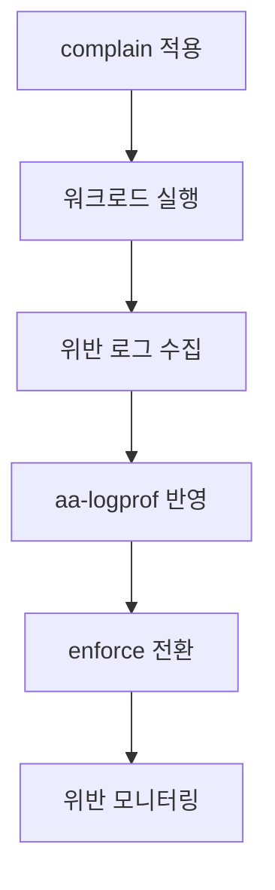

# AppArmor 기본과 운영

AppArmor는 Linux 커널 보안 모듈(LSM)로, 프로그램이
접근할 수 있는 리소스를 프로파일로 제한하는 MAC 시스템이다.
Ubuntu, Debian, SUSE의 기본 보안 모듈이며,
SELinux가 레이블 기반인 반면 AppArmor는 **경로 기반**으로 동작한다.

---

## SELinux vs AppArmor 비교

| 항목 | SELinux | AppArmor |
|------|---------|---------|
| 동작 방식 | 레이블(inode) 기반 | 경로 기반 |
| 정책 적용 | 파일 이동해도 레이블 유지 | 경로 변경 시 정책 달라짐 |
| 난이도 | 높음 | 낮음 |
| 기본 배포판 | RHEL, Fedora | Ubuntu, Debian, SUSE |
| 컨테이너 지원 | ✅ | ✅ |

---

## 프로파일 모드

| 모드 | 동작 |
|------|------|
| **enforce** | 위반 차단 + 로그 기록 |
| **complain** | 차단 없이 위반 로그만 기록 (트러블슈팅용) |
| **disabled** | 프로파일 비활성화 |

```bash
# AppArmor 상태 확인
apparmor_status
# 또는
aa-status

# 로드된 프로파일 목록
cat /sys/kernel/security/apparmor/profiles
```

---

## 기본 명령어

```bash
# 프로파일 로드
apparmor_parser -r /etc/apparmor.d/usr.sbin.nginx

# 프로파일 모드 변경
aa-enforce /etc/apparmor.d/usr.sbin.nginx
aa-complain /etc/apparmor.d/usr.sbin.nginx
aa-disable /etc/apparmor.d/usr.sbin.nginx

# 모든 프로파일 재로드
systemctl reload apparmor

# 특정 프로세스의 AppArmor 상태
cat /proc/<PID>/attr/current
```

---

## 프로파일 문법

```
#include <tunables/global>

/usr/sbin/nginx {
  #include <abstractions/base>
  #include <abstractions/nameservice>

  # 실행 권한
  /usr/sbin/nginx mr,

  # 읽기 권한
  /etc/nginx/** r,
  /etc/ssl/certs/** r,

  # 읽기/쓰기 권한
  /var/log/nginx/** rw,
  /var/run/nginx.pid rw,

  # 네트워크 권한
  network inet tcp,
  network inet6 tcp,

  # Capability
  capability net_bind_service,
  capability setuid,
  capability setgid,

  # 자식 프로세스 실행
  /usr/sbin/nginx px,

  # deny 규칙: 넓은 허용 블록에서 특정 경로 제외
  # deny는 allow보다 우선 적용됨
  deny /etc/shadow r,
  deny /var/log/nginx/access.log w,   # append만 허용하려면
  /var/log/nginx/access.log a,        # w 대신 a로 교체
}
```

### 파일 권한 플래그

| 플래그 | 의미 |
|--------|------|
| `r` | 읽기 |
| `w` | 쓰기 (기존 파일 덮어쓰기 포함) |
| `a` | append-only 쓰기 (로그 파일에 `w` 대신 권장) |
| `c` | 파일 생성 |
| `x` | 실행 |
| `m` | mmap |
| `l` | 링크 |
| `k` | 파일 잠금 |
| `p` | 별도 프로파일로 실행 |
| `ix` | 현재 프로파일 상속해 실행 |
| `ux` | 비제한 실행 (unconfined) |

---

## 프로파일 작성 워크플로



### aa-genprof: 프로파일 생성 보조

```bash
# 애플리케이션 프로파일 자동 생성
aa-genprof /usr/sbin/myapp

# 대화형으로 접근 허용/거부 선택
# 완료 후 /etc/apparmor.d/usr.sbin.myapp 생성
```

### aa-logprof: 로그 기반 프로파일 업데이트

```bash
# 로그에서 새로운 접근 패턴 학습
aa-logprof

# 특정 로그 파일 지정
aa-logprof -f /var/log/syslog
```

---

## 위반 로그 확인

```bash
# AppArmor 거부 로그 확인
dmesg | grep apparmor
journalctl -k | grep apparmor
grep apparmor /var/log/syslog | grep DENIED
grep apparmor /var/log/kern.log | grep DENIED

# auditd 연동 시
ausearch -m AVC --start today | grep apparmor
```

### 로그 메시지 해석

```
apparmor="DENIED" operation="open"
profile="/usr/sbin/nginx"
name="/var/data/html/index.html"
pid=1234 comm="nginx"
requested_mask="r" denied_mask="r"
fsuid=33 ouid=0
```

| 필드 | 의미 |
|------|------|
| `apparmor="DENIED"` | 차단됨 |
| `profile` | 적용된 프로파일 |
| `name` | 접근 시도한 경로 |
| `requested_mask="r"` | 요청한 권한 |
| `denied_mask="r"` | 거부된 권한 |

---

## 컨테이너에서의 AppArmor

### Docker

```bash
# Docker 기본 프로파일 확인
cat /etc/apparmor.d/docker-default

# 컨테이너에 커스텀 프로파일 적용
apparmor_parser -r -W /etc/apparmor.d/my-container-profile
docker run --security-opt "apparmor=my-container-profile" nginx

# 프로파일 없이 실행 (비권장)
docker run --security-opt apparmor=unconfined nginx
```

### Kubernetes (1.31 GA)

> **버전 이력**: 1.30에서 `securityContext.appArmorProfile`
> **필드 기반 API가 Beta로 도입**되었고, **1.31에서 GA로 승격**되었다.
> 이와 함께 기존 annotation
> `container.apparmor.security.beta.kubernetes.io/<container>`
> 는 **1.30 이후 deprecated**되었으므로 신규 작성 시 사용하지 않는다.

```yaml
apiVersion: v1
kind: Pod
metadata:
  name: myapp
spec:
  securityContext:
    appArmorProfile:        # Pod 전체 기본값
      type: RuntimeDefault
  containers:
  - name: app
    securityContext:
      appArmorProfile:      # 컨테이너별 오버라이드
        type: Localhost
        localhostProfile: k8s-nginx   # 노드에 로드된 프로파일명
```

| 프로파일 타입 | 설명 |
|-------------|------|
| `RuntimeDefault` | 컨테이너 런타임 기본 프로파일 |
| `Localhost` | 노드에 로드된 커스텀 프로파일 |
| `Unconfined` | AppArmor 미적용 (비권장) |

> **주의**: `Localhost` 프로파일은 모든 노드에 동일한
> 프로파일이 로드되어 있어야 한다.
> 노드에 없는 프로파일을 지정하면 파드 기동 실패.

### Localhost 프로파일 노드 전체 배포 (DaemonSet 패턴)

```yaml
apiVersion: apps/v1
kind: DaemonSet
metadata:
  name: apparmor-loader
  namespace: kube-system
spec:
  selector:
    matchLabels:
      app: apparmor-loader
  template:
    metadata:
      labels:
        app: apparmor-loader
    spec:
      initContainers:
      - name: loader
        image: ubuntu:22.04
        command: ["/bin/sh", "-c"]
        args:
        - |
          cp /profiles/* /host-profiles/
          apparmor_parser -r /host-profiles/k8s-nginx
        volumeMounts:
        - name: profiles
          mountPath: /profiles
        - name: host-apparmor
          mountPath: /host-profiles
        - name: host-sys
          mountPath: /sys
          readOnly: true
        securityContext:
          privileged: true       # apparmor_parser는 CAP_MAC_ADMIN 필요
      containers:
      - name: pause
        image: registry.k8s.io/pause:3.9
      volumes:
      - name: profiles
        configMap:
          name: apparmor-profiles  # 프로파일 내용을 ConfigMap으로 관리
      - name: host-apparmor
        hostPath:
          path: /etc/apparmor.d
      - name: host-sys
        hostPath:
          path: /sys
```

> DaemonSet initContainer로 모든 노드에 프로파일을 배포하고,
> 이후 파드 스펙에서 `type: Localhost`로 참조한다.

---

## 내장 Abstraction 활용

반복적인 규칙을 재사용 가능한 조각으로 제공한다.

```bash
ls /etc/apparmor.d/abstractions/
# apache2-common, base, cups-client, dbus,
# nameservice, ssl_certs, ...
```

```
# 프로파일에서 포함
#include <abstractions/base>         # 기본 라이브러리, 로케일
#include <abstractions/nameservice>  # DNS, NSS
#include <abstractions/ssl_certs>    # SSL 인증서 경로
```

---

## 실무 운영 팁

```bash
# 프로파일 문법 검사 (커널에 로드하지 않고)
apparmor_parser --skip-kernel-load /etc/apparmor.d/myprofile
# --preprocess (-p) 는 include 전처리 출력 전용, 문법 검사 아님

# enforce → complain 일시 전환 (트러블슈팅)
aa-complain /etc/apparmor.d/myprofile
# 디버깅 후 복원
aa-enforce /etc/apparmor.d/myprofile

# 전체 프로파일 상태 요약
aa-status --json 2>/dev/null | jq '.profiles | to_entries[] \
  | select(.value == "enforce") | .key'
```

---

## 참고 자료

- [AppArmor Wiki - Ubuntu](https://wiki.ubuntu.com/AppArmor)
  — 확인: 2026-04-17
- [AppArmor - Kubernetes Documentation](https://kubernetes.io/docs/tutorials/security/apparmor/)
  — 확인: 2026-04-17
- [AppArmor security profiles for Docker](https://docs.docker.com/engine/security/apparmor/)
  — 확인: 2026-04-17
- [AppArmor - Arch Linux Wiki](https://wiki.archlinux.org/title/AppArmor)
  — 확인: 2026-04-17
