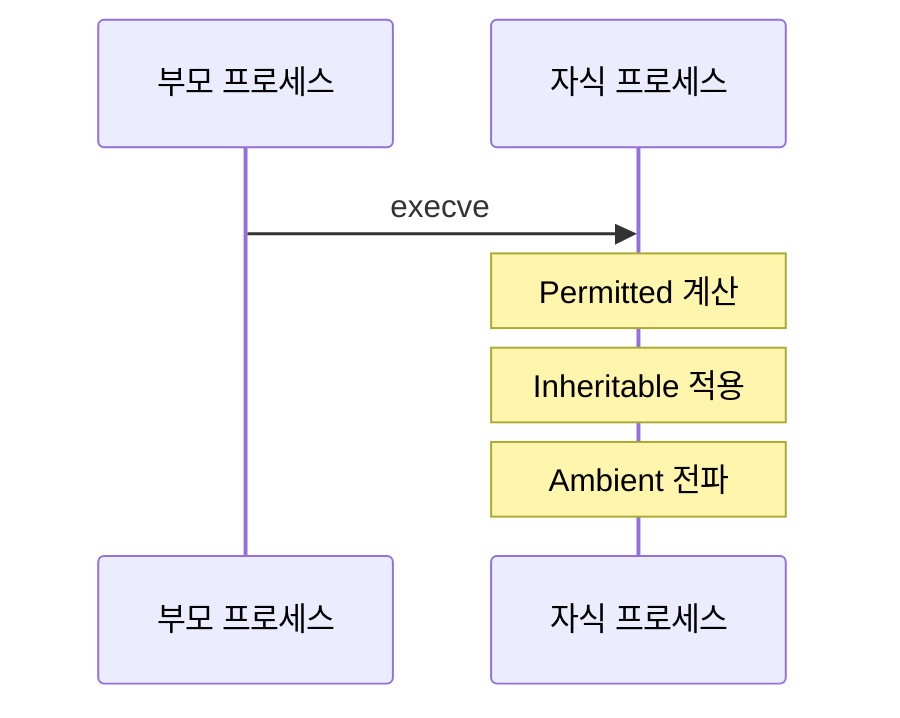
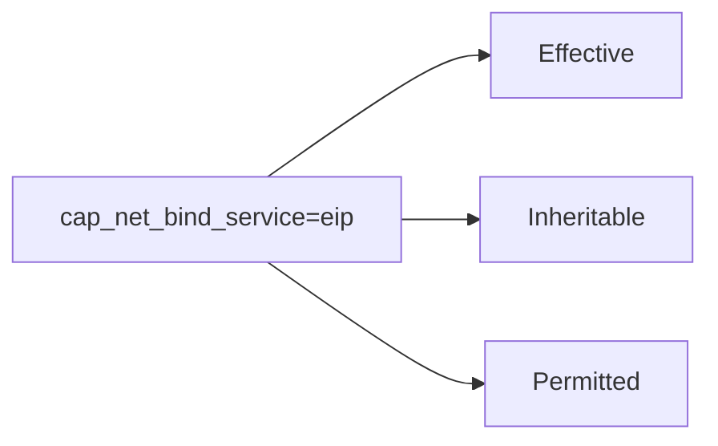

# Linux Capabilities

전통적으로 Linux는 권한을 "root(전권) vs 일반 사용자"로
이분화했다. Capabilities는 root 권한을 41개(Linux 6.x 기준,
커널 버전마다 추가됨)로 세분화해 최소 권한 원칙(Least Privilege)을
구현하는 메커니즘이다.

---

## Capability 집합 (Sets)

각 프로세스(스레드)는 5개의 capability 집합을 가진다.

| 집합 | 기호 | 의미 |
|------|------|------|
| Permitted | `P` | 프로세스가 보유 가능한 최대 집합 |
| Effective | `E` | 커널이 실제 권한 검사에 사용하는 집합 |
| Inheritable | `I` | execve 후 자식 프로세스에 상속 가능한 집합 |
| Bounding | `B` | execve 시 Permitted의 최대 상한 |
| Ambient | `A` | 비특권 프로그램 execve 시 보존, Linux 4.3+ |



execve 시 자식의 capability 계산 규칙:

| 대상 | 계산식 |
|------|--------|
| 자식 Permitted | `P(부모) ∩ B` |
| 자식 Permitted 추가 | `P(부모) ∩ 파일 P` |
| 자식 Permitted 추가 | `I(부모) ∩ 파일 I` |
| 자식 Permitted/Effective | `A(부모)` (ambient 전파) |

| 집합 | 역할 | 수정 권한 |
|------|------|---------|
| Permitted | 보유 가능한 상한 | 줄이기만 가능 |
| Effective | 지금 사용 중인 권한 | P 범위 내에서 조정 |
| Inheritable | 자식에게 상속 | P 범위 내에서 조정 |
| Bounding | execve 시 P의 최댓값 | 줄이기만 가능 (root도) |
| Ambient | 비특권 exec 시 유지 | P∩I 범위 내에서만 |

---

## 주요 Capabilities 목록

| Capability | 주요 권한 | 컨테이너 기본 포함 |
|-----------|---------|:----------------:|
| `CAP_CHOWN` | 파일 소유자 변경 | ✅ |
| `CAP_DAC_OVERRIDE` | 파일 권한 검사 우회 | ✅ |
| `CAP_FOWNER` | 소유자 아니어도 파일 ops | ✅ |
| `CAP_KILL` | 임의 프로세스에 시그널 | ✅ |
| `CAP_NET_BIND_SERVICE` | 1024 미만 포트 바인딩 | ✅ |
| `CAP_NET_RAW` | RAW/PACKET 소켓 | ✅ |
| `CAP_FSETID` | setuid/setgid 비트 보존 | ✅ |
| `CAP_SETUID` / `CAP_SETGID` | UID/GID 변경 | ✅ |
| `CAP_SETPCAP` | 다른 프로세스 capability 변경 | ✅ |
| `CAP_SETFCAP` | 파일 capability 설정 | ✅ |
| `CAP_SYS_CHROOT` | chroot() 호출 | ✅ |
| `CAP_AUDIT_WRITE` | 커널 감사 로그 쓰기 | ✅ |
| `CAP_MKNOD` | 특수 파일 생성 | ✅ |
| `CAP_NET_ADMIN` | 네트워크 설정 변경 | ❌ |
| `CAP_SYS_ADMIN` | **거의 모든 관리 권한** | ❌ |
| `CAP_SYS_PTRACE` | 다른 프로세스 추적 | ❌ |
| `CAP_SYS_MODULE` | 커널 모듈 로드/제거 | ❌ |
| `CAP_SYS_RAWIO` | 원시 I/O 포트 접근 | ❌ |

> `CAP_SYS_ADMIN`은 약 200개 이상의 syscall에 영향을 미친다.
> "작은 root"가 아닌 사실상 root와 같은 권한이다.

---

## 현재 프로세스 Capabilities 확인

```bash
# 현재 셸의 capabilities
cat /proc/self/status | grep Cap
# CapInh: 0000000000000000
# CapPrm: 0000000000000000
# CapEff: 0000000000000000
# CapBnd: 000001ffffffffff
# CapAmb: 0000000000000000

# 16진수 디코딩
capsh --decode=000001ffffffffff

# 특정 프로세스 capabilities
cat /proc/<PID>/status | grep Cap
getpcaps <PID>    # libcap-ng 도구

# 파일에 설정된 capabilities 확인
getcap /usr/bin/ping
# /usr/bin/ping cap_net_raw=ep
```

---

## 파일 Capabilities

setuid 비트 없이도 특정 binary에 capability를 부여한다.

```bash
# 바이너리에 capability 설정
setcap cap_net_bind_service=ep /usr/local/bin/myserver
# =ep : effective + permitted 집합에 추가

# 확인
getcap /usr/local/bin/myserver

# 제거
setcap -r /usr/local/bin/myserver

# 실용 예시: nginx가 80/443 바인딩 (setuid 없이)
setcap cap_net_bind_service=ep /usr/sbin/nginx
```

### 표기법 해석



| 기호 | 집합 |
|------|------|
| `e` | Effective |
| `i` | Inheritable |
| `p` | Permitted |

> **경고**: 인터프리터 바이너리(python, perl, bash, ruby 등)에
> `setcap`을 절대 사용하지 말 것. 인터프리터가 실행하는
> 모든 스크립트가 그 capability를 상속받아
> 컨테이너/시스템 탈출 경로가 된다.

---

## 컨테이너에서의 Capabilities

### Docker

```bash
# 기본 컨테이너: 14개 capabilities만 허용
docker run --rm alpine capsh --print

# 모두 제거 후 필요한 것만 추가 (권장)
docker run --cap-drop=ALL --cap-add=NET_BIND_SERVICE \
  nginx:alpine

# 특권 컨테이너 (모든 capabilities + namespace 비격리, 금지)
# docker run --privileged ...  ← 절대 프로덕션 사용 금지
```

### Kubernetes

```yaml
apiVersion: v1
kind: Pod
spec:
  containers:
  - name: app
    securityContext:
      capabilities:
        drop:
        - ALL                    # 모두 제거
        add:
        - NET_BIND_SERVICE       # 필요한 것만 추가
      runAsNonRoot: true
      runAsUser: 1000
      allowPrivilegeEscalation: false   # 필수
```

> `allowPrivilegeEscalation: false`는 프로세스에
> 커널의 `no_new_privs` 비트를 세팅한다.
> 이 비트가 활성화되면 `execve` 이후 setuid 바이너리의
> setuid 비트와 파일 capability가 무시된다.
> `drop: ALL`만으로는 컨테이너 이미지 내
> setuid 바이너리를 통한 권한 상승 경로가 남는다.

---

## Capability 오남용: 공격 경로

| Capability | 공격 경로 |
|-----------|---------|
| `CAP_SYS_ADMIN` | cgroup v1 release_agent 탈출, mount 조작 |
| `CAP_NET_ADMIN` | iptables 수정, 트래픽 가로채기 |
| `CAP_SYS_PTRACE` | 다른 프로세스 메모리 읽기/쓰기 |
| `CAP_NET_RAW` | ARP 스푸핑, 패킷 스니핑 |
| `CAP_DAC_OVERRIDE` | 모든 파일 읽기/쓰기 |
| `CAP_SETUID` | UID 0으로 전환 (root 탈취) |

---

## 최소 권한 하드닝 체크리스트

```bash
# 1. 컨테이너 기본 capability 목록 확인
docker run --rm alpine capsh --print | grep Current

# 2. 필요한 capability만 화이트리스트
# 방법: strace로 syscall 추적 → 필요한 capability 도출
strace -e trace=all myapp 2>&1 | grep "EPERM\|Operation not permitted"

# 3. Kubernetes: PodSecurity 정책으로 강제화
# restricted 프로파일 = capabilities drop ALL 필수
kubectl label namespace myns \
  pod-security.kubernetes.io/enforce=restricted
```

### 일반 웹 서버가 실제로 필요한 capabilities

```
CAP_NET_BIND_SERVICE   — 80/443 바인딩
CAP_SETUID / SETGID    — worker 프로세스 UID 변경 (nginx master)
```

대부분의 앱은 이 2~3개면 충분하다.
나머지는 모두 제거해도 정상 동작한다.

---

## 트러블슈팅

```bash
# "Operation not permitted" 발생 시 필요한 capability 추적
# 방법 1: strace로 EPERM 발생 syscall 확인
strace -e trace=all ./myapp 2>&1 | grep "EPERM\|Operation not permitted"

# 방법 2: audit 로그 (auditd 실행 중)
ausearch -m avc,user_avc --start recent

# 방법 3: Falco 이벤트 (컨테이너 환경)
# rule: Capability check failure → 어떤 capability가 거부됐는지 로그

# 방법 4: 임시로 추가해가며 최소화
docker run --cap-add=NET_ADMIN --rm myapp  # 하나씩 추가해가며 좁히기
```

---

## 참고 자료

- [capabilities(7) - Linux manual page](https://man7.org/linux/man-pages/man7/capabilities.7.html)
  — 확인: 2026-04-17
- [Container security fundamentals: Capabilities - Datadog](https://securitylabs.datadoghq.com/articles/container-security-fundamentals-part-3/)
  — 확인: 2026-04-17
- [Beyond Container Capabilities: Understanding Linux Capability Sets](https://www.utam0k.jp/en/blog/2025/12/14/linux-capability-sets/)
  — 확인: 2026-04-17
- [CIS Docker Benchmark](https://www.cisecurity.org/benchmark/docker)
  — 확인: 2026-04-17
