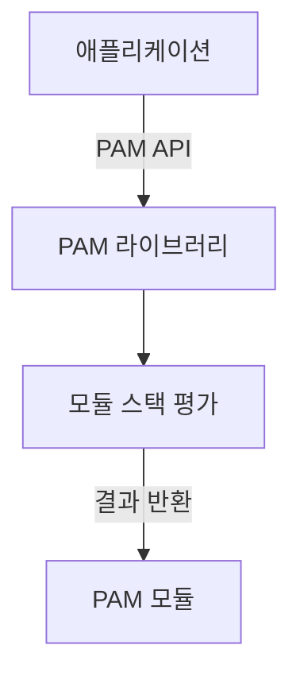
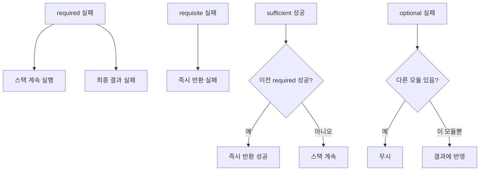

# PAM (Pluggable Authentication Modules)

PAM은 리눅스 인증 프레임워크의 핵심이다.
애플리케이션(SSH, sudo, login 등)이 인증 방식을
직접 구현하지 않고, 공통 API를 통해 교체 가능한
모듈 스택으로 인증을 위임한다.

1997년 Sun Microsystems에서 제안한 RFC가 기원이며,
현재 Linux-PAM 프로젝트가 de facto 표준 구현체다.
SSSD, MFA, LDAP/AD 연동 등 모든 중앙화 인증이
PAM 위에 구축된다.

---

## 아키텍처

### 전체 흐름



| 노드 | 예시·설명 |
|------|----------|
| 애플리케이션 | sshd, sudo, login 등 |
| PAM 라이브러리 | `libpam.so`, `pam.d` 설정 파일 로드 |
| 모듈 스택 평가 | auth, account, password, session 타입 |
| PAM 모듈 | `pam_unix`, `pam_sss` 등 |

**핵심 원칙**: 애플리케이션은 인증 로직을 모른다.
PAM 설정 파일만 바꾸면 인증 방식을 교체·추가할 수 있다.

| 모듈 타입 | 역할 |
|----------|------|
| `auth` | 신원 확인 (비밀번호, MFA 등) |
| `account` | 계정 유효성 검사 (만료, 잠금 등) |
| `password` | 비밀번호 갱신 처리 |
| `session` | 세션 환경 설정/해제 |

---

### 주요 파일 위치

**`/etc/pam.d/` — 서비스별 PAM 설정**

| 파일 | 용도 |
|------|------|
| `sshd` | SSH 데몬 |
| `sudo` | sudo 명령 |
| `login` | 로컬 로그인 |
| `su` | su 명령 |
| `cron` | cron 작업 |
| `system-auth` | RHEL 공통 인증 스택 (include용) |
| `password-auth` | RHEL 패스워드 인증 스택 (include용) |
| `common-auth` | Debian/Ubuntu 공통 인증 |
| `common-account` | Debian/Ubuntu 공통 계정 |
| `common-password` | Debian/Ubuntu 공통 패스워드 |
| `common-session` | Debian/Ubuntu 공통 세션 |

**`/etc/security/` — 모듈별 설정 파일**

| 파일 | 담당 모듈 | 설명 |
|------|----------|------|
| `limits.conf` | `pam_limits` | 리소스 제한 (ulimit) |
| `access.conf` | `pam_access` | 호스트/시간 기반 접근 제어 |
| `time.conf` | `pam_time` | 시간대별 접근 허용 |
| `pwquality.conf` | `pam_pwquality` | 패스워드 복잡도 정책 |
| `faillock.conf` | `pam_faillock` | 계정 잠금 정책 (RHEL 9+) |

**PAM 모듈 경로**

| 경로 | 설명 |
|------|------|
| `/lib/security/` | PAM 모듈 (32비트, 레거시) |
| `/lib64/security/` | PAM 모듈 (64비트) |
| `/usr/lib/security/` | 배포판에 따라 다름 |

---

## 설정 파일 문법

### 기본 형식

```
<module_type>  <control_flag>  <module_path>  [module_args]
```

```
# /etc/pam.d/sshd 예시
auth       required     pam_env.so
auth       required     pam_faillock.so preauth
auth       sufficient   pam_unix.so nullok
auth       required     pam_faillock.so authfail
account    required     pam_unix.so
account    required     pam_faillock.so
session    required     pam_limits.so
session    optional     pam_motd.so
```

| 필드 | 설명 |
|------|------|
| `module_type` | auth / account / password / session |
| `control_flag` | 모듈 결과 처리 방식 |
| `module_path` | 모듈 파일명 (절대경로 또는 상대경로) |
| `module_args` | 모듈별 옵션 (공백 구분) |

---

### 4가지 모듈 타입

| 타입 | 역할 | 호출 시점 |
|------|------|---------|
| `auth` | 사용자 신원 확인 (비밀번호, TOTP 등) | 로그인 시 |
| `account` | 계정 상태 검증 (만료, 잠금, 접근 허용) | 인증 후 |
| `password` | 비밀번호 갱신 처리 | passwd 실행 시 |
| `session` | 세션 환경 설정·해제 (마운트, 리소스 제한 등) | 로그인/아웃 시 |

> `auth`와 `account`는 별개다.  
> `auth`는 "당신이 맞습니까?", `account`는  
> "지금 로그인이 허용됩니까?"를 묻는다.

---

### control_flag 상세

#### 단순 플래그

| 플래그 | 실패 시 동작 | 성공 시 동작 |
|--------|------------|------------|
| `required` | 스택 계속, 최종 실패 | 스택 계속 |
| `requisite` | 즉시 실패 반환 | 스택 계속 |
| `sufficient` | 스택 계속 | 즉시 성공 반환 (이전 required 실패 없는 경우) |
| `optional` | 무시 (단독 모듈이면 반영) | 무시 |
| `include` | 다른 파일의 해당 타입 줄 포함 | — |
| `substack` | include와 유사하나 독립 스택 | — |

#### 평가 로직 흐름



| 분기 | 부연 |
|------|------|
| required 스택 계속 실행 | 사용자에게 실패 이유 노출 방지 |
| requisite 즉시 반환 실패 | 이후 모듈 실행하지 않음 |
| sufficient 스택 계속 | sufficient 결과를 무시하고 진행 |

#### 확장 control 문법 (대괄호)

```
[value1=action1 value2=action2 ...]
```

`pam_unix.so`의 기본 control_flag 해석 예시:

```
[success=1 default=ignore]
```

| 반환값 | 동작 |
|--------|------|
| `success=1` | 스택에서 다음 1개 줄 건너뜀 |
| `default=ignore` | 그 외 결과는 무시 |

공통 action 값:

| action | 의미 |
|--------|------|
| `ok` | 성공으로 처리, 계속 |
| `done` | 성공으로 처리, 즉시 반환 |
| `bad` | 실패로 처리, 계속 |
| `die` | 실패로 처리, 즉시 반환 |
| `ignore` | 결과 무시 |
| `reset` | 누적 결과 초기화 |
| `N` (숫자) | N개 줄 건너뜀 |

---

### include vs substack

```
# include: 포함된 파일의 결과가 현재 스택에 직접 반영
auth    include   common-auth

# substack: 포함된 파일이 독립 스택으로 실행
#   substack 내 die/done은 substack 안에서만 효과
auth    substack  common-auth
```

실무에서는 `include`가 더 일반적이다.
`substack`은 포함된 설정의 `requisite` 실패가
부모 스택을 즉시 종료하는 것을 막고 싶을 때 사용한다.

---

## 주요 PAM 모듈

### pam_unix — 로컬 인증

전통적 `/etc/passwd`, `/etc/shadow` 기반 인증 모듈이다.
대부분의 서비스 설정에서 기본으로 포함된다.

```
auth    sufficient  pam_unix.so nullok try_first_pass
```

| 주요 옵션 | 설명 |
|---------|------|
| `nullok` | 빈 비밀번호 허용 |
| `try_first_pass` | 이전 모듈에서 받은 비밀번호 먼저 시도 |
| `use_first_pass` | 이전 비밀번호 강제 사용 (재입력 없음) |
| `shadow` | shadow 파일 사용 (기본 활성) |
| `remember=N` | 마지막 N개 이전 비밀번호 재사용 금지 |
| `rounds=N` | bcrypt/SHA 반복 횟수 |
| `sha512` | SHA-512 해싱 사용 |

---

### pam_faillock — 계정 잠금 (brute-force 방어)

로그인 실패 횟수를 추적하고 임계값 초과 시 계정을
잠근다. RHEL 8부터 `pam_tally2`를 대체했다.

**RHEL 9 / AlmaLinux 9 설정 (`/etc/security/faillock.conf`)**:

```ini
# /etc/security/faillock.conf
deny = 5               # 5회 실패 시 잠금
fail_interval = 900    # 15분 내 실패 카운트
unlock_time = 600      # 10분 후 자동 해제 (0=영구)
even_deny_root         # root도 잠금 적용
audit                  # 실패 시 audit 로그 기록
silent                 # 잠금 메시지 숨김
```

**`/etc/pam.d/system-auth` 설정 (RHEL 9)**:

```
auth        required      pam_env.so
auth        required      pam_faillock.so preauth
auth        sufficient    pam_unix.so nullok
auth        required      pam_faillock.so authfail
auth        required      pam_deny.so

account     required      pam_unix.so
account     required      pam_faillock.so
```

**Ubuntu 22.04 이상 (`common-auth`)**:

```
# /etc/pam.d/common-auth
auth    required    pam_faillock.so preauth
auth    [success=1 default=ignore]  pam_unix.so nullok
auth    [default=die]               pam_faillock.so authfail
auth    required    pam_permit.so

# /etc/pam.d/common-account 에 추가
account required    pam_faillock.so
```

**faillock 관리 명령**:

```bash
# 잠금 상태 확인
faillock --user alice

# 잠금 해제
faillock --user alice --reset

# 전체 사용자 잠금 상태 조회
faillock
```

---

### pam_pwquality — 패스워드 복잡성

`pam_cracklib`의 후속 모듈이다.
패스워드 강도 검사를 담당한다.

```
# /etc/pam.d/system-auth 또는 common-password
password    requisite   pam_pwquality.so retry=3
password    sufficient  pam_unix.so sha512 shadow nullok use_authtok
```

**`/etc/security/pwquality.conf`**:

```ini
# 최소 길이
minlen = 14

# 문자 클래스 요구 (최소 N개 필요)
minclass = 4       # 소문자/대문자/숫자/특수문자 4가지
# 또는 개별 지정
lcredit = -1       # 소문자 최소 1개 (-N: 최소 N개)
ucredit = -1       # 대문자 최소 1개
dcredit = -1       # 숫자 최소 1개
ocredit = -1       # 특수문자 최소 1개

# 반복/순서 제한
maxrepeat = 3      # 동일 문자 최대 3회 연속
maxsequence = 4    # 순서 패턴 최대 4자 (abcd, 1234 등)

# 이전 비밀번호와의 유사도
difok = 5          # 이전 비밀번호와 최소 5자 달라야 함

# 사전 검사
dictcheck = 1      # cracklib 사전 검사 활성
usercheck = 1      # 사용자명 포함 금지
```

---

### pam_google_authenticator / pam_oath — TOTP MFA

SSH 등에 TOTP 기반 2단계 인증을 추가하는 모듈이다.

**pam_google_authenticator 설치**:

```bash
# RHEL/AlmaLinux
dnf install google-authenticator

# Ubuntu/Debian
apt install libpam-google-authenticator
```

**사용자별 초기 설정**:

```bash
# 각 사용자가 직접 실행
google-authenticator

# 주요 선택지:
# - Time-based tokens: yes (TOTP)
# - Emergency scratch codes: 저장 필수
# - Rate limiting: yes (30초에 3회)
```

`~/.google_authenticator` 파일 생성됨.

**SSH MFA 설정 (`/etc/pam.d/sshd`)**:

```
# 비밀번호 + TOTP 순서로 인증 (프로덕션: nullok 없이)
auth    required    pam_google_authenticator.so
```

**`/etc/ssh/sshd_config` 설정**:

```
# 비밀번호 + TOTP 조합 (KbdInteractive)
KbdInteractiveAuthentication yes
UsePAM yes
AuthenticationMethods keyboard-interactive

# 또는 공개키 + TOTP 조합
AuthenticationMethods publickey,keyboard-interactive
```

```bash
# sshd 재시작
systemctl restart sshd
```

> **`nullok` 경고**: `nullok`는 `~/.google_authenticator`가
> 없는 사용자에게 TOTP를 건너뛰게 허용한다.
> 스택 구성에 따라 인증 없이 통과될 수 있으므로
> 프로덕션에서는 `nullok`를 제거해야 한다.
> 초기 단계별 롤아웃 시에만 일시적으로 사용하고
> 전체 배포 완료 즉시 제거할 것.

---

### pam_sss — SSSD 연동 (AD/LDAP)

SSSD(System Security Services Daemon)를 통해
Active Directory, FreeIPA, LDAP과 연동한다.

```
# /etc/pam.d/system-auth (SSSD 연동 후 authselect로 자동 구성)
auth        required      pam_env.so
auth        required      pam_faillock.so preauth
auth        sufficient    pam_sss.so forward_pass
auth        sufficient    pam_unix.so nullok try_first_pass
auth        required      pam_faillock.so authfail
auth        required      pam_deny.so

account     required      pam_unix.so
account     sufficient    pam_localuser.so
account     sufficient    pam_sss.so
account     required      pam_permit.so

password    requisite     pam_pwquality.so
password    sufficient    pam_sss.so use_authtok
password    sufficient    pam_unix.so sha512 shadow nullok use_authtok

session     required      pam_mkhomedir.so skel=/etc/skel umask=0077
session     optional      pam_sss.so
```

> RHEL에서는 `authselect`로 관리하는 것을 권장한다.
> 수동 편집보다 프로파일 기반 관리가 안전하다.

**authselect로 SSSD 프로파일 적용**:

```bash
# SSSD + faillock + mkhomedir 활성화
authselect select sssd \
  with-faillock \
  with-mkhomedir \
  --force

# 현재 프로파일 확인
authselect current

# 변경 전 백업 (authselect backup 서브커맨드는 없음 — 직접 복사)
cp -a /etc/authselect/ /tmp/authselect-backup/
cp -a /etc/pam.d/ /tmp/pamd-backup/
```

---

### pam_limits — 리소스 제한

`/etc/security/limits.conf` 설정을 사용자 세션에
적용한다. `ulimit` 값을 PAM 레벨에서 강제한다.

```
# /etc/pam.d/system-auth 또는 common-session
session    required    pam_limits.so
```

**`/etc/security/limits.conf` 문법**:

```
# <domain>  <type>  <item>  <value>
# domain: 사용자명, @그룹명, *, %그룹
# type: soft (경고), hard (절대 상한), -  (둘 다)

# 예: Java 앱 서비스 계정
appuser    soft    nofile      65536
appuser    hard    nofile      65536
appuser    soft    nproc       32768

# 예: 모든 사용자 core dump 비활성
*          soft    core        0
*          hard    core        0

# 예: DBA 그룹 메모리 제한 해제
@dba       -       memlock     unlimited

# 예: 개발자 그룹 프로세스 수 제한
@dev       hard    nproc       4096
```

`/etc/security/limits.d/*.conf`로 분리 관리 가능.
숫자가 작은 파일이 먼저 로드되며 나중 것이 덮어쓴다.

---

### pam_access — 호스트/사용자 기반 접근 제어

특정 사용자/그룹이 특정 호스트/터미널에서만
로그인하도록 제어한다.

```
# /etc/pam.d/sshd 또는 login
account    required    pam_access.so
```

**`/etc/security/access.conf` 문법**:

```
# <permission>:<users>:<origins>
# permission: + (허용) | - (거부)
# users: 사용자명, 그룹(@group), ALL, EXCEPT
# origins: 호스트명, IP, NETWORK, LOCAL, ALL, EXCEPT

# 관리자 그룹만 원격 SSH 허용
+:root:192.168.0.0/24
+:@sysadmin:ALL
-:ALL:ALL

# 운영 서버: 점프서버에서만 접근 허용
+:ALL:jump.example.com
-:ALL:ALL

# 로컬 콘솔은 항상 허용
+:ALL:LOCAL
-:ALL:ALL
```

---

### pam_env — 환경변수 설정

세션 시작 시 환경변수를 설정한다.

```
# /etc/pam.d/sshd
session    optional    pam_env.so readenv=1
```

```
# /etc/security/pam_env.conf
LANG          DEFAULT=en_US.UTF-8
TZ            DEFAULT=Asia/Seoul
JAVA_HOME     DEFAULT=/usr/lib/jvm/java-21
```

---

### pam_time — 시간대별 접근 제어

특정 사용자가 특정 시간대에만 로그인하도록 제한한다.

```
# /etc/pam.d/login
account    required    pam_time.so
```

**`/etc/security/time.conf` 문법**:

```
# <services>;<ttys>;<users>;<times>
# times: 요일(Mo/Tu/We/Th/Fr/Sa/Su/Wk/Wd/Al) + 시간(HH:MM)

# 일반 사용자: 평일 08-20시만
login;*;!root;Wk0800-2000

# 특정 사용자: 주말 접근 금지
sshd;*;contractor;Wk0000-2400

# root는 제한 없음
login;*;root;Al0000-2400
```

---

### pam_tty_audit — TTY 세션 감사

사용자 터미널 입력을 audit 서브시스템에 기록한다.
sudo나 su로 전환한 이후의 타이핑도 캡처 가능하다.

```
# /etc/pam.d/system-auth
session    required    pam_tty_audit.so enable=root
```

```
# 관리자 계정만 활성화
session    required    pam_tty_audit.so \
                       enable=root,admin \
                       log_passwd
```

> `log_passwd` 옵션은 비밀번호 입력도 기록한다.
> 감사 로그에 비밀번호 평문이 남을 수 있으므로
> 컴플라이언스 요구사항 확인 후 사용한다.

---

### pam_exec — 외부 스크립트 연동

PAM 이벤트 발생 시 외부 스크립트를 실행한다.
알림, 감사, 커스텀 검증 등에 활용한다.

```
# 로그인 성공 시 Slack 알림 (session)
session    optional    pam_exec.so \
                       /usr/local/bin/login-notify.sh

# 인증 실패 시 차단 스크립트 (auth)
auth       optional    pam_exec.so expose_authtok \
                       /usr/local/bin/check-ip.sh
```

```bash
#!/bin/bash
# /usr/local/bin/login-notify.sh
# PAM 환경변수: PAM_USER, PAM_RHOST, PAM_TYPE 등

if [ "$PAM_TYPE" = "open_session" ]; then
  curl -s -X POST "$SLACK_WEBHOOK" \
    -H 'Content-type: application/json' \
    -d "{\"text\":\"Login: $PAM_USER from $PAM_RHOST\"}"
fi
```

---

## 실무 설정 예제

### 1. SSH에 TOTP MFA 추가 (공개키 + TOTP)

공개키 인증 성공 후 TOTP를 추가로 요구한다.
비밀번호 없이 공개키 + OTP 조합이 보안성이 높다.

```
# /etc/ssh/sshd_config
PubkeyAuthentication yes
PasswordAuthentication no
KbdInteractiveAuthentication yes
UsePAM yes
AuthenticationMethods publickey,keyboard-interactive
```

```
# /etc/pam.d/sshd
# 상단에 위치 (기존 pam_unix auth 줄 위)
# 프로덕션: nullok 없이 (없는 사용자 전체 롤아웃 완료 후)
auth    required    pam_google_authenticator.so \
                       secret=/home/${USER}/.google_authenticator
```

```bash
# sshd 재시작 전 문법 검사
sshd -t

# 재시작
systemctl restart sshd
```

> **주의**: 변경 전 반드시 별도 SSH 세션을 열어둘 것.
> 설정 오류 시 전체 SSH 접근이 차단될 수 있다.

---

### 2. pam_faillock 계정 잠금 강화 (RHEL 9 / Ubuntu 24.04)

**RHEL 9 (authselect 기반)**:

```bash
# faillock 프로파일 활성화
authselect select sssd with-faillock --force
# 또는 로컬 인증만 사용 시
authselect select local with-faillock --force
```

```ini
# /etc/security/faillock.conf
deny = 5
fail_interval = 900
unlock_time = 600
even_deny_root
root_unlock_time = 60
audit
```

**Ubuntu 24.04**:

```bash
# pam-auth-update 으로 faillock 활성화
pam-auth-update --enable faillock
```

```ini
# /etc/security/faillock.conf 동일하게 적용
deny = 5
fail_interval = 900
unlock_time = 600
```

---

### 3. sudo 인증에 PAM 적용

sudo는 기본적으로 PAM을 사용한다.
`/etc/pam.d/sudo` 설정으로 sudo만의 추가 인증이 가능하다.

```
# /etc/pam.d/sudo
auth    required    pam_env.so readenv=1
auth    required    pam_google_authenticator.so  # sudo에 MFA 추가
auth    include     system-auth
account include     system-auth
session include     system-auth
session required    pam_limits.so
```

```
# /etc/sudoers에서 타임스탬프 0으로 매번 인증 강제
Defaults    timestamp_timeout=0
```

---

### 4. 패스워드 정책 종합 설정

CIS Benchmark Level 2 수준의 정책 예시다.

> **표준 충돌 주의**: CIS Benchmark는 복잡성 규칙(minclass,
> dcredit 등)을 요구한다. NIST SP 800-63B Rev.4(2024)는
> 복잡성 강제를 금지하고 길이(최소 15자)와 사전 검사 우선을
> 권장한다. 조직의 컴플라이언스 기준에 맞는 쪽을 선택할 것.

```ini
# /etc/security/pwquality.conf
# CIS Benchmark 기준 (NIST Rev.4 환경은 minclass 제거, minlen=15)
minlen = 14
minclass = 4
maxrepeat = 3
maxsequence = 4
dcredit = -1
ucredit = -1
lcredit = -1
ocredit = -1
difok = 8
dictcheck = 1      # 사전 단어 검사 (NIST Rev.4도 권장)
usercheck = 1
gecoscheck = 1
badwords = company password letmein
```

```
# /etc/pam.d/system-auth (RHEL) 또는 common-password (Ubuntu)
password    requisite    pam_pwquality.so retry=3 local_users_only
# RHEL 9: sha512 또는 yescrypt 지원
# Ubuntu 22.04+: yescrypt가 기본값, sha512는 다운그레이드
password    sufficient   pam_unix.so yescrypt shadow nullok \
                         use_authtok remember=5
```

`remember=5`는 마지막 5개 비밀번호 재사용을 금지한다.
이력은 `/etc/security/opasswd`에 저장된다.

> **opasswd 권한**: `/etc/security/opasswd`는
> `chmod 600` + `chown root:root`으로 보호해야 한다.
> 과거 해시가 저장되므로 탈취 시 오프라인 크래킹 위험이 있다.

---

### 5. SSSD로 AD/LDAP 인증 연동

```bash
# 필수 패키지 설치
# RHEL
dnf install sssd sssd-ad sssd-tools oddjob oddjob-mkhomedir

# Ubuntu
apt install sssd sssd-ad sssd-tools libpam-sss libnss-sss

# AD 도메인 가입 (realm 사용)
realm join --user=Administrator AD.EXAMPLE.COM

# 또는 수동 설정
```

```ini
# /etc/sssd/sssd.conf
[sssd]
domains = ad.example.com
config_file_version = 2
services = nss, pam

[domain/ad.example.com]
ad_domain = ad.example.com
krb5_realm = AD.EXAMPLE.COM
realmd_tags = manages-system joined-with-adcli
cache_credentials = True
id_provider = ad
krb5_store_password_if_offline = True
default_shell = /bin/bash
ldap_id_mapping = True
use_fully_qualified_names = False    # user@domain 대신 user만 사용
fallback_homedir = /home/%u
access_provider = ad

# AD 그룹으로 접근 제어
access_provider = simple
simple_allow_groups = linuxadmins, developers
```

```bash
chmod 600 /etc/sssd/sssd.conf
systemctl enable --now sssd

# 연동 확인
id alice@ad.example.com
# 또는 (use_fully_qualified_names = False)
id alice
```

---

## 디버깅

### 1. /var/log 로그 확인

```bash
# RHEL/CentOS: /var/log/secure
tail -f /var/log/secure
grep "pam_" /var/log/secure | tail -50

# Ubuntu/Debian: /var/log/auth.log
tail -f /var/log/auth.log
grep "pam_" /var/log/auth.log | tail -50

# systemd 환경 (journalctl)
journalctl -u sshd -f
journalctl _COMM=sudo -n 50
```

---

### 2. pam_debug 모듈

모든 PAM 호출 결과를 `/var/log/secure`에 출력한다.
**프로덕션에서는 절대 사용 금지** (비밀번호 노출 위험).

```
# /etc/pam.d/sshd (테스트 환경에서만)
auth    required    pam_debug.so
```

---

### 3. pamtester 유틸리티

실제 로그인 없이 PAM 스택을 테스트한다.

```bash
# 설치
# RHEL
dnf install pamtester
# Ubuntu
apt install pamtester

# 테스트
# pamtester <service> <user> <operation>
pamtester sshd alice authenticate

# 상세 출력
pamtester -v sshd alice authenticate

# 계정 검사
pamtester -v login alice acct_mgmt

# 세션 테스트
pamtester -v login alice open_session
```

```
# 출력 예시
pamtester: invoking pam_start()
pamtester: successfully invoked pam_start()
Enter alice's password:
pam_authenticate: Authentication failure
pamtester: pam_authenticate returned 7 (Authentication failure)
```

---

### 4. strace로 모듈 로드 추적

```bash
# sshd의 PAM 모듈 로드 추적
strace -e trace=openat -p $(pgrep sshd | head -1) 2>&1 \
  | grep "pam\|security"

# 또는 테스트 로그인 추적
strace -f -e trace=openat pamtester sshd alice authenticate 2>&1 \
  | grep "\.so"
```

---

### 5. 일반적인 디버깅 시나리오

```bash
# PAM 설정 문법 오류 찾기 (직접 실행 없이 파싱)
# (pam 전용 파서 없음 → 테스트 로그인으로 확인)
pamtester -v login testuser authenticate 2>&1

# 모듈 경로 존재 여부 확인
ls -la /lib64/security/pam_faillock.so
ls -la /lib64/security/pam_google_authenticator.so

# 모듈 의존성 확인
ldd /lib64/security/pam_unix.so

# faillock 상태 확인
faillock --user alice

# SSSD 상태 확인
sssctl user-checks alice
sssctl domain-status ad.example.com
```

---

## 보안 주의사항

### 치명적 실수 방지

> **시스템 잠금 방지 체크리스트** — 잘못된 `required` 모듈
> 한 줄로 전체 SSH 접근이 차단될 수 있다.

| 순서 | 절차 |
|------|------|
| 1 | 별도 root 터미널 세션을 유지 (절대 닫지 말 것) |
| 2 | 설정 변경 후 새 세션으로 테스트 |
| 3 | `pamtester`로 사전 검증 |
| 4 | 설정 파일 백업 (`cp /etc/pam.d/sshd /tmp/sshd.bak`) |

---

### pam_permit 남용 위험

```
# 위험: 인증 없이 모든 접근 허용
auth    sufficient    pam_permit.so
```

`pam_permit.so`는 항상 성공을 반환한다.
`sufficient` + `pam_permit.so` 조합은
이전 `required` 실패가 없으면 인증을 통과시킨다.
**테스트 외 절대 사용 금지**.

---

### sufficient와 required 혼용 위험

```
# 의도와 다른 동작 예시
auth    required    pam_faillock.so preauth   # ← (1)
auth    sufficient  pam_unix.so               # ← (2)
auth    sufficient  pam_sss.so                # ← (3)
auth    required    pam_faillock.so authfail  # ← (4)
auth    required    pam_deny.so               # ← (5)
```

흐름:
- (2)에서 성공 → 즉시 통과 → (4)의 authfail 미실행
  → faillock 카운터 증가 안 됨 → brute-force 허용
- 올바른 순서: `preauth` → 인증 모듈 → `authfail`
  이 세 개는 반드시 한 묶음으로 배치해야 한다.

---

### include 체인과 시스템 잠금

```
# /etc/pam.d/sshd
auth    include    system-auth     # system-auth를 include

# /etc/pam.d/system-auth 수정 → sshd에도 즉시 영향
# system-auth 망가지면 모든 서비스 동시 차단
```

배포판 권장 구조(authselect, pam-auth-update)를 벗어난
수동 편집은 예상치 못한 영향을 줄 수 있다.
항상 authselect/pam-auth-update를 우선 사용한다.

---

### 권장 보안 설정 요약

| 항목 | 권장값 | 근거 |
|------|--------|------|
| 계정 잠금 임계값 | 5회 | CIS Benchmark |
| 잠금 해제 대기 | 10분 이상 | brute-force 방어 |
| 비밀번호 최소 길이 | 15자 (NIST Rev.4) / 14자 (CIS) | 표준별 상이 |
| 비밀번호 해싱 | yescrypt 권장 (sha512는 레거시) | Ubuntu 22.04+ 기본 |
| 이전 비밀번호 기억 | 5개 이상 | CIS Benchmark |
| root 잠금 | even_deny_root | 공격 표면 최소화 |
| MFA | TOTP 또는 FIDO2 | 높은 가치 계정 필수 |

---

## 운영 체크리스트

**초기 설정**
- [ ] 서비스별 PAM 스택 확인 (`cat /etc/pam.d/sshd`)
- [ ] 기본 스택(system-auth / common-auth) 파악

**보안 강화**
- [ ] `pam_faillock` 또는 `pam_tally2` 잠금 정책 설정
- [ ] `pam_pwquality` 패스워드 복잡도 강화
- [ ] `pam_access` 접근 제어 설정

**SSSD 연동** (LDAP/AD 환경)
- [ ] `pam_sss` 모듈 설치 및 활성화
- [ ] `sssd.conf` 도메인 설정
- [ ] `authselect` 또는 `auth-config` 적용

**정기 점검**
- [ ] PAM 설정 변경 후 `pamtester` 또는 별도 터미널에서 인증 확인
- [ ] `auditd` 로그에서 PAM 관련 이벤트 확인
- [ ] 모듈 경로 변조 여부 확인 (`rpm -V pam` 또는 `dpkg -V libpam`)

---

## 참고 자료

- [Linux-PAM System Administrator's Guide](https://www.linux-pam.org/Linux-PAM-html/Linux-PAM_SAG.html)
  (확인: 2026-04-17)
- [pam(8) - Linux Manual Page](https://man7.org/linux/man-pages/man8/PAM.8.html)
  (확인: 2026-04-17)
- [pam.conf(5) - Linux Manual Page](https://man7.org/linux/man-pages/man5/pam.conf.5.html)
  (확인: 2026-04-17)
- [pam_faillock(8) - Linux Manual Page](https://man7.org/linux/man-pages/man8/pam_faillock.8.html)
  (확인: 2026-04-17)
- [pam_pwquality(8) - Linux Manual Page](https://man7.org/linux/man-pages/man8/pam_pwquality.8.html)
  (확인: 2026-04-17)
- [Red Hat Enterprise Linux 9 — Using Authselect](https://docs.redhat.com/en/documentation/red_hat_enterprise_linux/9/html/configuring_authentication_and_authorization_in_rhel/configuring-user-authentication-using-authselect_configuring-authentication-and-authorization-in-rhel)
  (확인: 2026-04-17)
- [Red Hat Enterprise Linux 9 — Configuring PAM](https://docs.redhat.com/en/documentation/red_hat_enterprise_linux/9/html/security_hardening/configuring-pam-for-software-generated-secrets_security-hardening)
  (확인: 2026-04-17)
- [Ubuntu Server — PAM Configuration](https://documentation.ubuntu.com/server/how-to/security/pam/)
  (확인: 2026-04-17)
- [SSSD Documentation](https://sssd.io/docs/introduction.html)
  (확인: 2026-04-17)
- [google/google-authenticator-libpam (GitHub)](https://github.com/google/google-authenticator-libpam)
  (확인: 2026-04-17)
- [NIST SP 800-63B Rev.4 — Digital Identity Guidelines](https://pages.nist.gov/800-63-4/sp800-63b.html)
  (확인: 2026-04-17)
- [CIS Benchmark for RHEL 9](https://www.cisecurity.org/benchmark/red_hat_linux)
  (확인: 2026-04-17)
