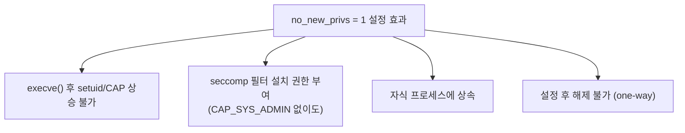
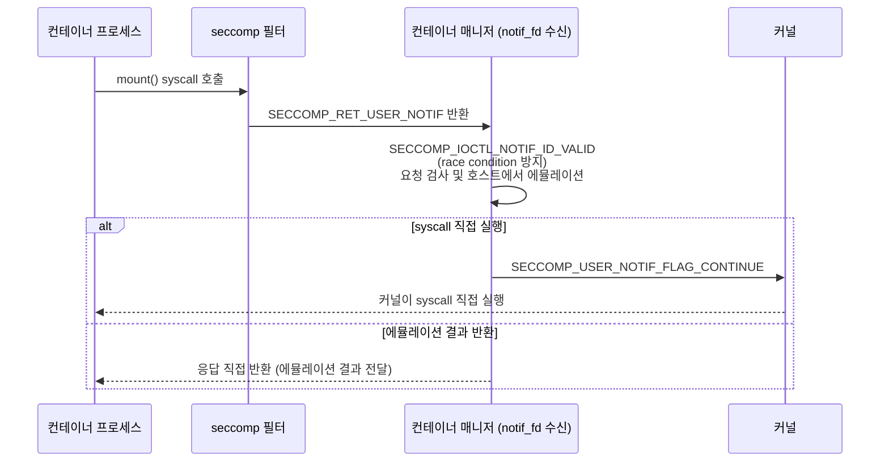

# seccomp-bpf와 시스템콜 필터링

seccomp(Secure Computing Mode)는 프로세스가 호출할 수 있는
syscall을 커널 수준에서 필터링하는 Linux 보안 메커니즘이다.
컨테이너 환경에서 커널 공격 표면을 줄이는 핵심 방어층이다.

---

## Mode 비교

| 항목 | Strict (Mode 1) | Filter (Mode 2, seccomp-bpf) |
|------|-----------------|------------------------------|
| 도입 버전 | Linux 2.6.12 | Linux 3.5 |
| 허용 syscall | read, write, \_exit, sigreturn 4개 | BPF 프로그램으로 정의 |
| 위반 시 동작 | SIGKILL | 반환 코드에 따라 다름 |
| 실용성 | 거의 없음 (레거시) | Docker, K8s, Chrome sandbox |

> `seccomp()` 전용 syscall은 **Linux 3.17**에 추가됐다.
> 그 이전엔 `prctl(PR_SET_SECCOMP, ...)`로만 설정 가능했다.

---

## BPF 필터 반환 코드

커널이 다수의 필터를 체인으로 평가할 때 **우선순위가 가장 높은
결과**를 적용한다.

| 우선순위 | 반환 코드 | 커널 | 동작 |
|---------|-----------|------|------|
| 1 | `SECCOMP_RET_KILL_PROCESS` | 4.14+ | 전체 프로세스 종료 |
| 2 | `SECCOMP_RET_KILL_THREAD` | 3.5+ | 호출 스레드만 종료 |
| 3 | `SECCOMP_RET_TRAP` | 3.5+ | SIGSYS 발생, syscall 미실행 |
| 4 | `SECCOMP_RET_ERRNO` | 3.5+ | 지정 errno 반환, syscall 미실행 |
| 5 | `SECCOMP_RET_USER_NOTIF` | 5.0+ | 유저스페이스 핸들러로 전달 |
| 6 | `SECCOMP_RET_TRACE` | 3.5+ | ptrace tracer에 통보 |
| 7 | `SECCOMP_RET_LOG` | 4.14+ | 로그 후 syscall 허용 |
| 8 | `SECCOMP_RET_ALLOW` | 3.5+ | 허용 |

---

## BPF 필터 구조

커널은 BPF 프로그램에 `struct seccomp_data`를 전달한다.

```c
struct seccomp_data {
    int   nr;               /* syscall 번호              */
    __u32 arch;             /* AUDIT_ARCH_* 상수         */
    __u64 instruction_pointer;
    __u64 args[6];          /* syscall 인자 0~5          */
};
```

> **아키텍처 체크 필수**: x86_64에서 syscall 번호 42는
> `connect()`이지만, x86(32비트)에서는 다른 syscall이다.
> `arch` 검사 없이 번호만 필터링하면 우회 가능하다.
> 모든 BPF 필터는 **반드시 arch 검사를 먼저** 수행해야 한다.

```c
/* 아키텍처 체크 후 syscall 필터링 예제 */
struct sock_filter filter[] = {
    /* 1. 아키텍처 확인 */
    BPF_STMT(BPF_LD | BPF_W | BPF_ABS,
             offsetof(struct seccomp_data, arch)),
    BPF_JUMP(BPF_JMP | BPF_JEQ | BPF_K,
             AUDIT_ARCH_X86_64, 1, 0),
    BPF_STMT(BPF_RET | BPF_K, SECCOMP_RET_KILL_PROCESS),

    /* 2. syscall 번호 로드 */
    BPF_STMT(BPF_LD | BPF_W | BPF_ABS,
             offsetof(struct seccomp_data, nr)),

    /* 3. 특정 syscall 차단 */
    BPF_JUMP(BPF_JMP | BPF_JEQ | BPF_K, __NR_write, 0, 1),
    BPF_STMT(BPF_RET | BPF_K, SECCOMP_RET_ERRNO | EPERM),

    /* 4. 나머지 허용 */
    BPF_STMT(BPF_RET | BPF_K, SECCOMP_RET_ALLOW),
};
```

---

## libseccomp (권장 API)

raw BPF 대신 libseccomp를 사용하면 아키텍처 처리를 추상화한다.

```c
#include <seccomp.h>

/* 기본 거부, 허용 목록 방식 */
scmp_filter_ctx ctx = seccomp_init(SCMP_ACT_ERRNO(EPERM));

/* 멀티아키텍처 지원 (ARM64 추가) */
seccomp_arch_add(ctx, SCMP_ARCH_AARCH64);

/* 허용 규칙 추가 */
seccomp_rule_add(ctx, SCMP_ACT_ALLOW, SCMP_SYS(read),      0);
seccomp_rule_add(ctx, SCMP_ACT_ALLOW, SCMP_SYS(write),     0);
seccomp_rule_add(ctx, SCMP_ACT_ALLOW, SCMP_SYS(exit_group),0);

/* 인자 조건 포함 — open을 읽기 전용으로만 허용 */
seccomp_rule_add(ctx, SCMP_ACT_ALLOW, SCMP_SYS(open), 1,
    SCMP_A1(SCMP_CMP_MASKED_EQ,
            O_RDONLY | O_WRONLY | O_RDWR, O_RDONLY));

/* 필터 설치 전 no_new_privs 필수 */
prctl(PR_SET_NO_NEW_PRIVS, 1, 0, 0, 0);
seccomp_load(ctx);
seccomp_release(ctx);
/* 컴파일: gcc -o app app.c -lseccomp */
```

### seccomp + no_new_privs 관계



> CAP_SYS_ADMIN을 보유한 경우 no_new_privs 없이도 필터를
> 설치할 수 있다. 그러나 컨테이너에서는 항상 no_new_privs와
> 함께 사용하는 것이 원칙이다.

---

## 컨테이너에서의 seccomp

### Docker default profile (2025 기준)

`defaultAction: SCMP_ACT_ERRNO` + 허용 화이트리스트 구조.
허용 목록에 없는 모든 syscall이 차단되며,
그 중 위험 syscall은 별도 명시적 주석으로 표시되어 있다.

**주요 차단 syscall:**

| 카테고리 | syscall | 차단 이유 |
|---------|---------|----------|
| 커널 모듈 | `init_module`, `finit_module`, `delete_module` | 루트킷 로드 |
| 키 관리 | `keyctl`, `add_key`, `request_key` | 자격증명 탈취 |
| 비동기 I/O | `io_uring_*` (Docker 25.0+) | 다수 CVE 발생 |
| 시간 설정 | `clock_settime`, `settimeofday` | 시스템 시간 변조 |
| 부팅 | `kexec_load`, `kexec_file_load` | 커널 교체 |

```bash
# 커스텀 프로파일 적용
docker run --security-opt seccomp=/path/to/profile.json nginx

# seccomp 비활성화 (비권장)
docker run --security-opt seccomp=unconfined nginx
```

### seccomp profile JSON 형식

```json
{
  "defaultAction": "SCMP_ACT_ERRNO",
  "defaultErrnoRet": 1,
  "architectures": [
    "SCMP_ARCH_X86_64",
    "SCMP_ARCH_AARCH64"
  ],
  "syscalls": [
    {
      "names": ["read", "write", "close", "fstat"],
      "action": "SCMP_ACT_ALLOW"
    },
    {
      "names": ["kill"],
      "action": "SCMP_ACT_ALLOW",
      "args": [
        {
          "index": 1,
          "value": 9,
          "op": "SCMP_CMP_NE"
        }
      ],
      "comment": "SIGKILL(9)은 차단, 나머지 시그널은 허용"
    }
  ]
}
```

### Kubernetes seccompProfile (v1.19 stable)

```yaml
apiVersion: v1
kind: Pod
spec:
  securityContext:
    seccompProfile:
      type: RuntimeDefault      # 런타임 기본 프로파일
  containers:
  - name: app
    securityContext:
      seccompProfile:
        type: Localhost
        localhostProfile: profiles/app.json
        # 기준 경로: /var/lib/kubelet/seccomp/
```

| 타입 | 동작 |
|------|------|
| `Unconfined` | seccomp 비활성화 |
| `RuntimeDefault` | containerd/CRI-O 기본 프로파일 적용 |
| `Localhost` | 노드 `/var/lib/kubelet/seccomp/` 하위 파일 |

> **기본값**: `seccompDefault: true` 미설정 클러스터는
> 명시하지 않은 파드에 `Unconfined`가 적용된다.
> K8s 1.27+ 에서 kubelet `seccompDefault: true`(GA)를 설정하거나,
> 일부 관리형 클러스터(GKE, EKS 최신)는 이미 활성화된 경우가 있다.

### seccompDefault (K8s 1.27 stable)

```yaml
# /etc/kubernetes/kubelet.yaml (KubeletConfiguration)
apiVersion: kubelet.config.k8s.io/v1beta1
kind: KubeletConfiguration
seccompDefault: true   # 모든 파드에 RuntimeDefault 적용
```

> **주의**: `privileged: true` 컨테이너는 seccomp, AppArmor,
> SELinux를 모두 우회한다. 체크리스트의 다른 설정과 무관하게
> 특권 컨테이너에는 어떠한 seccomp 제한도 적용되지 않는다.

> **CVE-2023-2431**: K8s 1.24~1.27.1에서
> `type: Localhost` + 빈 `localhostProfile` 설정 시
> 의도치 않게 Unconfined로 동작.
> 1.24.14 / 1.25.10 / 1.26.5 / 1.27.2에서 수정됨.

---

## 실무 프로파일 작성 워크플로

```
1. strace -c 로 후보 syscall 목록 확인
         ↓
2. oci-seccomp-bpf-hook 으로 정확한 프로파일 생성
         ↓
3. 생성된 프로파일 검토 (불필요 syscall 제거)
         ↓
4. SCMP_ACT_LOG 로 audit 모드 테스트
         ↓
5. SCMP_ACT_ERRNO 로 전환 (프로덕션 적용)
```

### strace로 syscall 추출

```bash
# 앱 실행 중 syscall 통계
strace -c -f -e trace=all -- nginx -g 'daemon off;'

# 실행 중인 프로세스에 attach
strace -f -p $(pidof nginx) -e trace=all 2>&1 | \
  grep -oP '^[a-z_0-9]+' | sort -u
```

### oci-seccomp-bpf-hook (eBPF 기반 자동 생성)

strace는 에러 처리 경로, 시그널 핸들러, 초기화 시 한 번만
호출되는 syscall을 놓친다. strace로 만든 프로파일을 프로덕션에
그대로 적용하면 예외 상황에서 장애가 발생한다.
eBPF 기반 훅은 컨테이너의 모든 syscall을 정확히 캡처한다.

```bash
# Podman으로 추적 실행 → 프로파일 자동 생성
sudo podman run \
  --annotation \
  io.containers.trace-syscall="of:/tmp/nginx-profile.json" \
  --rm nginx nginx -g 'daemon off;'

# 기존 프로파일에 추가 추적
sudo podman run \
  --annotation \
  io.containers.trace-syscall="if:/tmp/base.json;of:/tmp/nginx-final.json" \
  nginx nginx -t
```

> `raw_syscalls:sys_enter` eBPF 트레이스포인트로 훅 연결.
> PID 네임스페이스 기반으로 해당 컨테이너 syscall만 캡처.

---

## 주요 차단 대상 syscall

### 컨테이너 탈출 벡터

| syscall | 위험 이유 |
|---------|----------|
| `ptrace` | 호스트 프로세스 메모리 조작, 실행 흐름 변조 |
| `process_vm_readv/writev` | ptrace 없이 타 프로세스 메모리 직접 접근 |
| `keyctl`, `add_key` | 커널 키링 조작, 호스트 자격증명 탈취 |
| `io_uring_*` | 비동기 I/O, 다수 CVE (CVE-2022-2588 등) |
| `unshare(CLONE_NEWUSER)` | user NS 생성 → CAP 확보 경로 |
| `init_module`, `finit_module` | 루트킷 커널 모듈 로드 |

---

## seccomp notify (SECCOMP_RET_USER_NOTIF)

비특권 컨테이너에서 `mount`, `mknod` 등을 에뮬레이션하는
고급 기능이다 (Linux 5.0+).
**대부분의 경우 직접 구현할 필요 없다.** containerd 1.6+,
Podman 4.0+, LXD 4.0+가 rootless 컨테이너에서 이미 내부적으로
처리한다. 직접 구현이 필요한 경우는 커스텀 컨테이너 런타임이나
특수 에뮬레이션 레이어를 개발할 때다.



> **TOCTOU 주의**: supervisor가 응답하는 동안
> 인자 포인터가 가리키는 메모리를 다른 스레드가 수정 가능.
> 항상 `SECCOMP_IOCTL_NOTIF_ID_VALID`로 요청 유효성 확인 후
> 처리해야 한다.

---

## 성능 오버헤드

```bash
# BPF JIT 활성화 확인
# Linux 4.15+ x86_64는 기본 활성화
sysctl net.core.bpf_jit_enable
# 0=비활성, 1=활성, 2=활성+디버그

sysctl -w net.core.bpf_jit_enable=1
```

| 조건 | 오버헤드 |
|------|---------|
| JIT 미활성화 | syscall-intensive 워크로드에서 수십 % 가능 |
| JIT 활성화 | 동일 워크로드 대비 2~3× 성능 향상 |
| gVisor 내부 (2024) | BPF 명령어 최적화로 29% 절감 달성 |

> 실제 오버헤드는 워크로드의 syscall 빈도에 따라 크게 달라진다.
> 대부분의 일반 서비스는 I/O 바운드가 아닌 한 수 % 미만이다.

---

## 위반 디버깅

### auditd 연동

```bash
# SECCOMP 이벤트 확인
ausearch -m SECCOMP --start today

# 위반한 syscall 이름으로 요약
ausearch -m SECCOMP --start today | \
  aureport --syscall --summary -i

# 예시 출력:
# type=SECCOMP ... syscall=41 SYSCALL=socket
# → socket() 이 차단됨 → 프로파일에 추가 필요
```

### SIGSYS 핸들러 (SECCOMP_RET_TRAP 사용 시)

```c
static void sigsys_handler(int sig,
                            siginfo_t *info, void *ctx) {
    /* info->si_syscall = 위반한 syscall 번호 */
    fprintf(stderr, "seccomp violation: syscall=%d\n",
            info->si_syscall);
    _exit(1);
}

struct sigaction sa = {
    .sa_sigaction = sigsys_handler,
    .sa_flags     = SA_SIGINFO,
};
sigaction(SIGSYS, &sa, NULL);
```

### strace로 직접 추적

```bash
# seccomp/prctl syscall 추적
strace -e seccomp,prctl myapp

# EPERM 발생 syscall 확인
strace -f myapp 2>&1 | grep "EPERM\|SIGSYS"
```

---

## 최소 권한 체크리스트

```
[ ] seccompProfile: RuntimeDefault 이상 적용
[ ] 커스텀 앱: strace/oci-seccomp-bpf-hook으로 프로파일 생성
[ ] privileged: true 사용 금지 (seccomp 우회됨)
[ ] allowPrivilegeEscalation: false (no_new_privs 활성화)
[ ] capabilities: drop: ["ALL"] 후 필요한 것만 추가
[ ] K8s 1.25+: kubelet seccompDefault: true 설정 권장
[ ] CVE-2023-2431 패치 확인
    (K8s 1.24.14+ / 1.25.10+ / 1.26.5+ / 1.27.2+)
[ ] SCMP_ACT_LOG로 충분히 테스트 후 ERRNO 모드 전환
```

---

## 참고 자료

- [Seccomp BPF — Linux Kernel Documentation](https://docs.kernel.org/userspace-api/seccomp_filter.html)
  — 확인: 2026-04-17
- [seccomp(2) — man7.org](https://man7.org/linux/man-pages/man2/seccomp.2.html)
  — 확인: 2026-04-17
- [Docker Seccomp Security Profiles](https://docs.docker.com/engine/security/seccomp/)
  — 확인: 2026-04-17
- [Kubernetes: Restrict Syscalls with seccomp](https://kubernetes.io/docs/tutorials/security/seccomp/)
  — 확인: 2026-04-17
- [oci-seccomp-bpf-hook — GitHub](https://github.com/containers/oci-seccomp-bpf-hook)
  — 확인: 2026-04-17
- [Optimizing seccomp in gVisor (2024)](https://gvisor.dev/blog/2024/02/01/seccomp/)
  — 확인: 2026-04-17
- [Container Security Fundamentals pt.6 — Datadog](https://securitylabs.datadoghq.com/articles/container-security-fundamentals-part-6/)
  — 확인: 2026-04-17
