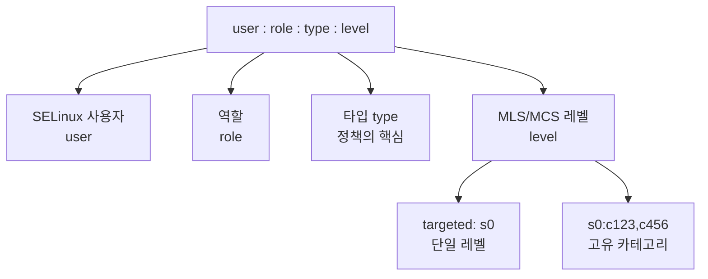
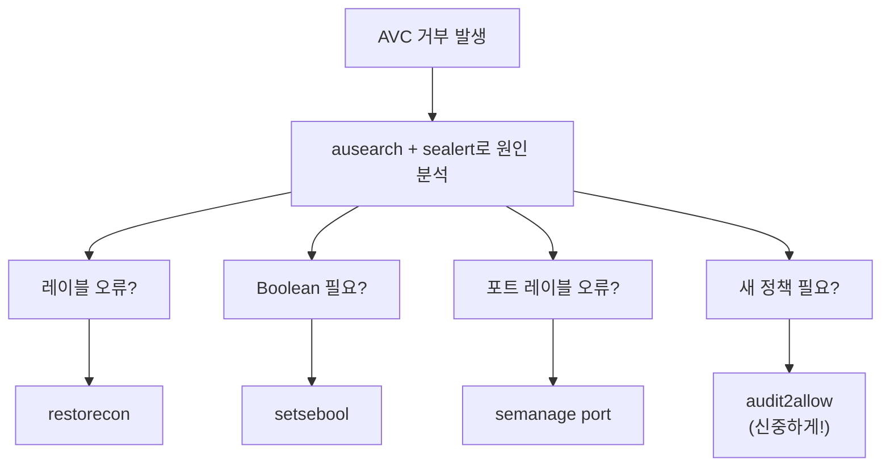

# SELinux 기본과 운영

SELinux(Security-Enhanced Linux)는 NSA가 개발한
MAC(Mandatory Access Control) 구현체다.
전통적인 DAC(사용자/그룹 기반 권한)를 우회하는 공격을
커널 수준에서 차단한다. RHEL/CentOS/Fedora의 기본 보안 모듈이다.

---

## DAC vs MAC

| 항목 | DAC (전통적 권한 모델) | MAC (SELinux) |
|------|----------------------|--------------|
| 권한 결정 주체 | 파일 소유자 | 커널 정책 |
| root 권한 | 모든 것 가능 | 정책을 벗어나면 거부 |
| 프로세스 탈취 시 | 전체 권한 획득 | 해당 도메인만 접근 가능 |

---

## 모드 (Mode)

| 모드 | 동작 |
|------|------|
| **Enforcing** | 정책 위반 차단 + 감사 로그 기록 |
| **Permissive** | 차단 없이 로그만 기록 (트러블슈팅용) |
| **Disabled** | SELinux 비활성화 |

```bash
# 현재 모드 확인
getenforce
sestatus

# 런타임 모드 변경 (재부팅 불필요, 영구 아님)
setenforce 0   # Permissive
setenforce 1   # Enforcing

# 영구 설정
# /etc/selinux/config
SELINUX=enforcing    # enforcing | permissive | disabled
SELINUXTYPE=targeted
```

> **절대 Disabled로 설정하지 말 것.**
> Disabled → Enforcing 직접 전환 시 레이블이 없는 파일로 인해
> **부팅 실패**가 발생할 수 있다.
>
> 안전한 전환 절차:
> 1. `/etc/selinux/config`에서 `SELINUX=permissive` 설정
> 2. `fixfiles -F onboot` 실행 (재부팅 시 재레이블 트리거)
> 3. 재부팅 (Permissive 상태에서 전체 재레이블 완료)
> 4. 재레이블 성공 확인 후 `SELINUX=enforcing` 변경 → 재부팅

---

## 핵심 개념: 레이블(Label)

SELinux는 모든 파일, 프로세스, 포트에 **레이블(컨텍스트)**을 부여한다.



> **컨테이너/Kubernetes에서 MCS**: Kubernetes는 SELinux 활성화
> 노드에서 비권한 파드에 자동으로 고유 MCS 카테고리를 부여한다.
> `s0:c123,c456` 같은 고유 레이블로 파드 간 볼륨 접근을
> 커널 수준에서 차단한다.
> (`pod-security.kubernetes.io/enforce=restricted` 정책 적용 시)

```bash
# 파일 레이블 확인
ls -Z /etc/passwd
# system_u:object_r:passwd_file_t:s0

# 프로세스 레이블 확인
ps auxZ | grep nginx
# system_u:system_r:httpd_t:s0  nginx

# 포트 레이블 확인
semanage port -l | grep http
# http_port_t    tcp    80, 443, 8008, 8009, 8443
```

---

## 정책 타입

| 타입 | 설명 | 사용 환경 |
|------|------|---------|
| **targeted** | 주요 서비스만 제한, 나머지는 unconfined | 대부분의 RHEL/Fedora |
| **mls** | Multi-Level Security, 군사급 | 극도로 민감한 환경 |
| **minimum** | targeted의 최소 버전 | 임베디드 |

```bash
# 현재 정책 확인
sestatus | grep "Loaded policy"
```

---

## AVC 거부 (AVC Denial) 이해

SELinux가 접근을 거부하면 AVC(Access Vector Cache) 거부 메시지를
audit 로그에 기록한다.

```bash
# AVC 거부 확인
ausearch -m AVC,USER_AVC --start today
ausearch -m AVC -ts recent | tail -20

# 또는
journalctl -t setroubleshoot -n 20
```

### AVC 메시지 해석

```
type=AVC msg=audit(1713340800.123:456): avc:  denied  { write }
for  pid=1234 comm="nginx" name="myapp.pid"
dev="sda1" ino=78901
scontext=system_u:system_r:httpd_t:s0
tcontext=system_u:object_r:var_run_t:s0
tclass=file permissive=0
```

| 필드 | 의미 |
|------|------|
| `denied { write }` | write 권한이 거부됨 |
| `comm="nginx"` | nginx 프로세스 |
| `scontext=httpd_t` | 소스: httpd 도메인 |
| `tcontext=var_run_t` | 대상: var_run 타입 파일 |
| `tclass=file` | 객체 클래스: 파일 |

```bash
# sealert: 사람이 읽기 쉬운 설명 + 해결책 제시
sealert -a /var/log/audit/audit.log

# 특정 AVC의 해결책 확인
audit2why < /var/log/audit/audit.log
```

---

## 트러블슈팅 흐름



### 1. 레이블 복원 (restorecon)

파일 컨텍스트가 잘못 설정된 경우.

```bash
# 단일 파일 복원
restorecon -v /var/www/html/index.html

# 디렉토리 재귀 복원
restorecon -Rv /var/www/html/

# 현재 레이블 확인 후 예상 레이블과 비교
matchpathcon /var/www/html/index.html
ls -Z /var/www/html/index.html
```

### 2. SELinux Boolean

사전 정의된 정책 스위치.

```bash
# 모든 boolean 목록
semanage boolean -l
getsebool -a

# 자주 쓰는 boolean
setsebool -P httpd_can_network_connect 1   # nginx → 외부 연결
setsebool -P httpd_use_nfs 1               # NFS 마운트 사용
setsebool -P httpd_read_user_content 1     # 사용자 홈 읽기

# -P: 영구 적용 (재부팅 후에도 유지)
```

### 3. 포트 레이블 (semanage port)

기본 포트 외 포트를 사용하는 경우.

```bash
# nginx를 8080 포트로 실행하려면
semanage port -a -t http_port_t -p tcp 8080

# 현재 포트 레이블 확인
semanage port -l | grep http

# 포트 레이블 삭제
semanage port -d -t http_port_t -p tcp 8080
```

### 4. 파일 컨텍스트 영구 변경 (semanage fcontext)

```bash
# 새 경로를 영구 레이블로 등록
semanage fcontext -a -t httpd_sys_content_t "/data/webroot(/.*)?"

# 적용
restorecon -Rv /data/webroot/

# 등록된 컨텍스트 확인
semanage fcontext -l | grep webroot
```

### 5. 커스텀 정책 (audit2allow)

```bash
# audit2allow: AVC 로그로부터 허용 규칙 생성
# 주의: 검토 없이 무분별하게 적용하면 보안 구멍
ausearch -m AVC --start today | audit2allow -M mymodule

# 생성된 정책 검토 (반드시 먼저 확인!)
cat mymodule.te

# 적용
semodule -i mymodule.pp

# 확인
semodule -l | grep mymodule
```

> **audit2allow 주의사항**: 레이블·Boolean·포트 문제가
> 아닌지 먼저 확인 후 최후 수단으로 사용할 것.
> AVC가 발생하자마자 `audit2allow`로 달려가면
> 정책이 복잡해지고 보안 구멍이 생긴다.
> 생성된 `.te` 파일을 반드시 검토하고,
> `allow httpd_t unconfined_t:*:*;` 같은 과도한 규칙은
> SELinux 보호를 무력화한다.

---

## 실무 운영 패턴

### 새 서비스 배포 시

```bash
# 1단계: 특정 도메인만 Permissive로 전환 (시스템 전체 아님)
# setenforce 0 은 전체 보호 해제 → 프로덕션에서 절대 사용 금지
semanage permissive -a httpd_t   # 해당 도메인만 Permissive

# 적용 확인
semanage permissive -l

# 2단계: 서비스 운영하며 AVC 로그 수집 (충분한 시간)
ausearch -m AVC --start today > avc.log

# 3단계: 필요한 정책 파악
audit2why < avc.log

# 4단계: Boolean/fcontext로 해결 가능하면 그것을 우선
# 레이블 문제 → restorecon / semanage fcontext
# Boolean 문제 → setsebool -P
# 포트 문제 → semanage port
# 그래도 안 되면 audit2allow (최소 정책, 반드시 검토)

# 5단계: 도메인 Permissive 해제 (Enforcing 복원)
semanage permissive -d httpd_t
```

### 파일 레이블 확인 자동화

```bash
#!/bin/bash
# 주요 경로의 SELinux 레이블 이상 감지
PATHS=("/var/www" "/etc/nginx" "/etc/mysql")

for path in "${PATHS[@]}"; do
    echo "=== $path ==="
    ls -Zd "$path"
done
```

---

## 배포판 지원 현황

| 배포판 | SELinux 기본 상태 |
|--------|-----------------|
| RHEL 7/8/9 | Enforcing (targeted) |
| CentOS Stream | Enforcing (targeted) |
| Fedora | Enforcing (targeted) |
| Rocky Linux / AlmaLinux | Enforcing (targeted) |
| Ubuntu / Debian | **AppArmor** (SELinux는 선택) |

> Ubuntu/Debian 환경은 다음 문서
> [AppArmor 기본과 운영](apparmor.md)을 참조.

---

## 참고 자료

- [Using SELinux - Red Hat Documentation](https://docs.redhat.com/en/documentation/red_hat_enterprise_linux/9/html/using_selinux/)
  — 확인: 2026-04-17
- [SELinux Project Wiki](https://selinuxproject.org/)
  — 확인: 2026-04-17
- [SELinux Coloring Book (NSA/Red Hat)](https://people.redhat.com/duffy/selinux/selinux-coloring-book_A4-Stapled.pdf)
  — 확인: 2026-04-17
