# 대규모 로그 관리 전략
## (ELK, Loki, Fluentd, OpenTelemetry)

수만 개의 컨테이너가 초당 수백만 줄의 로그를 쏟아내는
환경에서 "로그를 어떻게 수집하느냐"는 비용과 신뢰성 모두에
직결된다. 이 글은 Google, Netflix, Cloudflare 수준의
프로덕션 환경을 운영하는 엔지니어가 참고할 수 있는
깊이로 전체 파이프라인을 다룬다.

---

## 1. 대규모 로그 관리 아키텍처

### 전체 파이프라인

```mermaid
flowchart LR
    subgraph Sources["로그 소스"]
        A1[컨테이너 stdout/stderr]
        A2[systemd journald]
        A3[파일 테일]
        A4[애플리케이션 SDK]
    end

    subgraph Collectors["수집 계층"]
        B1[Fluent Bit\nDaemonSet]
        B2[OTel Collector\nSidecar/Agent]
    end

    subgraph Buffer["버퍼 / 메시지 큐"]
        C1[Kafka]
        C2[Kinesis]
    end

    subgraph Storage["저장 계층"]
        D1[Loki\n라벨 기반 인덱스]
        D2[Elasticsearch\n전문 검색]
        D3[S3 / GCS\n장기 보관]
        D4[ClickHouse\n분석 쿼리]
    end

    subgraph Query["조회 / 알람"]
        E1[Grafana]
        E2[Kibana / OpenSearch Dashboards]
        E3[AlertManager]
    end

    Sources --> Collectors
    Collectors --> Buffer
    Buffer --> Storage
    Storage --> Query
```

대용량 환경에서는 수집기가 직접 저장소에 쓰지 않고,
Kafka 같은 메시지 큐를 사이에 두어 back pressure를 흡수한다.

### Pull vs Push 방식

| 구분 | Push | Pull |
|------|------|------|
| 흐름 방향 | 소스 → 수집기 | 수집기 → 소스 |
| 대표 도구 | Fluent Bit, Logstash | Prometheus (메트릭) |
| 장점 | 실시간성, 낮은 지연 | 수집기가 속도 통제 |
| 단점 | 수집기 과부하 위험 | 로그에는 부적합 |
| 로그 적합성 | ✅ 주류 방식 | ❌ 거의 사용 안 함 |

> 로그는 구조상 Push 방식이 표준이다.
> 단, 수집기 쪽에서 `Mem_Buf_Limit`, `storage.pause_on_chunks_overlimit`
> 등으로 back pressure를 반드시 설정해야 한다.

---

## 2. 로그 수집기 비교

### 주요 수집기 스펙 비교

| 항목 | Fluent Bit | Fluentd | Logstash | Vector |
|------|-----------|---------|----------|--------|
| 구현 언어 | C | Ruby/C | JRuby | Rust |
| 메모리 사용 | ~5–50 MB | ~200 MB | 500 MB–2 GB | ~50–150 MB |
| CPU 사용 | 매우 낮음 | 낮음 | 높음 | 낮음 |
| 처리량(단일 코어) | ~800K EPS | ~150K EPS | ~50K EPS | ~600K EPS |
| 플러그인 수 | ~100+ | ~1,000+ | ~400+ | ~100+ |
| 변환 언어 | Lua / WASM | Ruby | Ruby DSL | VRL (Rust) |
| K8s 친화성 | ✅ 최우선 | ✅ 양호 | ⚠️ 무거움 | ✅ 양호 |
| CNCF 등록 | ✅ Graduated | ✅ Graduated | ❌ | ❌ (Datadog OSS) |

> EPS = Events Per Second

### 2024–2025 트렌드

- **Fluent Bit**: Kubernetes 표준 수집기로 자리잡음.
  v3.x에서 WASM 플러그인, 네이티브 OTLP 출력 지원.
- **Vector**: Rust 기반으로 메모리 안전성과 고성능 두 마리
  토끼를 잡음. VRL(Vector Remap Language)로 정교한
  변환 가능. Datadog 인수 후 적극 개발 중.
- **Fluentd**: 플러그인 생태계는 최대이나 Ruby 오버헤드로
  경량화 요구사항엔 Fluent Bit로 대체 추세.
- **Logstash**: 복잡한 엔터프라이즈 파이프라인(Elastic Stack)
  에서 여전히 쓰이나 신규 도입은 감소.
- **Grafana Alloy**: Promtail이 Alloy로 통합.
  Loki 3.4 기준 Promtail은 사실상 EOL.

---

## 3. Fluent Bit 실전

### 플러그인 구조

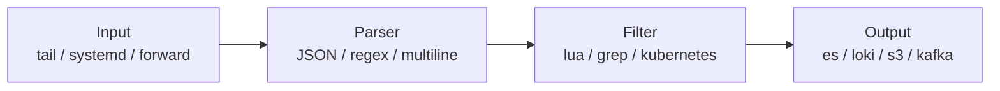

### 입력(INPUT) 플러그인

```ini
# tail: 파일 기반 수집 (컨테이너 로그)
[INPUT]
    Name              tail
    Path              /var/log/containers/*.log
    multiline.parser  cri,docker
    Tag               kube.*
    Mem_Buf_Limit     50MB
    Skip_Long_Lines   On
    Refresh_Interval  10

# systemd: journald 수집
[INPUT]
    Name            systemd
    Tag             host.*
    Systemd_Filter  _SYSTEMD_UNIT=kubelet.service
    Read_From_Tail  On

# forward: Fluentd/다른 Fluent Bit으로부터 수신
[INPUT]
    Name        forward
    Listen      0.0.0.0
    Port        24224
    Buffer_Chunk_Size 1M
    Buffer_Max_Size   6M
```

### 파서(PARSER)

```ini
# JSON 파서
[PARSER]
    Name        json
    Format      json
    Time_Key    time
    Time_Format %Y-%m-%dT%H:%M:%S.%LZ

# 정규식 파서 (nginx access log)
[PARSER]
    Name        nginx
    Format      regex
    Regex       ^(?<remote>[^ ]*) (?<host>[^ ]*) (?<user>[^ ]*) \[(?<time>[^\]]*)\] "(?<method>\S+)(?: +(?<path>[^\"]*?)(?: +\S*)?)?" (?<code>[^ ]*) (?<size>[^ ]*)
    Time_Key    time
    Time_Format %d/%b/%Y:%H:%M:%S %z

# 멀티라인 파서 (Java stack trace)
[MULTILINE_PARSER]
    Name          java_multiline
    Type          regex
    Flush_Timeout 1000
    Rule          "start_state"  "/^\d{4}-\d{2}-\d{2}/"  "java_after_first"
    Rule          "java_after_first" "/^[\t ].*/"          "java_after_first"
```

### 필터(FILTER)

```ini
# Kubernetes 메타데이터 주입
[FILTER]
    Name                kubernetes
    Match               kube.*
    Kube_URL            https://kubernetes.default.svc:443
    Kube_CA_File        /var/run/secrets/kubernetes.io/serviceaccount/ca.crt
    Kube_Token_File     /var/run/secrets/kubernetes.io/serviceaccount/token
    Kube_Tag_Prefix     kube.var.log.containers.
    Merge_Log           On
    Keep_Log            Off
    K8S-Logging.Parser  On
    K8S-Logging.Exclude On

# grep 필터: 특정 로그 제외
[FILTER]
    Name    grep
    Match   kube.*
    Exclude log ^health

# record_modifier: 필드 추가/변경
[FILTER]
    Name            record_modifier
    Match           *
    Record          cluster  prod-cluster-01
    Record          env      production
    Remove_Key      stream

# Lua 필터: 복잡한 변환
[FILTER]
    Name    lua
    Match   kube.*
    Script  /fluent-bit/scripts/enrich.lua
    Call    enrich_record
```

```lua
-- enrich.lua: 로그 레벨 정규화
function enrich_record(tag, timestamp, record)
    local log = record["log"]
    if log then
        if string.find(log, "ERROR") or string.find(log, "FATAL") then
            record["severity"] = "error"
        elseif string.find(log, "WARN") then
            record["severity"] = "warning"
        else
            record["severity"] = "info"
        end
    end
    return 1, timestamp, record
end
```

### 출력(OUTPUT) 플러그인

```ini
# Loki 출력
[OUTPUT]
    Name            loki
    Match           kube.*
    Host            loki.monitoring.svc.cluster.local
    Port            3100
    Labels          job=fluentbit, cluster=prod
    Label_Keys      $kubernetes['namespace_name'],$kubernetes['pod_name']
    Remove_Keys     kubernetes,stream
    Auto_Kubernetes_Labels On

# Elasticsearch 출력
[OUTPUT]
    Name            es
    Match           *
    Host            elasticsearch.logging.svc.cluster.local
    Port            9200
    Logstash_Format On
    Logstash_Prefix kubernetes
    Logstash_DateFormat %Y.%m.%d
    Retry_Limit     False
    tls             Off
    Replace_Dots    On
    Trace_Error     On

# S3 아카이브 출력 (콜드 티어)
[OUTPUT]
    Name                          s3
    Match                         *
    bucket                        my-log-archive
    region                        ap-northeast-2
    total_file_size               100M
    upload_timeout                10m
    use_put_object                Off
    compression                   gzip
    s3_key_format                 /year=%Y/month=%m/day=%d/hour=%H/%uuid.gz
    s3_key_format_tag_delimiters  .

# Kafka 출력 (고가용성 파이프라인)
[OUTPUT]
    Name        kafka
    Match       *
    Brokers     kafka-0.kafka:9092,kafka-1.kafka:9092
    Topics      logs.raw
    Timestamp_Key @timestamp
    Retry_Limit   False
    rdkafka.queue.buffering.max.kbytes  10240
    rdkafka.request.required.acks       1
```

### 서비스(SERVICE) 전역 설정

```ini
[SERVICE]
    Flush           5
    Log_Level       warn
    Daemon          Off
    HTTP_Server     On
    HTTP_Listen     0.0.0.0
    HTTP_Port       2020
    storage.path    /var/log/flb-storage/
    storage.sync    normal
    storage.checksum off
    # 메모리 초과 시 파일로 spill (back pressure 방지)
    storage.backlog.mem_limit 50M
```

---

## 4. Fluentd 실전

### 기본 구조

```ruby
# source: 입력 정의
<source>
  @type  tail
  path   /var/log/containers/*.log
  pos_file /var/log/fluentd-containers.log.pos
  tag    kubernetes.*
  read_from_head true
  <parse>
    @type  json
    time_format %Y-%m-%dT%H:%M:%S.%NZ
  </parse>
</source>

# filter: 데이터 변환
<filter kubernetes.**>
  @type kubernetes_metadata
  kubernetes_url   https://kubernetes.default.svc:443
  bearer_token_file /var/run/secrets/kubernetes.io/serviceaccount/token
  ca_file          /var/run/secrets/kubernetes.io/serviceaccount/ca.crt
  skip_labels      false
  skip_container_metadata false
  skip_master_url  false
  skip_namespace_metadata false
</filter>

# match: 출력 라우팅
<match kubernetes.**>
  @type elasticsearch
  host  elasticsearch.logging.svc.cluster.local
  port  9200
  logstash_format true
  logstash_prefix kubernetes
  <buffer tag,time>
    @type             file
    path              /var/log/fluentd-buffers/kubernetes.system.buffer
    flush_mode        interval
    retry_type        exponential_backoff
    flush_thread_count 2
    flush_interval    5s
    retry_forever     true
    retry_max_interval 30
    chunk_limit_size  2M
    total_limit_size  500M
    overflow_action   block
  </buffer>
</match>
```

### Buffer 설정 (overflow 방지)

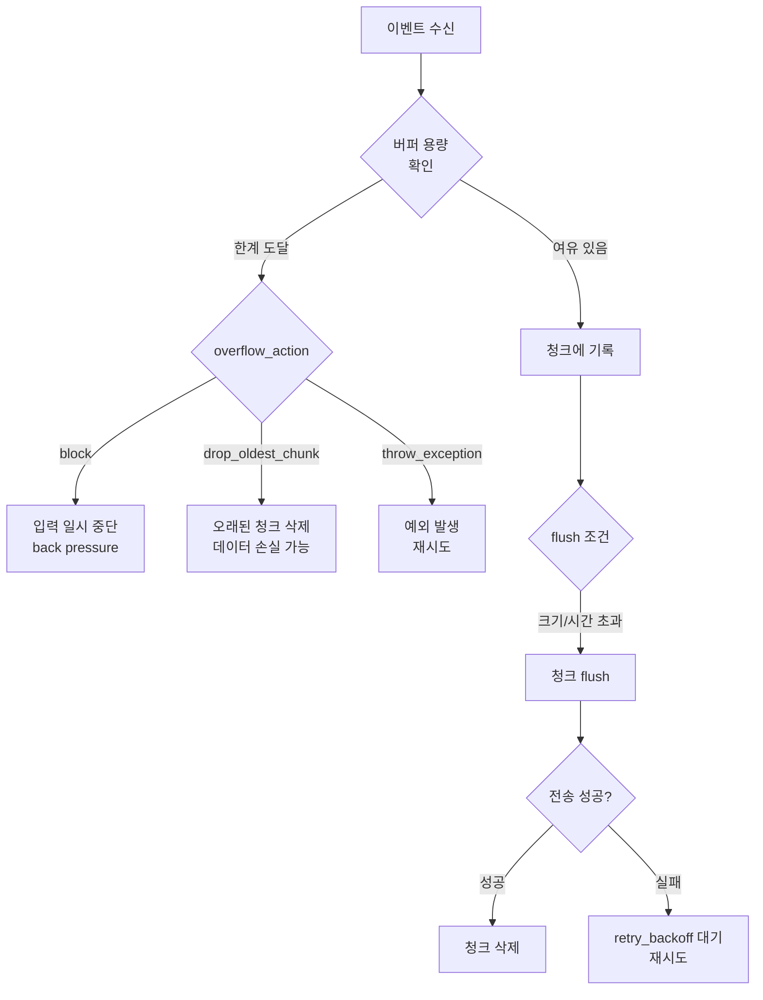

```ruby
# 실무 권장 버퍼 설정
<buffer tag,time>
  @type               file
  path                /var/log/fluentd-buffers/
  # 청크 당 최대 크기
  chunk_limit_size    8MB
  # 전체 버퍼 한도 (디스크)
  total_limit_size    8GB
  # flush 방식
  flush_mode          interval
  flush_interval      10s
  flush_thread_count  4
  # 재시도 설정
  retry_type          exponential_backoff
  retry_wait          1s
  retry_max_interval  60s
  retry_forever       true
  # 버퍼 초과 시 동작 (block 권장)
  overflow_action     block
</buffer>
```

### K8s DaemonSet 배포

```yaml
# fluentd-daemonset.yaml
apiVersion: apps/v1
kind: DaemonSet
metadata:
  name: fluentd
  namespace: logging
spec:
  selector:
    matchLabels:
      app: fluentd
  template:
    metadata:
      labels:
        app: fluentd
    spec:
      serviceAccountName: fluentd
      tolerations:
        - key: node-role.kubernetes.io/control-plane
          effect: NoSchedule
      containers:
        - name: fluentd
          image: fluent/fluentd-kubernetes-daemonset:v1.17-debian-elasticsearch8-1
          env:
            - name: FLUENT_ELASTICSEARCH_HOST
              value: elasticsearch.logging.svc.cluster.local
            - name: FLUENT_ELASTICSEARCH_PORT
              value: "9200"
          resources:
            limits:
              memory: 512Mi
              cpu: 500m
            requests:
              memory: 200Mi
              cpu: 100m
          volumeMounts:
            - name: varlog
              mountPath: /var/log
            - name: dockercontainerlogdirectory
              mountPath: /var/log/pods
              readOnly: true
            - name: config
              mountPath: /fluentd/etc
      volumes:
        - name: varlog
          hostPath:
            path: /var/log
        - name: dockercontainerlogdirectory
          hostPath:
            path: /var/log/pods
        - name: config
          configMap:
            name: fluentd-config
```

---

## 5. 로그 저장소 선택

### 주요 저장소 비교

| 항목 | Elasticsearch | Loki | ClickHouse | OpenSearch |
|------|--------------|------|------------|------------|
| 인덱싱 방식 | 전문(Full-text) 인덱스 | 라벨만 인덱스 | 컬럼형 인덱스 | 전문 인덱스 |
| 저장 비용 | 매우 높음 | 낮음 | 낮음 | 높음 |
| 쿼리 성능 | 전문 검색 최강 | 라벨 필터 빠름 | 집계 분석 최강 | 전문 검색 강함 |
| 압축률 | ~3:1 | ~10:1 | ~15:1 | ~3:1 |
| 운영 복잡도 | 높음 | 낮음–중간 | 중간 | 높음 |
| OTel 네이티브 | ⚠️ 별도 설정 | ✅ 3.0+ 네이티브 | ⚠️ 별도 설정 | ⚠️ 별도 설정 |
| 라이선스 | SSPL (비OSI) | AGPL-3.0 | Apache 2.0 | Apache 2.0 |
| 비용 사례 | 100GB/일 → ~500GB 저장 | 100GB/일 → ~30GB 저장 | 100GB/일 → ~7GB 저장 | ~Elasticsearch 수준 |

### 선택 기준

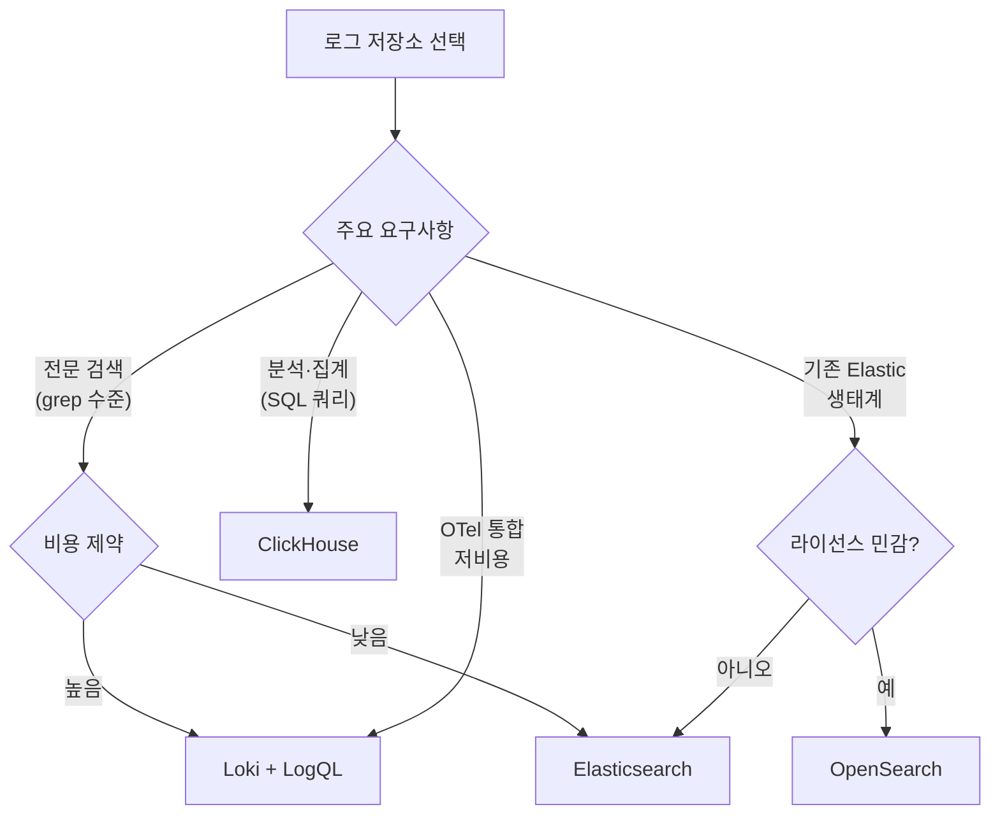

### Grafana Loki 3.x 주요 변경사항 (2024–2025)

| 버전 | 주요 변경 |
|------|----------|
| 3.0 (2024.04) | Bloom Filter 도입, 네이티브 OTLP 엔드포인트, Structured Metadata 활성화 기본값 |
| 3.1 | Bloom Filter 성능 개선, 쿼리 가속 |
| 3.3 | 스토리지 클라이언트 Thanos 기반으로 전환(옵트인) |
| 3.4 (2025.03) | Grafana Alloy로 Promtail 통합, Bloom Compactor → Planner+Builder 분리 |
| 3.5 (2025) | 스토리지 표준화 안정화, 엔터프라이즈 기능 강화 |

> **중요**: Promtail은 Loki 3.4 기준 사실상 EOL.
> Grafana Alloy 또는 Fluent Bit으로 마이그레이션 필요.
> Grafana Agent는 2025년 11월 1일 공식 EOL.

---

## 6. Loki 실전 (2025 기준)

### 아키텍처

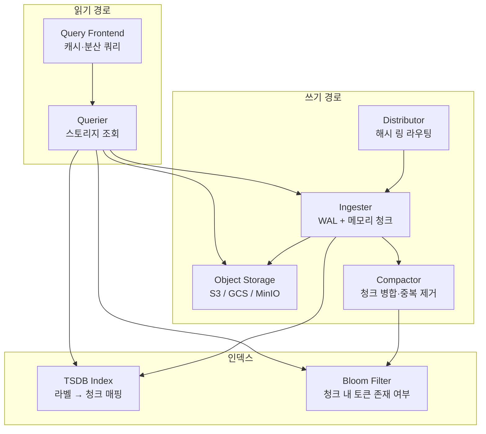

### LogQL 쿼리 예시

```logql
# 기본 스트림 선택자
{namespace="production", app="api-server"}

# 텍스트 필터
{namespace="production"} |= "ERROR" != "health_check"

# 정규식 필터
{app="nginx"} |~ "status=5[0-9]{2}"

# JSON 파서 + 필드 필터
{namespace="production"} | json | status_code >= 500

# logfmt 파서
{app="worker"} | logfmt | duration > 1s

# 라인 포맷 변환
{app="api"} | json | line_format "{{.method}} {{.path}} {{.status}}"

# 레이트 집계 (메트릭 쿼리)
rate({namespace="production"} |= "ERROR" [5m])

# 구조화 메타데이터 (Loki 3.0+, OTLP 연동)
{service_name="checkout"} | trace_id="abc123"
```

### 레이블 설계 원칙 (카디널리티 관리)

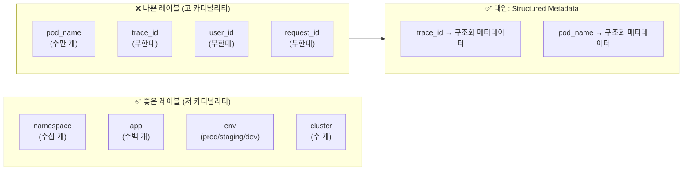

> **카디널리티 폭발** 징후: 활성 스트림 급증, Ingester 메모리
> 증가, 쿼리 지연. `loki_ingester_streams_created_total` 메트릭
> 으로 모니터링.

### 핵심 설정 파라미터

```yaml
# loki-config.yaml 핵심 부분
limits_config:
  # 스트림당 최대 레이블 수 (기본 15)
  max_label_names_per_series: 15
  # 수집 속도 제한 (테넌트별)
  ingestion_rate_mb: 10
  ingestion_burst_size_mb: 20
  # 최대 스트림 수 (테넌트별)
  max_streams_per_user: 10000

ingester:
  # 청크가 목표 크기 도달 시 flush
  chunk_target_size: 1536000   # 1.5MB
  # 마지막 이벤트 후 flush까지 대기 시간
  chunk_idle_period: 30m
  # 청크 최대 나이
  max_chunk_age: 2h
  # WAL 설정
  wal:
    enabled: true
    dir: /loki/wal

compactor:
  working_directory: /loki/compactor
  # 보존 기간 (테넌트별 override 가능)
  retention_enabled: true
  retention_delete_delay: 2h

schema_config:
  configs:
    - from: 2024-01-01
      store: tsdb          # Loki 3.x 필수
      object_store: s3
      schema: v13          # Structured Metadata 필수
      index:
        prefix: loki_index_
        period: 24h
```

---

## 7. OpenTelemetry 로그 통합

### OTel 로그 데이터 모델

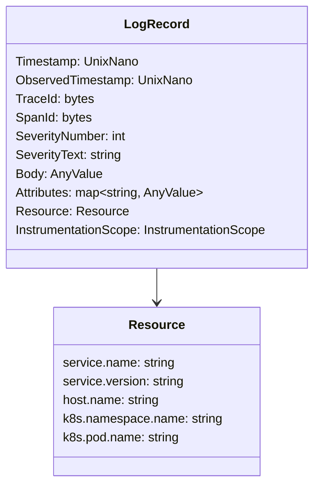

### OTel Collector 로그 파이프라인

```yaml
# otel-collector-config.yaml
receivers:
  # Fluent Bit → OTel 수신
  fluentforward:
    endpoint: 0.0.0.0:8006

  # OTLP 직접 수신
  otlp:
    protocols:
      grpc:
        endpoint: 0.0.0.0:4317
      http:
        endpoint: 0.0.0.0:4318

  # K8s 이벤트 수집
  k8sobjects:
    auth_type: serviceAccount
    objects:
      - name: events
        mode: watch
        namespaces: [production, staging]

processors:
  # 배치 처리 (성능 최적화)
  batch:
    timeout: 5s
    send_batch_size: 10000
    send_batch_max_size: 20000

  # 리소스 속성 추가
  resource:
    attributes:
      - key: cluster.name
        value: prod-cluster-01
        action: insert

  # 속성 변환
  transform/logs:
    log_statements:
      - context: log
        statements:
          # severity 정규화
          - set(severity_number, SEVERITY_NUMBER_ERROR)
              where severity_text == "FATAL"

  # 메모리 제한 (back pressure)
  memory_limiter:
    check_interval: 1s
    limit_mib: 1024
    spike_limit_mib: 256

  # 불필요한 필드 제거
  attributes:
    actions:
      - key: http.user_agent
        action: delete

exporters:
  # Loki OTLP 네이티브 (Loki 3.0+)
  otlphttp/loki:
    endpoint: http://loki.monitoring:3100/otlp
    tls:
      insecure: true

  # Elasticsearch
  elasticsearch:
    endpoints:
      - http://elasticsearch.logging:9200
    logs_index: otel-logs
    pipeline: logs

  # S3 (장기 보관)
  awss3:
    s3uploader:
      region: ap-northeast-2
      s3_bucket: log-archive
      s3_prefix: otel-logs

service:
  pipelines:
    logs:
      receivers:  [otlp, fluentforward, k8sobjects]
      processors: [memory_limiter, batch, resource, transform/logs]
      exporters:  [otlphttp/loki, elasticsearch]

    logs/archive:
      receivers:  [otlp]
      processors: [batch]
      exporters:  [awss3]
```

### Fluent Bit → OTel Collector → Loki 파이프라인

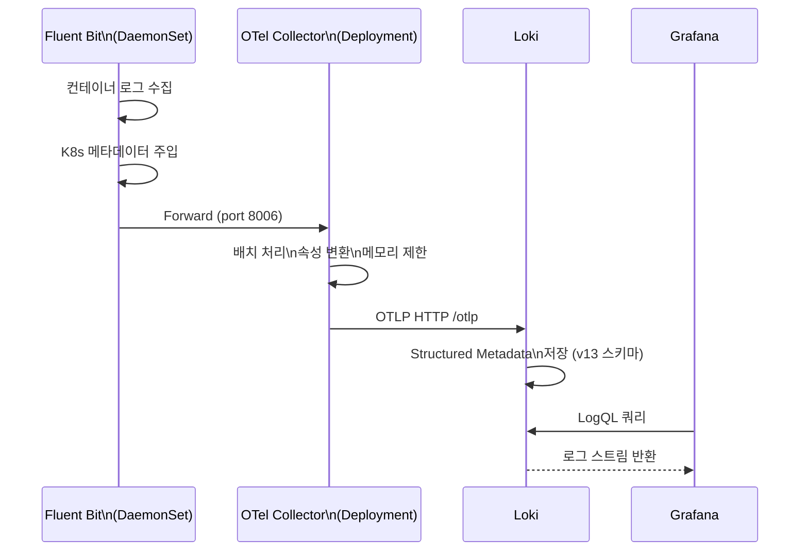

---

## 8. 쿠버네티스 통합 아키텍처

### DaemonSet vs Sidecar 패턴

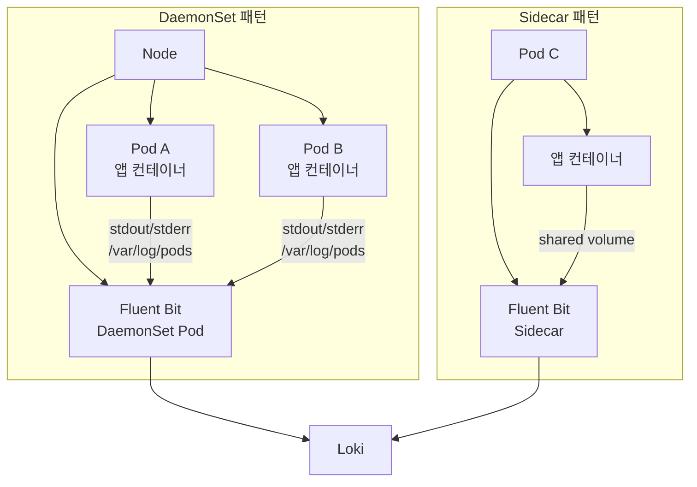

| 항목 | DaemonSet | Sidecar |
|------|-----------|---------|
| 리소스 사용 | 노드당 1개 (효율적) | Pod당 1개 (비쌈) |
| 격리 수준 | 노드 공유 | Pod 독립 |
| 멀티 테넌시 | 레이블로 분리 | 완전 독립 |
| 파일 로그 수집 | ✅ 용이 | ✅ 용이 |
| stdout 수집 | ✅ 기본 | ⚠️ 추가 설정 필요 |
| K8s 1.29+ 네이티브 사이드카 | N/A | ✅ stable(1.33) |
| 권장 상황 | 일반 클러스터 | 고격리 멀티테넌트 |

> K8s 1.29+에서 네이티브 사이드카(`initContainer` +
> `restartPolicy: Always`)가 stable(v1.33, 2025.04)로
> 졌음. 사이드카 생명주기 문제가 해소됨.

### Pod 로그 경로 매핑

```
/var/log/pods/
└── <namespace>_<pod-name>_<pod-uid>/
    └── <container-name>/
        ├── 0.log        ← 현재 로그
        └── 0.log.gz     ← 로테이션된 로그

/var/log/containers/
└── <pod-name>_<namespace>_<container-name>-<container-id>.log
    → symlink → /var/log/pods/...
```

### 멀티 테넌시 로그 분리

```ini
# Fluent Bit: 테넌트별 라우팅
[FILTER]
    Name    rewrite_tag
    Match   kube.*
    Rule    $kubernetes['namespace_name'] ^(team-a.*)$  teamA.$TAG  false
    Rule    $kubernetes['namespace_name'] ^(team-b.*)$  teamB.$TAG  false

[OUTPUT]
    Name        loki
    Match       teamA.*
    Host        loki.monitoring.svc.cluster.local
    Port        3100
    tenant_id   team-a          # Loki 멀티테넌트 헤더
    Labels      team=a

[OUTPUT]
    Name        loki
    Match       teamB.*
    Host        loki.monitoring.svc.cluster.local
    Port        3100
    tenant_id   team-b
    Labels      team=b
```

---

## 9. 비용 최적화

### 로그 샘플링 전략

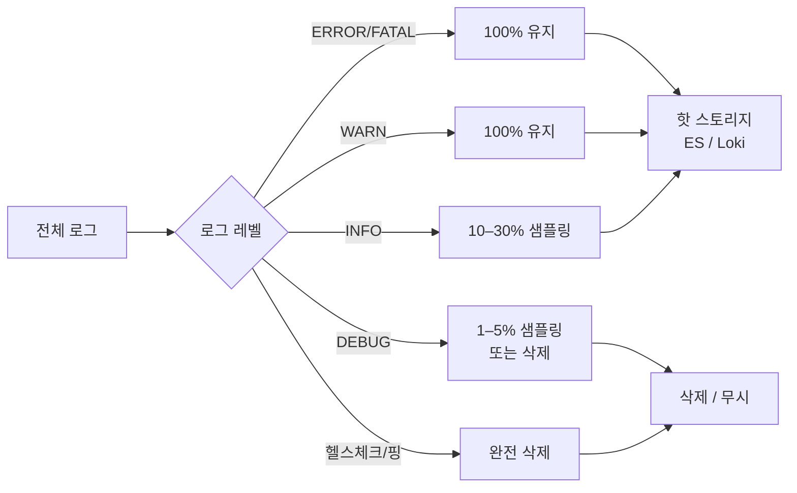

```ini
# Fluent Bit: 샘플링 필터
# 1. 헬스체크 제거
[FILTER]
    Name    grep
    Match   kube.*
    Exclude log /health
    Exclude log /readyz
    Exclude log /livez

# 2. DEBUG 로그 샘플링 (Lua)
[FILTER]
    Name    lua
    Match   kube.*
    Script  /scripts/sampling.lua
    Call    sample_debug
```

```lua
-- sampling.lua: DEBUG 로그 5% 샘플링
math.randomseed(os.time())
function sample_debug(tag, timestamp, record)
    local log = record["log"] or ""
    if string.find(log, "DEBUG") then
        if math.random() > 0.05 then
            return -1, 0, 0  -- 드롭
        end
    end
    return 1, timestamp, record
end
```

### 핫/웜/콜드 티어링

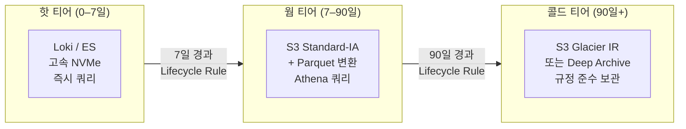

| 티어 | 저장소 | 비용 (GB/월) | 쿼리 지연 |
|------|--------|------------|---------|
| 핫 | Loki (NVMe) | $0.10–0.30 | 초 단위 |
| 웜 | S3 Standard-IA + Athena | $0.023 | 분 단위 |
| 콜드 | S3 Glacier IR | $0.004 | 분 단위 |
| 장기 | S3 Glacier Deep Archive | $0.00099 | 시간 단위 |

### 압축 형식 비교

| 압축 방식 | 압축률 | 속도 | CPU | 권장 용도 |
|---------|--------|------|-----|---------|
| gzip (level 6) | 3–5x | 중간 | 중간 | 범용 |
| zstd (level 3) | 4–7x | 빠름 | 낮음 | 실시간 파이프라인 ✅ |
| snappy | 2–3x | 매우 빠름 | 매우 낮음 | 고속 처리 우선 |
| lz4 | 2–3x | 매우 빠름 | 매우 낮음 | Kafka 내부 압축 |
| brotli | 5–8x | 느림 | 높음 | 정적 아카이브 |

> **권장**: 파이프라인 내부는 `zstd`, S3 장기 보관은 `gzip` 또는
> Parquet 컬럼형(내부 snappy/zstd).

---

## 10. 트러블슈팅과 운영

### 로그 파이프라인 지연 진단

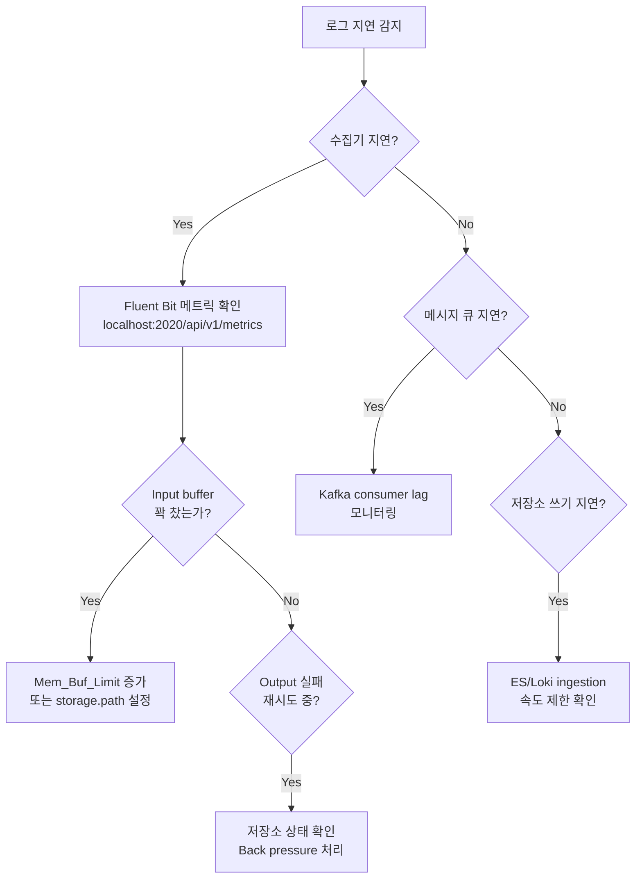

```bash
# Fluent Bit 상태 확인
curl -s localhost:2020/api/v1/metrics | jq .

# 핵심 메트릭
# input.records_total     : 수집된 이벤트 수
# output.proc_records     : 처리된 이벤트 수
# output.retried_records  : 재시도 이벤트 수
# output.dropped_records  : 드롭된 이벤트 수

# Loki 수집 상태
curl -s http://loki:3100/metrics | grep loki_ingester

# 활성 스트림 수 확인 (카디널리티 모니터링)
curl -s http://loki:3100/metrics \
  | grep loki_ingester_streams_created_total
```

### Back Pressure 처리

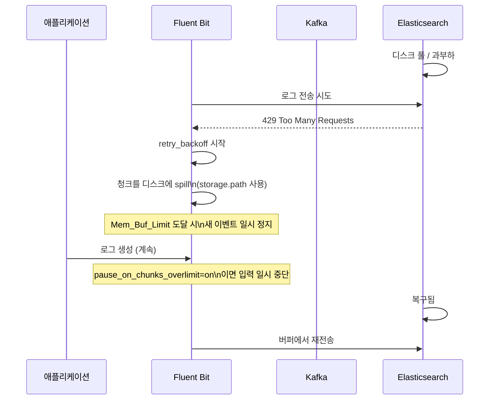

```ini
# Fluent Bit back pressure 완화 설정
[SERVICE]
    storage.path                   /var/log/flb-storage/
    storage.sync                   normal
    storage.checksum               off
    storage.backlog.mem_limit      100M

[INPUT]
    Name              tail
    Path              /var/log/containers/*.log
    Mem_Buf_Limit     50MB
    # 한도 초과 시 pause (데이터 손실 방지)
    storage.pause_on_chunks_overlimit on
    storage.type      filesystem   # 메모리 대신 파일 버퍼
```

### 중복 로그 방지

| 원인 | 방지 방법 |
|------|---------|
| Pod 재시작 후 중복 수집 | `pos_file`(Fluentd) / `DB`(Fluent Bit)로 오프셋 저장 |
| 멀티 Replica 수집기 | DaemonSet 사용 (노드당 1개 보장) |
| 네트워크 재전송 | Kafka `enable.idempotence=true` |
| Loki 중복 스트림 | `allow_structured_metadata=true` + dedup 쿼리 |

```ini
# Fluent Bit: 파일 오프셋 저장 (재시작 후 중복 방지)
[INPUT]
    Name       tail
    Path       /var/log/containers/*.log
    DB         /var/log/flb_kube.db     # SQLite 오프셋 DB
    DB.Sync    Normal
```

### 운영 체크리스트

- [ ] Fluent Bit `storage.type filesystem` 설정 (디스크 버퍼)
- [ ] `Mem_Buf_Limit` 및 `total_limit_size` 명시적 설정
- [ ] `retry_forever true` + `retry_max_interval 30` 설정
- [ ] 수집기 메트릭 Prometheus로 수집 (`:2020/metrics`)
- [ ] Loki 레이블 수 15개 이하 유지
- [ ] 카디널리티 폭발 알람 설정
- [ ] S3 수명 주기 정책으로 비용 최적화
- [ ] `pos_file` / DB 경로 영구 볼륨에 마운트
- [ ] 테넌트별 수집 속도 제한(`ingestion_rate_mb`) 설정

---

## 참고 자료

| 소스 | URL | 확인일 |
|------|-----|--------|
| Fluent Bit 공식 문서 | [docs.fluentbit.io](https://docs.fluentbit.io/manual/) | 2026-04-17 |
| Grafana Loki 3.0 릴리즈 | [grafana.com/blog](https://grafana.com/blog/2024/04/09/grafana-loki-3.0-release-all-the-new-features/) | 2026-04-17 |
| Grafana Loki 3.4 (InfoQ) | [infoq.com](https://www.infoq.com/news/2025/03/grafana-loki-updates/) | 2026-04-17 |
| Loki 레이블 베스트 프랙티스 | [grafana.com/docs](https://grafana.com/docs/loki/latest/get-started/labels/bp-labels/) | 2026-04-17 |
| Loki Structured Metadata | [grafana.com/docs](https://grafana.com/docs/loki/latest/get-started/labels/structured-metadata/) | 2026-04-17 |
| OTel Collector 설정 | [opentelemetry.io](https://opentelemetry.io/docs/collector/configuration/) | 2026-04-17 |
| OTLP 스펙 1.10.0 | [opentelemetry.io](https://opentelemetry.io/docs/specs/otlp/) | 2026-04-17 |
| Vector 공식 문서 | [vector.dev](https://vector.dev/docs/) | 2026-04-17 |
| VRL (Vector Remap Language) | [vector.dev/docs/reference/vrl](https://vector.dev/docs/reference/vrl/) | 2026-04-17 |
| IBM Cloud 수집기 벤치마크 | [medium.com/ibm-cloud](https://medium.com/ibm-cloud/log-collectors-performance-benchmarking-8c5218a08fea) | 2026-04-17 |
| CNCF 수집기 비교 | [cncf.io/blog](https://www.cncf.io/blog/2022/02/10/logstash-fluentd-fluent-bit-or-vector-how-to-choose-the-right-open-source-log-collector/) | 2026-04-17 |
| Loki vs Elasticsearch | [signoz.io](https://signoz.io/blog/loki-vs-elasticsearch/) | 2026-04-17 |
| ClickHouse 관측성 | [clickhouse.com](https://clickhouse.com/resources/engineering/best-open-source-observability-solutions) | 2026-04-17 |
| K8s 로깅 아키텍처 | [kubernetes.io](https://kubernetes.io/docs/concepts/cluster-administration/logging/) | 2026-04-17 |
| S3 + Athena 로그 비용 최적화 | [autify.com/blog](https://nocode.autify.com/blog/optimizing-cloud-application-log-management) | 2026-04-17 |
