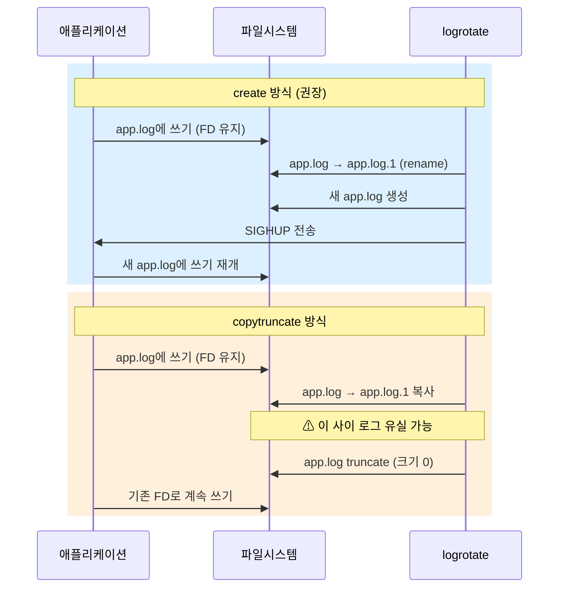
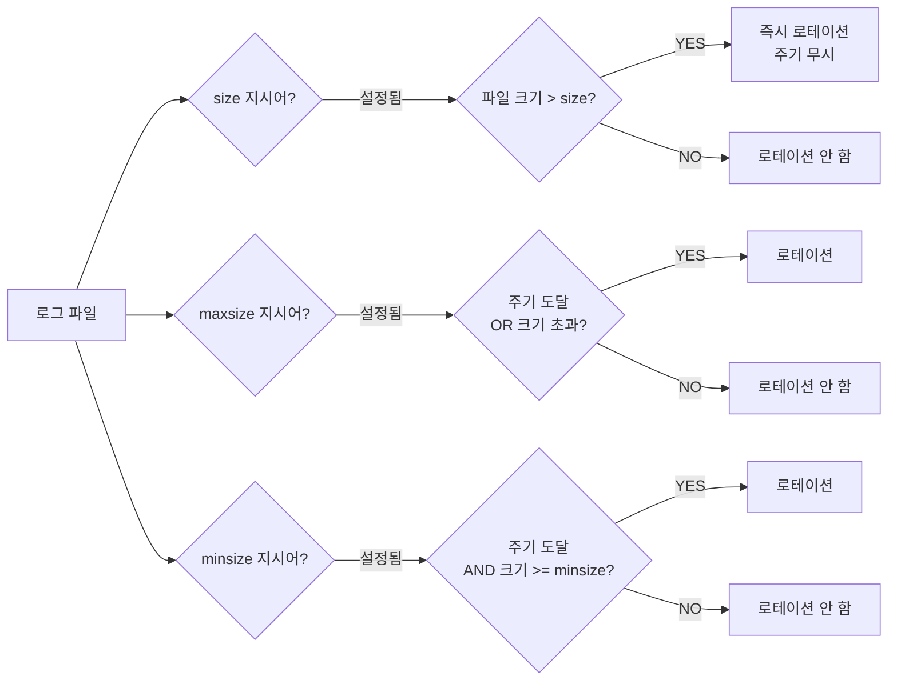

# 로그 로테이션 완전 가이드 (logrotate, systemd-journald)

로그 로테이션은 디스크 고갈을 막는 가장 기본적인 운영 안전망이다.
설정 없이 운영하면 어느 날 새벽 디스크가 가득 차서 서비스가
멈추는 사고를 겪게 된다.

---

## 1. 왜 로그 로테이션이 중요한가

### 디스크 고갈 장애 패턴

실무에서 반복되는 디스크 고갈 장애의 공통 원인은 아래와 같다.

| 원인 | 결과 |
|------|------|
| 로테이션 미설정 | 로그 파일이 수십 GB까지 무한 증가 |
| `debug` 레벨 로그를 프로덕션에 남긴 채 배포 | 트래픽 급증 시 수 시간 내 디스크 포화 |
| compress 비활성화 | 로테이션 후 파일이 그대로 용량 차지 |
| postrotate 시그널 누락 | 구 파일에 계속 쓰여 로테이션이 무의미 |
| journald 상한 미설정 | `/var/log/journal`이 디스크의 10%까지 자동 점유 |

### 로테이션이 없을 때 벌어지는 일

```
# 로테이션 없이 30일 후 Nginx 로그 예시
$ du -sh /var/log/nginx/access.log
47G     /var/log/nginx/access.log   ← 단일 파일 47 GB

# 디스크 포화 → DB 트랜잭션 실패
$ df -h /
Filesystem  Size  Used  Avail  Use%
/dev/sda1   100G  100G     0   100%
```

디스크가 100%에 달하면 다음이 연쇄 발생한다.

1. 파일 쓰기 실패 → 애플리케이션 크래시
2. DB 트랜잭션 롤백 → 데이터 정합성 위협
3. sshd 로그 실패 → 원격 접속 차단 가능성
4. systemd 저널 손상

---

## 2. logrotate 아키텍처

### 전체 실행 흐름

```mermaid
flowchart TD
    A[systemd-timer\n또는 cron.daily] -->|매일 실행| B[logrotate 바이너리]
    B --> C{/var/lib/logrotate/status\n마지막 실행 시각 확인}
    C -->|로테이션 조건 충족| D[설정 파일 파싱]
    C -->|아직 이른 경우| E[종료 - 아무것도 안 함]
    D --> F[/etc/logrotate.conf\n글로벌 설정]
    D --> G[/etc/logrotate.d/\n애플리케이션별 설정]
    F & G --> H{rotate 방식}
    H -->|create 방식| I[파일명 변경 rename\n새 파일 생성\nHUP 시그널 전송]
    H -->|copytruncate 방식| J[파일 복사 cp\n원본 파일 truncate]
    I & J --> K[압축 gzip/bzip2/zstd]
    K --> L[오래된 파일 삭제\nrotate N 초과분]
    L --> M[postrotate 스크립트 실행]
```

### create vs copytruncate 동작 비교



### create vs copytruncate 트레이드오프

| 항목 | create | copytruncate |
|------|--------|--------------|
| 데이터 유실 위험 | 없음 | 복사~truncate 사이 미세 유실 |
| 애플리케이션 재시작 | SIGHUP 필요 | 불필요 |
| 적용 대상 | nginx, apache, syslog | 파일 FD를 닫지 못하는 앱 |
| 대용량 파일 성능 | 빠름 (rename 한 번) | 느림 (파일 전체 복사) |
| 권장 여부 | **권장** | 어쩔 수 없을 때만 사용 |

---

## 3. logrotate 설정 완전 가이드

### 글로벌 설정 `/etc/logrotate.conf`

```conf
# /etc/logrotate.conf

# 기본 로테이션 주기
weekly

# 최대 보관 세대 수
rotate 4

# 로테이션 후 새 파일 생성
create

# 날짜를 파일명 접미사로 사용
dateext
dateformat -%Y%m%d

# 압축 활성화
compress

# 오래된 파일 삭제 시 오류 무시
tabooext + .dpkg-dist .dpkg-orig

# /etc/logrotate.d/ 하위 설정 포함
include /etc/logrotate.d
```

### 개별 설정 `/etc/logrotate.d/`

```conf
# /etc/logrotate.d/myapp
/var/log/myapp/*.log {
    # 로테이션 주기
    daily

    # 보관 세대 수 (숫자 클수록 더 오래 보관)
    rotate 14

    # 파일이 없어도 오류 미발생
    missingok

    # 빈 파일은 로테이션 안 함
    notifempty

    # 이 블록의 모든 파일에 postrotate를 한 번만 실행
    sharedscripts

    # 로테이션 전 실행 (무중단 배포 시 유용)
    prerotate
        /usr/bin/test -x /usr/sbin/myapp && \
        /usr/sbin/myapp --check-config
    endscript

    # 로테이션 후 실행 (로그 재오픈 신호)
    postrotate
        /usr/bin/kill -USR1 $(cat /var/run/myapp.pid 2>/dev/null) \
            2>/dev/null || true
    endscript

    # 크기 기반 추가 로테이션 (100 MB 초과 시)
    maxsize 100M

    # 최소 크기 미달 시 로테이션 건너뜀 (1 MB 미만)
    minsize 1M

    # 파일 소유권·권한 설정 (create 방식일 때)
    create 0640 myapp adm

    # 압축 비활성화 (이 파일만 예외)
    # nocompress

    # 현재 파일 압축 유예 (다음 로테이션 때 압축)
    delaycompress
}
```

### 주요 지시어 레퍼런스

| 지시어 | 설명 | 예시 |
|--------|------|------|
| `daily` / `weekly` / `monthly` | 로테이션 주기 | `daily` |
| `rotate N` | 보관 세대 수 | `rotate 7` |
| `size N` | 크기 초과 시 즉시 로테이션 (주기 무시) | `size 500M` |
| `maxsize N` | 주기 + 크기 동시 조건 (OR) | `maxsize 100M` |
| `minsize N` | 최소 크기 미달 시 생략 (AND) | `minsize 1M` |
| `compress` | gzip 압축 | - |
| `delaycompress` | 직전 세대는 압축 유예 | compress와 함께 사용 |
| `nocompress` | 압축 비활성화 | - |
| `missingok` | 파일 없어도 오류 미발생 | - |
| `notifempty` | 빈 파일 로테이션 생략 | - |
| `create MODE OWNER GROUP` | 새 로그 파일 생성 설정 | `create 0640 www-data adm` |
| `copytruncate` | FD 유지하며 로테이션 | - |
| `dateext` | 날짜를 접미사로 사용 | - |
| `dateformat FORMAT` | 날짜 형식 지정 | `dateformat -%Y%m%d` |
| `sharedscripts` | 여러 파일에 스크립트 한 번만 실행 | - |
| `postrotate` / `endscript` | 로테이션 후 실행 블록 | - |
| `prerotate` / `endscript` | 로테이션 전 실행 블록 | - |
| `firstaction` / `endscript` | 글로브 첫 파일에만 실행 | - |
| `lastaction` / `endscript` | 글로브 마지막 파일에만 실행 | - |
| `olddir DIR` | 로테이션된 파일 별도 디렉토리 보관 | `olddir /var/log/archive` |
| `extension EXT` | 특정 확장자 파일만 대상 | `extension .log` |
| `su USER GROUP` | logrotate 실행 권한 변경 | `su nginx adm` |
| `hourly` | 시간별 로테이션 (cron.hourly 필요) | - |

---

## 4. 실무 예시

### Nginx 로그 로테이션

```conf
# /etc/logrotate.d/nginx
/var/log/nginx/*.log {
    daily
    rotate 30
    compress
    delaycompress
    missingok
    notifempty
    sharedscripts
    create 0640 www-data adm

    postrotate
        # nginx -s reopen: 열린 파일 핸들을 새 파일로 교체
        if [ -f /var/run/nginx.pid ]; then
            kill -USR1 $(cat /var/run/nginx.pid)
        fi
    endscript
}
```

> `nginx -s reopen`은 내부적으로 `kill -USR1`과 동일하다.
> 마스터 프로세스가 워커에게 로그 파일 재오픈을 지시한다.

### Docker json-file 로그 관리

Docker의 기본 json-file 드라이버는 로테이션을 하지 않는다.
데몬 설정에서 전역으로 제한을 걸어야 한다.

```json
// /etc/docker/daemon.json
{
  "log-driver": "json-file",
  "log-opts": {
    "max-size": "100m",
    "max-file": "5",
    "compress": "true"
  }
}
```

```bash
# 설정 적용
sudo systemctl reload docker

# 개별 컨테이너에 오버라이드
docker run \
  --log-opt max-size=50m \
  --log-opt max-file=3 \
  myapp:latest
```

> `local` 드라이버는 기본으로 압축·로테이션을 수행하며
> 컨테이너당 100 MB를 보관한다. 고성능 환경에서 권장된다.

### 애플리케이션 로그 (copytruncate 활용)

파일 FD를 닫지 못하는 레거시 애플리케이션에 사용한다.

```conf
# /etc/logrotate.d/legacy-app
/var/log/legacy-app/app.log {
    daily
    rotate 7
    compress
    delaycompress
    missingok
    notifempty
    copytruncate       # FD를 닫을 수 없을 때만 사용
    size 200M          # 크기 초과 시 즉시 로테이션
}
```

**주의**: `copytruncate`는 대용량 파일에서 복사 시간만큼
로그가 유실된다. 감사(audit) 로그에는 절대 사용하지 않는다.

### 크기 기반 로테이션

```conf
# /etc/logrotate.d/heavy-traffic
/var/log/app/access.log {
    # size: 주기와 무관하게 크기 초과 시 즉시 로테이션
    size 500M

    rotate 10
    compress
    delaycompress
    missingok
    sharedscripts
    postrotate
        systemctl kill --signal=USR1 app.service
    endscript
}
```

---

## 5. journald 로그 크기 관리

systemd-journald는 기본적으로 디스크의 10%(최대 4 GB)까지
자동 점유한다. 프로덕션 서버에서는 반드시 상한을 설정해야 한다.

### `journald.conf` 핵심 설정

```ini
# /etc/systemd/journald.conf
[Journal]

# 저널 저장 위치: persistent (디스크) / volatile (메모리) / auto
Storage=persistent

# 저널 전체 최대 디스크 사용량
SystemMaxUse=2G

# 저널이 비워두어야 할 최소 여유 공간
SystemKeepFree=1G

# 단일 저널 파일 최대 크기
SystemMaxFileSize=128M

# 로그 보관 최대 기간
MaxRetentionSec=30day

# 단일 메시지 최대 크기 (8 KB 기본값)
MaxMessageBytes=8192

# Rate Limiting (초당 메시지 수)
RateLimitIntervalSec=30s
RateLimitBurst=10000

# 압축 (기본 활성화)
Compress=yes

# Seal (무결성 서명, FIPS 환경)
# Seal=yes
```

```bash
# 설정 적용
sudo systemctl restart systemd-journald
```

### vacuum 명령어

| 명령 | 설명 | 예시 |
|------|------|------|
| `--vacuum-size=N` | 총 크기를 N 이하로 줄임 | `--vacuum-size=500M` |
| `--vacuum-time=T` | T 이전 아카이브 삭제 | `--vacuum-time=7d` |
| `--vacuum-files=N` | 아카이브 파일 수를 N으로 제한 | `--vacuum-files=5` |
| `--rotate` | 현재 저널 즉시 아카이브 | - |
| `--disk-usage` | 현재 디스크 사용량 확인 | - |

```bash
# 현재 사용량 확인
journalctl --disk-usage

# 1 GB 이상을 차지하는 오래된 로그 삭제
journalctl --vacuum-size=1G

# 14일 이전 로그 삭제
journalctl --vacuum-time=14d

# rotate 후 vacuum (더 완전한 정리)
journalctl --rotate && journalctl --vacuum-time=7d
```

> **자동 vacuum vs 수동 vacuum**
> journald는 `SystemMaxUse`·`SystemKeepFree` 설정 내에서
> 자동으로 오래된 파일을 삭제한다. 수동 vacuum은 즉각적인
> 공간 회수나 임시 정리 작업에 사용한다.
> `--rotate` 없이 vacuum하면 활성 파일은 건드리지 않는다.

---

## 6. 컨테이너 환경 로그 관리

### Docker 로그 드라이버 비교

| 드라이버 | 로테이션 | 압축 | 성능 | 추천 시나리오 |
|---------|---------|------|------|------------|
| `json-file` | 수동 설정 필요 | 지원 | 보통 | 기본값, 소규모 |
| `local` | 자동 (100 MB/컨테이너) | 자동 | 좋음 | **프로덕션 권장** |
| `journald` | journald 관리 | - | 좋음 | systemd 통합 환경 |
| `syslog` | syslog 관리 | - | 보통 | 중앙 집중 로깅 |
| `none` | 없음 | - | 최고 | 로그 불필요 서비스 |

### Kubernetes 노드 레벨 로그 관리

kubelet이 컨테이너 로그 로테이션을 직접 담당한다.

```yaml
# /var/lib/kubelet/config.yaml
apiVersion: kubelet.config.k8s.io/v1beta1
kind: KubeletConfiguration

# 컨테이너 로그 파일 최대 크기 (기본 10Mi)
containerLogMaxSize: "50Mi"

# 컨테이너당 최대 로그 파일 수 (기본 5)
containerLogMaxFiles: 5

# 로그 모니터링 간격 (기본 10s)
containerLogMonitorInterval: "5s"

# 동시 로테이션 워커 수 (기본 1)
containerLogMaxWorkers: 2
```

```bash
# 설정 적용
sudo systemctl restart kubelet
```

> **알려진 이슈 (k8s v1.27+)**
> 고처리량 컨테이너 (50 MB/s 이상) 에서 timestamp 기반
> 로테이션 버그로 `0.log`가 무한 증가하는 문제가 보고되어 있다.
> GitHub Issue #134324 참고. 영향을 받는 환경에서는
> 노드 레벨 logrotate로 보완한다.

### 노드 레벨 logrotate 보완

```conf
# /etc/logrotate.d/kubernetes-pods
/var/log/pods/*/*.log
/var/log/pods/*/*/*.log {
    daily
    rotate 7
    compress
    delaycompress
    missingok
    notifempty
    copytruncate
    maxsize 100M
}
```

---

## 7. 모니터링과 알람

### 디스크 사용량 모니터링

```bash
# 로그 디렉토리별 사용량 확인
du -sh /var/log/*/  | sort -rh | head -20

# 특정 디렉토리 파일별 확인
find /var/log -name "*.log" -size +100M -exec ls -lh {} \;
```

### Prometheus 디스크 알람 (AlertManager 연동)

```yaml
# alert-rules.yaml
groups:
  - name: disk.rules
    rules:
      # 사용률 85% 초과 경고
      - alert: DiskSpaceWarning
        expr: >
          (node_filesystem_size_bytes{fstype!="tmpfs"}
           - node_filesystem_avail_bytes{fstype!="tmpfs"})
          / node_filesystem_size_bytes{fstype!="tmpfs"} > 0.85
        for: 5m
        labels:
          severity: warning
        annotations:
          summary: "디스크 사용률 85% 초과 ({{ $labels.instance }})"

      # 4시간 후 디스크 고갈 예측
      - alert: DiskWillFillIn4Hours
        expr: >
          predict_linear(
            node_filesystem_avail_bytes{fstype!="tmpfs"}[1h], 4 * 3600
          ) < 0
        for: 10m
        labels:
          severity: critical
        annotations:
          summary: "4시간 내 디스크 고갈 예측 ({{ $labels.instance }})"
```

### logrotate 실패 감지 (textfile collector)

```bash
#!/bin/bash
# /usr/local/bin/check-logrotate.sh
# Node Exporter textfile collector용 메트릭 생성

PROM_FILE="/var/lib/node_exporter/textfile_collector/logrotate.prom"

# logrotate 강제 실행 후 종료 코드 확인
logrotate /etc/logrotate.conf
EXIT_CODE=$?

cat > "$PROM_FILE" <<EOF
# HELP logrotate_last_exit_code logrotate 마지막 실행 종료 코드
# TYPE logrotate_last_exit_code gauge
logrotate_last_exit_code $EXIT_CODE

# HELP logrotate_last_run_timestamp logrotate 마지막 실행 시각
# TYPE logrotate_last_run_timestamp gauge
logrotate_last_run_timestamp $(date +%s)
EOF
```

```yaml
# alerting: logrotate 실패 감지
- alert: LogrotateFailure
  expr: logrotate_last_exit_code != 0
  for: 1m
  labels:
    severity: warning
  annotations:
    summary: "logrotate 실패 ({{ $labels.instance }})"
```

---

## 8. 트러블슈팅

### 디버그 모드로 설정 검증

```bash
# -d: dry-run (실제 변경 없음, 동작 시뮬레이션)
logrotate -d /etc/logrotate.d/nginx

# -v: 상세 출력
logrotate -v /etc/logrotate.conf

# 특정 설정 강제 실행 (--force 또는 -f)
logrotate -f /etc/logrotate.d/myapp
```

### 로테이션 후 로그가 구 파일에 계속 쓰이는 문제

**증상**: 로테이션은 됐는데 `app.log`가 계속 작고 `app.log.1`이 계속 커짐

**원인**: 애플리케이션이 구 FD를 계속 사용 중 (SIGHUP 미수신)

```bash
# 어떤 프로세스가 app.log.1을 열고 있는지 확인
lsof /var/log/myapp/app.log.1

# 해당 프로세스에 수동으로 시그널 전송
kill -USR1 <PID>

# 또는 서비스 재시작
systemctl reload myapp
```

### postrotate에서 PID 파일을 찾지 못하는 경우

```bash
# 방어적 postrotate 작성
postrotate
    # PID 파일이 없거나 프로세스가 없어도 오류 미발생
    if [ -f /var/run/nginx.pid ]; then
        kill -USR1 "$(cat /var/run/nginx.pid)" 2>/dev/null || true
    else
        # PID 파일 없을 때 systemd로 폴백
        systemctl kill --signal=USR1 nginx 2>/dev/null || true
    fi
endscript
```

### 권한 문제

```bash
# 오류 예시
error: error opening /var/log/myapp/app.log: Permission denied

# logrotate는 기본적으로 root로 실행됨
# 특정 사용자 권한이 필요하면 su 지시어 사용
/var/log/myapp/*.log {
    su myapp adm
    daily
    rotate 7
    ...
}
```

```bash
# logrotate 실행 이력 확인
cat /var/lib/logrotate/status

# 상태 파일이 손상된 경우 삭제 후 재실행
# (다음 실행 시 새로 생성됨)
sudo rm /var/lib/logrotate/status
sudo logrotate -f /etc/logrotate.conf
```

### `size` vs `maxsize` vs `minsize` 혼동 정리



---

## 9. 운영 체크리스트

프로덕션 서버 로그 설정 점검 시 아래를 확인한다.

```bash
# 1. 현재 logrotate 설정 확인
logrotate -d /etc/logrotate.conf 2>&1 | grep -E "error|warning"

# 2. 로그 디렉토리 용량 상위 확인
du -sh /var/log/*/ 2>/dev/null | sort -rh | head -10

# 3. 100 MB 초과 단일 파일 확인
find /var/log -name "*.log" -size +100M 2>/dev/null

# 4. journald 현재 사용량
journalctl --disk-usage

# 5. logrotate 마지막 실행 시각 확인
stat /var/lib/logrotate/status

# 6. cron/timer 활성화 확인
systemctl status logrotate.timer  # systemd 기반
ls -la /etc/cron.daily/logrotate  # cron 기반
```

---

## 참고 자료

- [logrotate(8) - Linux manual page](https://man7.org/linux/man-pages/man8/logrotate.8.html)
  (확인일: 2026-04-17)
- [Logrotate - ArchWiki](https://wiki.archlinux.org/title/Logrotate)
  (확인일: 2026-04-17)
- [systemd/Journal - ArchWiki](https://wiki.archlinux.org/title/Systemd/Journal)
  (확인일: 2026-04-17)
- [Configure logging drivers | Docker Docs](https://docs.docker.com/engine/logging/configure/)
  (확인일: 2026-04-17)
- [Logging Architecture | Kubernetes](https://kubernetes.io/docs/concepts/cluster-administration/logging/)
  (확인일: 2026-04-17)
- [Mastering Log Rotation in Linux with Logrotate - Dash0](https://www.dash0.com/guides/log-rotation-linux-logrotate)
  (확인일: 2026-04-17)
- [How to manage log files using logrotate - Datadog](https://www.datadoghq.com/blog/log-file-control-with-logrotate/)
  (확인일: 2026-04-17)
- [kubelet log rotation issue #134324 - kubernetes/kubernetes](https://github.com/kubernetes/kubernetes/issues/134324)
  (확인일: 2026-04-17)
- [node_exporter alerts - prometheus/node_exporter](https://github.com/prometheus/node_exporter/blob/master/docs/node-mixin/alerts/alerts.libsonnet)
  (확인일: 2026-04-17)
