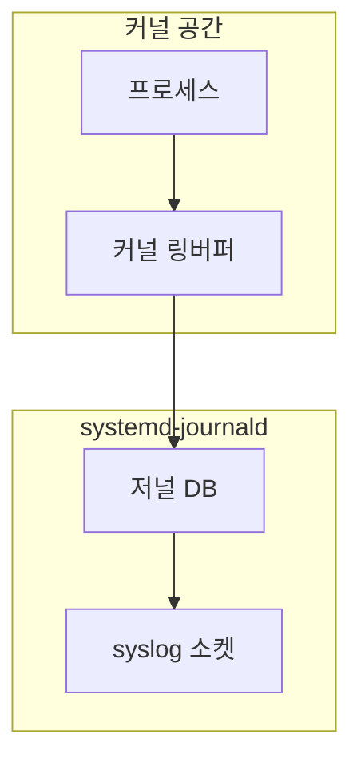
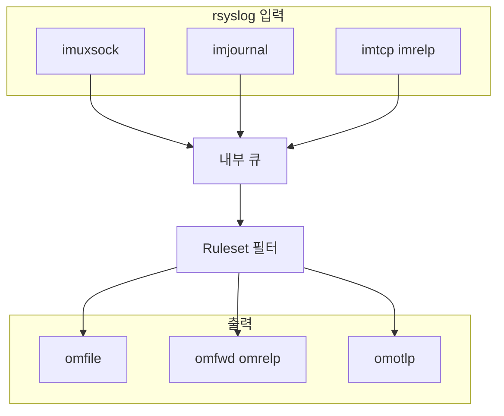
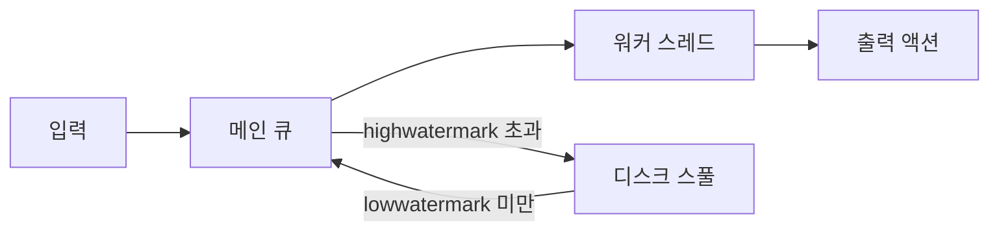
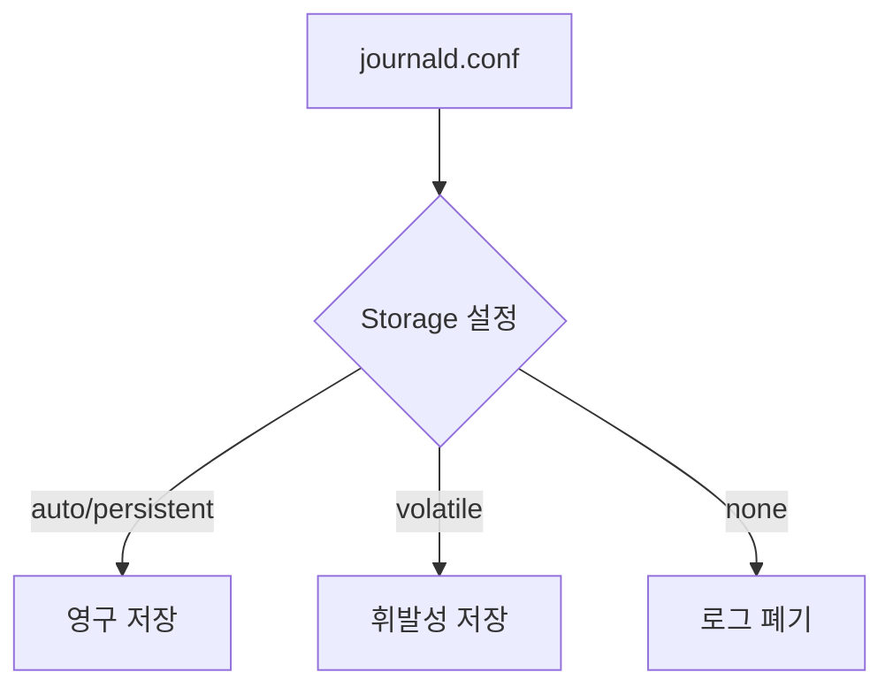
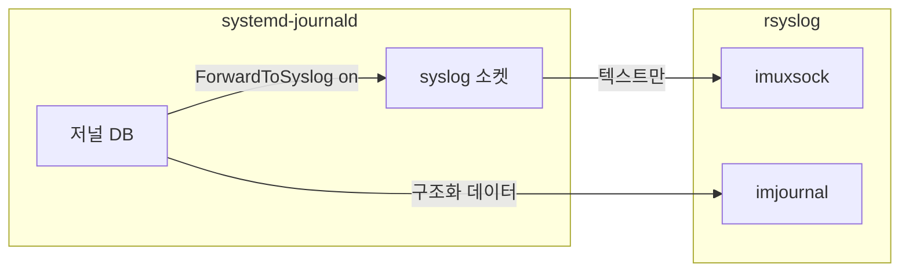
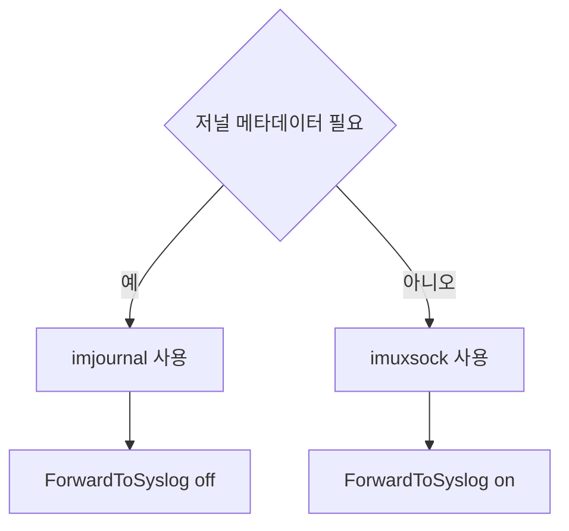
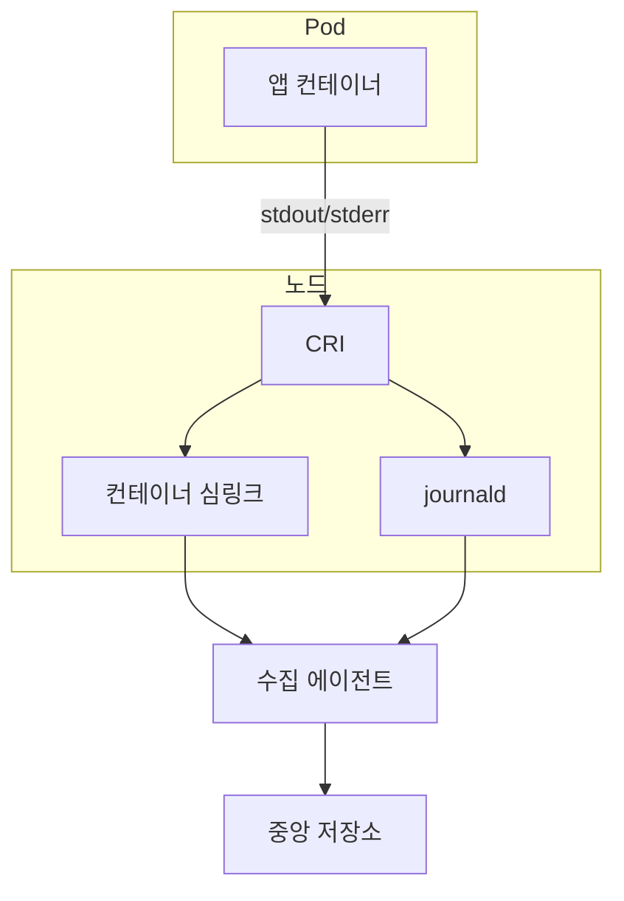
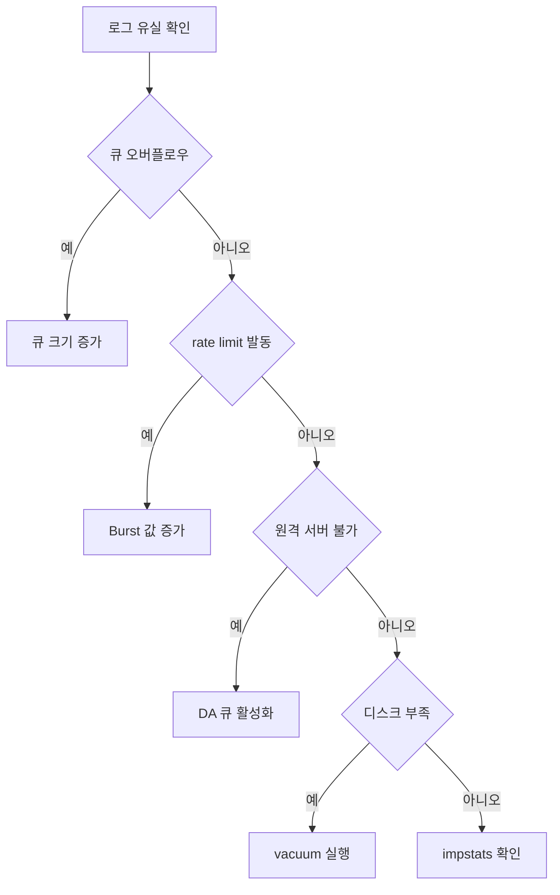

# syslog, rsyslog, journald 완전 가이드

Linux 시스템 로깅의 세 축인 syslog 프로토콜,
rsyslog 데몬, systemd-journald를 깊이 있게 다룬다.
단순한 설정 나열을 넘어 아키텍처, 성능, 운영 트러블슈팅까지
실무에서 바로 적용할 수 있는 수준으로 정리한다.

## 버전 현황 (2026)

| 컴포넌트 | 최신 버전 | 비고 |
|---------|---------|------|
| rsyslog | **8.2602.0** | 2026-02 릴리즈 (ROSI, 실험적 OCSP) |
| rsyslog (omotlp 포함) | **8.2512.0** | 2025-12, OTLP 출력 모듈 첫 포함 |
| systemd (journald) | **260** | 2026-03, SysV init 완전 제거 |
| RFC 5424 | 2009년 표준 | 현재까지 유효한 syslog 프로토콜 표준 |

> **배포판 채택 시차**: systemd 260은 상류(upstream) 기준이며,
> 2026년 상반기 현재 대부분의 LTS·엔터프라이즈 배포판은
> systemd 252~256 범위를 사용한다 (RHEL 9: 252, Ubuntu 24.04: 255).
> 롤링 릴리즈(Arch, Fedora, openSUSE Tumbleweed)에서 먼저 도입된다.

---

## 1. 아키텍처 개요

### 1.1 전체 로그 흐름

**수집 경로 (커널 → journald)**



**처리 경로 (journald → rsyslog → 출력)**



| 컴포넌트 | 경로 / 역할 |
|---------|-----------|
| `printk()` | 커널 메시지 출력 함수 |
| `/dev/kmsg` | 커널 링 버퍼 |
| `journald` 저널 DB | `/var/log/journal/` 바이너리 저장소 |
| syslog 소켓 | `/run/systemd/journal/syslog` (ForwardToSyslog 경로) |
| `imuxsock` | `/dev/log` UNIX 소켓 수신 |
| `imjournal` | 저널 DB 직접 읽기 (구조화 데이터 포함) |
| `imtcp / imrelp` | 네트워크 수신 |
| `omfile` | 파일 출력 |
| `omfwd / omrelp` | 원격 전송 |
| `omotlp` | OTLP 출력 (2025-12 개발 브랜치 merge, 8.2512.0부터 정식 포함) |

### 1.2 전통 syslog vs systemd-journald 비교

| 항목 | 전통 syslog (rsyslog) | systemd-journald |
|------|----------------------|-----------------|
| **저장 형식** | 텍스트 파일 | 바이너리 인덱스 DB |
| **구조화 데이터** | 제한적 (RFC 5424) | 네이티브 지원 (키=값) |
| **조회 성능** | grep/awk 의존 | journalctl 인덱스 검색 |
| **네트워크 전송** | 기본 기능 | 미지원 (rsyslog 위임) |
| **로그 압축** | 별도 설정 필요 | zstd 또는 lz4 (빌드 환경에 따라 다름, systemd v246 미만은 lz4) |
| **부팅 간 연속성** | 파일 직접 관리 | 부팅 ID로 자동 분리 |
| **접근 제어** | 파일 권한 | systemd-journal-gatewayd |
| **표준 준수** | RFC 3164/5424 | 독자 포맷 (syslog 전달 가능) |
| **로그 유실** | 큐 설정으로 방어 | 기본적으로 커널 소켓 기반 |

---

## 2. syslog 프로토콜

### 2.1 Priority 계산 (공통)

두 RFC 모두 동일한 Priority 공식을 사용한다.

```
Priority = Facility × 8 + Severity
```

메시지 헤더에 `<PRI>` 형식으로 인코딩된다.
예: `<165>` = Facility 20(local4) × 8 + 5(notice)

### 2.2 Facility 코드

| 코드 | 이름 | 용도 |
|------|------|------|
| 0 | kern | 커널 메시지 |
| 1 | user | 사용자 레벨 |
| 2 | mail | 메일 시스템 |
| 3 | daemon | 시스템 데몬 |
| 4 | auth | 인증·보안 |
| 5 | syslog | syslogd 내부 |
| 6 | lpr | 프린터 |
| 7 | news | 네트워크 뉴스 |
| 8 | uucp | UUCP |
| 9 | cron | 크론 데몬 |
| 10 | authpriv | 민감 인증 정보 |
| 16-23 | local0–local7 | 로컬 사용 예약 |

### 2.3 Severity (로그 레벨)

| 레벨 | 이름 | 설명 | 실무 기준 |
|------|------|------|---------|
| **0** | emerg | 시스템 사용 불가 | 즉시 페이징 |
| **1** | alert | 즉각 조치 필요 | 즉시 페이징 |
| **2** | crit | 심각한 상태 | 즉시 페이징 |
| **3** | err | 에러 | 업무 시간 대응 |
| **4** | warning | 경고 | 모니터링 대시보드 |
| **5** | notice | 정상 범위 내 주목 | 일일 검토 |
| **6** | info | 정보성 | 필요 시 참고 |
| **7** | debug | 디버그 세부 정보 | 개발/트러블슈팅용 |

### 2.4 RFC 3164 vs RFC 5424

```
# RFC 3164 (BSD syslog, 2001)
<165>Oct 11 22:14:15 mymachine myapp: error connecting to db

# RFC 5424 (2009년 표준)
<165>1 2026-04-17T22:14:15.000Z mymachine myapp 1234 ID47
     [exampleSDID@32473 iut="3" eventSource="Application"]
     BOMAn application event log entry
```

| 필드 | RFC 3164 | RFC 5424 |
|------|---------|---------|
| **버전** | 없음 | 있음 (`1`) |
| **타임스탬프** | `Oct 11 22:14:15` (로컬, 연도 없음) | ISO 8601 + 타임존 |
| **호스트명** | 있음 | 있음 |
| **APP-NAME** | TAG의 일부 | 독립 필드 |
| **PROCID** | TAG의 일부 | 독립 필드 |
| **MSGID** | 없음 | 있음 |
| **구조화 데이터** | 없음 | `[SD-ID key="val"]` |
| **메시지 크기 제한** | 1024 바이트 | 2048 바이트 |
| **실무 지원** | 대부분의 장비 기본값 | 현대 로깅 파이프라인 권장 |

> 실무 권장: 새 시스템은 RFC 5424로 구성한다.
> 레거시 네트워크 장비는 RFC 3164를 여전히 사용한다.

---

## 3. rsyslog 설정

rsyslog는 8.x 기준 **RainerScript**가 공식 권장 문법이다.
`$`로 시작하는 레거시 글로벌 디렉티브는 여전히 동작하지만
신규 설정에서는 사용을 지양한다.

### 3.1 설정 파일 구조

```
/etc/rsyslog.conf          # 메인 설정
/etc/rsyslog.d/*.conf      # 드롭인 설정 (권장)
```

```bash
# rsyslog.conf 기본 뼈대
# ── 모듈 로드 ─────────────────────────────────────
module(load="imuxsock")      # /dev/log 소켓 수신
module(load="imklog")        # 커널 로그 (커널 → /dev/kmsg)
# module(load="imjournal")   # journald 통합 시 활성화

# ── 글로벌 설정 ───────────────────────────────────
global(
  workDirectory="/var/spool/rsyslog"
  maxMessageSize="64k"
)

# ── 드롭인 포함 ───────────────────────────────────
include(file="/etc/rsyslog.d/*.conf" mode="optional")

# ── 기본 규칙 ─────────────────────────────────────
*.info;mail.none;authpriv.none;cron.none  action(type="omfile"
    file="/var/log/messages")
authpriv.*                                action(type="omfile"
    file="/var/log/secure")
mail.*                                    action(type="omfile"
    file="/var/log/maillog")
cron.*                                    action(type="omfile"
    file="/var/log/cron")
```

### 3.2 레거시 문법 vs RainerScript 비교

```bash
# ── 레거시 (비권장) ───────────────────────────────
$ModLoad imtcp
$InputTCPServerRun 514
$FileCreateMode 0640
$DirCreateMode 0755
$ActionQueueType LinkedList
$ActionQueueSize 50000

# ── RainerScript (권장) ───────────────────────────
module(load="imtcp")
input(type="imtcp" port="514")

global(
  fileCreateMode="0640"
  dirCreateMode="0755"
)

action(type="omfile"
  file="/var/log/app.log"
  queue.type="LinkedList"
  queue.size="50000"
)
```

### 3.3 JSON 포맷 출력

구조화 로그는 SIEM 파싱 비용을 크게 줄인다.

```bash
# /etc/rsyslog.d/10-json-template.conf

# JSON 템플릿 정의
template(name="json_lines" type="list") {
    constant(value="{")
    constant(value="\"timestamp\":\"")
    property(name="timereported" dateFormat="rfc3339")
    constant(value="\",\"severity\":\"")
    property(name="syslogseverity-text")
    constant(value="\",\"facility\":\"")
    property(name="syslogfacility-text")
    constant(value="\",\"hostname\":\"")
    property(name="hostname")
    constant(value="\",\"app\":\"")
    property(name="programname")
    constant(value="\",\"pid\":\"")
    property(name="procid")
    constant(value="\",\"message\":\"")
    property(name="msg" format="json")
    constant(value="\"}\n")
}

# 적용
*.* action(type="omfile"
    file="/var/log/rsyslog/json.log"
    template="json_lines"
)
```

### 3.4 중앙 집중 로그 서버 — TLS 암호화

rsyslog 8.2602.0에서 OpenSSL 네트워크 스트림 드라이버가
개선됐다 — 실험적 OCSP 인증서 폐기 검증(RFC 6960) 지원과
context double-free·설정 문자열 누수 수정이 포함된다.
어느 경우든 TLS 인증 모드는 `x509/name`을 권장한다.

```bash
# ── 서버 측: /etc/rsyslog.d/50-server-tls.conf ────

# RELP (Reliable Event Logging Protocol) — 권장
# TCP보다 강력한 전달 보장
module(load="imrelp")
input(type="imrelp"
    port="2514"
    tls="on"
    tls.caCert="/etc/pki/rsyslog/ca.pem"
    tls.myCert="/etc/pki/rsyslog/server-cert.pem"
    tls.myPrivKey="/etc/pki/rsyslog/server-key.pem"
    tls.authMode="x509/name"
    tls.permittedPeer=["*.logging.internal", "client1.example.com"]
)

# TCP + TLS (RELP 불가 환경)
module(load="imtcp"
    StreamDriver.Name="gtls"
    StreamDriver.Mode="1"
    StreamDriver.AuthMode="x509/name"
    PermittedPeer="*.logging.internal"
)
global(
    DefaultNetstreamDriverCAFile="/etc/pki/rsyslog/ca.pem"
    DefaultNetstreamDriverCertFile="/etc/pki/rsyslog/server-cert.pem"
    DefaultNetstreamDriverKeyFile="/etc/pki/rsyslog/server-key.pem"
)
input(type="imtcp" port="6514")

# 수신 로그를 호스트별로 분리 저장
template(name="DynFile" type="string"
    string="/var/log/remote/%HOSTNAME%/%PROGRAMNAME%.log"
)
*.* action(type="omfile" dynaFile="DynFile")
```

```bash
# ── 클라이언트 측: /etc/rsyslog.d/50-forward-tls.conf ──

module(load="omrelp")

# 큐 설정: 서버 연결 끊김 시 로그 보존
action(type="omrelp"
    target="logserver.internal"
    port="2514"
    tls="on"
    tls.caCert="/etc/pki/rsyslog/ca.pem"
    tls.myCert="/etc/pki/rsyslog/client-cert.pem"
    tls.myPrivKey="/etc/pki/rsyslog/client-key.pem"
    tls.authMode="x509/name"
    tls.permittedPeer="logserver.internal"
    # 큐 설정: 네트워크 단절 시 디스크 스풀
    queue.type="LinkedList"
    queue.filename="fwd_queue"
    queue.maxdiskspace="1g"
    queue.saveonshutdown="on"
    queue.size="100000"
    queue.highwatermark="80000"
    queue.lowwatermark="20000"
    action.resumeRetryCount="-1"  # 무한 재시도
)
```

### 3.5 실무 필터링 예시

```bash
# /etc/rsyslog.d/30-filters.conf

# 특정 앱 로그 분리
if $programname == "nginx" then {
    action(type="omfile" file="/var/log/nginx/access.log")
    stop  # 이후 규칙 처리 중단
}

# Severity 기반 필터 (emerg~err만 원격 전송)
if $syslogseverity <= 3 then {
    action(type="omfwd"
        target="siem.internal"
        port="514"
        protocol="tcp"
    )
}

# 특정 메시지 패턴 무시 (노이즈 제거)
if $msg contains "Connection refused" and
   $programname == "healthcheck" then stop

# facility 기반 분리
auth,authpriv.* action(type="omfile" file="/var/log/auth.log")
```

### 3.6 성능 튜닝 — 큐 설정



| 컴포넌트 | 설명 |
|---------|------|
| 입력 | `imuxsock` / `imtcp` |
| 메인 큐 | LinkedList 타입 인메모리 큐 |
| 워커 스레드 | `queue.workerThreads` 설정값으로 병렬 처리 |
| 디스크 스풀 | DA 모드: highwatermark 초과 시 활성화 |
| 출력 액션 | `omfile` / `omfwd` |

```bash
# /etc/rsyslog.d/00-performance.conf

# 메인 큐 튜닝
main_queue(
    queue.type="LinkedList"
    queue.size="200000"              # 최대 메시지 수
    queue.workerThreads="4"          # 병렬 처리 스레드 수
    queue.workerThreadMinimumMessages="5000"
    queue.timeoutWorkerthreadshutdown="60000"

    # Disk-Assisted 큐 (메모리 넘치면 디스크 사용)
    queue.filename="mainqueue"       # 이 값이 있으면 DA 활성화
    queue.maxdiskspace="2g"
    queue.highwatermark="160000"     # 80%에서 디스크로 넘침
    queue.lowwatermark="40000"       # 20%로 회복 시 메모리로
    queue.saveonshutdown="on"        # 종료 시 큐 디스크 저장
)

# 배치 처리로 I/O 줄이기
action(type="omfile"
    file="/var/log/messages"
    ioBufferSize="64k"
    flushOnTXEnd="off"               # 매 메시지마다 flush 안 함
    asyncWriting="on"
)
```

---

## 4. systemd-journald

### 4.1 저장 구조



| Storage 값 | 저장 위치 | 특징 |
|-----------|---------|------|
| `auto` (기본) | `/var/log/journal/` (디렉토리 존재 시) | 없으면 volatile로 동작 |
| `persistent` | `/var/log/journal/<machine-id>/` | 재부팅 후에도 유지 |
| `volatile` | `/run/log/journal/<machine-id>/` | 재부팅 시 초기화 |
| `none` | 저장 안 함 | 로그 폐기 (컨테이너 등) |

### 4.2 journald.conf 주요 설정

```ini
# /etc/systemd/journald.conf
# 변경 시 dropin 사용 권장:
# /etc/systemd/journald.conf.d/99-custom.conf

[Journal]
# 저장 방식
Storage=persistent          # auto | persistent | volatile | none

# 압축 (기본 on, zstd)
Compress=yes

# rsyslog로 전달 여부
# imuxsock보다 성능 낮음, 구조화 데이터 불필요 시 off 권장
# rsyslog과 함께 운영하는 경우 imjournal 방식 사용 시 off.
# 단순 ForwardToSyslog 방식 사용 시 yes 필요 (5절 참고)
ForwardToSyslog=no

# kmsg로 전달 여부
ForwardToKMsg=no

# ── 영구 저장소 크기 제한 ───────────────────────────
# 파일시스템의 10% (최대 4GiB)
SystemMaxUse=2G

# 항상 이 크기만큼 디스크 여유 유지
SystemKeepFree=1G

# 단일 저널 파일 최대 크기
# SystemMaxUse의 1/8이 기본값
SystemMaxFileSize=256M

# 보관 기간 제한 (크기+시간 중 먼저 도달한 기준)
MaxRetentionSec=1month

# ── 휘발성 저장소 크기 제한 ───────────────────────
RuntimeMaxUse=200M
RuntimeKeepFree=500M
RuntimeMaxFileSize=25M

# ── 속도 제한 ─────────────────────────────────────
# 30초 동안 10000개 초과 시 드롭 (서비스별 적용)
RateLimitIntervalSec=30s
RateLimitBurst=10000

# ── 크기·타임아웃 ─────────────────────────────────
MaxLevelStore=debug         # 저장할 최대 레벨
MaxLevelSyslog=debug        # syslog 전달 최대 레벨
MaxLevelKMsg=notice
MaxLevelConsole=err
MaxLevelWall=emerg

# ── 저널 필드 크기 제한 ───────────────────────────
MaxFieldSize=64K

# 감사 로그 수집 여부
Audit=yes
```

### 4.3 영구 저장 활성화

```bash
# /var/log/journal 디렉토리 생성 → auto → persistent로 전환
sudo mkdir -p /var/log/journal
sudo systemd-tmpfiles --create --prefix /var/log/journal
sudo systemctl restart systemd-journald

# 또는 journald.conf에 명시
echo '[Journal]
Storage=persistent' | sudo tee /etc/systemd/journald.conf.d/99-persistent.conf
sudo systemctl restart systemd-journald
```

### 4.4 journalctl 실무 명령어

```bash
# ── 기본 조회 ────────────────────────────────────
journalctl                            # 전체 로그
journalctl -f                         # 실시간 추적 (tail -f)
journalctl -b                         # 현재 부팅 로그
journalctl -b -1                      # 이전 부팅 로그
journalctl --list-boots               # 부팅 목록

# ── 서비스/유닛 필터 ──────────────────────────────
journalctl -u nginx.service           # 특정 서비스
journalctl -u nginx -u postgresql -f  # 여러 서비스 동시
journalctl _SYSTEMD_UNIT=nginx.service

# ── 시간 범위 ────────────────────────────────────
journalctl --since "2026-04-17 10:00" --until "2026-04-17 12:00"
journalctl --since "1 hour ago"
journalctl --since today
journalctl --since yesterday

# ── 심각도 필터 ───────────────────────────────────
journalctl -p err                     # err 이상만 (emerg~err)
journalctl -p warning..err            # warning~err 범위
journalctl -p 0..3                    # 숫자로도 가능

# ── 프로세스/사용자 필터 ──────────────────────────
journalctl _PID=1234
journalctl _UID=1000
journalctl _COMM=sshd                 # 프로세스 이름
journalctl _EXE=/usr/sbin/sshd

# ── 출력 포맷 ────────────────────────────────────
journalctl -u nginx -o json-pretty    # JSON 포맷
journalctl -u nginx -o cat            # 메시지만
journalctl -u nginx -o verbose        # 모든 필드
journalctl -u nginx -o short-precise  # 마이크로초 포함

# ── 로그 수 제한 ──────────────────────────────────
journalctl -n 100                     # 최근 100줄
journalctl -u nginx -n 50 -f          # 최근 50줄 + 실시간

# ── 커널 메시지 ───────────────────────────────────
journalctl -k                         # dmesg 동등
journalctl -k -b -1                   # 이전 부팅 커널 로그

# ── 컨테이너 / Kubernetes ─────────────────────────
journalctl CONTAINER_NAME=my-container
journalctl _TRANSPORT=journal CONTAINER_ID_FULL=abc123
```

### 4.5 저널 크기 관리와 vacuum

```bash
# 현재 저널 디스크 사용량 확인
journalctl --disk-usage

# ── Vacuum (수동 정리) ─────────────────────────────
# 크기 기준
journalctl --vacuum-size=1G

# 시간 기준 (1개월 이상 오래된 파일 삭제)
journalctl --vacuum-time=1month

# 파일 개수 기준
journalctl --vacuum-files=10

# 로테이션 후 vacuum (가장 효과적)
journalctl --rotate && journalctl --vacuum-time=2weeks

# ── 자동화: systemd-tmpfiles 연동 ─────────────────
# MaxRetentionSec이 journald.conf에 설정되어 있으면 자동
# 별도 cron/timer 불필요

# ── 저널 파일 검증 ────────────────────────────────
journalctl --verify
```

---

## 5. rsyslog ↔ journald 연동

### 5.1 연동 방식 비교



| 방식 | 성능 | 구조화 데이터 | 권장 시나리오 |
|------|------|------------|------------|
| `ForwardToSyslog=yes` + `imuxsock` | 빠름 | 미지원 | 단순 텍스트 전달, 고성능 |
| `imjournal` | 느림 | 지원 | Kubernetes 메타데이터 등 필요 시 |

### 5.2 imjournal 설정

```bash
# /etc/rsyslog.d/10-imjournal.conf

module(load="imjournal"
    UsePid="system"             # systemd 기록 PID(_PID) 사용. 기본 동작(syslog PID)은 syslog 값 사용
    FileCreateMode="0644"
    StateFile="/var/lib/rsyslog/imjournal.state"  # 읽기 오프셋 유지
    Ratelimit.Interval="600"    # 600초 동안
    Ratelimit.Burst="20000"     # 20000개 허용
    IgnorePreviousMessages="off"  # 재시작 시 이전 로그 재처리
    DefaultSeverity="notice"
    DefaultFacility="user"
)
```

### 5.3 권장 구성 결정 트리



| 조건 | 모듈 | journald.conf |
|------|------|---------------|
| K8s 메타데이터, 컨테이너 정보 필요 | `imjournal` | `ForwardToSyslog=no` |
| 단순 텍스트 전달, 고성능 우선 | `imuxsock` | `ForwardToSyslog=yes` |

> **주의**: `imjournal`과 `ForwardToSyslog=yes`를 동시에 활성화하면
> 모든 로그가 rsyslog에 **두 번** 처리된다.

---

## 6. 컨테이너/쿠버네티스 환경

### 6.1 Docker 로그 드라이버 비교

| 드라이버 | 저장 위치 | 특징 | 권장 여부 |
|---------|---------|------|---------|
| `json-file` | `/var/lib/docker/containers/<id>/<id>-json.log` | 기본값, kubectl logs 동작 | 소규모 권장 |
| `journald` | systemd-journald | 구조화 메타데이터, journalctl 조회 가능 | 노드 저널 활용 시 |
| `fluentd` | Fluentd 서버 | 직접 전달, 추가 인프라 필요 | 대규모 환경 |
| `syslog` | rsyslog | RFC 5424, 중앙 로그 서버 연동 | 레거시 파이프라인 |
| `local` | 로컬 파일 (json-file 개선판) | 더 효율적인 파일 로테이션 | json-file 대체 권장 |

```json
// /etc/docker/daemon.json — journald 드라이버 예시
{
  "log-driver": "journald",
  "log-opts": {
    "tag": "{{.Name}}/{{.ID}}"
  }
}
```

```bash
# 컨테이너 로그 journalctl로 조회
journalctl CONTAINER_NAME=my-nginx
journalctl -f CONTAINER_NAME=my-nginx

# rsyslog imjournal로 컨테이너 로그 수집 후 필터링
# /etc/rsyslog.d/40-docker.conf
if $msg contains "CONTAINER_NAME" then {
    action(type="omfile"
        file="/var/log/containers/%syslogtag%.log"
    )
}
```

### 6.2 Kubernetes 로그 아키텍처

> **참고**: Kubernetes 환경에서는 rsyslog보다 Fluent Bit,
> Vector DaemonSet이 표준 선택지임.
> rsyslog 직접 운영은 비주류이며, 아래 예시는 레거시
> 환경 참고용으로 제공한다.



| 컴포넌트 | 설명 |
|---------|------|
| CRI | containerd / CRI-O, `/var/log/pods/`에 기록 |
| 컨테이너 심링크 | `/var/log/containers/*.log` (레거시 경로) |
| 수집 에이전트 | Fluent Bit / Vector / rsyslog DaemonSet |
| 중앙 저장소 | Loki / Elasticsearch / rsyslog 서버 |

**Kubernetes 로그 경로**:

```bash
# Pod 로그 파일 위치 (노드에서)
/var/log/pods/<namespace>_<pod>_<uid>/<container>/<seq>.log

# 컨테이너 심링크 (레거시 경로)
/var/log/containers/<pod>_<ns>_<container>-<id>.log

# kubelet 로그 (journald에 기록)
journalctl -u kubelet -f
```

**rsyslog mmkubernetes — Pod 메타데이터 추가**:

```bash
# /etc/rsyslog.d/50-kubernetes.conf
module(load="mmkubernetes"
    kubernetesurl="https://kubernetes.default.svc"
    tls.cacert="/var/run/secrets/kubernetes.io/serviceaccount/ca.crt"
    tokenfile="/var/run/secrets/kubernetes.io/serviceaccount/token"
)

# json-file 또는 CRI-O 로그 수집
input(type="imfile"
    file="/var/log/containers/*.log"
    tag="k8s"
    addmetadata="on"
    reopenOnTruncate="on"
)

# Kubernetes 메타데이터 파싱 후 원격 전송
ruleset(name="k8s_logs") {
    action(type="mmkubernetes")
    action(type="omfwd"
        target="logserver.internal"
        port="514"
        protocol="tcp"
        template="json_lines"
    )
}
```

### 6.3 OpenTelemetry 연동 (rsyslog 8.2512+)

네이티브 OTLP 출력 모듈 `omotlp`는 2025-12-11 rsyslog 개발
브랜치에 merge되었고, 2025-12 릴리즈인 **8.2512.0부터** 정식
배포된다. syslog → OTLP 파이프라인을 사이드카 없이 구성할 수 있다.

```bash
# /etc/rsyslog.d/60-otlp.conf
module(load="omotlp")

# 에러 이상 로그를 OTLP collector로 전송
if $syslogseverity <= 3 then {
    action(type="omotlp"
        server="otel-collector.monitoring.svc"
        serverPort="4318"
        # OTLP/HTTP JSON (Phase 1, gRPC는 차기 버전 예정)
        useHttps="on"
        tls.cacert="/etc/pki/otel/ca.pem"
    )
}
```

---

## 7. 트러블슈팅

### 7.1 로그 유실 원인 진단



| 원인 | 조치 |
|------|------|
| rsyslog 큐 오버플로우 | `queue.size` 증가, DA 큐 (`queue.filename`) 활성화 |
| journald rate limit 발동 | `RateLimitBurst` / `RateLimitIntervalSec` 조정 |
| 원격 서버 연결 불가 | `omrelp` + DA 큐, `action.resumeRetryCount=-1` |
| 디스크 공간 부족 | `journalctl --vacuum-*`, `logrotate -f` |
| 원인 불명 | `impstats` 모듈로 dropped 카운트 확인 |

```bash
# 1. rsyslog 내부 통계 확인
# /etc/rsyslog.d/99-stats.conf
module(load="impstats"
    interval="60"
    severity="7"
    log.syslog="on"
    log.file="/var/log/rsyslog-stats.log"
)

# 통계에서 확인할 핵심 지표
# - processed: 처리된 메시지 수
# - dropped: 드롭된 메시지 수 (0이어야 함)
# - enqueued: 큐에 쌓인 메시지 수

# 2. journald rate limit 발동 여부 확인
journalctl -u systemd-journald | grep -i "rate"
# → "Suppressed N messages from X" 메시지 확인

# 3. 저널 오류 필드 확인
journalctl --field=_TRANSPORT | sort | uniq -c
# journal / syslog / kernel / audit / driver / stdout 각각 카운트

# 4. rsyslog 설정 문법 검사
rsyslogd -N1
```

### 7.2 rsyslog 큐 오버플로우 대응

```bash
# 1. 현재 큐 상태 실시간 모니터링
# impstats 활성화 후
grep "main Q" /var/log/rsyslog-stats.log | tail -5

# 2. 빠른 임시 조치: 원격 전송 잠시 비활성화
# (데이터 보존이 전달보다 중요할 때)
systemctl stop rsyslog
# 원인 해결 후 재시작

# 3. 큐 설정 영구 조정
# /etc/rsyslog.d/00-main-queue.conf
main_queue(
    queue.type="LinkedList"
    queue.size="500000"          # 기존 대비 10배 증가
    queue.filename="mainq"
    queue.maxdiskspace="5g"
    queue.saveonshutdown="on"
    queue.highwatermark="400000"
    queue.lowwatermark="100000"
)

# 4. rsyslog 재시작 (큐 디스크 파일 있으면 자동 복구)
systemctl restart rsyslog
```

### 7.3 journald 디스크 고갈 대응

```bash
# 1. 현황 파악
df -h /var/log
journalctl --disk-usage
du -sh /var/log/journal/*/

# 2. 긴급 공간 확보 (즉시 실행 가능)
# 로테이션 후 2주 이상 된 파일 삭제
journalctl --rotate
journalctl --vacuum-time=2weeks

# 또는 1G 이하로 줄이기
journalctl --vacuum-size=1G

# 3. 영구 설정으로 재발 방지
# /etc/systemd/journald.conf.d/99-limit.conf
cat > /etc/systemd/journald.conf.d/99-limit.conf << 'EOF'
[Journal]
SystemMaxUse=2G
SystemKeepFree=1G
SystemMaxFileSize=200M
MaxRetentionSec=2weeks
EOF

systemctl restart systemd-journald

# 4. 디스크 사용 급증 원인 파악
# 로그 폭주 서비스 확인
journalctl --since "1 hour ago" | \
    awk '{print $5}' | sort | uniq -c | sort -rn | head -20
```

### 7.4 흔한 설정 실수

| 증상 | 원인 | 해결 |
|------|------|------|
| 로그가 두 번 기록됨 | `imjournal` + `ForwardToSyslog=yes` 동시 활성 | 둘 중 하나만 사용 |
| 원격 전송 재연결 시 로그 유실 | DA 큐 미설정 | `queue.filename` 추가 |
| journald 재시작 후 rsyslog 로그 누락 | `imjournal` StateFile 없음 | `StateFile` 경로 지정 |
| 구형 장비 로그 파싱 실패 | RFC 3164 날짜 형식 불일치 | `pmrfc3164` 파서 사용 |
| TLS 인증 실패 (8.2602+) | OpenSSL 드라이버 수정·OCSP 옵션 | CA chain 완전히 포함, OCSP 옵션 확인 |

---

## 8. 운영 체크리스트

**초기 설정**

- [ ] rsyslog RainerScript 문법으로 설정 작성
- [ ] journald `Storage=persistent` 설정 및 `/var/log/journal` 생성
- [ ] `ForwardToSyslog` vs `imjournal` 방식 결정 (중복 주의)
- [ ] 원격 전송: RELP + TLS, DA 큐, `action.resumeRetryCount=-1`
- [ ] `rsyslogd -N1` 문법 검사

**크기/보존 정책**

- [ ] `SystemMaxUse` + `SystemKeepFree` 설정 (여유 1G 이상)
- [ ] `MaxRetentionSec` 또는 rsyslog logrotate 연동
- [ ] DA 큐 `maxdiskspace` 제한 설정
- [ ] 주기적 vacuum 자동화 (systemd timer)

**보안**

- [ ] TLS: `x509/name` 모드, 허용 peer 명시
- [ ] rsyslog 8.2602.0 이상 업데이트 (OpenSSL 드라이버 수정·실험적 OCSP)
- [ ] `/var/log/secure`, `/var/log/auth.log` 권한 0640
- [ ] authpriv 로그 별도 파일 분리

**모니터링**

- [ ] `impstats`로 dropped 메시지 수 모니터링
- [ ] journald disk usage 알림 설정
- [ ] 큐 `highwatermark` 도달 알림
- [ ] 로그 파이프라인 end-to-end 테스트 (`logger` + `tail`)

---

## 참고 자료

- [rsyslog 공식 문서 — docs.rsyslog.com](https://docs.rsyslog.com/)
  (확인: 2026-04-17)
- [rsyslog 2025 Year in Review](https://www.rsyslog.com/the-rsyslog-2025-year-in-review/)
  (확인: 2026-04-17)
- [Native OpenTelemetry Export — omotlp 모듈](https://www.rsyslog.com/native-opentelemetry-export-arrives-introducing-the-omotlp-output-module/)
  (확인: 2026-04-17)
- [imjournal — rsyslog Systemd Journal Input Module](https://docs.rsyslog.com/doc/configuration/modules/imjournal.html)
  (확인: 2026-04-17)
- [Understanding rsyslog Queues](https://docs.rsyslog.com/doc/concepts/queues.html)
  (확인: 2026-04-17)
- [journald.conf(5) — freedesktop.org](https://www.freedesktop.org/software/systemd/man/latest/journald.conf.html)
  (확인: 2026-04-17)
- [journalctl(1) — freedesktop.org](https://www.freedesktop.org/software/systemd/man/latest/journalctl.html)
  (확인: 2026-04-17)
- [systemd/Journal — Arch Wiki](https://wiki.archlinux.org/title/Systemd/Journal)
  (확인: 2026-04-17)
- [RFC 5424 — The Syslog Protocol](https://datatracker.ietf.org/doc/html/rfc5424)
  (확인: 2026-04-17)
- [Kubernetes Logging Architecture](https://kubernetes.io/docs/concepts/cluster-administration/logging/)
  (확인: 2026-04-17)
- [mmkubernetes — Kubernetes Metadata Module](https://docs.rsyslog.com/doc//configuration/modules/mmkubernetes.html)
  (확인: 2026-04-17)
- [Encrypting Syslog Traffic with TLS — rsyslog](https://docs.rsyslog.com/doc/tutorials/tls_cert_summary.html)
  (확인: 2026-04-17)
- [Journald logging driver — Docker Docs](https://docs.docker.com/engine/logging/drivers/journald/)
  (확인: 2026-04-17)
