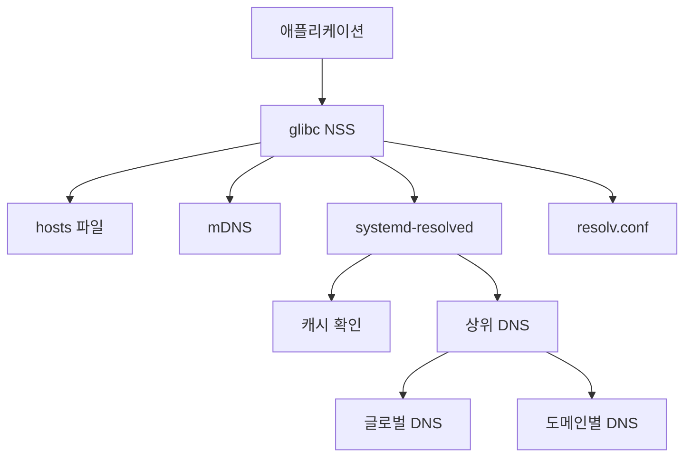
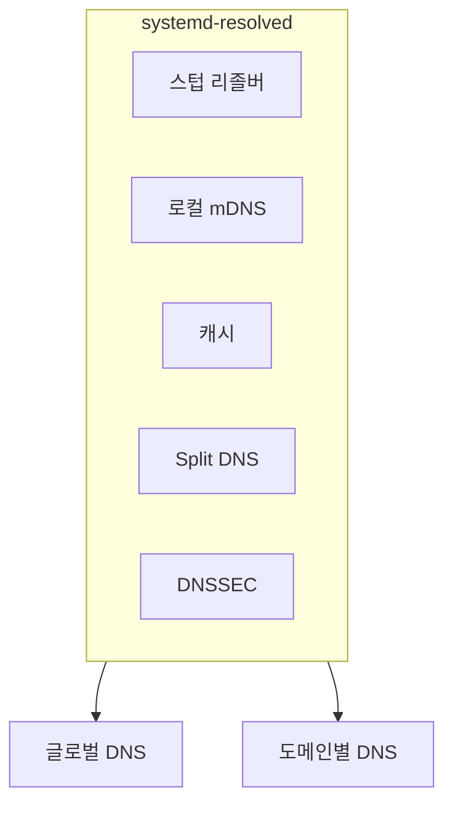
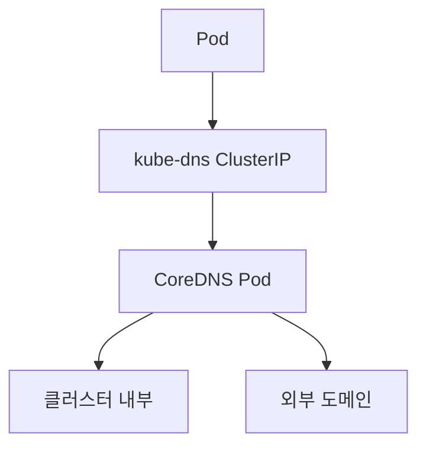

# DNS 설정 (resolv.conf, systemd-resolved, NSS)

리눅스의 DNS 조회는 단일 경로가 아닌
**계층적 파이프라인**으로 동작한다.
이 파이프라인 각 단계를 이해해야 트러블슈팅이 가능하다.

---

## 1. DNS 조회 체계 개요



| 노드 | 설명 |
|------|------|
| `glibc NSS` | `getaddrinfo()` / NSS 경로 진입점 |
| `hosts 파일` | `/etc/hosts` 로컬 정적 매핑 |
| `mDNS` | Avahi/systemd의 `.local` 도메인 처리 |
| `systemd-resolved` | 스텁 리졸버 `127.0.0.53` |
| `글로벌 DNS` | 예: `8.8.8.8` |
| `도메인별 DNS` | Split DNS 경로 |
| `resolv.conf` | systemd-resolved 미사용 시 직접 참조 |

| 단계 | 역할 | 설정 파일 |
|------|------|-----------|
| NSS | 조회 순서 제어 | `/etc/nsswitch.conf` |
| hosts 파일 | 정적 A 레코드 | `/etc/hosts` |
| 리졸버 설정 | 네임서버 지정 | `/etc/resolv.conf` |
| 스텁 리졸버 | 캐시·Split DNS | systemd-resolved |

---

## 2. /etc/resolv.conf

### 2-1. 주요 지시자

```conf
# 사용할 네임서버 (최대 3개, 순서대로 시도)
nameserver 1.1.1.1
nameserver 8.8.8.8

# 단순 호스트명 조회 시 붙이는 기본 도메인
domain example.com

# 짧은 이름 조회 시 순서대로 시도할 도메인 목록
# domain과 search는 함께 쓰면 search가 우선
search example.com internal.corp

# 동작 조정 옵션
options ndots:5        # .이 5개 미만이면 search 먼저 시도
options timeout:2      # 서버당 응답 대기(초)
options attempts:3     # 서버당 재시도 횟수
options rotate         # nameserver 라운드로빈
options edns0          # EDNS0 활성화 (DNSSEC 전제)
options use-vc         # UDP 대신 TCP 강제
```

:::caution ndots 함정
`ndots:5`(쿠버네티스 기본값)에서 `app.example.com`을
조회하면 `.`이 2개뿐이므로 search 도메인을 먼저 시도한다.
불필요한 쿼리가 급증할 수 있다.
:::

### 2-2. 심링크 상태와 관리 주체

`/etc/resolv.conf`는 직접 파일이 아니라
**심링크**인 경우가 대부분이다.

```bash
# 심링크 대상 확인
ls -la /etc/resolv.conf
```

| 심링크 대상 | 관리 주체 | 특징 |
|------------|-----------|------|
| `../run/systemd/resolve/stub-resolv.conf` | systemd-resolved | 권장. 스텁 127.0.0.53 사용 |
| `../run/systemd/resolve/resolv.conf` | systemd-resolved | 실제 업스트림 서버 직접 노출 |
| `../run/NetworkManager/resolv.conf` | NetworkManager | NM이 단독 관리 |
| 일반 파일 (심링크 아님) | 수동 관리 | 재부팅/DHCP 후 덮어써질 위험 |

```bash
# systemd-resolved 권장 설정으로 심링크 변경
sudo ln -sf /run/systemd/resolve/stub-resolv.conf \
    /etc/resolv.conf
```

### 2-3. 직접 수정 시 주의사항

- NetworkManager나 systemd-resolved가 동작 중이면
  재연결·재부팅 시 덮어쓰인다.
- `chattr +i /etc/resolv.conf`로 잠그는 것은
  임시방편이며 관리 도구와 충돌한다.
- 영구 변경은 **관리 도구의 설정 파일**을 수정한다.

```bash
# NetworkManager 사용 시 DNS를 직접 지정
# /etc/NetworkManager/conf.d/dns.conf
[main]
dns=none          # NM이 resolv.conf를 건드리지 않음

# 또는 연결별 지정
nmcli con mod "Wired connection 1" \
    ipv4.dns "1.1.1.1 8.8.8.8" \
    ipv4.ignore-auto-dns yes
```

---

## 3. systemd-resolved

Ubuntu 18.04+, Fedora, Arch 등 주요 배포판의 기본 리졸버.

### 3-1. 아키텍처



| 구성 요소 | 바인드 주소 / 역할 |
|-----------|--------------------|
| 스텁 리졸버 | `127.0.0.53:53` |
| 로컬 mDNS | `127.0.0.54:5353` |
| 글로벌 DNS | 예: `8.8.8.8` |
| 도메인별 DNS | 내부 도메인 전용 |

### 3-2. /etc/systemd/resolved.conf

```ini
[Resolve]
# 글로벌 DNS 서버 (공백으로 여러 개)
DNS=1.1.1.1 8.8.8.8

# 폴백 DNS (주 서버 모두 실패 시)
FallbackDNS=9.9.9.9 149.112.112.112

# 검색 도메인
Domains=example.com

# DNSSEC 검증
# allow-downgrade: 지원 시 활성화, 미지원 시 우회 (하단 주의사항 참고)
DNSSEC=allow-downgrade

# DNS-over-TLS
DNSOverTLS=opportunistic   # 가능하면 TLS

# mDNS (.local 해석)
MulticastDNS=yes

# LLMNR (Windows 호환 로컬 해석)
LLMNR=yes

# 캐시 크기 (항목 수)
Cache=yes
CacheFromLocalhost=no

# DNS 스텁 리스너
DNSStubListener=yes
DNSStubListenerExtra=
```

:::warning DNSSEC=allow-downgrade 보안 트레이드오프
`allow-downgrade`는 DNSSEC를 지원하지 않는 업스트림 서버에 만나면
**검증 없이 평문 DNS로 자동 다운그레이드**하므로,
다운그레이드 공격(downgrade attack)에 취약하다.

배포판별 실제 기본값이 다를 수 있다.
Ubuntu는 systemd 257.8+(2025년)에서 DNSSEC 기본값을 `no`로 되돌렸다.
홈 라우터 환경에서 `allow-downgrade`가 광범위한 DNS 장애를
유발한다는 사례가 누적되었기 때문이다.

| 값 | 동작 | 권장 환경 |
|----|------|-----------|
| `no` | DNSSEC 비활성화 | 홈/소규모 네트워크, 호환성 우선 |
| `allow-downgrade` | 지원 시 활성, 미지원 시 평문 허용 | 전환 기간·혼합 환경 (보안 타협) |
| `yes` | DNSSEC 강제, 실패 시 쿼리 실패 | 통제된 엔터프라이즈 환경 |

배포판 기본값은 릴리즈별로 달라지므로,
`resolvectl status` 출력의 `DNSSEC=` 항목으로 실제 적용값을 반드시 확인한다.
:::

### 3-3. resolvectl 명령어

```bash
# 전체 상태 보기 (인터페이스별 DNS 서버 확인)
resolvectl status

# 단일 이름 조회 (캐시 포함)
resolvectl query example.com

# 타입 지정 조회
resolvectl query --type=MX example.com
resolvectl query --type=AAAA example.com

# 통계 (쿼리 수, 캐시 적중률)
resolvectl statistics

# 캐시 플러시
resolvectl flush-caches

# 로그 레벨 임시 변경
resolvectl log-level debug

# 특정 인터페이스 DNS 설정 확인
resolvectl status eth0

# DNS-over-TLS 상태 확인
resolvectl query --legend=no --type=A example.com
```

#### resolvectl status 출력 읽기

```
Global
       Protocols: +LLMNR +mDNS +DNSOverTLS DNSSEC=allow-downgrade
resolv.conf mode: stub                    ← 스텁 모드 확인
      DNS Servers: 1.1.1.1 8.8.8.8        ← 글로벌 서버
     DNS Domain: ~.                        ← ~ = 폴백 도메인

Link 2 (eth0)
    DNS Servers: 192.168.1.1
    DNS Domain: internal.corp             ← Split DNS 도메인
```

### 3-4. DNS-over-TLS (DoT) 설정

```ini
# /etc/systemd/resolved.conf
[Resolve]
DNS=1.1.1.1#cloudflare-dns.com 8.8.8.8#dns.google
DNSOverTLS=yes          # 강제 (실패 시 쿼리 거부)
# DNSOverTLS=opportunistic  # 가능하면 TLS, 실패 시 평문
```

| DNSOverTLS 값 | 동작 |
|---------------|------|
| `no` | TLS 비활성화 |
| `opportunistic` | TLS 시도, 실패 시 평문 허용 |
| `yes` | TLS 강제, 실패 시 쿼리 실패 |

```bash
# 적용 후 재시작
sudo systemctl restart systemd-resolved

# DoT 동작 확인 (포트 853 연결 시도 로그)
journalctl -u systemd-resolved -f
```

### 3-5. Split DNS (도메인별 다른 서버)

내부 도메인은 사내 DNS, 나머지는 공용 DNS로 보내는 설정.

```bash
# NetworkManager로 인터페이스별 Split DNS 설정
nmcli con mod "VPN" \
    ipv4.dns "10.0.0.1" \
    ipv4.dns-search "internal.corp ~internal.corp"
# ~도메인: 해당 도메인을 이 인터페이스 DNS로 라우팅

# 또는 /etc/systemd/network/*.network 파일로 설정
# (systemd-networkd 사용 시)
```

```ini
# /etc/systemd/network/10-internal.network
[Match]
Name=eth1

[Network]
DNS=10.0.0.53
Domains=~internal.corp ~corp.local
```

```bash
# Split DNS 동작 확인
resolvectl status
# → Link의 DNS Domain에 ~internal.corp가 있으면 정상
```

### 3-6. LLMNR, mDNS 설정

```ini
# /etc/systemd/resolved.conf
[Resolve]
# mDNS: .local 도메인 멀티캐스트 해석
MulticastDNS=yes          # 전역 활성화
# MulticastDNS=resolve    # 응답은 안 하고 쿼리만

# LLMNR: Windows 네트워크 호환
LLMNR=yes
# LLMNR=resolve           # 쿼리만 (응답 안 함)
```

```bash
# 인터페이스별 mDNS 상태 확인
resolvectl status eth0 | grep mDNS

# mDNS 쿼리 테스트
resolvectl query printer.local

# 보안 네트워크에서는 비활성화 권장
# LLMNR=no, MulticastDNS=no
```

---

## 4. /etc/nsswitch.conf

Name Service Switch: **어떤 소스를, 어떤 순서로** 조회할지 결정.

### 4-1. hosts 라인 구성

```
# /etc/nsswitch.conf
hosts: files myhostname resolve [!UNAVAIL=return] dns
```

| 키워드 | 역할 |
|--------|------|
| `files` | `/etc/hosts` 정적 매핑 |
| `myhostname` | 로컬 호스트명 자동 해석 |
| `resolve` | systemd-resolved (nss-resolve) |
| `dns` | `/etc/resolv.conf` 기반 전통 해석 |
| `mdns4_minimal` | IPv4 전용 mDNS (Avahi) |

```
# 실무에서 자주 보는 패턴
hosts: files dns                         # 전통적 최소 구성
hosts: files myhostname resolve dns      # systemd-resolved 포함
hosts: files mdns4_minimal [NOTFOUND=return] dns myhostname
```

:::tip [!UNAVAIL=return]
`resolve`가 UNAVAIL(서비스 없음)을 반환하면
다음 소스(dns)로 계속 진행한다는 의미.
systemd-resolved가 꺼져 있어도 폴백이 작동한다.
:::

### 4-2. systemd-resolved와 nss-resolve

```bash
# nss-resolve 플러그인 설치 여부 확인
ls /usr/lib/x86_64-linux-gnu/libnss_resolve*

# 또는
getent hosts example.com    # NSS 파이프라인 전체를 통한 조회
```

| 조회 방식 | NSS 경유 여부 | 캐시 사용 |
|----------|---------------|-----------|
| `getaddrinfo()` | O | O (resolved 캐시) |
| `dig` / `nslookup` | X | X (직접 UDP) |
| `resolvectl query` | X | O (resolved 캐시) |

---

## 5. DNS 디버깅 도구

### 5-1. dig / nslookup / host 비교

| 도구 | 출력 | 특징 |
|------|------|------|
| `dig` | 상세 (섹션별) | 스크립팅·진단에 최적 |
| `nslookup` | 중간 | 인터랙티브 모드 지원 |
| `host` | 간결 | 빠른 확인용 |

```bash
# dig: 기본 A 레코드 조회
dig example.com

# 특정 서버로 직접 조회 (NSS 무시)
dig @8.8.8.8 example.com

# 타입 지정
dig example.com MX
dig example.com AAAA
dig example.com TXT

# 짧은 출력 (+short)
dig +short example.com

# 역방향 조회 (PTR)
dig -x 1.1.1.1

# 전체 위임 경로 추적 (+trace)
dig +trace example.com

# DNSSEC 검증 포함
dig +dnssec example.com

# 응답 시간 측정 (+stats)
dig +stats example.com
```

### 5-2. dig +trace 읽기

```bash
dig +trace www.example.com
```

```
# 루트 서버에서 시작
.                   518400  IN  NS  a.root-servers.net.
;; Received 525 bytes from 127.0.0.53#53 in 2 ms

# TLD 위임
com.                172800  IN  NS  a.gtld-servers.net.
;; Received 1169 bytes from 198.41.0.4#53 in 12 ms

# 권한 서버
example.com.        172800  IN  NS  a.iana-servers.net.
;; Received 616 bytes from 192.5.6.30#53 in 8 ms

# 최종 응답
www.example.com.    3600    IN  A   93.184.216.34
;; Received 56 bytes from 199.43.135.53#53 in 18 ms
```

### 5-3. resolvectl query

```bash
# NSS 우회 없이 resolved 캐시 포함 조회
resolvectl query example.com

# 타입 지정
resolvectl query --type=AAAA example.com

# DNSSEC 검증 결과 포함
resolvectl query --legend=yes example.com
```

### 5-4. systemd-resolved 로그 확인

```bash
# 실시간 로그 스트리밍
journalctl -u systemd-resolved -f

# 최근 50줄
journalctl -u systemd-resolved -n 50

# 디버그 레벨로 임시 전환
sudo resolvectl log-level debug

# 특정 시간대 로그
journalctl -u systemd-resolved \
    --since "2026-04-17 10:00" \
    --until "2026-04-17 10:05"
```

### 5-5. 디버깅 순서 체크리스트

| 순서 | 명령 | 확인 사항 |
|-----|------|-----------|
| 1 | `resolvectl status` | DNS 서버·도메인 확인 |
| 2 | `resolvectl query <host>` | resolved 캐시 통과 확인 |
| 3 | `dig @127.0.0.53 <host>` | 스텁 리졸버 직접 확인 |
| 4 | `dig @<upstream> <host>` | 업스트림 서버 직접 확인 |
| 5 | `cat /etc/resolv.conf` | 심링크 대상·내용 확인 |
| 6 | `cat /etc/nsswitch.conf` | hosts 라인 순서 확인 |
| 7 | `getent hosts <host>` | NSS 전체 파이프라인 확인 |

---

## 6. 컨테이너/쿠버네티스 환경

### 6-1. CoreDNS 연동

쿠버네티스 클러스터 내부 DNS는 CoreDNS가 담당한다.



| 노드 | 설명 |
|------|------|
| `kube-dns ClusterIP` | 기본 `10.96.0.10` |
| `클러스터 내부` | etcd / API Server 조회 |
| `외부 도메인` | 노드 DNS(`resolv.conf`)로 전달 |

```bash
# CoreDNS ConfigMap 확인
kubectl -n kube-system get configmap coredns -o yaml
```

```yaml
# Corefile 예시 (일부)
.:53 {
    errors
    ready             # readiness 엔드포인트 :8181 (CoreDNS 1.8.0+)
    health :8080      # liveness 엔드포인트
    kubernetes cluster.local in-addr.arpa ip6.arpa {
        pods insecure
        fallthrough in-addr.arpa ip6.arpa
    }
    forward . /etc/resolv.conf {   # 외부 쿼리는 노드 DNS로
        max_concurrent 1000
    }
    cache 30
    loop
    reload
    loadbalance
}
```

:::warning CoreDNS `ready` 플러그인 누락 주의
CoreDNS 1.8.0+ 이후 readiness 엔드포인트는 `ready` 플러그인이 전담한다.
`health` 플러그인만 있으면 liveness만 제공되고
readiness 엔드포인트(`:8181`)가 응답하지 않는다.

| 플러그인 | 엔드포인트 | 역할 |
|---------|-----------|------|
| `health :8080` | `/health` (liveness) | 프로세스 생존 여부 |
| `ready` | `/ready` :8181 (readiness) | 모든 플러그인 초기화 완료 여부 |

kube-proxy와 K8s가 readiness probe로 CoreDNS를
서비스에 포함할지 결정할 때 `ready` 플러그인을 사용하므로,
`ready`가 없으면 파드가 준비 상태에 진입하지 못하거나
클러스터 DNS 장애로 이어질 수 있다.
:::

### 6-2. Pod DNS 설정

#### dnsPolicy 옵션

| dnsPolicy | 동작 |
|-----------|------|
| `ClusterFirst` (기본) | 클러스터 DNS 우선, 외부는 폴백 |
| `ClusterFirstWithHostNet` | hostNetwork Pod에서 ClusterFirst 유지 |
| `Default` | 노드의 resolv.conf를 그대로 상속 |
| `None` | dnsConfig만 사용 (완전 수동) |

```yaml
apiVersion: v1
kind: Pod
spec:
  dnsPolicy: "None"       # 완전 수동 설정
  dnsConfig:
    nameservers:
      - 1.1.1.1
    searches:
      - default.svc.cluster.local
      - svc.cluster.local
      - cluster.local
    options:
      - name: ndots
        value: "2"        # 기본 5에서 낮춰 불필요한 쿼리 감소
      - name: timeout
        value: "2"
```

#### ndots 최적화 (실무 권장)

```yaml
# ndots:5가 유발하는 불필요한 쿼리 예시
# "api.external.com" 조회 시 (점 2개 < 5)
# 1. api.external.com.default.svc.cluster.local  (실패)
# 2. api.external.com.svc.cluster.local           (실패)
# 3. api.external.com.cluster.local               (실패)
# 4. api.external.com.                            (성공)

# ndots:2로 낮추면:
# 1. api.external.com.  (점 2개 >= 2, 즉시 외부 쿼리)
dnsConfig:
  options:
    - name: ndots
      value: "2"
```

### 6-3. /etc/resolv.conf 오버라이드 이슈

컨테이너 런타임은 Pod 시작 시 `/etc/resolv.conf`를
**자동 생성**한다.

```bash
# Pod 내부에서 확인
kubectl exec -it <pod> -- cat /etc/resolv.conf
# → search default.svc.cluster.local svc.cluster.local ...
# → nameserver 10.96.0.10

# 노드의 resolv.conf와 다름에 주의
```

#### 호스트 네트워크 Pod 주의사항

```yaml
spec:
  hostNetwork: true
  dnsPolicy: ClusterFirstWithHostNet
  # hostNetwork: true일 때 dnsPolicy 기본값은
  # "Default" (노드 DNS)이므로 명시 필요
```

#### 컨테이너(Docker/Podman) 직접 실행 시

```bash
# 컨테이너 DNS 서버 지정
docker run --dns 1.1.1.1 --dns-search example.com nginx

# /etc/docker/daemon.json 기본값 설정
{
  "dns": ["1.1.1.1", "8.8.8.8"],
  "dns-search": ["example.com"]
}
```

#### systemd-resolved + 컨테이너 충돌

```bash
# 문제: 컨테이너가 127.0.0.53을 DNS로 상속받으나
# 컨테이너 네임스페이스 내부에서 127.0.0.53 접근 불가

# 확인
resolvectl status
# resolv.conf mode: stub → 컨테이너 DNS 실패 가능

# 해결 1: stub 대신 실제 서버 노출
# ⚠️ 아래 보안 주의사항 참고
sudo ln -sf /run/systemd/resolve/resolv.conf \
    /etc/resolv.conf

# 해결 2: Docker에 별도 DNS 지정 (권장)
# /etc/docker/daemon.json
{ "dns": ["1.1.1.1"] }
```

:::warning 해결 1(심링크 방식) 보안 트레이드오프
`/run/systemd/resolve/resolv.conf`로 심링크를 바꾸면
업스트림 DNS 서버 주소(예: 사내 내부망 DNS IP)가
컨테이너 내부에 `/etc/resolv.conf`로 **직접 노출**된다.

- 컨테이너 탈출·정보 수집 공격 시 내부 네트워크 구조 노출 위험
- VPN 또는 Split DNS 환경에서는 컨테이너가
  VPN 전용 DNS를 직접 사용하게 되어 의도치 않은 도메인 해석
  또는 DNS 동작 이상이 발생할 수 있다

가능하면 **해결 2(Docker 데몬에 공용 DNS 지정)**를 우선 적용하고,
심링크 방식은 단독 개발 환경이나 내부망 구조가 노출되어도
무방한 환경에서만 사용한다.
:::

---

## 참고 자료

| 소스 | URL | 확인 날짜 |
|------|-----|-----------|
| systemd-resolved man page | https://www.freedesktop.org/software/systemd/man/latest/systemd-resolved.service.html | 2026-04-17 |
| resolved.conf man page | https://www.freedesktop.org/software/systemd/man/latest/resolved.conf.html | 2026-04-17 |
| resolv.conf man page | https://man7.org/linux/man-pages/man5/resolv.conf.5.html | 2026-04-17 |
| nsswitch.conf man page | https://man7.org/linux/man-pages/man5/nsswitch.conf.5.html | 2026-04-17 |
| Kubernetes DNS for Services and Pods | https://kubernetes.io/docs/concepts/services-networking/dns-pod-service/ | 2026-04-17 |
| CoreDNS 공식 문서 | https://coredns.io/manual/toc/ | 2026-04-17 |
| Arch Wiki: systemd-resolved | https://wiki.archlinux.org/title/Systemd-resolved | 2026-04-17 |
| Ubuntu DNS resolution | https://ubuntu.com/server/docs/about-ubuntu-and-dns | 2026-04-17 |
