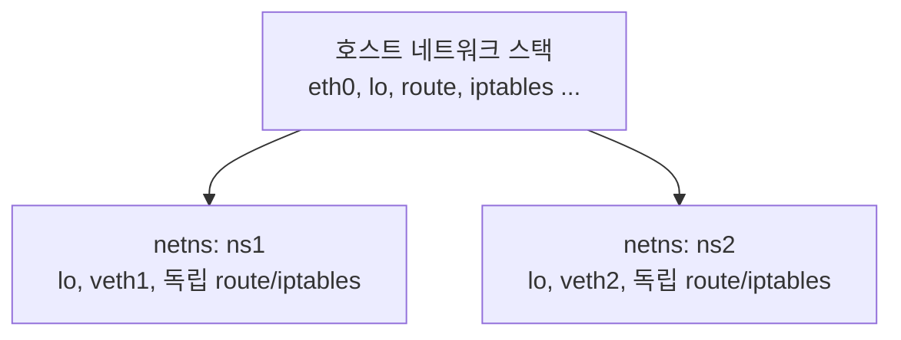
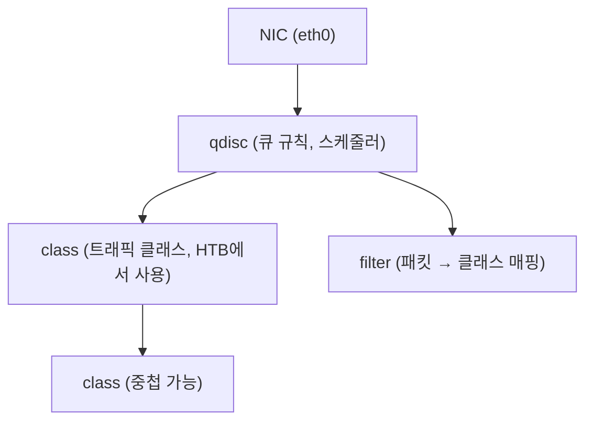

# iproute2 명령어 심화 (ip, ss, tc)

리눅스 네트워크 스택을 다루는 핵심 툴셋이다.
`net-tools`(ifconfig, netstat, route)는 오래전 deprecated되었고,
현재 모든 배포판은 `iproute2`를 기본으로 제공한다.

---

## net-tools vs iproute2

| 기능 | net-tools (구) | iproute2 (현재) |
|------|----------------|-----------------|
| 인터페이스 조회 | `ifconfig` | `ip link` / `ip addr` |
| 라우팅 테이블 | `route -n` | `ip route` |
| ARP 캐시 | `arp -n` | `ip neigh` |
| 소켓 정보 | `netstat -tulpn` | `ss -tulpn` |
| 터널/VLAN | 미지원 | `ip tunnel` / `ip link` |
| 정책 라우팅 | 미지원 | `ip rule` |
| 네트워크 네임스페이스 | 미지원 | `ip netns` |
| 트래픽 제어 | 미지원 | `tc` |
| 유지보수 상태 | ❌ deprecated | ✅ 활발히 개발 중 |

> `net-tools`는 2001년 이후 사실상 개발이 중단되었다.
> RHEL 8부터 기본 설치에서 제외되었으며, Debian/Ubuntu도
> 기본 포함을 중단했다.

---

## ip 명령어

### 기본 구조

```
ip [옵션] <오브젝트> <커맨드> [인수]
```

| 오브젝트 | 약어 | 역할 |
|---------|------|------|
| `link` | `l` | 인터페이스(L2) 관리 |
| `address` | `a` | IP 주소(L3) 관리 |
| `route` | `r` | 라우팅 테이블 |
| `rule` | `ru` | 정책 라우팅 규칙 |
| `neigh` | `n` | ARP / NDP 테이블 |
| `netns` | `netns` | 네트워크 네임스페이스 |

공통 옵션:

```bash
-4          # IPv4만
-6          # IPv6만
-s          # 통계 포함
-d          # 상세 정보 (details)
-j          # JSON 출력
-p          # pretty-print (JSON과 함께 사용)
-br         # brief 형식 (한 줄 요약)
```

---

### ip link — 인터페이스 관리

#### 인터페이스 목록 조회

```bash
# 전체 목록
ip link show

# brief 형식 (한 줄 요약)
ip -br link show

# 특정 인터페이스
ip link show eth0

# 타입별 필터
ip link show type bridge
ip link show type veth
```

출력 예시:

```
2: eth0: <BROADCAST,MULTICAST,UP,LOWER_UP> mtu 1500 qdisc mq
    link/ether 52:54:00:ab:cd:ef brd ff:ff:ff:ff:ff:ff
```

플래그 의미:

| 플래그 | 의미 |
|--------|------|
| `UP` | 인터페이스 활성화됨 |
| `LOWER_UP` | 물리 링크 연결됨 (cable on) |
| `BROADCAST` | 브로드캐스트 지원 |
| `MULTICAST` | 멀티캐스트 지원 |
| `PROMISC` | 무차별 모드 |
| `NO-CARRIER` | 케이블 없음 |

#### 인터페이스 활성화/비활성화

```bash
ip link set eth0 up
ip link set eth0 down
```

#### MTU 변경

```bash
# Jumbo Frame 설정 (스위치도 지원해야 함)
ip link set eth0 mtu 9000

# 확인
ip link show eth0 | grep mtu
```

#### MAC 주소 변경

```bash
# 인터페이스 down 후 변경
ip link set eth0 down
ip link set eth0 address 02:11:22:33:44:55
ip link set eth0 up
```

#### 무차별 모드 (패킷 캡처용)

```bash
ip link set eth0 promisc on
ip link set eth0 promisc off
```

#### 네트워크 네임스페이스로 인터페이스 이동

```bash
# veth0을 ns1 네임스페이스로 이동
ip link set veth0 netns ns1

# 컨테이너 PID로 이동 (Docker/K8s 내부 동작 원리)
ip link set veth0 netns 12345
```

#### VLAN 인터페이스 생성

```bash
# eth0.100 = eth0 + VLAN 100
ip link add link eth0 name eth0.100 type vlan id 100
ip link set eth0.100 up

# 삭제
ip link del eth0.100
```

#### dummy 인터페이스 (테스트용)

```bash
ip link add dummy0 type dummy
ip link set dummy0 up
ip addr add 192.168.99.1/32 dev dummy0
```

---

### ip addr — 주소 관리

#### 주소 조회

```bash
# 전체
ip addr show

# brief 형식
ip -br addr show

# 특정 인터페이스
ip addr show eth0

# IPv4만
ip -4 addr show
```

#### 주소 추가/삭제

```bash
# 단일 주소 추가
ip addr add 192.168.1.10/24 dev eth0

# 브로드캐스트 명시
ip addr add 192.168.1.10/24 brd + dev eth0

# 삭제
ip addr del 192.168.1.10/24 dev eth0

# 인터페이스의 모든 주소 삭제
ip addr flush dev eth0
```

#### 보조 주소 (Secondary Address)

하나의 인터페이스에 여러 IP를 할당할 때 사용한다.

```bash
# 첫 번째 주소 (primary)
ip addr add 192.168.1.10/24 dev eth0

# 두 번째 주소 (자동으로 secondary가 됨)
ip addr add 192.168.1.20/24 dev eth0

# secondary 여부 확인
ip addr show eth0
# "secondary" 키워드로 표시됨
```

#### 주소 레이블 (Label)

```bash
# 레이블 붙여서 추가
ip addr add 10.0.0.1/24 dev eth0 label eth0:vip

# ifconfig 호환용 레이블 형식
ip addr add 10.0.0.2/24 dev eth0 label eth0:0
```

---

### ip route — 라우팅 테이블

#### 라우팅 테이블 조회

```bash
# 기본 테이블 (table main)
ip route show

# 특정 테이블
ip route show table local
ip route show table 100

# 모든 테이블
ip route show table all

# 특정 목적지 조회
ip route get 8.8.8.8
```

`ip route get` 출력 예시:

```
8.8.8.8 via 192.168.1.1 dev eth0 src 192.168.1.10
    cache
```

#### 라우팅 규칙 추가/삭제

```bash
# 기본 게이트웨이 추가
ip route add default via 192.168.1.1

# 특정 네트워크 경로 추가
ip route add 10.0.0.0/8 via 172.16.0.1 dev eth1

# metric 지정 (낮을수록 우선)
ip route add default via 192.168.1.1 metric 100
ip route add default via 10.0.0.1 metric 200

# 특정 소스 IP 지정
ip route add 10.0.0.0/8 via 172.16.0.1 src 172.16.0.10

# 삭제
ip route del default via 192.168.1.1
ip route del 10.0.0.0/8

# flush
ip route flush table main
```

#### ECMP — 다중 경로 (Equal-Cost Multi-Path)

```bash
# 두 게이트웨이로 트래픽 분산
ip route add default \
  nexthop via 192.168.1.1 dev eth0 weight 1 \
  nexthop via 192.168.2.1 dev eth1 weight 1
```

#### 블랙홀 / 언리처블 라우팅

```bash
# 블랙홀 (조용히 드롭)
ip route add blackhole 192.168.99.0/24

# unreachable (ICMP 메시지 반환)
ip route add unreachable 192.168.99.0/24
```

---

### ip rule — 정책 라우팅

정책 라우팅은 **소스 IP, TOS, fwmark** 등을 기준으로
다른 라우팅 테이블을 적용하는 기능이다.

```
패킷 수신
  → ip rule 목록 순서대로 매칭
    → 매칭된 rule의 테이블에서 경로 조회
      → 경로 발견 시 사용
```

#### 기본 rule 목록

```bash
ip rule show
```

출력:

```
0:    from all lookup local     # 로컬 주소 (최우선)
32766: from all lookup main     # 일반 라우팅
32767: from all lookup default  # 폴백
```

#### 정책 라우팅 설정 예시

두 ISP를 동시에 사용하는 Multi-homing 시나리오:

```bash
# 테이블 이름 등록 (선택 사항)
echo "100 isp1" >> /etc/iproute2/rt_tables
echo "200 isp2" >> /etc/iproute2/rt_tables

# 각 테이블에 기본 게이트웨이 등록
ip route add default via 203.0.113.1 table isp1
ip route add default via 198.51.100.1 table isp2

# 소스 IP 기반 rule 추가
ip rule add from 203.0.113.2 table isp1 priority 100
ip rule add from 198.51.100.2 table isp2 priority 200

# fwmark 기반 (iptables와 연계)
ip rule add fwmark 1 table isp1
```

#### rule 삭제

```bash
ip rule del from 203.0.113.2 table isp1
```

---

### ip netns — 네트워크 네임스페이스

컨테이너 격리의 핵심 기술이다.
각 네임스페이스는 독립적인 네트워크 스택을 가진다.



#### 네임스페이스 생성 및 관리

```bash
# 생성
ip netns add ns1
ip netns add ns2

# 목록
ip netns list

# 삭제
ip netns del ns1
```

#### 네임스페이스 내 명령 실행

```bash
# 네임스페이스 내 인터페이스 조회
ip netns exec ns1 ip link show

# bash 셸 실행
ip netns exec ns1 bash

# ping 테스트
ip netns exec ns1 ping -c 3 8.8.8.8
```

#### veth 페어로 네임스페이스 연결

```bash
# veth 페어 생성
ip link add veth-ns1 type veth peer name veth-ns2

# 각 끝을 네임스페이스에 배치
ip link set veth-ns1 netns ns1
ip link set veth-ns2 netns ns2

# 각 네임스페이스에서 IP 할당 및 활성화
ip netns exec ns1 ip addr add 10.1.0.1/24 dev veth-ns1
ip netns exec ns1 ip link set veth-ns1 up
ip netns exec ns1 ip link set lo up

ip netns exec ns2 ip addr add 10.1.0.2/24 dev veth-ns2
ip netns exec ns2 ip link set veth-ns2 up
ip netns exec ns2 ip link set lo up

# 연결 테스트
ip netns exec ns1 ping -c 3 10.1.0.2
```

---

### ip neigh — ARP / NDP 테이블

```bash
# ARP 테이블 조회
ip neigh show

# 특정 인터페이스
ip neigh show dev eth0

# 특정 상태만 조회
ip neigh show nud reachable
ip neigh show nud stale
```

ARP 상태:

| 상태 | 의미 |
|------|------|
| `REACHABLE` | 최근 확인됨 (유효) |
| `STALE` | 오래됨 (다음 사용 시 재확인) |
| `DELAY` | 재확인 대기 중 |
| `PROBE` | ARP 요청 전송 중 |
| `FAILED` | 해석 실패 |
| `PERMANENT` | 정적 항목 |

```bash
# 정적 ARP 항목 추가
ip neigh add 192.168.1.100 lladdr 52:54:00:12:34:56 \
  dev eth0 nud permanent

# ARP 항목 삭제
ip neigh del 192.168.1.100 dev eth0

# 전체 플러시 (주의: 연결 끊김 위험)
ip neigh flush dev eth0
```

---

## ss 명령어

`ss`(socket statistics)는 `netstat`을 대체하는 소켓
조회 도구다. 커널 netlink 인터페이스를 직접 사용해
`netstat`보다 훨씬 빠르다.

### 기본 옵션

| 옵션 | 의미 |
|------|------|
| `-t` | TCP 소켓 |
| `-u` | UDP 소켓 |
| `-l` | LISTEN 상태만 |
| `-p` | 프로세스 정보 포함 |
| `-n` | 숫자 표시 (DNS 역조회 안 함) |
| `-s` | 통계 요약 |
| `-e` | 확장 정보 |
| `-i` | TCP 내부 정보 (cwnd, rtt 등) |
| `-4` / `-6` | IPv4 / IPv6만 |
| `-x` | Unix 도메인 소켓 |

### 자주 쓰는 조합

```bash
# LISTEN 중인 TCP/UDP 포트 (프로세스 포함)
ss -tulpn

# 모든 TCP 연결
ss -tan

# 연결 수 통계
ss -s

# 특정 포트 80 LISTEN 확인
ss -tlnp sport = :80
```

`ss -s` 출력 예시:

```
Total: 523
TCP:   45 (estab 12, closed 10, orphaned 0, timewait 10)
Transport Total     IP        IPv6
RAW       0         0         0
UDP       8         6         2
TCP       35        20        15
```

### 상태 필터링

```bash
# ESTABLISHED 상태만
ss -tn state established

# TIME-WAIT 소켓
ss -tn state time-wait

# LISTEN이 아닌 모든 상태
ss -tn state all

# 특정 상태 제외
ss -tn exclude time-wait
```

TCP 상태 목록:

```
established  syn-sent    syn-recv
fin-wait-1   fin-wait-2  time-wait
closed       close-wait  last-ack
listening    closing
```

### 주소/포트 필터링

```bash
# 목적지 포트 443
ss -tn dst :443

# 소스 포트 범위
ss -tn sport gt :1024

# 특정 IP와의 연결
ss -tn dst 192.168.1.100

# 특정 서브넷
ss -tn dst 10.0.0.0/8

# 복합 필터 (and/or)
ss -tn dst :443 and src 10.0.0.0/8
```

### 확장 정보 (-e, -i)

```bash
# 확장 정보 (uid, inode 등)
ss -tne

# TCP 내부 통계 (성능 분석용)
ss -tni
```

`ss -tni` 출력 예시:

```
State  Recv-Q  Send-Q  Local           Peer
ESTAB  0       0       10.0.0.1:22     10.0.0.2:54321
  cubic wscale:7,7 rto:204 rtt:0.8/0.4 ato:40
  mss:1448 pmtu:1500 rcvmss:536
  cwnd:10 ssthresh:2147483647
  bytes_sent:12345 bytes_retrans:0
  segs_out:100 segs_in:80
  send 144.8Mbps lastsnd:1 lastrcv:1 lastack:1
  pacing_rate 173.8Mbps delivery_rate 144.8Mbps
  delivered:80 app_limited
  rcv_rtt:0.875 rcv_space:14600 rcv_ssthresh:64088
  minrtt:0.758
```

주요 필드:

| 필드 | 의미 |
|------|------|
| `rtt` | 왕복 지연시간 (ms) |
| `cwnd` | 혼잡 윈도우 크기 |
| `ssthresh` | Slow Start 임계값 |
| `bytes_retrans` | 재전송 바이트 수 |
| `send` | 예상 전송 속도 |
| `pacing_rate` | 페이싱 속도 |

### netstat 대비 장점

| 항목 | netstat | ss |
|------|---------|-----|
| 속도 | 느림 (`/proc` 파싱) | 빠름 (netlink 직접) |
| 소켓 수 많을 때 | 수십 초 소요 가능 | 밀리초 단위 |
| TCP 내부 정보 | 없음 | `-i` 옵션으로 제공 |
| 필터링 | 제한적 | 풍부한 표현식 |
| 유지보수 | deprecated | 활발히 개발 중 |
| 패키지 | net-tools | iproute2 |

---

## tc 명령어

`tc`(traffic control)는 리눅스 커널의 QoS 서브시스템을
제어하는 도구다. 대역폭 제한, 지연 추가, 패킷 손실
시뮬레이션 등을 담당한다.

### 핵심 개념



| 구성요소 | 역할 |
|---------|------|
| `qdisc` | 큐 규칙. 패킷을 어떤 순서로 처리할지 결정 |
| `class` | qdisc 내의 트래픽 클래스 (HTB/CBQ에서 사용) |
| `filter` | 패킷을 특정 클래스로 분류 |

#### 주요 qdisc 종류

| qdisc | 특징 | 용도 |
|-------|------|------|
| `pfifo_fast` | 커널 기본값. 3밴드 FIFO | 일반 목적 |
| `fq_codel` | AQM. 지연 최소화 | 현대적 기본값 |
| `tbf` | Token Bucket Filter. 속도 제한 | 단순 rate limit |
| `htb` | Hierarchical Token Bucket | 계층적 대역폭 관리 |
| `netem` | 네트워크 에뮬레이션 | 테스트/개발 환경 |
| `sfq` | Stochastic Fair Queue | 공정 스케줄링 |

### 대역폭 제한 — tbf

TBF(Token Bucket Filter)는 단순하고 효율적인
속도 제한 방식이다.

```bash
# eth0 출력을 10Mbit/s로 제한
tc qdisc add dev eth0 root tbf \
  rate 10mbit \
  burst 32kbit \
  latency 400ms

# 확인
tc qdisc show dev eth0

# 삭제
tc qdisc del dev eth0 root
```

파라미터 설명:

| 파라미터 | 의미 |
|---------|------|
| `rate` | 평균 허용 전송 속도 |
| `burst` | 순간 버스트 허용 크기 |
| `latency` | 큐에 머무를 수 있는 최대 시간 |

### 계층적 대역폭 제한 — htb

HTB(Hierarchical Token Bucket)는 여러 트래픽 클래스에
대역폭을 유연하게 할당할 때 사용한다.

```bash
# root qdisc 설정
tc qdisc add dev eth0 root handle 1: htb default 30

# 총 대역폭 클래스 (1:1)
tc class add dev eth0 parent 1: classid 1:1 \
  htb rate 100mbit ceil 100mbit

# 고우선순위 트래픽 (1:10): 60Mbit 보장, 100Mbit 최대
tc class add dev eth0 parent 1:1 classid 1:10 \
  htb rate 60mbit ceil 100mbit prio 1

# 일반 트래픽 (1:20): 30Mbit 보장
tc class add dev eth0 parent 1:1 classid 1:20 \
  htb rate 30mbit ceil 100mbit prio 2

# 기본(default) 트래픽 (1:30)
tc class add dev eth0 parent 1:1 classid 1:30 \
  htb rate 10mbit ceil 100mbit prio 3

# 필터: SSH(22) → 고우선순위 클래스
tc filter add dev eth0 parent 1: protocol ip \
  u32 match ip dport 22 0xffff flowid 1:10

# 확인
tc qdisc show dev eth0
tc class show dev eth0
tc filter show dev eth0
```

### 네트워크 에뮬레이션 — netem

`netem`(Network Emulator)은 개발/테스트 환경에서
불안정한 네트워크 조건을 재현할 때 사용한다.

#### 지연 추가

```bash
# 100ms 고정 지연
tc qdisc add dev eth0 root netem delay 100ms

# 100ms ± 20ms 랜덤 지연
tc qdisc add dev eth0 root netem delay 100ms 20ms

# 지연에 상관관계 추가 (더 현실적)
tc qdisc add dev eth0 root netem delay 100ms 20ms 25%
```

#### 패킷 손실

```bash
# 10% 패킷 손실
tc qdisc add dev eth0 root netem loss 10%

# 손실에 상관관계 추가 (버스트 손실 시뮬레이션)
tc qdisc add dev eth0 root netem loss 5% 25%
```

#### 패킷 손상 (corrupt)

```bash
# 1% 패킷 비트 손상
tc qdisc add dev eth0 root netem corrupt 1%
```

#### 패킷 순서 뒤집기 (reorder)

```bash
# 25%의 패킷을 10ms 지연시켜 순서 변경
tc qdisc add dev eth0 root netem delay 10ms reorder 25% 50%
```

#### 복합 조건

```bash
# 지연 + 손실 + 손상 동시 적용
tc qdisc add dev eth0 root netem \
  delay 200ms 50ms \
  loss 5% \
  corrupt 0.1%
```

#### netem 수정 및 삭제

```bash
# 기존 설정 수정 (add → change)
tc qdisc change dev eth0 root netem delay 50ms

# 삭제
tc qdisc del dev eth0 root

# 현재 설정 확인
tc qdisc show dev eth0
```

### 통계 확인

```bash
# qdisc 통계 (sent, dropped, overlimits)
tc -s qdisc show dev eth0

# class 통계
tc -s class show dev eth0
```

출력 예시:

```
qdisc netem 8001: root refcnt 2 limit 1000 delay 100ms
 Sent 123456 bytes 1234 pkt (dropped 62, overlimits 0 requeues 0)
 backlog 0b 0p requeues 0
```

---

## 실전 시나리오

### 시나리오 1: 네임스페이스 격리 테스트 환경

컨테이너 네트워킹 동작을 호스트에서 직접 재현한다.

```bash
# 1. 네임스페이스 생성
ip netns add web
ip netns add db

# 2. 브리지 생성 (호스트)
ip link add br0 type bridge
ip link set br0 up
ip addr add 192.168.100.1/24 dev br0

# 3. veth 페어 생성 및 연결
# web 네임스페이스 연결
ip link add veth-web type veth peer name veth-web-br
ip link set veth-web netns web
ip link set veth-web-br master br0
ip link set veth-web-br up

# db 네임스페이스 연결
ip link add veth-db type veth peer name veth-db-br
ip link set veth-db netns db
ip link set veth-db-br master br0
ip link set veth-db-br up

# 4. 각 네임스페이스 IP 설정
ip netns exec web ip addr add 192.168.100.10/24 dev veth-web
ip netns exec web ip link set veth-web up
ip netns exec web ip link set lo up
ip netns exec web ip route add default via 192.168.100.1

ip netns exec db ip addr add 192.168.100.20/24 dev veth-db
ip netns exec db ip link set veth-db up
ip netns exec db ip link set lo up
ip netns exec db ip route add default via 192.168.100.1

# 5. 연결 테스트
ip netns exec web ping -c 3 192.168.100.20

# 6. 정리
ip netns del web
ip netns del db
ip link del br0
```

### 시나리오 2: 개발 환경 네트워크 품질 저하 테스트

```bash
# API 서버 eth0에 300ms 지연 + 2% 패킷 손실 적용
tc qdisc add dev eth0 root netem delay 300ms 50ms loss 2%

# 애플리케이션 동작 테스트 (타임아웃, 재시도 로직 검증)
curl -v --max-time 5 http://api.example.com/health

# 현재 적용된 설정 확인
tc qdisc show dev eth0

# 테스트 완료 후 원래대로 복구
tc qdisc del dev eth0 root
```

### 시나리오 3: 본딩/팀 인터페이스 확인

```bash
# 본딩 인터페이스 상태 확인
ip link show type bond

# 본딩 멤버 인터페이스 조회
ip link show master bond0

# 본딩 상세 정보 (커널 인터페이스)
cat /proc/net/bonding/bond0

# ss로 bond0 트래픽 확인
ss -tn src 192.168.1.10

# 본딩 생성 예시 (active-backup 모드)
ip link add bond0 type bond mode active-backup
ip link set eth0 master bond0
ip link set eth1 master bond0
ip link set bond0 up
ip addr add 192.168.1.10/24 dev bond0
```

본딩 모드:

| 모드 | 이름 | 특징 |
|------|------|------|
| 0 | `balance-rr` | 라운드로빈, 대역폭 향상 |
| 1 | `active-backup` | 장애 조치, 단일 활성 |
| 2 | `balance-xor` | XOR 해시 기반 분산 |
| 4 | `802.3ad` | LACP, 스위치 지원 필요 |
| 5 | `balance-tlb` | TX 로드밸런싱 |
| 6 | `balance-alb` | TX+RX 로드밸런싱 |

---

## 설정 영속화

`ip` 명령어 변경사항은 재부팅 시 사라진다.
영구 적용은 배포판별로 방법이 다르다.

| 배포판 | 방법 |
|--------|------|
| RHEL/Rocky | `/etc/sysconfig/network-scripts/` 또는 NetworkManager |
| Debian/Ubuntu | `/etc/network/interfaces` 또는 netplan |
| 모든 배포판 | `systemd-networkd` (`.network` 파일) |
| 코드 기반 | Ansible / Terraform (권장) |

---

## 참고 자료

- [iproute2 공식 문서](https://wiki.linuxfoundation.org/networking/iproute2)
  (확인: 2026-04-17)
- [Linux Advanced Routing & Traffic Control HOWTO](
  https://lartc.org/howto/)
  (확인: 2026-04-17)
- [ip-route(8) man page](
  https://man7.org/linux/man-pages/man8/ip-route.8.html)
  (확인: 2026-04-17)
- [ss(8) man page](
  https://man7.org/linux/man-pages/man8/ss.8.html)
  (확인: 2026-04-17)
- [tc-netem(8) man page](
  https://man7.org/linux/man-pages/man8/tc-netem.8.html)
  (확인: 2026-04-17)
- [tc-htb(8) — HTB 큐 디스크 사용법](
  https://man7.org/linux/man-pages/man8/tc-htb.8.html)
  (확인: 2026-04-17)
- [Linux Kernel: Bonding Driver](
  https://www.kernel.org/doc/Documentation/networking/bonding.txt)
  (확인: 2026-04-17)
- [Red Hat: net-tools deprecated](
  https://access.redhat.com/documentation/en-us/red_hat_enterprise_linux/8/html/configuring_and_managing_networking/index)
  (확인: 2026-04-17)
